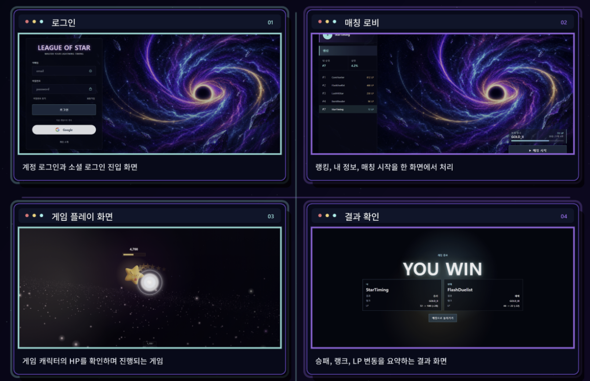
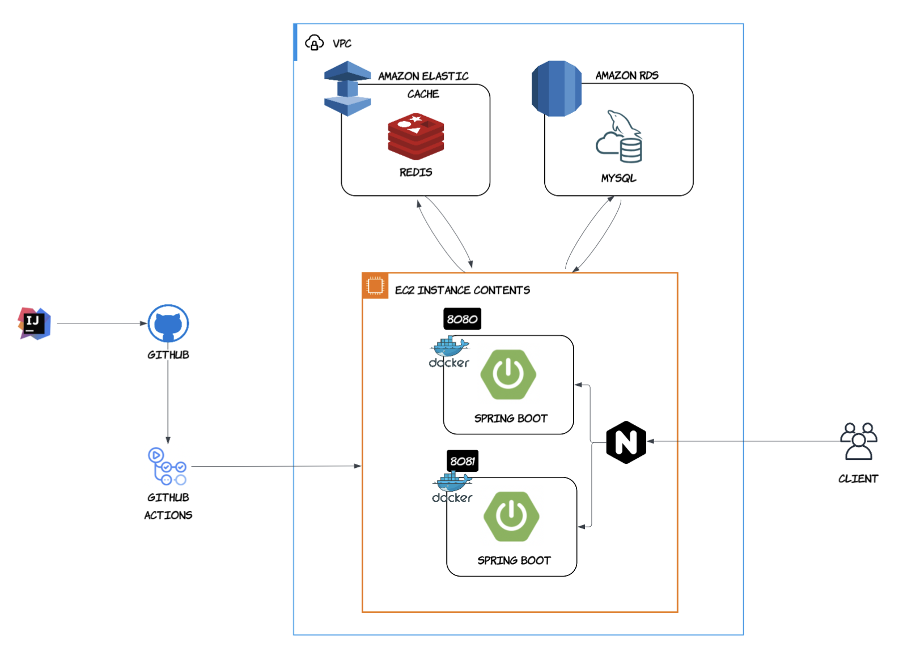
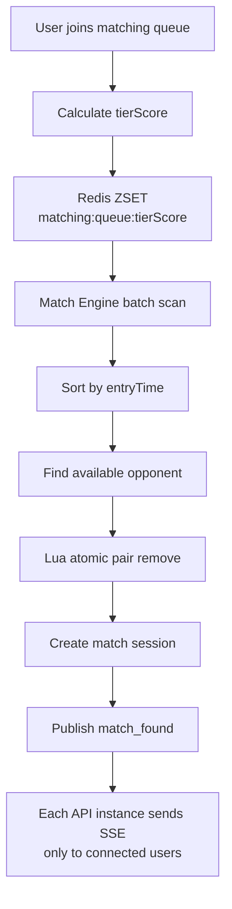
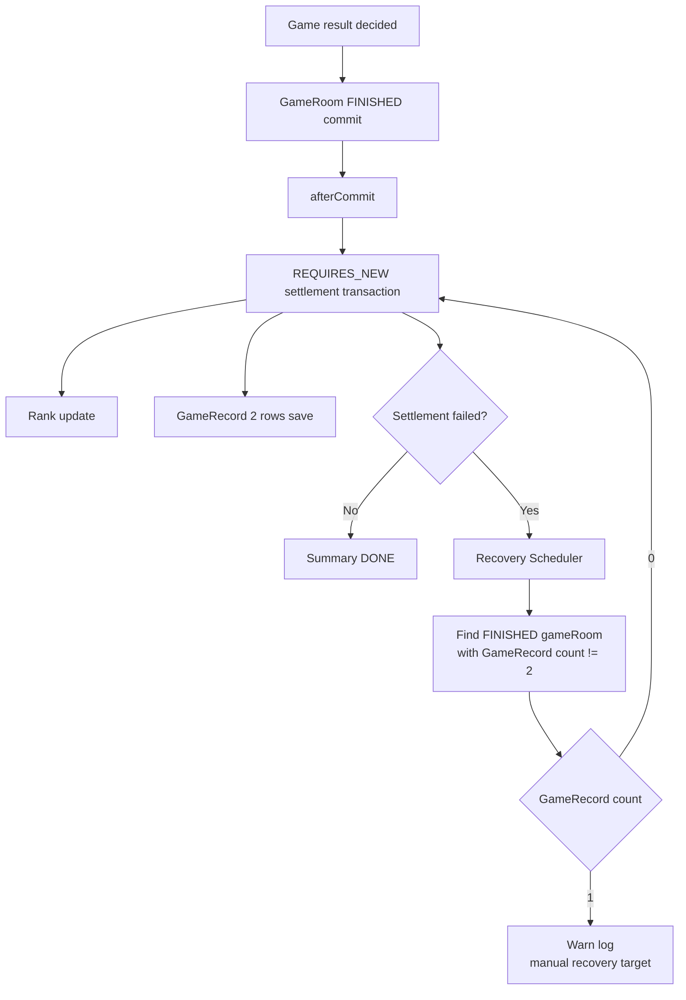
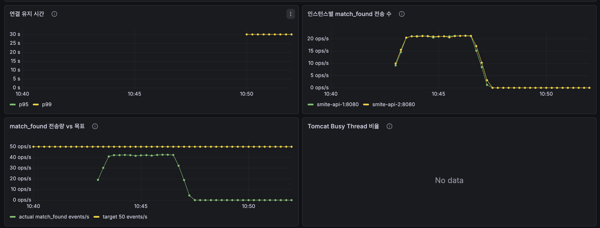
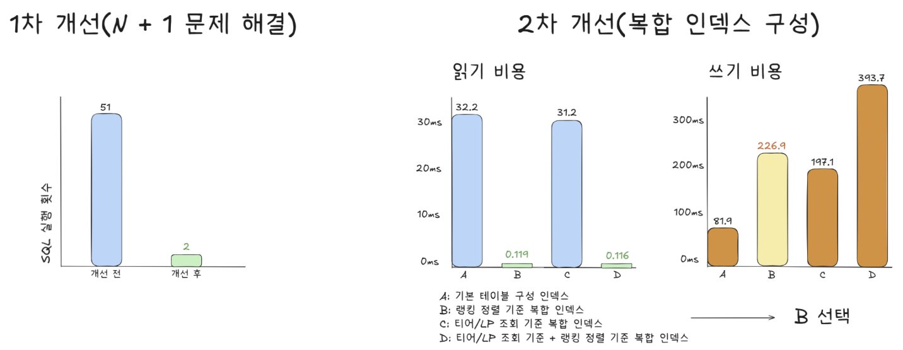
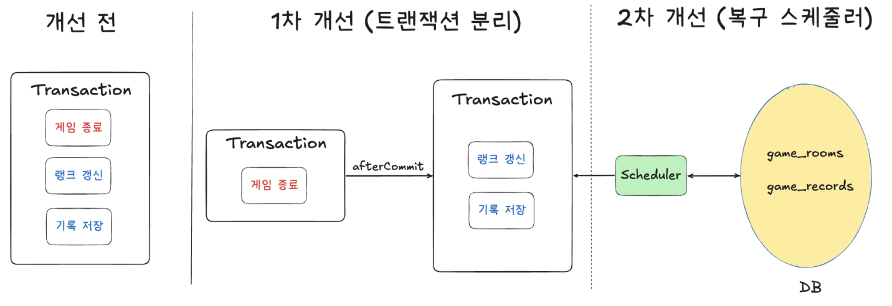

# League of Star



1:1 real-time reaction game with tier-based matchmaking, SSE notifications, WebSocket gameplay, ranking, and record settlement.

> prove your lightning timing

## Why I Started This Project

실시간 매칭, 수락/거절/timeout, WebSocket 게임 진행, 랭크 정산까지 이어지는 온라인 게임 서버의 핵심 흐름을 직접 설계하고 검증하기 위해 시작한 프로젝트입니다.

사용자는 매칭 대기열에 진입해 상대와 매칭되고, 수락 이후 WebSocket 기반 게임방에서 1:1 반응 속도 게임을 진행합니다. 게임 종료 후에는 랭크/LP와 전적이 정산되고, Top 랭킹 API를 통해 리더보드를 조회할 수 있습니다.

## Goal

- Redis 기반 실시간 매칭 큐와 멀티 인스턴스 SSE 알림 구조 구현
- WebSocket 기반 1:1 게임 진행과 결과 정산 흐름 구현
- 랭킹 조회, 전적 저장, 랭크/LP 정산의 DB 정합성 확보
- 부하 테스트 기반으로 병목을 확인하고 개선

## Tech Stack

### Backend

- Core: Java 17, Spring Boot 3.4, Spring MVC, Spring WebSocket
- Persistence: Spring Data JPA, Hibernate, MySQL
- Security: Spring Security, JWT, OAuth2 Client
- Realtime: SSE, WebSocket
- Matching: Redis ZSET, Redis Pub/Sub, Redisson, Lua Script
- Test & Docs: JUnit5, Spring REST Docs, restdocs-api-spec
- Monitoring & Load Test: Prometheus, Grafana, k6, Node load scripts

### Frontend

- Vue 3, TypeScript, Vite
- Vue Router
- EventSource, Native WebSocket
- HTML Video + Vue/CSS overlay

### Infra

- Docker Compose
- Nginx
- AWS EC2, RDS MySQL, ElastiCache Redis
- GitHub Actions

### AI Workflow

- Document-driven workflow: 프로젝트 컨벤션과 도메인 규칙을 먼저 문서화하고 AI 도구의 판단 기준으로 사용
- Rule-based coding: `.agents/rules`에 패키지 구조, 모듈 의존성, 테스트/문서화 기준을 정리
- Review support: 구현 후 테스트 케이스, 동시성 위험, DB 인덱스, 트랜잭션 경계를 점검하는 리뷰 보조 도구로 활용
- Context control: 전체 코드를 매번 전달하지 않고 관련 파일, diff, 로그, 실행 계획, 측정 결과 중심으로 컨텍스트를 압축해 비용과 응답 품질 관리

## System Architecture



### Module Direction

```text
league-of-star-api -> league-of-star-core
league-of-star-api -> league-of-star-matching
league-of-star-api -> league-of-star-infra-redis
league-of-star-matching -> league-of-star-core
league-of-star-matching -> league-of-star-infra-redis
league-of-star-infra-redis -> league-of-star-core
league-of-star-core -> independent domain module
```

`core` 모듈은 JPA/Hibernate 중심의 도메인 모듈로 유지하고, Web/SSE/Redis 같은 인프라 책임은 API와 Redis 인프라 모듈로 분리했습니다.

## Core Flow

### Matching Flow



### Game Settlement Flow



## Getting Started

### Backend

From project root:

```bash
cd backend && ./gradlew build -x test
```

Run local infrastructure:

```bash
docker compose -f infra/local/docker-compose-infra.yml up -d
```

Run two API instances:

```bash
docker compose -f infra/local/docker-compose-app.yml up -d --build
```

Run monitoring stack:

```bash
docker compose -f infra/local/docker-compose-monitoring.yml up -d
```

### Frontend

```bash
cd frontend
npm install
npm run dev
```

## Technical Decisions & Troubleshooting

### 1. Redis Matching Queue and Multi-instance SSE Notification

**Problem**

- DB polling 기반 매칭 큐는 실시간 1:1 매칭에서 경합과 부하가 커질 수 있음
- 매칭 취소와 매칭 성사가 동시에 발생하면 같은 유저가 중복 매칭될 수 있음
- SSE 연결은 각 API 인스턴스 메모리에 저장되므로, 매칭 이벤트 발생 인스턴스와 사용자가 연결된 인스턴스가 다르면 알림 누락 가능성 존재

**Solution**

- Redis ZSET을 `matching:queue:{tierScore}` 구조로 분리하고, score를 `entryTime`으로 사용해 FIFO 기반 큐 구성
- 대기 시간에 따라 허용 티어 범위를 점진 확장
- 서로 다른 tier queue에 있는 두 유저를 Lua Script로 원자적으로 제거
- Redis Pub/Sub으로 `match_found` 이벤트를 모든 API 인스턴스에 전파
- 각 인스턴스는 자기 메모리의 `SseConnectionRegistry`에 연결된 유저에게만 SSE 전송

**Result**

- Redis 기반 매칭 큐로 DB 부하 없이 실시간 매칭 처리 구조 확보
- 10,000명 burst 상황에서 원자 제거 실패율을 0%로 개선
- 10,000명 SSE 연결 및 `match_found` 이벤트 `10000/10000` 전달 확인



### 2. Top 50 Ranking API Optimization



**Problem**

- `UserRankInfo`는 `User` 연관관계를 갖지 않고 `userId`만 보유해, 랭킹 row마다 `findById()` 호출 시 애플리케이션 레벨 N+1 발생
- 정렬 인덱스가 없으면 Top 랭킹 조회 시 Sort 비용 발생
- 유사한 복합 인덱스를 여러 개 추가하면 랭크 정산 시 UPDATE 비용 증가

**Solution**

- Hibernate Statistics로 SQL 실행 횟수를 분석해 N+1 확인
- 조회된 랭킹 row의 `userId` 목록 수집 후 `findByIds()` batch 조회로 닉네임 매핑
- `EXPLAIN ANALYZE`로 Top 랭킹 SQL 실행 계획 분석
- 랭킹 정렬 기준의 컬럼 순서와 ASC/DESC 방향을 반영한 `idx_rank_order` 설계
- A/B/C/D 인덱스 구성별 Top 랭킹 조회 성능과 10,000건 UPDATE 비용 비교

**Result**

- SQL 실행 횟수: `51 -> 2`
- Top 랭킹 SQL 실행 시간: `32.2ms -> 0.119ms`
- API p95 응답 시간: `139.97ms -> 49.61ms`

### 3. Game Settlement Transaction Split and Idempotency



**Problem**

- 게임 종료 확정과 랭크/전적 정산을 하나의 트랜잭션에서 처리하면 정산 실패가 이미 결정된 `GameRoom FINISHED` 상태까지 롤백시킬 수 있음
- Rank 갱신과 `GameRecord` 저장은 함께 성공하거나 함께 실패해야 함
- 네트워크 재전송, API 재시도, 서버 중복 처리로 같은 `gameRoomId` 정산 요청이 반복될 수 있음

**Solution**

- `status = FINISHED`를 게임 종료의 기준으로 정의하고, 게임 종료 확정 트랜잭션과 정산 트랜잭션 분리
- `afterCommit`에 정산 작업을 등록해 `GameRoom FINISHED` commit 이후에만 정산 실행
- 정산 로직은 `afterCommit`과 Recovery Scheduler에서 모두 호출될 수 있으므로 `REQUIRES_NEW`로 독립적인 실패/재시도 단위 구성
- Rank 갱신과 `GameRecord` 저장은 원자적으로 묶여야 한다고 판단하여 하나의 정산 로직으로 구성
- 정산 기준 데이터와 변경 데이터가 모두 DB에 있으므로 Redis 분산락보다 DB row lock 선택
- `findByIdForUpdate()`로 `GameRoom` row에 `PESSIMISTIC_WRITE` lock 획득
- `game_records(game_room_id, user_id)` Unique Index로 동일 게임/동일 유저 record 중복 저장 차단
- Recovery Scheduler가 `FINISHED`지만 `GameRecord`가 정상 완료 기준인 2건이 아닌 gameRoom을 조회해 상태에 따라 처리

**Result**

- 정산 실패가 이미 확정된 `GameRoom FINISHED` 상태를 롤백하지 않도록 개선
- 게임 종료가 DB에 확정되지 않은 상태에서 랭크/전적이 먼저 반영되는 불일치 방지
- 비관락과 Unique Index로 중복 정산 요청에 대한 멱등성 확보
- Recovery Scheduler로 미정산 게임을 후속 복구할 수 있는 구조 확보

## Disclaimer

This project is a personal educational project built to learn real-time game server architecture, matching systems, transaction boundaries, and DB performance tuning.
