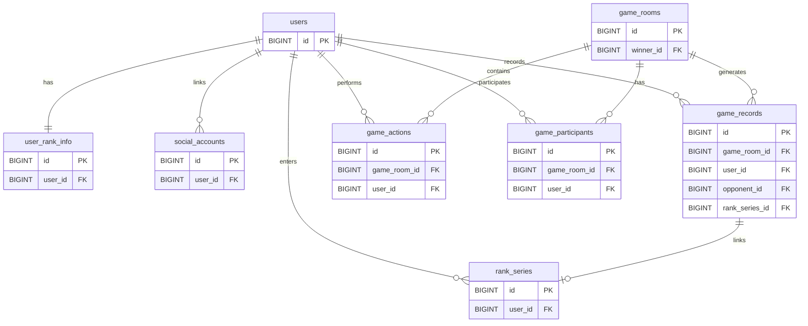
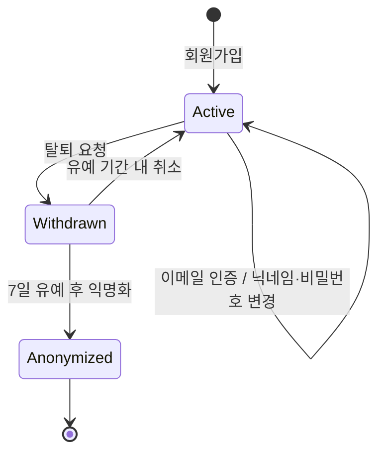
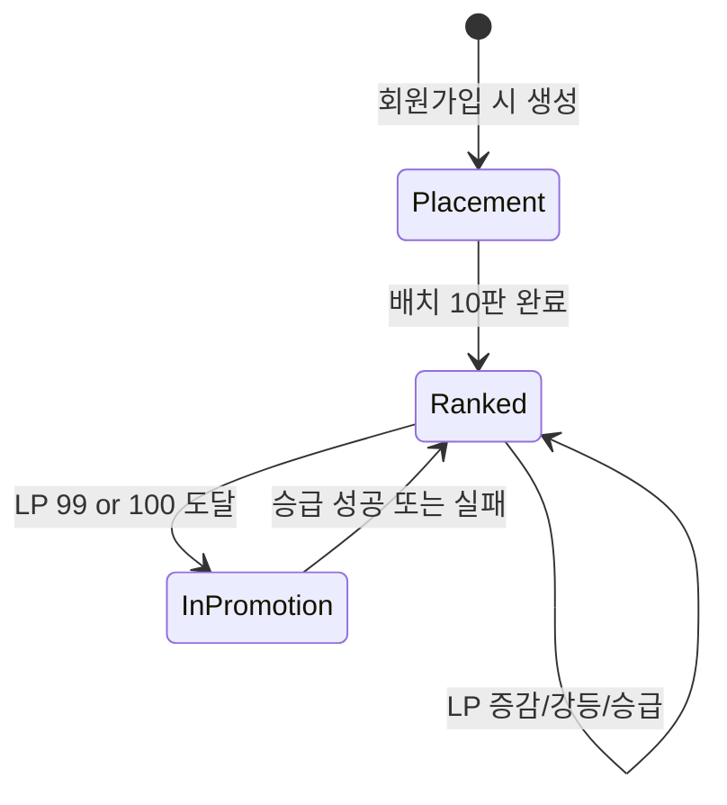
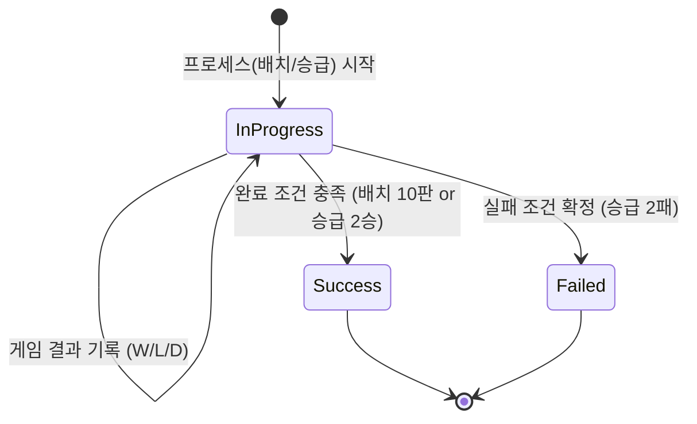
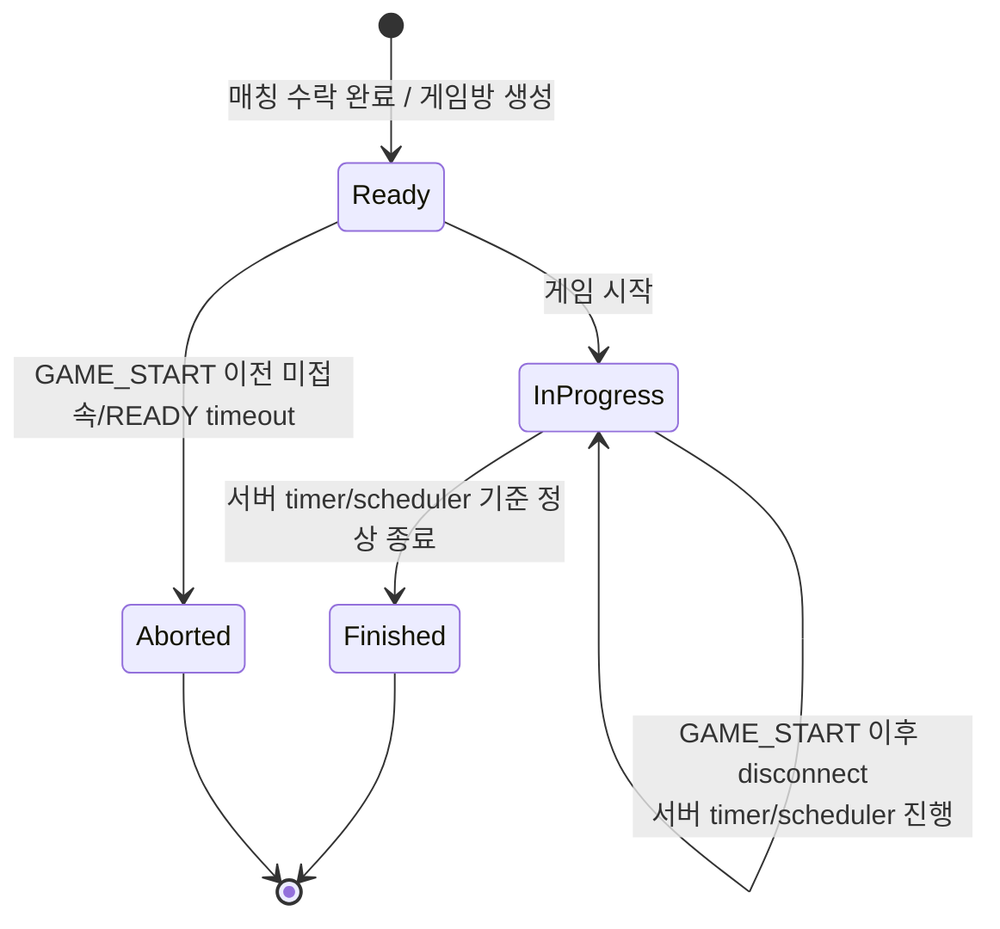

# League of Smite — Database Design (DDL)

---

## 1. 전체 테이블 구조도



> 컬럼 상세는 3 참고. ER 다이어그램은 관계 파악을 위해 PK/FK만 표시합니다.

---

## 2. 객체 생명주기

### 2.1 users



> **Soft Delete 전략**: 유저 행은 물리적으로 삭제하지 않습니다. 탈퇴 시 `status=WITHDRAWN`으로 마킹하고, 7일 유예 후 개인정보(email, nickname, password)를 마스킹하여 `status=ANONYMIZED`로 전환합니다. 전적 기록(game_records, game_rooms)의 FK 참조가 유지되므로 전적 보존과 익명화가 동시에 달성됩니다.

| 시점 | 동작 | 비고 |
|------|------|------|
| 회원가입 | INSERT | status=ACTIVE |
| 닉네임/비밀번호 변경 | UPDATE | updated_at 갱신 |
| 탈퇴 요청 | UPDATE | status=WITHDRAWN, withdrawn_at=NOW() |
| 탈퇴 취소 (7일 이내) | UPDATE | status=ACTIVE, withdrawn_at=NULL |
| 7일 유예 후 익명화 | UPDATE | status=ANONYMIZED, email·nickname·password 마스킹 |

### 2.2 social_accounts

| 시점 | 동작 | 비고 |
|------|------|------|
| 소셜 로그인 최초 연동 | INSERT | 이메일 기준 users와 매핑 |
| 연동 해제 | DELETE | 비밀번호 설정 후에만 가능 |
| 유저 탈퇴 | CASCADE DELETE | users 삭제 시 함께 삭제 |

### 2.3 user_rank_info



| 시점 | 동작 | 비고 |
|------|------|------|
| 회원가입 | INSERT | IRON IV, LP 0 (동시에 RankSeries 생성) |
| 게임 승리 | UPDATE | lp 증가, total_wins 증가 |
| 게임 패배 | UPDATE | lp 감소, total_losses 증가 |
| 게임 무승부 | UPDATE | total_draws 증가 (LP 변동 없음) |
| 시리즈(배치/승급) 성공 | UPDATE | tier/division/tier_score 변경, lp=0 |
| 강등 | UPDATE | tier/division/tier_score 변경, lp=75 |

### 2.4 rank_series (Placement & Promotion)



| 시점 | 동작 | 비고 |
|------|------|------|
| 프로세스 시작 | INSERT | type(PLACEMENT/PROMOTION), status=IN_PROGRESS |
| 경기 결과 반영 | UPDATE | wins / losses / draws 카운트 증가 |
| 조건 충족 시 | UPDATE | status=SUCCESS/FAILED, completed_at 기록 |

### 2.5 game_rooms



| 시점 | 동작 | 비고 |
|------|------|------|
| 매칭 수락 | INSERT | status=READY, scenario_data 생성, participants(READY) 추가 |
| 게임 시작 | UPDATE | status=IN_PROGRESS, participants(PLAYING), game_start_time 기록 |
| GAME_START 이전 timeout | UPDATE | status=ABORTED, participants(ABORTED 또는 DISCONNECTED), game_records/LP 미반영 |
| GAME_START 이후 disconnect | UPDATE 없음 또는 participant 상태만 DISCONNECTED. gameRoom은 IN_PROGRESS 유지 |
| 게임 종료 | UPDATE | 서버 timer/scheduler가 scenario와 game_actions 기준으로 status=FINISHED, result/winner_id, participants(FINISHED), finished_at |

### 2.6 game_actions — Immutable

| 시점 | 동작 | 비고 |
|------|------|------|
| 강타 입력 | INSERT | 서버 수신 시각, RTT 보정, HP 역산 결과 저장 |

- **불변(Immutable)**: 한번 기록되면 수정 없음
- **조건부 생성**: 강타 사용 시에만 생성 (미사용 시 행 없음)
- **게임당 최대 2행**: UK 제약으로 중복 방지

### 2.7 game_records — Immutable

| 시점 | 동작 | 비고 |
|------|------|------|
| 게임 종료 | INSERT (2행) | 양쪽 플레이어 각 1행 동시 생성 |

- **불변(Immutable)**: 전적 기록은 수정하지 않음
- **항상 2행 생성**: 각 참여자(Participant)의 관점에서 기록
- **LP/Rank 스냅샷**: lp_before/after와 함께 rank_before/after를 **JSON 스냅샷**으로 저장하여 변동 이력 추적
- **승급전 연동**: 배치/승급전 경기인 경우 `rank_series_id`를 기록하여 결과 정합성 보장

---

## 3. 테이블 상세 설계

> 모든 테이블에 `created_at`, `updated_at` 컬럼이 포함됩니다.

### 3.1 users — 계정 정보

| 컬럼 | 타입 | 제약 | 설명 |
|------|------|------|------|
| `id` | BIGINT | PK, AUTO_INCREMENT | 유저 고유 ID |
| `email` | VARCHAR(255) | UNIQUE, NOT NULL | 로그인 이메일 |
| `password` | VARCHAR(255) | NULLABLE | BCrypt 해시. 소셜 전용 계정은 NULL |
| `nickname` | VARCHAR(16) | UNIQUE, NOT NULL | 게임 닉네임 (2~16자) |
| `status` | VARCHAR(20) | NOT NULL, DEFAULT 'ACTIVE' | ACTIVE / WITHDRAWN / ANONYMIZED |
| `withdrawn_at` | DATETIME | NULLABLE | 탈퇴 요청 시각 (7일 유예 기준점, 30일 재가입 제한 기준) |
| `created_at` | DATETIME | NOT NULL | 가입일시 |
| `updated_at` | DATETIME | NOT NULL | 수정일시 |

```sql
CREATE TABLE users (
    id             BIGINT       NOT NULL AUTO_INCREMENT,
    email          VARCHAR(255) NOT NULL,
    password       VARCHAR(255) NULL,
    nickname       VARCHAR(16)  NOT NULL,
    status         VARCHAR(20)  NOT NULL DEFAULT 'ACTIVE',
    withdrawn_at   DATETIME     NULL,
    created_at     DATETIME     NOT NULL DEFAULT CURRENT_TIMESTAMP,
    updated_at     DATETIME     NOT NULL DEFAULT CURRENT_TIMESTAMP ON UPDATE CURRENT_TIMESTAMP,
    PRIMARY KEY (id),
    UNIQUE KEY uk_email (email),
    UNIQUE KEY uk_nickname (nickname),
    INDEX idx_status (status)
) ENGINE=InnoDB DEFAULT CHARSET=utf8mb4;
```

---

### 3.2 social_accounts — 소셜 로그인 연동

| 컬럼 | 타입 | 제약 | 설명 |
|------|------|------|------|
| `id` | BIGINT | PK, AUTO_INCREMENT | 고유 ID |
| `user_id` | BIGINT | FK → users, NOT NULL | 연동된 유저 |
| `provider` | VARCHAR(20) | NOT NULL | GOOGLE, DISCORD |
| `provider_id` | VARCHAR(255) | NOT NULL | 소셜 플랫폼 유저 ID |
| `provider_email` | VARCHAR(255) | NULLABLE | 소셜 플랫폼 이메일 |
| `created_at` | DATETIME | NOT NULL | 연동일시 |
| `updated_at` | DATETIME | NOT NULL | 수정일시 |

```sql
CREATE TABLE social_accounts (
    id              BIGINT       NOT NULL AUTO_INCREMENT,
    user_id         BIGINT       NOT NULL,
    provider        VARCHAR(20)  NOT NULL,
    provider_id     VARCHAR(255) NOT NULL,
    provider_email  VARCHAR(255) NULL,
    created_at      DATETIME     NOT NULL DEFAULT CURRENT_TIMESTAMP,
    updated_at      DATETIME     NOT NULL DEFAULT CURRENT_TIMESTAMP ON UPDATE CURRENT_TIMESTAMP,
    PRIMARY KEY (id),
    UNIQUE KEY uk_provider_provider_id (provider, provider_id),
    INDEX idx_user_id (user_id),
    CONSTRAINT fk_social_accounts_user FOREIGN KEY (user_id) REFERENCES users (id) ON DELETE CASCADE
) ENGINE=InnoDB DEFAULT CHARSET=utf8mb4;
```

---

### 3.3 user_rank_info — 랭크 정보

| 컬럼 | 타입 | 제약 | 설명 |
|------|------|------|------|
| `id` | BIGINT | PK, AUTO_INCREMENT | 고유 ID |
| `user_id` | BIGINT | FK → users, UNIQUE, NOT NULL | 유저 (1:1) |
| `tier` | VARCHAR(20) | NOT NULL | IRON ~ CHALLENGER |
| `division` | VARCHAR(5) | NULLABLE | I ~ IV (Apex는 NULL) |
| `lp` | INT | NOT NULL, DEFAULT 0 | 현재 LP |
| `tier_score` | INT | NULLABLE | 매칭용 점수 1~28 (Apex는 NULL, 비정규화) |
| `total_wins` | INT | NOT NULL, DEFAULT 0 | 총 승리 수 |
| `total_losses` | INT | NOT NULL, DEFAULT 0 | 총 패배 수 |
| `total_draws` | INT | NOT NULL, DEFAULT 0 | 총 무승부 수 |
| `created_at` | DATETIME | NOT NULL | 생성일시 |
| `updated_at` | DATETIME | NOT NULL | 최종 갱신일시 |

```sql
CREATE TABLE user_rank_info (
    id                BIGINT      NOT NULL AUTO_INCREMENT,
    user_id           BIGINT      NOT NULL,
    tier              VARCHAR(20) NOT NULL DEFAULT 'IRON',
    division          VARCHAR(5)  NULL     DEFAULT 'IV',
    lp                INT         NOT NULL DEFAULT 0,
    tier_score        INT         NULL     DEFAULT 1,
    total_wins        INT         NOT NULL DEFAULT 0,
    total_losses      INT         NOT NULL DEFAULT 0,
    total_draws       INT         NOT NULL DEFAULT 0,
    created_at        DATETIME    NOT NULL DEFAULT CURRENT_TIMESTAMP,
    updated_at        DATETIME    NOT NULL DEFAULT CURRENT_TIMESTAMP ON UPDATE CURRENT_TIMESTAMP,
    PRIMARY KEY (id),
    UNIQUE KEY uk_user_id (user_id),
    INDEX idx_tier_score_lp (tier_score, lp),
    INDEX idx_tier_division_lp (tier, division, lp),
    CONSTRAINT fk_user_rank_info_user FOREIGN KEY (user_id) REFERENCES users (id) ON DELETE CASCADE
) ENGINE=InnoDB DEFAULT CHARSET=utf8mb4;
```

> **인덱스 설명**
> - `idx_tier_score_lp`: 티어 점수 기반 매칭/랭크 조회용
> - `idx_tier_division_lp`: 리더보드 정렬용
>
> 현재 애플리케이션의 매칭 진입 경로는 `UserRankInfo.getTierScore()`가 embedded `Rank`에서 계산한 값을 사용합니다. 일반 티어는 Iron IV(1) ~ Diamond I(28) 점수로 매칭되며, Apex LP 근접 매칭과 배치 유저의 Silver IV ~ Gold IV 구간 보정은 아직 별도 구현되지 않았습니다.

---

### 3.4 rank_series — 배치/승급전 진행 상태

| 컬럼 | 타입 | 제약 | 설명 |
|------|------|------|------|
| `id` | BIGINT | PK, AUTO_INCREMENT | 고유 ID |
| `user_id` | BIGINT | FK → users, NOT NULL | 대상 유저 |
| `type` | VARCHAR(20) | NOT NULL | PLACEMENT / PROMOTION |
| `target_tier` | VARCHAR(20) | NULLABLE | 승급 목표 티어 (배치 시 NULL) |
| `target_division` | VARCHAR(5) | NULLABLE | 승급 목표 디비전 |
| `wins` | INT | NOT NULL, DEFAULT 0 | 시리즈 내 승리 수 |
| `losses` | INT | NOT NULL, DEFAULT 0 | 시리즈 내 패배 수 |
| `draws` | INT | NOT NULL, DEFAULT 0 | 시리즈 내 무승부 수 |
| `total_games_required` | INT | NOT NULL | 필요 게임 수 (10 또는 3) |
| `status` | VARCHAR(20) | NOT NULL, DEFAULT 'IN_PROGRESS' | IN_PROGRESS / SUCCESS / FAILED |
| `completed_at` | DATETIME | NULLABLE | 시리즈 완료일시 |
| `created_at` | DATETIME | NOT NULL | 시리즈 시작일시 |
| `updated_at` | DATETIME | NOT NULL | 수정일시 |

```sql
CREATE TABLE rank_series (
    id                    BIGINT      NOT NULL AUTO_INCREMENT,
    user_id               BIGINT      NOT NULL,
    type                  VARCHAR(20) NOT NULL,
    target_tier           VARCHAR(20) NULL,
    target_division       VARCHAR(5)  NULL,
    wins                  INT         NOT NULL DEFAULT 0,
    losses                INT         NOT NULL DEFAULT 0,
    draws                 INT         NOT NULL DEFAULT 0,
    total_games_required  INT         NOT NULL,
    status                VARCHAR(20) NOT NULL DEFAULT 'IN_PROGRESS',
    completed_at          DATETIME    NULL,
    created_at            DATETIME    NOT NULL DEFAULT CURRENT_TIMESTAMP,
    updated_at            DATETIME    NOT NULL DEFAULT CURRENT_TIMESTAMP ON UPDATE CURRENT_TIMESTAMP,
    PRIMARY KEY (id),
    INDEX idx_user_id_status (user_id, status),
    CONSTRAINT fk_rank_series_user FOREIGN KEY (user_id) REFERENCES users (id) ON DELETE CASCADE
) ENGINE=InnoDB DEFAULT CHARSET=utf8mb4;
```

---

### 3.5 game_rooms — 게임 방

| 컬럼 | 타입 | 제약 | 설명 |
|------|------|------|------|
| `id` | BIGINT | PK, AUTO_INCREMENT | 게임 고유 ID |
| `status` | VARCHAR(20) | NOT NULL | READY / IN_PROGRESS / FINISHED / ABORTED |
| `result` | VARCHAR(20) | NULLABLE | PLAYER1_WIN / PLAYER2_WIN / DRAW |
| `winner_id` | BIGINT | FK → users, NULLABLE | 승자 (무승부 시 NULL) |
| `dragon_max_hp` | INT | NOT NULL, DEFAULT 10000 | 드래곤 초기 HP |
| `duration_seconds` | INT | NOT NULL | 게임 시간 (8~17) |
| `scenario_data` | JSON | NOT NULL | HP 감소 시나리오 스냅샷 |
| `game_start_time` | DATETIME(3) | NULLABLE | 게임 실제 시작 시각 (ms 정밀도) |
| `finished_at` | DATETIME | NULLABLE | 게임 종료일시 |
| `created_at` | DATETIME | NOT NULL | 방 생성일시 |
| `updated_at` | DATETIME | NOT NULL | 수정일시 |

```sql
CREATE TABLE game_rooms (
    id                 BIGINT      NOT NULL AUTO_INCREMENT,
    status             VARCHAR(20) NOT NULL DEFAULT 'READY',
    result             VARCHAR(20) NULL,
    winner_id          BIGINT      NULL,
    dragon_max_hp      INT         NOT NULL DEFAULT 10000,
    duration_seconds   INT         NOT NULL,
    scenario_data      JSON        NOT NULL,
    game_start_time    DATETIME(3) NULL,
    finished_at        DATETIME    NULL,
    created_at         DATETIME    NOT NULL DEFAULT CURRENT_TIMESTAMP,
    updated_at         DATETIME    NOT NULL DEFAULT CURRENT_TIMESTAMP ON UPDATE CURRENT_TIMESTAMP,
    PRIMARY KEY (id),
    INDEX idx_status (status),
    CONSTRAINT fk_game_rooms_winner FOREIGN KEY (winner_id) REFERENCES users (id) ON DELETE RESTRICT
) ENGINE=InnoDB DEFAULT CHARSET=utf8mb4;
```

---

### 3.6 game_participants — 게임 참여자

| 컬럼 | 타입 | 제약 | 설명 |
|------|------|------|------|
| `id` | BIGINT | PK, AUTO_INCREMENT | 고유 ID |
| `game_room_id` | BIGINT | FK → game_rooms, NOT NULL | 소속 게임방 |
| `user_id` | BIGINT | FK → users, NOT NULL | 참여 유저 |
| `status` | VARCHAR(20) | NOT NULL | READY / PLAYING / FINISHED / DISCONNECTED / ABORTED |
| `created_at` | DATETIME | NOT NULL | 참여일시 |
| `updated_at` | DATETIME | NOT NULL | 수정일시 |

```sql
CREATE TABLE game_participants (
    id             BIGINT      NOT NULL AUTO_INCREMENT,
    game_room_id   BIGINT      NOT NULL,
    user_id        BIGINT      NOT NULL,
    status         VARCHAR(20) NOT NULL DEFAULT 'READY',
    created_at     DATETIME    NOT NULL DEFAULT CURRENT_TIMESTAMP,
    updated_at     DATETIME    NOT NULL DEFAULT CURRENT_TIMESTAMP ON UPDATE CURRENT_TIMESTAMP,
    PRIMARY KEY (id),
    UNIQUE KEY uk_room_user (game_room_id, user_id),
    CONSTRAINT fk_participants_room FOREIGN KEY (game_room_id) REFERENCES game_rooms (id) ON DELETE CASCADE,
    CONSTRAINT fk_participants_user FOREIGN KEY (user_id)      REFERENCES users (id) ON DELETE RESTRICT
) ENGINE=InnoDB DEFAULT CHARSET=utf8mb4;
```

> **game_start_time이 DATETIME(3)인 이유**: ms 단위 정밀도 필요 (1ms 차이로 승패 결정)

---

### 3.7 game_actions — 강타 액션 기록

| 컬럼 | 타입 | 제약 | 설명 |
|------|------|------|------|
| `id` | BIGINT | PK, AUTO_INCREMENT | 고유 ID |
| `game_room_id` | BIGINT | FK → game_rooms, NOT NULL | 게임 방 |
| `user_id` | BIGINT | FK → users, NOT NULL | 강타 사용 유저 |
| `server_receive_time_ms` | BIGINT | NOT NULL | 서버 수신 시각 (epoch ms) |
| `rtt_ms` | INT | NOT NULL | 측정된 RTT (ms) |
| `smite_time_ms` | INT | NOT NULL | 보정된 강타 시점 (게임 시작 기준 ms) |
| `dragon_hp_at_smite` | INT | NOT NULL | 역산된 드래곤 HP |
| `is_kill` | BOOLEAN | NOT NULL | 킬 성공 여부 (HP 1200 이하) |
| `created_at` | DATETIME | NOT NULL | 기록일시 |
| `updated_at` | DATETIME | NOT NULL | 수정일시 |

```sql
CREATE TABLE game_actions (
    id                      BIGINT   NOT NULL AUTO_INCREMENT,
    game_room_id            BIGINT   NOT NULL,
    user_id                 BIGINT   NOT NULL,
    server_receive_time_ms  BIGINT   NOT NULL,
    rtt_ms                  INT      NOT NULL,
    smite_time_ms           INT      NOT NULL,
    dragon_hp_at_smite      INT      NOT NULL,
    is_kill                 BOOLEAN  NOT NULL,
    created_at              DATETIME NOT NULL DEFAULT CURRENT_TIMESTAMP,
    updated_at              DATETIME NOT NULL DEFAULT CURRENT_TIMESTAMP ON UPDATE CURRENT_TIMESTAMP,
    PRIMARY KEY (id),
    UNIQUE KEY uk_game_room_user (game_room_id, user_id),
    CONSTRAINT fk_game_actions_room FOREIGN KEY (game_room_id) REFERENCES game_rooms (id) ON DELETE RESTRICT,
    CONSTRAINT fk_game_actions_user FOREIGN KEY (user_id)      REFERENCES users (id) ON DELETE RESTRICT
) ENGINE=InnoDB DEFAULT CHARSET=utf8mb4;
```

> **uk_game_room_user**: 한 게임에서 유저당 강타 1회만 → 유니크 제약으로 DB 레벨 보장

---

### 3.8 game_records — 전적 기록

| 컬럼 | 타입 | 제약 | 설명 |
|------|------|------|------|
| `id` | BIGINT | PK, AUTO_INCREMENT | 고유 ID |
| `game_room_id` | BIGINT | FK → game_rooms, NOT NULL | 게임 방 |
| `user_id` | BIGINT | FK → users, NOT NULL | 해당 유저 |
| `opponent_id` | BIGINT | FK → users, NOT NULL | 상대방 |
| `rank_series_id` | BIGINT | FK → rank_series, NULLABLE | 연관된 배치/승급전 |
| `result` | VARCHAR(10) | NOT NULL | WIN / LOSS / DRAW |
| `lp_change` | INT | NOT NULL | LP 변동량 |
| `lp_before` | INT | NOT NULL | 게임 전 LP |
| `lp_after` | INT | NOT NULL | 게임 후 LP |
| `rank_before` | JSON | NOT NULL | 게임 전 랭크 스냅샷 (Tier + Division) |
| `rank_after` | JSON | NOT NULL | 게임 후 랭크 스냅샷 (Tier + Division) |
| `is_series_game` | BOOLEAN | NOT NULL, DEFAULT FALSE | 배치/승급전 경기 여부 |
| `created_at` | DATETIME | NOT NULL | 기록일시 |
| `updated_at` | DATETIME | NOT NULL | 수정일시 |

```sql
CREATE TABLE game_records (
    id                BIGINT      NOT NULL AUTO_INCREMENT,
    game_room_id      BIGINT      NOT NULL,
    user_id           BIGINT      NOT NULL,
    opponent_id       BIGINT      NOT NULL,
    rank_series_id    BIGINT      NULL,
    result            VARCHAR(10) NOT NULL,
    lp_change         INT         NOT NULL,
    lp_before         INT         NOT NULL,
    lp_after          INT         NOT NULL,
    rank_before       JSON        NOT NULL,
    rank_after        JSON        NOT NULL,
    is_series_game    BOOLEAN     NOT NULL DEFAULT FALSE,
    created_at        DATETIME    NOT NULL DEFAULT CURRENT_TIMESTAMP,
    updated_at        DATETIME    NOT NULL DEFAULT CURRENT_TIMESTAMP ON UPDATE CURRENT_TIMESTAMP,
    PRIMARY KEY (id),
    UNIQUE KEY uk_game_room_user (game_room_id, user_id),
    INDEX idx_user_id_created (user_id, created_at DESC),
    INDEX idx_user_id_result (user_id, result),
    CONSTRAINT fk_game_records_room      FOREIGN KEY (game_room_id) REFERENCES game_rooms (id) ON DELETE RESTRICT,
    CONSTRAINT fk_game_records_user      FOREIGN KEY (user_id)      REFERENCES users (id) ON DELETE RESTRICT,
    CONSTRAINT fk_game_records_series    FOREIGN KEY (rank_series_id) REFERENCES rank_series (id) ON DELETE SET NULL
) ENGINE=InnoDB DEFAULT CHARSET=utf8mb4;
```

> **인덱스 설명**
> - `idx_user_id_created`: 유저 전적 최신순 조회 (프로필 페이지)
> - `idx_user_id_result`: 유저별 승/패/무 카운트 집계

---

## 4. Redis 저장 구조 (참고)

MySQL이 아닌 **Redis에서 관리**하는 데이터입니다.

현재 구현된 Redis 구조:

| 키 패턴 | 타입 | 용도 | TTL |
|--------|------|------|-----|
| `matching:queue:{tierScore}` | Sorted Set | 티어별 매칭 큐. score = `entryTime`, member = `userId` | - |
| `match:status:{userId}` | String | 유저 매칭 상태 (`MATCHING`, `FOUND`, `ACCEPTED`, `DECLINED`, `TIMEOUT`, `IN_GAME`) | 30분 |
| `match:session:{matchId}` | Hash | 매칭 성사 후 수락/거절 세션. 세션 TTL은 cleanup 실패 대비 안전장치 | 60분 |
| `match:response:timeout:pending` | Sorted Set | 아직 scheduler가 claim하지 않은 응답 timeout 후보. score = `deadlineMillis` | - |
| `match:response:timeout:processing` | Sorted Set | scheduler가 claim해 처리 중인 timeout job. score = processing lease 만료 시각 | - |
| `refreshToken:{userId}` | RedisHash | Refresh Token 저장. `token` 필드는 secondary index로 조회 | refresh token 만료 시간 |

> 매칭 응답 완료 전 상태는 Redis가 관리합니다. 양쪽 수락 후 게임 세션 생성과 `game_rooms` 기록은 후속 게임 흐름에서 처리합니다.

후속 게임 흐름에서 사용할 예정인 Redis 구조:

| 키 패턴 | 타입 | 용도 | TTL |
|--------|------|------|-----|
| `game:session:{gameRoomId}` | Hash | 진행 중 게임 세션 | 60초 |
| `rtt:{userId}:{gameRoomId}` | List | RTT 측정값 (5개) | 60초 |

---

## 5. 테이블 요약

| # | 테이블 | 행 수 증가 패턴 | 가변/불변 | 설명 |
|---|--------|----------------|----------|------|
| 1 | `users` | 유저당 1행 | Mutable (Soft Delete) | 계정 정보 — 탈퇴 시 익명화 보존 |
| 2 | `social_accounts` | 유저당 0~2행 | 생성/삭제 | 소셜 연동 |
| 3 | `user_rank_info` | 유저당 1행 | Mutable | 현재 랭크 (매 게임마다 갱신) |
| 4 | `rank_series` | 배치/승급전마다 1행 | 진행 중 Mutable → 완료 후 Immutable | 배치/승급전 통합 시리즈 |
| 5 | `game_rooms` | 게임당 1행 | 진행 중 Mutable → 종료 후 Immutable | 게임 메타데이터 + 시나리오 |
| 6 | `game_participants` | 게임당 2행 | 진행 중 Mutable → 종료 후 Immutable | 게임 참여자 상태 |
| 7 | `game_actions` | 게임당 0~2행 | **Immutable** | 강타 판정 상세 기록 |
| 8 | `game_records` | 게임당 2행 | **Immutable** | 전적 기록 (LP 변동 포함) |

---

## 변경 이력

| 날짜 | 변경 내용 |
|------|----------|
| 2026-04-17 | 초안 작성 — 7개 테이블 + Redis 저장 구조 |
| 2026-04-17 | Mermaid ER 파싱 오류 수정, 객체 생명주기 섹션 추가 |
| 2026-04-17 | 모든 테이블에 created_at/updated_at 통일, promotion_series.wins 제거, ER 다이어그램 PK/FK만 표시로 축소 |
| 2026-04-18 | Soft Delete 전환: users에 status/withdrawn_at 추가, 탈퇴 익명화 생명주기 반영, FK ON DELETE RESTRICT 명시, demotion_shield 승리 시 해제 추가 |
| 2026-05-13 | 현재 구현 기준으로 rank_series 명칭, Redis 매칭 키, match_response timeout index, game_rooms READY 상태, 테이블 요약 정합성 수정 |
| 2026-05-18 | GAME_START 이전 timeout은 ABORTED 및 record/LP 미반영, GAME_START 이후 disconnect는 서버 timer/scheduler 기준 FINISHED로 종료하도록 game_rooms 생명주기 수정 |
