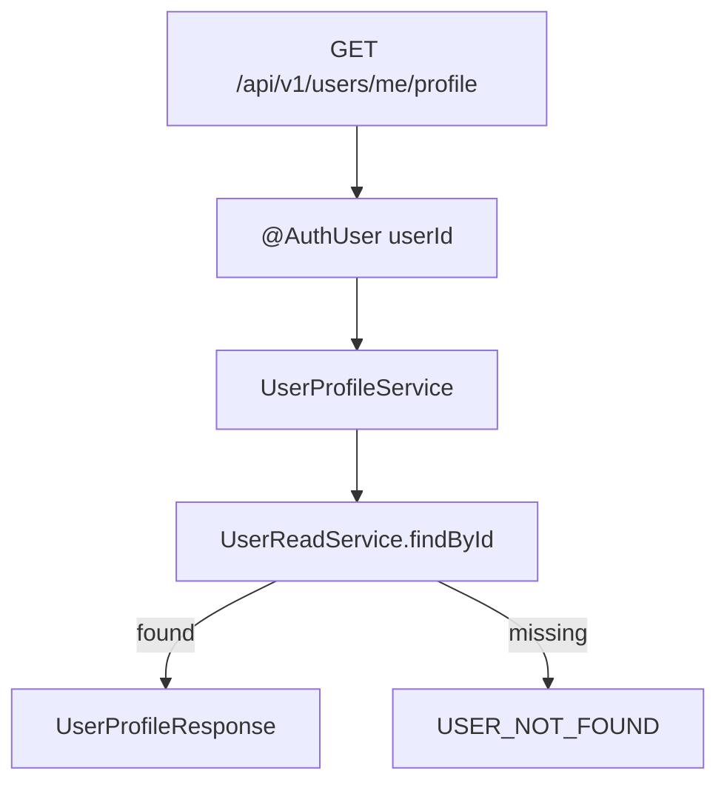
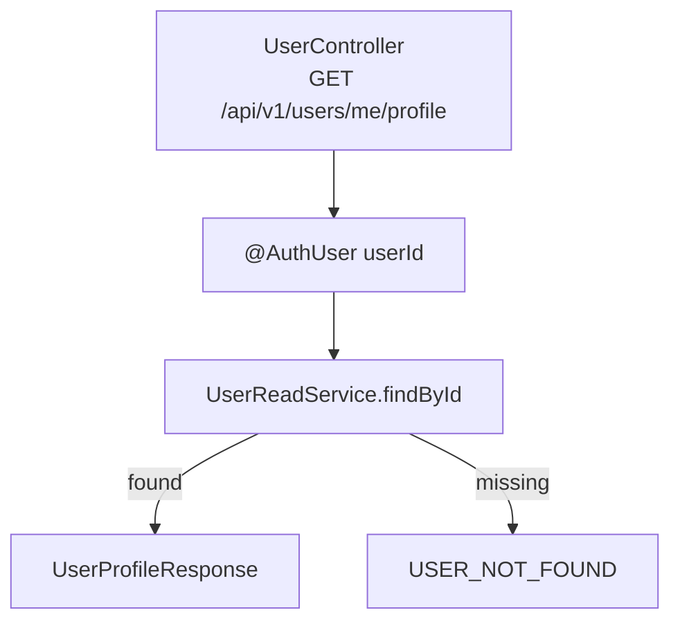

# Issue 104. 내 프로필 조회 API

## 📌 Feature Description

로그인한 사용자의 기본 프로필 정보를 조회하는 API를 구현한다.

이번 API는 user/account 도메인의 source of truth이며, MatchPage와 ProfilePage에서 닉네임, 이메일, 가입일 같은 기본 사용자 정보를 표시하기 위해 사용한다.

랭크, LP, 승패, 전적, avatarUrl은 이번 API에 포함하지 않는다. 랭크와 전적은 각각 별도 API에서 조회한다.



핵심 정책은 다음과 같다.

- 프로필 API는 `user/account` 도메인의 기본 정보만 반환한다.
- `core` 모듈의 `User` 엔티티가 프로필 정보의 source of truth다.
- API 모듈은 사용자가 만들어둔 `com.sang.leagueofstar.user` 패키지 안에서 작업한다.
- API path는 `common/path/user/UserPath`에 상수화한다.
- 인증 사용자 식별은 기존 `@AuthUser Long userId` 정책을 따른다.
- `UserController`에서 profile 조회 endpoint를 관리한다.
- `UserReadService.findById(userId)`로 온전한 User 객체를 조회한다.
- User 없음 판단과 `CoreException(CoreErrorCode.USER_NOT_FOUND)` 처리는 core `UserReadService`가 담당한다.
- `avatarUrl`은 현재 `User` 엔티티에 없으므로 이번 응답에서 제외한다.
- `rank`, `lp`, `wins`, `losses`, `draws`는 rank/stat 도메인이므로 이번 응답에서 제외한다.
- core `User` 엔티티와 DB schema는 이번 이슈에서 변경하지 않는다.
- 새 패키지를 추가하지 않는다.
- 이번 작업은 자동 커밋하지 않고 사용자 확인 후 커밋한다.

## Backend Contract

### Request

```http
GET /api/v1/users/me/profile
Authorization: Bearer {accessToken}
```

### Response

```json
{
  "userId": 1,
  "email": "test@example.com",
  "nickname": "테스터",
  "createdAt": "2026-06-12T10:00:00"
}
```

### Field Policy

| field | 포함 여부 | 이유 |
|-------|-----------|------|
| `userId` | 포함 | 프론트가 현재 로그인 사용자 식별에 사용 |
| `email` | 포함 | 계정 기본 정보 |
| `nickname` | 포함 | MatchPage/ProfilePage 표시 정보 |
| `createdAt` | 포함 | 가입일/계정 생성일 표시 정보 |
| `password` | 제외 | 민감 정보 |
| `status` | 제외 | 내부 계정 상태 |
| `withdrawnAt` | 제외 | 내부 탈퇴 처리 상태 |
| `updatedAt` | 제외 | 현재 프로필 표시 요구사항 아님 |
| `avatarUrl` | 제외 | 현재 `User` 엔티티에 없는 필드 |
| `rank`, `lp`, `wins`, `losses`, `draws` | 제외 | rank/stat 도메인 응답에서 제공 |

### Error

- 인증 없음/만료/유효하지 않은 token은 기존 security/auth error response를 따른다.
- 인증된 `userId`에 해당하는 User가 없으면 `CoreErrorCode.USER_NOT_FOUND` 기반 `404 USER_001`을 반환한다.

## Scope Boundary

이번 이슈에 포함:

- API 모듈 `com.sang.leagueofstar.user` 패키지 사용.
- `common/path/user/UserPath` 경로 상수 사용.
- `UserController`에 `GET /api/v1/users/me/profile` endpoint 구현.
- `@AuthUser Long userId` 기반 인증 사용자 조회.
- `UserReadService.findById(userId)` 사용.
- `UserProfileResponse` 구현.
- User 없음 시 `USER_NOT_FOUND` 처리.
- `UserController`/service test 구현.
- RestDocs 성공/실패 문서화.

이번 이슈에서 제외:

- core `User` 엔티티 수정.
- DB 컬럼 추가.
- avatarUrl 응답.
- rank, LP, 승패, 전적 응답.
- 프론트 service/화면 연결.
- MatchPage UI 변경.
- ProfilePage 구현.
- 새 패키지 추가.
- 자동 커밋.

## 📚 Tasks

### 1. Backend Contract 정리

- [x] endpoint를 `GET /api/v1/users/me/profile`로 확정.
- [x] Authorization header 인증 정책 문서화.
- [x] response field를 `userId`, `email`, `nickname`, `createdAt`으로 확정.
- [x] rank/stat/record/avatarUrl 제외 정책 문서화.
- [x] User 없음 시 `USER_NOT_FOUND` 정책 문서화.

### 2. User Profile API 구현

- [x] `UserController` 구현.
- [x] `UserController`에 profile 조회 endpoint 추가.
- [x] `UserPath.USER_BASE`, `UserPath.ME_PROFILE` 경로 상수 추가.
- [x] `UserProfileService` 구현.
- [x] `UserProfileResponse` 구현.
- [x] `UserReadService.findById(userId)`로 User 조회.
- [x] User 없음 시 core `UserReadService`에서 `CoreException(CoreErrorCode.USER_NOT_FOUND)` 처리.
- [x] core `User` 엔티티와 DB schema를 변경하지 않음.

### 3. Test 구현

- [ ] `UserController` API test는 `RestAssuredMockMvc`로 구현.
- [ ] `UserProfileService`는 core `UserReadService`를 mock 처리하는 unit test로 구현.
- [ ] 영속성 계층 변경이 생길 경우 `@DataJpaTest` 기반 실 DB 접근 테스트로 검증.
- [ ] RestDocs 성공 응답 구현.
- [ ] RestDocs `USER_NOT_FOUND` 실패 응답 구현.
- [ ] 응답에 rank/stat/avatarUrl이 포함되지 않는지 검증.

### 4. 문서 정합성 구현

- [ ] `docs/last-구현.md` 2-1 항목과 정책 정합성 확인.
- [ ] PR 섹션을 계약/정책 중심으로 보강.
- [ ] 구현 완료 후 사용자 허락 전까지 커밋하지 않음.

### 5. 검증

- [ ] `./gradlew :league-of-star-api:test --tests '*UserProfile*'` 검증.
- [ ] `./gradlew test` 검증.

## Implementation Policy

- API 모듈의 기존 `com.sang.leagueofstar.user` 패키지에서 작업한다.
- API path는 문자열을 controller에 직접 쓰지 않고 `UserPath` 상수를 사용한다.
- controller는 기능별 controller로 과도하게 나누지 않고 `UserController`에서 관리한다.
- 최소한의 필요한 코드만 추가한다.
- core `User` 엔티티는 수정하지 않는다.
- DB 컬럼을 추가하지 않는다.
- `avatarUrl`은 응답에서 제외한다.
- rank/stat/record 정보는 응답에서 제외한다.
- 인증 사용자 식별은 기존 `@AuthUser Long userId` 정책을 따른다.
- API 모듈은 core `UserRepository`를 직접 참조하지 않고 `UserReadService.findById`가 반환한 온전한 User 객체만 사용한다.
- 새 패키지를 추가하지 않는다.
- 이번 작업은 자동 커밋하지 않고 사용자 허락 후 커밋한다.

## Test Policy

- API/controller 테스트는 `RestAssuredMockMvc`로 작성한다.
- 영속성 계층은 mock으로 대체하지 않고, repository 또는 query 변경이 있을 때 `@DataJpaTest` 기반 실 데이터 접근 테스트로 검증한다.
- service, DTO 변환, 예외 분기처럼 영속성 접근이 없는 나머지 로직은 unit test로 검증한다.
- 이번 이슈는 repository/query 변경이 없으므로 `@DataJpaTest`를 새로 추가하지 않는다.
- 이번 이슈의 service test는 core `UserReadService`를 mock 처리해 response 변환만 검증한다.
- API 모듈 테스트와 구현은 `UserRepository`를 직접 mock 하거나 직접 참조하지 않는다.
- User 없음 분기는 core `UserReadServiceTest`에서 검증한다.

## Acceptance Criteria

- 인증된 사용자가 `GET /api/v1/users/me/profile` 호출 시 기본 프로필을 조회할 수 있다.
- 응답에는 `userId`, `email`, `nickname`, `createdAt`만 포함된다.
- User가 없으면 `USER_NOT_FOUND` 에러가 반환된다.
- rank/stat/record/avatarUrl이 응답에 포함되지 않는다.
- RestDocs가 생성된다.
- 관련 테스트와 전체 테스트가 통과한다.
- 구현 완료 후 커밋 전에 사용자 확인을 받는다.

## 📝 Note

- 이번 이슈는 백엔드 프로필 조회 API 계약과 구현만 담당한다.
- 프론트 연결은 후속 `MatchPage 내 프로필 / 랭크 실데이터 구현`에서 진행한다.
- 내 랭크 조회 API는 별도 이슈에서 진행한다.
- avatarUrl 저장/수정 기능은 후속 프로필 이미지 이슈에서 다룬다.

-----

## PR

## 📌 Summary

로그인한 사용자의 기본 프로필 정보를 조회하는 API를 추가함.



핵심 정책:

- 프로필 API는 user/account 도메인의 source of truth로 둔다.
- rank, LP, 승패, 전적은 포함하지 않는다.
- avatarUrl은 현재 User 엔티티에 없으므로 제외한다.
- User 엔티티와 DB schema는 변경하지 않는다.
- 자동 커밋하지 않고 사용자 확인 후 커밋한다.

백엔드와의 구현 계약:

- endpoint는 `GET /api/v1/users/me/profile`이다.
- path 문자열은 `UserPath.USER_BASE`, `UserPath.ME_PROFILE`로 관리한다.
- 인증은 Authorization header 기반이다.
- 인증 사용자 식별은 `@AuthUser Long userId`를 따른다.
- response는 `userId`, `email`, `nickname`, `createdAt`이다.

## 📚 Changes

- API 모듈 user 패키지에 프로필 조회 흐름을 추가함.
  기존 core `UserReadService`를 사용해 User 도메인을 source of truth로 유지하기 위함임.
- user API path를 `UserPath`로 상수화함.
  기존 `AuthPath`, `MatchPath`, `GamePath`처럼 endpoint 문자열을 common path 영역에 모아 controller의 하드코딩을 줄이기 위함임.
- User 없음 판단은 API 모듈에서 Optional을 풀어 처리하지 않고 core `UserReadService.findById`가 담당함.
  API 모듈은 core에서 검증된 User 객체를 받아 HTTP 응답으로 변환하는 책임만 가짐.
- controller는 `UserController` 하나에서 관리함.
  현재 user API 범위가 작기 때문에 기능별 controller로 세분화하지 않고, 추후 사용자 API가 커질 때 분리 여부를 다시 판단함.
- rank/stat/record 정보를 의도적으로 제외함.
  프로필 정보와 랭크 상태는 변경 주기와 도메인이 다르기 때문에 후속 랭크 조회 API로 분리함.
- avatarUrl을 제외함.
  현재 User 엔티티에 없는 필드라 이번 이슈에서 DB 컬럼을 추가하지 않고 최소 API 계약만 구현함.
- service와 controller를 얇게 유지함.
  현재 이슈는 조회 API 계약 구현이므로 불필요한 계정 수정/이미지/랭크 조합 책임을 넣지 않음.

## 📝 Note

- 프론트 연결은 후속 `MatchPage 내 프로필 / 랭크 실데이터 구현`에서 진행함.
- 내 랭크 조회 API는 별도 이슈에서 진행함.
- 새 패키지를 추가하지 않음.
- 자동 커밋하지 않고 사용자 확인 후 커밋함.
- 검증 결과는 구현 후 갱신함.

## 📌 Related Issue

- Closes #104
