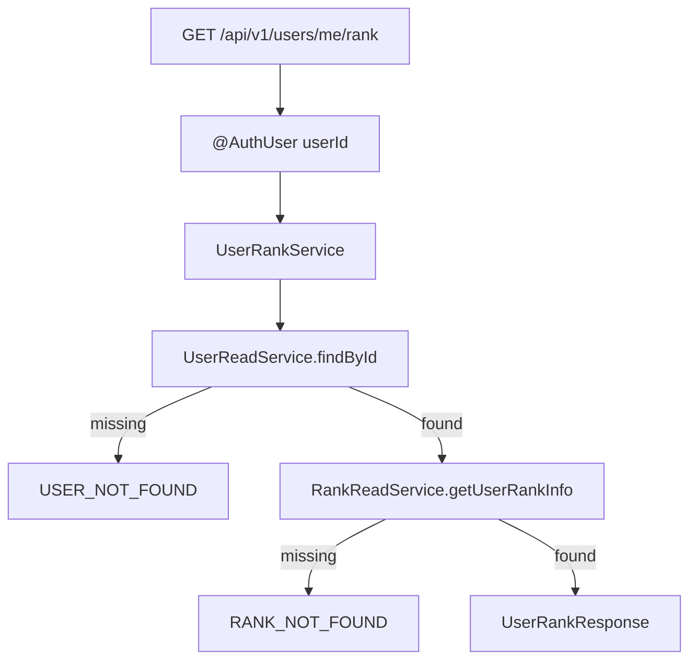
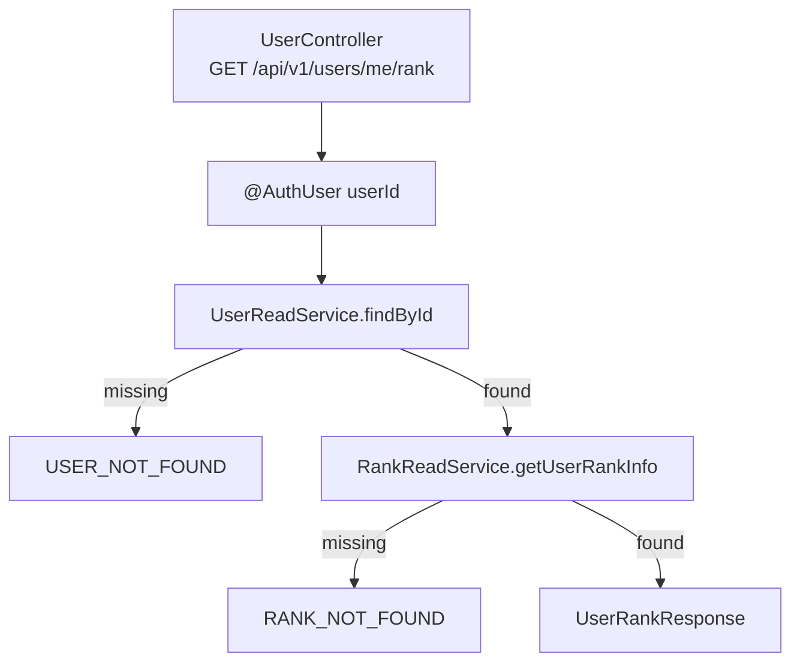

# Issue 106. 내 랭크 조회 API

## 📌 Feature Description

로그인한 사용자의 현재 랭크, LP, 누적 승패 요약을 조회하는 API를 구현한다.

이번 API는 `rank/stat` 도메인의 source of truth이며, MatchPage와 ProfilePage에서 현재 티어, 디비전, LP, 승/패/무 요약을 표시하기 위해 사용한다.

프로필 기본 정보는 `GET /api/v1/users/me/profile`에서 조회하고, 방금 끝난 게임의 LP/rank 변화량은 Game Summary API에서 조회한다. 이번 API는 현재 최종 랭크 상태만 제공한다.



핵심 정책은 다음과 같다.

- 랭크 API는 `rank/stat` 도메인의 현재 최종 상태만 반환한다.
- `core` 모듈의 `UserRankInfo` 엔티티가 랭크 정보의 source of truth다.
- API 모듈은 기존 `com.sang.leagueofstar.user` 패키지 안에서 작업한다.
- API path는 `common/path/user/UserPath`에 상수화한다.
- 인증 사용자 식별은 기존 `@AuthUser Long userId` 정책을 따른다.
- `UserController`에서 rank 조회 endpoint를 관리한다.
- API 모듈은 `UserRepository`, `UserRankInfoRepository`를 직접 참조하지 않는다.
- API 모듈은 core read service만 조합한다.
- stale token 또는 삭제된 사용자 구분을 위해 `UserReadService.findById(userId)`로 사용자 존재를 먼저 확인한다.
- 랭크 정보 조회는 `RankReadService.getUserRankInfo(userId)`를 사용한다.
- User 없음 판단과 `USER_NOT_FOUND` 처리는 core `UserReadService`가 담당한다.
- Rank 없음 판단과 `RANK_NOT_FOUND` 처리는 core `RankReadService`가 담당한다.
- nickname, email, avatarUrl은 프로필 API 책임이므로 이번 응답에서 제외한다.
- 직전 게임의 LP/rank 변화량은 Game Summary API 책임이므로 이번 응답에서 제외한다.
- core `UserRankInfo` 엔티티와 DB schema는 이번 이슈에서 변경하지 않는다.
- 이번 단건 조회 API에서는 N+1이 발생하지 않는다.
- 새 패키지를 추가하지 않는다.
- 이번 작업은 자동 커밋하지 않고 사용자 확인 후 커밋한다.

## Backend Contract

### Request

```http
GET /api/v1/users/me/rank
Authorization: Bearer {accessToken}
```

### Response

```json
{
  "userId": 1,
  "tier": "GOLD",
  "division": "IV",
  "rank": "GOLD_IV",
  "lp": 40,
  "tierScore": 13,
  "wins": 12,
  "losses": 8,
  "draws": 1,
  "rankUpdatedAt": "2026-06-12T10:00:00"
}
```

### Field Policy

| field | 포함 여부 | 이유 |
|-------|-----------|------|
| `userId` | 포함 | 프론트가 현재 로그인 사용자 식별에 사용 |
| `tier` | 포함 | 현재 tier enum 문자열 |
| `division` | 포함 | 현재 division enum 문자열. Apex rank는 null 가능 |
| `rank` | 포함 | 프론트 표시 편의를 위한 `GOLD_IV`, `MASTER` 형식 |
| `lp` | 포함 | 현재 최종 LP |
| `tierScore` | 포함 | 매칭/랭크 비교용 점수 표시 |
| `wins` | 포함 | 내부 `totalWins`의 외부 API 표시명 |
| `losses` | 포함 | 내부 `totalLosses`의 외부 API 표시명 |
| `draws` | 포함 | 내부 `totalDraws`의 외부 API 표시명 |
| `rankUpdatedAt` | 포함 | `UserRankInfo.updatedAt` 기반 최종 랭크 정보 갱신 시각 |
| `nickname`, `email`, `avatarUrl` | 제외 | profile API 책임 |
| `lpBefore`, `lpAfter`, `lpChange` | 제외 | Game Summary API의 변화량 책임 |
| `rankBefore`, `rankAfter` | 제외 | Game Summary API의 변화량 책임 |
| `rankSeriesId`, `seriesType` | 제외 | 진행/결과 시리즈 화면 책임 |

### Rank String Policy

- 일반 rank는 `tier + "_" + division` 형식으로 반환한다.
  - 예: `GOLD_IV`
- division이 없는 Apex rank는 tier만 반환한다.
  - 예: `MASTER`
- `tier`, `division`은 한글 label이 아니라 enum 문자열 그대로 반환한다.

### Error

- 인증 없음/만료/유효하지 않은 token은 기존 security/auth error response를 따른다.
- 인증된 `userId`에 해당하는 User가 없으면 `CoreErrorCode.USER_NOT_FOUND` 기반 `404 USER_001`을 반환한다.
- 인증된 `userId`에 해당하는 rank row가 없으면 `CoreErrorCode.RANK_NOT_FOUND` 기반 `404 RANK_001`을 반환한다.
- rank row가 없을 때 이번 API에서 자동 생성하지 않는다.

## Scope Boundary

이번 이슈에 포함:

- API 모듈 `com.sang.leagueofstar.user` 패키지 사용.
- `common/path/user/UserPath` 경로 상수 사용.
- `UserController`에 `GET /api/v1/users/me/rank` endpoint 구현.
- `@AuthUser Long userId` 기반 인증 사용자 조회.
- `UserReadService.findById(userId)` 기반 user 존재 확인.
- `RankReadService.getUserRankInfo(userId)` 기반 rank 조회.
- `UserRankService` 구현.
- `UserRankResponse` 구현.
- User 없음 시 `USER_NOT_FOUND` 처리.
- Rank 없음 시 `RANK_NOT_FOUND` 처리.
- `UserController`/service test 구현.
- RestDocs 성공/실패 문서화.
- `docs/last-구현.md` Section 2-2 정합성 반영.

이번 이슈에서 제외:

- core `UserRankInfo` 엔티티 수정.
- DB 컬럼 추가.
- rank row 자동 생성.
- nickname, email, avatarUrl 응답.
- 직전 게임의 LP/rank 변화량 응답.
- Game Summary API 변경.
- 랭킹 리스트 API 구현.
- 프론트 service/화면 연결.
- MatchPage UI 변경.
- ProfilePage 구현.
- 새 패키지 추가.
- 자동 커밋.

## 📚 Tasks

### 1. Backend Contract 정리

- [x] endpoint를 `GET /api/v1/users/me/rank`로 확정.
- [x] Authorization header 인증 정책 문서화.
- [x] response field를 `userId`, `tier`, `division`, `rank`, `lp`, `tierScore`, `wins`, `losses`, `draws`, `rankUpdatedAt`으로 확정.
- [x] profile 정보 제외 정책 문서화.
- [x] Game Summary 변화량 제외 정책 문서화.
- [x] User 없음 시 `USER_NOT_FOUND` 정책 문서화.
- [x] Rank 없음 시 `RANK_NOT_FOUND` 정책 문서화.
- [x] N+1 발생 가능성 없음과 후속 랭킹 API의 batch 조회 필요성을 문서화.

### 2. User Rank API 구현

- [x] `UserPath.ME_RANK` 경로 상수 추가.
- [x] `UserController`에 rank 조회 endpoint 추가.
- [x] `UserRankService` 구현.
- [x] `UserRankResponse` 구현.
- [x] `UserReadService.findById(userId)`로 User 존재 확인.
- [x] `RankReadService.getUserRankInfo(userId)`로 rank 조회.
- [x] User 없음 시 core `UserReadService`의 `CoreException(CoreErrorCode.USER_NOT_FOUND)` 전파.
- [x] Rank 없음 시 core `RankReadService`의 `CoreException(CoreErrorCode.RANK_NOT_FOUND)` 전파.
- [x] core `UserRankInfo` 엔티티와 DB schema를 변경하지 않음.

### 3. Test 구현

- [ ] `UserController` API test는 `RestAssuredMockMvc`로 구현.
- [ ] `UserRankService`는 core `UserReadService`, `RankReadService`를 mock 처리하는 unit test로 구현.
- [ ] 영속성 계층 변경이 생길 경우 `@DataJpaTest` 기반 실 DB 접근 테스트로 검증.
- [ ] RestDocs 성공 응답 구현.
- [ ] RestDocs `USER_NOT_FOUND` 실패 응답 구현.
- [ ] RestDocs `RANK_NOT_FOUND` 실패 응답 구현.
- [ ] 응답에 profile field와 Game Summary 변화량 field가 포함되지 않는지 검증.
- [ ] division이 null인 Apex rank 문자열 변환을 검증.
- [ ] User 없음이면 `RankReadService`를 호출하지 않는지 검증.

### 4. 문서 정합성 구현

- [ ] `docs/last-구현.md` Section 2-2 항목과 실제 계약 정합성 확인.
- [ ] `rankUpdatedAt`은 `UserRankInfo.updatedAt` 기반임을 `docs/last-구현.md`에 반영.
- [ ] `wins/losses/draws`는 내부 `totalWins/totalLosses/totalDraws` 매핑임을 `docs/last-구현.md`에 반영.
- [ ] Profile API와 Rank API, Game Summary API 책임 분리 문구를 `docs/last-구현.md`와 issue 문서에 맞춤.
- [ ] PR 섹션을 계약/정책 중심으로 보강.
- [ ] 구현 완료 후 사용자 허락 전까지 커밋하지 않음.

### 5. 검증

- [ ] `./gradlew :league-of-star-api:test --tests '*UserRank*' --tests '*UserController*'` 검증.
- [ ] `./gradlew :league-of-star-core:test --tests '*RankReadServiceTest'` 검증.
- [ ] `./gradlew test` 검증.

## Implementation Policy

- API 모듈의 기존 `com.sang.leagueofstar.user` 패키지에서 작업한다.
- API path는 문자열을 controller에 직접 쓰지 않고 `UserPath` 상수를 사용한다.
- controller는 기능별 controller로 과도하게 나누지 않고 `UserController`에서 관리한다.
- 최소한의 필요한 코드만 추가한다.
- core `UserRankInfo` 엔티티는 수정하지 않는다.
- DB 컬럼을 추가하지 않는다.
- rank row가 없을 때 자동 생성하지 않는다.
- nickname, email, avatarUrl은 응답에서 제외한다.
- Game Summary의 변화량 필드는 응답에서 제외한다.
- 인증 사용자 식별은 기존 `@AuthUser Long userId` 정책을 따른다.
- API 모듈은 core `UserRepository`, `UserRankInfoRepository`를 직접 참조하지 않는다.
- API 모듈은 core read service가 반환한 User/UserRankInfo 객체만 사용한다.
- `rankUpdatedAt`은 `UserRankInfo.updatedAt`을 사용한다.
- `rankUpdatedAt`은 프론트가 배열 포맷을 방어하지 않도록 `yyyy-MM-dd'T'HH:mm:ss` 문자열로 반환한다.
- 새 패키지를 추가하지 않는다.
- 이번 작업은 자동 커밋하지 않고 사용자 허락 후 커밋한다.

## N+1 Policy

- 이번 API는 로그인 사용자 1명의 rank만 조회하는 단건 API다.
- `UserReadService.findById(userId)` 1회, `RankReadService.getUserRankInfo(userId)` 1회 구조이므로 N+1이 발생하지 않는다.
- `UserRankInfo.rank`는 `@Embedded` value object라 lazy loading 대상이 아니다.
- `UserRankInfo`에는 반복 조회를 유발할 연관 컬렉션이 없다.
- 후속 랭킹 리스트 API에서 여러 user/rank를 조합할 때는 단건 read service 반복 호출을 금지하고 batch read service를 추가한다.

## Test Policy

- API/controller 테스트는 `RestAssuredMockMvc`로 작성한다.
- 영속성 계층은 mock으로 대체하지 않고, repository 또는 query 변경이 있을 때 `@DataJpaTest` 기반 실 데이터 접근 테스트로 검증한다.
- service, DTO 변환, 예외 분기처럼 영속성 접근이 없는 나머지 로직은 unit test로 검증한다.
- 이번 이슈는 repository/query 변경이 없으므로 `@DataJpaTest`를 새로 추가하지 않는다.
- 이번 이슈의 service test는 core `UserReadService`, `RankReadService`를 mock 처리해 orchestration과 response 변환만 검증한다.
- API 모듈 테스트와 구현은 `UserRepository`, `UserRankInfoRepository`를 직접 mock 하거나 직접 참조하지 않는다.
- User 없음 분기는 core `UserReadServiceTest`에서 검증한다.
- Rank 없음 분기는 core `RankReadServiceTest`와 API service test에서 검증한다.

## Acceptance Criteria

- 인증된 사용자가 `GET /api/v1/users/me/rank` 호출 시 현재 랭크 정보를 조회할 수 있다.
- 응답에는 `userId`, `tier`, `division`, `rank`, `lp`, `tierScore`, `wins`, `losses`, `draws`, `rankUpdatedAt`만 포함된다.
- User가 없으면 `USER_NOT_FOUND` 에러가 반환된다.
- Rank가 없으면 `RANK_NOT_FOUND` 에러가 반환된다.
- profile field와 Game Summary 변화량 field가 응답에 포함되지 않는다.
- 단건 API 특성상 N+1이 발생하지 않는다.
- RestDocs가 생성된다.
- 관련 테스트와 전체 테스트가 통과한다.
- 구현 완료 후 커밋 전에 사용자 확인을 받는다.

## 📝 Note

- 이번 이슈는 백엔드 랭크 조회 API 계약과 구현만 담당한다.
- 프론트 연결은 후속 `MatchPage 내 프로필 / 랭크 실데이터 구현`에서 진행한다.
- 랭킹 리스트 API는 별도 이슈에서 진행한다.
- rank row 자동 생성 정책은 이번 이슈에서 다루지 않는다.

-----

## PR

## 📌 Summary

로그인한 사용자의 현재 랭크 정보를 조회하는 API를 추가함.



핵심 정책:

- Rank API는 현재 최종 랭크/LP/누적 승패의 source of truth로 둔다.
- Profile API의 nickname/email/avatarUrl은 포함하지 않는다.
- Game Summary API의 LP/rank 변화량은 포함하지 않는다.
- UserRankInfo 엔티티와 DB schema는 변경하지 않는다.
- 단건 조회 API이므로 N+1이 발생하지 않는다.
- 자동 커밋하지 않고 사용자 확인 후 커밋한다.

백엔드와의 구현 계약:

- endpoint는 `GET /api/v1/users/me/rank`이다.
- path 문자열은 `UserPath.USER_BASE`, `UserPath.ME_RANK`로 관리한다.
- 인증은 Authorization header 기반이다.
- 인증 사용자 식별은 `@AuthUser Long userId`를 따른다.
- response는 `userId`, `tier`, `division`, `rank`, `lp`, `tierScore`, `wins`, `losses`, `draws`, `rankUpdatedAt`이다.
- `rankUpdatedAt`은 `UserRankInfo.updatedAt` 기반이며 `yyyy-MM-dd'T'HH:mm:ss` 문자열로 반환한다.

## 📚 Changes

- API 모듈 user 패키지에 랭크 조회 흐름을 추가함.
  기존 core `RankReadService`를 사용해 rank 도메인을 source of truth로 유지하기 위함임.
- user API path를 `UserPath`로 상수화함.
  profile API와 동일한 controller/path 정책을 유지하기 위함임.
- User 없음 판단은 core `UserReadService.findById`가 담당하고, Rank 없음 판단은 core `RankReadService.getUserRankInfo`가 담당함.
  API 모듈은 repository를 직접 참조하지 않고 core read service 결과를 HTTP 응답으로 변환하는 책임만 가짐.
- profile 정보와 rank 정보를 의도적으로 분리함.
  계정 기본 정보와 랭크 상태는 변경 주기와 도메인이 다르기 때문에 프론트에서 표시용으로 조합하도록 함.
- Game Summary 변화량을 제외함.
  Rank API는 현재 최종 상태만 제공하고, 방금 끝난 게임의 변화량은 summary API에서 조회해야 함.
- N+1 문제를 이번 API 범위에서 차단함.
  단건 조회이며 `UserRankInfo`가 embedded value object 중심 구조라 반복 lazy loading이 발생하지 않음.

## 📝 Note

- 프론트 연결은 후속 `MatchPage 내 프로필 / 랭크 실데이터 구현`에서 진행함.
- 랭킹 리스트 API는 별도 이슈에서 진행함.
- 새 패키지를 추가하지 않음.
- 자동 커밋하지 않고 사용자 확인 후 커밋함.
- 검증 결과는 구현 후 갱신함.

## 📌 Related Issue

- Closes #106
