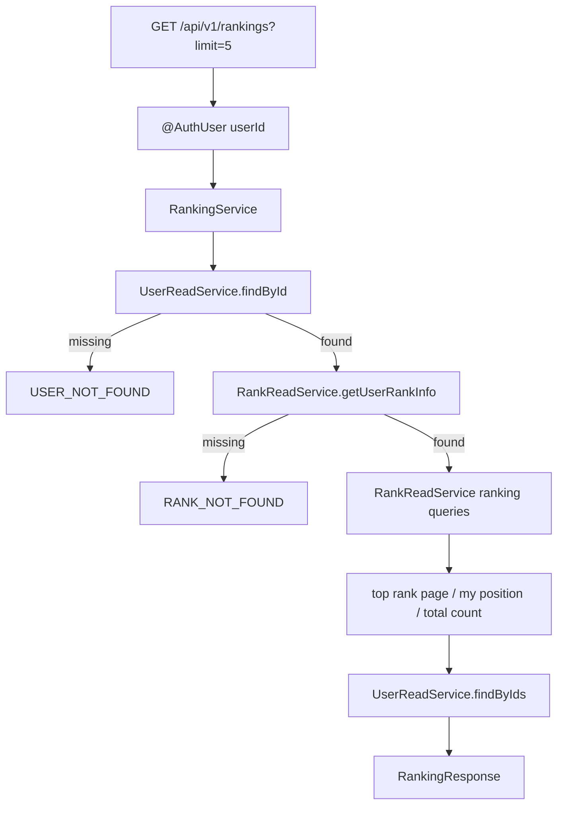
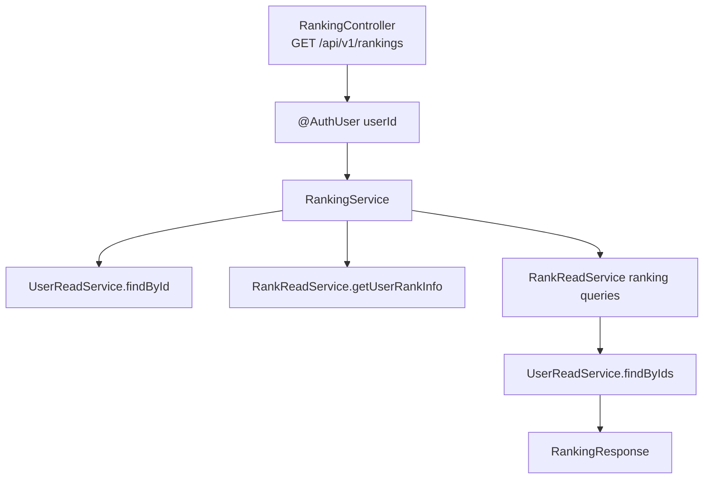

# Issue 110. 랭킹 조회 API 계약

## 📌 Feature Description

MatchPage 왼쪽 랭킹 리스트와 랭킹 요약 영역을 실데이터로 전환하기 위한 백엔드 랭킹 조회 API를 구현한다.

이번 API는 `rank/stat` 도메인의 랭킹 조회 source of truth다. 프론트는 이 API를 사용해 `내 순위`, `상위 %`, top ranking list, 현재 유저 row를 하드코딩 없이 표시한다.

`시즌 최고` 섹션은 제품 범위에서 제거하기로 했으므로 이번 API 응답에 포함하지 않는다. 후속 프론트 이슈 2-5에서 MatchPage의 시즌 최고 UI도 제거한다.



핵심 정책은 다음과 같다.

- 랭킹 API는 MatchPage 랭킹 리스트와 랭킹 요약의 source of truth다.
- Profile API, Rank API, Game Summary API와 책임을 섞지 않는다.
- `seasonBest`는 이번 계약에서 제외한다.
- API 모듈은 `UserRepository`, `UserRankInfoRepository`를 직접 참조하지 않는다.
- API 모듈은 core read service만 조합한다.
- 랭킹 row마다 `UserReadService.findById()`를 반복 호출하지 않는다.
- 현재 구조의 N+1 위험은 JPA lazy loading이 아니라 row별 nickname 조회 반복에서 발생한다.
- N+1 해결 방식은 학습/검증 과정을 문서화하고, 기본 구현은 rank page 조회 + users IN batch 조회로 진행한다.
- 새 패키지를 추가하지 않는다.
- 이번 작업은 자동 커밋하지 않고 사용자 확인 후 커밋한다.

## Backend Contract

### Request

```http
GET /api/v1/rankings?limit=5
Authorization: Bearer {accessToken}
```

### Query Parameters

| parameter | required | default | policy |
|-----------|----------|---------|--------|
| `limit` | false | `5` | `1~50` 범위만 허용 |

`limit`이 범위를 벗어나면 전역 validation 정책에 따라 `400 COMMON_003 INVALID_INPUT`을 반환한다.

### Response

```json
{
  "summary": {
    "myRankPosition": 128,
    "topPercent": 7,
    "totalRankers": 1840
  },
  "entries": [
    {
      "rankPosition": 1,
      "userId": 10,
      "nickname": "Legendary Star",
      "rank": "CHALLENGER",
      "lp": 3492,
      "tierScore": 40,
      "wins": 122,
      "losses": 44,
      "draws": 3,
      "isCurrentUser": false
    }
  ],
  "currentUser": {
    "rankPosition": 128,
    "userId": 1,
    "nickname": "MoonStar",
    "rank": "GOLD_IV",
    "lp": 40,
    "tierScore": 13,
    "wins": 12,
    "losses": 8,
    "draws": 1,
    "isCurrentUser": true
  }
}
```

### Response Shape

```ts
interface RankingResponse {
  summary: RankingSummaryResponse
  entries: RankingEntryResponse[]
  currentUser: RankingEntryResponse
}

interface RankingSummaryResponse {
  myRankPosition: number
  topPercent: number
  totalRankers: number
}

interface RankingEntryResponse {
  rankPosition: number
  userId: number
  nickname: string
  rank: string
  lp: number
  tierScore: number
  wins: number
  losses: number
  draws: number
  isCurrentUser: boolean
}
```

### Field Policy

| field | 포함 여부 | 이유 |
|-------|-----------|------|
| `summary.myRankPosition` | 포함 | MatchPage `내 순위` source |
| `summary.topPercent` | 포함 | MatchPage `상위 %` source |
| `summary.totalRankers` | 포함 | top percent 계산 근거 표시/검증용 |
| `entries` | 포함 | top ranking list source |
| `currentUser` | 포함 | 현재 유저가 top list 밖이어도 current row 표시 가능 |
| `rankPosition` | 포함 | 서버 정렬 기준으로 확정한 순위 |
| `userId` | 포함 | current user 식별 및 후속 profile link 대비 |
| `nickname` | 포함 | 랭킹 row 표시용 최소 profile field |
| `rank` | 포함 | 프론트 표시용 rank 문자열 |
| `lp` | 포함 | 랭킹 점수 표시 |
| `tierScore` | 포함 | 정렬/디버깅/프론트 표시 보조 |
| `wins`, `losses`, `draws` | 포함 | 랭킹 row 전적 요약 |
| `isCurrentUser` | 포함 | 프론트 current row highlight 기준 |
| `seasonBestRankPosition` | 제외 | 시즌 최고 UI 제거 결정 |
| `email`, `avatarUrl` | 제외 | 랭킹 표시 책임 밖 |
| `rankUpdatedAt` | 제외 | 현재 랭킹 UI 요구사항 아님 |
| Game Summary 변화량 | 제외 | 직전 게임 변화량 API 책임 |

### Ranking Sort Policy

랭킹 정렬 기준은 다음 순서로 고정한다.

1. `tierScore desc`
2. `lp desc`
3. `totalWins desc`
4. `totalLosses asc`
5. `totalDraws desc`
6. `userId asc`

동점 상황에서도 순위가 흔들리지 않도록 마지막 tie-breaker로 `userId asc`를 사용한다.

`topPercent`는 다음 방식으로 계산한다.

```text
topPercent = ceil(myRankPosition * 100 / totalRankers)
```

- 최소값은 `1`로 보정한다.
- 최대값은 `100`으로 보정한다.
- `totalRankers`가 0인 상태는 현재 유저 rank row가 없는 상태와 같으므로 `RANK_NOT_FOUND`로 처리한다.

### Error

- 인증 없음/만료/유효하지 않은 token은 기존 security/auth error response를 따른다.
- 인증된 `userId`에 해당하는 User가 없으면 `CoreErrorCode.USER_NOT_FOUND` 기반 `404 USER_001`을 반환한다.
- 인증된 `userId`에 해당하는 rank row가 없으면 `CoreErrorCode.RANK_NOT_FOUND` 기반 `404 RANK_001`을 반환한다.
- `limit`이 `1~50` 범위를 벗어나면 `400 COMMON_003 INVALID_INPUT`을 반환한다.
- 랭킹 조회에서 rank row를 자동 생성하지 않는다.

## Scope Boundary

이번 이슈에 포함:

- `GET /api/v1/rankings?limit=5` API 구현.
- ranking path 상수 추가.
- ranking controller/service/response DTO 추가.
- `@AuthUser Long userId` 기반 현재 유저 식별.
- 현재 유저 존재 확인.
- 현재 유저 rank row 존재 확인.
- top entries 조회.
- 현재 유저 rank position 조회.
- total rankers count 조회.
- nickname batch 조회.
- N+1 발생 지점과 해결 방식 문서화.
- N+1 학습/실험 가이드 문서화.
- RestDocs 성공/실패 문서화.
- controller/service/repository 테스트 구현.
- `docs/last-구현.md` 2-4 정합성 반영.

이번 이슈에서 제외:

- 프론트 MatchPage 랭킹 실데이터 연결.
- MatchPage 시즌 최고 UI 제거.
- season best 저장/정산 구현.
- rank history / season table 추가.
- avatarUrl 표시.
- email 표시.
- Game Summary API 변경.
- Profile API 변경.
- Rank API 변경.
- cursor pagination.
- Redis 캐싱.
- 새 패키지 추가.
- 자동 커밋.

## 📚 Tasks

### 1. Backend Contract 정리

- [x] endpoint를 `GET /api/v1/rankings`로 확정.
- [x] `limit` query parameter 정책을 `default 5`, `1~50`으로 확정.
- [x] response shape를 `summary`, `entries`, `currentUser` 구조로 확정.
- [x] `seasonBest` 제외 정책 문서화.
- [x] 랭킹 정렬 기준 문서화.
- [x] `topPercent` 계산 정책 문서화.
- [x] `USER_NOT_FOUND`, `RANK_NOT_FOUND`, invalid limit 에러 정책 문서화.
- [x] N+1 발생 가능 지점과 해결 후보 문서화.

### 2. N+1 학습 / 실험 설계

- [x] 현재 구조에서 `UserRankInfo`가 `User` JPA 연관관계를 갖지 않고 `userId`만 갖는다는 점 확인.
- [x] row별 `UserReadService.findById()` 반복 구현이 왜 `1 + N` query가 되는지 테스트/문서로 설명.
- [ ] 2쿼리 배치 조립 방식의 query 흐름 문서화.
- [ ] DTO join projection 방식의 장단점 문서화.
- [ ] JPA ToOne fetch join 방식이 이번 구조에 왜 과한지 문서화.
- [ ] ToMany fetch join의 카르테시안 곱/메모리 페이징 문제를 별도 학습 note로 정리.
- [ ] `default_batch_fetch_size: 100`이 현재 랭킹 nickname 조회에는 직접 해결책이 아닌 이유 문서화.

### 3. Ranking API 구현

- [ ] `RankingPath` 경로 상수 추가.
- [ ] `RankingController` 구현.
- [ ] controller에 `@Validated` 적용.
- [ ] `limit`에 `@Min(1)`, `@Max(50)` 적용.
- [ ] `RankingService` 구현.
- [ ] `RankingResponse`, `RankingSummaryResponse`, `RankingEntryResponse` 구현.
- [ ] `UserReadService.findById(userId)`로 현재 유저 존재 확인.
- [ ] `RankReadService.getUserRankInfo(userId)`로 현재 유저 rank 존재 확인.
- [ ] top entries 조회 결과와 current user row를 응답으로 조립.
- [ ] nickname 조회는 row별 단건 호출 없이 batch 조회.

### 4. Core Ranking Read 구현

- [ ] `RankReadService`에 ranking read method 추가.
- [ ] `UserRankInfoRepository`에 top ranking 조회 query 추가.
- [ ] `UserRankInfoRepository`에 total rankers count query 추가.
- [ ] `UserRankInfoRepository`에 current user rank position 계산 query 추가.
- [ ] 정렬 기준을 repository query와 테스트에 고정.
- [ ] `UserRankInfo.updateRankAndLp()` 호출 시 `tierScore` 컬럼도 함께 갱신되도록 보정.
- [ ] `tierScore` 컬럼과 `rank.getTierScore()` 불일치가 생기지 않도록 테스트 추가.

### 5. Test 구현

- [ ] controller API test는 `RestAssuredMockMvc`로 구현.
- [ ] `GET /api/v1/rankings?limit=5` 요청을 service에 위임하는지 검증.
- [ ] invalid limit 요청이 400으로 처리되는지 검증.
- [ ] service unit test에서 row별 `UserReadService.findById()`를 호출하지 않는지 검증.
- [ ] service unit test에서 `UserReadService.findByIds()` batch 조회를 사용하는지 검증.
- [ ] service unit test에서 top entries와 currentUser를 올바르게 조립하는지 검증.
- [ ] repository query는 `@DataJpaTest`로 실제 데이터 기준 검증.
- [ ] rank 정렬 순서 검증.
- [ ] tie-breaker 검증.
- [ ] current user rank position 계산 검증.
- [ ] `tierScore` 동기화 검증.
- [ ] RestDocs 성공 응답 구현.
- [ ] RestDocs `USER_NOT_FOUND` 실패 응답 구현.
- [ ] RestDocs `RANK_NOT_FOUND` 실패 응답 구현.
- [ ] RestDocs invalid limit 실패 응답 구현.

### 6. 문서 정합성 구현

- [ ] `docs/last-구현.md` Section 2-4 정책 반영.
- [ ] `docs/last-구현.md` Section 2-5에서 시즌 최고 UI 제거 필요성 반영.
- [ ] issue-110 task 완료 상태 반영.
- [ ] PR 섹션을 계약/정책/N+1 중심으로 보강.
- [ ] 구현 완료 후 사용자 허락 전까지 커밋하지 않음.

### 7. 검증

- [ ] `./gradlew :league-of-star-core:test --tests '*UserRankInfoRepositoryTest'` 검증.
- [ ] `./gradlew :league-of-star-core:test --tests '*RankReadServiceTest'` 검증.
- [ ] `./gradlew :league-of-star-api:test --tests '*Ranking*'` 검증.
- [ ] `./gradlew :league-of-star-api:test --tests '*UserController*'` 영향 검증.
- [ ] `./gradlew test` 검증.

## Implementation Policy

- 랭킹 API는 `rank/stat` 도메인의 랭킹 조회 source of truth다.
- `seasonBest`는 응답에서 제외한다.
- API 모듈은 core repository를 직접 참조하지 않는다.
- API 모듈은 core read service만 조합한다.
- 랭킹 row마다 user/profile 단건 조회를 반복하지 않는다.
- nickname은 batch 조회 또는 검증된 projection 방식으로만 가져온다.
- 이번 계획의 기본 구현은 2쿼리 배치 조립 방식이다.
- DTO join projection은 학습/비교 대상으로 문서화하고 후속 최적화 후보로 둔다.
- `UserRankInfo -> User` JPA 연관관계 추가는 이번 이슈에서 하지 않는다.
- ToMany fetch join은 이번 API에 적용하지 않는다.
- `default_batch_fetch_size`는 이미 100으로 설정되어 있으나, 이번 nickname 조회의 직접 해결책으로 취급하지 않는다.
- rank row가 없을 때 자동 생성하지 않는다.
- 새 패키지를 추가하지 않는다.
- 이번 작업은 자동 커밋하지 않고 사용자 허락 후 커밋한다.

## N+1 Study Guide

### 이번 프로젝트에서 N+1이 터질 수 있는 지점

현재 `UserRankInfo`는 다음 구조다.

```java
public class UserRankInfo {
    private Long userId;
    private Rank rank;
    private int lp;
    private int totalWins;
    private int totalLosses;
    private int totalDraws;
}
```

`UserRankInfo`가 `User`를 `@ManyToOne`이나 `@OneToOne`으로 들고 있지 않으므로, JPA lazy loading으로 `user.nickname`을 접근하는 형태의 N+1은 현재 구조에서 바로 발생하지 않는다.

하지만 랭킹 API에서 다음처럼 구현하면 N+1이 발생한다.

```java
List<UserRankInfo> ranks = rankReadService.findTopRankings(limit);

for (UserRankInfo rank : ranks) {
    User user = userReadService.findById(rank.getUserId());
    // nickname 조립
}
```

이 경우 query 흐름은 다음과 같다.

```text
1. 랭킹 목록 조회 1회
2. 각 row의 userId로 users 조회 N회
```

즉, 랭킹 row가 5개면 최소 6회, 50개면 최소 51회 query가 발생한다. 이것이 이번 이슈에서 실제로 조심해야 하는 N+1이다.

### 왜 fetch join만으로 풀 문제가 아닌가

면접 질문의 핵심은 보통 `1:N` collection fetch join에서 발생하는 카르테시안 곱과 페이징 붕괴다.

하지만 이번 프로젝트의 랭킹 API는 현재 `UserRankInfo -> User` 연관관계가 없다. 따라서 fetch join을 바로 적용할 대상이 없다.

이번 상황에서 단순히 `fetch join`을 말하면 오히려 현재 모델을 제대로 보지 않은 답이 된다. 실무적으로는 먼저 모델을 확인하고, N+1의 형태가 다음 중 무엇인지 구분해야 한다.

- JPA lazy loading으로 생기는 연관관계 N+1
- row별 repository/service 호출로 생기는 애플리케이션 레벨 N+1
- ToMany fetch join으로 생기는 카르테시안 곱 / 메모리 페이징 문제

이번 이슈는 두 번째에 해당한다.

### 후보 1. 2쿼리 배치 조립

기본 구현 후보는 다음과 같다.

```text
1. rank page 조회
2. rank rows에서 userId 목록 추출
3. users where id in (...) 조회
4. userId -> nickname map 생성
5. rank row와 nickname map을 조립
```

장점:

- core 도메인 경계를 유지한다.
- `UserRankInfo`에 불필요한 JPA 연관관계를 추가하지 않는다.
- 랭킹 page size가 작고 명확할 때 query 수가 안정적이다.
- ToMany fetch join으로 인한 카르테시안 곱 문제가 없다.
- DB 페이징을 그대로 살릴 수 있다.

단점:

- DB round trip은 최소 2회다.
- `users` batch 조회 결과 누락 시 방어 로직이 필요하다.

이번 이슈의 기본 구현은 이 방식으로 진행한다.

### 후보 2. DTO join projection

대안은 repository query에서 `user_rank_info`와 `users`를 조인해 DTO projection으로 바로 조회하는 것이다.

장점:

- top entries 조회를 한 번의 query로 끝낼 수 있다.
- ranking read model에 필요한 필드만 가져올 수 있다.

단점:

- rank repository가 users table 구조를 직접 알게 된다.
- rank 도메인 read service와 user 도메인 read service의 경계가 흐려질 수 있다.
- currentUser, position, total count까지 포함하면 query가 여러 개로 늘어날 수 있다.

이 방식은 후속 최적화 후보로 남긴다.

### 후보 3. ToOne 연관관계 추가 + fetch join

`UserRankInfo`에 `User` ToOne 연관관계를 추가하고 fetch join하는 방식도 가능하다.

장점:

- ToOne fetch join은 row 수를 늘리지 않으므로 DB 페이징을 깨지 않는다.
- JPA 연관관계 기반 조회가 자연스러워질 수 있다.

단점:

- 현재 모델 변경 범위가 크다.
- `userId` 스칼라 기반으로 이미 동작하는 rank/match 흐름에 영향이 생길 수 있다.
- 단순 랭킹 read API를 위해 도메인 모델을 바꾸는 것은 과하다.

이번 이슈에서는 채택하지 않는다.

### 면접 질문에 대한 깊은 답변 정리

질문:

> JPA N+1 문제를 페치 조인으로 풀려다 보니 데이터가 부풀려지고 페이징이 안 되는 문제가 생겼네요. 이 상황을 현업에서는 어떻게 풀어가시나요?

답변 방향:

```text
먼저 연관관계가 ToOne인지 ToMany인지 나눕니다.
ToOne은 row 수를 늘리지 않기 때문에 fetch join으로 묶어도 페이징이 깨지지 않습니다.
반면 ToMany collection fetch join은 부모 row가 자식 수만큼 부풀어 카르테시안 곱이 생기고,
Hibernate가 메모리에서 페이징하게 되는 문제가 생길 수 있습니다.

그래서 운영에서는 루트 엔티티 페이지는 DB에서 먼저 안정적으로 잘라오고,
ToOne은 fetch join이나 projection으로 같이 가져오며,
ToMany는 lazy 유지 후 default_batch_fetch_size 또는 @BatchSize로 IN query를 유도합니다.
필요하면 화면 전용 DTO projection이나 2단계 조회를 사용해 row 폭발 없이 조립합니다.
배치 사이즈는 페이지 크기, 평균 컬렉션 크기, DB parameter limit, p95 latency를 보고 조정합니다.
```

이번 프로젝트에 적용하면 다음과 같다.

```text
이번 랭킹 API는 ToMany fetch join 문제가 아니라,
rank row별 nickname 조회를 반복할 때 생기는 애플리케이션 레벨 N+1입니다.
따라서 rank page를 먼저 DB에서 잘라오고,
그 page의 userId 목록으로 users를 IN query로 batch 조회해 조립합니다.
이렇게 하면 카르테시안 곱 없이 페이징을 유지하면서 query 수 증가를 막을 수 있습니다.
```

### 배치 사이즈 적정값 가이드

현재 프로젝트는 `hibernate.default_batch_fetch_size: 100`으로 설정되어 있다.

배치 사이즈를 정할 때 고려할 기준:

- 화면 page size가 몇 개인지.
- 한 요청에서 접근하는 lazy association 수가 몇 개인지.
- DB의 `IN` parameter limit.
- 한 batch query 결과 row의 평균 payload 크기.
- p95/p99 latency.
- DB CPU/IO 부하.
- application heap 사용량.

일반적으로 `page size`보다 크거나 같은 값에서 시작하되, 무조건 크게 잡지 않는다. 현재 MatchPage 랭킹은 `limit 5`, 최대 `50`이므로 `100`은 과하지 않은 기본값이다. 다만 이번 랭킹 nickname batch 조회는 JPA lazy batch fetch가 아니라 명시적 `findByIds`이므로 `default_batch_fetch_size` 튜닝 대상은 아니다.

## Test Policy

- API/controller 테스트는 `RestAssuredMockMvc`로 작성한다.
- 영속성 계층 query는 mock으로 대체하지 않고 `@DataJpaTest` 기반 실 데이터 접근 테스트로 검증한다.
- service orchestration은 unit test로 검증한다.
- N+1 방지 정책은 service test에서 row별 `findById()` 호출 금지와 `findByIds()` 호출을 검증한다.
- repository 정렬/순위 계산은 실제 H2 DB에서 검증한다.
- RestDocs는 성공/실패 계약을 모두 문서화한다.

## Acceptance Criteria

- 인증된 사용자가 `GET /api/v1/rankings?limit=5` 호출 시 랭킹 요약과 top entries를 조회할 수 있다.
- 응답에는 `summary`, `entries`, `currentUser`가 포함된다.
- `summary`에는 `myRankPosition`, `topPercent`, `totalRankers`가 포함된다.
- `entries`는 서버 정렬 기준으로 정렬된다.
- `currentUser`는 현재 유저가 top entries 밖이어도 항상 포함된다.
- `seasonBest`는 응답에 포함되지 않는다.
- User가 없으면 `USER_NOT_FOUND` 에러가 반환된다.
- Rank가 없으면 `RANK_NOT_FOUND` 에러가 반환된다.
- invalid limit은 `COMMON_003 INVALID_INPUT` 에러가 반환된다.
- nickname 조회에서 row별 단건 조회 N+1이 발생하지 않는다.
- RestDocs가 생성된다.
- 관련 테스트와 전체 테스트가 통과한다.
- 구현 완료 후 커밋 전에 사용자 확인을 받는다.

## 📝 Note

- 이번 이슈는 백엔드 랭킹 조회 API 계약과 구현만 담당한다.
- 프론트 연결은 후속 `2-5 MatchPage 랭킹 실데이터 구현`에서 진행한다.
- 시즌 최고 UI 제거도 후속 프론트 이슈에서 진행한다.
- 새 패키지를 추가하지 않는다.
- 자동 커밋하지 않는다.

-----

## PR

## 📌 Summary

MatchPage 랭킹 리스트와 랭킹 요약을 위한 랭킹 조회 API를 추가함.



핵심 정책:

- 랭킹 API는 rank/stat 도메인의 랭킹 조회 source of truth로 둔다.
- 시즌 최고는 제품 범위에서 제거했으므로 응답하지 않는다.
- 랭킹 row마다 user를 단건 조회하지 않는다.
- 현재 구조의 N+1은 JPA lazy loading이 아니라 row별 nickname 조회 반복에서 발생한다.
- 기본 구현은 rank page 조회 후 users IN batch 조회로 조립한다.
- 자동 커밋하지 않고 사용자 확인 후 커밋한다.

백엔드와의 구현 계약:

- endpoint는 `GET /api/v1/rankings?limit=5`이다.
- 인증은 Authorization header 기반이다.
- 인증 사용자 식별은 `@AuthUser Long userId`를 따른다.
- `limit`은 기본 5, 허용 범위 1~50이다.
- response는 `summary`, `entries`, `currentUser` 구조다.
- `seasonBest` 관련 field는 응답하지 않는다.

## 📚 Changes

- ranking 조회 API를 추가함.
  MatchPage의 랭킹 리스트와 `내 순위`, `상위 %`를 하드코딩 없이 표시하기 위한 source of truth를 제공하기 위함임.
- 현재 유저 row를 top entries와 별도로 반환함.
  현재 유저가 top list 밖에 있어도 MatchPage current row를 안정적으로 그릴 수 있게 하기 위함임.
- 시즌 최고를 API 계약에서 제외함.
  제품 방향상 해당 섹션은 프론트에서 제거하기로 했으므로 백엔드 계약에도 넣지 않음.
- N+1 방지 방식을 명시함.
  `UserRankInfo`는 `User` 연관관계가 없으므로 fetch join 문제가 아니라 userId별 nickname 단건 조회 반복이 위험 지점임. 이를 users IN batch 조회로 차단함.
- `tierScore` 동기화 정책을 점검함.
  DB 정렬/페이징은 `tierScore` 컬럼에 의존하므로 rank 변경 시 컬럼 값이 embedded rank와 어긋나지 않게 함.

## 📝 Note

- 프론트 연결은 후속 `2-5 MatchPage 랭킹 실데이터 구현`에서 진행함.
- 시즌 최고 UI 제거도 후속 프론트 이슈에서 진행함.
- 새 패키지를 추가하지 않음.
- 자동 커밋하지 않음.
- N+1 / fetch join 정리:
  ```mermaid
  flowchart TD
      A["Ranking API"] --> B["현재 프로젝트 구조"]
      B --> C["UserRankInfo.userId<br/>스칼라 값만 보유"]
      C --> D["User JPA 연관관계 없음"]
      D --> E["join fetch r.user 사용 불가"]
      E --> F["row별 UserReadService.findById 호출 시<br/>애플리케이션 레벨 N+1 발생"]
      F --> G["rank page 1 query + user 단건 N query"]
      G --> H["해결: userIds 수집 후<br/>UserReadService.findByIds IN query"]
  ```

  ```mermaid
  flowchart LR
      A["ToOne<br/>ManyToOne / OneToOne"] --> B["부모 row 1개당 대상 1개"]
      B --> C["join해도 row 수 유지"]
      C --> D["fetch join + pagination 비교적 안전"]

      E["ToMany<br/>OneToMany / ManyToMany"] --> F["부모 row 1개당 자식 여러 개"]
      F --> G["부모 row가 자식 수만큼 반복"]
      G --> H["pagination 시 DB가 부모 기준으로 자르기 어려움"]
      H --> I["Hibernate 메모리 중복 제거 / 메모리 페이징 위험"]
  ```

  - 이번 랭킹 API에는 N+1 발생 가능성이 있음.
    top ranking row를 조회한 뒤 각 row마다 `UserReadService.findById(rank.getUserId())`를 호출하면 rank list 1회 + user 단건 N회가 되어 애플리케이션 레벨 N+1이 발생함.
  - 하지만 현재 `UserRankInfo`는 `User`를 JPA 연관관계로 직접 참조하지 않고 `userId` 스칼라 값만 갖고 있음.
    따라서 `join fetch r.user`처럼 fetch join을 적용할 연관 그래프가 없고, 이번 이슈에서는 fetch join을 사용하지 않음.
  - 연관관계가 있다면 fetch join을 사용할 수 있음.
    예를 들어 `@ManyToOne(fetch = LAZY) private User user` 같은 ToOne 관계는 각 rank row가 user 1개만 가리키므로 fetch join해도 row 수가 늘지 않아 N+1 해결에 비교적 안전함.
  - 반대로 `@OneToMany(fetch = LAZY) private List<GameRecord> records` 같은 ToMany 관계는 부모 1개가 자식 여러 개를 가지므로 fetch join 시 부모 row가 자식 수만큼 반복됨.
    이 상태에서 pagination을 걸면 DB가 부모 기준으로 정확히 자르기 어렵고, Hibernate가 많은 row를 가져온 뒤 메모리에서 중복 제거/페이징할 수 있음.
  - ToMany fetch join + pagination의 위험은 카르테시안 곱처럼 row가 부풀어 서버 메모리에 필요 이상의 엔티티/컬렉션이 적재되는 것임.
    데이터가 작으면 티가 안 나지만 운영 데이터에서는 GC 압박, 응답 지연, 최악의 경우 OOM으로 이어질 수 있음.
  - 따라서 일반적인 실무 기준은 ToOne은 fetch join으로 묶고, ToMany는 부모 page를 먼저 DB에서 자른 뒤 batch size 또는 별도 IN query로 컬렉션을 가져오는 방식임.
  - 이번 랭킹 API는 ToMany 문제가 아니라 row별 nickname 조회 반복 문제이므로, rank page 조회 후 userId 목록으로 `UserReadService.findByIds()`를 호출하는 batch 조회 방식으로 해결함.
- 검증 결과는 구현 후 갱신함.

## 📌 Related Issue

- Closes #110
