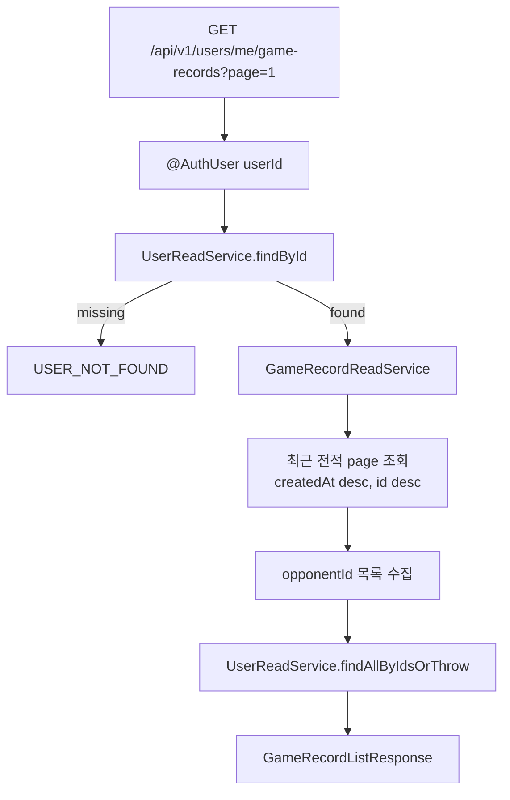
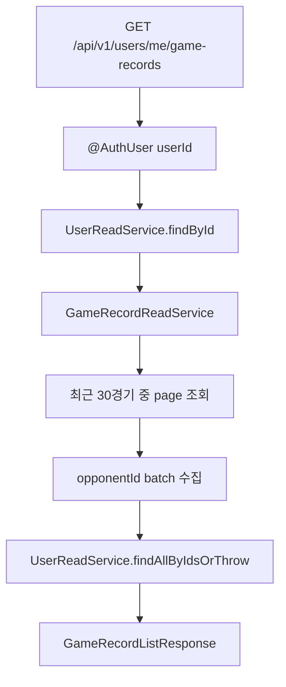

# Issue 114. 내 전적 목록 API

## 📌 Feature Description

로그인한 사용자가 최근 전적 목록을 조회할 수 있는 API를 구현한다.

이번 API는 전적 페이지의 source of truth다. Game Result Summary API는 방금 끝난 단일 게임의 결과/정산 상세를 보여주는 책임이고, 이번 전적 목록 API는 계정에 누적된 최근 게임 기록을 페이지 단위로 조회하는 책임이다.



핵심 정책은 다음과 같다.

- 전적 목록 API는 `/api/v1/users/me/game-records`로 제공한다.
- profile/rank처럼 로그인 사용자 기준 조회이므로 기존 `UserController`에서 관리한다.
- 전적 목록은 최근 30경기만 조회 가능하다.
- pagination은 1-based `page`를 사용하고, `size`는 서버 정책으로 10 고정이다.
- page는 `1~3`만 허용한다.
- 정렬 기준은 `GameRecord.createdAt desc`, tie-breaker는 `id desc`다.
- `playedAt`은 `GameRecord.createdAt`을 사용한다.
- `reason`은 이번 응답에서 제외한다. 현재 `GameRecord`에 저장되지 않는 값이고, 포함하려면 GameRoom/result read model 확장이 필요하기 때문이다.
- API 모듈은 core repository를 직접 참조하지 않는다.
- API 모듈은 core read service를 조합해 외부 HTTP response를 만든다.
- opponent nickname은 row별 `findById` 반복 호출이 아니라 `findAllByIdsOrThrow` batch 조회로 조립한다.
- opponent user 누락 판단과 `USER_NOT_FOUND` 예외 생성은 core `UserReadService`가 담당한다.
- 새 패키지와 DB schema를 추가하지 않는다.
- 이번 작업은 자동 커밋하지 않는다.

## Backend Contract

### Request

```http
GET /api/v1/users/me/game-records?page=1
Authorization: Bearer {accessToken}
```

### Query Parameters

| parameter | required | default | policy |
|-----------|----------|---------|--------|
| `page` | false | `1` | 1-based. `1~3` 범위만 허용 |

`size`는 query parameter로 받지 않는다. 서버 정책상 항상 10개씩 조회한다.

### Response

```json
{
  "page": 1,
  "size": 10,
  "totalPages": 3,
  "totalElements": 30,
  "hasNext": true,
  "records": [
    {
      "gameId": 100,
      "result": "WIN",
      "opponentUserId": 2,
      "opponentNickname": "ShadowWalker",
      "rankBefore": "GOLD_IV",
      "rankAfter": "GOLD_III",
      "lpBefore": 80,
      "lpAfter": 105,
      "lpChange": 25,
      "playedAt": "2026-06-19T10:30:00"
    }
  ]
}
```

### Response Shape

```ts
interface GameRecordListResponse {
  page: number
  size: number
  totalPages: number
  totalElements: number
  hasNext: boolean
  records: GameRecordEntryResponse[]
}

interface GameRecordEntryResponse {
  gameId: number
  result: 'WIN' | 'LOSS' | 'DRAW'
  opponentUserId: number
  opponentNickname: string
  rankBefore: string
  rankAfter: string
  lpBefore: number
  lpAfter: number
  lpChange: number
  playedAt: string
}
```

### Field Policy

| field | 포함 여부 | 이유 |
|-------|-----------|------|
| `page` | 포함 | 프론트 pagination 현재 page 표시 source |
| `size` | 포함 | 서버 고정 page size 명시 |
| `totalPages` | 포함 | 3페이지 이하 pagination 표시 source |
| `totalElements` | 포함 | 최근 30경기 cap이 반영된 총 표시 가능 개수 |
| `hasNext` | 포함 | 다음 페이지 버튼 활성화 기준 |
| `gameId` | 포함 | 후속 상세/summary 이동 대비 |
| `result` | 포함 | 전적 row 승/패/무 표시 source |
| `opponentUserId` | 포함 | 후속 상대 프로필 이동 대비 |
| `opponentNickname` | 포함 | 전적 row 상대 표시용 최소 profile field |
| `rankBefore`, `rankAfter` | 포함 | 해당 경기 전후 rank 변화 표시 |
| `lpBefore`, `lpAfter`, `lpChange` | 포함 | 해당 경기 LP 변화 표시 |
| `playedAt` | 포함 | 경기 완료/정산 기록 시각 표시 |
| `reason` | 제외 | 현재 `GameRecord`에 없고 최소 전적 목록 책임 밖 |
| `rankSeriesId`, `seriesType` | 제외 | 전적 목록 v1 표시 요구사항 밖 |
| `email`, `avatarUrl` | 제외 | 전적 row 표시 책임 밖 |

### Pagination Policy

- `page`는 1-based다.
- `page` 기본값은 `1`이다.
- `page` 허용 범위는 `1~3`이다.
- `size`는 서버 고정값 `10`이다.
- 최근 30경기만 노출한다.
- `totalElements`는 `min(countByUserId, 30)`으로 계산한다.
- `totalPages`는 `ceil(totalElements / 10)`이며 최대 3이다.
- 빈 전적이면 `records: []`, `totalElements: 0`, `totalPages: 0`, `hasNext: false`를 반환한다.

### Sort Policy

전적 정렬 기준은 다음 순서로 고정한다.

1. `GameRecord.createdAt desc`
2. `GameRecord.id desc`

### Error

- 인증 없음/만료/유효하지 않은 token은 기존 security/auth error response를 따른다.
- 인증된 `userId`에 해당하는 User가 없으면 `CoreErrorCode.USER_NOT_FOUND` 기반 `404 USER_001`을 반환한다.
- `page`가 `1~3` 범위를 벗어나면 `400 COMMON_003 INVALID_INPUT`을 반환한다.
- 전적이 없는 상태는 error가 아니라 empty response다.

## Scope Boundary

이번 이슈에 포함:

- `GET /api/v1/users/me/game-records?page=1` API 구현.
- `UserPath.ME_GAME_RECORDS` 경로 상수 추가.
- 기존 `UserController`에 내 전적 목록 endpoint 추가.
- `@AuthUser Long userId` 기반 현재 유저 식별.
- `UserReadService.findById(userId)` 기반 user 존재 확인.
- core `GameRecordReadService`에 userId 기준 page 조회 추가.
- core `GameRecordRepository`에 최신순 page 조회와 count query 추가.
- API service에서 opponent nickname batch 조회.
- response DTO 구현.
- RestDocs 성공/실패/empty 문서화.
- controller/service/repository 테스트 구현.
- `docs/last-구현.md` Section 3-1 정합성 반영.

이번 이슈에서 제외:

- 전적 페이지 프론트 구현.
- MatchPage 기록 버튼 연결.
- Game Result Summary API 변경.
- GameRoom result reason 조회/응답.
- `reason` field 추가.
- rank series 상세 표시.
- cursor pagination.
- 30경기 초과 조회.
- DB schema 변경.
- 새 패키지 추가.
- 자동 커밋.

## 📚 Tasks

### 1. Backend Contract 정리

- [x] endpoint를 `GET /api/v1/users/me/game-records`로 확정.
- [x] Authorization header 인증 정책 문서화.
- [x] query parameter를 `page` 하나로 확정.
- [x] `page` 정책을 1-based, default 1, allowed 1~3으로 확정.
- [x] `size`는 서버 고정 10으로 확정.
- [x] 최근 30경기 cap 정책 문서화.
- [x] response shape를 `page`, `size`, `totalPages`, `totalElements`, `hasNext`, `records` 구조로 확정.
- [x] `reason` 제외 정책 문서화.
- [x] Summary API와 전적 목록 API 책임 분리 문서화.

### 2. Core GameRecord Read 구현

- [x] `GameRecordRepository`에 userId 기준 최신순 page 조회 메서드 추가.
- [x] `GameRecordRepository`에 userId 기준 count 메서드 추가.
- [x] `GameRecordReadService`에 최근 전적 page 조회 메서드 추가.
- [x] `GameRecordReadService`에 userId 기준 count 메서드 추가.
- [x] core는 nickname, HTTP response, pagination 표시 DTO를 알지 않게 유지.

### 3. User Game Record API 구현

- [x] `UserPath.ME_GAME_RECORDS` 상수 추가.
- [x] `UserController`에 내 전적 목록 endpoint 추가.
- [x] `UserGameRecordService` 구현.
- [x] `GameRecordListResponse` 구현.
- [x] `GameRecordEntryResponse` 구현.
- [x] `UserReadService.findById(userId)`로 인증 user 존재 확인.
- [x] opponentId 목록을 `UserReadService.findAllByIdsOrThrow`로 batch 조회.
- [x] row별 opponent `findById` 반복 호출을 금지.
- [x] `rankBefore`, `rankAfter` 문자열 변환 구현.
- [x] `playedAt`은 `GameRecord.createdAt`으로 매핑.
- [x] empty response를 error가 아닌 정상 200으로 반환.

### 4. Test 구현

- [x] `UserController` API test는 `RestAssuredMockMvc`로 구현.
- [x] `UserGameRecordService`는 core read service와 user read service를 mock 처리하는 unit test로 구현.
- [x] `GameRecordRepository`는 `@DataJpaTest` 기반 실 데이터 접근 테스트로 최신순 조회를 검증.
- [x] `GameRecordReadService`는 repository 위임 unit test로 검증.
- [x] RestDocs 성공 응답 구현.
- [x] RestDocs empty 응답 구현.
- [x] RestDocs invalid page 응답 구현.
- [x] RestDocs `USER_NOT_FOUND` 응답 구현.
- [x] opponent nickname batch 조회를 검증.
- [x] 30경기 cap 기반 metadata 계산을 검증.

### 5. 문서 정합성 구현

- [x] `docs/last-구현.md` Section 3-1 endpoint 후보를 확정 계약으로 변경.
- [x] `docs/last-구현.md` Section 3-1 query 정책을 page 1~3, size 10 고정으로 변경.
- [x] `docs/last-구현.md` Section 3-1 response shape에서 `reason` 제외를 반영.
- [x] Game Result Summary와 전적 목록 API 책임 분리 문구를 맞춤.
- [x] PR 섹션을 백엔드 계약/core-api 책임 분리/N+1 방지 정책 중심으로 보강.

### 6. 검증

- [ ] `./gradlew :league-of-star-core:test --tests '*GameRecordRepositoryTest'` 검증.
- [ ] `./gradlew :league-of-star-core:test --tests '*GameRecordReadServiceTest'` 검증.
- [ ] `./gradlew :league-of-star-api:test --tests '*UserController*' --tests '*UserGameRecord*'` 검증.
- [ ] `./gradlew test` 검증.
- [ ] `git diff --check` 검증.

## Implementation Policy

- API 모듈은 외부 소통 모듈이다.
- core 모듈은 핵심 도메인과 영속성 접근 책임을 가진다.
- API 모듈은 `GameRecordRepository`, `UserRepository`를 직접 참조하지 않는다.
- API 모듈은 core read service가 반환한 domain object를 외부 response로 조립한다.
- `UserController`에서 profile/rank/game-records를 함께 관리한다.
- API path는 controller에 문자열로 직접 쓰지 않고 `UserPath` 상수를 사용한다.
- 전적 목록 source of truth는 `GameRecord`다.
- Game Result Summary sessionStorage payload를 전적 목록 source로 사용하지 않는다.
- opponent nickname은 `UserReadService.findAllByIdsOrThrow`로 batch 조회한다.
- opponent user 누락 여부는 API 모듈에서 판단하지 않고 core `UserReadService`가 판단한다.
- row별 `UserReadService.findById(opponentId)` 반복 호출을 금지한다.
- `reason`은 이번 API에 포함하지 않는다.
- `size` query parameter를 열지 않는다.
- 30경기 초과 조회를 허용하지 않는다.
- DB schema를 변경하지 않는다.
- 새 패키지를 추가하지 않는다.
- 이번 작업은 자동 커밋하지 않는다.

## N+1 Policy

- 현재 `GameRecord`는 `User`와 직접 JPA 연관관계를 맺지 않고 `userId`, `opponentId`를 값으로 가진다.
- 따라서 이번 이슈의 N+1 위험은 lazy loading이 아니라 API service에서 opponent nickname을 row별 단건 조회할 때 발생한다.
- 나쁜 구조는 `records`를 순회하면서 `userReadService.findById(record.getOpponentId())`를 반복하는 방식이다.
- 이번 구현은 opponentId를 모은 뒤 `UserReadService.findAllByIdsOrThrow(opponentIds)`로 한 번에 조회한다.
- 전적 목록은 최대 10개씩만 반환하더라도, 기본 정책은 row별 단건 조회를 허용하지 않는다.

## Acceptance Criteria

- 인증 사용자가 `GET /api/v1/users/me/game-records?page=1`로 최근 전적 10개를 조회할 수 있다.
- `page`는 1~3만 허용된다.
- `size`는 서버에서 10으로 고정된다.
- 최근 30경기까지만 pagination metadata에 반영된다.
- 전적은 `playedAt desc`, `id desc` 기준으로 정렬된다.
- 전적이 없으면 200 empty response를 반환한다.
- opponent nickname은 batch 조회로 조립된다.
- API 모듈이 core repository를 직접 참조하지 않는다.
- RestDocs가 성공/empty/실패 응답을 문서화한다.
- controller는 RestAssuredMockMvc, repository는 DataJpa, service는 unit test로 검증된다.
- `docs/last-구현.md`, issue-114 문서 정합성이 맞는다.

## PR Message

## PR 작성 방법

## 📌 Summary

이번 PR은 로그인 사용자의 최근 전적 목록을 조회하는 API를 추가한다.



핵심 정책:

- 전적 목록 API는 계정의 누적 게임 기록 조회 source of truth로 둠.
- Game Result Summary API는 방금 끝난 단일 게임 상세 책임으로 유지함.
- 최근 30경기만 10개씩 3페이지로 조회함.
- API 모듈은 core repository를 직접 참조하지 않음.
- opponent nickname은 core batch 조회로 조립해 row별 단건 조회를 피함.

백엔드와의 구현 계약:

- endpoint는 `GET /api/v1/users/me/game-records?page=1`임.
- `page`는 1-based이며 `1~3`만 허용함.
- `size`는 서버 고정 10으로 처리함.
- `page` 검증은 controller 수동 if가 아니라 `@Valid @ModelAttribute` request DTO로 처리함.
- response는 `page`, `size`, `totalPages`, `totalElements`, `hasNext`, `records` 구조임.
- `playedAt`은 `GameRecord.createdAt`을 source로 사용함.
- `reason`은 현재 전적 목록 계약에서 제외함.

## 📚 Changes

- core에 userId 기준 GameRecord page 조회를 추가함.
  core는 전적 도메인과 영속성 조회 책임만 갖고, HTTP response shape나 opponent nickname 조립을 알지 않게 유지함.
- API service에서 전적 목록 response를 조립함.
  API 모듈은 외부 계약을 만드는 계층이므로 core read service 결과와 user read service 결과를 조합해 응답 DTO를 만든다.
- query 검증을 request DTO로 분리함.
  `page` 범위 검증을 controller 수동 분기에서 처리하지 않고 `UserGameRecordPageRequest`에 둬 HTTP request 검증 책임을 명확히 함.
- opponent nickname 조회를 core batch 방식으로 처리함.
  전적 row마다 단건 user 조회를 반복하면 애플리케이션 레벨 N+1이 발생하므로 opponentId를 모아 `findAllByIdsOrThrow`로 한 번에 가져온다. opponent 누락 판단과 core 예외 생성은 API가 아니라 core read service가 담당한다.
- `reason`을 제외함.
  현재 `GameRecord`에 저장되지 않는 값을 전적 목록 v1에 포함하면 GameRoom read model 확장까지 필요해 최소 구현 범위를 넘어선다.

## 📝 Note

- 이번 PR에서 전적 페이지 프론트 구현은 제외함.
- MatchPage 기록 버튼 연결은 후속 프론트 이슈에서 진행함.
- Game Result Summary API는 변경하지 않음.
- DB schema 변경 없음.
- 새 패키지 추가 없음.
- 작업 단위 커밋은 사용자 요청 시 수행함.
- 검증 결과:
  - `./gradlew :league-of-star-core:test --tests '*GameRecordRepositoryTest' --tests '*GameRecordReadServiceTest'` 통과함.
  - `./gradlew :league-of-star-api:test --tests '*UserControllerTest' --tests '*UserControllerRestDocsTest' --tests '*UserGameRecordServiceTest'` 통과함.
  - `git diff --check` 통과함.
- 구현 커밋:
  - `86313b4 docs: 내 전적 목록 API 이슈 작성`
  - `9bfb2ce feat: 내 전적 core 조회 구현`
  - `eb3319e feat: 내 전적 API 구현`
  - `828de72 feat: 내 전적 API 테스트 구현`

## 📌 Related Issue

- Closes #114
