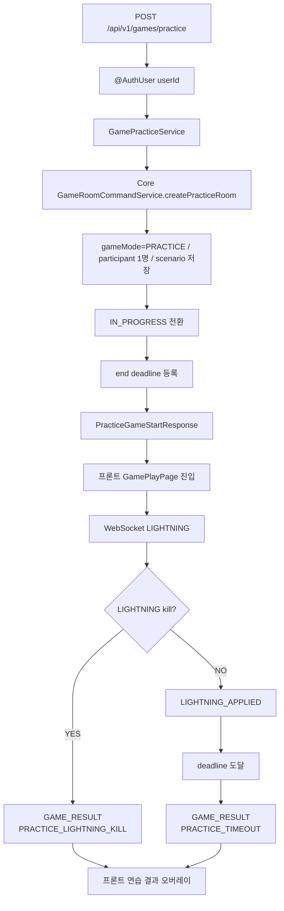
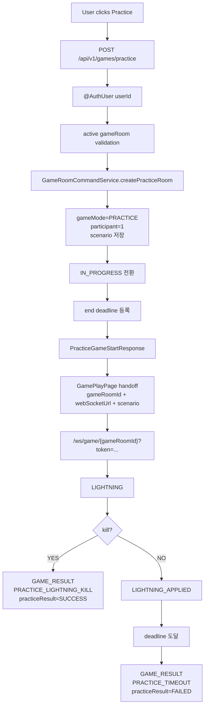
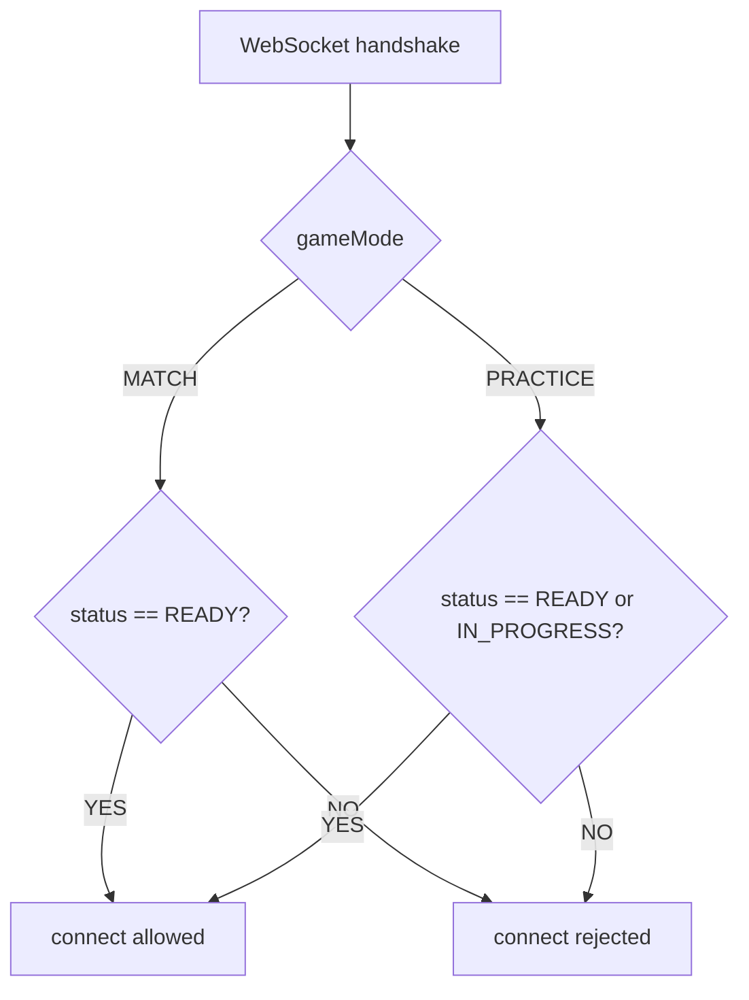
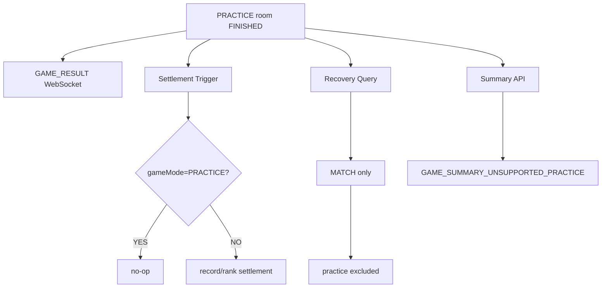

# Issue 120. 연습 모드 API / Scenario 계약

## 📌 Feature Description

로그인한 사용자가 매칭 큐와 상대 유저 없이 혼자 연습 게임을 시작하고, 기존 LIGHTNING 판정과 `GAME_RESULT` WebSocket 흐름으로 성공/실패 결과를 받는 백엔드 계약을 구현한다.

연습 모드는 게임 플레이 감각을 확인하기 위한 모드이므로 `game_rooms`, `game_participants`, `game_actions`는 저장할 수 있지만 `game_records`, rank, LP에는 절대 반영하지 않는다. 결과 화면의 source of truth도 일반 랭크 게임처럼 Summary HTTP API가 아니라 WebSocket `GAME_RESULT` payload다.



핵심 정책은 다음과 같다.

- 연습 모드는 사용자 1명만 참가한다.
- 연습 모드는 match queue join/leave, match response, waiting timeout, RTT 측정 흐름을 타지 않는다.
- 연습 시작 API는 바로 플레이 화면 진입에 필요한 `gameRoomId`, `webSocketUrl`, `serverTime`, `startAt`, `scenario`를 반환한다.
- 연습 결과 확정은 `GAME_RESULT` WebSocket payload를 source of truth로 사용한다.
- 연습 모드에서는 `GET /api/v1/games/{gameId}/summary`를 호출하지 않는다.
- 연습 모드는 일반 game result route가 아니라 프론트 GamePlayPage 내부 결과 오버레이에서 `다시 하기 / 메인으로`를 제공한다.
- 연습 모드의 성공 기준은 LIGHTNING으로 star core를 처치했는지 여부다.
- LIGHTNING kill이면 `practiceResult=SUCCESS`, `reason=PRACTICE_LIGHTNING_KILL`을 반환한다.
- 시나리오 종료까지 kill이 없으면 `practiceResult=FAILED`, `reason=PRACTICE_TIMEOUT`을 반환한다.
- 연습 모드는 `game_records`, rank, LP에 반영하지 않는다.
- 연습 room은 반드시 `gameMode=PRACTICE`로 저장해 record/rank settlement와 recovery scheduler에서 제외한다.
- API 모듈은 game room/action/scenario 영속성에 직접 접근하지 않고 core service를 사용한다.
- 새 외부 패키지를 추가하지 않는다.

## Backend Contract

### Practice Start API

```http
POST /api/v1/games/practice
Authorization: Bearer {accessToken}
```

Request body는 없다. 인증 사용자 식별은 기존 `@AuthUser Long userId` 정책을 따른다.

### Response

```json
{
  "gameRoomId": 123,
  "serverTime": 1710000000000,
  "startAt": 1710000004000,
  "webSocketUrl": "/ws/game/123",
  "scenario": {
    "starCoreMaxHp": 10000,
    "durationMs": 12000,
    "hpTimeline": [
      {
        "timeMs": 0,
        "hp": 10000
      },
      {
        "timeMs": 12000,
        "hp": 0
      }
    ]
  }
}
```

### Field Policy

| field | 포함 여부 | 이유 |
|-------|-----------|------|
| `gameRoomId` | 포함 | WebSocket 연결과 GamePlayPage route source |
| `serverTime` | 포함 | 프론트 시작 시각 보정 기준 |
| `startAt` | 포함 | 프론트 countdown/play 시작 기준 |
| `webSocketUrl` | 포함 | 기존 native WebSocket 연결 source |
| `scenario` | 포함 | 연습 게임 HP timeline source of truth |
| `opponent` | 제외 | 연습 모드는 상대 유저 없음 |
| `matchId` | 제외 | 연습 모드는 매칭 세션 없음 |
| rank/LP/record field | 제외 | 연습 결과는 정산하지 않음 |

### WebSocket Contract

연습 모드는 기존 `/ws/game/{gameRoomId}` WebSocket endpoint와 `LIGHTNING`, `LIGHTNING_APPLIED`, `GAME_RESULT` message type을 재사용한다.

WebSocket access token 전달 방식도 기존 Game WebSocket 정책을 그대로 따른다. `webSocketUrl` 응답에는 token을 포함하지 않고, 프론트가 native WebSocket 제약에 맞춰 access token을 query parameter로 붙인다.

#### LIGHTNING 성공 결과

```json
{
  "type": "GAME_RESULT",
  "payload": {
    "gameRoomId": 123,
    "gameMode": "PRACTICE",
    "result": "PLAYER1_WIN",
    "winnerUserId": 1,
    "reason": "PRACTICE_LIGHTNING_KILL",
    "practiceResult": "SUCCESS",
    "finishedAt": 1710000003000,
    "actions": [
      {
        "userId": 1,
        "serverReceiveTime": 1710000003000,
        "lightningTimeMs": 3000,
        "starCoreHpAtLightning": 1200,
        "damage": 1200,
        "afterHp": 0,
        "isKill": true
      }
    ]
  }
}
```

#### LIGHTNING 미처치 결과

```json
{
  "type": "GAME_RESULT",
  "payload": {
    "gameRoomId": 123,
    "gameMode": "PRACTICE",
    "result": "DRAW",
    "winnerUserId": null,
    "reason": "PRACTICE_TIMEOUT",
    "practiceResult": "FAILED",
    "finishedAt": 1710000012000,
    "actions": []
  }
}
```

### Source Of Truth Policy

- Practice start source of truth는 `POST /api/v1/games/practice` 응답이다.
- Practice scenario source of truth는 practice start 응답의 `scenario`다.
- Practice LIGHTNING 판정 source of truth는 서버 WebSocket 처리 결과다.
- Practice final result source of truth는 `GAME_RESULT` WebSocket payload다.
- Practice result는 Summary HTTP API를 source로 사용하지 않는다.
- Practice result는 sessionStorage payload를 source로 사용하지 않는다.
- Practice result는 record/rank settlement 결과를 source로 사용하지 않는다.

### Error

- 인증 없음/만료/유효하지 않은 token은 기존 security/auth error response를 따른다.
- 인증된 `userId`에 해당하는 User가 없으면 `CoreErrorCode.USER_NOT_FOUND` 기반 `404 USER_001`을 반환한다.
- 이미 READY/IN_PROGRESS active game room이 있으면 기존 active game validation 정책에 맞춰 연습 시작을 차단한다.
- practice room 생성 이후 end deadline 등록이 실패하면 gameRoom을 ABORTED로 보상 처리하고 실패를 반환한다.
- WebSocket 연결은 practice participant가 아니거나 FINISHED/ABORTED room이면 거부한다.

## Scope Boundary

이번 이슈에 포함:

- `POST /api/v1/games/practice` API 구현.
- `GamePath.PRACTICE` path 상수 추가.
- practice start response DTO 구현.
- `GameMode` 도메인 enum 추가.
- `GameRoom.gameMode` 컬럼 추가.
- match room은 `MATCH`, practice room은 `PRACTICE`로 저장.
- practice room은 participant 1명으로 생성/시작.
- practice room scenario 생성.
- practice room end deadline 등록.
- practice WebSocket 연결 허용 정책 구현.
- practice LIGHTNING kill 결과 WebSocket payload 구현.
- practice timeout 결과 WebSocket payload 구현.
- practice room record/rank settlement 제외.
- practice room settlement recovery 제외.
- Summary HTTP API에서 practice room 조회 차단.
- RestDocs 성공/실패 문서화.
- core/api test 구현.
- `docs/last-구현.md` Section 4-1 정합성 반영.

이번 이슈에서 제외:

- 프론트 연습 모드 버튼 연결.
- 프론트 GamePlayPage 연습 결과 오버레이.
- 프론트 `다시 하기 / 메인으로` UI.
- 연습 결과 저장 테이블.
- 연습 히스토리 조회.
- 연습 결과 Summary HTTP API.
- 랭크/LP/전적 반영.
- match queue join/leave 연동.
- 상대 유저 또는 bot user 생성.
- Redis/메모리 전용 practice engine 분리.
- 새 외부 패키지 추가.

## 📚 Tasks

### 1. Backend Contract 정리

- [x] endpoint를 `POST /api/v1/games/practice`로 확정.
- [x] request body 없음과 `@AuthUser Long userId` 인증 사용자 식별 정책 문서화.
- [x] response shape를 `gameRoomId`, `serverTime`, `startAt`, `webSocketUrl`, `scenario`로 확정.
- [x] 연습 모드는 상대 유저와 matchId가 없음을 문서화.
- [x] 연습 결과 source of truth를 `GAME_RESULT` WebSocket으로 확정.
- [x] WebSocket token 전달은 기존 query parameter 정책을 따름을 문서화.
- [x] 연습 모드에서 Summary HTTP API를 사용하지 않는 정책 문서화.
- [x] 연습 성공/실패 기준을 `practiceResult=SUCCESS|FAILED`로 확정.
- [x] `reason=PRACTICE_LIGHTNING_KILL|PRACTICE_TIMEOUT` 계약 문서화.
- [x] rank/LP/record 미반영 정책 문서화.
- [x] core/api 책임 분리 정책 문서화.

### 2. Core Practice GameRoom 구현

- [x] `GameMode` enum 추가.
- [x] `GameRoom`에 `gameMode` 필드 추가.
- [x] 기존 match room 기본값을 `MATCH`로 유지.
- [x] practice room 생성 메서드 추가.
- [x] practice room은 participant 1명으로 저장.
- [x] practice room도 기존 `GameScenarioGenerator`를 사용.
- [x] `GameRoom.start()` 검증을 mode별 참가자 수 기준으로 분기.
- [x] practice room lightning kill 종료를 `PLAYER1_WIN`으로 확정.
- [x] practice room timeout 종료를 `DRAW`로 확정.
- [x] `GameRoomReadService`에 practice WebSocket 연결 검증에 필요한 read method 추가.

### 3. Practice Start API 구현

- [x] `GamePath.PRACTICE` 상수 추가.
- [x] practice controller endpoint 추가.
- [x] `GamePracticeService` 구현.
- [x] `@AuthUser Long userId` 기반으로 practice room 생성.
- [x] active game room 존재 시 시작 차단.
- [x] `serverTime`, `startAt` 계산.
- [x] practice room을 `IN_PROGRESS`로 전환.
- [x] end deadline 등록.
- [x] end deadline 등록 실패 시 practice room abort 보상 처리.
- [x] `webSocketUrl=/ws/game/{gameRoomId}` 반환.
- [x] `GameStartScenarioPayload`를 재사용해 scenario 반환.

### 4. Practice WebSocket / Result 구현

- [x] WebSocket handshake에서 practice `IN_PROGRESS` participant 연결 허용.
- [x] 일반 match waiting 연결은 기존 READY 정책 유지.
- [x] `GameResultPayload`에 `gameMode`, `practiceResult` 필드 추가.
- [x] `GameResultReason`에 `PRACTICE_LIGHTNING_KILL`, `PRACTICE_TIMEOUT` 추가.
- [x] practice lightning kill 시 `GAME_RESULT` WebSocket 전송.
- [x] practice timeout 시 `GAME_RESULT` WebSocket 전송.
- [x] practice result는 session-only 또는 room broadcast 중 기존 sender 정책에 맞게 전송.
- [x] finished practice room에 다시 LIGHTNING이 들어오면 현재 practice result를 재전송.

### 5. Settlement 차단 구현

- [x] `GameLightningService`에서 practice kill 시 settlement trigger를 호출하지 않음.
- [x] `GameEndSettlementService`에서 practice timeout 시 settlement trigger를 호출하지 않음.
- [x] `GameRecordRankSettlementService`에서 practice room이면 no-op 처리.
- [x] 미정산 FINISHED room recovery 조회에서 practice room 제외.
- [x] `FinishedGameMatchStatusCleanupService`가 practice room을 cleanup 대상으로 보지 않게 방어.
- [x] `GameSummaryService`에서 practice room summary 요청을 거부.

### 6. Test 구현

- [x] core service unit test 구현.
- [x] core JPA test로 `gameMode` 저장/조회 검증.
- [x] practice room participant 1명 생성 검증.
- [x] practice room start 검증.
- [x] practice lightning kill 종료 검증.
- [x] practice timeout 종료 검증.
- [x] practice room settlement no-op 검증.
- [x] recovery query가 practice room을 제외하는지 검증.
- [x] controller API test는 `RestAssuredMockMvc`로 구현.
- [x] service orchestration은 unit test로 구현.
- [x] WebSocket handshake practice 허용 테스트 구현.
- [x] `GameLightningService` practice 결과 테스트 구현.
- [x] `GameEndSettlementService` practice timeout 테스트 구현.
- [x] Summary API practice 차단 테스트 구현.
- [x] RestDocs 성공/실패 문서화.

### 7. 문서 정합성 구현

- [x] `docs/last-구현.md` Section 4-1과 실제 계약 정합성 반영.
- [x] 일반 게임 결과 정책과 연습 게임 결과 정책 차이를 문서화.
- [x] 일반 게임은 `GAME_RESULT -> Summary HTTP polling`임을 유지.
- [x] 연습 게임은 `GAME_RESULT -> 결과 오버레이`임을 문서화.
- [x] rank/LP/record 미반영 정책을 문서화.
- [x] DB 컬럼 추가 영향을 문서화.
- [x] PR 섹션을 계약/정책 중심으로 보강.

### 8. 검증

- [x] `./gradlew :league-of-star-core:test --tests '*GameRoom*'`
- [x] `./gradlew :league-of-star-core:test --tests '*GameRecordRankSettlement*'`
- [x] `./gradlew :league-of-star-api:test --tests '*Practice*'`
- [x] `./gradlew :league-of-star-api:test --tests '*GameLightning*'`
- [x] `./gradlew :league-of-star-api:test --tests '*GameEndSettlement*'`
- [x] `./gradlew :league-of-star-api:test --tests '*GameSummary*'`
- [x] `./gradlew test`

## Implementation Policy

- core 모듈은 `GameRoom`, `GameAction`, `GameScenario`, record/rank settlement 등 영속성 접근과 도메인 상태 전환 책임을 가진다.
- api 모듈은 HTTP/WebSocket 계약, orchestration, 응답 DTO 조립만 담당한다.
- api 모듈은 `GameRoomRepository`, `GameActionRepository`, `GameRecordRepository`, `UserRankInfoRepository`를 직접 참조하지 않는다.
- practice room 생성/조회/상태 전환은 core service를 통해서만 수행한다.
- practice API는 match queue, match response, notification SSE를 호출하지 않는다.
- practice는 상대 유저나 bot user를 생성하지 않는다.
- practice는 `gameMode=PRACTICE`로 정산 제외를 보장한다.
- practice result는 `GAME_RESULT` WebSocket payload가 최종 source다.
- practice result에서는 Summary HTTP API를 호출하지 않는 것을 계약으로 둔다.
- 일반 match game의 기존 `GAME_RESULT -> summary polling` 계약은 변경하지 않는다.
- 일반 match game의 record/rank settlement 정책은 변경하지 않는다.
- `GameResult` enum에는 연습 전용 성공/실패 enum을 추가하지 않는다.
- 연습 성공/실패 표시는 `practiceResult`와 `reason`으로 표현한다.
- 새 외부 패키지를 추가하지 않는다.

## DDL / Persistence Policy

현재 프로젝트는 local/test에서 Hibernate ddl-auto를 사용한다.

- `game_rooms.game_mode` 컬럼을 추가한다.
- Java 기본값은 `MATCH`로 둔다.
- 운영/공유 DB에서는 기존 row backfill이 필요하다.

예상 DDL:

```sql
alter table game_rooms add column game_mode varchar(20) not null default 'MATCH';
```

정책:

- 기존 match room은 모두 `MATCH`로 해석한다.
- practice room은 `PRACTICE`로 저장한다.
- recovery query와 settlement는 `MATCH`만 대상으로 한다.
- practice room이 FINISHED가 되어도 game record count가 0인 것은 정상 상태다.

## Test Policy

- controller 테스트는 `RestAssuredMockMvc`로 작성한다.
- RestDocs는 성공 응답과 active game room 차단 응답을 문서화한다.
- deadline 등록 실패 보상 정책은 `GamePracticeServiceTest`에서 unit test로 검증한다.
- 영속성 계층 변경은 `@DataJpaTest` 기반 실 데이터 접근 테스트로 검증한다.
- service 계층은 mock 기반 unit test로 orchestration과 settlement 차단 정책을 검증한다.
- WebSocket handshake/service는 기존 테스트 스타일을 따라 unit test로 검증한다.
- rank/record가 생성되지 않는 정책은 core settlement test와 api service test 양쪽에서 검증한다.

## Acceptance Criteria

- 인증 사용자가 `POST /api/v1/games/practice`를 호출하면 혼자 플레이 가능한 practice room과 scenario를 받는다.
- practice room은 `gameMode=PRACTICE`로 저장된다.
- practice room은 participant 1명으로 시작 가능하다.
- practice room은 기존 `/ws/game/{gameRoomId}`로 연결할 수 있다.
- LIGHTNING으로 처치하면 `GAME_RESULT`에 `practiceResult=SUCCESS`가 포함된다.
- 시나리오 종료까지 처치하지 못하면 `GAME_RESULT`에 `practiceResult=FAILED`가 포함된다.
- practice room 종료 후 `game_records`, rank, LP가 변경되지 않는다.
- practice room은 settlement recovery 대상이 아니다.
- practice room은 Summary HTTP API 대상이 아니다.
- 일반 match game의 기존 결과/정산/summary 계약은 깨지지 않는다.
- RestDocs가 생성된다.
- 관련 테스트와 전체 테스트가 통과한다.

## 📝 Note

- 이번 이슈는 백엔드 연습 모드 API와 결과 WebSocket 계약만 담당한다.
- 프론트의 연습 모드 버튼, GamePlayPage 진입, 결과 오버레이, 다시 하기/메인으로 UI는 후속 프론트 이슈에서 진행한다.
- 연습 결과를 저장/조회하는 별도 history 기능은 이번 이슈에서 제외한다.
- practice result는 WebSocket payload로만 표시하고 Summary HTTP polling을 하지 않는다.
- 검증 결과 `./gradlew test` 전체 통과함.
- `git diff --check` 통과함.

-----

## PR

## 📌 Summary

연습 모드 시작 API, WebSocket 결과 계약, 정산 차단 정책을 추가함.

연습 모드는 일반 ranked match처럼 매칭 큐, 수락/거절, waiting WebSocket, RTT 측정을 거치지 않는다. 인증 사용자가 `POST /api/v1/games/practice`를 호출하면 백엔드는 `gameMode=PRACTICE` room을 생성하고 바로 `IN_PROGRESS`로 전환한 뒤, GamePlayPage가 필요한 `webSocketUrl`과 `scenario`를 반환한다. 이후 최종 성공/실패는 Summary HTTP API가 아니라 WebSocket `GAME_RESULT` payload로만 확정한다.



핵심 정책:

- 연습 모드는 혼자 플레이하며 상대 유저와 match session이 없음.
- 연습 시작 HTTP 응답은 command ack가 아니라 play 화면 진입 handoff 계약임.
- 연습 결과는 `GAME_RESULT` WebSocket payload를 최종 source로 사용함.
- 연습 모드는 Summary HTTP API를 호출하지 않고, Summary API도 practice room 조회를 거부함.
- 연습 모드는 `gameMode=PRACTICE`로 저장하고 record/rank settlement에서 제외함.
- 일반 match game의 결과/정산/summary 계약은 변경하지 않음.
- 새 외부 패키지를 추가하지 않음.

백엔드와의 구현 계약:

- `POST /api/v1/games/practice`는 `gameRoomId`, `serverTime`, `startAt`, `webSocketUrl`, `scenario`를 반환함.
- WebSocket URL은 기존 Game WebSocket과 동일하게 `/ws/game/{gameRoomId}`를 사용하며 token은 프론트가 query parameter로 붙임.
- 일반 match WebSocket handshake는 기존처럼 `READY` participant만 허용함.
- practice WebSocket handshake는 시작 API 직후 room이 `IN_PROGRESS`가 되므로 `READY/IN_PROGRESS` participant를 허용함.
- `LIGHTNING` 처치 성공 시 `reason=PRACTICE_LIGHTNING_KILL`, `practiceResult=SUCCESS`를 반환함.
- 미처치 상태로 시나리오가 끝나면 `reason=PRACTICE_TIMEOUT`, `practiceResult=FAILED`를 반환함.
- `game_records`, rank, LP는 연습 결과로 생성/변경하지 않음.



## 📚 Changes

- practice room을 일반 match room과 같은 테이블에 저장하되 `gameMode`로 명확히 구분함.
  기존 GameRoom, GameAction, Scenario 판정 로직을 재사용하면서도 정산 복구 스케줄러가 연습 room을 record/rank 대상으로 오인하지 않게 하기 위함임.
- 연습 시작 API를 WebSocket 대기 흐름 없이 바로 play 가능한 계약으로 설계함.
  연습 모드는 상대 준비, RTT 측정, 매칭 수락이 필요 없으므로 HTTP ack가 아니라 scenario handoff 응답으로 동작함.
- 연습 결과는 WebSocket으로만 확정함.
  일반 게임의 Summary API는 record/rank 정산 완료 상태를 조회하는 API이므로, 정산하지 않는 연습 모드와 섞지 않음.
- settlement 차단을 trigger, service, recovery query에 모두 둠.
  단일 분기 누락이 전적 오염으로 이어질 수 있으므로 `gameMode=PRACTICE`를 기준으로 다중 방어함.
- recovery query를 `MATCH` room만 대상으로 제한함.
  practice room은 `FINISHED` 상태여도 record count가 0인 것이 정상 상태이므로 미정산 복구 후보로 보면 안 됨.
- Summary read model에 `gameMode`를 포함함.
  API 모듈이 repository를 직접 보지 않고 core read service 결과로 practice summary 요청을 거부하기 위함임.



## 📝 Note

- 프론트 연습 모드 진입과 결과 오버레이는 후속 이슈에서 진행함.
- 연습 결과 history 저장은 이번 PR에서 제외함.
- 새 외부 패키지를 추가하지 않음.
- `game_rooms.game_mode` 컬럼이 추가됨.
- Java 기본값은 `MATCH`이며, 운영/공유 DB의 기존 row는 `MATCH` backfill이 필요함.
- 사용자 흐름 대입 검증 결과:
  - 사용자가 연습 모드를 누르면 인증된 userId로 practice room이 생성됨.
  - 이미 진행 중인 active room이 있으면 새 practice room 생성을 차단함.
  - practice room은 상대 없이 participant 1명으로 바로 `IN_PROGRESS`가 됨.
  - 프론트는 응답의 `webSocketUrl`과 `scenario`만으로 play 화면에 진입할 수 있음.
  - WebSocket 연결 후 LIGHTNING으로 처치하면 `practiceResult=SUCCESS`가 내려감.
  - 처치하지 못하고 deadline에 도달하면 `practiceResult=FAILED`가 내려감.
  - 두 경우 모두 record/rank/LP 정산과 Summary HTTP polling으로 이어지지 않음.
- 검증 결과 `./gradlew test` 전체 통과함.
- 검증 결과 `./gradlew test --rerun-tasks` 전체 통과함.
- 핵심 선별 검증 통과함.
  - `./gradlew :league-of-star-core:test --tests '*GameRoom*'`
  - `./gradlew :league-of-star-core:test --tests '*GameRecordRankSettlement*'`
  - `./gradlew :league-of-star-api:test --tests '*Practice*'`
  - `./gradlew :league-of-star-api:test --tests '*GameLightning*'`
  - `./gradlew :league-of-star-api:test --tests '*GameEndSettlement*'`
  - `./gradlew :league-of-star-api:test --tests '*GameSummary*'`
- `git diff --check` 통과함.

## 📌 Related Issue

- Closes #120
