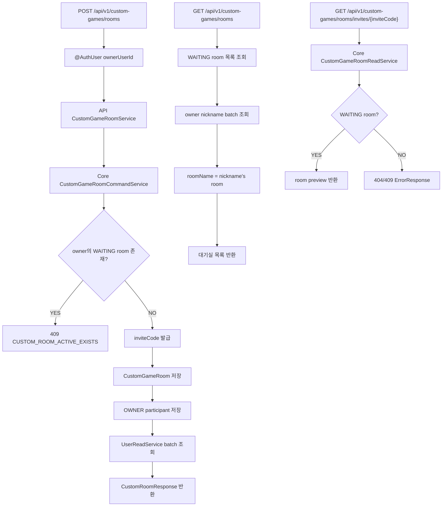
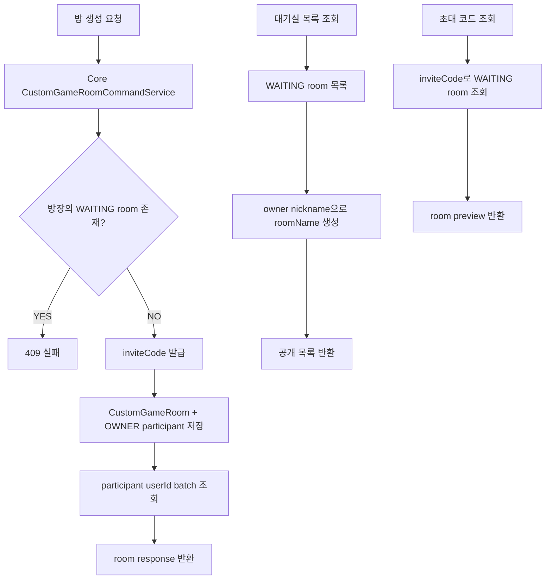

# Issue 124. Custom Room 생성 / 공개 목록 / 공개 조회 API 계약

## 📌 Feature Description

사용자가 사용자 지정 게임 방을 만들고, 공개 대기실 목록 또는 초대 코드로 방 상태를 확인할 수 있는 Custom Room 기본 API를 구현한다.

이번 이슈는 사용자 지정 게임의 가장 작은 기반이다. 아직 방 참가, 나가기, Room WebSocket, 게임 시작, GamePlay 연결은 구현하지 않는다. 먼저 방을 만들 수 있어야 하고, 만든 사람은 방장으로 방에 들어가 있어야 한다. 다른 사용자는 공개 대기실 목록에서 방을 클릭하거나, 초대 코드로 방을 찾아 후속 join API에서 입장하게 된다.



핵심 정책은 다음과 같다.

- 사용자 지정 room은 일반 match queue와 독립이다.
- 이번 이슈에서는 custom room만 만들고, 아직 `GameRoom`은 만들지 않는다.
- `GameRoom.gameMode=CUSTOM` 생성은 후속 4-6 이슈에서 처리한다.
- 방장은 `WAITING` 상태 custom room을 1개만 가질 수 있다.
- 모든 `WAITING` custom room은 공개 대기실 목록에 노출한다.
- 대기실 이름은 owner nickname 기준 `{nickname}'s room`으로 내려준다.
- 초대 링크는 `roomId`가 아니라 `inviteCode`를 사용한다.
- inviteCode 공개 조회는 인증 없이 호출할 수 있다.
- 공개 조회는 참가 처리 없이 room preview만 반환한다.
- 최대 인원은 MVP 기준 2명으로 고정한다.
- API 모듈은 custom room repository를 직접 참조하지 않고 core service를 사용한다.
- 참가자 nickname은 `UserReadService.findAllByIdsOrThrow` batch 조회로 가져온다.
- 새 외부 패키지를 추가하지 않는다.

## Backend Contract

### Custom Room Create API

```http
POST /api/v1/custom-games/rooms
Authorization: Bearer {accessToken}
```

Request body는 없다. 인증 사용자 식별은 기존 `@AuthUser Long userId` 정책을 따른다.

#### Response

```json
{
  "roomId": 1,
  "roomName": "Host's room",
  "inviteCode": "AB12CD",
  "ownerUserId": 10,
  "status": "WAITING",
  "maxParticipants": 2,
  "participants": [
    {
      "userId": 10,
      "nickname": "Host",
      "role": "OWNER"
    }
  ]
}
```

### Custom Room Public List API

```http
GET /api/v1/custom-games/rooms
```

인증 없이 호출 가능하다. 모든 `WAITING` custom room을 공개 대기실 목록으로 반환한다. 목록 클릭으로 입장하는 실제 처리는 후속 `join` API에서 인증 후 처리한다.

#### Response

```json
{
  "rooms": [
    {
      "roomId": 1,
      "roomName": "Host's room",
      "inviteCode": "AB12CD",
      "ownerUserId": 10,
      "status": "WAITING",
      "maxParticipants": 2,
      "currentParticipants": 1
    }
  ]
}
```

### Custom Room Invite Preview API

```http
GET /api/v1/custom-games/rooms/invites/{inviteCode}
```

인증 없이 호출 가능하다. 이 API는 초대 링크 진입 화면 또는 초대 코드 입력 화면에서 방 상태를 미리 확인하기 위한 조회 API다. 참가 처리는 하지 않으며, 실제 참가 권한 부여는 후속 `join` API에서 인증 후 처리한다.

#### Response

```json
{
  "roomId": 1,
  "roomName": "Host's room",
  "inviteCode": "AB12CD",
  "ownerUserId": 10,
  "status": "WAITING",
  "maxParticipants": 2,
  "participants": [
    {
      "userId": 10,
      "nickname": "Host",
      "role": "OWNER"
    }
  ]
}
```

### Field Policy

| field | 포함 여부 | 이유 |
|-------|-----------|------|
| `roomId` | 포함 | room page route와 후속 join/start API 식별자 |
| `roomName` | 포함 | 공개 대기실 목록 표시 이름. `{ownerNickname}'s room` |
| `inviteCode` | 포함 | 초대 링크 public key |
| `ownerUserId` | 포함 | 방장 표시와 start 권한 판단 기준 |
| `status` | 포함 | `WAITING`, `STARTED`, `CLOSED` 상태 표시 기준 |
| `maxParticipants` | 포함 | MVP 최대 2명 정책 표시 |
| `participants[].userId` | 포함 | 참가자 식별 |
| `participants[].nickname` | 포함 | 방 화면 표시용 이름 |
| `participants[].role` | 포함 | `OWNER`, `PLAYER` 구분 |
| `currentParticipants` | 목록 응답에 포함 | 대기실 목록에서 현재 인원 표시 |
| `gameRoomId` | 제외 | 아직 게임 시작 전이며 4-6에서 생성 |
| `scenario` | 제외 | 아직 게임 시작 전이며 4-6에서 생성 |
| `webSocketUrl` | 제외 | Room WebSocket은 4-5, Game WebSocket은 4-10 범위 |

### Source Of Truth Policy

- Custom room 생성 source of truth는 core `CustomGameRoomCommandService`다.
- Custom room 조회 source of truth는 core `CustomGameRoomReadService`다.
- API 응답의 nickname은 core user 도메인의 `UserReadService`를 통해 조회한다.
- API 응답의 `roomName`은 owner nickname으로 만든 표시용 값이며 저장 source가 아니다.
- API 모듈은 custom room repository와 user repository를 직접 사용하지 않는다.
- 공개 목록 조회는 현재 참여 가능한 `WAITING` room 목록 source다.
- inviteCode 공개 조회는 room preview source일 뿐 참가 source가 아니다.
- GamePlay 진입 source는 이번 이슈에서 만들지 않는다.

### Error

- 인증 없음/만료/유효하지 않은 token은 기존 security/auth error response를 따른다.
- 방장이 이미 `WAITING` custom room을 가지고 있으면 `409`를 반환한다.
- inviteCode가 존재하지 않으면 `404`를 반환한다.
- inviteCode가 `STARTED` 또는 `CLOSED` room을 가리키면 공개 조회를 실패 처리한다.
- participant user 조회 중 User가 없으면 `CoreErrorCode.USER_NOT_FOUND` 기반 에러를 반환한다.
- inviteCode 충돌이 반복되어 발급에 실패하면 custom room 생성 실패 에러를 반환한다.

## Scope Boundary

이번 이슈에 포함:

- `POST /api/v1/custom-games/rooms` API 구현.
- `GET /api/v1/custom-games/rooms` API 구현.
- `GET /api/v1/custom-games/rooms/invites/{inviteCode}` API 구현.
- `CustomGamePath` path 상수 추가.
- `CustomGameRoom`, `CustomGameParticipant` 기본 domain 구현.
- `CustomRoomStatus`, `CustomRoomParticipantRole` enum 구현.
- `CustomGameRoomRepository` 구현.
- core command/read service 구현.
- inviteCode 발급 및 unique 정책 구현.
- owner의 `WAITING` room 중복 생성 차단.
- room response DTO 구현.
- 공개 대기실 목록 response DTO 구현.
- participant nickname batch 조회 구현.
- RestDocs 성공/실패 문서화.
- core/api test 구현.
- `docs/last-구현.md` Section 4-3 정합성 반영.

이번 이슈에서 제외:

- 초대 코드로 방 참가 API.
- 방 나가기 API.
- Room WebSocket 연결.
- `ROOM_UPDATED`, `ROOM_CLOSED`, `ROOM_STARTED` event.
- 사용자 지정 게임 시작 API.
- `gameMode=CUSTOM` GameRoom 생성.
- custom game scenario 생성.
- GamePlayPage custom handoff.
- custom game 결과 WebSocket 처리.
- custom game 랭크 제외 / 전적 기록 구현.
- 프론트 방 생성/초대 링크 UI.
- 친구 목록 기반 초대.
- room 만료 scheduler.
- 3명 이상 참가.
- 새 외부 패키지 추가.

## 📚 Tasks

### 1. Backend Contract 정리

- [x] endpoint를 `POST /api/v1/custom-games/rooms`로 확정.
- [x] endpoint를 `GET /api/v1/custom-games/rooms`로 확정.
- [x] endpoint를 `GET /api/v1/custom-games/rooms/invites/{inviteCode}`로 확정.
- [x] create request body 없음과 `@AuthUser Long userId` 인증 사용자 식별 정책 문서화.
- [x] public room list는 인증 없이 호출 가능함을 문서화.
- [x] invite preview는 인증 없이 호출 가능함을 문서화.
- [x] room response shape를 `roomId`, `roomName`, `inviteCode`, `ownerUserId`, `status`, `maxParticipants`, `participants`로 확정.
- [x] room list response shape를 `rooms[].roomId`, `rooms[].roomName`, `rooms[].inviteCode`, `rooms[].ownerUserId`, `rooms[].status`, `rooms[].maxParticipants`, `rooms[].currentParticipants`로 확정.
- [x] 모든 `WAITING` custom room은 공개 목록에 노출함을 문서화.
- [x] roomName은 `{ownerNickname}'s room` 표시값임을 문서화.
- [x] inviteCode는 roomId를 직접 공유하지 않는 public key임을 문서화.
- [x] 방장은 `WAITING` room을 1개만 가질 수 있음을 문서화.
- [x] 이번 이슈는 join/leave/WebSocket/start/GameRoom 생성을 제외함을 문서화.
- [x] core/api 책임 분리 정책 문서화.

### 2. Core Custom Room Domain 구현

- [ ] `domain/customgame` 패키지 추가.
- [ ] `CustomGameRoom` entity 구현.
- [ ] `CustomGameParticipant` entity 구현.
- [ ] `CustomRoomStatus` enum 구현.
- [ ] `CustomRoomParticipantRole` enum 구현.
- [ ] `CustomGameRoom.MAX_PARTICIPANTS = 2` 정책 추가.
- [ ] room 생성 시 owner participant 추가 메서드 구현.
- [ ] participant 추가 시 최대 인원 방어 로직 구현.
- [ ] room status 전환 기본 메서드 구현.
- [ ] inviteCode 필드 unique 제약 추가.
- [ ] ownerUserId + WAITING room 중복 생성을 막기 위한 repository 조회 메서드 구현.

### 3. Core Custom Room Service 구현

- [ ] `CustomGameRoomCommandService.createRoom(ownerUserId)` 구현.
- [ ] ownerUserId null 검증.
- [ ] owner의 기존 `WAITING` room 존재 시 예외 처리.
- [ ] inviteCode 발급기 구현.
- [ ] inviteCode unique 충돌 시 재시도 정책 구현.
- [ ] `CustomGameRoomReadService.getWaitingRoomByInviteCode(inviteCode)` 구현.
- [ ] `CustomGameRoomReadService.findWaitingRooms()` 구현.
- [ ] 존재하지 않는 inviteCode 예외 처리.
- [ ] `STARTED`, `CLOSED` room 공개 조회 실패 처리.
- [ ] core custom room error code 추가.

### 4. Custom Room API 구현

- [ ] `CustomGamePath` 상수 추가.
- [ ] `CustomGameRoomController` 구현.
- [ ] `CustomGameRoomService` 구현.
- [ ] create API에서 core command service 호출.
- [ ] public list API에서 core read service 호출.
- [ ] invite preview API에서 core read service 호출.
- [ ] response 조립 시 participant userId를 모아 `UserReadService.findAllByIdsOrThrow` 호출.
- [ ] list response 조립 시 owner userId를 모아 `UserReadService.findAllByIdsOrThrow` 호출.
- [ ] participant별 user 단건 조회 반복을 금지.
- [ ] `CustomRoomResponse`, `CustomRoomListResponse`, `CustomRoomListItemResponse`, `CustomRoomParticipantResponse` 구현.
- [ ] 공개 room list/invite preview API가 security 설정에서 허용되어야 하는지 확인하고 필요한 경우 반영.

### 5. Test 구현

- [ ] core domain unit test 작성.
- [ ] core repository `@DataJpaTest` 작성.
- [ ] core service test 작성.
- [ ] API service unit test 작성.
- [ ] controller `RestAssuredMockMvc` test 작성.
- [ ] RestDocs test 작성.
- [ ] owner 중복 `WAITING` room 생성 실패 검증.
- [ ] 공개 room list 조회 성공 검증.
- [ ] 공개 room list에는 `WAITING` room만 포함되는지 검증.
- [ ] roomName이 owner nickname 기준으로 만들어지는지 검증.
- [ ] inviteCode 공개 조회 성공 검증.
- [ ] 존재하지 않는 inviteCode 조회 실패 검증.
- [ ] `STARTED`, `CLOSED` room 공개 조회 실패 검증.
- [ ] user nickname batch 조회 검증.

### 6. 문서 정합성 구현

- [ ] `docs/last-구현.md` Section 4-3 endpoint를 공개 목록/초대 코드 조회 기준으로 보정.
- [ ] 후속 4-4 join API가 inviteCode를 사용함을 문서와 충돌 없게 확인.
- [ ] 후속 4-8 프론트 대기실 목록/초대 링크 구현이 공개 목록과 inviteCode 기반임을 확인.
- [ ] issue-124 PR 섹션 보강.

### 7. 검증

- [ ] `./gradlew :league-of-star-core:test`
- [ ] `./gradlew :league-of-star-api:test`
- [ ] `./gradlew test`
- [ ] `./gradlew build`
- [ ] RestDocs snippet 생성 확인.
- [ ] `git diff --check`

## Implementation Policy

- API 모듈은 custom room repository를 직접 참조하지 않는다.
- custom room 영속성 접근은 core service를 통해서만 수행한다.
- API 모듈은 core room service와 core user service를 조합해 response만 만든다.
- participant nickname 조회는 batch 조회로 처리한다.
- 이번 이슈에서는 custom room만 만들고 `GameRoom`은 만들지 않는다.
- 이번 이슈에서는 HTTP create 응답이 room 생성 결과이며, 게임 시작 handoff가 아니다.
- 공개 room list API는 모든 `WAITING` custom room을 노출한다.
- roomName은 저장하지 않고 owner nickname 기준으로 응답에서 만든다.
- invite preview API는 참가 처리를 하지 않는다.
- inviteCode는 roomId 노출을 피하기 위한 public join key다.
- 방장은 `WAITING` custom room을 1개만 가질 수 있다.
- 새 외부 패키지를 추가하지 않는다.

## Acceptance Criteria

- 로그인 사용자가 custom room을 생성할 수 있다.
- 방 생성 응답에 inviteCode와 owner participant가 포함된다.
- 같은 사용자가 `WAITING` custom room을 중복 생성하면 실패한다.
- 공개 대기실 목록에서 `WAITING` custom room을 조회할 수 있다.
- 공개 대기실 목록의 roomName은 `{ownerNickname}'s room` 형식이다.
- inviteCode로 `WAITING` custom room을 공개 조회할 수 있다.
- 존재하지 않거나 참여 불가능한 inviteCode 조회는 실패한다.
- API response의 participant nickname은 user batch 조회로 조립된다.
- RestDocs에 성공/실패 계약이 문서화된다.
- core/api 테스트가 통과한다.
- 후속 4-4, 4-5, 4-6 이슈와 범위가 겹치지 않는다.

## PR Message

## PR 작성 방법

## 📌 Summary

사용자 지정 게임을 위한 가장 작은 방 생성/공개 대기실 기반을 구현함.

이번 PR은 게임을 바로 시작하는 작업이 아니라, 사용자가 사용자 지정 방을 만들고 공개 대기실 목록 또는 초대 코드로 방 상태를 확인할 수 있게 하는 작업이다. 방 참가, 실시간 동기화, 게임 시작은 후속 이슈로 분리한다.



핵심 정책:

- custom room은 일반 match queue와 독립이다.
- 방장은 `WAITING` custom room을 1개만 가질 수 있다.
- 모든 `WAITING` custom room은 공개 대기실 목록에 노출한다.
- 대기실 이름은 `{ownerNickname}'s room`으로 표시한다.
- 초대 링크는 `roomId`가 아니라 `inviteCode`를 사용한다.
- 공개 조회는 참가 처리를 하지 않는다.
- 이번 PR에서는 `GameRoom`, scenario, WebSocket, 게임 시작을 만들지 않는다.

백엔드와의 구현 계약:

- `POST /api/v1/custom-games/rooms`는 인증 사용자의 custom room을 생성한다.
- `GET /api/v1/custom-games/rooms`는 공개 대기실 목록을 조회한다.
- `GET /api/v1/custom-games/rooms/invites/{inviteCode}`는 초대 링크 미리보기용 공개 조회다.
- API 모듈은 core custom room service와 user read service를 통해 데이터를 가져온다.
- participant nickname은 user batch 조회를 사용한다.

## 📚 Changes

- 사용자 지정 게임을 바로 시작하지 않고 먼저 공개 대기실 개념부터 분리함.
  사용자는 대기실 목록에서 방을 고르거나 초대 코드로 방을 찾은 뒤 입장하게 된다. GameRoom/Scenario 생성은 시작 버튼을 누른 뒤의 책임이므로 이번 PR에서는 custom room 테이블, 공개 목록, inviteCode만 만들고 실제 게임 시작은 후속 이슈로 남김.
- 방 이름을 owner nickname 기준으로 응답에서 만들어 내려줌.
  방 생성 request body를 받지 않으므로 사용자가 직접 방 제목을 정하지 않는다. MVP에서는 모든 공개 방을 `{nickname}'s room`으로 표시해 별도 제목 검증 없이 대기실 목록을 구성함.
- 초대 링크를 roomId가 아니라 inviteCode로 설계함.
  roomId는 내부 식별자이고, inviteCode는 사용자가 공유하는 public key다. 초대 링크에 roomId를 직접 노출하지 않으면 후속 초대/참가 흐름을 더 명확하게 관리할 수 있음.
- core 모듈에 custom room 도메인 규칙을 둠.
  방 생성, owner participant 저장, 중복 waiting room 차단, inviteCode 조회는 데이터 규칙이므로 core service가 담당한다. api 모듈은 repository를 직접 보지 않고 core service 결과와 user batch 조회를 조합해 HTTP 응답을 만든다.
- nickname 조회는 batch 방식으로 처리함.
  참가자가 최대 2명이어도 API 응답 조립에서 participant마다 user 단건 조회를 반복하지 않는다. 기존 ranking/record API와 같은 방식으로 userId를 모아 한 번에 조회한다.

## 📝 Note

- 이번 PR에서 초대 참가, 나가기, Room WebSocket, 게임 시작은 제외함.
- `gameMode=CUSTOM` GameRoom 생성은 후속 4-6 범위임.
- custom game 랭크 제외 / 전적 기록은 후속 4-7 범위임.
- 프론트 초대 링크 UI는 후속 4-8 범위임.
- 새 패키지 추가 없음.
- 검증 결과를 PR 작성 시 기록함.

## 📌 Related Issue

- Closes #124
