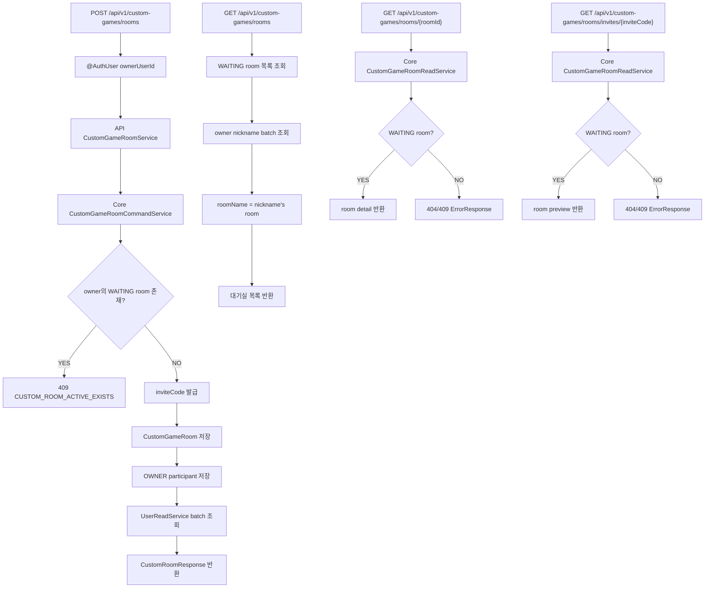
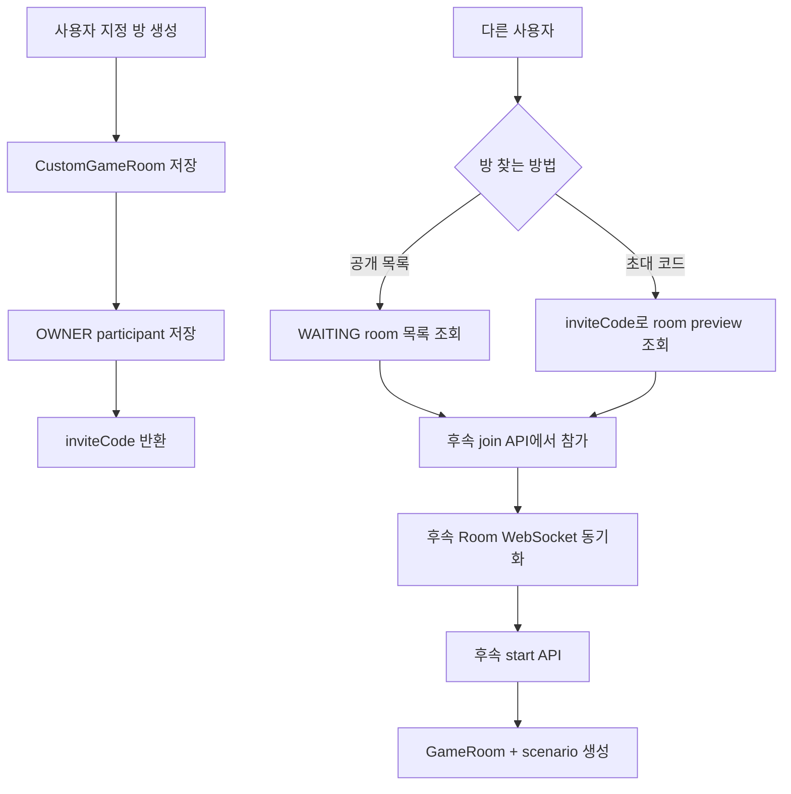
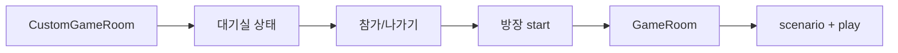
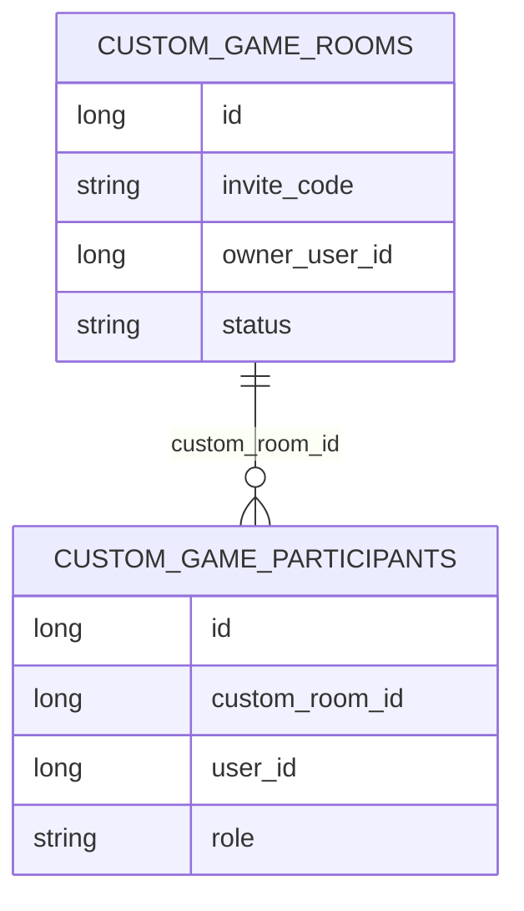

# Issue 124. Custom Room 생성 / 공개 목록 / 공개 조회 API 계약

## 📌 Feature Description

사용자가 사용자 지정 게임 방을 만들고, 공개 대기실 목록 또는 초대 코드로 방 상태를 확인할 수 있는 Custom Room 기본 API를 구현한다.

이번 이슈는 사용자 지정 게임의 가장 작은 기반이다. 아직 방 참가, 나가기, Room WebSocket, 게임 시작, GamePlay 연결은 구현하지 않는다. 먼저 방을 만들 수 있어야 하고, 만든 사람은 방장으로 방에 들어가 있어야 한다. 다른 사용자는 공개 대기실 목록에서 방을 클릭하거나, 초대 코드로 방을 찾아 후속 join API에서 입장하게 된다.



핵심 정책은 다음과 같다.

- 사용자 지정 room은 일반 match queue와 독립이다.
- 이번 이슈에서는 custom room만 만들고, 아직 `GameRoom`은 만들지 않는다.
- `GameRoom.gameMode=CUSTOM` 생성은 후속 4-6 이슈에서 처리한다.
- 방장은 `WAITING` 상태 custom room을 1개만 가질 수 있다.
- 방장별 `WAITING` custom room 1개 정책은 애플리케이션 사전 조회와 DB unique 제약으로 함께 방어한다.
- 모든 `WAITING` custom room은 공개 대기실 목록에 노출한다.
- 대기실 이름은 owner nickname 기준 `{nickname}'s room`으로 내려준다.
- room detail 조회는 `roomId` 기반 route 새로고침 복구용이며 참가 처리를 하지 않는다.
- 초대 링크는 `roomId`가 아니라 `inviteCode`를 사용한다.
- inviteCode 공개 조회는 인증 없이 호출할 수 있다.
- 공개 조회는 참가 처리 없이 room preview만 반환한다.
- 최대 인원은 MVP 기준 2명으로 고정한다.
- API 모듈은 custom room repository를 직접 참조하지 않고 core service를 사용한다.
- `CustomGameRoom`은 참가자 컬렉션을 직접 들지 않고, `CustomGameParticipant.customRoomId`로 room을 간접참조한다.
- 참가자 목록은 room 조회 후 participant repository를 core read service가 별도로 조회해 응답 조립에 사용한다.
- 참가자 nickname은 `UserReadService.findAllByIdsOrThrow` batch 조회로 가져온다.
- 새 외부 패키지를 추가하지 않는다.

## Backend Contract

### Custom Room Create API

```http
POST /api/v1/custom-games/rooms
Authorization: Bearer {accessToken}
```

Request body는 없다. 인증 사용자 식별은 기존 `@AuthUser Long userId` 정책을 따른다.

#### Response

```json
{
  "roomId": 1,
  "roomName": "Host's room",
  "inviteCode": "AB12CD",
  "ownerUserId": 10,
  "status": "WAITING",
  "maxParticipants": 2,
  "participants": [
    {
      "userId": 10,
      "nickname": "Host",
      "role": "OWNER"
    }
  ]
}
```

### Custom Room Public List API

```http
GET /api/v1/custom-games/rooms
```

인증 없이 호출 가능하다. 모든 `WAITING` custom room을 공개 대기실 목록으로 반환한다. 목록 클릭으로 입장하는 실제 처리는 후속 `join` API에서 인증 후 처리한다.

#### Response

```json
{
  "rooms": [
    {
      "roomId": 1,
      "roomName": "Host's room",
      "inviteCode": "AB12CD",
      "ownerUserId": 10,
      "status": "WAITING",
      "maxParticipants": 2,
      "currentParticipants": 1
    }
  ]
}
```

### Custom Room Detail API

```http
GET /api/v1/custom-games/rooms/{roomId}
```

인증 없이 호출 가능하다. 이 API는 프론트의 `/custom-games/rooms/:roomId` 상세 화면에서 새로고침하거나 직접 진입했을 때 방 정보를 복구하기 위한 조회 API다. 참가 처리는 하지 않으며, `WAITING` custom room만 반환한다.

#### Response

```json
{
  "roomId": 1,
  "roomName": "Host's room",
  "inviteCode": "AB12CD",
  "ownerUserId": 10,
  "status": "WAITING",
  "maxParticipants": 2,
  "participants": [
    {
      "userId": 10,
      "nickname": "Host",
      "role": "OWNER"
    }
  ]
}
```

### Custom Room Invite Preview API

```http
GET /api/v1/custom-games/rooms/invites/{inviteCode}
```

인증 없이 호출 가능하다. 이 API는 초대 링크 진입 화면 또는 초대 코드 입력 화면에서 방 상태를 미리 확인하기 위한 조회 API다. 참가 처리는 하지 않으며, 실제 참가 권한 부여는 후속 `join` API에서 인증 후 처리한다.

#### Response

```json
{
  "roomId": 1,
  "roomName": "Host's room",
  "inviteCode": "AB12CD",
  "ownerUserId": 10,
  "status": "WAITING",
  "maxParticipants": 2,
  "participants": [
    {
      "userId": 10,
      "nickname": "Host",
      "role": "OWNER"
    }
  ]
}
```

### Field Policy

| field | 포함 여부 | 이유 |
|-------|-----------|------|
| `roomId` | 포함 | room page route와 후속 join/start API 식별자 |
| `roomName` | 포함 | 공개 대기실 목록 표시 이름. `{ownerNickname}'s room` |
| `inviteCode` | 포함 | 초대 링크 public key |
| `ownerUserId` | 포함 | 방장 표시와 start 권한 판단 기준 |
| `status` | 포함 | `WAITING`, `STARTED`, `CLOSED` 상태 표시 기준 |
| `maxParticipants` | 포함 | MVP 최대 2명 정책 표시 |
| `participants[].userId` | 포함 | 참가자 식별 |
| `participants[].nickname` | 포함 | 방 화면 표시용 이름 |
| `participants[].role` | 포함 | `OWNER`, `PLAYER` 구분 |
| `currentParticipants` | 목록 응답에 포함 | 대기실 목록에서 현재 인원 표시 |
| `gameRoomId` | 제외 | 아직 게임 시작 전이며 4-6에서 생성 |
| `scenario` | 제외 | 아직 게임 시작 전이며 4-6에서 생성 |
| `webSocketUrl` | 제외 | Room WebSocket은 4-5, Game WebSocket은 4-10 범위 |

### Source Of Truth Policy

- Custom room 생성 source of truth는 core `CustomGameRoomCommandService`다.
- Custom room 조회 source of truth는 core `CustomGameRoomReadService`다.
- Custom room 참가자 source of truth는 core `CustomGameParticipantRepository`이며 API 모듈은 이를 직접 참조하지 않는다.
- API 응답의 nickname은 core user 도메인의 `UserReadService`를 통해 조회한다.
- API 응답의 `roomName`은 owner nickname으로 만든 표시용 값이며 저장 source가 아니다.
- API 모듈은 custom room repository와 user repository를 직접 사용하지 않는다.
- 공개 목록 조회는 현재 참여 가능한 `WAITING` room 목록 source다.
- inviteCode 공개 조회는 room preview source일 뿐 참가 source가 아니다.
- GamePlay 진입 source는 이번 이슈에서 만들지 않는다.

### Error

- 인증 없음/만료/유효하지 않은 token은 기존 security/auth error response를 따른다.
- 방장이 이미 `WAITING` custom room을 가지고 있으면 `409`를 반환한다.
- roomId가 존재하지 않으면 `404`를 반환한다.
- roomId가 `STARTED` 또는 `CLOSED` room을 가리키면 상세 조회를 실패 처리한다.
- inviteCode가 존재하지 않으면 `404`를 반환한다.
- inviteCode가 null/blank이면 잘못된 입력으로 처리한다.
- inviteCode가 `STARTED` 또는 `CLOSED` room을 가리키면 공개 조회를 실패 처리한다.
- participant user 조회 중 User가 없으면 `CoreErrorCode.USER_NOT_FOUND` 기반 에러를 반환한다.
- inviteCode 충돌이 반복되어 발급에 실패하면 custom room 생성 실패 에러를 반환한다.
- 동시 생성 중 DB unique 충돌이 발생해도 일반 500으로 흘리지 않고 custom room 도메인 예외로 변환한다.

## Scope Boundary

이번 이슈에 포함:

- `POST /api/v1/custom-games/rooms` API 구현.
- `GET /api/v1/custom-games/rooms` API 구현.
- `GET /api/v1/custom-games/rooms/{roomId}` API 구현.
- `GET /api/v1/custom-games/rooms/invites/{inviteCode}` API 구현.
- `CustomGamePath` path 상수 추가.
- `CustomGameRoom`, `CustomGameParticipant` 기본 domain 구현.
- `CustomGameParticipant.customRoomId` 간접참조 구조 구현.
- `CustomRoomStatus`, `CustomRoomParticipantRole` enum 구현.
- `CustomGameRoomRepository` 구현.
- `CustomGameParticipantRepository` 구현.
- core command/read service 구현.
- inviteCode 발급 및 unique 정책 구현.
- owner의 `WAITING` room 중복 생성 차단.
- room response DTO 구현.
- 공개 대기실 목록 response DTO 구현.
- participant nickname batch 조회 구현.
- room 목록 participant count batch 조회 구현.
- RestDocs 성공/실패 문서화.
- core/api test 구현.
- `docs/last-구현.md` Section 4-3 정합성 반영.

이번 이슈에서 제외:

- 초대 코드로 방 참가 API.
- 방 나가기 API.
- Room WebSocket 연결.
- `ROOM_UPDATED`, `ROOM_CLOSED`, `ROOM_STARTED` event.
- 사용자 지정 게임 시작 API.
- `gameMode=CUSTOM` GameRoom 생성.
- custom game scenario 생성.
- GamePlayPage custom handoff.
- custom game 결과 WebSocket 처리.
- custom game 랭크 제외 / 전적 기록 구현.
- 프론트 방 생성/초대 링크 UI.
- 친구 목록 기반 초대.
- room 만료 scheduler.
- 3명 이상 참가.
- 새 외부 패키지 추가.

## 📚 Tasks

### 1. Backend Contract 정리

- [x] endpoint를 `POST /api/v1/custom-games/rooms`로 확정.
- [x] endpoint를 `GET /api/v1/custom-games/rooms`로 확정.
- [x] endpoint를 `GET /api/v1/custom-games/rooms/{roomId}`로 확정.
- [x] endpoint를 `GET /api/v1/custom-games/rooms/invites/{inviteCode}`로 확정.
- [x] create request body 없음과 `@AuthUser Long userId` 인증 사용자 식별 정책 문서화.
- [x] public room list는 인증 없이 호출 가능함을 문서화.
- [x] room detail은 인증 없이 호출 가능하며 참가 처리를 하지 않음을 문서화.
- [x] invite preview는 인증 없이 호출 가능함을 문서화.
- [x] room response shape를 `roomId`, `roomName`, `inviteCode`, `ownerUserId`, `status`, `maxParticipants`, `participants`로 확정.
- [x] room list response shape를 `rooms[].roomId`, `rooms[].roomName`, `rooms[].inviteCode`, `rooms[].ownerUserId`, `rooms[].status`, `rooms[].maxParticipants`, `rooms[].currentParticipants`로 확정.
- [x] 모든 `WAITING` custom room은 공개 목록에 노출함을 문서화.
- [x] roomName은 `{ownerNickname}'s room` 표시값임을 문서화.
- [x] inviteCode는 roomId를 직접 공유하지 않는 public key임을 문서화.
- [x] 방장은 `WAITING` room을 1개만 가질 수 있음을 문서화.
- [x] 이번 이슈는 join/leave/WebSocket/start/GameRoom 생성을 제외함을 문서화.
- [x] core/api 책임 분리 정책 문서화.

### 2. Core Custom Room Domain 구현

- [x] `domain/customgame` 패키지 추가.
- [x] `CustomGameRoom` entity 구현.
- [x] `CustomGameParticipant` entity 구현.
- [x] `CustomGameParticipant.customRoomId` 기반 간접참조 구현.
- [x] `CustomRoomStatus` enum 구현.
- [x] `CustomRoomParticipantRole` enum 구현.
- [x] `CustomGameRoom.MAX_PARTICIPANTS = 2` 정책 추가.
- [x] room 생성 시 owner participant를 별도 participant row로 저장하는 구조 구현.
- [x] 같은 room/user participant 중복 생성을 막는 unique 제약 추가.
- [x] room status 전환 기본 메서드 구현.
- [x] inviteCode 필드 unique 제약 추가.
- [x] ownerUserId + WAITING room 중복 생성을 막기 위한 repository 조회 메서드 구현.
- [x] 동시 요청에서도 owner의 `WAITING` room 중복 저장을 막는 DB unique 제약 추가.

### 3. Core Custom Room Service 구현

- [x] `CustomGameRoomCommandService.createRoom(ownerUserId)` 구현.
- [x] ownerUserId null 검증.
- [x] owner의 기존 `WAITING` room 존재 시 예외 처리.
- [x] inviteCode 발급기 구현.
- [x] inviteCode unique 충돌 시 재시도 정책 구현.
- [x] `CustomGameRoomReadService.getWaitingRoomByInviteCode(inviteCode)` 구현.
- [x] `CustomGameRoomReadService.findWaitingRooms()` 구현.
- [x] `CustomGameRoomReadService.getParticipants(customRoomId)` 구현.
- [x] `CustomGameRoomReadService.findParticipantsByRoomIds(roomIds)` 구현.
- [x] 존재하지 않는 inviteCode 예외 처리.
- [x] `STARTED`, `CLOSED` room 공개 조회 실패 처리.
- [x] core custom room error code 추가.

### 4. Custom Room API 구현

- [x] `CustomGamePath` 상수 추가.
- [x] `CustomGameRoomController` 구현.
- [x] `CustomGameRoomService` 구현.
- [x] create API에서 core command service 호출.
- [x] public list API에서 core read service 호출.
- [x] invite preview API에서 core read service 호출.
- [x] response 조립 시 participant userId를 모아 `UserReadService.findAllByIdsOrThrow` 호출.
- [x] list response 조립 시 owner userId를 모아 `UserReadService.findAllByIdsOrThrow` 호출.
- [x] participant별 user 단건 조회 반복을 금지.
- [x] `CustomRoomResponse`, `CustomRoomListResponse`, `CustomRoomListItemResponse`, `CustomRoomParticipantResponse` 구현.
- [x] 공개 room list/invite preview API가 security 설정에서 허용되어야 하는지 확인하고 필요한 경우 반영.

### 5. Test 구현

- [x] core domain unit test 작성.
- [x] core repository `@DataJpaTest` 작성.
- [x] core service test 작성.
- [x] API service unit test 작성.
- [x] controller `RestAssuredMockMvc` test 작성.
- [x] RestDocs test 작성.
- [x] owner 중복 `WAITING` room 생성 실패 검증.
- [x] owner 중복 `WAITING` room DB unique 제약 검증.
- [x] 공개 room list 조회 성공 검증.
- [x] 공개 room list에는 `WAITING` room만 포함되는지 검증.
- [x] roomName이 owner nickname 기준으로 만들어지는지 검증.
- [x] inviteCode 공개 조회 성공 검증.
- [x] 존재하지 않는 inviteCode 조회 실패 검증.
- [x] blank inviteCode 조회 실패 검증.
- [x] DB unique 충돌의 도메인 예외 변환 검증.
- [x] `STARTED`, `CLOSED` room 공개 조회 실패 검증.
- [x] user nickname batch 조회 검증.

### 6. 문서 정합성 구현

- [x] `docs/last-구현.md` Section 4-3 endpoint를 공개 목록/초대 코드 조회 기준으로 보정.
- [x] 후속 4-4 join API가 inviteCode를 사용함을 문서와 충돌 없게 확인.
- [x] 후속 4-8 프론트 대기실 목록/초대 링크 구현이 공개 목록과 inviteCode 기반임을 확인.
- [x] issue-124 PR 섹션 보강.

### 7. 검증

- [x] `./gradlew :league-of-star-core:test`
- [x] `./gradlew :league-of-star-api:test`
- [x] `./gradlew test`
- [x] `./gradlew build`
- [x] RestDocs snippet 생성 확인.
- [x] `git diff --check`

## Implementation Policy

- API 모듈은 custom room repository를 직접 참조하지 않는다.
- custom room 영속성 접근은 core service를 통해서만 수행한다.
- API 모듈은 core room service와 core user service를 조합해 response만 만든다.
- participant nickname 조회는 batch 조회로 처리한다.
- 이번 이슈에서는 custom room만 만들고 `GameRoom`은 만들지 않는다.
- 이번 이슈에서는 HTTP create 응답이 room 생성 결과이며, 게임 시작 handoff가 아니다.
- 공개 room list API는 모든 `WAITING` custom room을 노출한다.
- roomName은 저장하지 않고 owner nickname 기준으로 응답에서 만든다.
- invite preview API는 참가 처리를 하지 않는다.
- inviteCode는 roomId 노출을 피하기 위한 public join key다.
- 방장은 `WAITING` custom room을 1개만 가질 수 있다.
- 방장별 `WAITING` room 중복 생성은 DB unique 제약으로 최종 방어한다.
- 새 외부 패키지를 추가하지 않는다.

## Acceptance Criteria

- 로그인 사용자가 custom room을 생성할 수 있다.
- 방 생성 응답에 inviteCode와 owner participant가 포함된다.
- 같은 사용자가 `WAITING` custom room을 중복 생성하면 실패한다.
- 공개 대기실 목록에서 `WAITING` custom room을 조회할 수 있다.
- 공개 대기실 목록의 roomName은 `{ownerNickname}'s room` 형식이다.
- inviteCode로 `WAITING` custom room을 공개 조회할 수 있다.
- 존재하지 않거나 참여 불가능한 inviteCode 조회는 실패한다.
- API response의 participant nickname은 user batch 조회로 조립된다.
- RestDocs에 성공/실패 계약이 문서화된다.
- core/api 테스트가 통과한다.
- 후속 4-4, 4-5, 4-6 이슈와 범위가 겹치지 않는다.

## PR Message

## PR 작성 방법

## 📌 Summary

사용자 지정 게임을 시작하기 전 단계인 “방 만들기 / 공개 대기실 보기 / 초대 코드로 방 확인하기” 기반을 구현함.

이번 PR은 게임을 바로 시작하는 작업이 아니다. 사용자가 먼저 대기실을 만들고, 다른 사용자가 그 방을 목록이나 초대 코드로 찾을 수 있게 하는 작업이다.

그래서 `CustomGameRoom`은 “아직 게임이 시작되기 전 대기실”만 담당한다. 실제 플레이에 필요한 `GameRoom`, scenario, WebSocket 시작 이벤트는 후속 이슈에서 만든다. 이렇게 나눈 이유는 대기실 조회/참가/시작 흐름과 실제 게임 플레이 흐름을 섞지 않기 위해서다.



핵심 정책:

- custom room은 “게임 전 대기실”이고, match queue와 독립임.
- `GameRoom`은 실제 게임이 시작될 때 만들기 때문에 이번 PR에서 만들지 않음.
- 방장은 `WAITING` custom room을 1개만 가질 수 있음.
- 모든 `WAITING` custom room은 공개 대기실 목록에 노출함.
- 초대 링크는 내부 ID인 `roomId`가 아니라 공유용 코드인 `inviteCode`를 사용함.
- 공개 목록/초대 코드 조회는 방을 보여주기만 하고, 참가 처리는 하지 않음.
- 참가, 나가기, Room WebSocket, 게임 시작은 후속 이슈 범위임.

백엔드와의 구현 계약:

- `POST /api/v1/custom-games/rooms`는 인증 사용자의 custom room을 생성한다.
- `GET /api/v1/custom-games/rooms`는 공개 대기실 목록을 조회한다.
- `GET /api/v1/custom-games/rooms/invites/{inviteCode}`는 초대 링크 미리보기용 공개 조회다.
- 방 생성자는 자동으로 `OWNER` participant로 저장된다.
- API 모듈은 repository를 직접 사용하지 않고 core custom room service를 통해 room/participant를 가져온다.
- nickname은 user 도메인의 `UserReadService`를 통해 가져온다.
- custom room 참가자는 room entity 내부 컬렉션이 아니라 `customRoomId`를 가진 별도 row로 관리한다.

## 📚 Changes

- 사용자 흐름을 “대기실”과 “실제 게임”으로 분리함.
  사용자가 사용자 지정 게임을 누르면 바로 게임이 시작되는 것이 아니라 먼저 방이 만들어진다. 다른 사용자는 그 방을 공개 목록에서 고르거나 초대 코드로 찾는다. 실제 게임 시작은 방장이 start를 누른 뒤에 일어나므로, 이번 PR에서는 `CustomGameRoom`까지만 만들고 `GameRoom` 생성은 후속 이슈로 남겼다. 이렇게 해야 “방을 찾는 단계”와 “게임을 플레이하는 단계”가 섞이지 않는다.



- `CustomGameRoom`과 `CustomGameParticipant`를 간접참조로 분리함.
  처음에는 room 안에 participants 컬렉션을 직접 둘 수도 있다. 하지만 사용자 지정 방은 후속 이슈에서 join/leave가 계속 붙는다. 참가자만 추가하거나 제거하려고 매번 room 전체와 컬렉션을 함께 다루면 구조가 무거워진다. 그래서 room은 방 상태, 방장, 초대 코드만 알고, 참가자는 `customRoomId`로 room을 가리키게 했다.



- 간접참조를 선택한 이유는 후속 기능이 단순해지기 때문임.
  join API는 participant row를 추가하면 되고, leave API는 participant row를 제거하거나 room을 닫으면 된다. 공개 대기실 목록은 room 목록을 먼저 가져오고 roomId 목록으로 participant를 한 번에 조회해 현재 인원을 계산하면 된다. 즉, 방 메타데이터와 참가자 목록을 필요한 순간에만 조합할 수 있다.

- core 모듈과 api 모듈의 책임을 분리함.
  방 생성, `WAITING` room 중복 차단, inviteCode 발급/조회, participant 저장은 데이터 규칙이므로 core 모듈에 둔다. api 모듈은 HTTP 요청을 받고 core service와 user read service 결과를 조합해 response를 만드는 역할만 한다. 이렇게 해야 api 모듈이 repository를 직접 만지지 않고, 데이터 규칙이 core 안에 모인다.

- `WAITING` room 중복 생성을 DB 제약으로 한 번 더 막음.
  사용자가 방 생성 버튼을 빠르게 두 번 누르거나 같은 요청이 동시에 들어오면, 사전 조회만으로는 둘 다 “대기 중인 방이 없다”고 판단할 수 있다. 그래서 `WAITING` 상태에서만 owner userId가 들어가는 unique key를 두었다. STARTED/CLOSED room은 이 key에서 빠지기 때문에 히스토리 room은 여러 개 남길 수 있고, 지금 대기 중인 room만 1개로 제한된다.

- inviteCode 충돌과 잘못된 입력을 도메인 에러로 정리함.
  inviteCode도 DB unique 제약이 있으므로 동시 생성 중 충돌할 수 있다. 이때 DB 예외가 그대로 500으로 나가지 않게 custom room 도메인 예외로 변환한다. 또한 blank inviteCode 조회는 “없는 방”이 아니라 “잘못된 초대 코드”이므로 입력 오류로 구분한다.

- nickname 조회는 batch 방식으로 처리함.
  응답에는 participant nickname이 필요하지만 participant row에는 userId만 저장한다. 그래서 api service가 userId를 모아 `UserReadService.findAllByIdsOrThrow`로 한 번에 조회한다. 참가자가 최대 2명이어도 row마다 user를 따로 조회하는 습관을 만들지 않기 위해 기존 ranking/record API와 같은 batch 정책을 적용했다.

- 방 이름은 저장하지 않고 owner nickname으로 만든다.
  MVP에서는 사용자가 방 제목을 직접 입력하지 않는다. 별도 제목 검증과 수정 기능을 만들기보다 `{ownerNickname}'s room`을 응답에서 만들어 내려준다. 방 이름은 표시값이고 source of truth는 owner userId와 user nickname이다.

- 초대 링크는 `roomId`가 아니라 `inviteCode`를 사용함.
  `roomId`는 내부 DB 식별자이고, `inviteCode`는 사용자가 공유하는 공개 키다. 초대 링크에서 내부 ID를 직접 쓰지 않으면 후속 초대/참가 흐름을 더 명확하게 분리할 수 있다. 이번 preview API는 “이 코드가 어떤 방인지 보여주기”만 하고, 실제 참가 여부는 후속 join API에서 인증 사용자 기준으로 결정한다.

## 📝 Note

- 이번 PR에서 초대 참가, 나가기, Room WebSocket, 게임 시작은 제외함.
- `gameMode=CUSTOM` GameRoom 생성은 후속 4-6 범위임.
- custom game 랭크 제외 / 전적 기록은 후속 4-7 범위임.
- 프론트 초대 링크 UI는 후속 4-8 범위임.
- 새 패키지 추가 없음.
- 검증 완료함.
  `./gradlew :league-of-star-core:test`, `./gradlew :league-of-star-api:test`, `./gradlew test`, `./gradlew build`, `git diff --check` 통과함.
  RestDocs snippet은 `custom-room-create`, `custom-room-create-active-exists`, `custom-room-public-list`, `custom-room-invite-preview`, `custom-room-invite-preview-not-found` 생성을 확인함.

## 📌 Related Issue

- Closes #124
