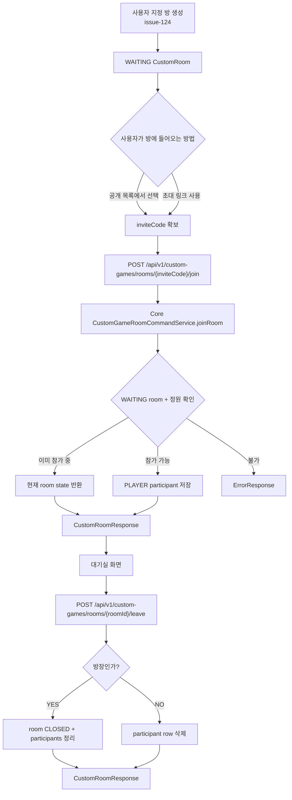
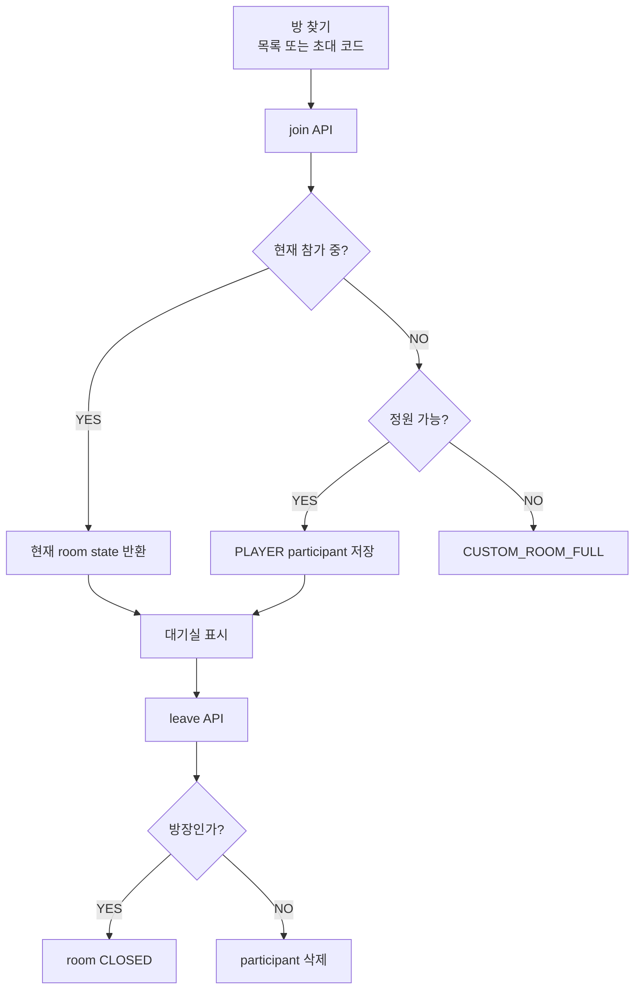

# Issue 126. Custom Room 초대 참가 / 나가기 API 계약

## 📌 Feature Description

사용자가 초대 코드로 사용자 지정 방에 참가하고, 대기 중인 방에서 나갈 수 있는 Custom Room lifecycle command API를 구현한다.

이번 이슈는 issue-124에서 만든 Custom Room 생성/공개 목록/초대 코드 조회 다음 단계다. issue-124는 “방을 만들고 찾는 기능”이고, 이번 이슈는 “찾은 방에 실제로 참가하거나 나가는 기능”이다.



핵심 정책은 다음과 같다.

- Custom Room join/leave는 일반 match queue와 독립이다.
- join/leave는 `WAITING` room에서만 허용한다.
- join은 인증 사용자 기준으로 처리한다.
- join은 inviteCode를 사용한다.
- leave는 roomId를 사용한다.
- 이미 참가한 사용자의 join은 멱등적으로 현재 room state를 반환한다.
- 일반 참가자 leave는 participant row 삭제로 처리한다.
- 방장 leave는 room을 `CLOSED`로 전환하고 해당 room participant를 정리한다.
- join/leave 이후 실시간 broadcast는 이번 이슈에서 하지 않는다.
- Room WebSocket `ROOM_UPDATED`, `ROOM_CLOSED` event는 후속 4-5 범위다.
- 게임 시작, `GameRoom.gameMode=CUSTOM` 생성, scenario 생성은 후속 4-6 범위다.
- API 모듈은 custom room repository를 직접 참조하지 않고 core service를 사용한다.
- 새 외부 패키지를 추가하지 않는다.

## Backend Contract

### Custom Room Join API

```http
POST /api/v1/custom-games/rooms/{inviteCode}/join
Authorization: Bearer {accessToken}
```

Request body는 없다. 인증 사용자 식별은 기존 `@AuthUser Long userId` 정책을 따른다.

#### Response

```json
{
  "roomId": 1,
  "roomName": "Host's room",
  "inviteCode": "AB12CD",
  "ownerUserId": 10,
  "status": "WAITING",
  "maxParticipants": 2,
  "participants": [
    {
      "userId": 10,
      "nickname": "Host",
      "role": "OWNER"
    },
    {
      "userId": 20,
      "nickname": "Guest",
      "role": "PLAYER"
    }
  ]
}
```

#### Join Policy

- inviteCode가 null/blank이면 `CUSTOM_ROOM_INVALID_INVITE_CODE`로 실패한다.
- inviteCode에 해당하는 room이 없으면 `CUSTOM_ROOM_NOT_FOUND`로 실패한다.
- room이 `WAITING`이 아니면 `CUSTOM_ROOM_INVALID_STATE`로 실패한다.
- 이미 참가한 사용자가 join하면 새 participant를 만들지 않고 현재 room state를 반환한다.
- 참가자가 2명이면 `CUSTOM_ROOM_FULL`로 실패한다.
- 동시 join으로 정원 초과가 발생하지 않도록 core command에서 room row를 pessimistic lock으로 조회한다.
- participant 중복 insert는 command의 room row lock과 사전 `exists` 확인으로 차단한다.
- `custom_room_id + user_id` unique 제약은 애플리케이션 레벨 방어가 누락될 때를 대비한 DB 최종 방어다.

### Custom Room Leave API

```http
POST /api/v1/custom-games/rooms/{roomId}/leave
Authorization: Bearer {accessToken}
```

Request body는 없다. 인증 사용자 식별은 기존 `@AuthUser Long userId` 정책을 따른다.

#### 일반 참가자 Leave Response

```json
{
  "roomId": 1,
  "roomName": "Host's room",
  "inviteCode": "AB12CD",
  "ownerUserId": 10,
  "status": "WAITING",
  "maxParticipants": 2,
  "participants": [
    {
      "userId": 10,
      "nickname": "Host",
      "role": "OWNER"
    }
  ]
}
```

#### 방장 Leave Response

```json
{
  "roomId": 1,
  "roomName": "Host's room",
  "inviteCode": "AB12CD",
  "ownerUserId": 10,
  "status": "CLOSED",
  "maxParticipants": 2,
  "participants": []
}
```

#### Leave Policy

- roomId가 없거나 room이 존재하지 않으면 `CUSTOM_ROOM_NOT_FOUND`로 실패한다.
- room이 `WAITING`이 아니면 `CUSTOM_ROOM_INVALID_STATE`로 실패한다.
- 참가하지 않은 사용자가 leave하면 `CUSTOM_ROOM_INVALID_PARTICIPANT`로 실패한다.
- 일반 참가자가 leave하면 해당 participant row를 삭제한다.
- 방장이 leave하면 room을 `CLOSED`로 전환하고 해당 room participant row를 모두 삭제한다.
- 방장 leave 이후 이 room은 공개 목록에 노출되지 않는다.
- leave 이후 다른 참가자에게 알리는 WebSocket broadcast는 후속 4-5 범위다.

### Field Policy

| field | 포함 여부 | 이유 |
|-------|-----------|------|
| `roomId` | 포함 | room page route와 후속 leave/start API 식별자 |
| `roomName` | 포함 | 대기실 표시 이름. `{ownerNickname}'s room` |
| `inviteCode` | 포함 | 초대 링크 public key |
| `ownerUserId` | 포함 | 방장 표시와 leave/start 권한 판단 기준 |
| `status` | 포함 | `WAITING`, `CLOSED` 상태 표시 기준 |
| `maxParticipants` | 포함 | MVP 최대 2명 정책 표시 |
| `participants[].userId` | 포함 | 현재 참가자 식별 |
| `participants[].nickname` | 포함 | 대기실 표시 이름 |
| `participants[].role` | 포함 | `OWNER`, `PLAYER` 구분 |
| `gameRoomId` | 제외 | 아직 게임 시작 전이며 4-6에서 생성 |
| `scenario` | 제외 | 아직 게임 시작 전이며 4-6에서 생성 |
| `webSocketUrl` | 제외 | Room WebSocket은 4-5, Game WebSocket은 4-10 범위 |

### Source Of Truth Policy

- join/leave command source of truth는 core `CustomGameRoomCommandService`다.
- room 조회 source of truth는 core `CustomGameRoomReadService`다.
- participant source of truth는 core `CustomGameParticipantRepository`이며 API 모듈은 직접 참조하지 않는다.
- API 응답의 nickname은 core user 도메인의 `UserReadService`를 통해 조회한다.
- API 응답의 `roomName`은 owner nickname으로 만든 표시용 값이며 저장 source가 아니다.
- HTTP join/leave 응답은 command 결과다.
- 실시간 room state source는 후속 Room WebSocket event에서 다룬다.
- GamePlay 진입 source는 이번 이슈에서 만들지 않는다.

### Error

- 인증 없음/만료/유효하지 않은 token은 기존 security/auth error response를 따른다.
- inviteCode가 null/blank이면 `CUSTOM_ROOM_INVALID_INVITE_CODE` 기반 에러를 반환한다.
- room이 존재하지 않으면 `CUSTOM_ROOM_NOT_FOUND` 기반 에러를 반환한다.
- `STARTED`, `CLOSED` room에 join/leave하면 `CUSTOM_ROOM_INVALID_STATE` 기반 에러를 반환한다.
- 정원이 가득 찬 room에 새 사용자가 join하면 `CUSTOM_ROOM_FULL` 기반 에러를 반환한다.
- 참가하지 않은 사용자가 leave하면 `CUSTOM_ROOM_INVALID_PARTICIPANT` 기반 에러를 반환한다.
- participant user 조회 중 User가 없으면 `CoreErrorCode.USER_NOT_FOUND` 기반 에러를 반환한다.
- 동시 join은 room row lock 안에서 `exists/count/save`를 수행해 정원 초과와 participant 중복을 차단한다.

## Scope Boundary

이번 이슈에 포함:

- `POST /api/v1/custom-games/rooms/{inviteCode}/join` API 구현.
- `POST /api/v1/custom-games/rooms/{roomId}/leave` API 구현.
- `CustomGamePath` join/leave path 상수 추가.
- core command service join/leave 구현.
- room row pessimistic lock 조회 repository method 구현.
- participant count / exists / delete repository method 구현.
- 이미 참가한 사용자 join 멱등 처리.
- 일반 참가자 leave 시 participant row 삭제.
- 방장 leave 시 room `CLOSED` 전환 및 participant row 정리.
- join/leave response DTO는 기존 `CustomRoomResponse` 재사용.
- participant nickname batch 조회 유지.
- RestDocs 성공/실패 문서화.
- core/api test 구현.
- `docs/last-구현.md` Section 4-4 정합성 반영.

이번 이슈에서 제외:

- Room WebSocket 연결.
- `ROOM_UPDATED`, `ROOM_CLOSED` event broadcast.
- 사용자 지정 게임 시작 API.
- `ROOM_STARTED` event.
- `gameMode=CUSTOM` GameRoom 생성.
- custom game scenario 생성.
- GamePlayPage custom handoff.
- custom game 결과 WebSocket 처리.
- custom game 랭크 제외 / 전적 기록 구현.
- 프론트 방 참가/나가기 UI.
- 친구 목록 기반 초대.
- room 만료 scheduler.
- 3명 이상 참가.
- participant leave history 저장.
- 새 외부 패키지 추가.

## 📚 Tasks

### 1. Backend Contract 정리

- [x] endpoint를 `POST /api/v1/custom-games/rooms/{inviteCode}/join`로 확정.
- [x] endpoint를 `POST /api/v1/custom-games/rooms/{roomId}/leave`로 확정.
- [x] join/leave request body 없음과 `@AuthUser Long userId` 인증 사용자 식별 정책 문서화.
- [x] join response shape를 기존 `CustomRoomResponse`로 확정.
- [x] leave response shape를 기존 `CustomRoomResponse`로 확정.
- [x] join은 inviteCode 기반 command임을 문서화.
- [x] leave는 roomId 기반 command임을 문서화.
- [x] 이미 참가한 사용자 join은 멱등적으로 현재 room state를 반환함을 문서화.
- [x] 일반 참가자 leave는 participant row 삭제임을 문서화.
- [x] 방장 leave는 room `CLOSED` 전환임을 문서화.
- [x] HTTP 응답은 command 결과이고 WebSocket broadcast는 후속 이슈임을 문서화.
- [x] core/api 책임 분리 정책 문서화.

### 2. Core Join / Leave Command 구현

- [x] `CustomGameRoomCommandService.joinRoom(inviteCode, userId)` 구현.
- [x] `CustomGameRoomCommandService.leaveRoom(roomId, userId)` 구현.
- [x] join inviteCode null/blank 검증.
- [x] leave roomId/userId null 검증.
- [x] room 존재 여부 검증.
- [x] `WAITING` room만 join/leave 가능하도록 검증.
- [x] 이미 참가한 사용자 join은 participant 저장 없이 room 반환.
- [x] 신규 참가자는 `PLAYER` participant로 저장.
- [x] 참가자 수가 `MAX_PARTICIPANTS` 이상이면 `CUSTOM_ROOM_FULL` 예외 처리.
- [x] 일반 참가자 leave 시 participant row 삭제.
- [x] 방장 leave 시 room `CLOSED` 전환.
- [x] 방장 leave 시 해당 room participant row 전체 삭제.
- [x] 참가하지 않은 사용자의 leave 실패 처리.
- [x] room row lock 안에서 exists/count/save를 처리해 participant unique 충돌 경로 차단.

### 3. Core Repository 구현

- [x] `CustomGameRoomRepository.findByInviteCodeForUpdate(inviteCode)` 구현.
- [x] `CustomGameRoomRepository.findByIdForUpdate(roomId)` 구현.
- [x] lock 조회는 `@Lock(PESSIMISTIC_WRITE)`를 사용.
- [x] `CustomGameParticipantRepository.deleteByCustomRoomIdAndUserId(customRoomId, userId)` 구현.
- [x] `CustomGameParticipantRepository.deleteByCustomRoomId(customRoomId)` 구현.
- [x] participant count/exists 기존 메서드를 join/leave command에 연결.
- [x] 동시 join 정원 초과 방어를 room lock 기준으로 검증.

### 4. Custom Room API 구현

- [x] `CustomGamePath`에 join/leave path 상수 추가.
- [x] `CustomGameRoomController.joinRoom()` 구현.
- [x] `CustomGameRoomController.leaveRoom()` 구현.
- [x] `CustomGameRoomService.joinRoom(inviteCode, userId)` 구현.
- [x] `CustomGameRoomService.leaveRoom(roomId, userId)` 구현.
- [x] API service는 core command 호출 후 participant를 다시 조회해 response 조립.
- [x] API service는 custom room repository를 직접 참조하지 않음.
- [x] nickname 조회는 `UserReadService.findAllByIdsOrThrow` batch 조회 사용.
- [x] owner nickname 기준 roomName 생성 정책 유지.

### 5. Test 구현

- [x] core domain unit test 보강.
- [x] core repository `@DataJpaTest` 작성.
- [x] core service unit test 작성.
- [x] API service unit test 작성.
- [x] controller `RestAssuredMockMvc` test 작성.
- [x] RestDocs test 작성.
- [x] join 성공 검증.
- [x] 이미 참가한 사용자 join 멱등 처리 검증.
- [x] full room join 실패 검증.
- [x] `STARTED`, `CLOSED` room join 실패 검증.
- [x] 일반 참가자 leave 성공 검증.
- [x] 방장 leave 시 room `CLOSED` 전환 검증.
- [x] 참가하지 않은 사용자 leave 실패 검증.
- [x] room lock 조회 메서드 사용/동작 검증.
- [x] user nickname batch 조회 검증.

### 6. 문서 정합성 구현

- [x] `docs/last-구현.md` Section 4-4 endpoint와 정책 반영.
- [x] 후속 4-5 Room WebSocket이 join/leave 이후 broadcast를 담당함을 문서와 충돌 없게 확인.
- [x] 후속 4-6 start API가 `WAITING` participants를 기준으로 시작함을 문서와 충돌 없게 확인.
- [x] issue-126 PR 섹션 보강.

### 7. 검증

- [x] `./gradlew :league-of-star-core:test`
- [x] `./gradlew :league-of-star-api:test`
- [x] `./gradlew test`
- [x] `./gradlew build`
- [x] RestDocs snippet 생성 확인.
- [x] `git diff --check`

## Implementation Policy

- API 모듈은 custom room repository를 직접 참조하지 않는다.
- custom room 영속성 접근은 core service를 통해서만 수행한다.
- join/leave는 core command service에서 처리한다.
- join/leave는 `WAITING` room에서만 허용한다.
- join은 inviteCode를 사용하고 leave는 roomId를 사용한다.
- 이미 참가한 사용자 join은 멱등 처리한다.
- 일반 참가자 leave는 participant row 삭제로 처리한다.
- 방장 leave는 room `CLOSED` 전환으로 처리한다.
- join 정원 검증은 room row lock으로 동시성을 방어한다.
- participant nickname 조회는 batch 조회로 처리한다.
- 이번 이슈에서는 Room WebSocket broadcast를 하지 않는다.
- 이번 이슈에서는 `GameRoom`과 scenario를 만들지 않는다.
- 새 외부 패키지를 추가하지 않는다.

## Acceptance Criteria

- 인증 사용자가 inviteCode로 `WAITING` custom room에 참가할 수 있다.
- 이미 참가한 사용자가 join해도 중복 participant가 생기지 않고 현재 room state가 반환된다.
- 정원이 찬 room에 새 사용자가 join하면 실패한다.
- `STARTED`, `CLOSED` room에는 join/leave할 수 없다.
- 일반 참가자가 leave하면 participant 목록에서 제거된다.
- 방장이 leave하면 room이 `CLOSED`가 되고 participants가 정리된다.
- 참가하지 않은 사용자가 leave하면 실패한다.
- API response의 participant nickname은 user batch 조회로 조립된다.
- RestDocs에 성공/실패 계약이 문서화된다.
- core/api 테스트가 통과한다.
- 후속 4-5, 4-6 이슈와 범위가 겹치지 않는다.

## PR Message

## PR 작성 방법

## 📌 Summary

사용자 지정 방에 실제로 들어가고 나갈 수 있는 join/leave API를 구현함.

이번 PR은 게임 시작이 아니라 대기실 lifecycle을 다루는 작업이다. 사용자는 issue-124에서 만든 공개 목록이나 초대 코드로 방을 찾고, 이번 PR의 join API로 방에 참가한다. 방을 나갈 때는 leave API를 호출한다.



핵심 정책:

- join/leave는 `WAITING` room에서만 처리한다.
- 이미 참가한 사용자 join은 멱등적으로 처리한다.
- 일반 참가자 leave는 participant row 삭제로 처리한다.
- 방장 leave는 room close로 처리한다.
- HTTP 응답은 command 결과이고, 실시간 동기화는 후속 Room WebSocket에서 처리한다.
- 게임 시작과 GameRoom 생성은 후속 이슈에서 처리한다.

백엔드와의 구현 계약:

- `POST /api/v1/custom-games/rooms/{inviteCode}/join`은 인증 사용자를 room participant로 추가한다.
- `POST /api/v1/custom-games/rooms/{roomId}/leave`는 인증 사용자를 room에서 제거하거나 room을 닫는다.
- API 모듈은 core custom room service와 user read service를 통해 데이터를 가져온다.
- participant nickname은 user batch 조회를 사용한다.
- join 정원 검증은 room row lock으로 동시성을 방어한다.

## 📚 Changes

- 참가와 조회 책임을 분리함.
  초대 코드 조회는 방을 보여주는 preview일 뿐이고 실제 참가가 아니다. 이번 PR에서 join API를 따로 만들어 인증 사용자 기준으로 participant를 추가한다.
- 이미 참가한 사용자 join을 멱등 처리함.
  사용자가 버튼을 두 번 누르거나 네트워크 재시도로 같은 join이 반복되어도 participant가 중복되지 않고 같은 room state를 돌려준다.
- leave는 단순 삭제 정책으로 유지함.
  MVP 대기실에서는 현재 참가자 목록만 필요하므로 일반 참가자 leave history를 저장하지 않는다. 참가자가 나가면 participant row를 삭제한다.
- 방장 leave는 room close로 처리함.
  방장이 없는 대기실은 시작할 수 없으므로 방장이 나가면 room을 닫는다. 이 room은 공개 목록에서 사라지고 후속 join/start 대상이 아니다.
- 동시 join 정원 초과를 lock으로 막음.
  최대 2명 room에서 두 사용자가 동시에 join하면 count 확인과 insert 사이에 레이스가 생길 수 있다. room row를 잠근 뒤 count와 insert를 처리해 정원 초과를 막는다.
- DB unique 제약은 최종 안전장치로 유지함.
  정상 흐름은 lock 안에서 이미 참가 여부를 확인하므로 같은 사용자의 재요청은 participant를 또 만들지 않고 현재 room state를 반환한다. 그래도 코드 누락이나 예상 밖 경로가 생겼을 때를 대비해 `custom_room_id + user_id` unique 제약은 유지한다.

## 📝 Note

- 이번 PR에서 Room WebSocket broadcast는 제외함.
- `ROOM_UPDATED`, `ROOM_CLOSED` event는 후속 4-5 범위임.
- 사용자 지정 게임 시작, `GameRoom.gameMode=CUSTOM`, scenario 생성은 후속 4-6 범위임.
- 프론트 CustomRoomPage 연결은 후속 프론트 이슈 범위임.
- 새 패키지 추가 없음.
- 검증 결과:
  - `./gradlew :league-of-star-core:test` 통과함.
  - `./gradlew :league-of-star-api:test` 통과함.
  - `./gradlew test` 통과함.
  - `./gradlew build` 통과함.
  - RestDocs snippet 생성 확인함.
  - `git diff --check` 통과함.

## 📌 Related Issue

- Closes #126
