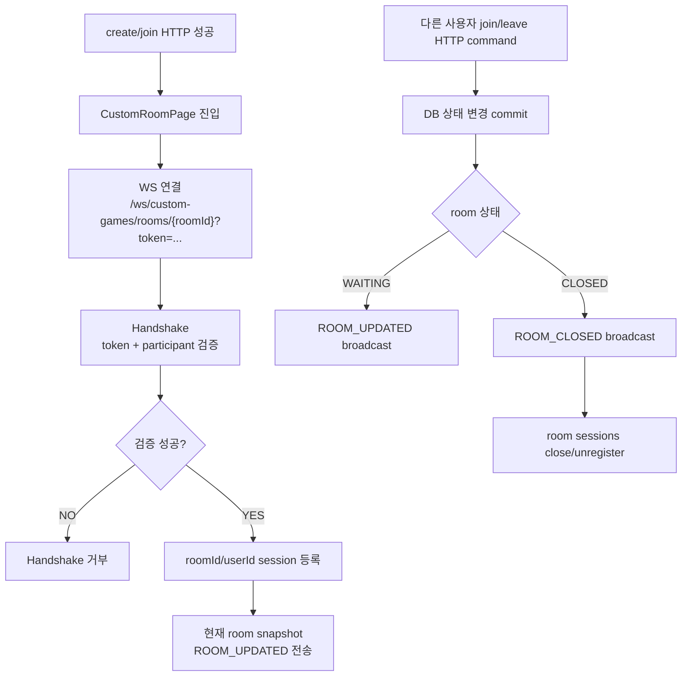
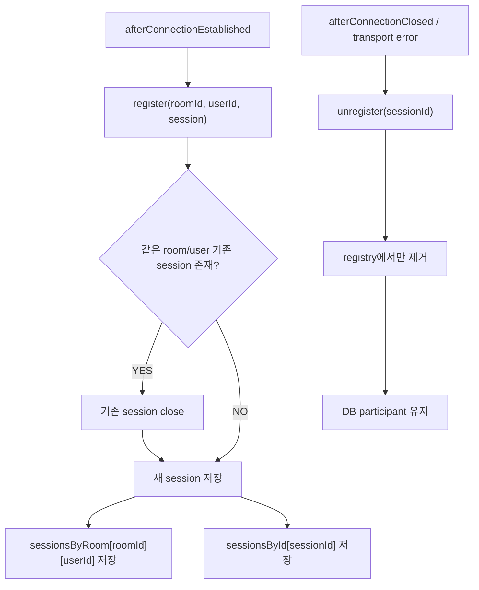
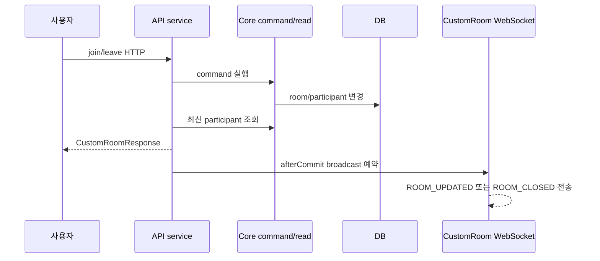
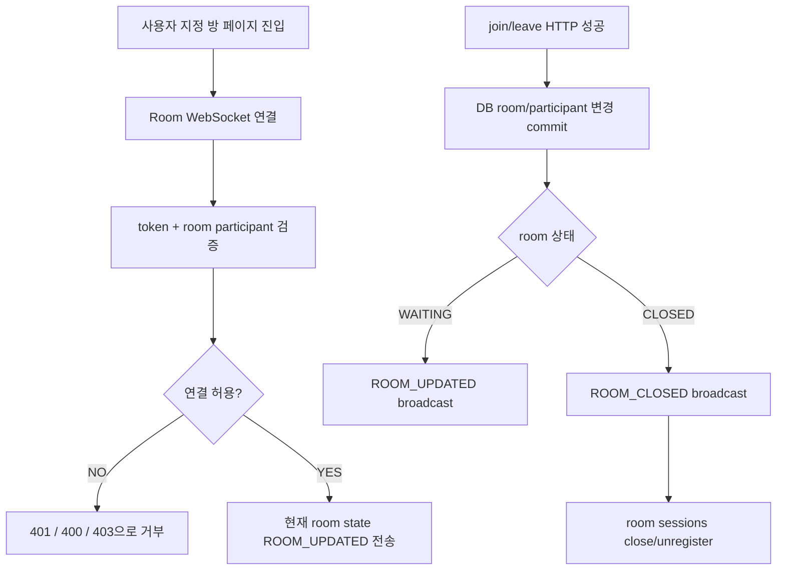
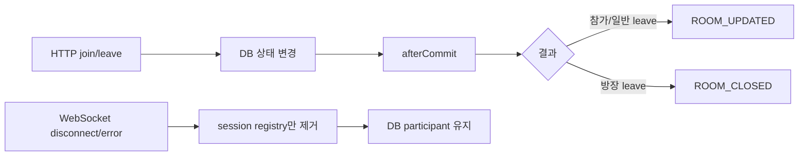

# Issue 128. Custom Room WebSocket 동기화 계약

## 📌 Feature Description

사용자 지정 방 대기실에서 참가자 입장/퇴장과 방 상태 변경을 같은 room 참가자들에게 실시간으로 전달하는 Custom Room WebSocket 동기화 기능을 구현한다.

이번 이슈는 issue-126에서 만든 join/leave HTTP command 다음 단계다. issue-126은 DB 상태를 바꾸는 작업이고, 이번 이슈는 그 변경 결과를 다른 참가자 화면에 전달하는 작업이다.



핵심 정책은 다음과 같다.

- Custom Room WebSocket은 CustomRoomPage에서만 연결한다.
- 연결 source는 `roomId`와 access token이다.
- access token은 기존 Game WebSocket과 동일하게 query parameter로 전달한다.
- WebSocket 연결은 DB 참가 상태를 만들지 않는다.
- 참가 상태 변경 source of truth는 issue-126의 HTTP join/leave command다.
- WebSocket은 DB 변경 결과를 같은 room session에 전달하는 동기화 채널이다.
- WebSocket disconnect/error는 DB leave가 아니다.
- disconnect/error 시에는 local session registry에서만 제거한다.
- WebSocket origin은 설정값 기반 allowlist를 사용하고 wildcard를 사용하지 않는다.
- 참가자 여부 검증은 core read service를 통해 수행한다.
- WebSocket 인증, session registry, message 전송은 api 모듈 책임이다.
- `ROOM_STARTED`는 후속 4-6 범위이며 이번 이슈에서 구현하지 않는다.
- 새 외부 패키지를 추가하지 않는다.

## Backend Contract

### Custom Room WebSocket Endpoint

```http
GET /ws/custom-games/rooms/{roomId}?token={accessToken}
```

native WebSocket은 일반 HTTP Authorization header 사용이 제한적이므로 기존 Game WebSocket과 동일하게 `token` query parameter를 사용한다.

### Handshake Contract

Handshake에서 다음 순서로 검증한다.

1. `token` query parameter를 추출한다.
2. JWT token을 검증한다.
3. token에서 `userId`를 추출한다.
4. path에서 `roomId`를 추출한다.
5. core `CustomGameRoomReadService`로 `WAITING` room participant인지 검증한다.
6. 성공 시 session attributes에 `customRoomId`, `userId`를 저장한다.

#### Handshake Error Policy

| 상황 | HTTP status | 기준 |
|------|-------------|------|
| token 없음/만료/유효하지 않음 | `401` | 기존 `JwtTokenResolver`, `JwtTokenProvider` 정책 |
| roomId path 없음/숫자 아님/양수 아님 | `400` | path resolver validation |
| room 없음 | `403` | core `CUSTOM_ROOM_NOT_FOUND` |
| room이 `WAITING`이 아님 | `403` | core `CUSTOM_ROOM_INVALID_STATE` |
| room participant가 아님 | `403` | core `CUSTOM_ROOM_INVALID_PARTICIPANT` |

### Server Message Envelope

```json
{
  "type": "ROOM_UPDATED",
  "payload": {
    "roomId": 1,
    "roomName": "Host's room",
    "inviteCode": "AB12CD",
    "ownerUserId": 10,
    "status": "WAITING",
    "maxParticipants": 2,
    "participants": [
      {
        "userId": 10,
        "nickname": "Host",
        "role": "OWNER"
      },
      {
        "userId": 20,
        "nickname": "Guest",
        "role": "PLAYER"
      }
    ]
  }
}
```

```json
{
  "type": "ROOM_CLOSED",
  "payload": {
    "roomId": 1,
    "roomName": "Host's room",
    "inviteCode": "AB12CD",
    "ownerUserId": 10,
    "status": "CLOSED",
    "maxParticipants": 2,
    "participants": []
  }
}
```

```json
{
  "type": "ERROR",
  "payload": {
    "code": "INVALID_MESSAGE_TYPE",
    "reason": "Custom Room WebSocket does not accept client messages in this issue."
  }
}
```

### Message Type Policy

| type | direction | 기준 |
|------|-----------|------|
| `ROOM_UPDATED` | server -> client | room이 `WAITING` 상태이고 participant 목록이 바뀐 경우 |
| `ROOM_CLOSED` | server -> client | 방장 leave로 room이 `CLOSED` 된 경우 |
| `ERROR` | server -> client | client가 이번 이슈에서 지원하지 않는 message를 보낸 경우 |
| `ROOM_STARTED` | server -> client | 후속 4-6 범위 |

Client message는 이번 이슈에서 처리하지 않는다. client가 text message를 보내면 `ERROR`를 응답하고 연결은 유지한다.

### Session Management Contract

Custom Room WebSocket session registry는 API 인스턴스 local memory에서 관리한다.



관리 기준:

- `roomId -> userId -> session` index를 둔다.
- `sessionId -> session` 역방향 index를 둔다.
- 같은 room/user가 재연결하면 기존 session을 닫고 새 session으로 교체한다.
- room 전체 close가 필요하면 해당 room sessions에 message를 보낸 뒤 close/unregister한다.
- 일반 참가자 leave는 떠난 user session을 먼저 close/unregister한 뒤 남은 room sessions에만 `ROOM_UPDATED`를 보낸다.
- disconnect/error는 session registry에서만 제거한다.
- disconnect/error에서 leave API를 호출하거나 participant row를 삭제하지 않는다.
- 멀티 인스턴스 운영에서는 같은 room이 같은 API 인스턴스로 라우팅되어야 한다. 이번 이슈에서는 기존 Game WebSocket과 동일하게 local memory registry로 제한한다.

### Broadcast Contract

join/leave HTTP command 이후 WebSocket event는 transaction commit 이후 전송한다.



전송 기준:

- `joinRoom()` 성공 후 room 상태가 `WAITING`이면 같은 room sessions에 `ROOM_UPDATED`를 보낸다.
- 일반 참가자 `leaveRoom()` 성공 후 room 상태가 `WAITING`이면 남은 room sessions에 `ROOM_UPDATED`를 보낸다.
- 일반 참가자 leave를 호출한 user의 session이 registry에 남아 있으면 먼저 close/unregister한 뒤 `ROOM_UPDATED`를 보낸다.
- 방장 `leaveRoom()` 성공 후 room 상태가 `CLOSED`이면 room sessions에 `ROOM_CLOSED`를 보낸 뒤 close/unregister한다.
- command 실패 시 WebSocket event를 보내지 않는다.

### Source Of Truth Policy

- room/participant DB 상태 source of truth는 core custom room domain이다.
- WebSocket session source of truth는 api local memory registry다.
- WebSocket event payload는 API `CustomRoomResponse`를 재사용한다.
- participant nickname은 기존 `UserReadService.findAllByIdsOrThrow` batch 조회로 조립한다.
- HTTP join/leave 응답은 호출자에게 주는 command 결과다.
- 다른 참가자 화면 반영 기준은 `ROOM_UPDATED`, `ROOM_CLOSED` event다.

## Scope Boundary

이번 이슈에 포함:

- `/ws/custom-games/rooms/{roomId}?token={accessToken}` endpoint 구현.
- Custom Room WebSocket config 구현.
- Custom Room WebSocket handshake interceptor 구현.
- Custom Room WebSocket path resolver 구현.
- core `CustomGameRoomReadService.validateWaitingParticipant(roomId, userId)` 구현.
- Custom Room 전용 session attribute, session object, session registry 구현.
- Custom Room server message DTO 구현.
- `ROOM_UPDATED`, `ROOM_CLOSED`, `ERROR` message type 구현.
- 연결 성공 시 현재 room snapshot을 연결된 session에 `ROOM_UPDATED`로 전송.
- join 성공 후 `ROOM_UPDATED` broadcast.
- 일반 참가자 leave 성공 후 `ROOM_UPDATED` broadcast.
- 방장 leave 성공 후 `ROOM_CLOSED` broadcast 및 room sessions close.
- WebSocket disconnect/error 시 session registry만 정리.
- transaction commit 이후 broadcast하도록 notifier 구현.
- core/api test 구현.
- WebSocket 계약 문서화.
- `docs/last-구현.md` Section 4-5 정합성 반영.

이번 이슈에서 제외:

- Custom Game start API.
- `ROOM_STARTED` event.
- `GameRoom.gameMode=CUSTOM` 생성.
- scenario 생성.
- Custom GamePlay handoff.
- custom game result WebSocket 처리.
- 랭크 제외/전적 기록 정책 구현.
- 프론트 CustomRoomPage 구현.
- 프론트 WebSocket 연결 구현.
- Redis/pub-sub 기반 멀티 인스턴스 broadcast.
- disconnect timeout leave 정책.
- room 만료 scheduler.
- 새 외부 패키지 추가.

## 📚 Tasks

### 1. Backend Contract 정리

- [x] endpoint를 `/ws/custom-games/rooms/{roomId}?token={accessToken}`로 확정.
- [x] token query parameter 인증 정책을 기존 Game WebSocket과 맞춤.
- [x] `ROOM_UPDATED`, `ROOM_CLOSED`, `ERROR` payload shape 확정.
- [x] disconnect/error는 DB leave가 아니라 session 제거임을 문서화.
- [x] HTTP command와 WebSocket event 책임 분리 문서화.
- [x] `ROOM_STARTED`는 후속 4-6 범위임을 문서화.

### 2. Core Participant 검증 구현

- [x] `CustomGameRoomReadService.validateWaitingParticipant(roomId, userId)` 구현.
- [x] roomId/userId null 검증.
- [x] room 존재 여부 검증.
- [x] room이 `WAITING`인지 검증.
- [x] user가 participant인지 검증.
- [x] 검증 실패 시 기존 `CoreErrorCode`를 사용.
- [x] API 모듈이 custom room repository를 직접 참조하지 않도록 유지.

### 3. WebSocket Handshake 구현

- [x] `CustomRoomWebSocketPathResolver` 구현.
- [x] `CustomRoomWebSocketHandshakeInterceptor` 구현.
- [x] `JwtTokenResolver.resolveWebSocketToken()` 재사용.
- [x] `JwtTokenProvider.validateToken()` / `getUserId()` 재사용.
- [x] core read service로 participant 접근 검증.
- [x] session attributes에 `customRoomId`, `userId` 저장.
- [x] 인증 실패는 `401`, path 실패는 `400`, participant 검증 실패는 `403`으로 처리.

### 4. Session Registry 구현

- [x] `CustomRoomWebSocketSessionAttribute` 구현.
- [x] `CustomRoomWebSocketSession` 구현.
- [x] `CustomRoomWebSocketSessionRegistry` 구현.
- [x] roomId/userId/sessionId 기준 등록 구현.
- [x] 같은 room/user 재연결 시 기존 session close 후 교체.
- [x] sessionId 기준 unregister 구현.
- [x] roomId 기준 session 목록 조회 구현.
- [x] userId 기준 session close/unregister 구현.
- [x] roomId 기준 전체 session close/unregister 구현.
- [x] disconnect/error는 DB 상태를 바꾸지 않음.

### 5. Message DTO / Sender 구현

- [x] `CustomRoomWebSocketMessageType` 구현.
- [x] `CustomRoomWebSocketServerMessage` 구현.
- [x] `ROOM_UPDATED` factory 구현.
- [x] `ROOM_CLOSED` factory 구현.
- [x] `ERROR` factory 구현.
- [x] `CustomRoomWebSocketMessageSender` 구현.
- [x] open session에만 message 전송.
- [x] 전송 실패 시 로그만 남기고 HTTP command 결과를 되돌리지 않음.

### 6. Handler / Service 구현

- [x] `CustomRoomWebSocketHandler` 구현.
- [x] 연결 성공 시 registry 등록.
- [x] 연결 성공 시 현재 room snapshot을 해당 session에 `ROOM_UPDATED`로 전송.
- [x] client text message 수신 시 `ERROR` 응답 후 연결 유지.
- [x] close/error 시 registry에서만 제거.
- [x] `CustomRoomWebSocketConfig`에 endpoint 등록.
- [x] 기존 Game WebSocket endpoint와 충돌 없게 구성.

### 7. Join / Leave Broadcast 연결

- [x] `CustomRoomWebSocketNotifier` 구현.
- [x] transaction active 시 afterCommit broadcast 예약.
- [x] transaction inactive 시 즉시 broadcast.
- [x] join 성공 후 `ROOM_UPDATED` broadcast 연결.
- [x] 일반 참가자 leave 성공 후 `ROOM_UPDATED` broadcast 연결.
- [x] 일반 참가자 leave 호출 user session close/unregister 연결.
- [x] 방장 leave 성공 후 `ROOM_CLOSED` broadcast 연결.
- [x] 방장 leave 이후 room sessions close/unregister 연결.
- [x] command 실패 시 broadcast 미호출 검증.

### 8. Test 구현

- [x] core read service unit test 작성.
- [x] core read service `@DataJpaTest` 또는 기존 repository 기반 검증 보강.
- [x] path resolver unit test 작성.
- [x] handshake interceptor unit test 작성.
- [x] session registry unit test 작성.
- [x] message DTO unit test 작성.
- [x] message sender unit test 작성.
- [x] handler unit test 작성.
- [x] notifier unit test 작성.
- [x] API service join/leave broadcast 연동 test 작성.
- [x] disconnect/error가 DB leave를 호출하지 않는지 검증.

### 9. 문서 정합성 구현

- [x] `docs/last-구현.md` Section 4-5 endpoint와 정책 반영.
- [x] issue-126과 HTTP/WebSocket 책임이 충돌하지 않는지 확인.
- [x] 후속 4-6 `ROOM_STARTED` 범위와 충돌하지 않는지 확인.
- [x] issue-128 PR 섹션 보강.

### 10. 검증

- [x] `./gradlew :league-of-star-core:test`
- [x] `./gradlew :league-of-star-api:test`
- [x] `./gradlew test`
- [x] `./gradlew build`
- [x] `git diff --check`

## Implementation Policy

- core 모듈은 custom room/participant DB 조회와 도메인 검증만 담당한다.
- api 모듈은 WebSocket 인증, session registry, message 전송, broadcast 연결을 담당한다.
- API 모듈은 custom room repository를 직접 참조하지 않는다.
- Custom Room WebSocket은 Game WebSocket과 분리한다.
- Custom Room WebSocket session registry는 local memory 기반으로 구현한다.
- disconnect/error는 DB leave가 아니다.
- 실제 leave는 HTTP leave API만 수행한다.
- join/leave broadcast는 transaction commit 이후 수행한다.
- event payload는 기존 `CustomRoomResponse`를 재사용한다.
- `ROOM_STARTED`는 이번 이슈에서 구현하지 않는다.
- 새 외부 패키지를 추가하지 않는다.

## Acceptance Criteria

- room participant만 Custom Room WebSocket에 연결할 수 있다.
- participant가 아닌 사용자는 handshake에서 거부된다.
- 연결 성공 시 현재 room state가 `ROOM_UPDATED`로 전송된다.
- join 성공 후 같은 room 참가자에게 `ROOM_UPDATED`가 broadcast된다.
- 일반 참가자 leave 성공 후 남은 참가자에게 `ROOM_UPDATED`가 broadcast된다.
- 방장 leave 성공 후 room 참가자에게 `ROOM_CLOSED`가 broadcast되고 session이 정리된다.
- WebSocket disconnect/error는 participant DB row를 삭제하지 않는다.
- HTTP join/leave 실패 시 WebSocket event가 broadcast되지 않는다.
- Custom Room WebSocket origin은 `app.websocket.allowed-origin-patterns` 설정값으로 제한하고 wildcard를 사용하지 않는다.
- core/api 테스트가 통과한다.
- issue-126, 4-6 문서와 범위가 겹치지 않는다.

## PR Message

## PR 작성 방법

## 📌 Summary

사용자 지정 방 대기실의 실시간 동기화를 위한 Custom Room WebSocket을 구현함.

이번 PR은 “방에 누가 들어왔고 누가 나갔는지”를 같은 대기실에 있는 사람들에게 바로 알려주는 작업이다. 사용자가 방에 실제로 들어가거나 나가는 처리는 기존 HTTP API가 담당하고, WebSocket은 그 결과를 화면에 실시간으로 알려준다.



핵심 정책:

- WebSocket 연결만으로는 방에 들어간 것으로 처리하지 않음.
- 실제 참가/나가기는 HTTP join/leave API만 수행함.
- WebSocket disconnect/error는 DB leave가 아니며 session registry에서만 제거함.
- 다른 참가자 화면 갱신은 `ROOM_UPDATED`, `ROOM_CLOSED` event로 전달함.
- Custom Room WebSocket origin은 설정값 기반 allowlist로 제한함.
- `ROOM_STARTED`와 게임 시작 이동은 후속 4-6 범위로 남김.

백엔드와의 구현 계약:

- WebSocket endpoint는 `/ws/custom-games/rooms/{roomId}?token={accessToken}`임.
- token은 query parameter로 전달함.
- handshake에서 core read service로 room participant 여부를 검증함.
- 연결 성공 시 현재 room state를 `ROOM_UPDATED`로 1회 전송함.
- join/leave command commit 이후 `ROOM_UPDATED` 또는 `ROOM_CLOSED`를 broadcast함.
- event payload는 HTTP room 응답과 같은 `CustomRoomResponse`를 재사용함.
- 허용 origin은 `app.websocket.allowed-origin-patterns` 설정값을 사용함.

## 📚 Changes

- 방에 들어가는 일과 화면을 갱신하는 일을 분리함.
  사용자가 방에 참가하는 실제 행동은 `join` HTTP API가 처리한다. WebSocket 연결은 “이미 방에 참가한 사용자의 화면을 실시간으로 갱신하는 통로”일 뿐이다. 이렇게 나누면 페이지를 새로고침하거나 WebSocket이 끊겼을 때 서버가 사용자를 방에서 나간 것으로 착각하지 않는다.

- 연결 직후 현재 방 상태를 한 번 내려줌.
  사용자가 CustomRoomPage에 들어오면 WebSocket handshake를 통과한 뒤 바로 `ROOM_UPDATED`를 받는다. 그래서 화면은 별도 추측 없이 서버가 알고 있는 최신 참가자 목록을 기준으로 그려진다.

- join/leave 성공 후 같은 방 참가자에게 알려줌.
  누군가 방에 들어오면 `ROOM_UPDATED`가 나가고, 일반 참가자가 나가도 `ROOM_UPDATED`가 나간다. 방장이 나가면 방 자체가 닫히므로 `ROOM_CLOSED`를 보내고 해당 방의 WebSocket session을 정리한다.
  일반 참가자가 나갈 때는 떠난 사람의 WebSocket session을 먼저 끊은 뒤 남은 사람들에게만 `ROOM_UPDATED`를 보낸다. 그래야 나간 사용자가 “내가 빠진 방의 최신 목록”을 다시 받는 이상한 화면 흐름이 생기지 않는다.



- afterCommit broadcast로 커밋 전 이벤트 전송을 막음.
  DB 변경이 확정되기 전에 WebSocket event가 먼저 나가면, 화면에는 들어온 것처럼 보이는데 실제 DB에는 저장되지 않는 상태가 생길 수 있다. 그래서 join/leave event는 commit 이후에 보내도록 했다. transaction이 이미 끝난 상태에서는 즉시 보낸다.

- core/api 책임을 유지함.
  “이 사용자가 이 방 참가자인가?” 같은 도메인 검증은 core read service에서 수행한다. API 모듈은 WebSocket handshake, session registry, message 전송만 맡는다. 이 구조 덕분에 후속 start API에서도 같은 참가자 검증 정책을 재사용할 수 있다.

- Custom Room WebSocket을 Game WebSocket과 분리함.
  Game WebSocket은 READY, RTT, LIGHTNING, GAME_RESULT처럼 게임 진행 중의 일을 다룬다. Custom Room WebSocket은 대기실에서 참가자 목록과 방 닫힘만 다룬다. 역할이 다르므로 endpoint, DTO, registry를 분리해 후속 게임 시작 로직과 섞이지 않게 했다.

- WebSocket origin을 설정값으로 제한함.
  인증 token이 query parameter로 전달되는 WebSocket endpoint이므로 아무 origin에서나 브라우저 연결을 열 수 있게 두지 않는다. 이번 Custom Room WebSocket은 `app.websocket.allowed-origin-patterns`에 등록된 프론트 origin만 허용한다. 기존 Game WebSocket origin 정책은 이번 PR 범위에서 바꾸지 않고, 새로 추가한 custom endpoint의 노출면만 먼저 줄였다.

- local memory session registry를 선택함.
  이번 범위는 MVP 기준으로 현재 API 인스턴스에 붙은 WebSocket session을 관리한다. 구조가 단순하고 빠르지만, 여러 API 인스턴스가 동시에 떠 있는 운영 환경에서는 같은 room 사용자가 같은 인스턴스로 붙거나 Redis/pub-sub 같은 broadcast 확장이 필요하다. 그 확장은 이번 PR 범위에서 제외했다.

## 📝 Note

- 이번 PR에서 `ROOM_STARTED`는 제외함.
- Custom Game start API와 scenario 생성은 후속 4-6 범위임.
- 프론트 CustomRoomPage WebSocket 연결은 후속 프론트 이슈 범위임.
- Redis/pub-sub 기반 멀티 인스턴스 broadcast는 제외함.
- 새 패키지 추가 없음.
- 검증 결과:
  - `./gradlew :league-of-star-core:test` 통과함.
  - `./gradlew :league-of-star-api:test` 통과함.
  - `./gradlew test` 통과함.
  - `./gradlew build` 통과함.
  - `git diff --check` 통과함.

## 📌 Related Issue

- Closes #128
