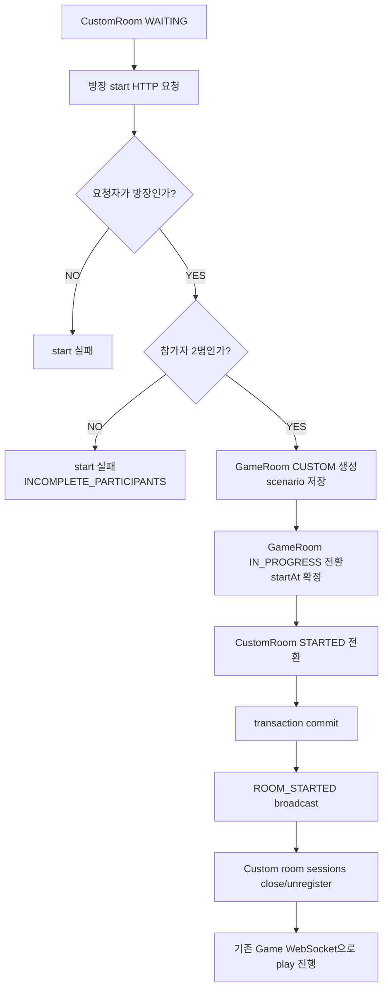
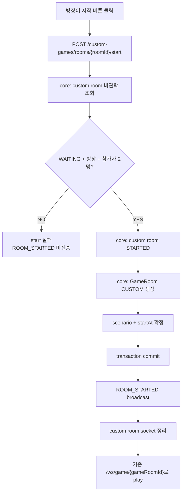
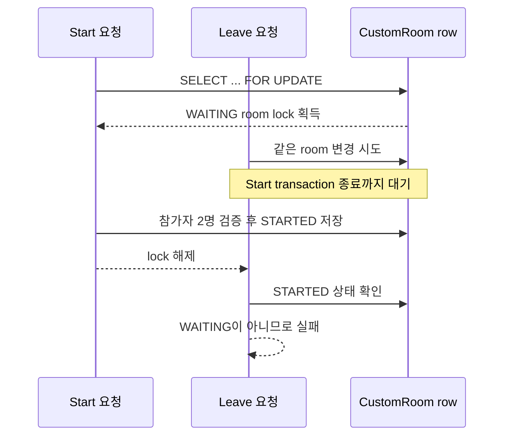

# Issue 130. Custom Game Start API / ROOM_STARTED 계약

## Feature Description

사용자 지정 방에서 방장이 게임 시작을 누르면, 방에 있는 두 참가자가 같은 custom game room과 scenario로 동시에 게임 플레이에 진입할 수 있게 한다.

이번 이슈는 issue-124, issue-126, issue-128에서 만든 사용자 지정 방 생성/참가/대기실 WebSocket 다음 단계다. 사용자 지정 방의 참가자 상태는 custom room domain이 관리하고, 실제 게임 진행은 기존 game domain과 Game WebSocket을 재사용한다.

중요한 정책 변경은 다음과 같다.

- Custom Game은 1인 플레이가 아니라 2인 비랭크 대전이다.
- 1인 플레이는 Practice Mode가 담당한다.
- 따라서 Custom Game start는 custom room 참가자가 정확히 2명일 때만 허용한다.
- HTTP start 응답은 command ack이며, 실제 프론트 이동 기준은 `ROOM_STARTED` WebSocket event다.
- `ROOM_STARTED` 이후 실제 플레이 입력, LIGHTNING, GAME_RESULT는 기존 `/ws/game/{gameRoomId}` Game WebSocket이 담당한다.



이번 이슈에 포함되는 범위:

- custom room start API 계약 확정.
- Custom Game은 참가자 2명일 때만 시작 가능하도록 정책 정리.
- core custom room start command 구현 계획.
- `GameMode.CUSTOM` 기반 game room 생성 계획.
- `ROOM_STARTED` payload와 broadcast 정책 확정.
- 문서 정합성 정리 계획.

후속 이슈로 미루는 범위:

- custom game 결과의 rank/LP 제외 및 전적 저장 정책 구현.
- custom game `GAME_RESULT.gameMode=CUSTOM` 세부 payload.
- custom game summary 화면/결과 화면 프론트 처리.
- CustomRoomPage start 버튼 및 `ROOM_STARTED` 프론트 연결.
- Redis/pub-sub 기반 멀티 인스턴스 room broadcast.

## Backend Contract

### Start API

```http
POST /api/v1/custom-games/rooms/{roomId}/start
Authorization: Bearer {accessToken}
```

응답은 start command 처리 결과를 나타내는 ack다. 프론트는 HTTP 200만으로 GamePlayPage로 이동하지 않는다. 최종 화면 전환 기준은 Custom Room WebSocket `ROOM_STARTED` event다.

### Start Validation

start command는 다음 순서로 검증한다.

1. `roomId`가 유효한지 검증한다.
2. custom room을 비관락으로 조회한다.
3. custom room이 `WAITING` 상태인지 검증한다.
4. 요청 user가 방장인지 검증한다.
5. custom room participant가 정확히 2명인지 검증한다.
6. 두 participant userId가 서로 다른지 검증한다.
7. `GameMode.CUSTOM` game room을 생성한다.
8. game room start time을 확정하고 `IN_PROGRESS`로 전환한다.
9. custom room을 `STARTED`로 전환한다.
10. transaction commit 이후 `ROOM_STARTED`를 broadcast한다.

### Error Policy

| 상황 | 기준 |
|------|------|
| 인증 없음/토큰 오류 | 기존 API 인증 정책 |
| room 없음 | core `CUSTOM_ROOM_NOT_FOUND` |
| room이 `WAITING`이 아님 | core `CUSTOM_ROOM_INVALID_STATE` |
| 요청자가 방장이 아님 | core `CUSTOM_ROOM_INVALID_PARTICIPANT` |
| 참가자가 정확히 2명이 아님 | core `INCOMPLETE_PARTICIPANTS` 또는 custom start 전용 에러 |
| custom game room 생성 실패 | API start 실패로 처리하고 생성된 game room은 가능한 범위에서 abort |
| end deadline 등록 실패 | 생성된 game room abort 후 start 실패 |

### ROOM_STARTED Event

Custom Room WebSocket server message에 `ROOM_STARTED`를 추가한다.

```json
{
  "type": "ROOM_STARTED",
  "payload": {
    "roomId": 1,
    "gameRoomId": 100,
    "gameMode": "CUSTOM",
    "serverTime": 1710000000000,
    "startAt": 1710000003000,
    "webSocketUrl": "/ws/game/100",
    "scenario": {
      "starCoreMaxHp": 10000,
      "durationMs": 12000,
      "hpTimeline": [
        {
          "timeMs": 0,
          "hp": 10000
        }
      ]
    }
  }
}
```

### Source Of Truth Policy

- custom room 상태 source of truth는 core custom room domain이다.
- game room/scenario source of truth는 core game domain이다.
- HTTP start 응답은 command ack다.
- 프론트 play 진입 기준은 `ROOM_STARTED` event다.
- `ROOM_STARTED` payload의 `gameRoomId`, `scenario`, `startAt`이 방장과 참가자에게 동일하게 전달되어야 한다.
- Custom Room WebSocket은 start handoff까지만 담당한다.
- 실제 game play는 기존 `/ws/game/{gameRoomId}` Game WebSocket을 source로 사용한다.

## Scope Boundary

이번 이슈에 포함:

- `docs/last-구현.md` 4-6의 1명 시작 가능 문구를 2명 필수 정책으로 수정.
- `docs/last-구현.md` 4-7과 custom 전적 정책 문구를 2인 custom 기준으로 정합성 수정.
- `CustomGamePath`에 start path 상수 추가.
- `CustomGameRoomController`에 start endpoint 추가.
- core `CustomGameRoomCommandService`에 start command 추가.
- core custom room start command에서 방장/상태/참가자 2명 검증.
- core `GameMode.CUSTOM` 추가.
- core `GameRoomCommandService`에 custom game room 생성 command 추가.
- `GameRoom`에 custom mode helper 추가.
- API custom game start orchestration service 구현.
- start 성공 시 `ROOM_STARTED` afterCommit broadcast 구현.
- `ROOM_STARTED` broadcast 이후 custom room sessions close/unregister.
- start 실패 시 WebSocket event 미전송.
- controller RestDocs, core repository/service test, API service/WebSocket test 구현.
- issue-130 PR 섹션 보강.

이번 이슈에서 제외:

- custom game rank/LP 제외 및 전적 저장 구현.
- custom game result reason 구현.
- custom game summary 조회 정책 변경.
- custom game 결과 화면 프론트 구현.
- CustomRoomPage start 버튼 프론트 구현.
- `ROOM_STARTED` 수신 후 GamePlayPage 이동 프론트 구현.
- 1인 custom game 지원.
- custom room 재시작/다시 방으로 돌아가기 정책.
- 멀티 인스턴스 broadcast 확장.
- 새 외부 패키지 추가.

## Tasks

### 1. Backend Contract 정리

- [x] Custom Game은 참가자 2명일 때만 시작 가능하다고 확정.
- [x] Practice Mode는 1인 플레이, Custom Game은 2인 비랭크 대전으로 역할 분리.
- [x] HTTP start 응답은 command ack임을 문서화.
- [x] `ROOM_STARTED`가 프론트 play 진입 기준임을 문서화.
- [x] `ROOM_STARTED` payload shape 확정.
- [x] 4-7 결과/전적 정책과 범위가 겹치지 않게 정리.

### 2. 문서 정합성 구현

- [x] `docs/last-구현.md` 4-6의 "1명 또는 2명" 정책을 "정확히 2명"으로 수정.
- [x] `docs/last-구현.md` 4-7을 2인 custom 전적 정책 기준으로 정리.
- [x] issue-128 후속 범위와 issue-130 start 범위가 충돌하지 않는지 확인.
- [x] issue-130 문서 task와 PR 섹션을 최신 정책으로 유지.

### 3. Core Custom Room Start 구현

- [x] `CustomGameRoomCommandService.startRoom(roomId, ownerUserId, startedAt)` 형태의 command 구현.
- [x] custom room을 `findByIdForUpdate`로 조회.
- [x] `WAITING` 상태 검증.
- [x] 요청자가 방장인지 검증.
- [x] participant가 정확히 2명인지 검증.
- [x] participant userId 목록을 안정적인 순서로 반환.
- [x] custom room을 `STARTED`로 전환.
- [x] API 모듈이 custom room repository를 직접 참조하지 않도록 유지.

### 4. Core GameRoom CUSTOM 구현

- [x] `GameMode.CUSTOM` 추가.
- [x] `GameRoom.isCustomMode()` 추가.
- [x] `GameRoomCommandService.createCustomRoom(firstUserId, secondUserId)` 구현.
- [x] custom game room은 참가자 2명, scenario, duration을 기존 match와 같은 방식으로 생성.
- [x] custom game room은 `gameMode=CUSTOM`으로 저장.
- [x] `startReadyRoomIfReady()`를 재사용해 `IN_PROGRESS` 전환.

### 5. Custom Start API 구현

- [x] `CustomGamePath.START` 상수 추가.
- [x] `POST /api/v1/custom-games/rooms/{roomId}/start` controller 구현.
- [x] API service에서 core custom room start command와 core game room command를 조합.
- [x] `serverTime`, `startAt`, `webSocketUrl`, `scenario` 조립.
- [x] game end deadline 등록.
- [x] 실패 시 생성된 game room abort 정책 적용.
- [x] HTTP 응답 DTO는 command ack 용도로만 정의.

### 6. ROOM_STARTED WebSocket 구현

- [x] `CustomRoomWebSocketMessageType.ROOM_STARTED` 추가.
- [x] `CustomRoomStartedPayload` 또는 equivalent DTO 추가.
- [x] `CustomRoomWebSocketServerMessage.roomStarted(payload)` factory 추가.
- [x] `CustomRoomWebSocketNotifier.notifyRoomStartedAfterCommit(payload)` 구현.
- [x] transaction commit 이후 `ROOM_STARTED` broadcast.
- [x] broadcast 이후 custom room sessions close/unregister.
- [x] start 실패 시 broadcast하지 않음.

### 7. Test 구현

- [x] core custom room start service unit test 작성.
- [x] core custom room repository lock/start 흐름 test 작성.
- [x] core custom game room 생성 test 작성.
- [x] controller RestAssuredMockMvc + RestDocs test 작성.
- [x] API service start 성공/실패 unit test 작성.
- [x] `ROOM_STARTED` notifier afterCommit test 작성.
- [x] start 실패 시 WebSocket 미전송 test 작성.
- [x] 1명 방 start 실패 test 작성.
- [x] 방장 아닌 user start 실패 test 작성.

### 8. 검증

- [x] `./gradlew :league-of-star-core:test`
- [x] `./gradlew :league-of-star-api:test`
- [x] `./gradlew test`
- [x] `./gradlew build`
- [x] `git diff --check`

## Implementation Policy

- core 모듈은 custom room 상태 변경, participant 검증, game room 생성 같은 도메인/영속성 책임을 담당한다.
- api 모듈은 HTTP endpoint, 응답 DTO, WebSocket payload, afterCommit broadcast orchestration만 담당한다.
- API 모듈은 custom room/game room repository를 직접 참조하지 않는다.
- Custom Game은 정확히 2명일 때만 시작 가능하다.
- 1인 플레이는 Practice Mode로 처리한다.
- HTTP 200은 화면 이동 기준이 아니다.
- 최종 play 진입 기준은 `ROOM_STARTED` WebSocket event다.
- `ROOM_STARTED` 이후 실제 게임 진행은 기존 Game WebSocket을 재사용한다.
- start 이후 custom room join/leave는 허용하지 않는다.
- start 실패 시 `ROOM_STARTED`를 보내지 않는다.
- `ROOM_STARTED` broadcast는 transaction commit 이후 수행한다.
- Custom Game result/rank/record 세부 정책은 4-7에서 구현한다.
- 새 외부 패키지를 추가하지 않는다.

## Acceptance Criteria

- 방장만 custom game start API를 호출할 수 있다.
- custom room participant가 정확히 2명일 때만 start가 성공한다.
- 1명 방 start는 실패한다.
- `WAITING`이 아닌 custom room start는 실패한다.
- start 성공 시 `GameRoom.gameMode=CUSTOM` game room이 생성된다.
- start 성공 시 scenario가 저장되고 두 참가자에게 같은 scenario가 전달된다.
- start 성공 시 custom room은 `STARTED` 상태가 된다.
- start 성공 후 같은 room WebSocket session에 `ROOM_STARTED`가 broadcast된다.
- `ROOM_STARTED` 이후 custom room sessions가 정리된다.
- start 실패 시 WebSocket event가 broadcast되지 않는다.
- core/api 테스트와 문서 검증이 통과한다.

## PR Message

## PR 작성 방법

## 📌 Summary

사용자 지정 방에서 방장이 게임 시작을 누르면, 방 안에 있던 두 명이 같은 `gameRoomId`, 같은 `scenario`, 같은 `startAt`을 받고 게임 화면으로 들어갈 수 있게 구현함.

이번 PR에서 Custom Game은 1인 플레이가 아니라 2인 비랭크 대전으로 고정함. 혼자 하는 게임은 Practice Mode가 담당하고, Custom Game은 “친구와 방을 만들고 같이 시작하는 흐름”만 담당하게 해서 역할을 나눔. 이렇게 해야 전적, 결과, WebSocket 이동 기준이 서로 섞이지 않음.



핵심 정책:

- Custom Game은 정확히 2명일 때만 시작 가능함.
- HTTP start 응답은 command ack이며 화면 이동 기준이 아님.
- 실제 play 진입 기준은 `ROOM_STARTED` WebSocket event임.
- `ROOM_STARTED` 이후 게임 진행은 기존 `/ws/game/{gameRoomId}`를 재사용함.
- start 성공/실패 판단은 DB commit 전 도메인 상태를 기준으로 처리함.
- `ROOM_STARTED`는 transaction commit 이후에만 전송함.
- custom 결과/전적/랭크 제외 세부 정책은 후속 4-7에서 구현함.

백엔드와의 구현 계약:

- start endpoint는 `POST /api/v1/custom-games/rooms/{roomId}/start`임.
- 방장, room 상태, 참가자 2명 조건을 core custom room command에서 검증함.
- custom game room은 `gameMode=CUSTOM`으로 생성함.
- `ROOM_STARTED` payload는 `roomId`, `gameRoomId`, `gameMode`, `serverTime`, `startAt`, `webSocketUrl`, `scenario`를 포함함.
- WebSocket event는 transaction commit 이후 broadcast함.

## 📚 Changes

- 사용자 지정 게임 역할을 2인 비랭크 대전으로 고정함.
  1명도 시작 가능하게 만들면 상대가 없는 전적, 승패 판정, 결과 화면, summary API 정책을 새로 만들어야 한다. 이미 Practice Mode가 1인 플레이를 맡고 있으므로 Custom Game은 “두 명이 방에서 같이 시작하는 게임”으로 제한함. 이 선택으로 start 조건이 단순해지고, 기존 2인 GameRoom/Scenario/Game WebSocket 흐름을 그대로 재사용할 수 있음.

- core 모듈에 start 판단을 둠.
  방장이 맞는지, room이 아직 `WAITING`인지, 참가자가 정확히 2명인지 판단하는 일은 custom room 도메인 규칙이다. 그래서 API 모듈은 repository를 직접 보지 않고 core command service를 호출함. API 모듈은 “요청을 받고 응답과 WebSocket 알림을 조립하는 곳”으로 두고, 데이터 조회와 상태 변경은 core가 책임지게 함.

- start 시점에는 비관락을 사용함.
  방장이 시작 버튼을 여러 번 누르거나, 참가자가 나가는 요청과 start 요청이 거의 동시에 들어오면 같은 방 상태를 여러 요청이 동시에 바꾸려 할 수 있다. 이때 `WAITING` room을 `findByIdForUpdate`로 잠그고 한 요청씩 판단하게 해서 “2명이라고 보고 시작했는데 실제로는 누가 나간 상태” 같은 엇갈림을 막음.



- 비관락은 이 상황에 유용하지만 모든 곳에 쓰는 방식은 아님.
  이번처럼 “한 방의 시작 여부”를 정확히 한 번만 결정해야 하는 짧은 트랜잭션에는 유용하다. 반대로 오래 걸리는 외부 API 호출, 긴 계산, 많은 row를 한 번에 잡는 작업에 비관락을 쓰면 대기 시간이 길어지고 동시 처리량이 떨어질 수 있다. 그래서 lock 범위는 custom room 상태와 participant 검증에만 좁게 두고, WebSocket broadcast는 commit 이후로 뺐음.

- GameRoom은 기존 플레이 시스템을 재사용함.
  Custom Game도 별 HP 시나리오, LIGHTNING 입력, GAME_RESULT 판정은 기존 game domain과 Game WebSocket을 사용한다. 새 게임 엔진을 만들면 같은 규칙을 두 군데에서 관리해야 하므로 버그 가능성이 커진다. 대신 `GameMode.CUSTOM`만 추가해 “같은 게임 시스템을 쓰되 정책은 custom으로 구분”하게 함.

- HTTP와 WebSocket 책임을 분리함.
  start API 200은 방장이 누른 요청이 처리됐다는 의미다. 하지만 방장만 HTTP 응답을 받으면 참가자는 언제 게임으로 이동해야 하는지 모른다. 그래서 두 사람 모두가 연결해 둔 Custom Room WebSocket으로 `ROOM_STARTED`를 보내고, 그 이벤트를 실제 play 진입 기준으로 둠.

- `ROOM_STARTED`는 commit 이후에만 보냄.
  DB 저장이 끝나기 전에 WebSocket을 먼저 보내면, 클라이언트는 게임 화면으로 이동했는데 서버에는 game room이 아직 없거나 rollback된 상태가 될 수 있다. 그래서 transaction commit 이후 broadcast하도록 해서 “보낸 이벤트는 DB에 확정된 상태”라는 계약을 지킴.

- start 실패 시에는 WebSocket을 보내지 않음.
  참가자 부족, 방장 아님, 이미 시작된 방, active game 존재 같은 실패는 게임 진입 조건이 아니므로 `ROOM_STARTED`를 발행하지 않는다. 프론트는 HTTP 에러로 start 실패만 표시하고, 방 상태 전환은 일어나지 않음.

## 📝 Note

- 이번 PR에서 custom game 결과/전적/rank 제외 구현은 제외함.
- CustomRoomPage start 버튼 및 프론트 이동 처리는 후속 프론트 이슈 범위임.
- 1인 custom game은 지원하지 않음.
- 새 패키지 추가 없음.
- 검증 완료함.
  `./gradlew :league-of-star-core:test`, `./gradlew :league-of-star-api:test`, `./gradlew test`, `./gradlew build`, `git diff --check` 통과함.

## 📌 Related Issue

- Closes #130
