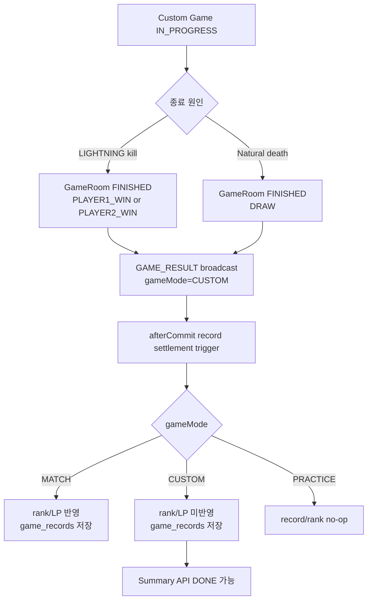
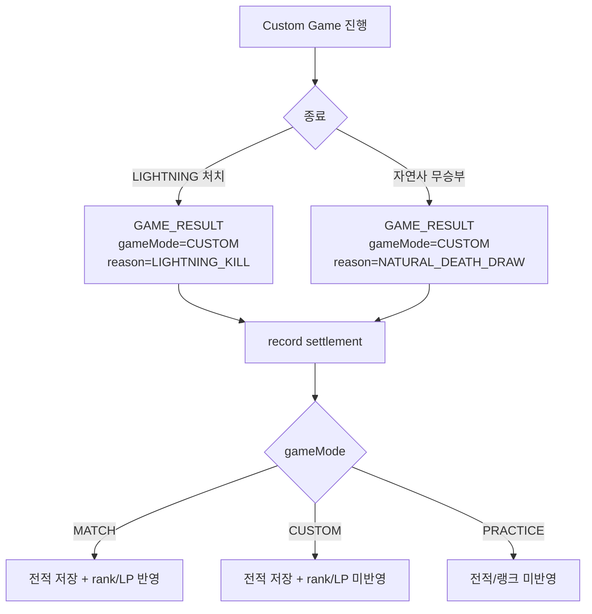

# Issue 132. Custom Game 랭크 제외 / 전적 기록 / 결과 WebSocket 계약

## Feature Description

사용자 지정 게임이 종료되면 기존 Game WebSocket `GAME_RESULT`로 결과를 확정하고, 랭크/LP에는 반영하지 않되 전적에는 남기도록 서버 결과 정책을 구현한다.

이번 이슈는 issue-130에서 `ROOM_STARTED`로 Custom Game을 기존 Game WebSocket 플레이 흐름에 넘긴 다음 단계다. Custom Game은 새로운 게임 엔진을 만들지 않고 기존 Scenario, LIGHTNING, GameAction, GameRoom 종료 로직을 재사용한다. 다만 정산 정책은 Match와 다르다.

중요한 정책은 다음과 같다.

- `MATCH`는 랭크/LP/전적 반영 대상이다.
- `CUSTOM`은 전적 반영 대상이지만 랭크/LP 반영 대상이 아니다.
- `PRACTICE`는 랭크/LP/전적 모두 미반영 대상이다.
- Custom Game 최종 결과 source of truth는 기존 Game WebSocket `GAME_RESULT`다.
- Custom Game `GAME_RESULT.reason`은 기존 `LIGHTNING_KILL`, `NATURAL_DEATH_DRAW`를 재사용하고, `gameMode=CUSTOM`으로 구분한다.
- Custom Game 전적은 현재 rank snapshot을 before/after 동일하게 저장해 LP 변화가 없는 전적으로 남긴다.



이번 이슈에 포함되는 범위:

- Custom Game `GAME_RESULT.gameMode=CUSTOM` payload 정책 구현.
- Custom Game result reason은 기존 reason 재사용 정책으로 확정.
- Custom Game 전적 저장 구현.
- Custom Game rank/LP 미반영 구현.
- settlement trigger/recovery가 `MATCH`, `CUSTOM`, `PRACTICE`를 올바르게 분기하도록 구현.
- Summary API가 Custom Game 전적 저장 상태를 기존 `PENDING/DONE` 흐름으로 조회할 수 있게 검증.
- `docs/last-구현.md` 4-7 및 issue-132 문서 정합성 반영.

후속 이슈로 미루는 범위:

- Custom Game 결과 화면 프론트 구현.
- Custom Room start 버튼 및 `ROOM_STARTED` 프론트 연결.
- Custom Game 다시하기/방으로 돌아가기 UX.
- Custom Game 전적 화면에서 match/custom 구분 표시.
- Custom Game 전용 result reason 추가.
- custom 랭킹/통계 기능.
- DDL 변경.
- 새 외부 패키지 추가.

## Backend Contract

### GAME_RESULT Event

새 WebSocket event type은 추가하지 않는다. 기존 Game WebSocket `GAME_RESULT`를 그대로 사용한다.

```json
{
  "type": "GAME_RESULT",
  "payload": {
    "gameRoomId": 100,
    "gameMode": "CUSTOM",
    "result": "PLAYER1_WIN",
    "winnerUserId": 1,
    "reason": "LIGHTNING_KILL",
    "practiceResult": null,
    "finishedAt": 1710000000000,
    "actions": [
      {
        "userId": 1,
        "serverReceiveTime": 1710000000000,
        "lightningTimeMs": 3200,
        "starCoreHpAtLightning": 1200,
        "damage": 1200,
        "afterHp": 0,
        "isKill": true
      }
    ]
  }
}
```

### Result Reason Policy

| 종료 상황 | gameMode | reason | practiceResult |
|----------|----------|--------|----------------|
| Match LIGHTNING 처치 | `MATCH` | `LIGHTNING_KILL` | `null` |
| Match 자연사 무승부 | `MATCH` | `NATURAL_DEATH_DRAW` | `null` |
| Custom LIGHTNING 처치 | `CUSTOM` | `LIGHTNING_KILL` | `null` |
| Custom 자연사 무승부 | `CUSTOM` | `NATURAL_DEATH_DRAW` | `null` |
| Practice LIGHTNING 처치 | `PRACTICE` | `PRACTICE_LIGHTNING_KILL` | `SUCCESS` |
| Practice timeout | `PRACTICE` | `PRACTICE_TIMEOUT` | `FAILED` |

Custom Game은 reason을 새로 만들지 않는다. 프론트와 로그는 `gameMode=CUSTOM`으로 Custom Game을 구분한다.

### Record / Rank Settlement Policy

| gameMode | game_records | rank/LP | UserRankInfo 승패무 누적 | rank series |
|----------|--------------|---------|---------------------------|-------------|
| `MATCH` | 저장 | 반영 | 반영 | 반영 |
| `CUSTOM` | 저장 | 미반영 | 미반영 | 미반영 |
| `PRACTICE` | 미저장 | 미반영 | 미반영 | 미반영 |

Custom Game record 저장 기준:

- 참가자 2명 각각에 대해 `game_records` 2행을 생성한다.
- `seriesType=CUSTOM`으로 저장한다.
- `rankSeriesId=null`로 저장한다.
- `lpBefore`와 `lpAfter`는 현재 LP로 동일하게 저장한다.
- `lpChange=0`이 된다.
- `rankBefore`와 `rankAfter`는 현재 rank snapshot으로 동일하게 저장한다.
- `RankCommandService.applyRecordResults()`를 호출하지 않는다.

현재 `game_records.rank_before`, `game_records.rank_after`는 nullable이 아니므로 Custom Game도 rank snapshot을 저장한다. DDL 변경 없이 기존 summary/record 응답 구조를 유지하기 위한 정책이다.

### Recovery Policy

- recovery 후보는 `FINISHED` 상태이면서 record count가 2가 아닌 `MATCH`, `CUSTOM` game room이다.
- `PRACTICE`는 recovery 후보에서 제외한다.
- `MATCH` recovery는 기존처럼 rank/LP/record 정산을 복구한다.
- `CUSTOM` recovery는 record 저장만 복구하고 rank/LP는 변경하지 않는다.
- 부분 record 1행 상태는 기존처럼 불완전 정산 상태로 보고 경고/예외 정책을 유지한다.

### Summary Policy

- Summary API는 `PRACTICE`를 계속 지원하지 않는다.
- Summary API는 `MATCH`, `CUSTOM`을 지원한다.
- Custom Game record가 아직 없으면 기존처럼 `PENDING`을 반환한다.
- Custom Game record 2행이 있으면 기존처럼 `DONE`을 반환한다.
- Custom Game summary의 LP 변화는 0으로 나타난다.

### Source Of Truth Policy

- 게임 종료 상태 source of truth는 core `GameRoom`이다.
- 게임 결과 event source of truth는 Game WebSocket `GAME_RESULT`다.
- 전적 저장 source of truth는 core record settlement service다.
- rank/LP 변경 source of truth는 core rank service이며, `CUSTOM`에서는 호출하지 않는다.
- API 모듈은 repository를 직접 참조하지 않고 core service를 통해 정산을 요청한다.

## Scope Boundary

이번 이슈에 포함:

- `GameResultPayloadFactory`가 Custom Game 결과 payload를 `gameMode=CUSTOM`으로 만들도록 정리.
- LIGHTNING kill 종료 시 `MATCH`, `CUSTOM`은 settlement trigger 등록, `PRACTICE`는 미등록.
- 자연사 종료 시 `MATCH`, `CUSTOM`은 settlement trigger 등록, `PRACTICE`는 미등록.
- core record settlement service를 mode-aware 구조로 변경.
- `CUSTOM` record 저장 시 rank snapshot before/after 동일 저장.
- `CUSTOM` 정산에서 rank/LP/UserRankInfo/RankSeries 미변경 보장.
- recovery query/service가 `MATCH`, `CUSTOM` 누락 전적을 복구하도록 정리.
- match status cleanup은 `MATCH`에만 실행되도록 정리.
- Summary API가 `CUSTOM` record 상태를 조회할 수 있는지 테스트.
- core/api 테스트 구현.
- `docs/last-구현.md` 4-7 정합성 갱신.
- issue-132 PR 섹션 보강.

이번 이슈에서 제외:

- Custom Game 전용 HTTP API 추가.
- Custom Game 전용 WebSocket type 추가.
- Custom 전용 result reason 추가.
- Custom 결과 화면 프론트 구현.
- Custom Room 프론트 start 연결.
- Custom Game record 화면에서 mode badge 표시.
- `game_records` DDL 변경.
- Practice record 저장.
- Match 기존 rank/LP 정책 변경.
- 새 외부 패키지 추가.

## Tasks

### 1. Backend Contract 정리

- [x] Custom Game 결과 source of truth가 `GAME_RESULT` WebSocket event임을 문서화.
- [x] `GAME_RESULT.gameMode=CUSTOM` payload shape 확정.
- [x] Custom Game result reason은 기존 `LIGHTNING_KILL`, `NATURAL_DEATH_DRAW` 재사용으로 확정.
- [x] `MATCH/CUSTOM/PRACTICE` record/rank 정책 표 정리.
- [x] Summary API에서 Custom Game을 지원하고 Practice는 제외하는 정책 정리.
- [x] issue-130 후속 범위와 충돌하지 않는지 확인.

### 2. Core Record Settlement Policy 구현

- [x] `GameRecordSeriesType.CUSTOM` 추가.
- [x] record settlement service를 `gameMode` 기준으로 분기.
- [x] `MATCH`는 기존 rank 정산 + record 저장 유지.
- [x] `CUSTOM`은 rank 정산 없이 record만 저장.
- [x] `PRACTICE`는 record/rank no-op 유지.
- [x] Custom record에 현재 rank/lp snapshot을 before/after 동일하게 저장.
- [x] Custom record의 `rankSeriesId=null`, `seriesType=CUSTOM`, `lpChange=0` 보장.
- [x] API 모듈이 record/rank repository를 직접 참조하지 않는 구조 유지.

### 3. Result Payload / WebSocket 흐름 구현

- [x] LIGHTNING kill Custom Game 결과 payload가 `gameMode=CUSTOM`으로 생성되게 수정.
- [x] Custom LIGHTNING kill reason은 `LIGHTNING_KILL`로 유지.
- [x] Custom 자연사 draw payload가 `gameMode=CUSTOM`으로 생성되게 수정.
- [x] Custom 자연사 draw reason은 `NATURAL_DEATH_DRAW`로 유지.
- [x] Practice payload와 practiceResult 정책이 기존과 동일하게 유지되는지 확인.
- [x] 새 WebSocket event type 없이 기존 `GAME_RESULT`를 재사용.

### 4. Settlement Trigger / Recovery 구현

- [x] LIGHTNING kill 종료 후 `MATCH`, `CUSTOM`은 settlement trigger를 등록.
- [x] 자연사 종료 후 `MATCH`, `CUSTOM`은 settlement trigger를 등록.
- [x] `PRACTICE`는 settlement trigger 등록하지 않음.
- [x] recovery 후보 조회를 `MATCH`, `CUSTOM`으로 확장.
- [x] `PRACTICE` recovery 후보 제외 유지.
- [x] Custom recovery는 record만 복구하고 rank/LP는 변경하지 않음.
- [x] 부분 record 1행 상태 경고/예외 정책 유지.

### 5. Match Status Cleanup / Summary 정리

- [x] match status cleanup은 `MATCH`에서만 실행되도록 수정.
- [x] `CUSTOM`은 matching 상태 cleanup을 시도하지 않음.
- [x] Summary API가 `CUSTOM` record 0개일 때 `PENDING`을 반환하는지 확인.
- [x] Summary API가 `CUSTOM` record 2개일 때 `DONE`을 반환하는지 확인.
- [x] Custom summary에서 LP 변화 0, rank before/after 동일 값이 내려가는지 확인.

### 6. Test 구현

- [ ] core unit test: `MATCH` 기존 rank 정산 + record 저장 유지.
- [ ] core unit test: `CUSTOM` rank 정산 미호출 + record 2행 저장.
- [ ] core unit test: `CUSTOM` record snapshot before/after 동일, `lpChange=0`, `seriesType=CUSTOM`.
- [ ] core unit test: `PRACTICE` no-op 유지.
- [ ] core repository/recovery test: `MATCH`, `CUSTOM` 누락 record 후보 조회.
- [ ] api unit test: Custom LIGHTNING kill 결과 payload `gameMode=CUSTOM`.
- [ ] api unit test: Custom 자연사 결과 payload `gameMode=CUSTOM`.
- [ ] api unit test: Practice는 settlement trigger 미등록 유지.
- [ ] api unit test: Custom은 match status cleanup 미실행.
- [ ] summary service test: Custom `PENDING/DONE` 흐름 검증.

### 7. 문서 정합성 구현

- [ ] `docs/last-구현.md` 4-7 Backend 체크리스트를 구현 결과와 맞게 갱신.
- [ ] `docs/last-구현.md` 4-7 Policy 체크리스트를 `MATCH/CUSTOM/PRACTICE` 정책과 맞춤.
- [ ] `docs/last-구현.md` 4-7 Acceptance Criteria 체크 갱신.
- [ ] issue-132 Tasks 완료 항목 체크.
- [ ] issue-132 Backend Contract와 구현 코드의 payload/settlement 정책 대조.
- [ ] issue-130의 후속 범위 문구와 issue-132 구현 범위가 일치하는지 확인.
- [ ] issue-120 Practice 정책과 충돌하지 않는지 확인.
- [ ] Summary API 문서 보강 필요 여부 확인.
- [ ] PR Message 섹션 설계 중심으로 보강.

### 8. 검증

- [ ] `./gradlew :league-of-star-core:test --tests '*GameRecord*'`
- [ ] `./gradlew :league-of-star-api:test --tests '*GameLightningServiceTest' --tests '*GameEndSettlementServiceTest' --tests '*GameRecord*' --tests '*GameSummary*'`
- [ ] `./gradlew :league-of-star-core:test`
- [ ] `./gradlew :league-of-star-api:test`
- [ ] `./gradlew test`
- [ ] `./gradlew build`
- [ ] `git diff --check`

## Implementation Policy

- core 모듈은 game room, record, rank 도메인/영속성 책임을 담당한다.
- api 모듈은 WebSocket payload 생성, 종료 흐름 orchestration, afterCommit trigger 연결만 담당한다.
- API 모듈은 record/rank/game repository를 직접 참조하지 않는다.
- Custom Game은 기존 Game WebSocket `GAME_RESULT`를 재사용한다.
- Custom Game은 기존 LIGHTNING, Scenario, GameAction, GameRoom 종료 로직을 재사용한다.
- Custom Game은 전적 저장 대상이다.
- Custom Game은 rank/LP/UserRankInfo 승패무 누적/rank series 변경 대상이 아니다.
- Practice Mode는 record/rank 모두 미반영 대상이다.
- Match Mode 기존 정산 정책은 변경하지 않는다.
- Custom Game result reason은 기존 `LIGHTNING_KILL`, `NATURAL_DEATH_DRAW`를 재사용한다.
- Custom Game 구분은 `gameMode=CUSTOM`을 기준으로 한다.
- Custom record는 DDL 변경 없이 현재 rank snapshot을 before/after 동일하게 저장한다.
- recovery는 Custom record 누락을 복구하지만 rank/LP를 복구하지 않는다.
- 새 외부 패키지를 추가하지 않는다.

## Acceptance Criteria

- Custom Game LIGHTNING kill 종료 시 `GAME_RESULT.gameMode=CUSTOM`이 broadcast된다.
- Custom Game 자연사 종료 시 `GAME_RESULT.gameMode=CUSTOM`이 broadcast된다.
- Custom Game result reason은 기존 `LIGHTNING_KILL`, `NATURAL_DEATH_DRAW`를 사용한다.
- Custom Game 완료 후 `game_records` 2행이 생성된다.
- Custom Game 완료 후 `UserRankInfo`의 rank/LP/승패무 누적은 변경되지 않는다.
- Custom Game record의 `lpChange`는 0이다.
- Custom Game record의 `rankBefore`와 `rankAfter`는 동일하다.
- Custom Game record의 `seriesType`은 `CUSTOM`이다.
- Custom Game record의 `rankSeriesId`는 null이다.
- recovery scheduler/service가 Custom Game record 누락을 복구한다.
- Match record/rank 정산 기존 동작이 유지된다.
- Practice record/rank 미반영 기존 동작이 유지된다.
- Summary API가 Custom Game 결과를 `PENDING/DONE` 흐름으로 조회할 수 있다.
- core/api 테스트와 문서 검증이 통과한다.

## PR Message

## PR 작성 방법

## 📌 Summary

Custom Game이 끝났을 때 결과는 기존 Game WebSocket `GAME_RESULT`로 내려주고, 전적은 남기되 랭크와 LP는 바뀌지 않게 구현함.

Custom Game은 Match처럼 두 명이 겨루는 게임이지만, 랭크 게임은 아니다. 그래서 게임 진행과 결과 판정은 기존 시스템을 재사용하고, 정산 단계에서만 `gameMode=CUSTOM`을 보고 전적 저장과 랭크 반영 책임을 분리함.



핵심 정책:

- Custom Game 결과 source of truth는 WebSocket `GAME_RESULT`임.
- Custom Game은 `gameMode=CUSTOM`으로 구분함.
- Custom Game result reason은 기존 reason을 재사용함.
- Custom Game은 전적에는 남지만 랭크/LP에는 반영되지 않음.
- Practice는 계속 전적/랭크 모두 미반영임.

백엔드와의 구현 계약:

- 기존 Game WebSocket `GAME_RESULT` payload를 재사용함.
- `GAME_RESULT.gameMode=CUSTOM`을 내려줌.
- Custom Game record는 현재 rank/lp snapshot을 before/after 동일하게 저장함.
- Custom Game에서는 `RankCommandService.applyRecordResults()`를 호출하지 않음.
- recovery는 Custom Game record 누락을 복구하되 rank/LP는 변경하지 않음.

## 📚 Changes

- 게임 진행 로직은 새로 만들지 않고 기존 시스템을 재사용함.
  Custom Game도 별 HP 시나리오, LIGHTNING 판정, 자연사 종료, Game WebSocket result 전송은 기존 game domain이 이미 책임지고 있다. 새 흐름을 만들면 Match와 Custom의 판정 규칙이 어긋날 수 있으므로, `gameMode`만 다르게 두고 같은 게임 엔진을 사용함.

- 정산 정책만 `gameMode`로 분리함.
  Match는 랭크 게임이므로 전적과 랭크가 함께 움직인다. Custom은 친구와 하는 비랭크 게임이므로 전적은 남기되 랭크 점수는 바꾸지 않는다. Practice는 혼자 확인하는 모드라 전적도 남기지 않는다.

- Custom record에는 현재 rank snapshot을 그대로 저장함.
  `game_records`는 rank before/after를 필수로 가지고 있고 Summary API도 이 구조를 사용한다. DDL을 바꾸지 않고 기존 응답 구조를 유지하기 위해 Custom record에는 현재 rank/lp를 before/after에 동일하게 저장함. 그래서 화면에서는 LP 변화가 0으로 보이고, 랭크도 바뀌지 않는다.

- Custom에서는 rank service를 호출하지 않음.
  `RankCommandService.applyRecordResults()`는 LP, rank, 승패무 누적, rank series를 변경할 수 있는 진짜 랭크 정산이다. Custom은 이 책임을 타면 안 되므로 record 저장만 하고 rank 정산 호출을 차단함.

- recovery도 Custom을 복구 대상으로 포함함.
  WebSocket 결과는 이미 나갔는데 record 저장만 실패할 수 있다. 이 경우 Custom도 전적이 남아야 하므로 recovery 후보에 포함한다. 다만 복구 시에도 rank/LP는 변경하지 않는다.

## 📝 Note

- 이번 PR에서 Custom Game 결과 화면 프론트 구현은 제외함.
- Custom Room start 프론트 연결은 제외함.
- Custom 전용 result reason 추가는 제외함.
- DDL 변경 없음.
- 새 패키지 추가 없음.
- 검증 결과를 여기에 기록함.

## 📌 Related Issue

- Closes #132
