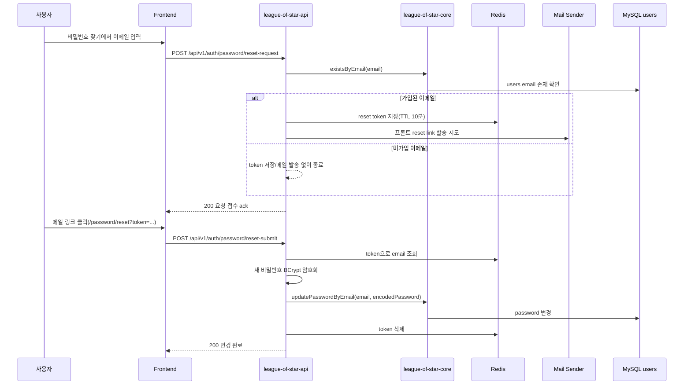
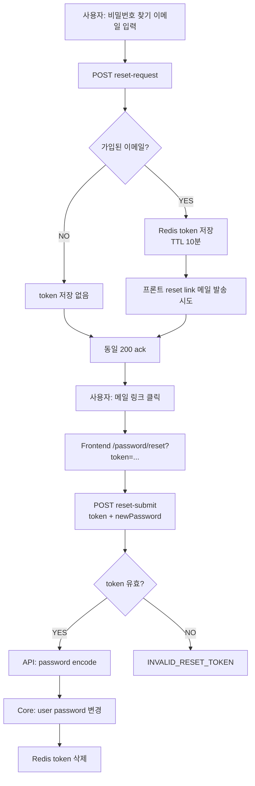

# Issue 140. 비밀번호 찾기 API / 메일 정책 정리

## Feature Description

비밀번호 찾기 기능의 백엔드 API 계약과 메일 발송 정책을 정리한다.

현재 백엔드에는 비밀번호 재설정 요청/제출 API, Redis reset token 저장소, 메일 발송 서비스, RestDocs 테스트가 일부 구현되어 있다. 이번 이슈는 새 기능을 처음부터 만드는 작업이 아니라, 기존 구현을 현재 프로젝트 정책에 맞게 검증하고 보강하는 작업이다.

핵심은 다음과 같다.

- 비밀번호 재설정 요청은 HTTP 200을 최종 변경이 아닌 command ack로 처리한다.
- 가입된 이메일인지 여부는 응답으로 노출하지 않는다.
- reset token은 Redis에 10분 TTL로 저장한다.
- reset token은 비밀번호 변경 성공 시 즉시 삭제해 1회용으로 처리한다.
- 메일 링크는 백엔드 submit API가 아니라 프론트 비밀번호 재설정 화면을 가리킨다.
- 실제 비밀번호 변경은 `reset-submit` API에서 token 검증 후 수행한다.
- API 모듈은 사용자 DB를 직접 조회하지 않고 core `UserReadService`, `UserCommandService`를 통해 접근한다.



이번 이슈에 포함되는 범위:

- 기존 password reset API 계약 재검증.
- reset token 발급/만료/1회성 사용 정책 정리.
- 메일 발송 실패와 미가입 이메일 응답 정책 정리.
- reset link가 프론트 reset 화면을 가리키도록 정책/구현 보강.
- core 모듈을 통한 사용자 데이터 접근 정책 검증.
- RestDocs/ErrorResponse/테스트 보강.
- `docs/last-구현.md` 5-1 및 issue-140 문서 정합성 반영.

후속 이슈로 미루는 범위:

- 비밀번호 찾기 프론트 route/page 구현.
- LoginPage의 비밀번호 찾기 버튼 연결.
- reset token 입력/새 비밀번호 입력 UI 구현.
- 프론트 에러 메시지/성공 메시지 UX 구현.
- OAuth 계정의 password reset 정책 확장.
- 메일 템플릿 HTML 디자인 고도화.
- rate limit, captcha, abuse 방지 정책.
- 새 외부 패키지 추가.

## Backend Contract

### Password Reset Request API

`POST /api/v1/auth/password/reset-request`

Request:

```json
{
  "email": "test@example.com"
}
```

Response:

```text
재설정 링크가 이메일로 발송되었습니다.
```

정책:

- HTTP 200은 요청 접수 ack다.
- 가입된 이메일이면 reset token을 생성하고 Redis에 저장한다.
- 미가입 이메일이면 token 저장과 메일 발송을 하지 않지만 동일한 200 ack를 반환한다.
- 사용자는 이메일 존재 여부를 응답으로 알 수 없어야 한다.
- 메일 발송 실패도 사용자 응답 실패로 전파하지 않는다.
- 내부 로그로만 발송 실패를 추적한다.

### Password Reset Submit API

`POST /api/v1/auth/password/reset-submit`

Request:

```json
{
  "token": "valid-token",
  "newPassword": "newPassword123"
}
```

Response:

```text
비밀번호가 성공적으로 변경되었습니다.
```

정책:

- `token`은 필수다.
- `newPassword`는 영문과 숫자를 포함한 8자 이상이어야 한다.
- token이 유효하면 Redis에서 email을 조회한다.
- API 모듈에서 `PasswordEncoder`로 새 비밀번호를 암호화한다.
- 암호화된 비밀번호 변경은 core `UserCommandService.updatePasswordByEmail()`을 통해 수행한다.
- 변경 성공 후 token은 Redis에서 삭제한다.
- token이 없거나 만료되었으면 `INVALID_RESET_TOKEN`으로 실패한다.

### Reset Link Policy

메일 본문에 들어가는 링크는 백엔드 API가 아니라 프론트 화면을 가리킨다.

예시:

```text
http://localhost:5173/password/reset?token={token}
```

이 정책을 사용하는 이유:

- 사용자는 메일 링크를 클릭했을 때 브라우저에서 새 비밀번호 입력 화면을 봐야 한다.
- 백엔드 `reset-submit` API는 `POST` JSON API이므로 메일 링크 클릭 목적지로 적절하지 않다.
- 프론트는 query string의 token을 읽고 새 비밀번호와 함께 `reset-submit` API를 호출한다.

### Source Of Truth Policy

- reset token의 source of truth는 Redis `PasswordResetStore`다.
- 사용자 존재 여부와 비밀번호 변경 source of truth는 core user service다.
- API 모듈은 user repository를 직접 참조하지 않는다.
- 메일 발송 성공 여부는 비밀번호 변경 여부의 source of truth가 아니다.
- 비밀번호가 실제로 변경되는 기준은 `reset-submit` API의 token 검증과 core password update 성공이다.

## Scope Boundary

이번 이슈에 포함:

- `reset-request` / `reset-submit` API 계약 정리.
- reset token TTL 10분 정책 검증.
- reset token 1회성 사용 정책 검증.
- 메일 링크를 프론트 reset 화면 기준으로 생성하도록 보강.
- 프론트 reset URL 설정값 분리.
- 미가입 이메일 동일 ack 정책 검증.
- 메일 발송 실패 동일 ack 정책 문서화.
- core `UserReadService`, `UserCommandService` 경유 정책 검증.
- RestDocs와 ErrorResponse 정합성 확인.
- password reset 관련 테스트 보강.
- `docs/last-구현.md` 5-1 정합성 갱신.
- issue-140 PR 섹션 보강.

이번 이슈에서 제외:

- 비밀번호 찾기 프론트 화면 구현.
- LoginPage 버튼 연결.
- reset token query parsing UI.
- 새 비밀번호 입력 UI.
- 메일 HTML 템플릿 고도화.
- 메일 발송 provider 교체.
- rate limit/captcha/보안 알림 메일.
- OAuth-only 계정 별도 정책.
- 사용자 세션 강제 로그아웃.
- 새 외부 패키지 추가.

## Tasks

### 1. Backend Contract 정리

- [x] `reset-request`가 command ack API임을 문서화.
- [x] `reset-submit`이 실제 password mutation API임을 문서화.
- [x] 미가입 이메일 동일 응답 정책을 정리.
- [x] 메일 발송 실패 동일 응답 정책을 정리.
- [x] reset token TTL 10분 정책을 정리.
- [x] reset token 1회성 사용 정책을 정리.
- [x] issue-20 기존 문서와 최신 정책 차이를 확인.

### 2. Reset Link / Mail Policy 구현

- [x] reset link 목적지를 프론트 reset 화면으로 변경.
- [x] 프론트 reset base URL을 설정값으로 분리.
- [x] local 기본 URL을 `http://localhost:5173/password/reset`로 둔다.
- [x] 메일 본문에 `{frontendResetUrl}?token={token}` 형식 링크를 넣는다.
- [x] 메일 발송 실패가 API 실패로 전파되지 않는 정책을 유지한다.
- [x] 메일 발송 실패 로그가 남는지 확인한다.

### 3. Core User Access Policy 점검

- [x] 이메일 존재 확인이 `UserReadService.existsByEmail()`을 통해 수행되는지 확인.
- [x] 비밀번호 변경이 `UserCommandService.updatePasswordByEmail()`을 통해 수행되는지 확인.
- [x] API 모듈에서 `UserRepository`를 직접 참조하지 않는지 확인.
- [x] `UserCommandService.updatePasswordByEmail()` 트랜잭션 범위가 적절한지 확인.
- [x] 암호화 책임은 API 모듈의 `PasswordEncoder`에 남기는지 확인.

### 4. ErrorResponse / RestDocs 정리

- [x] `reset-request` request field 문서를 최신 정책으로 보강.
- [x] `reset-submit` request field 문서를 최신 정책으로 보강.
- [x] invalid token ErrorResponse 문서를 추가하거나 기존 문서와 연결한다.
- [x] validation 실패 문서화 필요 여부를 확인한다.
- [x] OpenAPI schema가 내부적으로 깨지지 않는지 확인한다.

### 5. Test 구현

- [x] Controller RestDocs: `reset-request` 200 ack 문서화.
- [x] Controller RestDocs: `reset-submit` 200 문서화.
- [x] Controller RestDocs: invalid token ErrorResponse 문서화.
- [x] Service unit test: 가입 이메일이면 token 저장 + 메일 발송 시도.
- [x] Service unit test: 미가입 이메일이면 token 저장/메일 발송 없음.
- [x] Service unit test: 메일 실패가 request API 실패로 전파되지 않음.
- [x] Service unit test: reset link가 프론트 URL 기준으로 생성됨.
- [x] Service unit test: 유효 token이면 password encode + core command 호출 + token 삭제.
- [x] Service unit test: invalid token이면 password 변경 호출 없음.
- [x] Redis integration test: token 저장/조회/삭제 유지.

### 6. 문서 정합성 구현

- [x] `docs/last-구현.md` 5-1 체크리스트를 최신 정책과 맞춤.
- [x] issue-140 Tasks 완료 항목 체크.
- [x] issue-20 기존 password reset 문서와 충돌하는 표현 정리.
- [x] 5-2 프론트 구현 범위와 겹치지 않게 제외 범위 정리.
- [x] PR Message 섹션을 설계 중심으로 보강.

### 7. 검증

- [x] `./gradlew :league-of-star-api:test --tests '*PasswordReset*'`
- [x] `./gradlew :league-of-star-api:test --tests '*AuthPasswordControllerRestDocsTest'`
- [x] `./gradlew :league-of-star-api:test`
- [x] `./gradlew test`
- [x] `./gradlew build`
- [x] `git diff --check`

## Implementation Policy

- API 모듈은 user repository를 직접 참조하지 않는다.
- 사용자 존재 확인은 core `UserReadService`를 통해 수행한다.
- 사용자 비밀번호 변경은 core `UserCommandService`를 통해 수행한다.
- 비밀번호 암호화는 API 모듈의 `PasswordEncoder` 책임으로 둔다.
- reset token 저장/조회/삭제는 Redis `PasswordResetStore` 책임으로 둔다.
- `reset-request` HTTP 200은 요청 접수 ack다.
- 이메일 존재 여부는 응답으로 노출하지 않는다.
- 메일 발송 실패는 사용자 응답 실패로 전파하지 않는다.
- 실제 비밀번호 변경 기준은 `reset-submit` 성공이다.
- reset token은 10분 TTL을 갖는다.
- reset token은 비밀번호 변경 성공 후 삭제한다.
- 메일 링크는 프론트 reset 화면을 가리킨다.
- 새 외부 패키지를 추가하지 않는다.

## Acceptance Criteria

- 미가입 이메일로 `reset-request`를 호출해도 동일한 200 ack가 반환된다.
- 가입 이메일로 `reset-request`를 호출하면 reset token이 Redis에 저장된다.
- 가입 이메일로 `reset-request`를 호출하면 프론트 reset URL 기반 링크로 메일 발송을 시도한다.
- 메일 발송 실패가 `reset-request` 실패로 전파되지 않는다.
- 유효 token으로 `reset-submit`을 호출하면 비밀번호가 변경된다.
- `reset-submit` 성공 후 token이 삭제된다.
- 만료/잘못된 token으로 `reset-submit`을 호출하면 `INVALID_RESET_TOKEN`이 반환된다.
- API 모듈에서 사용자 DB repository를 직접 참조하지 않는다.
- RestDocs/OpenAPI 문서가 최신 계약과 일치한다.
- 관련 테스트와 빌드 검증이 통과한다.

## PR Message

## PR 작성 방법

## 📌 Summary

비밀번호 찾기 백엔드 흐름을 “요청 접수”와 “실제 비밀번호 변경”으로 나누어 정리함.

사용자가 이메일을 입력하는 `reset-request`는 보안상 이메일 존재 여부를 알려주지 않고 항상 같은 응답을 반환한다. 실제 비밀번호 변경은 메일 링크를 통해 프론트 reset 화면에 들어온 뒤, token과 새 비밀번호를 `reset-submit` API로 보냈을 때만 수행된다.



핵심 정책:

- `reset-request`의 HTTP 200은 요청 접수 ack임.
- 이메일 존재 여부와 메일 발송 실패 여부는 사용자 응답으로 노출하지 않음.
- 메일 링크는 백엔드 API가 아니라 프론트 reset 화면으로 연결함.
- 실제 비밀번호 변경은 `reset-submit`에서 token 검증 후 수행함.
- 사용자 DB 접근은 core `UserReadService`, `UserCommandService`를 통해서만 수행함.

백엔드와의 구현 계약:

- `POST /api/v1/auth/password/reset-request`
  - request: `{ email }`
  - response: 동일 200 ack
  - 가입 이메일이면 Redis token 저장 + 메일 발송 시도
  - 미가입 이메일이면 token 저장 없이 동일 ack
- `POST /api/v1/auth/password/reset-submit`
  - request: `{ token, newPassword }`
  - token 유효 시 비밀번호 변경 + token 삭제
  - token invalid/expired 시 `INVALID_RESET_TOKEN`

## 📚 Changes

- reset-request를 “비밀번호 변경 API”가 아니라 “재설정 링크 요청 접수 API”로 명확히 분리함.
  사용자가 이메일을 입력하는 순간에는 아직 비밀번호가 바뀌지 않는다. 이 API는 reset token을 만들고 메일 발송을 시도하는 command ack이며, 실제 변경은 submit API에서만 일어난다.

- 이메일 존재 여부를 숨기는 방향으로 정책을 고정함.
  미가입 이메일일 때 404를 반환하면 공격자가 어떤 이메일이 가입되어 있는지 추측할 수 있다. 따라서 미가입 이메일도 가입 이메일과 같은 200 ack를 반환하고, 내부적으로만 token 저장/메일 발송을 생략한다.

- 메일 발송 실패를 사용자 실패로 전파하지 않음.
  메일 서버 장애를 그대로 응답에 노출하면 이메일 존재 여부와 내부 인프라 상태가 드러날 수 있다. 사용자는 동일한 안내를 받고, 서버는 로그와 모니터링으로 발송 실패를 추적한다.

- reset link를 프론트 화면으로 보내도록 정리함.
  백엔드 `reset-submit`은 JSON `POST` API이므로 사용자가 메일에서 클릭할 링크 목적지로 적절하지 않다. 링크는 프론트 `/password/reset?token=...`으로 열리고, 프론트가 새 비밀번호와 함께 submit API를 호출하는 구조가 맞다.

- 사용자 데이터 접근은 core service를 통하도록 유지함.
  API 모듈은 외부 HTTP 요청, password encoding, mail orchestration을 담당한다. 사용자 존재 확인과 비밀번호 변경은 core user service를 통해 수행해 모듈 책임을 분리한다.

## 📝 Note

- 이번 PR에서 프론트 비밀번호 찾기 화면은 구현하지 않음.
- LoginPage 버튼 연결은 5-2 프론트 이슈에서 진행함.
- OAuth 계정 별도 정책, rate limit, captcha는 후속 보안 이슈로 분리함.
- 새 패키지는 추가하지 않음.
- 검증 결과:
  - `./gradlew :league-of-star-api:test --tests '*PasswordReset*'` 통과함.
  - `./gradlew :league-of-star-api:test --tests '*AuthPasswordControllerRestDocsTest'` 통과함.
  - `./gradlew :league-of-star-api:test` 통과함.
  - `./gradlew test` 통과함.
  - `./gradlew build` 통과함.
  - `git diff --check` 통과함.

## 📌 Related Issue

- Closes #140
