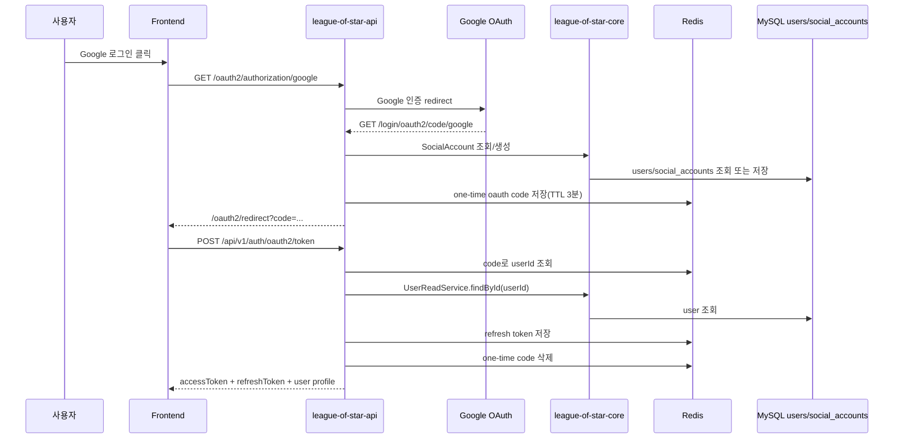
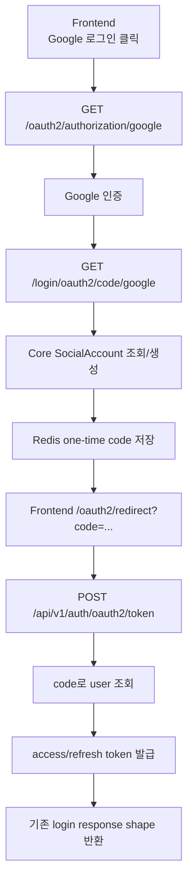

# Issue 144. OAuth 로그인 백엔드 계약 정리

## Feature Description

Google OAuth 로그인 백엔드 계약을 현재 프로젝트 인증 정책에 맞게 정리한다.

현재 백엔드에는 Spring Security OAuth2 기반 Google 로그인 흐름, `CustomOAuth2UserService`, `OAuth2AuthenticationSuccessHandler`, core `SocialAccount` 도메인이 이미 존재한다. 다만 현재 success handler는 OAuth 성공 후 프론트 redirect URL에 `accessToken`만 query parameter로 전달한다. 이 방식은 기존 email/password login의 `accessToken + refreshToken` 계약과 다르고, token이 URL/history/log에 남을 수 있다.

이번 이슈는 OAuth 기능을 새로 처음 만드는 작업이 아니라, 기존 구현을 다음 정책으로 보강하는 작업이다.

- OAuth 로그인은 REST login API가 아니라 browser redirect 기반 흐름이다.
- OAuth 성공 redirect에는 access/refresh token을 직접 싣지 않는다.
- OAuth 성공 시 Redis에 one-time code를 저장하고 프론트에는 `code`만 전달한다.
- 프론트는 `POST /api/v1/auth/oauth2/token`으로 one-time code를 access/refresh token pair로 교환한다.
- OAuth token exchange 응답은 기존 login response와 같은 shape를 사용한다.
- 기존 email/password 계정과 Google email이 같으면 현재 정책처럼 자동 연결한다.
- API 모듈은 user/social account repository를 직접 참조하지 않고 core service를 통해 접근한다.



이번 이슈에 포함되는 범위:

- 기존 OAuth2 redirect/callback 흐름 계약 정리.
- OAuth success handler를 token query 전달에서 one-time code 전달 방식으로 보강.
- OAuth code Redis 저장소 구현.
- OAuth token exchange API 구현.
- OAuth token exchange 응답을 기존 login response와 맞춤.
- 기존 email/password 계정과 Google account 자동 연결 정책 문서화.
- core service를 통한 user/social account 접근 정책 점검.
- RestDocs/ErrorResponse/테스트 보강.
- `docs/last-구현.md` 5-3 정합성 반영.

후속 이슈로 미루는 범위:

- OAuth 로그인 프론트 구현.
- `/oauth2/redirect` 프론트 route/page 구현.
- Google 로그인 버튼 실제 연결.
- OAuth 계정 연결 해제.
- 여러 OAuth provider 확장.
- 기존 이메일 계정 자동 연결을 비밀번호 확인 기반으로 바꾸는 보안 고도화.
- cookie 기반 인증 전환.
- 새 외부 패키지 추가.

## Backend Contract

### OAuth Login Entry

```http
GET /oauth2/authorization/google
```

정책:

- 프론트 Google 로그인 버튼이 브라우저 이동으로 호출하는 URL이다.
- JSON API가 아니라 Spring Security OAuth2 redirect entrypoint다.
- 인증 없이 접근 가능해야 한다.
- 이 endpoint는 access/refresh token을 직접 반환하지 않는다.

### OAuth Callback

```http
GET /login/oauth2/code/google
```

정책:

- Google OAuth 인증 후 Spring Security가 처리하는 callback URL이다.
- 프론트가 직접 호출하는 API가 아니다.
- `CustomOAuth2UserService`가 provider user info를 읽고 사용자 계정을 조회/생성한다.
- 성공 시 `OAuth2AuthenticationSuccessHandler`가 one-time code를 발급한다.

### OAuth Success Redirect

OAuth 성공 후 프론트 redirect URL 예시:

```text
http://localhost:5173/oauth2/redirect?code={oneTimeCode}
```

정책:

- redirect query에는 `accessToken`, `refreshToken`을 포함하지 않는다.
- redirect query에는 짧은 TTL의 one-time `code`만 포함한다.
- one-time code의 source of truth는 Redis다.
- one-time code TTL은 3분으로 둔다.
- code는 token exchange 성공 후 즉시 삭제한다.

### OAuth Token Exchange API

```http
POST /api/v1/auth/oauth2/token
Content-Type: application/json
```

Request:

```json
{
  "code": "oauth-one-time-code"
}
```

Response:

```json
{
  "accessToken": "access-token",
  "refreshToken": "refresh-token",
  "userId": 1,
  "nickname": "StarUser"
}
```

정책:

- public endpoint로 둔다.
- code가 없거나 만료되었으면 OAuth login 실패 ErrorResponse를 반환한다.
- 유효 code면 Redis에서 userId를 조회한다.
- API 모듈은 core `UserReadService.findById(userId)`로 user를 조회한다.
- access token과 refresh token은 기존 login과 같은 정책으로 발급한다.
- refresh token은 기존 refresh/logout 정책과 동일하게 Redis에 저장한다.
- exchange 성공 후 one-time code는 삭제한다.
- 응답 shape는 기존 `POST /api/v1/auth/login` 성공 응답과 맞춘다.

### Social Account Policy

현재 정책을 유지한다.

- Google provider/providerId와 연결된 `SocialAccount`가 있으면 기존 user를 사용한다.
- 연결된 social account가 없고 Google email과 같은 기존 user가 있으면 해당 user에 social account를 자동 연결한다.
- 같은 email user도 없으면 새 user와 social account를 생성한다.
- 자동 연결은 Google email을 신뢰하는 사용자 편의 정책이다.
- 더 강한 보안이 필요하면 후속 이슈에서 비밀번호 확인 기반 연결로 바꾼다.

### Source Of Truth Policy

- OAuth provider user info의 source of truth는 Spring Security OAuth2 user info response다.
- user/social account 조회/저장의 source of truth는 core account/user service다.
- one-time code의 source of truth는 Redis OAuth code store다.
- access/refresh token 발급 source of truth는 기존 auth token 발급 정책이다.
- refresh token의 source of truth는 기존 Redis refresh token repository다.
- API 모듈은 user/social account repository를 직접 참조하지 않는다.

## Scope Boundary

이번 이슈에 포함:

- OAuth backend 계약 문서화.
- OAuth success redirect에서 token query 전달 제거.
- OAuth one-time code Redis 저장소 추가.
- OAuth code TTL 3분 정책 구현.
- OAuth token exchange request/response DTO 추가.
- `POST /api/v1/auth/oauth2/token` controller/service 구현.
- OAuth token exchange 성공 시 기존 login과 같은 token pair 발급.
- OAuth token exchange 성공 시 refresh token Redis 저장.
- OAuth token exchange 성공 시 one-time code 삭제.
- invalid/expired code ErrorResponse 구현.
- `oauth2.success-redirect-url`을 프론트 `/oauth2/redirect` 기준으로 정리.
- RestDocs/OpenAPI 문서화.
- handler/service/controller 테스트 보강.
- `docs/last-구현.md` 5-3 정합성 갱신.
- issue-144 PR 섹션 보강.

이번 이슈에서 제외:

- 프론트 `/oauth2/redirect` route/page 구현.
- LoginPage Google 버튼 실제 연결.
- OAuth token exchange 프론트 service 구현.
- OAuth account unlink.
- Naver/Kakao/GitHub provider 추가.
- 기존 email/password 계정 자동 연결 정책 변경.
- cookie/session 인증 구조 전환.
- Google Cloud Console 설정 변경 자동화.
- 새 외부 패키지 추가.

## Tasks

### 1. Backend Contract 정리

- [x] 현재 `SecurityConfig` OAuth2 entry/callback 흐름을 확인한다.
- [x] 현재 `OAuth2AuthenticationSuccessHandler`의 token query 전달 문제를 문서화한다.
- [x] OAuth 성공 redirect는 one-time code만 전달한다고 확정한다.
- [x] token exchange API가 기존 login response shape를 따른다고 문서화한다.
- [x] 기존 email/password 계정과 Google account 자동 연결 정책을 문서화한다.
- [x] OAuth flow가 REST login API가 아닌 browser redirect 기반임을 문서화한다.

### 2. OAuth Code Store 구현

- [x] OAuth one-time code Redis domain을 추가한다.
- [x] OAuth code repository를 추가한다.
- [x] OAuth code store를 추가한다.
- [x] code 저장 payload는 `code -> userId`로 둔다.
- [x] TTL은 3분으로 둔다.
- [x] code 조회 메서드를 구현한다.
- [x] code 삭제 메서드를 구현한다.

### 3. Token Issue Policy 정리

- [x] 기존 email/password login의 token pair 발급 로직 재사용 지점을 정리한다.
- [x] access token 발급 정책이 기존 login과 같게 한다.
- [x] refresh token 발급 정책이 기존 login과 같게 한다.
- [x] refresh token Redis 저장 정책이 기존 login과 같게 한다.
- [x] OAuth login과 email/password login이 같은 response shape를 쓰도록 정리한다.

### 4. OAuth Success Handler 보강

- [x] success handler가 access token을 redirect query에 넣지 않게 수정한다.
- [x] success handler가 refresh token을 redirect query에 넣지 않게 보장한다.
- [x] 인증 성공 userId를 OAuth code store에 저장한다.
- [x] success redirect URL에 `code` query만 추가한다.
- [x] response committed 상태 처리는 기존 정책을 유지한다.

### 5. OAuth Token Exchange API 구현

- [x] `AuthPath`에 OAuth token exchange path를 상수화한다.
- [x] request DTO `{ code }`를 추가한다.
- [x] response는 기존 `LoginResponse` 또는 동일 shape를 재사용한다.
- [x] controller에 `POST /api/v1/auth/oauth2/token`을 추가한다.
- [x] service에서 code로 userId를 조회한다.
- [x] core `UserReadService.findById(userId)`로 user를 조회한다.
- [x] token pair를 발급하고 refresh token을 저장한다.
- [x] exchange 성공 후 code를 삭제한다.
- [x] invalid/expired code ErrorResponse를 반환한다.

### 6. Social Account Policy 점검

- [x] `CustomOAuth2UserService`가 core `SocialAccountReadService`를 사용하는지 확인한다.
- [x] `CustomOAuth2UserService`가 core `SocialAccountCommandService`를 사용하는지 확인한다.
- [x] API 모듈에서 social account repository 직접 접근이 없는지 확인한다.
- [x] Google provider/providerId 기존 계정 조회 정책을 확인한다.
- [x] Google email과 기존 user email 자동 연결 정책을 문서화한다.
- [x] 신규 OAuth user nickname 생성 정책을 확인한다.

### 7. ErrorResponse / RestDocs 정리

- [x] OAuth token exchange 성공 RestDocs를 추가한다.
- [x] invalid/expired code ErrorResponse RestDocs를 추가한다.
- [x] request field `code`를 문서화한다.
- [x] response field가 기존 login response와 같음을 문서화한다.
- [x] OpenAPI schema가 내부적으로 깨지지 않는지 확인한다.

### 8. Test 구현

- [x] Handler unit test: OAuth 성공 redirect에 token이 없고 code만 포함됨.
- [x] Handler unit test: OAuth code store에 userId 저장됨.
- [x] Service unit test: 유효 code면 token pair 발급 + refresh token 저장 + code 삭제.
- [x] Service unit test: invalid code면 token 발급/refresh 저장 없음.
- [x] Controller RestDocs: token exchange 성공 문서화.
- [x] Controller RestDocs: invalid code ErrorResponse 문서화.
- [x] Redis integration test: OAuth code 저장/조회/삭제 유지.
- [x] SocialAccount core 테스트가 현재 정책을 충분히 검증하는지 확인한다.

### 9. 문서 정합성 구현

- [x] `docs/last-구현.md` 5-3 체크리스트를 최신 계약과 맞춘다.
- [x] issue-144 Tasks 완료 항목 체크.
- [x] 5-4 프론트 구현 범위와 겹치지 않게 제외 범위 정리.
- [x] PR Message 섹션을 설계 중심으로 보강한다.

### 10. 검증

- [x] `./gradlew :league-of-star-api:test --tests '*OAuth*'`
- [x] `./gradlew :league-of-star-api:test --tests '*AuthControllerRestDocsTest'`
- [x] `./gradlew :league-of-star-api:test`
- [x] `./gradlew :league-of-star-core:test`
- [x] `./gradlew test`
- [x] `./gradlew build`
- [x] `git diff --check`

## Implementation Policy

- OAuth 로그인은 redirect 기반 로그인으로 둔다.
- OAuth 성공 redirect에는 access/refresh token을 직접 노출하지 않는다.
- OAuth 성공 redirect에는 one-time code만 전달한다.
- one-time code는 Redis에 3분 TTL로 저장한다.
- one-time code는 exchange 성공 후 삭제한다.
- OAuth token exchange 응답은 기존 login response와 같은 shape를 따른다.
- OAuth login도 refresh token을 발급하고 Redis에 저장한다.
- OAuth token refresh/logout은 기존 refresh/logout 정책을 그대로 사용한다.
- 기존 email/password 계정과 Google email이 같으면 자동 연결한다.
- API 모듈은 user/social account repository를 직접 참조하지 않는다.
- user/social account 조회/저장은 core service를 통해 수행한다.
- Google provider만 이번 이슈 범위로 둔다.
- 새 외부 패키지를 추가하지 않는다.

## Acceptance Criteria

- `GET /oauth2/authorization/google`로 Google OAuth 흐름을 시작할 수 있다.
- OAuth 성공 redirect URL에는 `accessToken`, `refreshToken`이 포함되지 않는다.
- OAuth 성공 redirect URL에는 one-time `code`만 포함된다.
- 발급된 OAuth code는 Redis에 3분 TTL로 저장된다.
- 유효 code로 `POST /api/v1/auth/oauth2/token`을 호출하면 기존 login과 같은 token pair 응답을 받는다.
- token exchange 성공 시 refresh token이 Redis에 저장된다.
- token exchange 성공 시 OAuth code가 삭제된다.
- 만료/잘못된 code로 token exchange를 호출하면 ErrorResponse가 반환된다.
- 기존 Google social account가 있으면 기존 user로 로그인된다.
- Google email과 같은 기존 user가 있으면 social account가 자동 연결된다.
- API 모듈에서 user/social account repository를 직접 참조하지 않는다.
- RestDocs/OpenAPI 문서가 최신 계약과 일치한다.
- 관련 테스트와 빌드 검증이 통과한다.

## PR Message

## PR 작성 방법

## 📌 Summary

Google OAuth 로그인 백엔드 흐름을 기존 email/password 로그인과 같은 token pair 계약으로 정리함.

OAuth 자체는 브라우저 redirect 기반으로 진행하지만, 최종 access/refresh token은 redirect URL에 직접 싣지 않는다. 대신 백엔드가 짧은 TTL의 one-time code를 Redis에 저장하고, 프론트가 이 code를 `POST /api/v1/auth/oauth2/token`으로 교환해 기존 로그인과 같은 응답을 받는 구조로 맞춘다.



핵심 정책:

- OAuth 성공 redirect에는 token을 직접 노출하지 않음.
- one-time code는 Redis에 3분 TTL로 저장함.
- token exchange 성공 후 code를 삭제함.
- OAuth login도 기존 login과 같은 access/refresh token pair를 발급함.
- 기존 Google email과 같은 email/password user가 있으면 자동 연결함.
- user/social account 접근은 core service를 통해 수행함.

백엔드와의 구현 계약:

- `GET /oauth2/authorization/google`
  - 브라우저 redirect 기반 OAuth 시작 URL
  - JSON API가 아님
- `GET /login/oauth2/code/google`
  - Google callback
  - Spring Security OAuth2가 처리함
- `POST /api/v1/auth/oauth2/token`
  - request: `{ code }`
  - response: `{ accessToken, refreshToken, userId, nickname }`
  - invalid/expired code는 ErrorResponse 반환

## 📚 Changes

- token query 전달을 one-time code 교환 방식으로 바꿈.
  OAuth 성공 직후 redirect URL에 access token을 싣는 방식은 구현은 단순하지만 브라우저 history, proxy log, referrer 등으로 token이 남을 수 있다. one-time code는 짧은 TTL을 갖고 한 번만 token으로 교환되므로 URL에 남아도 실제 credential 노출 위험을 줄일 수 있다.

- one-time code 소비를 Redis Lua script로 원자화함.
  단순히 code를 조회한 뒤 토큰을 발급하고 마지막에 삭제하면 같은 code에 대한 동시 요청이 모두 조회를 통과할 수 있다. 그래서 code exchange는 Redis에서 조회와 삭제를 한 번에 수행하고, 삭제에 성공한 첫 요청만 토큰 발급으로 넘어가게 함.

- OAuth login도 기존 login과 같은 token pair 계약으로 맞춤.
  현재 일반 로그인은 access token과 refresh token을 함께 발급하고, refresh/logout은 Redis refresh token을 기준으로 동작한다. OAuth만 access token만 주면 프론트 세션 유지와 logout 정책이 달라진다. 따라서 OAuth token exchange도 기존 login response shape를 따르게 한다.

- SocialAccount 자동 연결 정책을 유지함.
  Google provider/providerId가 이미 있으면 기존 user를 사용한다. 없더라도 Google email과 같은 기존 user가 있으면 social account를 자동 연결한다. 이 방식은 사용자가 같은 이메일로 비밀번호 계정과 Google 계정을 따로 갖는 혼란을 줄인다. 다만 더 강한 보안이 필요하면 후속 이슈에서 비밀번호 확인 기반 연결로 바꿀 수 있다.

- API 모듈과 core 모듈 책임을 분리함.
  OAuth provider 처리, redirect, token 발급, Redis code 저장은 API 모듈 책임이다. user/social account 조회와 저장은 core service를 통해 수행한다. 이렇게 해야 API 모듈이 영속성 계층을 직접 알지 않고, 도메인 데이터 접근 책임이 core에 남는다.

## 📝 Note

- 이번 PR에서 프론트 OAuth redirect page는 구현하지 않음.
- LoginPage Google 버튼 연결은 5-4 프론트 이슈에서 진행함.
- Google 외 provider 확장은 후속 이슈로 둠.
- cookie 기반 인증 전환은 포함하지 않음.
- 새 패키지는 추가하지 않음.
- 검증 결과:
  - `./gradlew :league-of-star-api:test --tests '*OAuthLoginCodeStoreTest'` 통과함.
  - `./gradlew :league-of-star-api:test --tests '*AuthServiceTest' --tests '*AuthTokenIssueServiceTest'` 통과함.
  - `./gradlew :league-of-star-api:test --tests '*OAuth2AuthenticationSuccessHandlerTest'` 통과함.
  - `./gradlew :league-of-star-api:test --tests '*OAuthLoginServiceTest' --tests '*AuthControllerRestDocsTest'` 통과함.
  - `./gradlew :league-of-star-api:test --tests '*OAuth*'` 통과함.
  - `./gradlew :league-of-star-api:test --tests '*AuthControllerRestDocsTest'` 통과함.
  - `./gradlew :league-of-star-api:test` 통과함.
  - `./gradlew :league-of-star-core:test` 통과함.
  - `./gradlew test` 통과함.
  - `./gradlew build` 통과함.
  - `git diff --check` 통과함.

## 📌 Related Issue

- Closes #144
