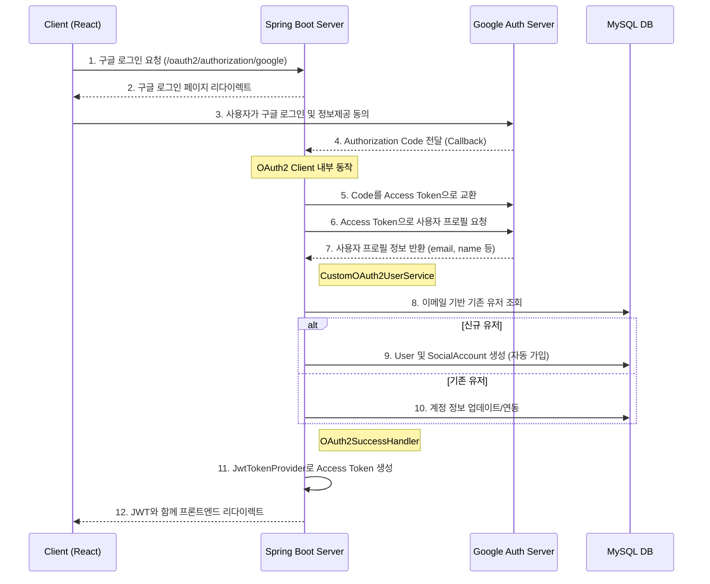

# Issue-15 — Authentication System Implementation (Social & General)

## 📌 Feature Description
구글 OAuth2를 이용한 소셜 로그인 기능을 구현하고, 최초 로그인 시 이메일 기반으로 자동으로 회원가입이 진행되는 프로세스를 구축함. 기존 JWT 인증 체계와 통합하여 로그인 완료 시 Access Token을 발급함.

## 🔄 Authentication Flow

## 📚 Tasks

### 1. 설정 및 인프라 (Setup)
- [x] **의존성 추가**: `league-of-star-api/build.gradle`에 `spring-boot-starter-oauth2-client` 추가
- [x] **환경 설정**: `application-security.yml`로 OAuth2 설정 통합 및 `application.yml` 프로파일 정리
- [x] **보안**: `.gitignore`에 `application-security.yml` 등록하여 기밀 정보 유출 방지

### 2. 도메인 레이어 확장 (Core)
- [x] **UserRepository**: `findByEmail(String email)` 쿼리 메서드 추가
- [x] **도메인 서비스**: `UserAuthService`, `SocialAccountService` 구현하여 DB 접근 책임 일원화

### 3. 애플리케이션 로직 구현 (API)
- [x] **CustomOAuth2UserService**: 구글 프로필 기반 자동 가입 및 계정 연동 로직 구현 (Core 서비스 활용)
- [x] **OAuth2SuccessHandler**: 로그인 성공 시 JWT 발급 및 프론트엔드 리다이렉트 처리 (상수 활용)
- [x] **SecurityConfig**: OAuth2 로그인 활성화 및 신규 패키지 구조 반영하여 임포트 정리

### 4. 검증 (Verification)
- [x] **정적 검토**: SRP, DRY 원칙 준수 여부 및 Magic String 제거 확인
- [x] **아키텍처 확인**: Core 모듈을 통한 DB 접근 원칙 준수 확인

### 5. 일반 회원가입 구현 (General Signup)
- [x] **보안**: `BCryptPasswordEncoder` 빈 등록 및 가입 경로 인가 설정
- [x] **도메인(Core)**: `UserRepository` 중복 체크 메서드 추가 및 `UserCommandService` 가입 로직 구현
- [x] **API**: `SignupRequest` DTO 및 `AuthController` 구현
- [x] **예외 처리**: 중복 가입 등 예외 상황에 대한 GlobalExceptionHandler 연동

### 6. 아키텍처 고도화 (Refactoring)
- [x] **CQRS-lite 적용**: 서비스를 `ReadService`와 `CommandService`로 분리하여 책임 명확화
- [x] **Record 도입**: Request/Response DTO를 Java Record로 전환하여 불변성 및 간결성 확보
- [x] **계층 간 규격 준수**: 컨트롤러-서비스 간 인자 개별 전달 및 엔티티 반환 원칙 적용

---

## 🧪 테스트 전략 (Testing Strategy)

본 프로젝트는 테스트의 신뢰성과 가독성을 높이기 위해 레이어별로 차별화된 4단계 테스트 전략을 사용한다.

| 레이어 | 도구 | 전략 및 목적 |
| :--- | :--- | :--- |
| **Controller** | `RestAssuredMockMvc` + `RestDocs` | **인수 테스트 기반 문서화**. HTTP 규격 검증 및 API 명세서 자동 생성. |
| **Service** | `Mockito` | **비즈니스 로직 단위 테스트**. 외부 의존성을 Mocking하여 순수 정책 및 예외 상황 검증. |
| **Repository** | `@DataJpaTest` + `H2` | **JPA 슬라이스 테스트**. 실제 DB와 연동하여 쿼리 메서드 및 엔티티 매핑 정합성 검증. |
| **Domain** | Pure JUnit 5 | **순수 객체 단위 테스트**. 외부 의존성 없이 엔티티 내부의 상태 변경 및 비즈니스 메서드 검증. |

- **특이사항**: 
    - `RestDocsSupport` 베이스 클래스에 `GlobalExceptionHandler`를 연동하여 에러 응답 규격까지 완벽하게 문서화함.
    - `RestAssured` 스타일의 `given-when-then` 구조를 도입하여 테스트 시나리오 가독성 확보.

---

## 📝 Work Summary
- **의도**: 구글 소셜 로그인 및 일반 가입 기능을 구현함과 동시에, 확장 가능한 클린 아키텍처와 자동화된 문서화 인프라를 구축함.
- **결과**: 
    - **인증 완료**: 소셜/일반 회원가입 및 JWT 발급 흐름 구축 성공.
    - **API 문서화 자동화**: `openapi3.yaml` 생성 및 Swagger UI(WebJar) 연동 완료. (`/docs/index.html`에서 확인 가능)
    - **테스트 고도화**: 4단계 테스트 전략 도입으로 도메인부터 API까지 빈틈없는 검증 체계 구축.
    - **코드 품질**: CQRS-lite, Record 도입, Magic String 제거를 통해 유지보수성 극대화.
- **검증**: `./gradlew :league-of-star-api:copyOasToSwagger`를 통해 테스트 통과 및 문서 생성 자동화 확인 완료.
