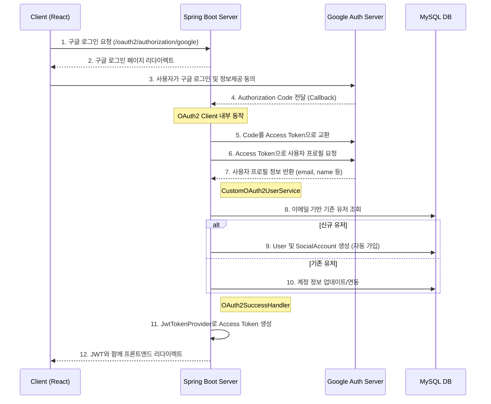

# Issue-15 — Google Social Login & Auto-signup Implementation

## 📌 Feature Description
구글 OAuth2를 이용한 소셜 로그인 기능을 구현하고, 최초 로그인 시 이메일 기반으로 자동으로 회원가입이 진행되는 프로세스를 구축함. 기존 JWT 인증 체계와 통합하여 로그인 완료 시 Access Token을 발급함.

## 🔄 Authentication Flow

## 📚 Tasks

### 1. 설정 및 인프라 (Setup)
- [x] **의존성 추가**: `smite-api/build.gradle`에 `spring-boot-starter-oauth2-client` 추가
- [x] **환경 설정**: `application-security.yml`로 OAuth2 설정 통합 및 `application.yml` 프로파일 정리
- [x] **보안**: `.gitignore`에 `application-security.yml` 등록하여 기밀 정보 유출 방지

### 2. 도메인 레이어 확장 (Core)
- [x] **UserRepository**: `findByEmail(String email)` 쿼리 메서드 추가
- [x] **도메인 서비스**: `UserAuthService`, `SocialAccountService` 구현하여 DB 접근 책임 일원화

### 3. 애플리케이션 로직 구현 (API)
- [x] **CustomOAuth2UserService**: 구글 프로필 기반 자동 가입 및 계정 연동 로직 구현 (Core 서비스 활용)
- [x] **OAuth2SuccessHandler**: 로그인 성공 시 JWT 발급 및 프론트엔드 리다이렉트 처리 (상수 활용)
- [x] **SecurityConfig**: OAuth2 로그인 활성화 및 신규 패키지 구조 반영하여 임포트 정리

### 4. 검증 (Verification)
- [x] **정적 검토**: SRP, DRY 원칙 준수 여부 및 Magic String 제거 확인
- [x] **아키텍처 확인**: Core 모듈을 통한 DB 접근 원칙 준수 확인

---

## 📝 Work Summary
- **의도**: 구글 소셜 로그인을 통해 유저 진입 장벽을 낮추고, 모든 DB 접근을 Core 모듈의 서비스로 캡슐화하여 아키텍처 일관성을 확보함.
- **결과**: 
  - 구글 로그인 -> 자동 회원가입 -> JWT 발급으로 이어지는 심리스한 인증 흐름 구축 완료.
  - 패키지 명칭(`response` -> `dto`) 정제 및 매직 스트링 제거로 코드 품질 향상.
- **검증**: 도메인 서비스(`UserAuthService` 등) 호출을 통한 데이터 처리 로직의 정상 동작 확인 및 Security Filter Chain 연동 완료.
