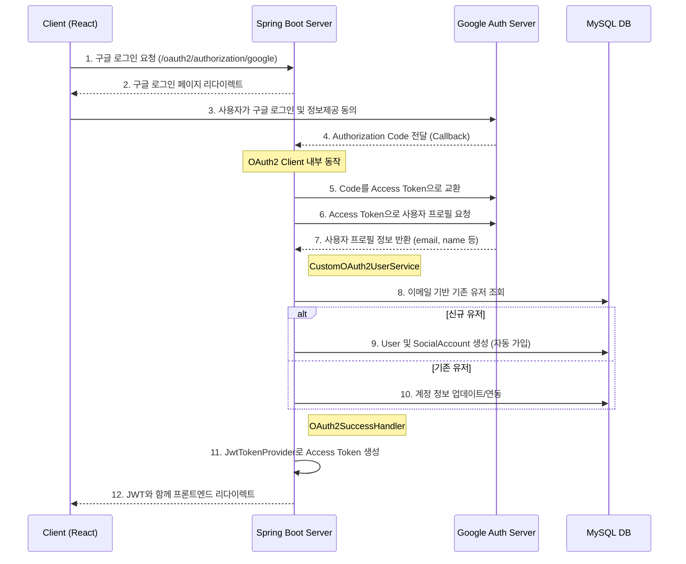

# Issue-15 — Google Social Login & Auto-signup Implementation

## 📌 Feature Description
구글 OAuth2를 이용한 소셜 로그인 기능을 구현하고, 최초 로그인 시 이메일 기반으로 자동으로 회원가입이 진행되는 프로세스를 구축함. 기존 JWT 인증 체계와 통합하여 로그인 완료 시 Access Token을 발급함.

## 🔄 Authentication Flow

## 📚 Tasks

### 1. 설정 및 인프라 (Setup)
- [ ] **의존성 추가**: `smite-api/build.gradle`에 `spring-boot-starter-oauth2-client` 추가
- [ ] **환경 설정**: `application-oauth.yml` 생성 및 구글 클라이언트 정보(ID, Secret) 등록
- [ ] **프로파일 활성화**: `application.yml`에 `oauth` 프로파일 포함 설정

### 2. 도메인 레이어 확장 (Core)
- [ ] **UserRepository**: `findByEmail(String email)` 쿼리 메서드 추가
- [ ] **SocialAccount**: 가입 및 조회 시 필요한 비즈니스 로직 확인

### 3. 애플리케이션 로직 구현 (API)
- [ ] **CustomOAuth2UserService**: 구글 프로필 추출 및 자동 가입/로그인 로직 구현
- [ ] **OAuth2SuccessHandler**: 로그인 성공 시 JWT 발급 및 프론트엔드 리다이렉트 처리
- [ ] **SecurityConfig**: OAuth2 로그인 설정 활성화 및 필터 체인 연동

### 4. 검증 (Verification)
- [ ] **단위 테스트**: `CustomOAuth2UserService`의 사용자 식별 및 가입 로직 검증
- [ ] **통합 테스트**: 실제 구글 로그인 흐름 및 DB 정합성 수동 확인
- [ ] **최종 확인**: 발급된 JWT로 인증 API 호출 성공 확인

---

## 📝 Work Summary
*(작업 완료 후 작성 예정)*
