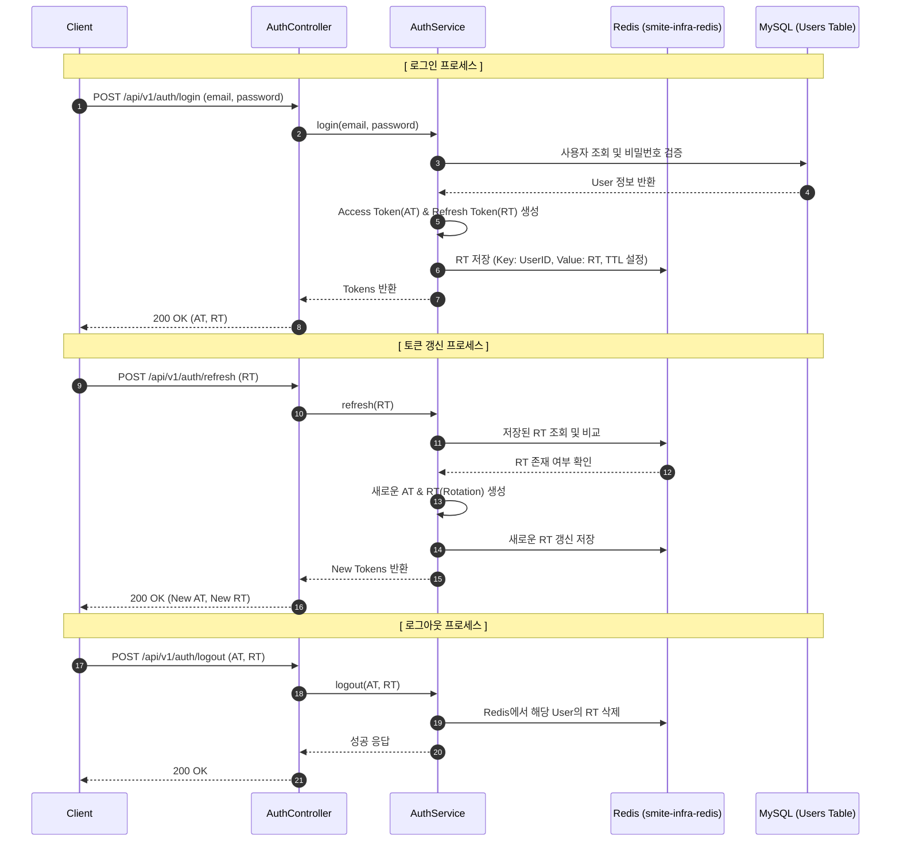

# Implement Login and Refresh Token Functionality

이 문서는 일반 로그인 및 리프레시 토큰 기능을 구현하기 위한 설계 및 작업 내용을 기록합니다.

---

## 1. 개요
기존의 회원가입 기능에 이어, 사용자가 이메일/비밀번호로 인증하고 JWT(Access & Refresh Token)를 발급받는 기능을 구현합니다. Redis를 연동하여 리프레시 토큰을 관리함으로써 보안성과 세션 유지 능력을 향상시킵니다.

## 2. 인증 흐름도 (Authentication Flow)

## 3. 계층별 작업 내역

### smite-api
- **Controller**: `AuthController`에 `/login`, `/refresh`, `/logout` 엔드포인트 추가.
- **Service**: `AuthService`에 로그인/갱신/로그아웃 비즈니스 로직 구현.
- **Security**: `JwtTokenProvider` 확장 (RT 발급 및 검증 로직 추가).
- **Common**: `ApiErrorCode` 추가 및 DTO(`LoginRequest`, `LoginResponse`, `TokenRefreshRequest`) 정의.

### smite-core
- **Domain**: (필요 시) `User` 엔티티와 연관된 추가 정보 조회 메서드 보완.
- **Service**: `UserReadService`의 사용자 조회 로직 활용.

### smite-infra-redis
- **Infrastructure**: 리프레시 토큰 저장을 위한 Redis 연동 로직 (Repository 또는 Template) 확인 및 적용.

## 4. 보안 고려사항
- **RT Rotation**: 토큰 갱신 시 기존 RT를 무효화하고 새로운 RT를 발급하여 탈취 위험 최소화.
- **Stateless**: 서버 메모리를 사용하지 않고 Redis를 활용하여 수평 확장성 유지.
- **Error Handling**: 로그인 실패 시 구체적인 실패 원인(아이디/비밀번호)을 노출하지 않음.

---

## 🏗 진행 상황 (Progress)

### 2026-04-24: 기반 작업, DTO 정의 및 비즈니스 로직 구현 완료
- `ApiErrorCode` 에러 코드 추가 (`AUTH_LOGIN_FAILED`, `AUTH_INVALID_REFRESH_TOKEN` 등)
- `JwtTokenProvider` 확장: 리프레시 토큰 생성 메서드 및 만료 시간 설정 추가
- `smite-infra-redis` 모듈 내 `RefreshToken` 엔티티 및 Repository 구현
- 로그인 및 토큰 갱신을 위한 요청/응답 DTO(`LoginRequest`, `LoginResponse` 등) 정의 완료
- `AuthService` 내 로그인, 토큰 갱신(Rotation), 로그아웃 핵심 비즈니스 로직 구현 완료

## 5. 향후 계획
- 로그아웃 시 Access Token 블랙리스트 기능 추가 검토.
- 중복 로그인 제한 정책 수립 및 구현.
