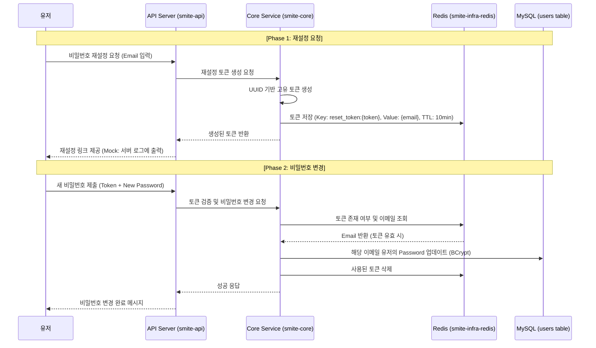

# Issue-20: Implement Password Reset Feature

---

## 1. 개요 (Overview)
- **English**: Implement a password reset system using temporary tokens stored in Redis.
- **Korean**: Redis에 저장된 임시 토큰을 활용한 비밀번호 재설정 기능을 구현합니다. 이메일 인증 절차를 대신하여 비밀번호를 분실한 유저에게 보안 링크를 제공합니다.

---

## 2. 프로세스 흐름 (Process Flow)

---

## 3. 상세 정책 (Detailed Policy)

| 항목 | 내용 |
|------|------|
| **토큰 만료 시간** | 10분 (Redis TTL 설정) |
| **토큰 형식** | UUID (예측 불가능성 확보) |
| **이메일 발송** | 실제 발송 엔진 연동 전까지 **서버 로그 출력**으로 대체 |
| **비밀번호 저장** | 반드시 **BCrypt**로 해싱하여 저장 |
| **토큰 재사용** | 비밀번호 변경 성공 시 토큰 즉시 폐기 (1회용) |

---

## 4. 작업 목록 (Tasks)

### 4.1 Backend (smite-core & smite-infra-redis)
- [x] **Redis 전용 Repository 구현**: 재설정 토큰 저장 및 조회 로직.
- [x] **PasswordResetService 구현**:
    - `sendResetLink`: 토큰 생성 및 로그 출력.
    - `resetPassword`: 토큰 검증 및 비밀번호 업데이트.
- [x] **User 엔티티 업데이트**: 비밀번호 변경을 위한 도메인 메서드 추가.

### 4.2 Backend (smite-api)
- [ ] **DTO 생성**: `PasswordResetRequest`, `PasswordResetSubmit` 구현.
- [ ] **Controller 구현**:
    - `POST /api/v1/auth/password/reset-request`
    - `POST /api/v1/auth/password/reset-submit`
- [ ] **예외 처리**: 만료된 토큰, 존재하지 않는 유저 등에 대한 에러 핸들링.

### 4.3 Test
- [ ] 토큰 생성 및 만료 시간 검증 테스트.
- [ ] 비밀번호 업데이트 성공 및 실패(토큰 불일치) 테스트.
