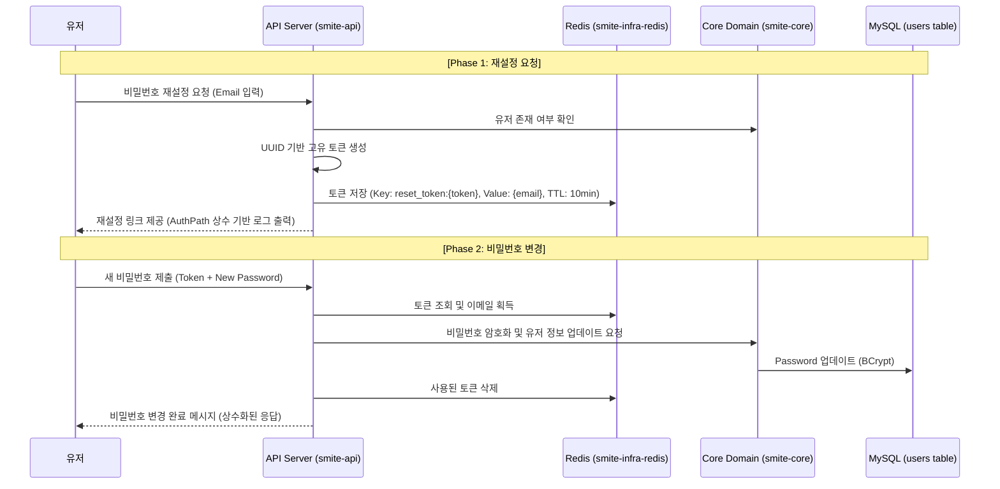

# Issue-20: Implement Password Reset Feature

---

## 1. 개요 (Overview)
- **English**: Implement a password reset system using temporary tokens stored in Redis.
- **Korean**: Redis에 저장된 임시 토큰을 활용한 비밀번호 재설정 기능을 구현합니다. 이메일 인증 절차를 대신하여 비밀번호를 분실한 유저에게 보안 링크를 제공합니다.

---

## 2. 프로세스 흐름 (Process Flow)

---

## 3. 상세 정책 (Detailed Policy)

| 항목 | 내용 |
|------|------|
| **토큰 만료 시간** | 10분 (Redis TTL 설정) |
| **토큰 형식** | UUID (예측 불가능성 확보) |
| **이메일 발송** | 실제 발송 엔진 연동 전까지 **서버 로그 출력**으로 대체 |
| **비밀번호 저장** | **smite-api**에서 Spring Security `PasswordEncoder`로 암호화 후 전달 |
| **토큰 재사용** | 비밀번호 변경 성공 시 토큰 즉시 폐기 (1회용) |

---

## 4. 작업 목록 (Tasks)

### 4.1 Infrastructure & Core (smite-core & smite-infra-redis)
- [x] **Redis 전용 Repository 구현**: `PasswordResetTokenRepository`.
- [x] **도메인 추상화**: `PasswordResetStore` 인터페이스 정의.
- [x] **User 엔티티 업데이트**: `updatePassword` 도메인 메서드 추가.

### 4.2 Backend Application (smite-api)
- [x] **API 경로 상수화**: `AuthPath`에 비밀번호 재설정 경로 추가.
- [x] **PasswordResetService 구현**: API 모듈에서 암호화 및 Redis/DB 오케스트레이션 수행.
- [x] **Controller 구현**: `AuthPasswordController` (RestAssuredMockMvc 기반).

### 4.3 Test (계층별 검증)
- [x] **Controller Test**: `RestAssuredMockMvc`를 활용한 API 동작 검증.
- [x] **Service Test**: `Mockito` 기반의 비즈니스 로직 단위 테스트.
- [x] **Repository Test**: `AbstractRedisRepositoryTest`를 상속받은 Redis 데이터 검증 테스트.

### 4.4 Documentation
- [x] **RestDocs 업데이트**: 테스트 코드를 기반으로 API 명세서 스니펫 생성.
- [x] **이슈 문서 최신화**: 구현 완료 사항 및 테스트 전략 반영.
