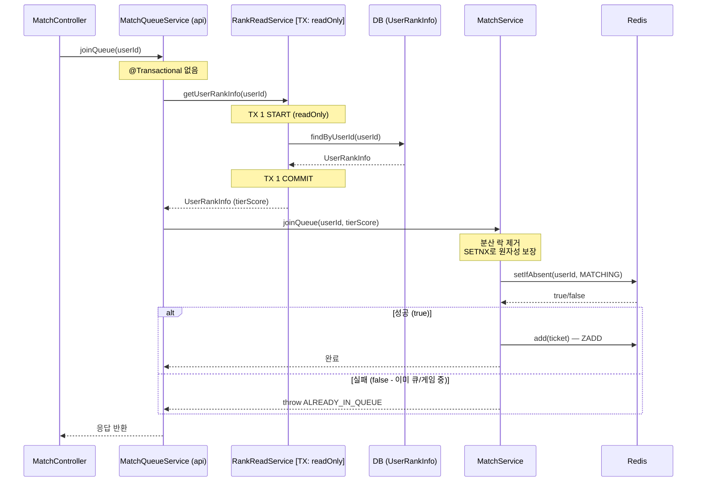

# Issue-24: Match Queue Join/Leave API

## 📌 Feature Description

유저가 매칭 대기열에 **진입**하고 **취소**하는 API를 구현합니다.
Redis로 유저의 현재 매칭 상태를 관리하여 중복 진입을 방지하고,
대기열 진입/취소의 비즈니스 로직을 `MatchService`로 캡슐화합니다.

---

## 📚 Tasks

### 1. 유저 매칭 상태 관리 (smite-matching)

- [x] **`MatchUserStatusStore` 인터페이스 정의** (`matching/repository/`)
    - `setStatusIfAbsent(Long userId, MatchStatus status, long ttlSeconds): boolean`: SETNX — 원자적 상태 저장, 이미 존재하면 false
    - `getStatus(Long userId)`: 현재 상태 조회
    - `removeStatus(Long userId)`: 상태 초기화

- [x] **`RedisMatchUserStatusStore` 구현체** (`matching/infrastructure/`)
    - Key: `match:status:{userId}` (String)
    - TTL: 30분 (무한 대기 방지 — 서버 장애 시 자동 만료)
    - 구현 기술: `RedissonClient.getBucket().setIfAbsent()` (SETNX 보장)

### 2. MatchService 구현 (smite-matching)

- [x] **`MatchService` 클래스** (`matching/service/`)
    - `joinQueue(Long userId, int tierScore)`: 대기열 진입
        1. `setStatusIfAbsent(MATCHING)` 원자적 호출 → false이면 `ALREADY_IN_QUEUE` 예외
        2. `MatchStore.add(ticket)` 호출 (실패 시 `removeStatus` 롤백 후 `MATCH_QUEUE_ADD_ERROR`)
    - `leaveQueue(Long userId, int tierScore)`: 대기열 취소
        1. 현재 상태가 `MATCHING`이 아니면 `NOT_IN_QUEUE` 예외
        2. `MatchStore.remove(userId, tierScore)` 호출 → **반환값(boolean) 확인**
        3. 제거 성공(true) 시에만 `removeStatus` 호출 (매칭 엔진 선점 경합 방어)
        4. 제거 실패(false) — 엔진이 이미 꺼내간 경우 → `NOT_IN_QUEUE` 예외

### 3. 에러 코드 추가 (smite-matching)

- [x] **`MatchingErrorCode` 추가**
    - `ALREADY_IN_QUEUE` (409): 이미 매칭 대기열에 있는 유저 — SETNX 실패
    - `NOT_IN_QUEUE` (400): 대기열에 없는 유저가 취소 시도 / 엔진이 이미 선점한 경우
    - `MATCH_QUEUE_ADD_ERROR` (500): Redis ZADD 중 오류 발생 (롤백 수행)

### 4. API 엔드포인트 (smite-api)

- [x] **`MatchController`** (`api/match/controller/`)
    - `POST /api/v1/match/join`: 매칭 대기열 진입
        - 인증 필요 (JWT)
        - 요청: 없음 (유저 티어 정보는 서버에서 조회)
        - 응답: `200 OK` / `409 CONFLICT` (이미 대기 중)
    - `DELETE /api/v1/match/leave`: 매칭 대기열 취소
        - 인증 필요 (JWT)
        - 응답: `200 OK` / `400 BAD_REQUEST` (대기 중 아닐 때)

- [x] **`MatchFacade` 또는 `MatchController` 내에서 티어 조회 처리**
    - 현재 인증 유저의 `UserRankInfo`에서 `tierScore` 계산
    - `Rank.getTierScore()` 공식 사용 (`smite-core` 참조)

### 5. 테스트

- [x] **`MatchServiceTest`** (단위 테스트, Mock 사용)
    - 정상 진입: SETNX 성공 → 대기열 추가 확인
    - 중복 진입: SETNX 실패(false) → `ALREADY_IN_QUEUE` 예외 확인
    - 정상 취소: getStatus → remove(true) → removeStatus 호출 확인
    - 비대기 취소: `MATCHING`이 아닌 상태에서 취소 시 `NOT_IN_QUEUE` 예외 확인
    - 엔진 선점 취소: remove(false) 반환 시 `NOT_IN_QUEUE` 예외 확인 (정합성 보장)

- [x] **`RedisMatchUserStatusStoreTest`** (통합 테스트, Testcontainers)
    - SETNX 저장 및 조회 정합성 확인
    - 이미 상태 존재 시 false 반환 및 기존 상태 유지 확인
    - 상태 삭제 확인
    - TTL 만료 후 상태가 사라지는지 확인

- [x] **`MatchQueueServiceTest`** (단위 테스트, Mock 사용)
    - 랭크 조회 후 joinQueue 위임 확인
    - 랭크 없는 유저 진입 시 `RANK_NOT_FOUND` 예외 전파 확인
    - 랭크 조회 후 leaveQueue 위임 확인

- [x] **`MatchControllerRestDocsTest`** (RestAssuredMockMvc 기반 RestDocs)
    - `POST /api/v1/match/join` 문서 생성 (`match-join`)
    - `DELETE /api/v1/match/leave` 문서 생성 (`match-leave`)

---

## 📝 Note

### 트랜잭션 전파 범위 및 동시성 제어 분석



### 트랜잭션 경계 요약

| 레이어 | 클래스 | TX 전파 | 비고 |
|--------|--------|---------|------|
| api | `MatchQueueService` | 없음 | TX 없이 진입 |
| core | `RankReadService` | `REQUIRED` | DB 조회 전용 (readOnly) |
| matching | `MatchService` | 없음 | Redis 연산만 수행 |

### 분산 락(Distributed Lock) 대신 SETNX(setIfAbsent) 사용
기존에는 상태 체크(check) 후 ZADD 추가(act) 사이에 발생할 수 있는 동시성 문제를 막기 위해 Redisson 기반 `@DistributedLock`을 사용했습니다.
하지만 `RedisMatchUserStatusStore.setStatusIfAbsent()` (내부적으로 `SETNX` 활용) 기능을 도입하여 **분산 락 없이 원자성을 보장**하도록 개선했습니다.

**이점:**
1. 락 획득/해제를 위한 추가적인 Redis 네트워크 I/O 감소
2. 불필요하게 `REQUIRES_NEW` JPA 트랜잭션 커넥션을 여는 `AopForTransaction` 오버헤드 완벽 제거 (DB를 사용하지 않는 로직에 최적화)

### 유저 티어 조회 흐름

```
MatchController (@AuthUser → userId 추출)
    ↓
MatchQueueService.joinQueue(userId)
    ↓ [TX 1: readOnly]
RankReadService.getUserRankInfo(userId) → tierScore
    ↓ [No TX, No Lock]
MatchService.joinQueue(userId, tierScore)
    ↓
SETNX 성공 시 Redis 대기열 추가
```

### MatchUserStatusStore를 별도 인터페이스로 분리하는 이유
- `MatchStore`(대기열 조작)와 `MatchUserStatusStore`(유저 상태 조작)는 역할이 다름
- 향후 `MatchEngine`이 상태를 읽을 때도 동일한 인터페이스를 재사용 가능

### 다음 이슈로 이관
- `MatchEngine` 구현 (백그라운드 스케줄러, 슬라이딩 윈도우 알고리즘)
- `MatchFoundEvent` 발행

---

## 📌 Related Issue
- Closes #24

---

## 📌 Summary

매칭 대기열 진입/취소 API를 구현하고, 초기 설계 대비 동시성 제어 방식을 전면 개선했습니다.
기존 `@DistributedLock(Redisson)` 방식 대신 Redis `SETNX(setIfAbsent)`를 도입하여 불필요한 락 오버헤드를 제거하고, `leaveQueue` 에서의 매칭 엔진 선점 경합 문제도 추가로 방어했습니다.

---

## 📚 Changes

### smite-matching 모듈

| 파일 | 변경 내용 |
|------|----------|
| `MatchUserStatusStore` | 인터페이스 정의. `setStatusIfAbsent`(SETNX), `getStatus`, `removeStatus` |
| `RedisMatchUserStatusStore` | Redisson `RBucket.setIfAbsent()` 기반 구현. TTL 30분 적용 |
| `MatchStore` | `remove()` 반환 타입 `void → boolean` 으로 변경 (삭제 성공 여부 반환) |
| `RedisMatchStore` | `remove()` 반환값 `queue.remove(userId)` 그대로 반환 |
| `MatchService` | `joinQueue`: SETNX 원자적 시도 → 성공 시 ZADD, 실패 시 상태 롤백 후 예외 |
| `MatchService` | `leaveQueue`: ZSET remove 반환값으로 엔진 선점 여부 판단 → 조건부 `removeStatus` |
| `MatchingErrorCode` | `ALREADY_IN_QUEUE`(409), `NOT_IN_QUEUE`(400), `MATCH_QUEUE_ADD_ERROR`(500) 추가 |
| `MatchingException` | `cause` 파라미터 생성자 추가 (예외 체이닝 지원) |

### smite-core 모듈

| 파일 | 변경 내용 |
|------|----------|
| `BaseException` | `Throwable cause` 파라미터 생성자 추가 (예외 체이닝 공통화) |
| `RankReadService` | CQRS 패턴에 맞춰 `RankQueryService` → `RankReadService`로 네이밍 변경 |
| `CoreErrorCode` | `RANK_NOT_FOUND` 추가 |

### smite-api 모듈

| 파일 | 변경 내용 |
|------|----------|
| `MatchController` | `POST /api/v1/match/join`, `DELETE /api/v1/match/leave` 구현. `@AuthUser` 리졸버 사용 |
| `MatchQueueService` | `RankReadService`로 tierScore 조회 후 `MatchService`에 위임 |

### 테스트

| 파일 | 변경 내용 |
|------|----------|
| `MatchServiceTest` | 단위 테스트 5케이스 (정상 진입/중복 진입/정상 취소/비대기 취소/엔진 선점 취소) |
| `RedisMatchUserStatusStoreTest` | 통합 테스트 5케이스 (SETNX 정합성, 중복 무시, 삭제, TTL) |
| `MatchQueueServiceTest` | 단위 테스트 3케이스 (joinQueue 위임, RANK_NOT_FOUND 전파, leaveQueue 위임) |
| `MatchControllerRestDocsTest` | RestAssuredMockMvc 기반 RestDocs 문서 생성 (`match-join`, `match-leave`) |
| `RestDocsSupport` | `customArgumentResolvers()` 훅 추가 (`@AuthUser` 리졸버 주입 지원) |

---

## 📝 Note

### 분산 락(Distributed Lock) 대신 SETNX를 선택한 이유

초기 설계에서는 `joinQueue`의 `check-then-act` 패턴 (상태 조회 → 대기열 추가 → 상태 변경)에서 동시에 두 요청이 들어올 경우 중복 진입이 발생할 수 있는 Race Condition이 있었습니다.
이를 막기 위해 `@DistributedLock`을 도입했지만, 이 방식은 다음과 같은 문제를 가지고 있었습니다.

**분산 락 방식의 문제점:**
1. **락 획득/해제를 위한 추가 Redis I/O** — `SETNX`, `GET`, `DEL` 최소 2~3 round-trip 발생
2. **불필요한 JPA 트랜잭션 오버헤드** — `AopForTransaction`이 `REQUIRES_NEW` JPA 커넥션을 열지만, `MatchService`는 DB를 전혀 사용하지 않아 커넥션이 낭비됨
3. **락 타임아웃 관리 복잡성** — 락 TTL 설정이 잘못되면 데드락 또는 조기 해제 위험

**SETNX(setIfAbsent) 방식의 장점:**
- `setStatusIfAbsent(MATCHING)` 한 번의 원자적 명령으로 **상태 체크 + 설정을 동시에** 처리
- 성공(true) = 내가 먼저 상태를 점유한 것 → 대기열 추가 진행
- 실패(false) = 이미 다른 요청이 상태를 점유한 것 → 즉시 `ALREADY_IN_QUEUE` 예외
- Redis 단일 명령 보장으로 외부 락 없이도 동시성 안전

### leaveQueue 정합성 보강 — 엔진 선점 경합 방어

`getStatus(MATCHING 확인)` 후, 극히 짧은 순간에 매칭 엔진이 해당 유저를 ZSET에서 꺼내 매칭을 성사시킬 수 있습니다.
이 상태에서 `removeStatus()`를 무조건 호출하면 매칭 결과 상태까지 지워버리는 치명적 버그가 발생합니다.

이를 방어하기 위해 `MatchStore.remove()` 반환값(`boolean`)을 활용합니다.
- `true` = 내가 ZSET에서 직접 제거 성공 → `removeStatus()` 호출하여 상태 정리
- `false` = 이미 엔진이 ZSET에서 꺼내간 상태 → `removeStatus()` 호출 금지, `NOT_IN_QUEUE` 예외
