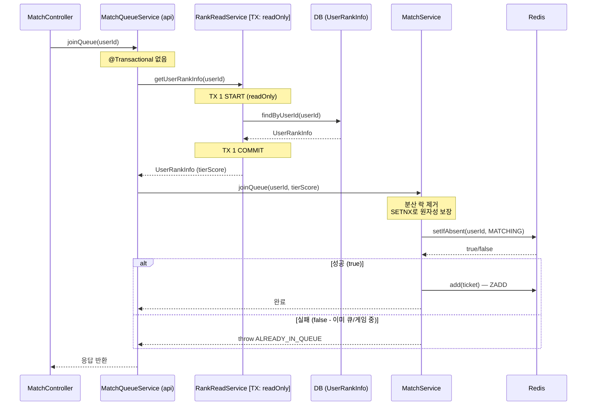

# Issue-24: Match Queue Join/Leave API

## 📌 Feature Description

유저가 매칭 대기열에 **진입**하고 **취소**하는 API를 구현합니다.
Redis로 유저의 현재 매칭 상태를 관리하여 중복 진입을 방지하고,
대기열 진입/취소의 비즈니스 로직을 `MatchService`로 캡슐화합니다.

---

## 📚 Tasks

### 1. 유저 매칭 상태 관리 (smite-matching)

- [x] **`MatchUserStatusStore` 인터페이스 정의** (`matching/repository/`)
    - `setStatus(Long userId, MatchStatus status, long ttlSeconds)`: 상태 저장
    - `getStatus(Long userId)`: 현재 상태 조회
    - `removeStatus(Long userId)`: 상태 초기화

- [x] **`RedisMatchUserStatusStore` 구현체** (`matching/infrastructure/`)
    - Key: `match:status:{userId}` (String)
    - TTL: 30분 (무한 대기 방지 — 서버 장애 시 자동 만료)
    - 구현 기술: `StringRedisTemplate` 또는 `RedissonClient`

### 2. MatchService 구현 (smite-matching)

- [x] **`MatchService` 클래스** (`matching/service/`)
    - `joinQueue(Long userId, int tierScore)`: 대기열 진입
        1. 현재 상태 조회 → `MATCHING` / `IN_GAME`이면 예외 발생
        2. `MatchStore.add(ticket)` 호출
        3. 상태를 `MATCHING`으로 변경
    - `leaveQueue(Long userId, int tierScore)`: 대기열 취소
        1. 현재 상태가 `MATCHING`이 아니면 예외 발생
        2. `MatchStore.remove(userId, tierScore)` 호출
        3. 상태 초기화(`removeStatus`)

### 3. 에러 코드 추가 (smite-matching)

- [x] **`MatchingErrorCode` 추가**
    - `ALREADY_IN_QUEUE`: 이미 매칭 대기열에 있는 유저
    - `NOT_IN_QUEUE`: 대기열에 없는 유저가 취소 시도

### 4. API 엔드포인트 (smite-api)

- [x] **`MatchController`** (`api/match/controller/`)
    - `POST /api/v1/match/join`: 매칭 대기열 진입
        - 인증 필요 (JWT)
        - 요청: 없음 (유저 티어 정보는 서버에서 조회)
        - 응답: `200 OK` / `409 CONFLICT` (이미 대기 중)
    - `DELETE /api/v1/match/leave`: 매칭 대기열 취소
        - 인증 필요 (JWT)
        - 응답: `200 OK` / `400 BAD_REQUEST` (대기 중 아닐 때)

- [x] **`MatchFacade` 또는 `MatchController` 내에서 티어 조회 처리**
    - 현재 인증 유저의 `UserRankInfo`에서 `tierScore` 계산
    - `Rank.getTierScore()` 공식 사용 (`smite-core` 참조)

### 5. 테스트

- [x] **`MatchServiceTest`** (단위 테스트, Mock 사용)
    - 정상 진입: `MATCHING` 상태 설정 + 대기열 추가 확인
    - 중복 진입: 이미 `MATCHING` 상태면 예외 확인
    - 정상 취소: 상태 초기화 + 대기열 제거 확인
    - 비대기 취소: `MATCHING`이 아닌 상태에서 취소 시 예외 확인

- [x] **`RedisMatchUserStatusStoreTest`** (통합 테스트, Testcontainers)
    - 상태 저장/조회/삭제 정합성 확인
    - TTL 만료 후 상태가 사라지는지 확인

---

## 📝 Note

### 트랜잭션 전파 범위 및 동시성 제어 분석



### 트랜잭션 경계 요약

| 레이어 | 클래스 | TX 전파 | 비고 |
|--------|--------|---------|------|
| api | `MatchQueueService` | 없음 | TX 없이 진입 |
| core | `RankReadService` | `REQUIRED` | DB 조회 전용 (readOnly) |
| matching | `MatchService` | 없음 | Redis 연산만 수행 |

### 분산 락(Distributed Lock) 대신 SETNX(setIfAbsent) 사용
기존에는 상태 체크(check) 후 ZADD 추가(act) 사이에 발생할 수 있는 동시성 문제를 막기 위해 Redisson 기반 `@DistributedLock`을 사용했습니다.
하지만 `RedisMatchUserStatusStore.setStatusIfAbsent()` (내부적으로 `SETNX` 활용) 기능을 도입하여 **분산 락 없이 원자성을 보장**하도록 개선했습니다.

**이점:**
1. 락 획득/해제를 위한 추가적인 Redis 네트워크 I/O 감소
2. 불필요하게 `REQUIRES_NEW` JPA 트랜잭션 커넥션을 여는 `AopForTransaction` 오버헤드 완벽 제거 (DB를 사용하지 않는 로직에 최적화)

### 유저 티어 조회 흐름

```
MatchController (@AuthUser → userId 추출)
    ↓
MatchQueueService.joinQueue(userId)
    ↓ [TX 1: readOnly]
RankReadService.getUserRankInfo(userId) → tierScore
    ↓ [No TX, No Lock]
MatchService.joinQueue(userId, tierScore)
    ↓
SETNX 성공 시 Redis 대기열 추가
```

### MatchUserStatusStore를 별도 인터페이스로 분리하는 이유
- `MatchStore`(대기열 조작)와 `MatchUserStatusStore`(유저 상태 조작)는 역할이 다름
- 향후 `MatchEngine`이 상태를 읽을 때도 동일한 인터페이스를 재사용 가능

### 다음 이슈로 이관
- `MatchEngine` 구현 (백그라운드 스케줄러, 슬라이딩 윈도우 알고리즘)
- `MatchFoundEvent` 발행

---

## 📌 Related Issue
- Closes #24
