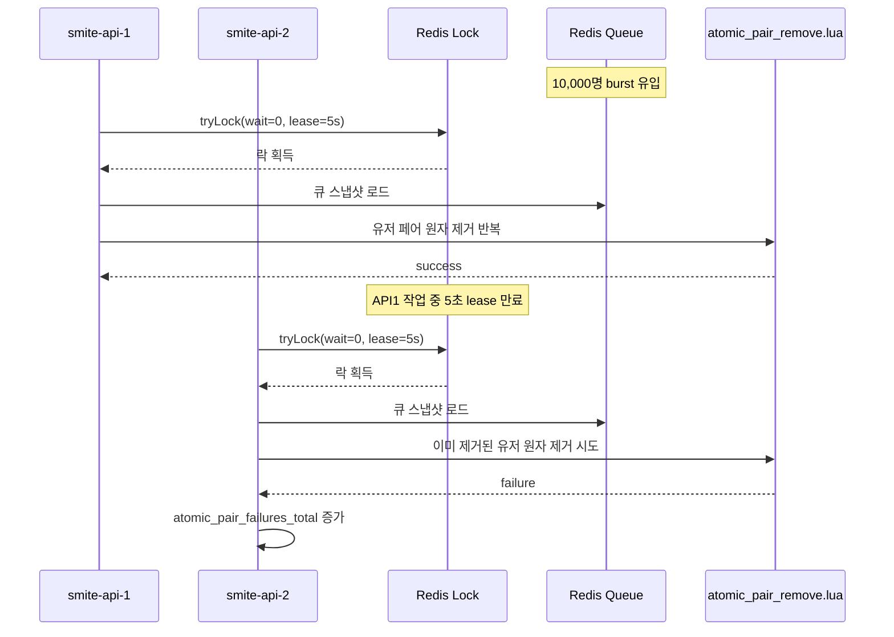

# Issue-26: 매칭 엔진 구현 (Match Engine - V1)

## 📌 Feature Description

Redis ZSET 대기열에 진입한 유저들을 주기적으로 스캔하여 조건에 맞는 두 명을 매칭시키는 매칭 엔진(Worker)을 구현합니다.
V1 스펙(`matching-v1.md`)에 따라, **모든 티어의 대기열을 인메모리로 일괄 로드하여 가장 오래 대기한 유저부터 매칭을 시도하는 FIFO 기반의 통합 매칭**을 수행합니다. 대기 시간에 따라 매칭 허용 티어 범위를 점진적으로 넓히는 슬라이딩 윈도우(Sliding Window) 정책을 적용합니다.

유저의 자진 취소(leaveQueue)와 엔진의 선점 간 동시성 충돌을 방지하기 위해 `atomic_pair_remove.lua` 스크립트를 활용하여 원자적으로 큐에서 유저를 추출합니다.

---

## 📌 Summary

매칭 V1은 `joinQueue` 요청이 들어올 때마다 즉시 매칭 엔진을 실행하는 순수 이벤트 기반 방식이 아니라, Redis 대기열을 주기적으로 스캔하는 배치형 매칭 엔진으로 구현했습니다.

이벤트 기반으로도 FIFO 정렬은 구현할 수 있습니다. 유저가 들어올 때마다 엔진을 실행하고, 그때마다 전체 큐를 `entryTime` 기준으로 정렬하면 오래 기다린 유저부터 처리할 수 있습니다. 하지만 burst 상황에서는 이벤트 수만큼 엔진 실행 요청이 생긴다는 문제가 있습니다.

예를 들어 10,000명이 짧은 시간에 `joinQueue`를 호출하면 엔진 실행 요청도 10,000번 발생할 수 있습니다. 실제로는 전역 락 때문에 한 번에 하나의 엔진만 실행되지만, 나머지 요청은 Redis 락 시도 후 스킵되거나, 락이 풀린 뒤 이미 비어 있는 큐를 다시 확인하는 낭비로 이어질 수 있습니다.

또한 순수 이벤트 기반에서 `tryLock` 실패를 그냥 버리면 다음과 같은 지연 시나리오가 생길 수 있습니다.

```text
1. 5,001번째 joinQueue 이벤트가 엔진을 실행하고 락을 획득한다.
2. 엔진은 그 시점의 큐 스냅샷을 로드하고 매칭을 시작한다.
3. 그 사이 5,002~10,000번째 유저가 큐에 들어온다.
4. 이 유저들의 이벤트도 엔진 실행을 시도하지만, 이미 락이 잡혀 있어 스킵된다.
5. 첫 번째 엔진이 끝난 뒤 새 이벤트가 없으면, 남은 큐 처리가 다음 트리거까지 밀릴 수 있다.
```

따라서 V1에서는 실행 횟수를 예측 가능하게 만들기 위해 배치형 엔진을 선택했습니다. 배치 엔진은 정해진 주기마다 큐를 보고, 한 번 락을 잡은 엔진이 현재 큐를 통합 처리합니다. 이 구조는 이벤트 요청 폭주와 매칭 엔진 실행 폭주를 분리할 수 있어, 부하 테스트에서 원인을 해석하기 쉽습니다.

멀티 API 인스턴스 환경에서는 여러 매칭 엔진이 동시에 같은 Redis 대기열을 스캔할 수 있으므로, 엔진 실행 구간에 전역 분산 락을 적용했습니다. 락은 전체 스캔 중복과 중복 매칭 시도를 줄이기 위한 장치이며, 실제 유저 제거의 최종 정합성은 Redis Lua 스크립트 기반 원자 삭제가 보장합니다.

락은 처음에 고정 `leaseTime=5s`로 사용했지만, 10,000명 burst 테스트에서 한 번의 스캔이 5초를 넘으면 락이 작업 중 만료될 수 있음을 확인했습니다. 이 경우 두 번째 인스턴스가 같은 큐를 다시 스캔하고, 이미 제거된 유저를 다시 제거하려 하면서 원자 제거 실패율이 거의 100%까지 증가했습니다. 이를 해결하기 위해 고정 lease time을 제거하고 Redisson watchdog 방식으로 변경했습니다.

## 📚 Changes

- `smite-matching` 모듈에 스케줄러 기반 `MatchEngine`을 추가했습니다.
  - `@Scheduled` 기반으로 일정 주기마다 매칭 사이클을 실행합니다.
  - 전용 `ThreadPoolTaskScheduler`를 사용해 일반 스케줄 작업과 분리했습니다.

- 매칭 엔진 실행을 `MatchEngine`, `MatchEngineService`, `MatchFoundService`로 분리했습니다.
  - `MatchEngine`: 스케줄 트리거와 전역 분산 락 획득/해제 담당
  - `MatchEngineService`: 대기열 로드, FIFO 정렬, 후보 탐색, 원자 삭제 시도 담당
  - `MatchFoundService`: 매칭 성사 후 상태 변경, 세션 생성, 이벤트 발행 담당

- Redis 대기열은 티어별 ZSET으로 구성했습니다.
  - Key: `matching:queue:{tierScore}`
  - Score: 대기열 진입 시각
  - Member: 유저 식별자
  - 엔진은 1~28 티어 대기열을 파이프라이닝으로 일괄 조회한 뒤 하나의 리스트로 병합합니다.

- FIFO 기반 통합 매칭을 적용했습니다.
  - 병합된 티켓 목록을 `entryTime` 오름차순으로 정렬합니다.
  - 가장 오래 대기한 유저를 기준으로 먼저 매칭 후보를 찾습니다.
  - 이미 같은 스캔에서 매칭된 유저는 다시 후보가 되지 않도록 제외합니다.

- 대기 시간 기반 슬라이딩 윈도우 정책을 적용했습니다.
  - 0~10초: ±1 티어
  - 11~20초: ±2 티어
  - 21~30초: ±4 티어
  - 31초 이상: ±8 티어
  - 오래 기다릴수록 허용 티어 범위를 넓혀 큐 정체를 줄입니다.

- Redis Lua 스크립트로 두 유저를 원자적으로 제거합니다.
  - 후보 페어가 발견되면 `atomicPairRemove`를 호출합니다.
  - 두 유저가 각각의 티어 ZSET에 모두 존재할 때만 동시에 제거합니다.
  - 한 명이라도 이미 `leaveQueue`, 만료, 다른 엔진 처리 등으로 대기열에 없으면 제거하지 않고 실패로 반환합니다.
  - 실패한 페어는 매칭 성사로 처리하지 않고 다음 후보 탐색으로 넘어갑니다.

- 멀티 인스턴스 중복 스캔 방지를 위해 Redisson 전역 락을 적용했습니다.
  - Lock Key: `lock:match:engine`
  - WaitTime 0초로 설정해 다른 인스턴스가 스캔 중이면 즉시 스킵합니다.
  - 고정 LeaseTime은 사용하지 않고 Redisson watchdog 방식으로 락을 유지합니다.
  - burst처럼 큐가 크게 쌓여 스캔 시간이 길어지는 상황에서도 작업 중 lease 만료로 다른 인스턴스가 중복 스캔하지 않도록 했습니다.
  - `@DistributedLock` AOP 대신 `RLock.tryLock()`을 직접 사용했습니다. 매칭 엔진은 HTTP 요청 흐름이 아니라 Redis-only 배치 작업이므로, 락 획득 실패와 스킵 지표를 엔진 로직에서 명시적으로 다루는 편이 더 적합합니다.

- 매칭 성사 후 처리 흐름을 추가했습니다.
  - 두 유저 상태를 `MATCHING`에서 `FOUND`로 변경합니다.
  - `match:session:{matchId}` Redis Hash를 생성합니다.
  - 클라이언트 수락 모달 기준 시간은 10초로 유지하고, Redis TTL은 cleanup 실패 대비 안전장치로 60분 설정했습니다.
  - 응답 제한 시간은 timeout index의 deadline 기준으로 판단하고, Redis 세션 TTL은 cleanup 실패 대비 안전장치로만 사용합니다.
  - `MatchFoundEvent`를 발행해 SSE 알림 등 후속 처리를 느슨하게 연결할 수 있게 했습니다.

- 후처리 실패 정책은 V1에서 에러 로그 기록으로 제한했습니다.
  - `atomicPairRemove` 성공 후 상태 변경, 세션 저장, 이벤트 발행 중 예외가 발생하면 대상 유저 ID와 함께 에러 로그를 남깁니다.
  - Redis 상태/세션 생성의 완전한 원자화, 이벤트 재시도, 보상 처리는 후속 이슈에서 다룹니다.

- 매칭 개선 효과를 비교하기 위한 메트릭과 Grafana 대시보드를 추가했습니다.
  - 스캔 소요 시간
  - 스캔당 로드 티켓 수
  - 초당 매칭 성사 수
  - 스캔당 성사 페어 수
  - 원자 제거 시도/실패 수
  - 매칭 성공 유저 대기 시간
  - 락 스킵 수
  - 티어별/전체 대기 인원
  - `joinQueue` 요청 수, 응답 시간, 에러율

## 📝 Note

- 이벤트 기반 매칭은 `joinQueue` 요청 직후 빠르게 반응할 수 있습니다. 다만 순수 이벤트 기반으로 `joinQueue`마다 엔진을 실행하면 burst 상황에서 의미 없는 락 시도와 스킵이 대량 발생할 수 있습니다. V1에서는 안정성과 관측 가능성을 우선해 배치형 엔진을 선택했습니다.

- 이벤트 기반과 배치 기반은 완전히 반대되는 선택지가 아닙니다. V2에서는 `joinQueue` 이벤트를 엔진 직접 실행이 아니라 `wake-up` 신호로 사용하고, 실제 엔진은 락과 pending flag를 통해 한 번만 실행되게 만드는 하이브리드 구조를 검토합니다.

- 분산 락은 중복 스캔을 줄이기 위한 실행 제어 장치이고, 최종 정합성 보장은 Redis Lua 원자 삭제가 담당합니다. 따라서 락이 있더라도 대기열에서 사라진 유저는 매칭 성공으로 처리하지 않습니다.

- 현재 Redis 대기열은 티어별 ZSET으로 나뉘어 있지만, 엔진은 모든 티어를 통합 로드한 뒤 정렬합니다. 이 구조는 V1에서 구현이 단순하고 정책 검증이 쉬운 장점이 있으나, 대기열 규모가 커질수록 전체 스캔 비용이 증가할 수 있습니다.

- 10,000명 이상 부하 테스트에서 스캔 시간, 매칭 성공 유저 대기 시간, Redis 부하가 커질 경우 V2에서는 티어별 부분 스캔, 조회 범위 축소, 매칭 전용 독립 worker 분리, 후처리 재시도/보상 처리를 검토합니다.

## 📊 10,000명 기준 테스트 결과

이번 PR에서는 10,000명 규모를 기준으로 steady와 burst만 정리합니다.

### 테스트 시나리오 산정

서비스 규모는 피크 동시 접속자 10,000명을 기준으로 잡았습니다.

steady 테스트는 "동시 접속자 중 일부가 일정 시간 동안 계속 매칭 버튼을 누르는 상황"입니다.

```text
피크 동시 접속자: 10,000명
1분 안에 매칭에 진입하는 비율: 30%
1분 안에 매칭에 진입하는 유저 수: 10,000명 × 30% = 3,000명
목표 TPS: 3,000명 / 60초 = 50 TPS
테스트 시간: 5분
총 joinQueue 요청 수: 50 TPS × 300초 = 15,000명
```

즉 10,000명 steady 테스트는 `50 TPS / 5분`입니다.

burst 테스트는 "이벤트 시간대처럼 짧은 순간에 10,000명이 한 번에 매칭 버튼을 누르는 상황"입니다. steady가 평상시 피크 흐름을 보는 테스트라면, burst는 서버가 순간 충격을 받아도 큐가 정상적으로 소진되는지 보는 테스트입니다.

| 시나리오 | 의미 | 입력 |
| --- | --- | ---: |
| Steady | 10,000명 동접 중 30%가 1분 안에 꾸준히 매칭 진입 | 50 TPS / 5분 = 15,000 요청 |
| Burst | 10,000명이 짧은 순간에 한 번에 매칭 진입 | 10,000 요청 순간 유입 |

### 결과 한 줄 요약

| 시나리오 | 결과 | 핵심 판단 |
| --- | --- | --- |
| Steady 50 TPS / 5분 | 통과 | API와 매칭 엔진이 꾸준한 피크 유입을 따라잡음 |
| Burst 10,000명, watchdog 적용 전 | 실패 | 고정 lease 만료로 중복 스캔 발생, 원자 제거 실패율 거의 100% |
| Burst 10,000명, watchdog 적용 후 | 부분 성공 | 동시성 문제는 해결했지만 매칭 대기 p95 약 11초로 UX 기준 미달 |

### Steady: 50 TPS / 5분


| 지표 | 결과 | 판단 |
| --- | ---: | --- |
| 총 요청 수 | 15,000명 | 10,000명 규모 steady 기준 |
| 기대 매칭 수 | 7,500페어 | 2명당 1페어 |
| 실제 매칭 수 | 약 7.5K 페어 | 기대값과 일치 |
| joinQueue 처리량 | 약 50 req/s | 목표 TPS 달성 |
| 인스턴스별 처리량 | 약 25 req/s | 8080/8081 균등 분산 |
| joinQueue p95 | 약 6~15ms | API 병목 아님 |
| 매칭 성공 유저 대기 p95 | 약 1초 | 목표 경계선 |
| 최대 대기 인원 | 약 50명 | 종료 후 0 수렴 |
| 스캔 p95 | 약 50~60ms | 1초 스케줄 주기보다 낮음 |
| 스캔 p99 | 약 180~190ms | 안정 |
| JVM | 안정 | 메모리/스레드 누적 증가 없음 |

steady 결과에서 `joinQueue` API는 병목이 아니었습니다. 응답 시간 p95가 약 6~15ms로 300ms 기준보다 훨씬 낮고, 두 인스턴스도 요청을 비슷하게 나눠 처리했습니다.

매칭 엔진은 50 TPS에서도 큐를 따라잡았습니다. 전체 대기 인원은 테스트 중 약 50명까지 올라갔지만 종료 후 0으로 줄었습니다. 즉 꾸준한 유입에서는 V1 구조가 10,000명 규모 기준을 처리할 수 있습니다.

핵심은 큐가 쌓이지 않았다는 점입니다. 15,000명이 들어왔고 기대 매칭 수는 7,500페어인데, 실제 매칭도 약 7.5K 페어까지 올라갔습니다. 테스트 종료 후 대기열도 0으로 수렴했습니다.

따라서 steady 기준 결론은 단순합니다.

```text
10,000명 동접 중 30%가 1분 안에 매칭에 들어오는 수준,
즉 50 TPS / 5분 부하는 V1 매칭 엔진이 처리 가능하다.
```

다만 TPS가 커질수록 스캔당 로드 티켓 수와 스캔 시간이 함께 증가했습니다. 다음 개선의 핵심은 API가 아니라 매칭 엔진의 전체 큐 스캔 비용입니다.

### Burst: 10,000명 순간 유입

#### Watchdog 적용 전


watchdog 적용 전에는 고정 `leaseTime=5s`를 사용했습니다.

```
lock.tryLock(0L, 5L, TimeUnit.SECONDS)
```

10,000명 burst에서는 큐가 한 번에 크게 쌓입니다. 이때 한 인스턴스가 락을 잡고 스캔을 시작했더라도, 스캔이 5초를 넘으면 Redis 락 lease가 먼저 끝날 수 있습니다. 그러면 다른 인스턴스가 새로 락을 잡고 같은 큐를 다시 스캔합니다.

그 결과 첫 번째 인스턴스가 이미 제거한 유저를 두 번째 인스턴스가 다시 제거하려고 시도했고, `atomicPairRemove` 실패가 대량 발생했습니다. 이때 원자 제거 실패율은 거의 100%에 가까웠습니다.



이 결과는 "매칭 알고리즘이 모든 매칭에 실패했다"는 뜻이 아닙니다. 정확한 원인은 **락이 작업 중 만료되어 두 인스턴스가 같은 큐를 중복 처리한 것**입니다.

#### Watchdog 적용 후


watchdog 적용 후에는 고정 lease time을 제거했습니다.

```
lock.tryLock(0L, TimeUnit.SECONDS)
```

Redisson watchdog은 락을 잡은 애플리케이션이 살아 있고 작업 중이면 락 시간을 자동으로 연장합니다. 그래서 스캔이 5초를 넘어도 다른 인스턴스가 중간에 락을 가져가지 못합니다.

| 지표 | Watchdog 적용 전 | Watchdog 적용 후 | 판단 |
| --- | ---: | ---: | --- |
| 원자 제거 실패율 | 거의 100% | 0% | 동시성 문제 해결 |
| 원자 제거 실패 카운터 | 대량 증가 | 증가 없음 | 해결 |
| 매칭 엔진 중복 실행 | 발생 가능 | 방지 | 개선 |
| 전체 대기 인원 | 실패 결과로 사용 불가 | 약 5K 증가 후 0 수렴 | 회복 성공 |
| 스캔당 로드 티켓 수 | 실패 결과로 사용 불가 | 최대 약 9.5K | V1 비용 확인 |
| 스캔 p99 | 실패 결과로 사용 불가 | 약 3.6초 | 병목 후보 |
| 매칭 성공 유저 대기 p95 | 실패 결과로 사용 불가 | 약 11초 | burst 기준 미통과 |

watchdog 적용으로 원자 제거 실패율 100% 문제는 해결됐습니다. 즉 V1에서 가장 먼저 고쳐야 했던 동시성 문제는 해결했습니다.

하지만 burst 성능은 아직 통과하지 못했습니다. 10,000명이 한 번에 들어오면 한 번의 스캔에서 약 9.5K 티켓을 읽고 처리해야 했고, 스캔 p99는 약 3.6초까지 증가했습니다. 그 결과 매칭 성공 유저 대기 시간 p95는 약 11초까지 올라갔습니다.

이 값은 "매칭 수락 모달 10초"와 비교하는 값이 아닙니다. 매칭 수락 모달 10초는 매칭이 된 뒤 수락/거절을 기다리는 시간입니다. 여기서 말하는 매칭 성공 유저 대기 시간은 사용자가 `joinQueue`에 들어간 뒤 `match found`가 발생할 때까지의 시간입니다.

따라서 burst 기준에서는 V1 전체 큐 스캔 구조의 성능 개선이 필요합니다.

burst 기준 결론도 단순합니다.

```text
watchdog으로 중복 스캔 문제는 해결했다.
하지만 10,000명 순간 유입을 빠르게 매칭시키기에는
V1의 전체 큐 스캔 구조가 아직 무겁다.
```

### 최종 판단

| 시나리오 | 결론 |
| --- | --- |
| 10,000명 steady | 통과. API와 JVM은 안정적이고 큐도 0으로 수렴 |
| 10,000명 burst, watchdog 적용 전 | 실패. 고정 lease 만료로 원자 제거 실패율 거의 100% |
| 10,000명 burst, watchdog 적용 후 | 동시성 문제 해결. 다만 매칭 대기 p95 약 11초로 UX 성능 개선 필요 |

V1은 steady 상황에서는 사용할 수 있지만, 10,000명 burst에서는 전체 큐 스캔 비용이 너무 커집니다. V2에서는 티어별/청크 기반 처리, 스캔 범위 축소, 이벤트 wake-up + pending flag 하이브리드 구조를 검토합니다.

## 📌 Related Issue
- Closes #26

---

## 📚 Tasks

### 1. 매칭 엔진 스케줄러 기반 구축 (smite-matching)
- [x] **스케줄러 설정 (`@EnableScheduling`)**
  - 단일 스레드 병목을 막기 위해 전용 `ThreadPoolTaskScheduler` 설정
- [x] **`MatchEngine` 클래스 생성**
  - `@Scheduled` 어노테이션을 사용하여 주기적(예: 1초 간격)으로 실행되는 `processMatching()` 워커 스레드 구성

### 2. 글로벌 분산 락 적용 (중복 스캔 방지)
- [x] **전역 스캔 락(Lock) 적용**
  - 멀티 인스턴스 환경에서 여러 엔진이 동시에 전체 큐를 스캔하는 것을 막기 위해 `Redisson` 전역 분산 락 사용
  - 매칭 엔진은 Redis-only 작업이므로 `@DistributedLock` AOP 대신 `RedissonClient.getLock()` + `RLock.tryLock()`을 직접 사용
  - Lock Key: `lock:match:engine`
  - WaitTime 0초: 다른 인스턴스가 스캔 중이면 이번 사이클은 즉시 스킵
  - LeaseTime 미지정: Redisson watchdog이 작업 중 락을 자동 연장
  - 락 획득 중 인터럽트 발생 시 interrupt 상태를 복원하고 해당 사이클을 종료

### 3. 전체 데이터 로드 및 FIFO 인메모리 정렬
- [x] **전체 대기열 일괄 조회 (`MatchStore.findAll`)**
  - Redis 파이프라이닝을 활용해 1~28티어의 모든 `matching:queue:*` 데이터를 한 번에 가져와 `List<MatchTicket>`으로 병합
- [x] **대기 시간 기준 정렬 (FIFO)**
  - 통합된 리스트를 `entryTime` (대기열 진입 시간) 오름차순으로 정렬하여 가장 오래 기다린 사람에게 우선권 부여

### 4. 매칭 범위 확장(Sliding Window) 페어링 로직
- [x] **대기 시간에 따른 허용 티어 폭 계산 로직**
  - 0~10초: ±1 티어
  - 11~20초: ±2 티어
  - 21~30초: ±4 티어
  - 31초 이상: ±8 티어 (최대 확장)
- [x] **후보 탐색 및 원자적 추출 연동 (`atomicPairRemove`)**
  - 정렬된 리스트를 순회하며 기준 유저의 허용 폭 내에 있는 상대를 찾음
  - 상대가 발견되면 `atomicPairRemove` Lua 스크립트를 호출하여 서로 다른 두 큐(`KEYS[1]`, `KEYS[2]`)에서 동시 제거 시도
  - 결과값이 1(성공)인 경우 매칭 성사 처리, 0인 경우 패스(취소된 유저)

### 5. 매칭 성사 후 상태 변경 처리
- [x] **관심사 분리**
  - `MatchEngine`: 스케줄링 및 전역 락 획득/해제만 담당
  - `MatchEngineService`: 전체 큐 조회, FIFO 정렬, 슬라이딩 윈도우 페어링, `atomicPairRemove` 연동 담당
  - `MatchFoundService`: 매칭 성사 후 상태 변경, 세션 생성, 이벤트 발행 담당
- [x] **유저 상태 변경 (`UserStatusStore`)**
  - `atomicPairRemove` 성공 후 두 유저의 상태를 `MATCHING`에서 `FOUND`로 변경
  - 상태 변경은 `MatchStatus` enum 기준을 따른다 (`GAME_READY` 상태는 사용하지 않음)
- [x] **매칭 수락 세션 생성 (`match:session:{matchId}`)**
  - 매칭 성사 시 고유한 `matchId`를 생성하고 Redis Hash에 수락 세션을 저장
  - 필드: `matchId`, `userA`, `userB`, `status`, `createdAt`
  - 클라이언트에 노출되는 매칭 수락 제한 시간은 10초로 유지
  - Redis 세션 TTL은 cleanup 실패 대비 안전장치로 60분 설정
  - 서버는 세션 존재 여부만 믿지 않고 `createdAt + 10초` 기준으로 수락 유효성을 판정
  - 세션 상태는 양쪽 유저의 수락/거절/타임아웃 처리를 위한 단일 기준으로 사용
- [x] **매칭 결과 발행 (Event/Message)**
  - `MatchFoundEvent`를 발행하여 이후 로직(SSE 알림 등)과 느슨하게 결합될 수 있도록 연동 마련
  - 이벤트 payload에는 `matchId`, `userA`, `userB`, `acceptTimeoutSeconds`를 포함
- [x] **후처리 실패 로그**
  - `atomicPairRemove` 성공 후 후처리 중 예외가 발생하면 매칭 대상 유저 ID와 함께 에러 로그를 남김
  - Redis 상태/세션 생성 원자화 및 이벤트 재시도는 후속 이슈에서 검토

### 6. 매칭 엔진 모니터링 지표 추가 (Metrics)
- [x] **엔진 스캔 레이턴시 수집 (Timer)**
  - `match_engine_scan_duration_seconds`: 엔진이 전체 큐를 스캔하고 인메모리 매칭을 완료하는 데 걸린 시간
- [x] **스캔 입력 크기 수집 (DistributionSummary)**
  - `match_engine_scan_tickets`: 엔진 1회 스캔에서 로드한 티켓 수
- [x] **매칭 성사 처리량 수집 (Counter)**
  - `match_engine_pairs_total`: 성공적으로 성사된 페어 수 (TPS 측정용)
- [x] **스캔당 페어 수 수집 (DistributionSummary)**
  - `match_engine_pairs_per_scan`: 엔진 1회 스캔에서 성사된 페어 수
- [x] **Lua 원자 제거 경합 지표 수집 (Counter)**
  - `match_engine_atomic_pair_attempts_total`: `atomicPairRemove` 시도 수
  - `match_engine_atomic_pair_failures_total`: `atomicPairRemove` 실패 수
- [x] **매칭된 유저 대기 시간 수집 (Timer)**
  - `match_engine_matched_user_wait_duration_seconds`: 매칭 성공 유저가 큐에서 대기한 시간
- [x] **락 경합 지표 수집 (Counter)**
  - `match_engine_lock_skipped_total`: 다른 인스턴스가 락을 보유해 스킵된 스캔 수
- [x] **대기열 크기 Gauge 최적화**
  - `match_queue_size`: 전체 큐 스캔 대신 티어별 ZSET 크기 조회로 측정
- [x] **Grafana 대시보드 갱신**
  - 매칭 엔진 개선 비교용 지표 중심으로 `docs/grafana/smite-match-queue-dashboard.json` 구성

### 7. 테스트 코드 작성
- [x] **`MatchEngineServiceTest` 단위 테스트 작성**
  - Mock: `MatchStore`, `MatchFoundService`, `MatchEngineMetrics`
  - 대기 인원 0~1명일 때 `atomicPairRemove`와 후처리가 호출되지 않는지 검증
  - `entryTime` 오름차순 FIFO 정렬 후 가장 오래 기다린 유저부터 후보를 찾는지 검증
  - Sliding Window 검증:
    - 0~10초 대기: ±1 티어만 매칭
    - 11~20초 대기: ±2 티어까지 매칭
    - 21~30초 대기: ±4 티어까지 매칭
    - 31초 이상 대기: ±8 티어까지 매칭
  - `atomicPairRemove`가 `false`를 반환하면 후처리(`MatchFoundService.process`)가 호출되지 않고 다음 후보/유저로 진행되는지 검증
  - 한 스캔에서 동일 유저가 두 번 매칭되지 않는지 검증
  - 매칭 성공 시 `MatchEngineMetrics`의 스캔 시간, 스캔 티켓 수, 스캔당 페어 수, 원자 제거 시도/실패, 매칭 대기 시간이 기록되는지 검증

- [x] **`MatchEngineTest` 단위 테스트 작성**
  - Mock: `RedissonClient`, `RLock`, `MatchEngineService`, `MatchEngineMetrics`
  - 락 획득 성공 시 `MatchEngineService.processMatching()`이 1회 호출되고 finally에서 unlock 되는지 검증
  - 락 획득 실패 시 엔진 서비스는 호출되지 않고 `incrementLockSkipped()`가 호출되는지 검증
  - `tryLock` 중 `InterruptedException` 발생 시 interrupt 상태를 복원하고 unlock을 시도하지 않는지 검증

- [x] **`RedisMatchStoreTest` 통합 테스트 보강**
  - `countByTierScore(tierScore)`가 해당 티어 ZSET 크기만 정확히 반환하는지 검증
  - `atomicPairRemove`가 서로 다른 티어 큐의 두 유저를 원자적으로 제거하는지 검증
  - 한 유저가 이미 취소되어 큐에 없으면 `atomicPairRemove`가 `false`를 반환하고 남은 유저를 제거하지 않는지 검증

- [x] **`RedisMatchSessionStoreTest` 통합 테스트 작성**
  - `save()` 시 `match:session:{matchId}`가 Redis Hash 필드(`matchId`, `userA`, `userB`, `status`, `createdAt`)로 저장되는지 검증
  - `findById()`가 Redis Hash를 `MatchSession`으로 복원하는지 검증
  - 세션 TTL이 60분으로 적용되는지 검증
  - `delete()` 호출 시 세션이 제거되는지 검증

- [x] **`MatchFoundServiceTest` 단위 테스트 작성**
  - 매칭 성사 시 두 유저 상태가 `FOUND`로 변경되는지 검증
  - `MatchSessionStore.save()`가 TTL 60분으로 호출되는지 검증
  - `MatchFoundEvent`가 `matchId`, `userA`, `userB`, `acceptTimeoutSeconds=10`을 포함해 발행되는지 검증

- [x] **`MatchEngineMetricsTest` 단위 테스트 작성**
  - `SimpleMeterRegistry` 기반으로 엔진 지표가 의도한 meter name으로 기록되는지 검증
  - 검증 대상:
    - `match.engine.scan.duration`
    - `match.engine.scan.tickets`
    - `match.engine.pairs`
    - `match.engine.pairs.per.scan`
    - `match.engine.atomic_pair.attempts`
    - `match.engine.atomic_pair.failures`
    - `match.engine.matched_user.wait.duration`
    - `match.engine.lock.skipped`

### 8. 매칭 엔진 부하 테스트
- [x] **부하 테스트 목적 정의**
  - 매칭 엔진 개선 전/후를 비교할 수 있도록 10,000명 규모 기준의 steady/burst 시나리오를 측정
  - API 인스턴스 2개가 같은 Redis 대기열을 공유할 때 중복 매칭, 락 경합, 스캔 지연, 매칭 대기 시간이 어느 수준인지 확인
  - `joinQueue` API 처리 성능과 매칭 엔진 처리 성능을 분리해서 관측

- [x] **로컬 부하 테스트 실행 환경 구성**
  - `infra/local/docker-compose-infra.yml`로 MySQL, Redis 실행
    - `smite-local` Docker network 생성
  - `infra/local/docker-compose-monitoring.yml`로 Prometheus, Grafana 실행
  - `smite-api` 인스턴스 2개 실행
    - Instance A: `server.port=8080`
    - Instance B: `server.port=8081`
    - 두 인스턴스는 동일한 MySQL/Redis를 바라보게 구성
    - `infra/local/docker-compose-app.yml` 단독 실행 가능
  - Prometheus scrape target을 두 인스턴스로 확장
    - `smite-api-1:8080`
    - `smite-api-2:8080`
  - 부하 도구는 `k6`를 우선 사용하고, 스크립트는 `docs/load-test` 디렉터리에 보관

- [x] **테스트 데이터 준비**
  - k6 setup 단계에서 테스트 유저 로그인을 먼저 시도하고, 없는 유저만 회원가입 후 다시 로그인하도록 구성
  - 이미 존재하는 테스트 계정 때문에 부하 테스트가 실패하지 않도록 중복 회원가입 오류를 허용
  - 각 테스트 유저가 인증된 `joinQueue` 요청을 보낼 수 있도록 JWT를 발급
  - 각 시나리오 시작 전 Redis 매칭 데이터 초기화
    - `match:status:*`
    - `matching:queue:*`
    - `match:session:*`

- [x] **부하 테스트 시나리오 작성**
  - Scenario A: 지속 유입 테스트 (`docs/load-test/join-queue-steady.js`)
    - 10,000명 규모 기준: `50 TPS / 5분`
    - 총 `joinQueue` 요청 수: 15,000명
    - 목표: 운영 중 꾸준한 매칭 진입 요청에서 API 응답 시간, 큐 적체, 매칭 대기 시간 p95 확인
  - Scenario B: 순간 피크 테스트 (`docs/load-test/join-queue-burst.js`)
    - 10,000명 burst
    - 목표: 특정 순간에 요청이 몰렸을 때 Redis write burst, 큐 소진 시간, 엔진 스캔 p95/p99, 락 경합 수준 확인
  - 이번 PR에서는 10,000명 기준 steady/burst 결과만 기록

- [x] **관측 지표 정의**
  - API 지표
    - `POST /api/v1/match/join` 처리량
    - `POST /api/v1/match/join` p95 응답 시간
    - HTTP 2xx/4xx/5xx 비율
  - 매칭 엔진 지표
    - `match_engine_scan_duration_seconds` p95
    - `match_engine_scan_tickets` p95
    - `match_engine_pairs_total` 증가율
    - `match_engine_pairs_per_scan` p95
    - `match_engine_atomic_pair_attempts_total`
    - `match_engine_atomic_pair_failures_total`
    - `match_engine_matched_user_wait_duration_seconds` p95
    - `match_engine_lock_skipped_total`
    - `match_queue_size` 감소 추이
  - 인프라 지표
    - Redis CPU/메모리 사용량
    - Redis command 처리량
    - API JVM heap, GC pause, thread 상태

- [x] **성공 기준 정의**
  - 모든 시나리오에서 중복 매칭이 없어야 함
  - `match_queue_size`가 테스트 종료 후 기대치까지 감소해야 함
    - 짝수 인원 기준 최종 잔여 큐 0명
    - 후처리 실패가 발생한 경우 실패 로그와 잔여 큐를 함께 분석
  - `match_engine_atomic_pair_failures_total`은 취소/경합이 없는 join-only 시나리오에서 0에 가까워야 함
  - `match_engine_lock_skipped_total`은 멀티 인스턴스 환경에서 발생할 수 있으나, 스캔 지연이나 큐 적체로 이어지는지 함께 판단
  - steady 기준: `match_engine_matched_user_wait_duration_seconds` p95 목표 1초 미만, 허용 2초 미만
  - burst 기준: `match_engine_matched_user_wait_duration_seconds` p95 목표 3초 미만, 허용 5초 미만
  - 매칭 대기 시간은 수락 모달 10초와 다른 지표입니다. 수락 모달 10초는 매칭 성사 후 수락/거절을 기다리는 시간이고, 매칭 대기 시간은 `joinQueue`부터 `match found`까지 걸린 시간입니다.

- [x] **결과 기록 및 개선 판단**
  - 10,000명 기준 steady/burst 실행 결과를 표와 Grafana 이미지로 정리
  - 상세 결과:
    - `docs/load-test/result/V1/steady/V1_steady_result.md`
    - `docs/load-test/result/V1/burst/V1_burst_result.md`
  - 병목이 API 요청 처리인지, Redis 조회/삭제인지, 엔진 인메모리 페어링인지 구분
  - 개선 후보를 후속 이슈로 분리
    - 티어별/청크 기반 스캔
    - 후보 탐색 범위 축소
    - 이벤트 wake-up + pending flag 하이브리드 구조
    - 엔진 전용 독립 worker 분리
    - 매칭 후처리 이벤트 재시도/보상 처리
