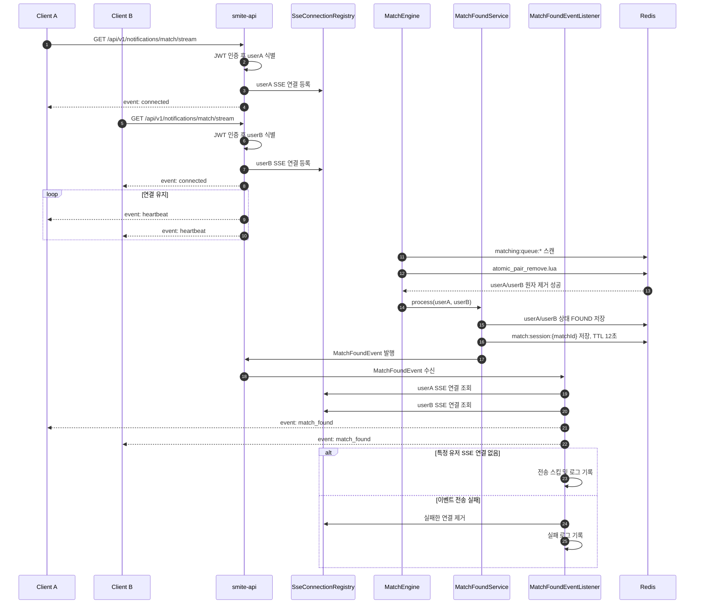

# Issue-28: 매칭 알림 기능 구현 (SSE V1)

## 📌 Feature Description

매칭 엔진에서 매칭이 성사되었을 때, 대상 유저 2명에게 실시간으로 매칭 성사 알림을 전달하는 SSE(Server-Sent Events) 기반 알림 기능을 구현합니다.

이번 이슈의 목표는 **매칭 성사 이벤트를 클라이언트까지 안정적으로 전달하는 실시간 이벤트 스트림 구조를 만드는 것**입니다. 클라이언트는 매칭 대기 화면에서 SSE 연결을 열고, 서버는 `MatchFoundEvent`가 발생하면 해당 유저의 SSE 연결로 `match_found` 이벤트를 전송합니다.

수락/거절 API, 양쪽 수락 완료 처리, 거절/타임아웃 상태 동기화는 이번 이슈에서 구현하지 않습니다. 해당 기능은 후속 이슈인 `[FEAT] 매칭 수락/거절 API 및 상태 동기화 구현`에서 처리합니다.

---

## 📌 Summary

매칭 알림은 서버에서 클라이언트로 전달되는 단방향 이벤트입니다. 클라이언트가 서버에 지속적으로 입력을 보내는 구조가 아니므로, WebSocket보다 SSE가 현재 요구사항에 더 적합합니다.

SSE는 HTTP 기반이라 인증, 로깅, 장애 분석이 단순하고, 브라우저의 `EventSource`가 자동 재연결을 지원합니다. 매칭 성사처럼 서버가 특정 순간에 이벤트를 push해야 하는 기능에 잘 맞습니다.

이번 이슈에서는 API 모듈에 SSE 연결 API를 추가하고, 유저별 SSE 연결을 관리하는 컴포넌트를 구성합니다. 이후 매칭 모듈에서 발행하는 `MatchFoundEvent`를 API 모듈에서 구독하여 대상 유저 2명에게 매칭 성사 알림을 전송합니다.

V1은 기존 API 서버가 `spring-boot-starter-web` 기반이라는 점을 고려해 MVC `SseEmitter` 방식으로 먼저 구현합니다. 이후 동시 SSE 연결 부하 테스트를 통해 Thread, Heap, CPU, 연결 유지율을 측정하고, 10,000명 동시 연결에서 리소스 한계가 확인되면 WebFlux/Netty 기반 SSE로 전환합니다.

## ⚖️ SSE vs WebSocket 선택 이유

이번 매칭 알림 기능은 클라이언트가 서버에 계속 메시지를 보내는 구조가 아닙니다. 서버에서 매칭 성사 이벤트가 발생하면, 서버가 클라이언트에게 `match_found` 이벤트를 보내는 단방향 알림 구조입니다.

정책적으로 이번 매칭 흐름은 역할을 분리합니다.

```text
SSE  = 서버 -> 클라이언트 실시간 알림
HTTP = 클라이언트 -> 서버 명령 요청
```

즉 서버가 먼저 알려야 하는 `match_found`는 SSE로 전달하고, 클라이언트가 선택하는 `accept`, `reject`는 후속 이슈에서 일반 HTTP API로 처리합니다.

매칭 1건에서 클라이언트가 서버로 보내는 응답은 사실상 수락 또는 거절 1회입니다. 이 한 번의 응답을 위해 WebSocket 양방향 메시지 체계를 도입하면, 얻는 이점보다 백엔드가 관리해야 할 연결 상태와 메시지 프로토콜이 더 커집니다.

따라서 이번 이슈에서는 WebSocket보다 SSE를 우선 선택합니다.

| 비교 항목 | SSE | WebSocket |
| --- | --- | --- |
| 통신 방향 | 서버 -> 클라이언트 단방향에 적합 | 서버 <-> 클라이언트 양방향에 적합 |
| 현재 매칭 알림 요구사항 | 매칭 성사 알림 push에 충분 | 기능 대비 과한 선택일 수 있음 |
| 클라이언트 요청 처리 | `joinQueue`, `accept`, `reject`는 HTTP API로 분리 | 같은 연결로 처리 가능하지만 메시지 프로토콜 설계가 필요 |
| 구현 복잡도 | 비교적 단순 | 연결, 메시지 타입, 세션, 재연결 처리가 더 복잡 |
| 브라우저 지원 | `EventSource` 자동 재연결 지원 | 직접 재연결/heartbeat/ping-pong 설계 필요 |
| 운영/디버깅 | HTTP 기반이라 로그, 인증, 프록시 구성이 단순 | 별도 WebSocket 연결 운영 고려 필요 |
| 게임 플레이 실시간성 | 빠른 양방향 입력에는 부적합 | 실시간 게임 플레이/채팅에 적합 |

### 백엔드 자원 관점

SSE와 WebSocket은 둘 다 연결을 일정 시간 유지하므로, 연결 유지 비용 자체는 둘 다 존재합니다.

하지만 이번 요구사항에서 WebSocket을 선택하면 아래 관리 비용이 추가됩니다.

- WebSocket 세션 저장
- 유저 ID와 WebSocket 연결 매핑
- 연결 끊김 감지
- ping/pong heartbeat
- 재연결 처리
- 메시지 타입 라우팅
- 잘못된 메시지 검증
- 인증 만료 처리
- 서버 여러 대 환경에서 세션 라우팅 또는 pub/sub 고려

반면 SSE + HTTP 구조는 책임이 단순합니다.

- SSE 연결은 매칭 성사 알림을 받기 위한 통로로만 사용합니다.
- 수락/거절은 기존 HTTP 인증, 검증, 예외 처리 흐름을 그대로 사용합니다.
- 클라이언트 명령을 처리하기 위해 별도의 WebSocket 메시지 프로토콜을 만들 필요가 없습니다.

따라서 이번 단계에서는 **수락/거절 1회 응답을 받기 위해 WebSocket을 유지하는 것보다, SSE로 알림을 받고 HTTP로 응답하는 구조가 더 단순하고 효율적**입니다.

### 이번 이슈에서 SSE가 적합한 이유

- 매칭 성사 알림은 서버에서 클라이언트로 보내는 단방향 이벤트입니다.
- 수락/거절 요청은 HTTP API로 처리할 예정이므로, 양방향 연결이 꼭 필요하지 않습니다.
- 브라우저의 `EventSource`가 자동 재연결을 지원해 클라이언트 구현이 단순합니다.
- HTTP 기반 스트림이라 기존 인증/로깅/모니터링 흐름과 맞추기 쉽습니다.
- 매칭 대기 화면에서만 연결을 유지하면 되므로 연결 생명주기가 비교적 명확합니다.

### WebSocket을 쓰는 것이 더 나은 경우

- 실제 게임 플레이 중 클라이언트 입력을 서버에 계속 보내야 하는 경우
- 실시간 채팅처럼 양방향 메시지가 자주 오가는 경우
- 방 내부 상태, 위치, 액션, 타이밍을 낮은 지연으로 계속 동기화해야 하는 경우
- 서버와 클라이언트가 같은 연결에서 복잡한 명령을 주고받아야 하는 경우

이번 이슈는 **매칭 대기 중 match_found 알림을 안정적으로 받는 것**이 목표이므로 SSE를 선택합니다. 실제 게임 플레이 동기화가 필요해지는 단계에서는 WebSocket 또는 별도 게임 서버 구조를 다시 검토합니다.

## 🧭 SSE 구현 단계 전략

이번 이슈에서는 처음부터 WebFlux/Netty를 도입하지 않고, 기존 MVC 구조와 잘 맞는 `SseEmitter`로 V1을 구현합니다.

이유는 다음과 같습니다.

- 현재 API 모듈은 MVC 기반이므로 기존 인증, 컨트롤러, 테스트 구조와 바로 통합할 수 있습니다.
- 이번 이슈의 핵심은 Netty 도입이 아니라, 매칭 성사 이벤트가 클라이언트까지 안정적으로 전달되는지 검증하는 것입니다.
- 먼저 기능을 완성한 뒤 동시 연결 부하 테스트로 실제 병목을 확인해야 전환 근거가 명확해집니다.

단, 목표 사용자 규모를 10,000명으로 잡고 있으므로 SSE 연결 부하 테스트는 반드시 진행합니다.

```text
1단계: MVC SseEmitter 기반 SSE V1 구현
2단계: 1,000 / 5,000 / 10,000 동시 SSE 연결 부하 테스트
3단계: Thread, Heap, CPU, 연결 유지율, 이벤트 전송 지연 측정
4단계: MVC SSE 한계가 확인되면 WebFlux/Netty 기반 SSE로 전환
```

### MVC SSE와 Netty SSE 판단 기준

| 기준 | MVC SseEmitter | WebFlux/Netty SSE | V1 판단 |
| --- | --- | --- | --- |
| 기존 API 구조와의 호환성 | 높음 | 낮음 | MVC 우선 |
| 구현 속도 | 빠름 | 느림 | MVC 우선 |
| 기존 Security/JWT 연동 | 단순 | 별도 검토 필요 | MVC 우선 |
| 동시 장기 연결 확장성 | 상대적으로 불리 | 유리 | 부하 테스트 후 판단 |
| 포트폴리오 개선 스토리 | 기능 구현 중심 | 성능 개선 중심 | 측정 후 전환 시 설득력 높음 |

따라서 이번 이슈의 정책은 다음과 같습니다.

```text
V1: MVC SseEmitter로 SSE 알림 기능을 먼저 완성한다.
V2: 동시 연결 부하 테스트에서 리소스 한계가 확인되면 WebFlux/Netty로 전환한다.
```

### SSE V1 구현 방식 결정 결과

현재 코드 기준으로 V1은 MVC `SseEmitter` 기반으로 구현합니다.

확인 결과 `smite-api`는 `spring-boot-starter-web` 기반 MVC 애플리케이션입니다. WebFlux 의존성은 없고, Security도 Servlet 기반 `SecurityFilterChain`, `OncePerRequestFilter` 구조로 구성되어 있습니다. 따라서 WebFlux/Netty를 이번 이슈에 바로 도입하면 기존 MVC API, Security, RestDocs/MockMvc 테스트 구조와 섞이면서 변경 범위가 커집니다.

반면 MVC `SseEmitter`는 현재 구조와 바로 맞습니다. 기존 JWT 필터가 `Authorization: Bearer` 토큰을 검증하고, `@AuthUser` argument resolver가 `SecurityContextHolder`에서 인증 정보를 읽어 유저 ID를 추출하므로 SSE 연결 API에서도 같은 인증 흐름을 재사용할 수 있습니다.

다만 SSE는 장기 연결이므로 timeout 설정은 구현 단계에서 별도로 확인합니다. 현재 `application.yml`에는 `spring.mvc.async.request-timeout`, `server.tomcat.*` SSE 전용 설정이 없습니다. 따라서 구현 시 다음 설정을 검토합니다.

- `spring.mvc.async.request-timeout`
- `server.tomcat.threads.max`
- `server.tomcat.max-connections`
- SSE heartbeat 주기
- `SseEmitter` timeout 값

결론은 다음과 같습니다.

```text
Issue-28 V1은 MVC SseEmitter로 구현한다.
이유는 기존 API/Security 구조와 가장 잘 맞고, 매칭 성사 알림 정책을 빠르게 검증할 수 있기 때문이다.
동시 SSE 연결 부하 테스트에서 리소스 한계가 확인되면 WebFlux/Netty 전환을 후속 개선으로 진행한다.
```

## 📚 Changes

- API 모듈에 SSE 연결 엔드포인트를 추가합니다.
  - 예: `GET /api/v1/notifications/match/stream`
  - 인증된 유저만 연결할 수 있게 구성합니다.
  - 연결된 유저 ID를 기준으로 SSE 세션을 관리합니다.

- 유저별 SSE 연결 저장소를 구현합니다.
  - 유저 ID별 활성 SSE 연결을 저장합니다.
  - 같은 유저가 재연결하면 기존 연결을 종료하고 새 연결로 교체합니다.
  - 연결 종료, 타임아웃, 전송 실패 시 연결 정보를 제거합니다.

- 매칭 성사 이벤트 전송 흐름을 구현합니다.
  - `MatchFoundEvent`를 이벤트 리스너에서 수신합니다.
  - `userA`, `userB` 각각에게 `match_found` 이벤트를 전송합니다.
  - payload에는 `matchId`, 상대 유저 ID, 수락 제한 시간(`acceptTimeoutSeconds`)을 포함합니다.

- SSE 연결 안정성 처리를 추가합니다.
  - 일정 주기로 heartbeat 이벤트를 전송해 연결이 살아 있는지 확인합니다.
  - 끊어진 연결에 이벤트 전송 시 예외를 처리하고 연결 저장소에서 제거합니다.
  - 이벤트 전송 실패가 매칭 상태 자체를 망가뜨리지 않도록 Redis 매칭 세션을 기준 상태로 유지합니다.

- SSE V1은 MVC `SseEmitter` 기반으로 구현합니다.
  - 기존 API/Security 구조와 빠르게 통합합니다.
  - 동시 SSE 연결 부하 테스트로 Thread, Heap, CPU, 연결 유지율을 측정합니다.
  - 측정 결과 한계가 확인되면 WebFlux/Netty 기반 SSE 전환을 후속 이슈로 분리합니다.

## 📝 Note

- 이번 이슈는 "매칭 성사 알림을 클라이언트에 보내는 것"까지만 다룹니다.
- 수락/거절 버튼을 눌렀을 때 호출할 API는 후속 이슈로 분리합니다.
- 상대방이 수락했는지, 거절했는지, 양쪽 수락이 완료됐는지 알려주는 이벤트도 후속 이슈에서 다룹니다.
- SSE 연결은 알림 전달 경로일 뿐, 매칭 상태의 원본 데이터는 Redis의 `match:session:{matchId}`와 유저 매칭 상태입니다.
- 클라이언트가 일시적으로 SSE 이벤트를 받지 못해도, 후속 API에서 Redis 세션 기준으로 현재 매칭 상태를 조회할 수 있어야 합니다.

## 🔁 SSE 과정 흐름



### 흐름 요약

1. 클라이언트는 매칭 대기 화면에 진입하면 SSE 스트림을 먼저 연결합니다.
2. 서버는 인증된 유저 ID를 기준으로 SSE 연결을 저장합니다.
3. 매칭 엔진이 두 유저를 원자적으로 큐에서 제거합니다.
4. `MatchFoundService`가 유저 상태와 매칭 세션을 Redis에 저장합니다.
5. `MatchFoundEvent`가 발행됩니다.
6. API 모듈의 이벤트 리스너가 이벤트를 받아 두 유저의 SSE 연결을 조회합니다.
7. 연결이 살아 있으면 `match_found` 이벤트를 전송합니다.
8. 연결이 없거나 전송에 실패하면 알림 실패만 로그로 남기고, 매칭 상태는 Redis 기준으로 유지합니다.

## 📌 Related Issue
- Closes #28

---

## 📚 Tasks

### 1. SSE V1 구현 방식 결정
- [x] **현재 API 서버 구조 확인**
  - `smite-api`가 현재 `spring-boot-starter-web` 기반으로 동작하는지 확인
  - 기존 MVC 컨트롤러, Spring Security, RestDocs/OpenAPI 구성과 함께 `SseEmitter`를 사용할 수 있는지 확인
  - SSE 연결 timeout, async request timeout, Tomcat connection 설정 확인

- [x] **SSE 구현 방식 결정**
  - V1은 Spring MVC `SseEmitter` 기반으로 구현
  - 이유: 기존 API 구조와의 호환성, 빠른 검증, 낮은 구현 위험
  - WebFlux/Netty 기반 SSE는 동시 연결 부하 테스트 이후 후속 개선으로 검토

### 2. SSE 연결 API 구현
- [x] **SSE 연결 엔드포인트 추가**
  - `GET /api/v1/notifications/match/stream`
  - 인증된 유저 ID를 `@AuthUser` 또는 SecurityContext에서 추출
  - 응답 Content-Type은 `text/event-stream` 형태로 제공

- [x] **초기 연결 이벤트 전송**
  - 연결 직후 `connected` 이벤트 전송
  - 클라이언트가 정상 연결 여부를 바로 알 수 있게 구성
  - 필요 시 현재 서버 시간 또는 connection id 포함

- [x] **인증 실패 처리**
  - 인증되지 않은 요청은 SSE 연결을 열지 않음
  - 기존 인증 실패 응답 정책과 동일하게 처리

#### 구현 결과

- `MatchNotificationController`를 추가해 SSE 연결 API를 제공합니다.
- `MatchNotificationService`에서 `SseEmitter`를 생성하고, 연결 직후 `connected` 이벤트를 전송합니다.
- `connected` payload에는 `userId`, `connectedAt`을 포함합니다.
- 인증은 기존 JWT 필터와 `@AuthUser` resolver를 그대로 사용합니다.
- 인증되지 않은 요청은 기존 Security 정책에 따라 SSE 연결을 열지 않습니다.
- 유저별 연결 저장과 재연결 교체는 Task 3에서 확장합니다.

### 3. 유저별 SSE 연결 관리
- [x] **SSE 연결 저장소 구현**
  - 유저 ID를 key로 활성 연결 저장
  - 저장 구조 예: `ConcurrentHashMap<Long, SseConnection>`
  - 연결 객체는 이벤트 전송, 완료 처리, 종료 처리를 캡슐화

- [x] **재연결 처리**
  - 같은 유저가 새로 연결하면 기존 연결을 종료하고 새 연결로 교체
  - 브라우저 새로고침, 네트워크 재연결 상황에서 중복 연결이 쌓이지 않도록 처리

- [x] **연결 제거 처리**
  - 클라이언트 연결 종료 시 저장소에서 제거
  - 타임아웃 발생 시 저장소에서 제거
  - 이벤트 전송 실패 시 저장소에서 제거

#### 구현 결과

- `SseConnection`을 추가해 유저 1명의 SSE 연결을 표현합니다.
- `SseConnectionRegistry`를 추가해 유저 ID별 활성 연결을 `ConcurrentHashMap`으로 관리합니다.
- 같은 유저가 재연결하면 기존 연결은 `complete()` 처리하고 새 연결로 교체합니다.
- `onCompletion`, `onTimeout`, `onError` 콜백을 등록해 연결 종료 시 저장소에서 제거합니다.
- 오래된 연결의 종료 콜백이 새 연결을 지우지 않도록 `remove(userId, connection)` 방식으로 현재 연결만 제거합니다.
- `MatchNotificationService`는 SSE 연결 생성 후 registry에 등록하고, 초기 `connected` 이벤트 전송 실패 시 연결을 제거합니다.

### 4. Heartbeat 구현
- [x] **주기적 heartbeat 이벤트 전송**
  - 일정 주기로 `heartbeat` 이벤트 전송
  - 프록시, 브라우저, 네트워크 장비가 유휴 연결을 끊지 않도록 유지
  - heartbeat 주기는 설정값으로 분리

- [x] **heartbeat 실패 연결 정리**
  - heartbeat 전송 중 예외 발생 시 해당 연결 제거
  - 실패 연결이 계속 저장소에 남아 메모리 누수가 생기지 않도록 처리

#### 구현 결과

- `notificationTaskScheduler`를 추가해 알림 전용 스케줄러를 분리했습니다.
- 매칭 엔진의 전역 `@Scheduled` 설정과 섞이지 않도록 heartbeat는 `@Scheduled`를 사용하지 않고, 알림 전용 `TaskScheduler`에서 직접 실행합니다.
- `SseHeartbeatService`를 추가해 15초마다 전체 SSE 연결에 `heartbeat` 이벤트를 전송합니다.
- `heartbeat` payload에는 `sentAt`을 포함합니다.
- heartbeat 전송 실패 시 해당 연결을 registry에서 제거하고 `completeWithError()`로 종료합니다.
- `SseConnectionRegistry.findAll()`을 추가해 현재 활성 연결 스냅샷을 순회할 수 있게 했습니다.

### 5. MatchFoundEvent 연동
- [x] **매칭 성사 이벤트 리스너 구현**
  - `MatchFoundEvent`를 구독하는 listener 추가
  - 이벤트 발생 시 `userA`, `userB` 대상 연결 조회
  - 연결이 있으면 각각에게 `match_found` 이벤트 전송

- [x] **매칭 성사 payload 정의**
  - `matchId`
  - `userId`
  - `opponentUserId`
  - `acceptTimeoutSeconds`
  - 필요 시 `eventCreatedAt`

- [x] **미연결 유저 처리**
  - 대상 유저의 SSE 연결이 없으면 이벤트 전송은 스킵
  - 매칭 상태는 Redis 세션에 이미 저장되어 있으므로, 전송 실패만 로그로 남김
  - 재전송/보상 정책은 후속 이슈에서 검토

#### 구현 결과

- `match_found` 이벤트 이름을 추가했습니다.
- `MatchFoundNotification` payload를 추가했습니다.
  - `matchId`
  - `userId`
  - `opponentUserId`
  - `acceptTimeoutSeconds`
  - `eventCreatedAt`
- `MatchFoundEventListener`를 추가해 `MatchFoundEvent`를 구독합니다.
- 이벤트 발생 시 `userA`, `userB` 각각의 SSE 연결을 조회하고, 연결이 있으면 `match_found` 이벤트를 전송합니다.
- 대상 유저의 SSE 연결이 없으면 알림 전송만 스킵하고 매칭 상태는 Redis 세션 기준으로 유지합니다.
- `SseNotificationSender`를 추가해 heartbeat와 match_found가 같은 전송 실패 처리 정책을 사용하도록 분리했습니다.
- 전송 실패 시 실패 연결은 registry에서 제거하고 `completeWithError()`로 종료합니다.

### 6. 전송 실패 및 로깅 처리
- [x] **전송 실패 예외 처리**
  - 끊어진 SSE 연결에 전송 시 예외를 잡고 연결 제거
  - 매칭 성사 처리 흐름 전체가 실패하지 않도록 알림 실패를 격리

- [x] **운영 로그 정리**
  - 연결 생성 로그
  - 연결 종료 로그
  - 매칭 성사 이벤트 전송 성공/실패 로그
  - heartbeat 실패 로그

#### 구현 결과

- `SseNotificationSender`를 공통 전송 컴포넌트로 사용하도록 정리했습니다.
- `connected`, `heartbeat`, `match_found` 이벤트 전송은 모두 같은 실패 처리 정책을 사용합니다.
- 이벤트 전송 중 `IOException`이 발생하면 실패한 연결만 registry에서 제거하고 `completeWithError()`로 종료합니다.
- 알림 전송 실패는 매칭 상태 변경 흐름을 중단시키지 않습니다.
  - 매칭 상태의 기준 데이터는 Redis `match:session:{matchId}`와 유저 매칭 상태입니다.
  - SSE는 클라이언트에게 알려주는 전달 경로이므로, 전송 실패는 로그와 연결 정리로 격리합니다.
- 운영 로그는 다음 기준으로 남깁니다.
  - SSE 연결 등록
  - 같은 유저 재연결로 인한 기존 연결 교체
  - 연결 완료, 타임아웃, 에러로 인한 연결 제거
  - `match_found` 전송 성공
  - 대상 유저의 SSE 연결 없음
  - SSE 이벤트 전송 실패

### 7. API 문서 및 사용 예시 작성
- [x] **SSE 연결 API 문서화**
  - 요청 URL
  - 인증 방식
  - 이벤트 이름
  - 이벤트 payload 예시

- [x] **클라이언트 사용 예시 작성**
  - `EventSource` 연결 예시
  - `match_found` 이벤트 수신 예시
  - 연결 종료/재연결 시 주의사항

#### API 문서

```http
GET /api/v1/notifications/match/stream
Accept: text/event-stream
Authorization: Bearer {accessToken}
```

매칭 대기 화면에서 호출하는 SSE 연결 API입니다. 인증된 유저 ID를 기준으로 서버가 SSE 연결을 저장합니다.

응답은 일반 JSON 응답이 아니라 `text/event-stream` 스트림입니다. 연결이 유지되는 동안 서버가 이벤트를 계속 내려보낼 수 있습니다.

#### 이벤트 목록

| 이벤트 이름 | 발생 시점 | payload |
| --- | --- | --- |
| `connected` | SSE 연결 직후 | `userId`, `connectedAt` |
| `heartbeat` | 연결 유지 확인용 주기 이벤트 | `sentAt` |
| `match_found` | 매칭 엔진에서 매칭 성사 이벤트 발생 시 | `matchId`, `userId`, `opponentUserId`, `acceptTimeoutSeconds`, `eventCreatedAt` |

#### connected 예시

```text
event: connected
data: {
  "userId": 1,
  "connectedAt": "2026-05-04T00:00:00Z"
}
```

#### heartbeat 예시

```text
event: heartbeat
data: {
  "sentAt": "2026-05-04T00:00:15Z"
}
```

#### match_found 예시

```text
event: match_found
data: {
  "matchId": "match-20260504-0001",
  "userId": 1,
  "opponentUserId": 2,
  "acceptTimeoutSeconds": 10,
  "eventCreatedAt": "2026-05-04T00:00:20Z"
}
```

#### 클라이언트 사용 예시

브라우저 기본 `EventSource`는 커스텀 `Authorization` 헤더를 직접 넣을 수 없습니다. 실제 프론트 구현에서는 아래 두 방식 중 하나를 선택해야 합니다.

| 방식 | 설명 | V1 판단 |
| --- | --- | --- |
| 쿠키 기반 인증 | `EventSource`가 쿠키를 자동 포함 | 브라우저 SSE와 가장 단순하게 맞음 |
| fetch 기반 SSE polyfill | `Authorization` 헤더를 직접 설정 가능 | 현재 Bearer 토큰 정책을 유지하기 쉬움 |

현재 API 문서 기준 인증 방식은 `Authorization: Bearer {accessToken}`입니다. 따라서 프론트가 Bearer 토큰을 유지한다면 native `EventSource`만으로는 부족하고, 헤더 설정이 가능한 SSE 클라이언트 라이브러리 또는 fetch 기반 stream 처리가 필요합니다.

```javascript
const eventSource = new EventSource('/api/v1/notifications/match/stream', {
  withCredentials: true,
});

eventSource.addEventListener('connected', (event) => {
  const payload = JSON.parse(event.data);
  console.log('SSE connected', payload);
});

eventSource.addEventListener('heartbeat', (event) => {
  const payload = JSON.parse(event.data);
  console.log('SSE heartbeat', payload.sentAt);
});

eventSource.addEventListener('match_found', (event) => {
  const payload = JSON.parse(event.data);

  openMatchAcceptModal({
    matchId: payload.matchId,
    opponentUserId: payload.opponentUserId,
    acceptTimeoutSeconds: payload.acceptTimeoutSeconds,
  });
});

eventSource.onerror = () => {
  // EventSource는 네트워크 오류 시 자동 재연결을 시도합니다.
  // 화면을 벗어나거나 매칭이 종료되면 명시적으로 close() 해야 합니다.
};
```

#### 연결 종료 기준

- 사용자가 매칭 대기 화면을 벗어나면 클라이언트에서 `eventSource.close()`를 호출합니다.
- 매칭이 성사되어 수락/거절 모달로 넘어간 뒤 더 이상 대기 이벤트가 필요 없으면 연결을 종료합니다.
- 브라우저 새로고침이나 네트워크 재연결로 같은 유저가 다시 연결하면 서버는 기존 연결을 닫고 새 연결로 교체합니다.
- 서버는 연결 완료, 타임아웃, 에러, 전송 실패 시 registry에서 해당 연결을 제거합니다.

#### 구현 결과

- `notification-match-stream` RestDocs 문서를 추가했습니다.
- SSE 연결 URL, 인증 헤더, 이벤트 이름, payload 예시를 문서화했습니다.
- 클라이언트 구현 시 native `EventSource`와 Bearer 토큰 인증의 제약을 명시했습니다.
- 재연결과 화면 이탈 시 연결 종료 기준을 정리했습니다.

### 8. 테스트 코드 작성
- [x] **SSE 연결 저장소 단위 테스트**
  - 연결 등록 테스트
  - 재연결 시 기존 연결 교체 테스트
  - 연결 종료 시 제거 테스트

- [x] **매칭 성사 이벤트 전송 테스트**
  - `MatchFoundEvent` 발생 시 두 유저에게 이벤트가 전송되는지 검증
  - 한 명만 연결된 경우 연결된 유저에게만 전송되는지 검증
  - 두 명 모두 연결되지 않은 경우 예외 없이 종료되는지 검증

- [x] **전송 실패 처리 테스트**
  - 이벤트 전송 중 예외 발생 시 연결이 제거되는지 검증
  - 전송 실패가 매칭 이벤트 처리 전체를 중단시키지 않는지 검증

- [x] **heartbeat 테스트**
  - heartbeat 이벤트가 주기적으로 전송되는지 검증
  - heartbeat 실패 시 연결이 제거되는지 검증

#### 구현 결과

- `MatchNotificationServiceTest`를 추가했습니다.
  - SSE 연결 생성 시 registry에 연결이 저장되는지 검증합니다.
  - 연결 직후 `connected` 이벤트 전송을 요청하는지 검증합니다.
- `SseConnectionRegistryTest`를 보강했습니다.
  - 유저별 연결 등록/조회
  - 재연결 시 기존 연결 종료 후 새 연결 교체
  - 현재 연결만 제거하고 오래된 연결 제거 요청은 무시
  - `onCompletion`, `onTimeout`, `onError` 콜백 실행 시 registry 제거
- `MatchFoundEventListenerTest`를 보강했습니다.
  - 두 유저 모두 연결된 경우 두 유저에게 `match_found` 전송
  - 한 유저만 연결된 경우 연결된 유저에게만 전송
  - 두 유저 모두 미연결이어도 예외 없이 종료
  - 전송 실패 시 실패 연결 제거
  - 대상 유저 기준 `matchId`, `userId`, `opponentUserId`, `acceptTimeoutSeconds` payload 생성 검증
- `SseNotificationSenderTest`를 추가했습니다.
  - 전송 성공 시 true 반환 및 연결 유지
  - 전송 실패 시 false 반환, registry 제거, `completeWithError()` 호출
- `SseHeartbeatServiceTest`를 작성했습니다.
  - 등록된 연결에 `heartbeat` 이벤트 전송
  - heartbeat 실패 시 실패 연결 제거 및 에러 완료 처리
- `MatchNotificationControllerRestDocsTest`를 추가했습니다.
  - SSE 연결 API 문서화 테스트를 통해 문서 생성 흐름을 검증합니다.

### 9. SSE 부하 테스트
- [ ] **부하 테스트 목적 정의**
  - MVC `SseEmitter` 기반 SSE가 목표 사용자 규모에서 안정적으로 연결을 유지할 수 있는지 확인
  - 동시 연결 수 증가에 따른 Thread, Heap, CPU, GC, 연결 유지율 변화를 측정
  - 측정 결과를 바탕으로 WebFlux/Netty 기반 SSE 전환 필요성을 판단

- [ ] **동시 SSE 연결 유지 테스트**
  - 1,000 동시 연결: 기본 안정성 검증
  - 5,000 동시 연결: 목표 안정 구간 검증
  - 10,000 동시 연결: 한계 확인 구간 검증
  - 각 연결은 매칭 대기 화면에 머무르는 상황을 가정해 일정 시간 유지

- [ ] **heartbeat 안정성 테스트**
  - 연결된 클라이언트에게 주기적으로 `heartbeat` 이벤트 전송
  - heartbeat 전송 성공률 측정
  - heartbeat 실패 시 연결이 저장소에서 제거되는지 확인
  - heartbeat 주기가 서버 리소스에 미치는 영향 측정

- [ ] **match_found 이벤트 전송 테스트**
  - 연결된 유저 중 일부에게 `match_found` 이벤트를 전송
  - 이벤트 전송 성공률 측정
  - 이벤트 전송 p95/p99 지연 시간 측정
  - 연결이 끊긴 유저에게 전송 시 실패 연결이 정리되는지 확인

- [ ] **관측 지표 정의**
  - SSE 연결 성공률
  - SSE 연결 유지율
  - SSE 연결 종료/실패 수
  - heartbeat 전송 성공률
  - `match_found` 이벤트 전송 성공률
  - `match_found` 이벤트 전송 p95/p99 지연 시간
  - JVM Heap 사용량
  - JVM Thread 수
  - GC pause
  - Process CPU
  - Tomcat active threads / active connections

- [ ] **성공 기준 정의**
  - 1,000 동시 연결은 반드시 안정적으로 유지
  - 5,000 동시 연결은 목표 안정 구간으로 설정
  - 10,000 동시 연결은 MVC SSE의 한계 확인 구간으로 설정
  - 연결 유지율이 낮거나 Thread/Heap/CPU가 급격히 증가하면 WebFlux/Netty 전환 후보로 기록
  - `match_found` 이벤트 전송 실패는 매칭 상태를 변경하지 않고 알림 실패로만 격리

- [ ] **부하 테스트 스크립트 작성**
  - SSE 연결 유지용 k6 스크립트 작성
  - heartbeat 수신 확인 가능 여부 검토
  - `match_found` 이벤트 전송 테스트를 위한 테스트 전용 이벤트 트리거 방식 검토
  - 테스트 결과는 `docs/load-test/result` 하위에 보관

- [ ] **결과 분석 문서 작성**
  - 연결 수별 결과를 표로 정리
  - Grafana 캡처 이미지 첨부
  - MVC SSE 유지 가능 여부 판단
  - WebFlux/Netty 전환 필요성 여부 정리

### 10. 후속 이슈 분리
- [ ] **수락/거절 API 후속 이슈로 분리**
  - `POST /api/v1/match/{matchId}/accept`
  - `POST /api/v1/match/{matchId}/reject`
  - 양쪽 수락 완료 처리
  - 한쪽 거절 처리
  - 타임아웃 처리

- [ ] **수락/거절 상태 동기화 이벤트 후속 이슈로 분리**
  - `match_accept`
  - `match_reject`
  - `match_completed`
  - `match_timeout`
