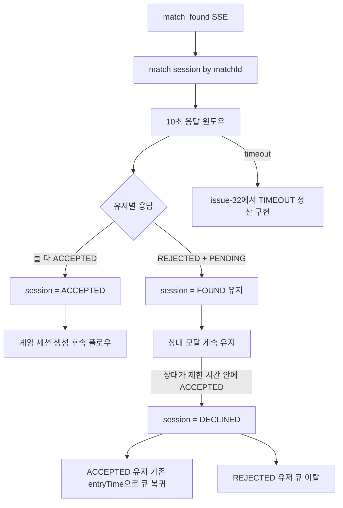

# Issue-30: 매칭 수락/거절 API 구현

## 📌 Feature Description

매칭 성사 후 생성된 `match:session:{matchId}`를 기준으로 유저가 제한 시간 안에 매칭을 수락하거나 거절할 수 있는 API를 구현합니다.

Issue-28에서 SSE `match_found` 알림은 이미 구현했습니다. 이번 이슈는 알림을 받은 클라이언트가 실제 선택을 서버에 전달하는 HTTP API를 다룹니다.

정책은 다음과 같습니다.

- `match_found` 알림은 SSE로 전달합니다.
- 유저의 `accept`, `reject` 선택은 HTTP API로 처리합니다.
- 요청 유저는 해당 `matchId`의 참여자여야 합니다.
- 양쪽 유저가 모두 수락하면 매칭 세션은 완료 상태로 전환하고 게임 진행 단계로 넘어갑니다.
- 한 명이 거절해도 10초 수락/거절 모달 윈도우는 상대방에게 계속 유지됩니다.
- 최종 정산은 양쪽 응답이 모두 확정되었거나 timeout 처리 시점에 수행합니다.
- 거절/타임아웃/미응답 유저는 큐에서 이탈하고, 제한 시간 안에 수락한 유저는 기존 큐 진입 시간을 유지해 최우선 복귀합니다.
- 수락 제한 시간이 지나면 timeout으로 처리합니다. timeout은 reject와 같은 종료/복귀 흐름을 사용하되, 상태값은 `TIMEOUT`으로 분리합니다.
- 동시 수락/거절 요청에서도 세션 상태가 꼬이지 않도록 `matchId` 기준 Redis 분산락을 사용합니다.

### 이번 이슈 핵심 결정

```text
상태 저장:
  MatchSession에 userAStatus, userBStatus 추가
  각 유저 응답 상태는 PENDING / ACCEPTED / REJECTED / TIMEOUT으로 표현
  MatchSession에 userAEntryTime, userBEntryTime 추가

동시성 제어:
  accept/reject/timeout 처리는 matchId 기준 Redis lock으로 직렬화

timeout 정책:
  10초 응답 윈도우 종료 시 PENDING 유저를 TIMEOUT/미응답으로 정산
  제한 시간 안에 ACCEPTED인 유저만 기존 entryTime으로 큐 복귀

큐 복귀 정책:
  제한 시간 안에 수락한 유저는 기존 entryTime으로 대기열에 재삽입
  거절/타임아웃/미응답 유저는 큐 이탈
```

## 📚 Tasks

### 1. 현재 매칭 세션 구조 확인

- [x] `MatchSession` 현재 필드 확인
  - `matchId`
  - `userA`
  - `userB`
  - `status`
  - `createdAt`
- [x] 현재 Redis Hash 구조 확인
  - key: `match:session:{matchId}`
  - fields: `matchId`, `userA`, `userB`, `status`, `createdAt`
- [x] 유저 상태 저장소 확인
  - key: `match:user:status:{userId}`
  - status: `MATCHING`, `FOUND`, `ACCEPTED`, `DECLINED`, `TIMEOUT`, `IN_GAME`
- [x] 이번 이슈에서 추가로 필요한 세션 필드 정의
  - `userAStatus`
  - `userBStatus`
  - `userAEntryTime`
  - `userBEntryTime`

#### 확인 결과

- 현재 `MatchSession`은 수락 대기 세션을 표현하지만, 유저별 수락 여부는 저장하지 않습니다.
  - 현재 필드: `matchId`, `userA`, `userB`, `status`, `createdAt`
  - 생성 시 `status=FOUND`로 저장됩니다.
- Redis 세션은 Hash 구조입니다.
  - key: `match:session:{matchId}`
  - fields: `matchId`, `userA`, `userB`, `status`, `createdAt`
  - TTL은 `MatchFoundService`에서 `60분`로 저장합니다.
- 클라이언트 수락/거절 모달 정책은 10초이고, Redis 세션 TTL은 cleanup 실패 대비 안전장치로 60분으로 설정되어 있습니다.
- 유저별 매칭 상태는 별도 Redis bucket에 저장됩니다.
  - key prefix: `match:status:`
  - 실제 key: `match:status:{userId}`
  - `FOUND` 상태 TTL은 `MatchingConstants.STATUS_TTL_SECONDS = 1800초`입니다.
- 매칭 성사 시 현재 흐름은 다음과 같습니다.
  - `MatchEngineService`가 두 유저를 Redis 대기열에서 원자 제거
  - `MatchFoundService`가 두 유저 상태를 `FOUND`로 변경
  - `MatchFoundService`가 `match:session:{matchId}` 저장
  - `MatchFoundEvent` 발행
  - SSE/PubSub 경로로 `match_found` 알림 전송

#### 수락/거절 구현 시 필요한 보강

- 양쪽 유저의 응답 상태를 세션에 저장해야 합니다.
  - `userAStatus`
  - `userBStatus`
  - 값: `PENDING`, `ACCEPTED`, `REJECTED`, `TIMEOUT`
- 한쪽 거절/타임아웃 시 수락한 유저를 최우선 복귀시키려면 기존 큐 진입 시간이 필요합니다.
  - 매칭 엔진은 매칭 성사 시 두 유저를 대기열에서 원자 제거합니다.
  - 따라서 수락한 유저는 "계속 큐에 남아 있는 것"이 아니라 기존 `entryTime`으로 재삽입되어야 합니다.
  - 이를 위해 매칭 세션에 `userAEntryTime`, `userBEntryTime`을 저장해야 합니다.
- 현재 `MatchSession`에는 참여자 검증 메서드가 없어 서비스에서 직접 비교해야 합니다.
  - `isParticipant(userId)`
  - `isUserA(userId)`
  - `isUserB(userId)`
  - `isAcceptedByBoth()`
- 현재 `RedisMatchSessionStore`는 `save/find/delete`만 지원합니다.
  - 수락/거절은 동시 요청 가능성이 있으므로 단순 `findById -> save` 방식은 위험합니다.
  - 다음 작업에서 `matchId` 기준 Redis 분산락을 적용한 응답 처리 흐름을 설계해야 합니다.
- 세션 TTL은 60분이지만 유저 status TTL은 30분입니다.
  - 세션이 만료된 뒤 유저 상태가 `FOUND`로 남는 상황을 어떻게 정리할지 정책이 필요합니다.
  - timeout은 reject와 같은 정리 흐름을 사용하되 상태는 `TIMEOUT`으로 분리합니다.

### 2. 도메인 모델 확장

- [x] `MatchSession`에 유저별 응답 상태 필드 추가
  - `MatchResponseStatus userAStatus`
  - `MatchResponseStatus userBStatus`
- [x] `MatchSession`에 원래 큐 정보 필드 추가
  - `int userATierScore`
  - `int userBTierScore`
  - `long userAEntryTime`
  - `long userBEntryTime`
- [x] 생성 메서드 수정
- `MatchSession.create()`는 응답 기본값 `PENDING, PENDING`과 각 유저의 기존 `entryTime`을 함께 저장
- [x] 편의 메서드 검토
  - `isParticipant(Long userId)`
  - `isAcceptedByBoth()`
  - `isUserA(Long userId)`
  - `isUserB(Long userId)`
- [x] 기존 테스트 영향 확인
  - `RedisMatchSessionStoreTest`
  - `MatchFoundServiceTest`

#### 구현 결과

- `MatchSession`에 유저별 응답 상태를 추가했습니다.
  - `userAStatus`
  - `userBStatus`
  - 값: `PENDING`, `ACCEPTED`, `REJECTED`, `TIMEOUT`
- `MatchSession`에 각 유저의 기존 큐 정보를 추가로 저장했습니다.
  - `userATierScore`
  - `userBTierScore`
  - `userAEntryTime`
  - `userBEntryTime`
  - 한쪽 거절/타임아웃 시 이미 수락한 유저를 기존 우선순위로 큐에 복귀시키기 위한 필드입니다.
- `MatchSession.create()`는 매칭 성사 직후 수락 대기 상태를 만들기 때문에 두 응답 상태를 모두 `PENDING`으로 초기화하고, 두 유저의 기존 `tierScore`, `entryTime`을 함께 저장합니다.
- 참여자/수락 완료 판단 메서드를 추가했습니다.
  - `isParticipant(Long userId)`
  - `isUserA(Long userId)`
  - `isUserB(Long userId)`
  - `isAcceptedByBoth()`
- `RedisMatchSessionStore` 저장/복원 필드를 확장했습니다.
  - `userAStatus`
  - `userBStatus`
- `RedisMatchSessionStore` 저장/복원 필드에 기존 큐 정보를 추가했습니다.
  - `userATierScore`
  - `userBTierScore`
  - `userAEntryTime`
  - `userBEntryTime`
- 테스트를 보강했습니다.
  - `MatchSessionTest`: 생성 기본값, 참여자 검증, 큐 정보 조회, 수락 상태 변경 검증
  - `RedisMatchSessionStoreTest`: 수락 필드와 큐 정보 Redis Hash 저장/복원 검증
  - `MatchFoundServiceTest`: 매칭 성사 직후 수락 필드 기본값 검증

### 3. API 경로 정의

- [x] `MatchPath`에 수락/거절 경로 추가
  - `/{matchId}/accept`
  - `/{matchId}/reject`
- [x] path variable 이름 상수화 여부 검토
  - `matchId`
- [x] API endpoint 정책 확정
  - `POST /api/v1/match/{matchId}/accept`
  - `POST /api/v1/match/{matchId}/reject`

#### 구현 결과

- `MatchPath`에 수락/거절 API path 상수를 추가했습니다.
  - `ACCEPT = "/{matchId}/accept"`
  - `REJECT = "/{matchId}/reject"`
- path variable 이름도 상수화했습니다.
  - `MATCH_ID = "matchId"`
- 최종 API 경로는 다음과 같습니다.
  - `POST /api/v1/match/{matchId}/accept`
  - `POST /api/v1/match/{matchId}/reject`

### 4. API 모듈 Controller 구현

- [x] `MatchController`에 수락 API 추가
  - `@PostMapping(MatchPath.ACCEPT)`
  - `@AuthUser Long userId`
  - `@PathVariable String matchId`
- [x] `MatchController`에 거절 API 추가
  - `@PostMapping(MatchPath.REJECT)`
  - `@AuthUser Long userId`
  - `@PathVariable String matchId`
- [x] Controller는 인증 유저와 matchId만 받고 서비스에 위임
- [x] 응답은 우선 `200 OK` 또는 `204 No Content` 중 기존 스타일에 맞춰 결정
  - 현재 `join`, `leave`는 `200 OK` 사용
  - 이번 API도 일관성을 위해 `200 OK` 우선 검토

#### 구현 결과

- `MatchController`에 수락/거절 endpoint를 추가했습니다.
  - `POST /api/v1/match/{matchId}/accept`
  - `POST /api/v1/match/{matchId}/reject`
- 컨트롤러는 `@AuthUser Long userId`와 `@PathVariable String matchId`만 받아 API 서비스에 위임합니다.
- 기존 `join`, `leave`와 일관성을 맞춰 성공 응답은 `200 OK`로 결정했습니다.
- 컴파일을 위해 API 레이어 위임 서비스인 `MatchResponseService`를 추가했습니다.
  - 실제 세션 상태 변경, `matchId` 기준 Redis lock, timeout 정산은 matching 모듈에서 처리합니다.
  - 현재 API 서비스는 matching command service로 위임합니다.
- `MatchControllerTest`를 추가해 accept/reject 요청이 서비스로 위임되는지 검증했습니다.

### 5. API 모듈 Service 분리

- [x] `MatchQueueService`에 수락/거절을 넣을지 별도 서비스로 분리할지 결정
  - 현재 `MatchQueueService`는 join/leave 대기열 책임
  - 수락/거절은 매칭 세션 응답 책임
- [x] 별도 `MatchResponseService` 추가 검토
  - 위치: `smite-api/src/main/java/com/sang/smite/match/service`
  - 역할: API layer에서 인증 유저 요청을 matching module로 위임
- [x] API layer는 JPA rank 조회를 하지 않음
  - 수락/거절은 `matchId`, `userId`만 필요
- [x] matching module의 수락/거절 서비스 호출

#### 구현 결과

- 수락/거절 요청은 `MatchQueueService`에 넣지 않고 별도 `MatchResponseService`로 분리했습니다.
  - `MatchQueueService`: join/leave 대기열 책임
  - `MatchResponseService`: 매칭 성사 후 accept/reject 응답 위임 책임
- API 모듈 `MatchResponseService`는 JPA rank 조회를 하지 않습니다.
  - 수락/거절에는 `matchId`, `userId`만 필요합니다.
- matching 모듈에 `MatchResponseCommandService`를 추가했습니다.
  - 위치: `smite-matching/src/main/java/com/sang/smite/matching/service`
  - API 모듈은 이 서비스를 호출해 수락/거절 처리를 위임합니다.
  - 실제 세션 상태 변경, `matchId` 기준 Redis lock, timeout 정책은 다음 task에서 구현합니다.
- `MatchResponseServiceTest`를 추가해 API 서비스가 matching 모듈 서비스로 accept/reject를 위임하는지 검증했습니다.

### 6. Matching 모듈 서비스 설계

- [x] `MatchAcceptanceService` 또는 `MatchResponseService` 추가
  - 위치: `smite-matching/src/main/java/com/sang/smite/matching/service`
- [x] 메서드 정의
  - `accept(String matchId, Long userId)`
  - `reject(String matchId, Long userId)`
- [x] 책임 정의
  - 매칭 세션 조회
  - 참여자 검증
  - 세션 상태 검증
  - 수락/거절 상태 변경
  - 유저 상태 변경/정리
- [x] `matchId` 기준 Redis lock 적용 위치 정의
  - `accept(matchId, userId)` 전체 처리 구간
  - `reject(matchId, userId)` 전체 처리 구간
  - timeout 처리 메서드가 생길 경우 동일하게 적용
- [x] timeout 처리 메서드 정의 검토
  - `timeout(String matchId)`
  - 또는 accept/reject 요청 시 세션 만료를 감지해 timeout 정리
- [x] `MatchService`와 책임 분리
  - `MatchService`: join/leave
  - `MatchFoundService`: 매칭 성사 후 세션 생성 및 알림 이벤트 발행
  - 새 서비스: 성사된 매칭에 대한 유저 응답 처리

#### 설계 결과

- matching 모듈의 수락/거절 서비스는 기존 `MatchResponseCommandService`를 사용합니다.
  - API 모듈에 이미 같은 이름의 `MatchResponseService`가 있으므로, matching 모듈까지 같은 이름으로 만들면 책임 경계가 흐려질 수 있습니다.
  - `Command`를 붙여서 "세션 상태를 변경하는 명령 서비스"라는 의도를 명확히 둡니다.
- 공개 메서드는 다음 2개를 우선 구현합니다.
  - `accept(String matchId, Long userId)`
  - `reject(String matchId, Long userId)`
- timeout은 별도 메서드로 확장 가능하게 설계합니다.
  - `timeout(String matchId)`
  - 다만 현재 클라이언트 수락/거절 API 구현이 우선이므로, timeout 스케줄러/이벤트 처리는 후속 작업에서 붙일 수 있게 경계만 열어둡니다.

#### 서비스 책임

`MatchResponseCommandService`는 다음 책임만 가집니다.

1. `matchId` 기준 Redis lock 획득
2. `MatchSessionStore`에서 세션 조회
3. 요청 유저가 `userA` 또는 `userB`인지 검증
4. 현재 세션 상태가 응답 가능한 상태인지 검증
5. accept/reject에 따라 세션 상태 변경
6. `MatchUserStatusStore`에 유저 상태 반영 또는 정리

다음 책임은 포함하지 않습니다.

- `joinQueue`, `leaveQueue`
  - 기존 `MatchService` 책임입니다.
- 매칭 성사 세션 생성 및 `match_found` 알림 발행
  - 기존 `MatchFoundService` 책임입니다.
- 수락/거절 결과를 상대방에게 SSE로 다시 알려주는 기능
  - 후속 이슈로 분리합니다.
- 게임 세션 생성 및 `IN_GAME` 전환
  - 게임 시작 플로우 이슈에서 처리합니다.

#### Redis lock 적용 방식

- lock key는 `matchId` 단위로 잡습니다.
  - 예: `match:session:lock:{matchId}`
- 같은 매칭 세션에 대한 `accept`, `reject`, `timeout`만 직렬화합니다.
- 서로 다른 `matchId`는 동시에 처리될 수 있어야 하므로 전역 lock은 사용하지 않습니다.
- 현재 `@DistributedLock`은 SpEL 기반 key 생성은 가능하지만, AOP 내부에서 `AopForTransaction`을 항상 거칩니다.
  - 이번 수락/거절 처리는 Redis Hash와 Redis 상태 저장소만 다루는 matching 모듈 명령입니다.
  - JPA 트랜잭션 경계가 필요하지 않으므로 `@DistributedRedisLock`을 사용하는 방식이 더 적합합니다.
  - Redis-only 작업은 트랜잭션 없는 Redis lock으로 처리합니다.

#### 상태 전이 규칙

수락 처리:

```text
FOUND
  -> userA만 수락: FOUND + userAStatus=ACCEPTED
  -> userB만 수락: FOUND + userBStatus=ACCEPTED
  -> 둘 다 수락: ACCEPTED + userAStatus=ACCEPTED + userBStatus=ACCEPTED
```

- 요청 유저 상태는 `ACCEPTED`로 변경합니다.
- 한 명만 수락한 경우 세션 status는 아직 `FOUND`로 유지합니다.
  - 이유: 매칭은 "양쪽 모두 수락"해야 완료입니다.
- 양쪽 모두 수락하면 세션 status를 `ACCEPTED`로 변경합니다.
- `IN_GAME` 전환은 이번 이슈 범위가 아닙니다.

거절 처리:

```text
FOUND
  -> 요청 유저만 status=REJECTED
  -> 상대가 아직 미응답이면 FOUND 유지
  -> 양쪽 응답이 끝났더라도 둘 다 수락이 아니면 FOUND 유지 후 deadline 정산
ACCEPTED -> 거절 불가
DECLINED/TIMEOUT -> 이미 종료된 세션
```

- 한 명이 거절해도 상대방의 10초 응답 윈도우는 유지합니다.
- 거절 요청만으로 세션 status를 즉시 `DECLINED`로 변경하지 않습니다.
- 거절한 유저도 최종 `match_response_result` 전까지 정산 대기 상태를 유지합니다.
- deadline 정산 시 제한 시간 안에 수락한 유저만 기존 큐 진입 시간으로 대기열에 재삽입합니다.
  - user status는 `MATCHING`으로 변경
  - ZSET score는 세션에 저장된 기존 `entryTime` 사용
  - 새 `now`를 쓰면 최우선 복귀 정책이 깨지므로 사용하지 않습니다.
- 아직 응답하지 않은 상대 유저는 10초 안에 수락 또는 거절할 수 있습니다.
  - 예: B가 3초에 거절하고 A가 6초에 수락하면 A는 큐 최우선 복귀 대상입니다.

timeout 처리:

```text
FOUND -> TIMEOUT
ACCEPTED -> timeout 불가
DECLINED/TIMEOUT -> 이미 종료된 세션
```

- timeout은 10초 응답 윈도우가 끝난 뒤 남은 PENDING 유저를 미응답으로 정산합니다.
- 제한 시간 안에 수락한 유저는 기존 큐 진입 시간으로 대기열에 재삽입합니다.
- 거절/timeout/미응답 유저는 매칭에서 제외합니다.
- 아무도 수락하지 않은 상태에서 timeout이면 양쪽 모두 매칭에서 제외합니다.
- 세션 TTL이 먼저 만료되어 세션이 없으면, API 요청에서는 만료/없음 에러를 반환합니다.
- 세션 TTL 만료 후 남아 있는 유저 status 보정은 timeout 처리 작업에서 별도로 다룹니다.

#### 중복 요청 정책

- 같은 유저가 같은 세션에 accept를 두 번 보내는 경우는 멱등 처리 후보입니다.
  - 이미 해당 유저의 응답 상태가 `ACCEPTED`이면 성공으로 간주해도 상태가 꼬이지 않습니다.
  - V1에서는 클라이언트 재시도 안정성을 위해 중복 accept는 성공 처리하는 방향이 적합합니다.
- 이미 `ACCEPTED`, `DECLINED`, `TIMEOUT`으로 종료된 세션에 반대 응답이 들어오면 conflict로 처리합니다.
- lock 획득 실패는 같은 `matchId`에 대한 요청이 처리 중이라는 뜻이므로 conflict 또는 retryable error로 처리합니다.

### 7. Redis-only 분산락 어노테이션 구현

- [x] 기존 `@DistributedLock` 역할 재정의
  - 위치: `smite-infra-redis/src/main/java/com/sang/smite/redis/lock/annotation/DistributedLock.java`
  - 역할: Redis lock + `AopForTransaction` 기반 `REQUIRES_NEW` 트랜잭션
  - 사용처: DB 트랜잭션 정합성이 필요한 작업
- [x] 신규 `@DistributedRedisLock` 추가
  - 위치: `smite-infra-redis/src/main/java/com/sang/smite/redis/lock/annotation/DistributedRedisLock.java`
  - 역할: Redis lock만 적용
  - 트랜잭션 AOP를 태우지 않음
  - 사용처: Redis-only 작업
    - 매칭 수락/거절
    - timeout 처리
    - 향후 Redis 상태 기반 동시성 제어
- [x] 신규 AOP 추가
  - 위치: `smite-infra-redis/src/main/java/com/sang/smite/redis/lock/aop/DistributedRedisLockAop.java`
  - 기존 `CustomSpringELParser` 재사용
  - 기존 `LockConstants.REDISSON_LOCK_PREFIX` 재사용
  - `RedissonClient.getLock(key)` 사용
- [x] 어노테이션 속성 정의
  - `key`
  - `timeUnit`
  - `waitTime`
  - `leaseTime`
- [x] watchdog 정책 지원
  - `leaseTime > 0`: `tryLock(waitTime, leaseTime, timeUnit)` 사용
  - `leaseTime < 0`: `tryLock(waitTime, timeUnit)` 사용
  - `leaseTime < 0`이면 Redisson watchdog이 lock을 자동 연장하도록 설계
- [x] lock 획득 실패 정책 정의
  - 기존 `@DistributedLock`처럼 `false`를 반환하지 않음
  - 수락/거절 API는 반환 타입이 `void`이므로 `false` 반환 방식이 맞지 않음
  - lock 획득 실패 시 명확한 예외를 던져 API 계층에서 에러 응답으로 변환
- [x] 예외 타입 정의
  - 기존 `ApiException`/`MatchingException` 흐름을 확인해 프로젝트 예외 정책에 맞춤
  - Redis lock 공통 예외를 infra-redis에 둘지, matching 도메인 예외로 변환할지 결정
- [x] 테스트 작성
  - SpEL key 생성 검증
  - lock 획득 시 원본 메서드 실행 검증
  - lock 획득 실패 시 예외 발생 검증
  - `leaseTime < 0` watchdog 분기 검증

#### 작업 이유

현재 `@DistributedLock`은 Redis lock을 잡은 뒤 항상 `AopForTransaction.proceed()`를 호출합니다.

```text
@DistributedLock
  -> Redis lock 획득
  -> REQUIRES_NEW 트랜잭션 시작
  -> 비즈니스 로직 실행
  -> 트랜잭션 종료
  -> lock 해제
```

이 구조는 DB 정합성이 필요한 작업에는 적합합니다. 하지만 매칭 수락/거절은 Redis Hash 세션과 Redis 유저 상태만 변경하는 Redis-only 작업입니다. 이 작업에 JPA 트랜잭션을 강제로 붙이면 의미 없는 트랜잭션 경계가 생기고, matching 모듈의 책임도 흐려집니다.

따라서 락을 다음처럼 분리합니다.

```text
@DistributedLock
  DB 트랜잭션이 필요한 분산락

@DistributedRedisLock
  Redis-only 작업에 사용하는 분산락
```

#### 패키지 구조

```text
smite-infra-redis
└── src/main/java/com/sang/smite/redis
    ├── common/constant
    │   └── LockConstants.java
    └── lock
        ├── annotation
        │   ├── DistributedLock.java
        │   └── DistributedRedisLock.java
        ├── aop
        │   ├── AopForTransaction.java
        │   ├── DistributedLockAop.java
        │   └── DistributedRedisLockAop.java
        └── parser
            └── CustomSpringELParser.java
```

#### 수락/거절 적용 예시

```java
@DistributedRedisLock(
        key = "'match:session:lock:' + #matchId",
        waitTime = 500,
        leaseTime = -1
)
public void accept(String matchId, Long userId) {
    // 세션 조회
    // 참여자 검증
    // 수락 상태 저장
    // 양쪽 수락 시 ACCEPTED 전환
}
```

`leaseTime = -1`은 watchdog 사용 의도를 나타냅니다. 수락/거절은 짧은 작업이지만, Redis 지연이나 GC pause 같은 상황에서 고정 lease time 때문에 lock이 먼저 풀리는 위험을 피할 수 있습니다.

#### 구현 결과

- `DistributedRedisLock` 어노테이션을 추가했습니다.
  - 기본 `waitTime`: `500ms`
  - 기본 `leaseTime`: `-1`
  - `leaseTime < 0`이면 Redisson watchdog을 사용합니다.
- `DistributedRedisLockAop`를 추가했습니다.
  - 기존 `CustomSpringELParser`로 SpEL key를 파싱합니다.
  - 기존 `LockConstants.REDISSON_LOCK_PREFIX`를 사용해 lock key prefix를 통일합니다.
  - 기존 `@DistributedLock`과 달리 `AopForTransaction`을 호출하지 않습니다.
- 기존 `DistributedLockAop`도 락 계열 정책에 맞춰 정리했습니다.
  - lock 획득 실패 시 `false`를 반환하지 않고 `RedisLockAcquisitionException`을 던집니다.
  - `leaseTime < 0`이면 watchdog을 사용할 수 있게 했습니다.
  - `InterruptedException` 변환 범위를 `tryLock()` 구간으로 좁혀 원본 메서드 예외를 보존합니다.
- lock 획득 실패 시 `false`를 반환하지 않고 `RedisLockAcquisitionException`을 던지도록 했습니다.
  - 수락/거절 API는 `void` 반환 흐름이므로 `false` 반환 방식은 맞지 않습니다.
- 테스트를 추가했습니다.
  - watchdog 분기: `tryLock(waitTime, timeUnit)`
  - 고정 lease time 분기: `tryLock(waitTime, leaseTime, timeUnit)`
  - lock 획득 실패 시 원본 메서드 미실행

검증:

```bash
./gradlew :smite-infra-redis:test --tests 'com.sang.smite.redis.lock.aop.*LockAopTest'
```

결과: `BUILD SUCCESSFUL`

### 8. Redis lock 기반 동시성 처리 설계

- [x] 신규 `@DistributedRedisLock` 적용 위치 확정
  - `MatchResponseResultService.acceptWithLock(matchId, userId)`
  - `MatchResponseResultService.rejectWithLock(matchId, userId)`
  - timeout 처리 메서드가 추가되면 동일하게 적용
- [x] lock key 정책 정의
  - 예: `match:session:lock:{matchId}`
  - 같은 매칭 세션의 accept/reject/timeout 요청만 직렬화
  - 서로 다른 matchId는 병렬 처리 가능
- [x] 수락 처리 흐름 설계
  - `matchId` lock 획득
  - 세션 key 존재 여부 확인
  - 요청 유저가 `userA` 또는 `userB`인지 확인
  - 세션 status가 `FOUND`인지 확인
  - 해당 유저 응답 상태를 `ACCEPTED`로 변경
  - 양쪽 응답 상태가 모두 `ACCEPTED`면 status를 `ACCEPTED`로 변경
  - 유저 상태를 `ACCEPTED`로 변경
  - lock 해제
- [x] 거절 처리 흐름 설계
  - `matchId` lock 획득
  - 세션 key 존재 여부 확인
  - 요청 유저가 참여자인지 확인
  - 이미 완료/거절/timeout된 세션인지 확인
  - 해당 유저 응답 상태를 `REJECTED`로 변경
  - 상대가 미응답이면 세션 status는 `FOUND` 유지
  - 양쪽 응답이 완료되면 실패 정산 후 status를 `DECLINED`로 변경
  - 거절 유저 상태 제거
  - 응답 상태가 `ACCEPTED`인 유저가 있으면 기존 `entryTime`으로 큐 복귀
  - lock 해제
- [x] timeout 처리 흐름 설계
  - `matchId` lock 획득
  - 세션이 남아 있으면 status를 `TIMEOUT`으로 변경
  - timeout 대상 유저 상태 제거
  - 응답 상태가 `ACCEPTED`인 유저가 있으면 기존 `entryTime`으로 큐 복귀
  - 세션이 이미 TTL로 삭제된 경우 유저 상태 보정 가능 여부 검토
  - lock 해제
- [x] Redis Hash field 상수화
  - `userAStatus`
  - `userBStatus`
- [x] `MatchSessionStore` 기능 확장 검토
  - `MatchSessionStore`는 Redis Hash 저장/조회 책임에 집중
  - 동시성은 `@DistributedRedisLock`이 서비스 메서드 전체를 감싸서 보장
  - 단순 `findById -> save`는 lock 안에서만 사용
  - 필요 시 `save` 외에 상태 변경 의도가 드러나는 메서드 추가
- [x] lock 기반 V1로 충분한지 검증
  - 동시 accept
  - accept/reject 충돌
  - 중복 accept
  - timeout 근처 요청

#### 설계 결과

Spring AOP는 같은 클래스 내부 메서드 호출(self-invocation)에는 적용되지 않습니다. 따라서 `MatchResponseCommandService.accept()` 안에서 같은 클래스의 `acceptWithLock()`을 호출하고 그 메서드에 `@DistributedRedisLock`을 붙이면 lock이 적용되지 않을 수 있습니다.

그래서 수락/거절 처리는 다음 2단 구조로 분리합니다.

```text
MatchResponseCommandService
  - API 모듈에서 호출하는 진입점
  - RedisLockAcquisitionException을 MatchingException으로 변환
  - 외부에 노출되는 서비스 책임

MatchResponseResultService
  - 실제 세션 상태 변경 담당
  - @DistributedRedisLock 적용
  - Redis Hash 세션과 유저 상태 저장소만 다룸
```

#### 컴포넌트 책임

`MatchResponseCommandService`

```text
accept(matchId, userId)
  -> processor.acceptWithLock(matchId, userId)
  -> RedisLockAcquisitionException 발생 시 MatchingException(MATCH_RESPONSE_LOCK_FAILED)로 변환

reject(matchId, userId)
  -> processor.rejectWithLock(matchId, userId)
  -> RedisLockAcquisitionException 발생 시 MatchingException(MATCH_RESPONSE_LOCK_FAILED)로 변환
```

`MatchResponseResultService`

```text
acceptWithLock(matchId, userId)
  -> @DistributedRedisLock
  -> 세션 조회
  -> 참여자 검증
  -> 응답 가능한 상태 검증
  -> 수락 flag 변경
  -> 양쪽 수락 시 ACCEPTED 전환
  -> 세션 저장
  -> 유저 상태 갱신

rejectWithLock(matchId, userId)
  -> @DistributedRedisLock
  -> 세션 조회
  -> 참여자 검증
  -> 응답 가능한 상태 검증
  -> DECLINED 전환
  -> 세션 저장
  -> 거절 유저 상태 제거
  -> 이미 수락한 상대가 있으면 기존 entryTime으로 큐 최우선 복귀
```

#### lock key

```java
@DistributedRedisLock(
        key = "'match:session:lock:' + #matchId",
        waitTime = 500,
        leaseTime = -1
)
```

실제 Redisson key는 공통 prefix가 붙어 다음 형태가 됩니다.

```text
LOCK:match:session:lock:{matchId}
```

이 key 정책의 의미는 다음과 같습니다.

- 같은 `matchId`의 `accept`, `reject`, `timeout`은 동시에 실행되지 않습니다.
- 서로 다른 `matchId`는 서로 다른 lock key를 사용하므로 병렬 처리됩니다.
- 전역 lock을 잡지 않기 때문에 전체 매칭 응답 처리량을 불필요하게 막지 않습니다.

#### 수락 동시성 시나리오

```text
userA accept 요청
userB accept 요청

1. userA 요청이 lock 획득
2. userAStatus=ACCEPTED 저장
3. 아직 userBStatus=PENDING이므로 status=FOUND 유지
4. userA lock 해제
5. userB 요청이 lock 획득
6. userBStatus=ACCEPTED 저장
7. userAStatus/userBStatus 모두 ACCEPTED이므로 status=ACCEPTED 저장
8. userB lock 해제
```

결과:

```text
userAStatus=ACCEPTED
userBStatus=ACCEPTED
status=ACCEPTED
```

#### accept/reject 충돌 시나리오

```text
userA accept 요청
userB reject 요청
```

두 요청 중 먼저 lock을 잡은 요청이 먼저 반영됩니다.

```text
accept 먼저 처리:
  userAStatus=ACCEPTED
  status=FOUND
  이후 reject 처리:
    status=DECLINED
    userB는 큐 이탈
    userA는 기존 entryTime으로 큐 최우선 복귀

reject 먼저 처리:
  userBStatus=REJECTED
  userB는 큐 이탈
  아직 userA가 응답하지 않았으므로 세션은 FOUND 유지
  이후 accept 처리:
    userAStatus=ACCEPTED
    양쪽 응답 완료
    status=DECLINED
    userA는 제한 시간 안에 수락했으므로 기존 entryTime으로 큐 복귀
```

정책상 한 명이라도 거절하면 현재 매칭은 실패합니다. 다만 10초 응답 윈도우는 양쪽 모두에게 보장되므로, 상대가 먼저 거절했더라도 제한 시간 안에 수락한 유저는 기존 대기 우선순위를 유지해 큐로 복귀시키는 것이 맞습니다.

#### 중복 accept 시나리오

```text
같은 user가 accept를 여러 번 전송
```

이미 해당 유저의 응답 상태가 `ACCEPTED`이면 같은 요청의 재시도로 보고 성공 처리합니다.

이유:

- 클라이언트 네트워크 재시도에서 중복 요청이 발생할 수 있습니다.
- 같은 유저의 중복 accept는 상태를 변경하지 않습니다.
- 멱등 처리하면 클라이언트가 불필요하게 실패 모달을 띄우지 않아도 됩니다.

#### timeout 근처 요청 시나리오

```text
accept/reject 요청과 timeout 처리가 거의 동시에 발생
```

timeout 처리도 같은 lock key를 사용합니다.

```text
LOCK:match:session:lock:{matchId}
```

따라서 다음 중 하나만 먼저 반영됩니다.

- accept/reject가 먼저 lock 획득
- timeout이 먼저 lock 획득

timeout이 먼저 완료되어 `TIMEOUT`으로 종료된 뒤 accept/reject가 들어오면 이미 종료된 세션으로 처리합니다. accept/reject가 먼저 완료되면 timeout은 현재 세션 status를 보고 추가 변경하지 않습니다.

timeout 처리 시 이미 수락한 상대 유저가 있으면 reject와 동일하게 기존 `entryTime`으로 큐에 복귀시킵니다. 아무도 수락하지 않은 상태라면 양쪽 모두 큐에 복귀하지 않습니다.

#### MatchSessionStore 확장 방향

V1에서는 `@DistributedRedisLock`이 서비스 메서드 전체를 감싸므로 `findById -> save` 흐름을 사용할 수 있습니다.

단, store 책임은 다음으로 제한합니다.

```text
MatchSessionStore
  - save
  - findById
  - delete
```

상태 전이 판단은 store가 아니라 `MatchResponseResultService`가 담당합니다.

이유:

- Redis store는 저장소 책임에 집중합니다.
- 참여자 검증, status 전이, 유저 상태 정리는 도메인 흐름입니다.
- store에 `accept`, `reject`를 넣으면 저장소가 비즈니스 정책을 알게 됩니다.

따라서 task 8 기준으로는 `MatchSessionStore` 메서드를 바로 늘리지 않습니다. 다음 구현에서 저장/복원에 필요한 필드 상수만 정리합니다.

#### Redis Hash field 상수화

`RedisMatchSessionStore`의 Hash field는 저장소 내부 상수로 정리합니다.

```text
matchId
userA
userB
status
createdAt
userAStatus
userBStatus
userAEntryTime
userBEntryTime
```

필드명은 Redis 데이터 구조와 직접 연결되므로 magic string을 줄이는 것이 맞습니다.

### 9. 유저 매칭 상태 처리 정책 확인

- [x] 수락 시 요청 유저 상태 변경 정책 확인
  - `FOUND -> ACCEPTED`
- [x] 양쪽 수락 완료 시 처리 정책 확인
  - 세션 status는 `ACCEPTED`
  - 두 유저 status는 `ACCEPTED`
  - `IN_GAME` 전환은 게임 세션 생성 이슈에서 처리
- [x] 거절 시 처리 정책 확인
  - 상대가 미응답이면 세션 status는 `FOUND` 유지
  - 상대도 응답했더라도 둘 다 수락이 아니면 세션 status는 `FOUND` 유지 후 deadline 정산
  - 거절한 유저는 최종 정산 전까지 대기 상태 유지
  - 제한 시간 안에 수락한 유저는 기존 `entryTime`으로 큐 최우선 복귀
  - 미응답 상대 유저의 수락/거절 모달은 10초 동안 유지
- [x] timeout 시 처리 정책 확인
  - 세션 status는 `TIMEOUT`
  - timeout/미응답 대상 유저는 큐 이탈
  - 제한 시간 안에 수락한 유저는 기존 `entryTime`으로 큐 최우선 복귀
  - 아무도 수락하지 않았으면 양쪽 모두 큐 이탈
- [x] 세션 만료 후 유저 상태 보정 정책 확인
  - accept/reject 요청 시 세션 없음이면 만료/없음 에러를 반환
  - 자동 보정은 timeout 처리 작업에서 별도로 담당

#### 정책 기준

`docs/project/policy.md`와 `docs/project/overallplan.md`의 매칭 수락 정책을 기준으로 합니다.

```text
양쪽 수락
  -> 게임방 생성 / 게임 시작 세팅 진입

한쪽 거절 또는 타임아웃
  -> 수락한 유저는 큐 최우선 복귀
  -> 거절/타임아웃 유저는 큐 이탈
  -> 거절 패널티 없음
```

이번 이슈에서는 이 정책을 **유저별 응답 기준**으로 해석합니다.

```text
ACCEPT
  -> 현재 매칭이 실패하더라도 기존 entryTime으로 큐 최우선 복귀 가능

REJECT
  -> 큐 이탈

TIMEOUT
  -> 큐 이탈

NO_RESPONSE
  -> 큐 이탈
```

따라서 복귀 여부는 "상대가 거절했는가"가 아니라 **내가 수락했는가**로 결정합니다.

```text
둘 다 ACCEPT
  -> 매칭 성공
  -> 게임 진행 단계로 이동

한 명이라도 REJECT / TIMEOUT / NO_RESPONSE
  -> 현재 매칭 실패
  -> ACCEPT 한 유저만 기존 entryTime으로 큐 최우선 복귀
  -> ACCEPT 하지 않은 유저는 모두 큐 이탈
```

#### 왜 기존 entryTime으로 재삽입해야 하는가

현재 매칭 대기열은 Redis ZSET입니다.

```text
key: matching:queue:{tierScore}
member: userId
score: entryTime
```

매칭 엔진은 매칭 성사 시 두 유저를 대기열에서 원자 제거합니다. 따라서 한쪽 거절/타임아웃으로 수락한 유저를 되돌릴 때는 실제로 큐에 "남겨두는" 것이 아니라 다시 `ZADD` 해야 합니다.

이때 score를 현재 시간으로 넣으면 뒤로 밀립니다.

```text
잘못된 복귀:
  ZADD matching:queue:{tierScore} now userId
  -> 새로 들어온 유저처럼 취급됨

올바른 복귀:
  ZADD matching:queue:{tierScore} originalEntryTime userId
  -> 기존 대기 우선순위 유지
```

따라서 `MatchSession`에는 다음 값이 필요합니다.

```text
userATierScore
userBTierScore
userAEntryTime
userBEntryTime
```

확인 결과 `MatchTicket`에는 이미 `tierScore`, `entryTime`이 모두 있습니다.

```java
public record MatchTicket(
        Long userId,
        int tierScore,
        long entryTime
)
```

따라서 세션 생성 시 `MatchTicket`에서 다음 값을 함께 넘기면 됩니다.

```text
userA.tierScore -> userATierScore
userA.entryTime -> userAEntryTime
userB.tierScore -> userBTierScore
userB.entryTime -> userBEntryTime
```

#### 상태 처리 표

| 상황 | 세션 status | 수락한 유저 | 거절/timeout/미응답 유저 |
| :--- | :--- | :--- | :--- |
| 둘 다 수락 | `ACCEPTED` | `ACCEPTED`, 게임 단계로 이동 | `ACCEPTED`, 게임 단계로 이동 |
| A 수락 후 B 거절 | `DECLINED` | A는 기존 `entryTime`으로 큐 복귀, status `MATCHING` | B는 status 제거 |
| A 수락 후 B timeout | `TIMEOUT` | A는 기존 `entryTime`으로 큐 복귀, status `MATCHING` | B는 status 제거 |
| 아무도 수락하지 않고 timeout | `TIMEOUT` | 없음 | 양쪽 status 제거 |
| B가 먼저 거절, A가 10초 안에 수락 | `DECLINED` | A는 기존 `entryTime`으로 큐 복귀, status `MATCHING` | B는 status 제거 |
| B가 먼저 거절, A도 거절 또는 미응답 | `DECLINED` 또는 `TIMEOUT` | 없음 | 양쪽 status 제거 |

`B가 먼저 거절`한 경우에도 A의 수락/거절 모달은 10초 동안 유지됩니다. A가 제한 시간 안에 수락하면 큐 최우선 복귀 대상이고, A도 거절하거나 끝까지 응답하지 않으면 큐에 복귀하지 않습니다.

#### 구현에 필요한 추가 작업

- `MatchSession`에 `userAEntryTime`, `userBEntryTime` 추가
- `MatchSession`에 `userATierScore`, `userBTierScore` 추가
- `RedisMatchSessionStore` Hash 저장/복원 필드 추가
- 매칭 세션 생성 시 `MatchTicket.entryTime`을 세션에 저장
- 매칭 세션 생성 시 `MatchTicket.tierScore`를 세션에 저장
- 수락한 유저 큐 복귀를 위해 `MatchStore`에 기존 entryTime 기반 enqueue 메서드 추가 검토
  - 예: `addToQueue(Long userId, int tierScore, long entryTime)`
- 거절/timeout 정산 시 응답 상태가 `ACCEPTED`인 유저만 큐 복귀
- 응답 상태가 `ACCEPTED`가 아닌 유저는 큐 복귀 없음

### 10. MatchSession 복귀 정보 확장

- [x] `MatchSession`에 큐 복귀용 필드 추가
  - `int userATierScore`
  - `int userBTierScore`
  - `long userAEntryTime`
  - `long userBEntryTime`
- [x] `MatchSession.create()` 시그니처 변경
  - 기존: `create(matchId, userA, userB)`
  - 변경: `create(matchId, userA, userB, userATierScore, userBTierScore, userAEntryTime, userBEntryTime)`
- [x] `MatchFoundService`에서 `MatchTicket`의 `tierScore`, `entryTime`을 세션 생성에 전달
- [x] `MatchSession` 편의 메서드 추가 검토
  - `tierScoreOf(Long userId)`
  - `entryTimeOf(Long userId)`
  - `acceptedBy(Long userId)`
  - `accept(Long userId)`
  - `withStatus(MatchStatus status)`
- [x] `MatchSessionTest` 수정
  - 생성 시 tierScore/entryTime 보존
  - 참여자별 tierScore/entryTime 조회
  - 수락 flag 변경

#### 구현 결과

- `MatchSession`에 큐 복귀용 스냅샷을 추가했습니다.
  - `userATierScore`
  - `userBTierScore`
  - `userAEntryTime`
  - `userBEntryTime`
- `MatchFoundService`가 매칭 성사 시 `MatchTicket`의 `tierScore`, `entryTime`을 세션에 함께 저장하도록 변경했습니다.
- `MatchSession`에 응답 처리에 필요한 편의 메서드를 추가했습니다.
  - `tierScoreOf(userId)`
  - `entryTimeOf(userId)`
  - `acceptedBy(userId)`
  - `rejectedBy(userId)`
  - `isRespondedBy(userId)`
  - `isRespondedByBoth()`
  - `accept(userId)`
  - `reject(userId)`
  - `withStatus(status)`
- record 필드 확장으로 세션 저장/복원 데이터가 누락되면 복귀 정책이 깨지므로, `RedisMatchSessionStore` 저장/복원 필드도 함께 확장했습니다.

### 11. RedisMatchSessionStore 필드 확장

- [x] Redis Hash field 상수화
  - `matchId`
  - `userA`
  - `userB`
  - `status`
  - `createdAt`
  - `userAStatus`
  - `userBStatus`
  - `userATierScore`
  - `userBTierScore`
  - `userAEntryTime`
  - `userBEntryTime`
- [x] `save()`에 신규 필드 저장 추가
- [x] `findById()`에 신규 필드 복원 추가
- [x] 이전 필드 누락 시 실패할지 기본값을 둘지 결정
  - 현재 개발 중 데이터 구조이므로 명시 실패 우선
- [x] `RedisMatchSessionStoreTest` 보강
  - tierScore 저장/복원
  - entryTime 저장/복원
  - 수락 상태 저장/복원
  - TTL 유지

### 12. MatchStore 큐 복귀 메서드 추가

- [x] 기존 `add(MatchTicket ticket)` 재사용 가능 여부 확인
  - `MatchTicket`이 `tierScore`, `entryTime`을 이미 갖고 있으므로 우선 재사용 가능
- [x] 서비스 의도를 드러내기 위해 별도 메서드가 필요한지 결정
  - 후보: `returnToQueue(MatchTicket ticket)`
  - 후보: `addToQueue(Long userId, int tierScore, long entryTime)`
- [x] DRY 관점에서 Redis ZADD 구현은 기존 `add()` 하나로 유지
- [x] `MatchResponseResultService`에서는 세션 값으로 `MatchTicket`을 만들어 `matchStore.add(ticket)` 호출하는 방향 우선
- [x] `RedisMatchStoreTest` 보강
  - 기존 `entryTime`으로 재삽입하면 score가 유지되는지 확인

#### 결정 결과

- 별도 큐 복귀 메서드는 추가하지 않습니다.
- 기존 `MatchStore.add(MatchTicket ticket)`을 재사용합니다.
  - `MatchTicket`은 이미 `userId`, `tierScore`, `entryTime`을 모두 가집니다.
  - `RedisMatchStore.add()`는 `ticket.entryTime()`을 Redis ZSET score로 그대로 저장합니다.
- 따라서 수락 유저 복귀 시에는 세션에 저장된 값으로 `MatchTicket`을 다시 만들어 추가하면 됩니다.

```java
MatchTicket returnTicket = new MatchTicket(userId, tierScore, entryTime);
matchStore.add(returnTicket);
```

이 방식이 맞는 이유:

- Redis ZADD 구현을 중복하지 않습니다.
- `returnToQueue()` 같은 별도 메서드는 현재 구현상 `add()`와 완전히 같은 일을 하므로 불필요합니다.
- 정책적 의미는 `MatchResponseResultService`의 메서드명과 흐름에서 드러내고, 저장소는 "티켓을 큐에 추가한다"는 물리적 책임만 유지합니다.

### 13. 에러 코드 정의

- [x] `MatchingErrorCode`에 수락/거절 관련 코드 추가
  - `MATCH_SESSION_EXPIRED`
  - `MATCH_SESSION_NOT_PARTICIPANT`
  - `MATCH_SESSION_ALREADY_ACCEPTED`
  - `MATCH_SESSION_ALREADY_COMPLETED`
  - `MATCH_SESSION_ALREADY_DECLINED`
  - `MATCH_SESSION_TIMEOUT`
  - `MATCH_RESPONSE_LOCK_FAILED`
- [x] HTTP status 정책 결정
  - 세션 없음/만료: `410 Gone` 우선
  - 참여자 아님: `403 Forbidden`
  - 이미 완료/거절/timeout: `409 Conflict`
  - lock 획득 실패: `409 Conflict` 우선
  - 내부 Redis 처리 실패: `500`
- [x] 기존 `MatchingException` 사용
- [x] `RedisLockAcquisitionException`은 matching service 경계에서 `MatchingException`으로 변환

#### 구현 결과

`MatchingErrorCode`에 수락/거절 응답 처리용 에러 코드를 추가했습니다.

| 코드 | HTTP | 의미 |
| :--- | ---: | :--- |
| `MATCH_006` | 410 | 매칭 수락 시간이 만료됨 |
| `MATCH_007` | 403 | 요청 유저가 해당 매칭 참여자가 아님 |
| `MATCH_008` | 409 | 이미 수락한 매칭 |
| `MATCH_009` | 409 | 이미 완료된 매칭 |
| `MATCH_010` | 409 | 이미 거절된 매칭 |
| `MATCH_011` | 409 | 이미 timeout 처리된 매칭 |
| `MATCH_012` | 409 | 같은 matchId 응답 처리 중 lock 획득 실패 |

`MATCH_SESSION_NOT_FOUND`는 별도 코드로 만들지 않고 `MATCH_SESSION_EXPIRED`로 통합합니다. 수락/거절 API 관점에서 세션 없음은 대부분 TTL 만료 또는 이미 정리된 수락 세션이므로, 클라이언트에는 "수락 시간이 만료됨"으로 안내하는 편이 더 명확합니다.

### 14. MatchResponseResultService 구현

- [x] `MatchResponseResultService` 추가
  - 위치: `smite-matching/src/main/java/com/sang/smite/matching/service`
  - `@DistributedRedisLock` 적용 대상
- [x] `acceptWithLock(String matchId, Long userId)` 구현
  - 세션 조회
  - 참여자 검증
  - status 검증
  - 중복 accept 멱등 처리
  - 요청 유저 응답 상태를 `ACCEPTED`로 저장
  - 양쪽 수락 완료 시 status `ACCEPTED`
  - 요청 유저 status `ACCEPTED`
- [x] `rejectWithLock(String matchId, Long userId)` 구현
  - 세션 조회
  - 참여자 검증
  - status 검증
  - 요청 유저 응답 상태를 `REJECTED`로 저장
  - 거절 유저 status 제거
  - 상대가 미응답이면 세션 status `FOUND` 유지
  - 양쪽 응답이 모두 끝났고 응답 상태가 `ACCEPTED`인 유저가 있으면 기존 tierScore/entryTime으로 큐 복귀
  - 응답 상태가 `ACCEPTED`가 아닌 유저는 큐 복귀 없음
  - 복귀 유저 status `MATCHING`
- [x] timeout 처리 메서드는 이번 API 구현과 분리
  - 정책은 정리하되 스케줄러/만료 감지는 후속 작업 우선

#### 구현 결과

- `MatchResponseResultService`를 추가했습니다.
  - `acceptWithLock(matchId, userId)`
  - `rejectWithLock(matchId, userId)`
- 두 메서드 모두 `@DistributedRedisLock`을 적용했습니다.
  - key: `match:session:lock:{matchId}`
  - 같은 matchId의 accept/reject 요청은 직렬화됩니다.
- accept 처리:
  - 세션 조회
  - 참여자 검증
  - `FOUND` 상태 검증
  - 중복 accept는 멱등 처리
  - 요청 유저 응답 상태를 `ACCEPTED`로 저장
  - 양쪽 모두 수락하면 세션 status `ACCEPTED`
  - 요청 유저 status `ACCEPTED`
- reject 처리:
  - 세션 조회
  - 참여자 검증
  - `FOUND` 상태 검증
  - 이미 수락한 유저의 reject는 `MATCH_SESSION_ALREADY_ACCEPTED`
  - 요청 유저 응답 상태를 `REJECTED`로 저장
  - 거절 유저 status 제거
  - 상대가 아직 미응답이면 세션 status `FOUND` 유지
  - 양쪽 응답이 모두 끝났고 응답 상태가 `ACCEPTED`인 유저만 기존 `tierScore`, `entryTime`으로 큐 복귀
  - 양쪽 응답이 모두 끝났고 응답 상태가 `ACCEPTED`가 아닌 유저는 status 제거 후 큐 복귀 없음
- timeout 처리 메서드는 이번 API 구현 범위에서 제외했습니다.
  - timeout 감지/스케줄링은 후속 작업에서 같은 lock key로 처리합니다.

### 15. MatchResponseCommandService 연결

- [x] 현재 `UnsupportedOperationException` 제거
- [x] `MatchResponseResultService` 위임
  - `accept(matchId, userId)`
  - `reject(matchId, userId)`
- [x] `RedisLockAcquisitionException` 변환
  - `MatchingException(MATCH_RESPONSE_LOCK_FAILED)`
- [x] API 모듈 `MatchResponseService`는 변경 최소화
  - 이미 matching command service로 위임 중

#### 구현 결과

- `MatchResponseCommandService`의 임시 `UnsupportedOperationException`을 제거했습니다.
- `accept()` / `reject()`는 각각 `MatchResponseResultService.acceptWithLock()` / `rejectWithLock()`로 위임합니다.
- `RedisLockAcquisitionException`은 API 경계로 그대로 노출하지 않고 `MatchingException(MATCH_RESPONSE_LOCK_FAILED)`로 변환합니다.
- API 모듈 `MatchResponseService`는 기존 위임 구조를 유지했습니다.

### 16. 이벤트 후속 확장 지점 정리

- [x] 이번 이슈에서 클라이언트에게 추가 SSE 이벤트를 보낼지 결정
  - 예: `match_accept`, `match_reject`, `match_completed`, `match_timeout`
- [x] 범위 초과라면 후속 이슈로 분리
- [x] 최소한 내부 이벤트 발행 지점은 열어둘지 검토
  - `MatchAcceptedEvent`
  - `MatchRejectedEvent`
  - `MatchCompletedEvent`
- [x] 현재 이슈는 API 상태 변경까지만 하고, 실시간 상태 동기화 이벤트는 후속 이슈로 남기는 방향 우선

#### 결정 결과

- 이번 이슈에서는 accept/reject 관련 추가 SSE 이벤트를 발행하지 않습니다.
- 현재 정책상 한쪽이 먼저 거절해도 상대방의 수락/거절 모달은 10초 동안 유지됩니다.
  - 이때 `match_reject` 이벤트를 즉시 보내면 "상대가 거절했지만 나는 수락해야 큐 최우선 복귀가 가능하다"는 정책과 UX가 충돌합니다.
- `match_accept` 이벤트도 이번 범위에서는 실익이 작습니다.
  - 상대 수락 여부와 무관하게 클라이언트가 해야 할 일은 10초 안에 자기 응답을 보내는 것입니다.
- 둘 다 수락된 이후의 게임 진입 알림은 게임 세션 생성 흐름에서 `game_ready` 또는 별도 완료 이벤트로 설계합니다.
- timeout 정산 알림은 timeout 스케줄러/정산 후속 이슈에서 함께 설계합니다.
- 내부 이벤트(`MatchAcceptedEvent`, `MatchRejectedEvent`, `MatchCompletedEvent`)도 현재는 만들지 않습니다.
  - 소비자가 없고, 게임 세션 생성/timeout 정산 정책과 결합될 가능성이 높아 이름과 payload가 다시 바뀔 수 있기 때문입니다.
- 따라서 issue-30의 이벤트 범위는 기존 `match_found` SSE 유지로 제한하고, accept/reject API는 Redis 세션 상태 변경까지만 담당합니다.

### 17. API 문서화 및 RestDocs

- [x] 수락 API RestDocs 작성
  - path parameter: `matchId`
  - 인증 필요
  - 성공 응답
  - 주요 실패 응답
- [x] 거절 API RestDocs 작성
  - path parameter: `matchId`
  - 인증 필요
  - 성공 응답
  - 주요 실패 응답
- [x] OpenAPI 문서 생성 흐름 확인

#### 구현 결과

- `MatchControllerRestDocsTest`에 매칭 수락/거절 API 문서화 테스트를 추가했습니다.
  - `POST /api/v1/match/{matchId}/accept`
  - `POST /api/v1/match/{matchId}/reject`
- 두 API 모두 인증 헤더와 path parameter `matchId`를 문서화했습니다.
- 성공 응답은 기존 match API 스타일에 맞춰 `200 OK`로 문서화했습니다.
- 주요 실패 응답은 API 설명 범위에 반영하고, 실제 에러 응답 스키마는 공통 `GlobalExceptionHandler` 정책을 따릅니다.
- `:smite-api:test`를 실행해 RestDocs 테스트와 OpenAPI 생성 입력 흐름이 깨지지 않는 것을 확인했습니다.

### 18. 단위 테스트 작성

- [x] Matching service 단위 테스트
  - 수락 성공
  - 중복 수락 멱등 처리
  - 양쪽 수락 완료
  - 거절 성공
  - 수락한 상대 큐 복귀
  - 수락하지 않은 상대 큐 복귀 없음
  - 세션 없음/만료
  - 참여자 아님
  - 이미 종료된 세션
  - lock 획득 실패 변환
- [x] API service 단위 테스트
  - controller/service 위임 검증
- [x] Controller 테스트
  - 인증 유저 기준 accept 요청
  - 인증 유저 기준 reject 요청
  - path variable 전달 검증

#### 구현 결과

- `MatchResponseResultServiceTest`로 매칭 응답 처리 정책을 검증했습니다.
  - 수락 성공
  - 중복 수락 멱등 처리
  - 양쪽 수락 시 `ACCEPTED` 전환
  - 거절 시 세션 유지/정산 정책
  - 먼저 거절 후 상대가 제한 시간 안에 수락하면 수락 유저 큐 복귀
  - 세션 만료, 참여자 아님, 이미 종료된 세션, 이미 수락한 유저의 거절 요청
- `MatchResponseCommandServiceTest`를 추가했습니다.
  - processor 위임 검증
  - `RedisLockAcquisitionException`을 `MatchingException(MATCH_RESPONSE_LOCK_FAILED)`로 변환하는지 검증
- `MatchResponseServiceTest`로 API service가 matching command service에 위임하는지 검증했습니다.
- `MatchControllerTest`를 `RestAssuredMockMvc` 기반으로 전환했습니다.
  - 인증 유저 기준 accept/reject 요청
  - path variable `matchId` 전달
  - HTTP 200 응답 검증
- 데이터와 직접 통신하는 Redis 저장소 테스트는 기존 Testcontainers 기반 테스트를 유지합니다.
  - `RedisMatchSessionStoreTest`
  - `RedisMatchStoreTest`
- 검증 명령:
  - `:smite-matching:test`
  - `:smite-api:test`

### 19. Redis 통합 테스트 작성

- [x] `RedisMatchSessionStoreTest` 보강
  - 신규 세션 필드 저장/복원
  - 유저별 응답 상태 저장/복원
  - 없는 세션 처리
  - TTL 유지 여부
- [x] `RedisMatchStoreTest` 보강
  - 기존 entryTime 기반 재삽입
  - 재삽입 후 tier queue count
- [x] 동시성 테스트
  - userA/userB 동시 accept
  - accept와 reject가 거의 동시에 들어오는 경우
  - 같은 유저가 중복 accept 하는 경우
  - timeout과 accept/reject가 거의 동시에 들어오는 경우는 timeout 구현 후 진행

#### 구현 결과

- `RedisMatchSessionStoreTest`를 보강했습니다.
  - `userAStatus`, `userBStatus` Redis Hash 저장 검증
  - `ACCEPTED`, `REJECTED`, `TIMEOUT` 응답 상태 복원 검증
  - 없는 세션 조회 시 `Optional.empty()` 반환 검증
  - TTL 설정 유지 검증
- `RedisMatchStoreTest`를 보강했습니다.
  - 기존 `entryTime` 기반 재삽입 시 score 유지 검증
  - 재삽입 후 같은 tier queue count 증가 검증
- 동시성 정책은 service 단위 테스트에서 현재 이슈 범위를 검증했습니다.
  - 양쪽 accept 순차 직렬화 결과
  - accept/reject 순서 차이에 따른 정산 결과
  - 중복 accept 멱등 처리
- timeout과 accept/reject가 동시에 들어오는 케이스는 timeout 스케줄러/정산 구현 후 후속 이슈에서 통합 테스트로 다룹니다.
- 검증 명령:
  - `:smite-matching:test`

### 20. 관측 지표 검토

- [x] 수락/거절 API 호출 수
- [x] 수락 성공/실패 수
- [x] 거절 성공/실패 수
- [x] 양쪽 수락 완료 수
- [x] 세션 만료/없음 실패 수
- [x] timeout 처리 수
- [x] 동시성 conflict 수
- [x] lock 획득 실패 수
- [x] 이번 이슈에서 Micrometer를 바로 추가할지, 부하 테스트 단계에서 추가할지 결정

#### 검토 결과

- 이번 issue-30에서는 Micrometer 지표를 추가하지 않습니다.
- accept/reject는 현재 Redis 세션 상태 변경까지만 담당하고, 최종 10초 응답 윈도우 정산은 timeout 후속 이슈와 결합됩니다.
- 실제 지표 구현은 issue-32 timeout 정산 이슈에서 진행했습니다.
  - accept/reject API 호출 수
  - accept/reject 성공/실패 수
  - 양쪽 수락 완료 수
  - 세션 만료/없음 실패 수
  - lock 획득 실패 수
  - timeout 처리 수
  - timeout backlog / scheduler tick duration / processed count

### 21. 부하 테스트 계획

- [x] SSE `match_found` 수신 이후 accept API를 호출하는 시나리오 작성 여부 검토
- [x] 1,000 / 5,000 / 10,000명 기준 수락 API 부하 테스트 계획
- [x] 양쪽 모두 수락하는 정상 시나리오
- [x] 일부 유저 거절 시나리오
- [x] timeout 이후 accept 요청 시나리오
- [x] 10초 수락 제한 근처에서 accept/reject/timeout이 섞이는 시나리오
- [x] 이번 이슈에서는 기능 테스트까지, 부하 테스트는 별도 task로 분리할지 결정

#### 검토 결과

- 이번 issue-30에서는 부하 테스트를 작성하지 않습니다.
- timeout 정산 로직이 아직 없으므로 10초 응답 윈도우 전체 플로우를 부하 테스트로 검증할 수 없습니다.
- issue-32에서 timeout 정산 구현 후 다음 시나리오를 부하 테스트 스크립트로 작성했습니다.
  - `match_found` 수신 후 양쪽 accept
  - 한쪽 reject 후 상대 accept
  - 한쪽 accept 후 상대 timeout
  - 양쪽 미응답 timeout
  - accept/reject/timeout 경합
  - timeout scheduler backlog 및 처리 지연

### 22. 최종 검증

- [x] `:smite-core:test`
- [x] `:smite-matching:test`
- [x] `:smite-api:test`
- [x] 필요 시 `./gradlew build`
- [x] 기존 SSE `match_found` 흐름이 깨지지 않는지 확인
- [x] join/leave 기존 API 회귀 확인

#### 검증 결과

- 아래 명령을 실행해 핵심 모듈 테스트를 통과했습니다.

```bash
./gradlew :smite-core:test :smite-matching:test :smite-api:test
```

- 결과: `BUILD SUCCESSFUL`
- `./gradlew build` 전체 빌드는 이번 변경 범위가 `core`, `matching`, `api` 테스트로 충분히 검증되어 별도 실행하지 않았습니다.
- 기존 SSE `match_found` 흐름은 `smite-api` notification 테스트가 함께 통과한 것으로 회귀 확인했습니다.
  - `MatchFoundPubSubPublishListenerTest`
  - `MatchFoundPubSubSubscriberTest`
  - `MatchFoundSseSenderTest`
  - `MatchNotificationControllerRestDocsTest`
- join/leave 기존 API는 match controller/service 테스트가 함께 통과한 것으로 회귀 확인했습니다.
  - `MatchControllerRestDocsTest`
  - `MatchQueueServiceTest`
  - `MatchServiceTest`

## 📌 Summary

매칭 성사 후 유저가 10초 안에 HTTP로 수락/거절 응답을 기록하는 API를 구현했습니다.



핵심 정책은 “한쪽이 먼저 거절해도 상대의 10초 응답 윈도우는 유지하고, 제한 시간 안에 수락한 유저는 기존 대기 우선순위로 큐에 복귀한다”입니다.

## 📚 Changes

- `POST /api/v1/match/{matchId}/accept`, `POST /api/v1/match/{matchId}/reject` 추가
- `MatchSession`에 유저별 응답 상태 도입
  - `userAStatus`, `userBStatus`
  - `PENDING`, `ACCEPTED`, `REJECTED`, `TIMEOUT`
- boolean 조합 대신 enum 상태로 설계
  - timeout 확장 가능
  - “수락이면서 거절” 같은 잘못된 조합 방지
- `matchId` 기준 Redis 분산락 적용
  - 같은 매칭 세션의 accept/reject만 직렬화
  - 다른 match는 병렬 처리 가능
  - `userId` lock은 같은 세션의 lost update와 큐 복귀 누락을 막지 못하고, global lock은 범위가 과도함

  현재 응답 처리는 Redis 세션을 읽고, 메모리에서 새 `MatchSession`을 만든 뒤, Redis Hash에 다시 저장하는 read-modify-write 구조입니다.

  ```text
  findById(matchId)
    -> session.accept(userId) or session.reject(userId)
    -> save(session)
  ```

  `userId` 기준 lock을 잡으면 A와 B가 서로 다른 lock을 획득하므로 같은 세션을 동시에 읽고 서로의 변경을 덮어쓸 수 있습니다.

  ```mermaid
  sequenceDiagram
      autonumber
      participant A as User A
      participant B as User B
      participant API as MatchResponse API
      participant LockA as lock user A
      participant LockB as lock user B
      participant Session as match session

      A->>API: accept match-1
      API->>LockA: lock user A
      API->>Session: read FOUND, A=PENDING, B=PENDING

      B->>API: reject match-1
      API->>LockB: lock user B
      API->>Session: read FOUND, A=PENDING, B=PENDING

      API->>Session: save A=ACCEPTED, B=PENDING
      API->>LockA: unlock user A

      API->>Session: save A=PENDING, B=REJECTED
      API->>LockB: unlock user B
  ```

  이 경우 A가 제한 시간 안에 수락했는데도 마지막 저장으로 `A=ACCEPTED`가 사라져 큐 복귀 대상에서 누락될 수 있습니다. 반대로 B의 거절이 사라지면 실패 정산 자체가 누락될 수 있습니다.

  `matchId` 기준 lock은 같은 세션의 read-modify-write 전체를 하나의 임계 구역으로 묶습니다.

  ```mermaid
  sequenceDiagram
      autonumber
      participant A as User A
      participant B as User B
      participant API as MatchResponse API
      participant Lock as matchId lock
      participant Session as match session

      A->>API: accept match-1
      API->>Lock: lock match-1
      API->>Session: save A=ACCEPTED, B=PENDING
      API->>Lock: unlock match-1

      B->>API: reject match-1
      API->>Lock: lock match-1
      API->>Session: save A=ACCEPTED, B=REJECTED
      API->>Session: session=DECLINED, return A to queue
      API->>Lock: unlock match-1
  ```

  전역 lock도 정합성은 보장하지만 모든 match response를 직렬화합니다. `matchId` lock은 같은 세션만 직렬화하고 서로 다른 match는 병렬 처리할 수 있어, 정합성과 처리량 사이에서 가장 좁고 충분한 lock 범위입니다.
- Redis Hash 세션 저장 필드 확장
  - `userAStatus`, `userBStatus`
  - 기존 큐 복귀용 `tierScore`, `entryTime` 유지
- 수락 유저 큐 복귀 시 새 시간이 아니라 기존 `entryTime` 사용
- 추가 SSE 이벤트는 만들지 않음
  - `match_reject`를 즉시 보내면 상대 모달을 10초 유지하는 정책과 UX가 충돌함
  - 게임 진입/timeout 알림은 후속 이슈에서 설계
- RestDocs 및 테스트 보강
  - controller는 `RestAssuredMockMvc` 기반 테스트
  - Redis 저장소는 Testcontainers 기반 통합 테스트

## 📝 Note

- timeout 정산 로직은 issue-32에서 구현했습니다.
- 관측 지표와 부하 테스트도 issue-32에서 timeout 정산 로직과 함께 처리했습니다.
- 게임 세션 생성/입장은 별도 게임 플로우 이슈에서 처리합니다.
- 기존 `match_found` SSE/PubSub 흐름은 유지했습니다.
- 검증 완료:

```bash
./gradlew :smite-core:test :smite-matching:test :smite-api:test
```

## 📌 Related Issue

- Closes #30
