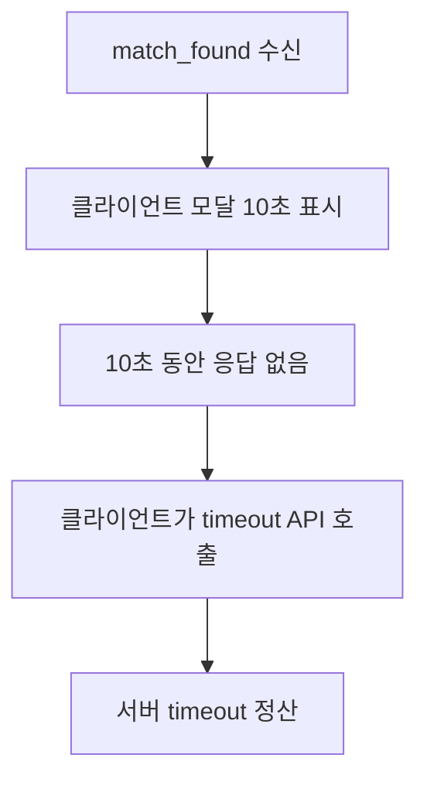
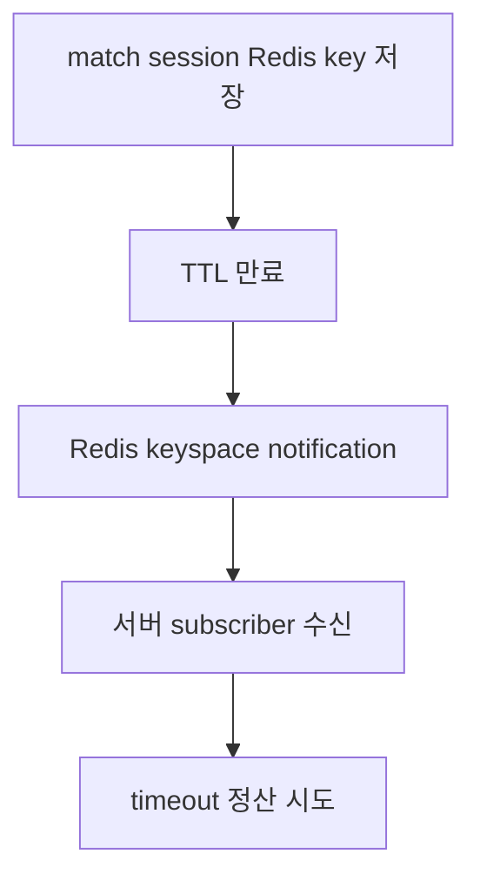
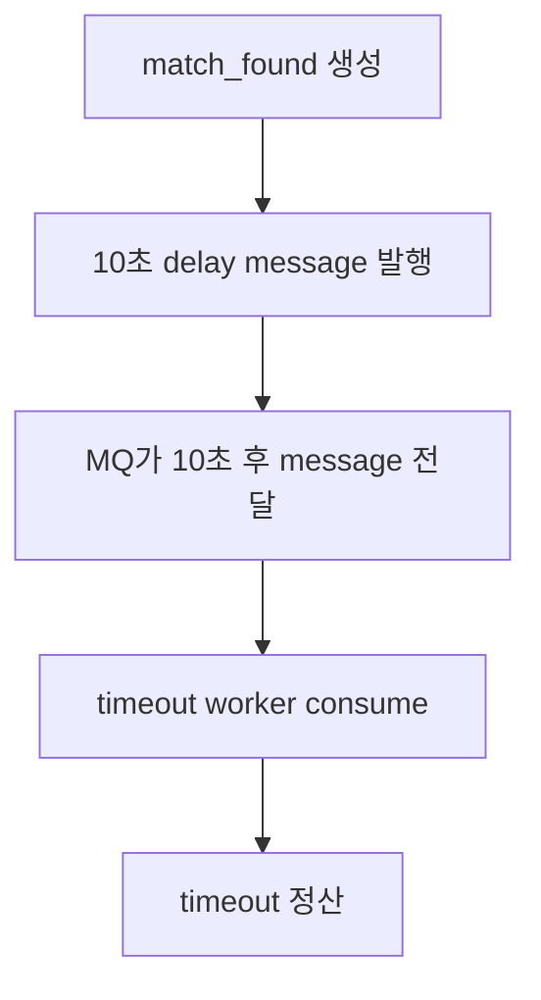
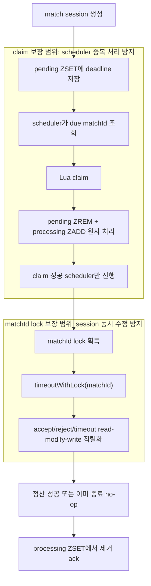
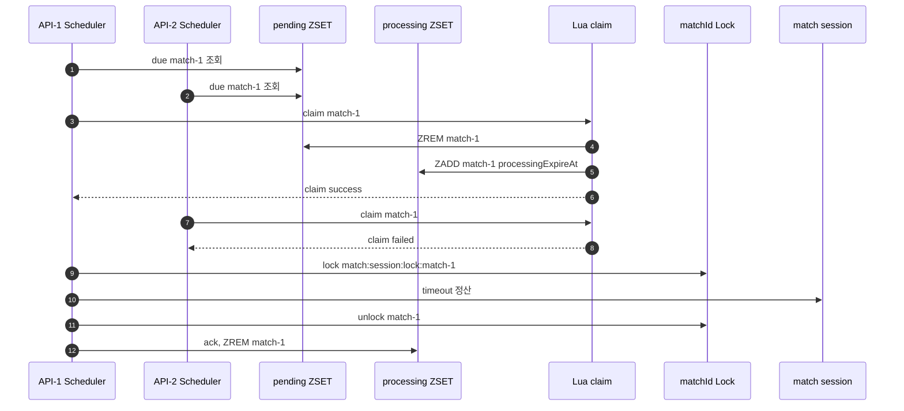
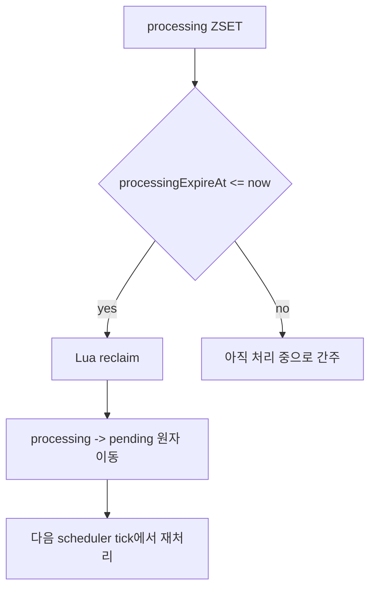
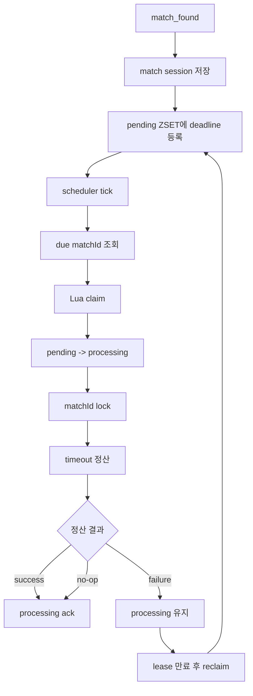

# Issue-32: Match response timeout settlement

## 📌 Feature Description

매칭 성사 후 10초 안에 수락/거절 응답을 완료하지 않은 유저를 timeout으로 정산하는 로직을 구현합니다.

현재 issue-30에서 accept/reject API와 유저별 응답 상태(`PENDING`, `ACCEPTED`, `REJECTED`, `TIMEOUT`)는 구현되어 있습니다. 이번 이슈는 10초 응답 윈도우가 끝났을 때 남아 있는 `PENDING` 유저를 `TIMEOUT`으로 처리하고, 정책에 따라 수락한 유저는 기존 `entryTime`으로 큐 최우선 복귀시키는 작업입니다.

핵심 정책은 다음과 같습니다.

- 양쪽 모두 `ACCEPTED`면 이미 매칭 성공 처리되므로 timeout 정산 대상이 아닙니다.
- `ACCEPTED + PENDING`이면 `PENDING` 유저는 `TIMEOUT`, `ACCEPTED` 유저는 기존 `entryTime`으로 큐 복귀합니다.
- `REJECTED + PENDING`이면 `PENDING` 유저는 `TIMEOUT`, 두 유저 모두 큐에서 이탈합니다.
- `PENDING + PENDING`이면 두 유저 모두 `TIMEOUT` 처리하고 큐에서 이탈합니다.
- timeout 정산도 accept/reject와 동일하게 `matchId` 기준 Redis lock으로 직렬화합니다.

### timeout trigger 후보 흐름

#### 1. 클라이언트가 timeout API 호출



#### 2. Redis TTL 만료 이벤트 사용



#### 3. Message Queue / Delayed Queue 사용



#### 4. Redis ZSET deadline index + 서버 scheduler + Lua claim 사용



역할은 분리됩니다.

- Lua claim: 여러 scheduler 중 하나만 timeout job을 가져가게 합니다.
- matchId lock: accept/reject/timeout이 같은 match session을 동시에 수정하지 못하게 합니다.



processing 중 서버가 죽으면 job은 processing ZSET에 남습니다. processing 만료 시간이 지나면 복구 scheduler가 다시 pending으로 이동시켜 재처리할 수 있습니다.



## 📚 Tasks

### 1. timeout 추적 구조 설계

- [x] timeout 대상 matchId를 관리할 Redis 자료구조 결정
  - `match:response:timeout:pending` ZSET
    - score: timeout deadline epoch millis
    - member: matchId
  - `match:response:timeout:processing` ZSET
    - score: processing expire epoch millis
    - member: matchId
- [x] pending/processing 이동을 Lua script로 원자 처리
- [x] processing에 남은 작업을 pending으로 복구하는 reclaim 정책 정의
- [x] 세션 TTL 60분과 응답 제한 10초의 관계 정리
- [x] timeout 처리 완료/세션 완료 시 pending/processing index 제거 정책 정의
- [x] timeout 관련 상수 위치 정리
  - 응답 제한 시간 10초
  - session TTL 60분
  - scheduler batch size
  - processing lease 시간
- [x] 시간 계산은 테스트 가능하도록 현재 시각 주입 방식 검토

#### 설계 결과

- timeout 대상은 단일 ZSET이 아니라 `pending` / `processing` ZSET으로 분리합니다.
  - `pending`: 아직 scheduler가 가져가지 않은 timeout 후보
  - `processing`: scheduler가 claim 후 처리 중인 timeout 후보
- `pending -> processing` 이동은 Lua script로 원자 처리합니다.
  - 여러 API 인스턴스 scheduler가 같은 due matchId를 조회해도 하나만 claim에 성공합니다.
  - claim은 scheduler 간 timeout job 중복 처리를 줄이는 역할입니다.
- `processing -> pending` 복구도 Lua script로 원자 처리합니다.
  - claim 후 서버가 죽으면 matchId는 processing에 남습니다.
  - `processingExpireAt`이 지난 job은 reclaim 대상이 되고, 다음 scheduler tick에서 재처리됩니다.
- session 동시 수정은 여전히 `match:session:lock:{matchId}`로 보호합니다.
  - claim은 timeout scheduler 간 중복 처리 방지입니다.
  - lock은 accept/reject/timeout이 같은 session을 동시에 read-modify-write 하지 못하게 하는 보호 장치입니다.
- 시간 정책은 기존 프로젝트 정책을 따릅니다.
  - 클라이언트 응답 윈도우: 10초
  - Redis match session TTL: 60분
  - TTL 60분은 cleanup 실패 대비 안전장치이며, 10초 응답 윈도우와 별도 정책입니다.
- 상수는 `MatchingConstants`를 우선 확장합니다.
  - `MATCH_SESSION_TTL_SECONDS = 3600`으로 둡니다.
  - timeout 응답 제한 시간, timeout ZSET key, Lua script path는 matching 모듈 공통 상수로 둡니다.
  - scheduler interval, batch size, processing lease time은 운영 조정 가능성이 있어 설정값 분리도 함께 검토합니다.
- timeout deadline 계산은 테스트 가능해야 하므로 `Clock` 주입을 사용합니다.
  - `league-of-star-api`의 `ClockConfig`에 의존하지 않습니다.
  - `league-of-star-matching` 모듈에 `@ConditionalOnMissingBean(Clock.class)` 기반 Clock 설정을 추가합니다.
  - core 모듈에는 Spring config를 두지 않습니다.
  - matching 모듈 timeout 구현에서는 `System.currentTimeMillis()` 직접 호출을 피하고 `clock.millis()` 기준으로 계산합니다.
- timeout index cleanup 정책은 다음과 같습니다.
  - 매칭이 최종 `ACCEPTED` 또는 `DECLINED`로 끝나면 pending/processing 양쪽에서 제거를 시도합니다.
  - cleanup 실패는 accept/reject API 성공을 깨지 않습니다.
  - 남은 timeout job은 scheduler가 나중에 claim 후 session 상태를 보고 no-op/ack로 정리합니다.

### 2. timeout index 저장소 구현

- [x] `MatchTimeoutStore` 포트 추가
  - matching service/scheduler는 Redis 구현체에 직접 의존하지 않음
- [x] `RedisMatchTimeoutStore` 구현
  - Lua script와 Redis ZSET 명령은 infrastructure에 격리
- [x] due pending matchId 조회
- [x] Lua claim 구현
  - pending에 있는 due matchId만 processing으로 이동
  - 이미 다른 scheduler가 가져간 matchId는 claim 실패 처리
- [x] Lua reclaim 구현
  - processing 만료 시간이 지난 matchId를 pending으로 복구
- [x] 처리 완료된 matchId ack 제거
  - processing ZSET에서 제거
- [x] 세션이 먼저 완료된 경우 pending/processing cleanup
  - pending과 processing 둘 다 제거 시도
- [x] batch size 정책 결정
- [x] Lua script 파일 경로와 로딩 방식 결정
- [x] Redis 통합 테스트 작성

#### 구현 결과

- `MatchTimeoutStore` 포트를 추가했습니다.
  - 위치: `league-of-star-matching/src/main/java/com/sang/leagueofstar/matching/repository/MatchTimeoutStore.java`
  - matching service/scheduler는 timeout index 저장소를 포트로 의존합니다.
- `RedisMatchTimeoutStore` 구현체를 추가했습니다.
  - 위치: `league-of-star-matching/src/main/java/com/sang/leagueofstar/matching/infrastructure/RedisMatchTimeoutStore.java`
  - Redis ZSET과 Lua script 실행은 infrastructure에 격리했습니다.
- timeout ZSET key와 Lua script path를 `MatchingConstants`에 추가했습니다.
  - `match:response:timeout:pending`
  - `match:response:timeout:processing`
  - `scripts/timeout_claim.lua`
  - `scripts/timeout_reclaim.lua`
- `timeout_claim.lua`를 추가했습니다.
  - pending에 matchId가 있고 deadline이 지났을 때만 claim 성공
  - claim 성공 시 `pending ZREM + processing ZADD`를 Redis 안에서 원자 처리
- `timeout_reclaim.lua`를 추가했습니다.
  - processing에 matchId가 있고 lease가 만료되었을 때만 reclaim 성공
  - reclaim 성공 시 `processing ZREM + pending ZADD`를 Redis 안에서 원자 처리
- timeout ZSET과 Lua script 실행은 `StringCodec`으로 통일했습니다.
  - script ARGV 숫자 비교와 ZSET member 조회가 같은 codec 기준으로 동작해야 하기 때문입니다.
- Redis 통합 테스트를 추가했습니다.
  - due pending 조회
  - batch size 제한
  - claim 성공
  - 중복 claim 실패
  - deadline 이전 claim 실패
  - ack 제거
  - pending/processing cleanup
  - expired processing reclaim
  - lease 만료 전 reclaim 실패
- 검증 명령:
  - `:league-of-star-matching:test`

### 3. MatchFoundService timeout 등록

- [x] 매칭 세션 생성 시 timeout deadline 등록
- [x] `createdAt + 10_000ms` 기준으로 pending ZSET에 저장
- [x] 세션 저장 성공 후 timeout index 등록 순서 보장
- [x] 기존 `match_found` 이벤트 발행 흐름 유지

#### 구현 결과

- `MatchFoundService`에서 매칭 세션 저장 직후 timeout pending index를 등록하도록 연결했습니다.
  - `sessionStore.save(...)`
  - `timeoutStore.addPending(matchId, deadlineMillis)`
  - `eventPublisher.publishEvent(...)`
- timeout deadline은 `clock.millis() + MATCH_RESPONSE_TIMEOUT_SECONDS * 1000L` 기준으로 계산합니다.
  - 테스트 가능성을 위해 `System.currentTimeMillis()` 직접 호출을 사용하지 않습니다.
- `league-of-star-matching` 모듈에 `MatchingClockConfig`를 추가했습니다.
  - `@ConditionalOnMissingBean(Clock.class)`로 기본 Clock을 제공합니다.
  - `league-of-star-api`의 Clock 설정에 의존하지 않습니다.
  - core 모듈에는 Spring config를 추가하지 않았습니다.
- 기존 `match_found` 이벤트 발행 흐름은 유지했습니다.
  - 이벤트 payload의 `acceptTimeoutSeconds`는 `MATCH_RESPONSE_TIMEOUT_SECONDS` 상수를 사용합니다.
- `MatchFoundServiceTest`를 보강했습니다.
  - timeout pending index 등록 검증
  - deadline 계산 검증
- 테스트 전용 `TestMatchingApplication`의 중복 Clock bean은 제거했습니다.
  - matching 모듈 기본 Clock 설정을 테스트에서도 사용합니다.
- 검증 명령:
  - `:league-of-star-matching:test`

### 4. MatchResponseResultService timeout 정산 구현

- [x] `timeoutWithLock(matchId)` 추가
- [x] accept/reject와 동일한 `match:session:lock:{matchId}` 사용
- [x] `FOUND` 상태 세션만 timeout 정산
- [x] `PENDING` 유저를 `TIMEOUT`으로 변경
- [x] `ACCEPTED` 유저는 기존 `entryTime`으로 큐 복귀
- [x] `REJECTED`/`TIMEOUT` 유저는 큐 이탈
- [x] 세션 status를 `TIMEOUT`으로 변경
- [x] 이미 `ACCEPTED`/`DECLINED`/`TIMEOUT`인 세션은 no-op 처리
- [x] 세션 없음/TTL 만료 케이스는 no-op 가능 여부 결정 후 index 정리
- [x] timeout 정산 로직이 accept/reject의 큐 복귀 정책과 중복되지 않도록 공통 helper 정리

#### 구현 결과

- `MatchSession`에 timeout 도메인 메서드를 추가했습니다.
  - `hasPendingResponse()`
  - `timeoutPendingUsers()`
- `MatchResponseResultService.timeoutWithLock(matchId)`를 추가했습니다.
  - accept/reject와 동일한 `match:session:lock:{matchId}` 분산락을 사용합니다.
  - 세션이 없거나 이미 최종 상태이면 no-op 처리합니다.
  - `FOUND` 상태이고 `PENDING` 응답이 남아 있는 세션만 timeout 정산합니다.
- timeout 정산 정책은 다음과 같이 구현했습니다.
  - `PENDING` 유저 응답 상태는 `TIMEOUT`으로 변경
  - 세션 status는 `TIMEOUT`으로 저장
  - `ACCEPTED` 유저는 기존 `entryTime`으로 큐 복귀
  - `REJECTED`/`TIMEOUT` 유저는 큐 이탈
- 수락 유저 큐 복귀와 이탈 처리는 기존 실패 정산 helper를 재사용했습니다.
  - accept/reject 실패 정산과 timeout 실패 정산의 큐 정책이 갈라지지 않도록 유지합니다.
- `MatchResponseResultServiceTest`를 보강했습니다.
  - `ACCEPTED + PENDING` timeout
  - `REJECTED + PENDING` timeout
  - `PENDING + PENDING` timeout
  - 이미 종료된 세션 timeout no-op
  - 없는 세션 timeout no-op
- 검증 명령:
  - `:league-of-star-core:test`
  - `:league-of-star-matching:test`

### 5. accept/reject 완료 시 timeout index 정리

- [x] 양쪽 accept로 `ACCEPTED` 된 경우 timeout index 제거
- [x] accept/reject 조합은 즉시 정산하지 않고 deadline 정산까지 timeout index 유지
- [x] 한쪽만 응답해 `FOUND`가 유지되는 경우 timeout index 유지
- [x] timeout scheduler가 이미 claim한 뒤라면 timeout 정산 쪽에서 lock 획득 후 no-op/ack 처리
- [x] accept/reject 완료 후 timeout index cleanup 실패 시 API 성공은 유지
  - 로그/지표로 관측
  - scheduler가 나중에 no-op/ack로 후속 정리

#### 구현 결과

- `MatchResponseResultService`에 `MatchTimeoutStore`를 주입했습니다.
- 최종 `ACCEPTED` 정산 시 timeout index를 cleanup합니다.
  - 양쪽 accept 완료 후 `timeoutStore.cleanup(matchId)` 호출
- accept/reject 조합 또는 양쪽 reject 조합은 즉시 cleanup하지 않습니다.
  - 둘 다 수락이 아닌 실패 조합은 10초 deadline 정산 시점에 최종 결과를 확정합니다.
- 한쪽만 응답해 세션이 `FOUND`로 유지되는 경우 timeout index는 유지합니다.
  - 남은 유저가 10초 응답 윈도우 안에 계속 응답할 수 있어야 하기 때문입니다.
- cleanup 실패는 accept/reject 성공을 깨지 않습니다.
  - cleanup 예외는 warn 로그로 남기고 삼킵니다.
  - timeout scheduler가 나중에 해당 matchId를 claim하더라도 session 최종 상태를 보고 no-op/ack로 정리할 수 있습니다.
- `MatchResponseResultServiceTest`를 보강했습니다.
  - 한쪽 accept만 반영된 경우 cleanup 미호출
  - 양쪽 accept 완료 시 cleanup 호출
  - 한쪽 reject만 반영된 경우 cleanup 미호출
  - accept/reject 조합은 deadline 전 cleanup 미호출
  - cleanup 실패가 accept 성공을 깨지 않는지 검증
- 검증 명령:
  - `:league-of-star-matching:test`

### 6. timeout scheduler 구현

- [x] scheduler 활성화 설정 추가
  - interval
  - batch size
  - processing lease time
- [x] 주기적으로 due pending matchId 조회
- [x] due matchId별 Lua claim 시도
- [x] claim 성공한 matchId만 timeout 정산 호출
- [x] timeout 정산 성공 또는 no-op 후 processing ack 제거
- [x] processing 만료 작업 reclaim 후 다음 tick에서 재시도
- [x] claim은 scheduler 중복 처리를 줄이고, matchId lock은 accept/reject/timeout 경합을 보호하도록 역할 분리
- [x] 개별 matchId 처리 실패가 전체 batch를 중단하지 않도록 처리

#### 구현 결과

- `MatchResponseTimeoutScheduler`를 추가했습니다.
  - 위치: `league-of-star-matching/src/main/java/com/sang/leagueofstar/matching/scheduler/MatchResponseTimeoutScheduler.java`
- scheduler는 `TIMEOUT_SCHEDULER_FIXED_DELAY_MS` 주기로 실행되며, timeout 처리 서비스를 호출하는 트리거 역할만 담당합니다.
  - 현재 값: `1000ms`
- `MatchResponseTimeoutService`를 추가했습니다.
  - 위치: `league-of-star-matching/src/main/java/com/sang/leagueofstar/matching/service/MatchResponseTimeoutService.java`
  - timeout job orchestration은 service에서 담당합니다.
- service 처리 흐름은 다음과 같습니다.
  - `Clock` 기준 현재 시각 조회
  - 만료된 processing job 조회
  - expired processing job reclaim
  - due pending job 조회
  - matchId별 Lua claim 시도
  - claim 성공한 matchId만 `timeoutWithLock(matchId)` 호출
  - timeout 정산 성공 또는 no-op이면 processing ack
  - timeout 정산 실패 시 ack하지 않고 processing lease 만료 후 reclaim 대상이 되도록 유지
- 역할 분리를 유지했습니다.
  - scheduler: 주기적 실행 트리거
  - service: timeout job claim/reclaim/ack orchestration
  - Lua claim/reclaim: scheduler 간 timeout job 소유권 처리
  - `matchId` lock: accept/reject/timeout 간 session 동시 수정 보호
- 개별 matchId 처리 실패는 warn 로그로 남기고 같은 batch의 다음 matchId 처리를 계속합니다.
- `MatchResponseTimeoutSchedulerTest`를 추가했습니다.
  - scheduler가 timeout 처리 서비스를 호출하는지 검증
- `MatchResponseTimeoutServiceTest`를 추가했습니다.
  - claim 성공 시 timeout 정산 후 ack
  - claim 실패 시 timeout 정산/ack 미호출
  - timeout 정산 실패 시 ack 미호출
  - expired processing reclaim
  - batch 일부 실패 시 나머지 처리 계속
- 검증 명령:
  - `:league-of-star-matching:test`

### 7. 테스트 작성

- [x] `MatchSession` timeout 상태 변경 domain unit test
- [x] `MatchResponseResultService` timeout service unit test
- [x] A accept, B pending → timeout 시 A 큐 복귀, B timeout
- [x] A reject, B pending → timeout 시 둘 다 큐 이탈
- [x] A/B pending → timeout 시 둘 다 큐 이탈
- [x] 이미 `ACCEPTED` 세션 timeout → no-op
- [x] 이미 `DECLINED` 세션 timeout → no-op
- [x] 세션 없음 timeout → no-op 또는 index 정리
- [x] timeout과 accept/reject 경합 케이스 검증
- [x] `RedisMatchTimeoutStore` Redis/Testcontainers 통합 테스트
- [x] 여러 scheduler가 같은 due matchId를 조회해도 하나만 claim 성공
- [x] claim 후 서버 crash 상황에서 processing reclaim 가능
- [x] scheduler batch 처리 중 일부 실패해도 나머지 처리 계속되는지 검증

#### 구현 결과

- `MatchSessionTest`를 보강했습니다.
  - `timeoutPendingUsers()`가 미응답 참여자만 `TIMEOUT`으로 변경하는지 검증
- `MatchResponseResultServiceTest`를 보강했습니다.
  - `ACCEPTED + PENDING` timeout 시 수락 유저 큐 복귀
  - `REJECTED + PENDING` timeout 시 두 유저 큐 이탈
  - `PENDING + PENDING` timeout 시 두 유저 timeout/큐 이탈
  - 이미 `ACCEPTED` 세션 timeout no-op
  - 이미 `DECLINED` 세션 timeout no-op
  - 세션 없음 timeout no-op
  - timeout이 먼저 세션을 종료한 뒤 accept가 들어오면 `MATCH_SESSION_TIMEOUT` 예외
- `RedisMatchTimeoutStoreTest`를 추가했습니다.
  - due pending 조회
  - batch size 제한
  - Lua claim 성공
  - 중복 claim 실패
  - deadline 이전 claim 실패
  - ack 제거
  - pending/processing cleanup
  - expired processing reclaim
  - lease 만료 전 reclaim 실패
- `MatchResponseTimeoutServiceTest`를 추가했습니다.
  - claim 성공 시 timeout 정산 후 ack
  - claim 실패 시 timeout 정산/ack 미호출
  - timeout 정산 실패 시 ack 미호출
  - expired processing reclaim
  - batch 일부 실패 시 나머지 처리 계속
- `MatchResponseTimeoutSchedulerTest`를 추가했습니다.
  - scheduler가 timeout 처리 서비스를 호출하는지 검증
- 검증 명령:
  - `:league-of-star-core:test`
  - `:league-of-star-matching:test`

### 8. 관측 지표 및 부하 테스트

- [x] issue-30에서 보류한 accept/reject 기본 지표 반영
  - accept API 호출 수
  - accept 성공/실패 수
  - reject API 호출 수
  - reject 성공/실패 수
  - 양쪽 수락 완료 수
  - 세션 만료/없음 실패 수
  - lock 획득 실패 수
- [x] timeout 처리 수
- [x] timeout 성공/실패 수
- [x] timeout no-op 처리 수
- [x] timeout으로 큐 복귀한 유저 수
- [x] timeout scheduler 처리량/backlog 지표
- [x] pending/processing backlog 지표
- [x] claim 성공/실패 수
- [x] reclaim 처리 수
- [x] scheduler scan duration / batch processing duration 지표
- [x] timeout deadline 대비 실제 처리 지연 시간 지표
- [x] accept/reject/timeout 경합 부하 테스트 작성

#### 구현 결과

- `MatchResponseMetrics`와 `MatchResponseMetricNames`를 추가했습니다.
  - metric 이름과 tag key를 상수화해 PromQL/Grafana 작성 시 magic string을 줄였습니다.
  - 같은 metric name은 동일한 tag key set을 사용하도록 맞췄습니다.
- accept/reject 명령 경계 지표를 추가했습니다.
  - `match.response.requests`
    - tags: `action`, `result`, `reason`
    - Prometheus: `match_response_requests_total`
  - `match.response.lock.failures`
    - tags: `action`
    - Prometheus: `match_response_lock_failures_total`
- 최종 세션 완료 지표를 추가했습니다.
  - `match.response.completions`
    - tags: `result=accepted|declined`
    - Prometheus: `match_response_completions_total`
- timeout 정산 지표를 추가했습니다.
  - `match.response.timeout.settlements`
    - tags: `outcome=success|failure|no_op`
    - Prometheus: `match_response_timeout_settlements_total`
  - `match.response.timeout.queue_returned.users`
    - Prometheus: `match_response_timeout_queue_returned_users_total`
- timeout job 처리 지표를 추가했습니다.
  - `match.response.timeout.claims`
    - tags: `outcome=claimed|skipped`
    - Prometheus: `match_response_timeout_claims_total`
  - `match.response.timeout.reclaims`
    - tags: `outcome=reclaimed|skipped|failure`
    - Prometheus: `match_response_timeout_reclaims_total`
  - `match.response.timeout.batch.duration`
    - Prometheus: `match_response_timeout_batch_duration_seconds`
  - `match.response.timeout.processing.delay`
    - Prometheus: `match_response_timeout_processing_delay_seconds`
- timeout backlog gauge를 추가했습니다.
  - `match.response.timeout.pending.backlog`
    - Prometheus: `match_response_timeout_pending_backlog`
  - `match.response.timeout.processing.backlog`
    - Prometheus: `match_response_timeout_processing_backlog`
  - `match.response.timeout.overdue.pending`
    - Prometheus: `match_response_timeout_overdue_pending`
- `MatchTimeoutStore`에 backlog gauge용 조회 메서드를 추가했습니다.
  - `pendingSize()`
  - `processingSize()`
  - `overduePendingSize(nowMillis)`
  - `deadlineOfPending(matchId)`
- Grafana 대시보드를 갱신했습니다.
  - 매칭 엔진 대시보드: `docs/grafana/league-of-star-match-queue-dashboard.json`
  - 매칭 응답 전용 대시보드: `docs/grafana/league-of-star-match-response-dashboard.json`
  - 엔진 대시보드에서는 `match_response_*` 패널을 제거했습니다.
  - 응답 대시보드는 accept/reject와 timeout 운영 질문을 분리해서 확인하도록 구성했습니다.
  - 추가 패널:
    - 수락/거절 요청 처리량
    - 수락/거절 실패율
    - 최종 완료 상태
    - matchId Lock 실패
    - Timeout Backlog
    - Timeout Claim/Reclaim
    - Timeout 정산 결과
    - Timeout 큐 복귀 유저
    - Timeout 정산 지연
    - Timeout Batch 소요 시간
- 지표 수집 검증 테스트를 추가했습니다.
  - `MatchResponseMetricsTest`: `SimpleMeterRegistry` 기준 counter/gauge/timer 값 검증
  - `MatchResponsePrometheusMetricsTest`: `/actuator/prometheus` 응답에 새 Prometheus metric이 실제 노출되는지 검증
- 부하 테스트 확인 기준은 Grafana/Prometheus에서 다음 PromQL로 확인합니다.
  - `sum by (action, result) (rate(match_response_requests_total[1m]))`
  - `sum(rate(match_response_requests_total{result="failure"}[5m])) / clamp_min(sum(rate(match_response_requests_total{result="attempt"}[5m])), 0.001) * 100`
  - `sum(match_response_timeout_pending_backlog)`
  - `sum(match_response_timeout_processing_backlog)`
  - `sum by (outcome) (rate(match_response_timeout_claims_total[1m]))`
  - `sum by (outcome) (rate(match_response_timeout_settlements_total[1m]))`
  - `histogram_quantile(0.95, sum(rate(match_response_timeout_processing_delay_seconds_bucket[5m])) by (le))`
- Grafana 연동 검증을 수행했습니다.
  - 두 Grafana JSON 파일 모두 `json.tool` 기준 유효한 JSON입니다.
  - 매칭 엔진 대시보드에는 `match_response_*` 참조가 남아 있지 않습니다.
  - 매칭 응답 대시보드가 참조하는 `match_response_*` metric은 모두 `MatchResponseMetricNames` 기반 Prometheus 이름과 일치합니다.
  - timer metric은 `publishPercentileHistogram()`을 사용해 `_bucket` 기반 p95 PromQL과 연결됩니다.
- 검증 명령:
  - `:league-of-star-core:test`
  - `:league-of-star-matching:test`
  - `:league-of-star-api:test`

### 9. 문서 갱신

- [x] `docs/project/policy.md` timeout 정산 정책 확인
- [x] `docs/project/matching.md` timeout scheduler/index 구조 반영
- [x] issue-30에서 후속 이슈로 남긴 timeout note와 정합성 확인

#### 구현 결과

- `docs/project/policy.md`에 서버 timeout 정산 정책을 보강했습니다.
  - `ACCEPTED + PENDING`
  - `REJECTED + PENDING`
  - `PENDING + PENDING`
  - 서버 scheduler / Lua claim / matchId lock 역할
- `docs/project/matching.md`에 timeout index와 scheduler 구조를 반영했습니다.
  - `match:response:timeout:pending`
  - `match:response:timeout:processing`
  - pending -> processing claim
  - processing reclaim
  - timeout 정산 지표
- issue-30 문서의 timeout 후속 note를 issue-32 구현 완료 상태와 일치하도록 갱신했습니다.

### 10. 최종 검증

- [x] `:league-of-star-core:test`
- [x] `:league-of-star-matching:test`
- [x] `:league-of-star-api:test`
- [x] 기존 accept/reject API 회귀 확인
- [x] 기존 `match_found` SSE 흐름 회귀 확인

#### 검증 결과

- 전체 모듈 테스트 통과
  - `./gradlew :league-of-star-core:test :league-of-star-matching:test :league-of-star-api:test`
- accept/reject API 및 `match_found` SSE 회귀 테스트 재실행 통과
  - `MatchControllerTest`
  - `MatchControllerRestDocsTest`
  - `MatchResponseServiceTest`
  - `MatchFoundSseSenderTest`
  - `MatchNotificationServiceTest`
  - `MatchFoundPubSubSubscriberTest`
  - `MatchFoundPubSubPublisherTest`
- matching timeout 핵심 테스트 재실행 통과
  - `MatchResponseResultServiceTest`
  - `MatchResponseCommandServiceTest`
  - `MatchResponseTimeoutServiceTest`
  - `MatchFoundServiceTest`
  - `RedisMatchTimeoutStoreTest`
  - `MatchResponseMetricsTest`

## 📝 Note

### timeout trigger 방식 비교

#### 1. 클라이언트 timeout API 호출

클라이언트가 모달 10초 타이머가 끝났을 때 서버에 timeout API를 호출하는 방식입니다.

장점:

- 구현이 단순해 보입니다.
- 클라이언트 모달 타이머와 timeout 호출 시점이 직관적으로 맞습니다.

단점:

- 브라우저가 닫히거나 네트워크가 끊기면 timeout 호출이 오지 않습니다.
- 악의적 클라이언트가 timeout 호출을 보내지 않을 수 있습니다.
- 서버가 10초 정산을 책임진다고 보기 어렵습니다.

결론:

- primary timeout trigger로는 사용하지 않습니다.
- 클라이언트는 화면 표시만 담당하고, timeout 정산은 서버가 책임지는 방향이 맞습니다.

#### 2. Redis TTL 만료 이벤트

Redis key가 만료될 때 발생하는 keyspace notification을 받아 timeout을 처리하는 방식입니다.

장점:

- TTL과 timeout이 자연스럽게 연결되어 보입니다.
- 별도 timeout index가 없어도 될 것처럼 보입니다.

단점:

- Redis keyspace notification 설정이 필요합니다.
- 이벤트 전달 보장이 강하지 않습니다.
- subscriber가 죽어 있으면 이벤트를 놓칠 수 있습니다.
- key가 만료된 뒤에는 정산에 필요한 세션 데이터가 이미 사라졌을 수 있습니다.
- 현재 세션 TTL은 60분이고 정책 timeout은 10초라 정확히 같은 개념이 아닙니다.

결론:

- timeout 정산 trigger로 쓰기에는 위험합니다.
- 세션 cleanup 보조 용도 정도로만 고려합니다.

#### 3. Message Queue / Delayed Queue

match_found 시점에 10초 delayed message를 넣고, worker가 메시지를 받아 timeout을 처리하는 방식입니다.

장점:

- 이벤트 기반에 가깝습니다.
- Kafka, RabbitMQ, SQS 같은 도구를 쓰면 재시도와 DLQ를 설계하기 좋습니다.
- 멀티 인스턴스 worker 구조와 잘 맞습니다.

단점:

- 현재 프로젝트에 별도 MQ가 없습니다.
- 인프라와 운영 복잡도가 커집니다.
- Redis로 delayed queue를 직접 만들면 결국 ZSET + scheduler와 비슷해집니다.

결론:

- 대규모 운영 단계에서는 좋은 선택지가 될 수 있습니다.
- 현재 V1에서는 Redis만으로 해결하는 편이 단순합니다.

#### 4. Redis ZSET deadline index + 서버 scheduler + Lua claim

timeout 대상 matchId를 Redis ZSET에 deadline 기준으로 저장하고, 서버 scheduler가 due matchId를 조회해 정산하는 방식입니다.

처음에는 단순히 `due 조회 -> matchId lock -> timeout 정산 -> index 제거` 흐름도 가능해 보입니다. 하지만 멀티 인스턴스에서는 여러 scheduler가 같은 due matchId를 동시에 볼 수 있습니다.

```text
API-1 Scheduler: match-1 due 조회
API-2 Scheduler: match-1 due 조회
API-3 Scheduler: match-1 due 조회
```

Lua claim이 없으면 세 서버가 모두 `matchId lock` 획득을 시도합니다. 최종 정산은 lock 때문에 하나만 성공하더라도, 나머지 서버는 불필요하게 lock 대기/실패/no-op 처리를 반복합니다.

```text
Lua claim 미적용 시 문제:
- 같은 timeout job을 여러 scheduler가 동시에 처리하려고 함
- lock 경합이 늘어남
- timeout backlog가 많아질수록 불필요한 재시도 비용이 커짐
- 어떤 서버가 처리 중인지 Redis 자료구조만 보고 알기 어려움
- 단순 ZREM으로 먼저 제거하면 서버 crash 시 timeout job이 유실될 수 있음
```

그래서 이번 이슈에서는 Lua claim을 적용합니다. claim은 timeout 정산 자체가 아니라, “이 timeout job은 한 scheduler만 처리하라”는 작업 소유권을 Redis에서 먼저 정리하는 단계입니다.

이번 이슈에서는 단일 ZSET이 아니라 `pending ZSET`과 `processing ZSET`을 나눕니다.

```text
pending    = 아직 아무 scheduler도 가져가지 않은 timeout 후보
processing = 어떤 scheduler가 처리 중이라고 표시한 timeout 후보
```

전체 흐름은 다음과 같습니다.

```text
1. match_found 생성
2. pending ZSET에 matchId와 timeout deadline 저장
3. scheduler가 deadline이 지난 matchId 조회
4. Lua claim으로 pending -> processing 원자 이동
5. claim에 성공한 scheduler만 matchId lock 획득
6. timeout 정산
7. 성공 또는 이미 종료 no-op이면 processing에서 ack 제거
8. 처리 중 서버가 죽으면 processing 만료 후 pending으로 reclaim
```

장점:

- 현재 매칭 시스템이 이미 Redis를 중심으로 동작하므로 구조가 잘 맞습니다.
- 10초 timeout deadline과 60분 session TTL을 분리해서 관리할 수 있습니다.
- 서버가 timeout 정산을 책임집니다.
- 멀티 인스턴스에서도 Lua claim으로 같은 timeout job을 한 서버만 가져가게 할 수 있습니다.
- `matchId` lock으로 accept/reject/timeout이 같은 세션을 동시에 수정하지 못하게 막을 수 있습니다.
- processing ZSET이 있어 claim 후 서버가 죽어도 reclaim으로 복구할 수 있습니다.
- timeout backlog, 처리량, 지연 시간을 지표로 관측하기 좋습니다.

단점:

- scheduler polling이 필요합니다.
- scheduler 지연이 생기면 timeout 정산도 늦어질 수 있습니다.
- pending/processing/reclaim 구조가 단일 ZSET보다 복잡합니다.
- Lua script 테스트와 Redis 통합 테스트가 필요합니다.

결론:

- V1에서는 이 방식을 우선 채택합니다.
- 구현 방향은 `due 조회 -> Lua claim -> matchId lock -> timeout 정산 -> 성공/no-op 후 ack`입니다.
- 서버 crash 복구는 `processing 만료 조회 -> Lua reclaim -> pending 복귀 -> 다음 tick 재처리`로 처리합니다.

### claim과 lock의 차이

claim은 여러 서버 중 “이 timeout job은 내가 처리하겠다”고 표시하는 단계입니다.

예를 들어 API 서버가 2대면 둘 다 같은 `match-1` timeout 대상을 볼 수 있습니다.

```text
API-1: match-1 발견
API-2: match-1 발견
```

claim이 없으면 둘 다 처리하려고 합니다. 그래도 `matchId` lock이 있으면 최종 정산은 하나만 됩니다. 다만 불필요한 lock 대기와 실패가 늘어납니다.

이번 이슈에서는 단순 `ZREM` claim을 쓰지 않습니다.

```text
API-1: ZREM match-1 -> 1  // 처리권 획득
API-2: ZREM match-1 -> 0  // 이미 누가 가져감
```

하지만 `ZREM`을 먼저 하고 서버가 죽으면 문제가 생깁니다.

```text
API-1: ZREM 성공
API-1: timeout 정산 전에 crash
match-1은 index에서 사라졌는데 정산은 안 됨
```

그래서 pending에서 바로 제거하고 끝내지 않고, Lua script로 processing에 옮깁니다.

```text
1. pending에 match-1 존재
2. API-1이 Lua claim 성공
3. Redis 안에서 pending ZREM + processing ZADD를 한 번에 수행
4. API-2가 같은 match-1 claim 시도
5. pending에 없으므로 claim 실패
```

이렇게 하면 scheduler끼리는 같은 timeout job을 중복 처리하지 않습니다.

다만 claim은 scheduler끼리의 중복만 막습니다. 유저의 accept/reject API는 claim 대상이 아닙니다.

```text
API-1 Scheduler: match-1 timeout claim 성공
API-2 User API:  match-1 accept 요청
```

이 두 요청은 같은 match session을 수정합니다. 그래서 `matchId` lock은 여전히 필요합니다.

```text
claim이 보장하는 것:
- 여러 scheduler 중 하나만 timeout job을 가져간다.

matchId lock이 보장하는 것:
- accept/reject/timeout이 같은 session을 동시에 read-modify-write 하지 못한다.
- 10초 경계에서 accept와 timeout이 동시에 들어와도 session 상태가 한 번에 하나씩만 바뀐다.
```

### crash 복구

claim 후 서버가 죽으면 matchId는 processing ZSET에 남습니다.

```text
1. API-1이 Lua claim 성공
2. match-1이 processing으로 이동
3. API-1이 timeout 정산 전에 crash
4. match-1은 processing에 남아 있음
5. processingExpireAt이 지나면 reclaim 대상
6. Lua reclaim으로 processing -> pending 복구
7. 다음 scheduler tick에서 다시 claim 후 처리
```

이 구조는 단순히 pending에서 제거하는 방식보다 안전합니다. 작업을 누가 가져갔는지 표시하면서도, 처리 중 죽었을 때 다시 살릴 수 있기 때문입니다.

## PR

## 📌 Summary

매칭 성사 후 10초 안에 응답하지 않은 유저를 서버가 timeout으로 정산하도록 구현했습니다.

핵심 구조는 `match_found` 시점에 timeout deadline을 Redis ZSET에 등록하고, 서버 scheduler가 due matchId를 claim한 뒤 `matchId` lock 안에서 accept/reject와 같은 세션을 안전하게 정산하는 방식입니다.



정산 정책은 다음과 같습니다.

| 응답 상태 | 결과 |
| :--- | :--- |
| `ACCEPTED + PENDING` | `PENDING` 유저는 `TIMEOUT`, `ACCEPTED` 유저는 기존 `entryTime`으로 큐 복귀 |
| `REJECTED + PENDING` | `PENDING` 유저는 `TIMEOUT`, 두 유저 모두 큐 이탈 |
| `PENDING + PENDING` | 두 유저 모두 `TIMEOUT`, 두 유저 모두 큐 이탈 |
| 이미 종료된 세션 | timeout job은 no-op 후 ack |

## 📚 Changes

### Timeout Index

- timeout 대상 matchId를 Redis ZSET으로 관리했습니다.
  - `match:response:timeout:pending`
  - `match:response:timeout:processing`
- `pending`은 아직 처리되지 않은 timeout 후보입니다.
- `processing`은 scheduler가 claim 후 처리 중인 timeout job입니다.
- 단일 ZSET이 아니라 `pending/processing`을 나눈 이유는 claim 후 서버가 죽어도 job을 유실하지 않기 위해서입니다.

### matchId Lock Only에서 Lua Claim 구조로 발전한 이유

처음 구조는 `matchId` 기준 lock만으로도 timeout 정산의 정합성을 지킬 수 있었습니다.

```text
1. scheduler가 due matchId 조회
2. matchId lock 획득
3. timeout 정산
4. timeout index 제거
```

이 구조에서 lock은 accept/reject/timeout이 같은 session을 동시에 수정하지 못하게 하므로, 최종 세션 상태는 안전합니다.

하지만 멀티 인스턴스 scheduler에서는 다른 문제가 남습니다.

```text
API-1 Scheduler: match-1 due 조회
API-2 Scheduler: match-1 due 조회
API-3 Scheduler: match-1 due 조회
```

세 서버가 모두 같은 timeout job을 보고 `matchId` lock 획득을 시도합니다. 정산은 하나만 성공하더라도 나머지 서버는 불필요하게 lock 대기, lock 실패, session no-op을 반복합니다. timeout backlog가 커질수록 이 비용이 커지고, accept/reject API와 같은 lock 자원을 두고 경합할 수 있습니다.

그래서 구조를 다음처럼 나눴습니다.

```text
job ownership: Lua claim
session consistency: matchId lock
```

Lua claim은 “이 timeout job을 어떤 scheduler가 처리할 것인가”를 먼저 정리합니다. matchId lock은 claim 이후에도 유저 API와 timeout 정산이 같은 session을 동시에 수정하지 못하게 막습니다.

### 시나리오별 문제와 선택 이유

| 시나리오 | 발생 가능한 문제 | 선택한 보호 장치 |
| :--- | :--- | :--- |
| 여러 scheduler가 같은 due matchId를 동시에 조회 | 같은 timeout job에 대해 여러 서버가 lock 경합을 일으킴 | Lua claim으로 하나의 scheduler만 `pending -> processing` 이동 |
| scheduler가 claim 후 timeout 정산 전에 crash | pending에서 제거만 했다면 timeout job 유실 | processing ZSET에 lease와 함께 보관하고 만료 시 reclaim |
| timeout 정산과 유저 accept가 10초 경계에서 동시에 발생 | 같은 session을 read-modify-write 하며 응답 상태가 덮어써질 수 있음 | `matchId` lock으로 accept/reject/timeout 직렬화 |
| 한 명이 reject 후 상대가 10초 안에 accept | reject 즉시 세션 종료하면 후행 accept 유저가 큐 복귀 기회를 잃음 | 세션은 `FOUND` 유지, 유저별 응답 상태 저장 후 timeout/양쪽 응답 시 정산 |
| 한 명이 accept 후 상대가 timeout | accepted 유저는 기존 entryTime으로 큐 복귀해야 함 | session에 tierScore/entryTime 보관 후 timeout 정산에서 큐 재삽입 |
| 이미 accepted/declined/timeout 된 세션의 timeout job이 남음 | scheduler가 뒤늦게 job을 처리하며 잘못된 재정산 가능 | session status 확인 후 no-op, processing ack |

### Lua Claim / Reclaim

- `timeout_claim.lua`
  - due 상태인 matchId만 `pending -> processing`으로 원자 이동합니다.
  - 여러 API 인스턴스 scheduler가 같은 matchId를 봐도 하나만 claim에 성공합니다.
- `timeout_reclaim.lua`
  - processing lease가 만료된 job을 다시 `pending`으로 복구합니다.
  - claim 후 서버가 죽어도 다음 tick에서 재처리할 수 있습니다.

### 왜 matchId Lock이 여전히 필요한가

Lua claim은 scheduler끼리 같은 timeout job을 중복 처리하지 않게 하는 장치입니다.

하지만 accept/reject API는 claim 대상이 아닙니다.

```text
API-1 Scheduler: match-1 timeout claim 성공
API-2 User API:  match-1 accept 요청
```

이 경우 두 요청은 같은 `match:session:{matchId}`를 수정합니다. 현재 세션 처리는 Redis Hash를 읽고, 도메인 객체로 상태를 바꾼 뒤, 다시 저장하는 read-modify-write 구조이므로 직렬화가 필요합니다.

그래서 `matchId` 기준 lock으로 다음 작업을 같은 임계 구역에 묶었습니다.

- `acceptWithLock(matchId, userId)`
- `rejectWithLock(matchId, userId)`
- `timeoutWithLock(matchId)`

정리하면 역할은 분리됩니다.

| 장치 | 보장 범위 |
| :--- | :--- |
| Lua claim | 여러 scheduler 중 하나만 timeout job을 가져감 |
| matchId lock | accept/reject/timeout이 같은 session을 동시에 수정하지 못하게 함 |

### Timeout Settlement

- timeout 정산은 `MatchResponseResultService.timeoutWithLock()`에서 처리합니다.
- `FOUND` 상태이고 `PENDING` 응답이 남은 세션만 timeout 정산 대상입니다.
- 이미 `ACCEPTED`, `DECLINED`, `TIMEOUT`으로 종료된 세션은 no-op으로 처리합니다.
- timeout 정산 결과는 내부 result 객체로 반환하여 scheduler service가 metric을 기록할 수 있게 했습니다.
  - `settled(returnedUserCount)`
  - `noOp()`

### Scheduler / Service 분리

- `MatchResponseTimeoutScheduler`
  - Spring scheduled trigger만 담당합니다.
- `MatchResponseTimeoutService`
  - expired processing reclaim
  - due pending 조회
  - Lua claim
  - timeout 정산 호출
  - ack 처리
  - metric 기록

비즈니스 흐름을 scheduler class에 직접 넣지 않고 service로 분리해 테스트와 책임 경계를 명확히 했습니다.

### Metrics / Grafana / Load Test

- accept/reject 기본 지표와 timeout scheduler 지표를 추가했습니다.
  - `match_response_requests_total`
  - `match_response_completions_total`
  - `match_response_lock_failures_total`
  - `match_response_timeout_claims_total`
  - `match_response_timeout_reclaims_total`
  - `match_response_timeout_settlements_total`
  - `match_response_timeout_queue_returned_users_total`
  - `match_response_timeout_pending_backlog`
  - `match_response_timeout_processing_backlog`
  - `match_response_timeout_processing_delay_seconds`
- 매칭 엔진 대시보드와 매칭 응답 대시보드를 분리했습니다.
  - `league-of-star-match-queue-dashboard.json`
  - `league-of-star-match-response-dashboard.json`
- `match-response-timeout-load.mjs`를 추가해 다음 시나리오를 검증할 수 있게 했습니다.
  - both accept
  - accept then reject
  - reject then accept
  - reject and other silent
  - accept and other timeout
  - both timeout
  - mixed

### Verification

- 전체 테스트 통과
  - `./gradlew :league-of-star-core:test :league-of-star-matching:test :league-of-star-api:test`
- 핵심 회귀 테스트 재실행 통과
  - accept/reject API
  - match_found SSE
  - timeout processor/service/store/metrics
- 10,000명 기준 `one_reject_other_silent` 부하 테스트에서 다음 결과를 확인했습니다.
  - join success: `10000/10000`
  - match_found events: `10000`
  - ready pairs: `5000/5000`
  - handled pairs: `5000/5000`
  - reject success: `5000/5000`
  - errors: `{}`

## 📝 Note

### + Alpha. Trigger 방식 비교

| 방식 | 장점 | 단점 | 판단 |
| :--- | :--- | :--- | :--- |
| 클라이언트 timeout API | 구현이 단순하고 모달 타이머와 직관적으로 연결됨 | 브라우저 종료, 네트워크 단절, 악의적 미호출에 취약 | 서버가 timeout을 책임져야 하므로 primary trigger로 부적합 |
| Redis TTL 만료 이벤트 | TTL과 timeout이 자연스럽게 연결됨 | keyspace notification 설정 필요, 이벤트 유실 가능, key 만료 후 세션 데이터가 없을 수 있음 | 정산 trigger로 위험함 |
| Message Queue / Delayed Queue | delayed job, retry, DLQ 설계에 강함 | 현재 프로젝트에 MQ가 없고 운영 복잡도 증가 | 대규모 운영 단계 후보 |
| Redis ZSET + Scheduler + Lua claim | 현재 Redis 중심 구조와 잘 맞고, deadline/backlog/지연 관측이 쉬움 | polling과 pending/processing/reclaim 구조가 추가됨 | V1에서 채택 |

### + Alpha. 왜 Redis ZSET + Scheduler를 선택했나

현재 매칭 시스템은 큐, 세션, 유저 상태를 Redis 중심으로 관리합니다. timeout도 같은 저장소 안에서 deadline index로 관리하면 별도 MQ 없이 다음 요구사항을 만족할 수 있습니다.

- 서버가 10초 timeout 정산 책임을 가짐
- 멀티 인스턴스 scheduler 중복 처리 방지
- claim 후 서버 crash 시 reclaim 가능
- timeout backlog와 처리 지연을 Prometheus/Grafana로 관측 가능
- accept/reject와 같은 `matchId` lock 정책 재사용 가능

### + Alpha. 왜 단순 ZREM claim이 아닌 processing ZSET인가

단순히 pending에서 `ZREM`으로 제거하고 처리하면 중복 claim은 줄일 수 있습니다.

하지만 제거 직후 서버가 죽으면 timeout job이 사라집니다.

```text
1. API-1이 pending에서 ZREM 성공
2. API-1이 timeout 정산 전 crash
3. matchId는 pending에도 없고 processing에도 없음
4. timeout 정산 유실
```

그래서 claim은 `pending ZREM + processing ZADD`를 Lua script로 원자 처리합니다. 처리 성공 또는 no-op이면 ack로 processing에서 제거하고, 처리 중 죽으면 lease 만료 후 reclaim으로 pending에 복구합니다.

### + Alpha. Timeout Batch Metric 의미

`match_response_timeout_batch_duration_seconds`는 실제 timeout job 수가 아니라 scheduler tick 1회 소요 시간입니다.

따라서 데이터가 없어도 scheduler가 돌면 count가 증가할 수 있습니다.

실제 timeout 처리 여부는 다음 지표를 함께 봐야 합니다.

- `match_response_timeout_claims_total`
- `match_response_timeout_settlements_total`
- `match_response_timeout_pending_backlog`
- `match_response_timeout_processing_backlog`

패널명은 운영 관점에서 `Timeout Batch 소요 시간`보다 `Timeout Scheduler Tick 소요 시간`이 더 정확합니다.

## 📌 Related Issue

- Closes #32
