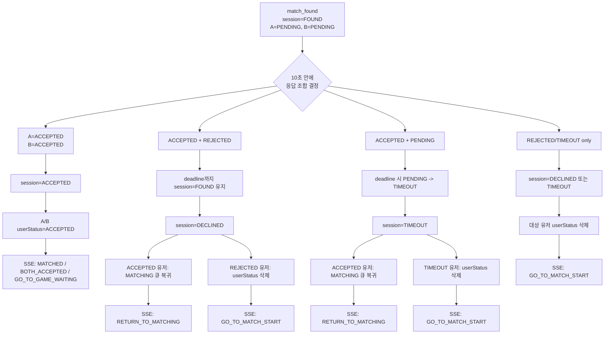

# Issue-34: 매칭 응답 결과 API 응답 및 클라이언트 이벤트 설계

## 📌 Feature Description

매칭 수락/거절/타임아웃 처리 결과를 클라이언트가 일관된 방식으로 처리할 수 있도록 HTTP API 응답과 SSE 이벤트 payload를 설계합니다.

이번 이슈의 핵심 기준은 다음과 같습니다.

```text
HTTP accept/reject 응답:
- 내가 누른 버튼이 서버에 반영되었는지
- 즉시 반영 가능한 화면 동작이 있는지

SSE match response event:
- matchId 단위 최종 결과가 무엇인지
- 매칭 성공/실패 사유가 무엇인지
- 게임 대기 화면으로 이동할지
- 다시 매칭 대기 상태로 돌아갈지
- start 버튼 화면으로 돌아갈지
```

SSE 연결은 `match_found`를 받은 직후 닫지 않습니다. 클라이언트는 `match_response_result` 최종 이벤트를 받을 때까지 같은 SSE 연결을 유지하고, 화면 전이가 확정된 뒤 연결을 닫거나 다음 매칭 알림 수신을 위해 유지합니다.

동시 accept처럼 HTTP 응답과 SSE 최종 이벤트가 거의 동시에 발생하는 경우, 네트워크 상황에 따라 SSE 최종 이벤트가 HTTP 응답보다 먼저 도착할 수 있습니다. `match_response_result`는 해당 `matchId`의 최종 이벤트이므로 화면 전환 기준으로 HTTP 응답보다 우선합니다.

프론트 기대 흐름은 다음과 같습니다.

| 시나리오 | 화면 전이 |
| :--- | :--- |
| 둘 다 수락 | 게임 진행 대기 화면으로 이동. 상대 정보/닉네임/티어 표시 |
| 한 명 거절, 상대 미응답 | 거절한 유저도 정산 대기 모달 유지. 상대는 10초 모달 유지 |
| 한 명 거절, 상대가 10초 안에 수락 | 거절 유저는 start 버튼 복귀. 수락 유저는 기존 entryTime으로 매칭 대기 상태 복귀 |
| 둘 다 거절 | 최종 정산 후 둘 다 start 버튼 복귀 |
| 한 명 수락, 상대 timeout | 수락한 유저는 매칭 대기 상태 복귀. timeout 유저는 start 버튼 복귀 |
| 둘 다 timeout | 둘 다 start 버튼 복귀 |

이번 이슈는 수락/거절 HTTP 응답과 `match_response_result` SSE 반환값까지 구현합니다.
게임 테이블 생성, 게임 세션 생성, `gameId` 채우기는 매칭 응답 이슈가 끝난 뒤 별도 게임 이슈에서 처리합니다.

## 📚 Tasks

### 1. 응답/이벤트 책임 경계 확정

- [x] HTTP accept/reject 응답은 “내 요청 처리 결과”만 담당하도록 정의
- [x] SSE `match_response_result` 이벤트는 “matchId 최종 결과”만 담당하도록 정의
- [x] 모든 응답을 SSE로만 보낼지, HTTP ack + SSE final result로 나눌지 비교 후 확정
- [x] SSE 이벤트는 상대의 개별 accept/reject 로그가 아니라 최종 성공/실패 결과와 실패 사유만 전달하도록 정의
- [x] 같은 `matchId`에서 `match_response_result` 이벤트가 HTTP ack보다 화면 전환 우선순위가 높다는 정책 명시
- [x] 상대가 먼저 reject한 순간에는 미응답 상대에게 실패 이벤트를 보내지 않는 정책 명시
- [x] reject한 유저도 최종 정산 전까지 start 버튼으로 돌아가지 않고 `match_response_result`를 기다리는 정책 명시
- [x] timeout 결과는 HTTP 응답이 아니라 SSE 이벤트로 전달하는 방향 확정
- [x] 양쪽 accept는 즉시 최종 성공이므로 게임 대기 화면 이동 이벤트가 필요함을 명시

#### 설계 기준

```text
내가 버튼을 눌렀다
-> HTTP 응답으로 내 요청 반영 여부를 받는다

매칭 성공/실패가 최종 확정되었다
-> match_response_result SSE 이벤트로 최종 결과와 다음 화면 상태를 받는다

같은 matchId의 match_response_result 이벤트를 먼저 받았다
-> 이후 도착한 HTTP ack의 action은 화면 전환 기준으로 무시한다
```

#### HTTP + SSE를 나누는 이유

| 방식 | 장점 | 단점 | 판단 |
| :--- | :--- | :--- | :--- |
| 모든 결과를 SSE로 전달 | 클라이언트가 하나의 스트림만 구독하면 됨 | 버튼 요청 성공/실패를 HTTP 응답과 분리해서 기다려야 함. SSE 연결 실패 시 명령 결과 확인이 어려움 | 단독 사용은 부적합 |
| HTTP ack + SSE final result | 명령 성공/실패는 HTTP로 즉시 확인하고, 매칭 성공/실패 최종 결과는 SSE로 받음 | 응답 경로가 둘로 나뉨 | 현재 정책에 적합 |

이번 이슈의 기본 방향은 `HTTP ack + SSE final result`입니다.

#### Task 1 결론

- `accept/reject` HTTP 성공 응답은 최종 화면 전환을 담당하지 않습니다.
- HTTP 성공 응답은 버튼 요청이 서버에 반영되었다는 command ack입니다.
- 최종 화면 전환은 항상 `match_response_result` SSE 이벤트가 담당합니다.
- 따라서 성공 응답 body는 필수가 아니며, task 2에서 `200 OK` empty body를 우선 검토합니다.
- 실패 응답은 기존 예외 응답 정책을 유지하고, 클라이언트는 세션 없음/만료/이미 종료 같은 실패를 start 버튼 복귀 기준으로 처리할 수 있게 문서화합니다.

### 2. 공통 API 응답 모델 설계

- [x] accept/reject API 성공 응답은 공통 DTO를 만들지 않고 `200 OK` empty body로 유지
- [x] 성공 HTTP 응답에는 `matchId`, `action`, `sessionStatus`, `myResponse`, `opponent`를 포함하지 않음
- [x] 성공 HTTP 응답은 command ack만 의미하며 화면 전환 책임을 갖지 않음
- [x] 실패 HTTP 응답은 기존 전역 `ErrorResponse`를 재사용
- [x] 실패 HTTP 응답에도 별도 `action` 필드를 추가하지 않음
- [x] 상대 정보와 최종 화면 전환 정보는 최종 SSE 이벤트에서만 전달

#### 응답 예시

```http
HTTP/1.1 200 OK
Content-Length: 0
```

#### 실패 응답 예시

```json
{
  "timestamp": "2026-05-12T10:00:00",
  "status": 409,
  "code": "MATCH_009",
  "message": "이미 완료된 매칭 세션입니다.",
  "errors": null
}
```

### 3. accept API 응답 정책 정의

- [x] accept 성공 HTTP 응답은 모든 성공 케이스에서 `200 OK` empty body
- [x] 내가 accept했고 상대가 아직 미응답이면 HTTP는 command ack만 반환하고 모달은 유지
- [x] 내가 accept했고 상대도 accept 완료면 HTTP 응답과 별개로 `match_response_result` SSE 이벤트가 최종 화면 전환을 담당
- [x] 내가 accept했지만 상대가 이미 reject한 상태라면 HTTP 응답과 별개로 `match_response_result` SSE 이벤트가 큐 복귀 전환을 담당
- [x] 중복 accept는 기존 멱등 정책을 유지하고 `200 OK` empty body
- [x] accept 후 session이 최종 `ACCEPTED`가 되는 경우 상대 정보/게임 대기 정보는 SSE 이벤트에 포함
- [x] 게임 세션 생성과 `gameId` payload는 이번 이슈 범위에서 제외

#### 주요 케이스

| 상태 | HTTP 응답 |
| :--- | :--- |
| `PENDING + PENDING`에서 내가 accept | `200 OK` empty body. 최종 전환 대기 |
| 상대가 accept한 뒤 내가 accept | `200 OK` empty body. 최종 전환은 SSE `GO_TO_GAME_WAITING` |
| 상대가 reject한 뒤 내가 accept | `200 OK` empty body. 최종 전환은 SSE `RETURN_TO_MATCHING` |
| 이미 내가 accept한 상태에서 accept 재시도 | `200 OK` empty body |

#### accept 성공 후 클라이언트 처리

- HTTP `200 OK`는 버튼 요청 반영 성공만 의미합니다.
- accept 버튼을 누른 클라이언트는 `match_response_result`를 받을 때까지 기존 모달 또는 대기 상태를 유지합니다.
- 같은 `matchId`의 `match_response_result`가 먼저 도착하면 이후 accept HTTP 응답은 화면 전환 기준으로 무시합니다.
- accept 실패 응답은 기존 `ErrorResponse`를 사용합니다. 단, `MATCH_RESPONSE_LOCK_FAILED`는 모달을 유지하고 SSE 최종 결과를 기다리며, 그 외 실패는 모달을 닫고 start 버튼 화면으로 복귀합니다.

### 4. reject API 응답 정책 정의

- [x] reject 성공 HTTP 응답은 모든 성공 케이스에서 `200 OK` empty body
- [x] 내가 reject하면 내 화면은 즉시 start 버튼으로 돌아가지 않고 정산 대기 상태 유지
- [x] reject 후 수락/거절 버튼은 비활성화하고 정산 대기 상태를 표시
- [x] 상대가 아직 미응답이면 session은 `FOUND`로 유지
- [x] 상대도 reject했거나 이미 응답 완료된 경우에도 둘 다 수락이 아니면 deadline 정산까지 session은 `FOUND` 유지
- [x] 내가 reject한 순간 상대에게 실패 이벤트를 보내지 않음
- [x] reject 응답에는 큐 복귀/화면 최종 전환 없음
- [x] reject한 유저도 최종 `match_response_result` SSE 이벤트로 `GO_TO_MATCH_START` 전환

#### 주요 케이스

| 상태 | HTTP 응답 |
| :--- | :--- |
| `PENDING + PENDING`에서 내가 reject | `200 OK` empty body. 정산 대기 |
| 상대가 accept한 뒤 내가 reject | `200 OK` empty body. 최종 전환은 SSE `GO_TO_MATCH_START` |
| 상대가 reject한 뒤 내가 reject | `200 OK` empty body. 최종 전환은 SSE `GO_TO_MATCH_START` |
| 이미 내가 reject한 상태에서 reject 재시도 | `200 OK` empty body |

#### reject 성공 후 클라이언트 처리

- HTTP `200 OK`는 버튼 요청 반영 성공만 의미합니다.
- reject 버튼을 누른 클라이언트는 start 버튼으로 즉시 복귀하지 않습니다.
- reject 이후 같은 모달에서 수락/거절 버튼을 비활성화하고 정산 대기 상태를 표시합니다.
- 같은 `matchId`의 `match_response_result`를 받으면 `action=GO_TO_MATCH_START` 기준으로 start 버튼 화면에 복귀합니다.
- reject 실패 응답은 기존 `ErrorResponse`를 사용합니다. 단, `MATCH_RESPONSE_LOCK_FAILED`는 모달을 유지하고 SSE 최종 결과를 기다리며, 그 외 실패는 모달을 닫고 start 버튼 화면으로 복귀합니다.

### 5. 완료/거절/timeout 세션의 에러 응답 정책 정리

- [x] 이미 `ACCEPTED` 세션에 대한 accept/reject 요청 응답 정책 정리
- [x] 이미 `DECLINED` 세션에 대한 accept/reject 요청 응답 정책 정리
- [x] 이미 `TIMEOUT` 세션에 대한 accept/reject 요청 응답 정책 정리
- [x] 세션 TTL 만료 시 에러 응답과 클라이언트 화면 전이 기준 정리
- [x] 기존 `MatchingErrorCode`와 클라이언트 기본 화면 전이 정책 연결 가능 여부 검토

#### 기본 방향

| 서버 상태 | API 응답 방향 |
| :--- | :--- |
| 세션 없음 / TTL 만료 | `410 MATCH_SESSION_EXPIRED` |
| 참여자가 아닌 유저 | `403 MATCH_SESSION_NOT_PARTICIPANT` |
| 이미 `ACCEPTED` | `409 MATCH_SESSION_ALREADY_COMPLETED` |
| 이미 `DECLINED` | `409 MATCH_SESSION_ALREADY_DECLINED` |
| 이미 `TIMEOUT` | `409 MATCH_SESSION_TIMEOUT` |
| 같은 유저가 이미 accept한 뒤 reject | `409 MATCH_SESSION_ALREADY_ACCEPTED` |
| 같은 유저가 이미 reject한 뒤 accept | `409 MATCH_SESSION_ALREADY_DECLINED` |
| matchId lock 획득 실패 | `409 MATCH_RESPONSE_LOCK_FAILED` |

#### 실패 응답 처리 원칙

- 실패 응답은 기존 전역 `ErrorResponse`를 그대로 사용합니다.
- 실패 응답에 `action`, `matchId`, `opponent`, `game` 같은 매칭 결과 필드를 추가하지 않습니다.
- 실패 응답은 최종 정산 이벤트가 아니므로 `match_response_result`를 대체하지 않습니다.
- 클라이언트는 대부분의 accept/reject 실패를 받으면 해당 matchId의 응답 모달을 닫고 start 버튼 화면으로 복구합니다.
- 단, `MATCH_RESPONSE_LOCK_FAILED`는 같은 matchId의 응답 또는 timeout 정산이 진행 중인 상태로 보고 모달을 유지한 채 `match_response_result` SSE 이벤트를 기다립니다.
- 필요하면 `code/message`는 토스트, 로깅, 디버깅에만 사용합니다.

#### 클라이언트 실패 처리 기준

| 실패 코드 | 클라이언트 처리 |
| :--- | :--- |
| `MATCH_006` / `MATCH_SESSION_EXPIRED` | start 버튼 화면 복귀 |
| `MATCH_007` / `MATCH_SESSION_NOT_PARTICIPANT` | start 버튼 화면 복귀 |
| `MATCH_008` / `MATCH_SESSION_ALREADY_ACCEPTED` | start 버튼 화면 복귀 |
| `MATCH_009` / `MATCH_SESSION_ALREADY_COMPLETED` | start 버튼 화면 복귀 |
| `MATCH_010` / `MATCH_SESSION_ALREADY_DECLINED` | start 버튼 화면 복귀 |
| `MATCH_011` / `MATCH_SESSION_TIMEOUT` | start 버튼 화면 복귀 |
| `MATCH_012` / `MATCH_RESPONSE_LOCK_FAILED` | 모달 유지, 버튼 비활성화, SSE 최종 결과 대기 |

#### 실패 응답 예시

```json
{
  "timestamp": "2026-05-12T10:00:00",
  "status": 410,
  "code": "MATCH_006",
  "message": "매칭 수락 시간이 만료되었습니다.",
  "errors": null
}
```

### 6. SSE 최종 결과 이벤트 설계

- [x] 이벤트 이름 결정
  - `match_response_result`
- [x] 통합 이벤트 payload 정의
  - `matchId`
  - `outcome`
  - `reason`
  - `action`
  - `opponent`
  - `game`
- [x] `outcome` enum 정의
  - `MATCHED`
  - `FAILED`
- [x] `outcome` enum별 의미 문서화
- [x] `reason` enum 정의
  - `BOTH_ACCEPTED`
  - `MY_REJECTED`
  - `OPPONENT_REJECTED`
  - `MY_TIMEOUT`
  - `OPPONENT_TIMEOUT`
  - `BOTH_TIMEOUT`
- [x] `reason` enum별 의미 문서화
- [x] `action` enum 정의
  - `GO_TO_GAME_WAITING`
  - `GO_TO_MATCH_START`
  - `RETURN_TO_MATCHING`
- [x] `action` enum별 프론트 화면 전환 의미 문서화
- [x] `outcome/reason/action` 조합별 프론트 처리 매핑표 정의
- [x] 이벤트 payload에 상대 nickname/tier/tierScore 포함
- [x] `match_response_result` 이벤트 이름 자체가 최종 이벤트임을 클라이언트 정책에 명시

#### SSE result code mapping

| `outcome` | `reason` | `action` | 프론트 처리 |
| :--- | :--- | :--- | :--- |
| `MATCHED` | `BOTH_ACCEPTED` | `GO_TO_GAME_WAITING` | 게임 대기 화면 이동 |
| `FAILED` | `MY_REJECTED` | `GO_TO_MATCH_START` | start 버튼 화면 복귀 |
| `FAILED` | `OPPONENT_REJECTED` | `RETURN_TO_MATCHING` | 매칭 대기 상태 복귀 |
| `FAILED` | `MY_TIMEOUT` | `GO_TO_MATCH_START` | start 버튼 화면 복귀 |
| `FAILED` | `OPPONENT_TIMEOUT` | `RETURN_TO_MATCHING` | 매칭 대기 상태 복귀 |
| `FAILED` | `BOTH_TIMEOUT` | `GO_TO_MATCH_START` | start 버튼 화면 복귀 |

#### 이벤트 예시

```json
{
  "matchId": "match-1",
  "outcome": "FAILED",
  "reason": "OPPONENT_REJECTED",
  "action": "RETURN_TO_MATCHING",
  "opponent": {
    "userId": 2,
    "nickname": "opponent",
    "tier": "GOLD_IV",
    "tierScore": 13
  },
  "game": null
}
```

`game` 필드는 후속 게임 세션 생성 이슈를 위한 예약 필드입니다.
이번 이슈에서는 양쪽 수락으로 `GO_TO_GAME_WAITING`이 내려가도 `game=null`을 유지합니다.

#### 구현 위치

- 이벤트 이름: `MatchNotificationEventName.MATCH_RESPONSE_RESULT`
- payload DTO: `MatchResponseResultNotification`
- enum: `MatchResponseOutcome`, `MatchResponseReason`, `MatchResponseAction`

### 7. 시나리오별 SSE 이벤트 발행 정책

- [x] 둘 다 accept
  - 양쪽 모두에게 `outcome=MATCHED`, `reason=BOTH_ACCEPTED`, `action=GO_TO_GAME_WAITING`
  - 동시에 accept한 경우 한쪽 HTTP ack보다 SSE 최종 이벤트가 먼저 도착할 수 있으므로 클라이언트는 `match_response_result` 이벤트를 우선 적용
- [x] 내가 reject
  - HTTP 응답은 `200 OK` empty body
  - 버튼은 비활성화하고 정산 대기 상태를 표시
  - 상대에게는 즉시 실패 이벤트를 보내지 않음
  - 상대가 제한 시간 안에 accept/reject하거나 timeout 정산이 끝났을 때 최종 실패 이벤트를 보냄
- [x] 상대 reject 후 내가 accept
  - 나에게 `outcome=FAILED`, `reason=OPPONENT_REJECTED`, `action=RETURN_TO_MATCHING`
- [x] 둘 다 reject
  - 양쪽 모두 `outcome=FAILED`, 각자 `reason=MY_REJECTED`, `action=GO_TO_MATCH_START`
- [x] 내가 accept, 상대 timeout
  - 나에게 `outcome=FAILED`, `reason=OPPONENT_TIMEOUT`, `action=RETURN_TO_MATCHING`
- [x] 내가 timeout
  - 나에게 `outcome=FAILED`, `reason=MY_TIMEOUT`, `action=GO_TO_MATCH_START`
- [x] 둘 다 timeout
  - 양쪽 모두 `outcome=FAILED`, `reason=BOTH_TIMEOUT`, `action=GO_TO_MATCH_START`

#### 발행 기준

- `match_response_result`는 matchId 최종 정산 시점에만 발행합니다.
- 한 명이 먼저 reject해도 상대가 아직 `PENDING`이면 즉시 이벤트를 보내지 않습니다.
- `reason`은 이벤트를 받는 유저 기준입니다. 같은 정산 결과라도 A/B에게 내려가는 `reason`이 다를 수 있습니다.
- `action`은 프론트가 따라야 하는 최종 화면 전환 기준입니다.
- 멀티 인스턴스 환경에서는 최종적으로 유저별 Pub/Sub message로 발행하고, 각 API 인스턴스가 로컬 SSE 연결이 있는 유저에게만 전송합니다.

#### 시나리오별 유저 이벤트

| 시나리오 | A 이벤트 | B 이벤트 |
| :--- | :--- | :--- |
| A accept, B accept | `MATCHED / BOTH_ACCEPTED / GO_TO_GAME_WAITING` | `MATCHED / BOTH_ACCEPTED / GO_TO_GAME_WAITING` |
| A accept, B reject | `FAILED / OPPONENT_REJECTED / RETURN_TO_MATCHING` | `FAILED / MY_REJECTED / GO_TO_MATCH_START` |
| A reject, B accept | `FAILED / MY_REJECTED / GO_TO_MATCH_START` | `FAILED / OPPONENT_REJECTED / RETURN_TO_MATCHING` |
| A reject, B reject | `FAILED / MY_REJECTED / GO_TO_MATCH_START` | `FAILED / MY_REJECTED / GO_TO_MATCH_START` |
| A accept, B timeout | `FAILED / OPPONENT_TIMEOUT / RETURN_TO_MATCHING` | `FAILED / MY_TIMEOUT / GO_TO_MATCH_START` |
| A timeout, B accept | `FAILED / MY_TIMEOUT / GO_TO_MATCH_START` | `FAILED / OPPONENT_TIMEOUT / RETURN_TO_MATCHING` |
| A reject, B timeout | `FAILED / MY_REJECTED / GO_TO_MATCH_START` | `FAILED / MY_TIMEOUT / GO_TO_MATCH_START` |
| A timeout, B reject | `FAILED / MY_TIMEOUT / GO_TO_MATCH_START` | `FAILED / MY_REJECTED / GO_TO_MATCH_START` |
| A timeout, B timeout | `FAILED / BOTH_TIMEOUT / GO_TO_MATCH_START` | `FAILED / BOTH_TIMEOUT / GO_TO_MATCH_START` |

### 8. 기존 match_found SSE 흐름과 연결

- [x] `match_found` payload는 유지
- [x] 클라이언트는 `match_found` 수신 후 SSE를 닫지 않고 최종 `match_response_result` 또는 게임 이동 이벤트까지 유지하도록 정책 명시
- [x] start 버튼 복귀, 게임 대기 화면 이동, 매칭 대기 복귀 시점별 SSE close/keep 정책 정의
- [x] `match_response_result` 이벤트를 notification 패키지에 추가
- [x] Redis Pub/Sub message 추가 여부 결정
- [x] 멀티 인스턴스에서 대상 유저 SSE 연결로 이벤트 전달되는지 확인
- [x] 기존 `match_found` SSE 회귀 테스트 유지

#### 연결 정책

- `match_found` 이벤트 이름과 payload는 변경하지 않습니다.
- `match_response_result`는 `match_found` 이후 같은 SSE 연결에서 받을 최종 결과 이벤트입니다.
- `match_response_result`도 `match_found`와 같은 Redis Pub/Sub fan-out 구조를 사용합니다.
- publish한 API 인스턴스와 SSE 연결을 가진 API 인스턴스가 다를 수 있으므로, 모든 API 인스턴스가 Pub/Sub 메시지를 수신하고 로컬 `SseConnectionRegistry`에 대상 유저 연결이 있을 때만 SSE를 전송합니다.
- Redis Pub/Sub channel은 `notification:match_response_result`를 사용합니다.

#### 구현 연결점

- SSE event name: `MatchNotificationEventName.MATCH_RESPONSE_RESULT`
- Redis Pub/Sub channel: `MatchNotificationChannelName.MATCH_RESPONSE_RESULT`
- payload DTO: `MatchResponseResultNotification`
- 실제 publisher/subscriber/sender 구현은 task 9에서 책임 위치를 확정한 뒤 추가합니다.

### 9. 구현 구조 설계

- [x] matching service 내부 결과 모델과 API/SSE DTO 분리
- [x] accept/reject API 성공 응답 DTO는 만들지 않고 `ResponseEntity<Void>` 유지
- [x] SSE payload DTO는 notification dto 패키지에 위치
- [x] matching 모듈은 클라이언트 DTO에 직접 의존하지 않도록 설계
- [x] 이벤트 발행 책임 위치 결정
  - matching service
  - api service
  - notification adapter/factory
- [x] 상대 nickname 조회 책임 위치 결정
  - API layer에서 user/rank/profile 조회 후 조립
- [x] 상대 tier/tierScore 조회 책임 위치 결정
  - API layer에서 rank/profile 조회 후 조립

#### 모듈 책임

| 모듈 | 책임 | 금지 |
| :--- | :--- | :--- |
| `smite-matching` | session/queue/userStatus 정산, matchId lock, timeout claim, 내부 정산 결과 생성 | `MatchResponseResultNotification` 같은 클라이언트 DTO 의존 |
| `smite-api` match service | accept/reject HTTP command 위임, 성공 시 `200 OK` empty body 유지 | 성공 응답 body 조립 |
| `smite-api` notification adapter/factory | matching 내부 정산 결과를 유저별 SSE payload로 변환, 상대 nickname/tier/tierScore 조립, Pub/Sub publish | 세션/큐 정산 직접 수행 |
| notification pub/sub | `match_response_result` 메시지 fan-out, 로컬 SSE connection이 있는 유저에게만 전송 | 매칭 정책 판단 |

#### 권장 구현 흐름

```text
accept/reject API
-> MatchResponseCommandService
-> MatchResponseResultService(matchId lock)
-> 내부 정산 결과 반환 또는 이벤트 port 호출
-> notification adapter/factory가 유저별 MatchResponseResultNotification 생성
-> notification:match_response_result Pub/Sub publish
-> 각 API instance subscriber가 로컬 SSE connection 확인 후 전송
```

```text
timeout scheduler
-> MatchResponseTimeoutService
-> MatchResponseResultService.timeoutWithLock(matchId)
-> 내부 정산 결과 반환 또는 이벤트 port 호출
-> notification adapter/factory가 유저별 MatchResponseResultNotification 생성
-> notification:match_response_result Pub/Sub publish
-> 각 API instance subscriber가 로컬 SSE connection 확인 후 전송
```

#### 내부 결과 모델 방향

- matching 모듈에는 클라이언트 DTO가 아닌 내부 정산 결과 모델을 둡니다.
- 내부 결과는 최소한 `matchId`, 유저별 최종 응답 상태, 큐 복귀 여부를 표현합니다.
- `outcome/reason/action`, `opponent`, `game`은 api notification adapter/factory에서 유저별 관점으로 변환합니다.
- `game`은 후속 게임 세션 생성 이슈 전까지 `null`로 내려갑니다.
- timeout no-op이나 이미 종료된 세션은 SSE 발행 대상이 아니므로 내부 결과에서 구분합니다.

#### 이벤트 발행 포트 방향

- timeout scheduler도 matching 모듈 내부에서 실행되므로, api service 반환값만으로는 timeout SSE 발행을 처리할 수 없습니다.
- matching 모듈에 클라이언트 DTO를 모르는 이벤트 발행 port를 두고, `smite-api` notification adapter가 이를 구현하는 방향을 우선합니다.
- port 구현체는 내부 정산 결과를 받아 상대 정보 조회 후 `match_response_result` Pub/Sub message를 발행합니다.

### 10. match_response_result 발행 구현

- [x] matching 내부 정산 결과 모델 정의
- [x] matching event publisher port 정의
- [x] accept/reject 최종 정산 시 event publisher 호출
- [x] timeout 최종 정산 시 event publisher 호출
- [x] smite-api notification adapter/factory 구현
- [x] 상대 nickname/tier/tierScore 조회 후 유저별 SSE payload 조립
- [x] match_response_result Pub/Sub message 정의
- [x] match_response_result Pub/Sub codec 구현
- [x] match_response_result Pub/Sub publisher 구현
- [x] match_response_result Pub/Sub subscriber 구현
- [x] subscriber에서 로컬 SSE connection 확인 후 `match_response_result` 전송
- [x] 발행 실패가 매칭 정산 성공을 깨지 않도록 처리
- [x] 멀티 인스턴스에서 publish 인스턴스와 SSE 연결 인스턴스가 달라도 전송되도록 구성

### 11. API 문서 및 RestDocs 갱신

- [x] accept API 성공 응답 문서화
- [x] reject API 성공 응답 문서화
- [x] 주요 실패 응답 문서화
- [x] `match_response_result` SSE 이벤트 payload 문서화
- [x] `match_response_result.outcome` enum 표 문서화
- [x] `match_response_result.reason` enum 표 문서화
- [x] `match_response_result.action` enum 표 문서화
- [x] `outcome/reason/action` 조합별 프론트 처리 매핑표 문서화
- [x] `MatchControllerRestDocsTest` 갱신
- [x] notification RestDocs 또는 별도 이벤트 문서 갱신

#### 구현 결과

- `MatchControllerRestDocsTest`를 갱신했습니다.
  - accept 성공 응답은 `200 OK` empty body로 문서화했습니다.
  - reject 성공 응답은 `200 OK` empty body로 문서화했습니다.
  - accept/reject 성공 응답은 command ack일 뿐 화면 전환 책임이 없음을 description에 명시했습니다.
  - accept 실패 문서를 추가해 기존 전역 `ErrorResponse` 필드를 문서화했습니다.
  - reject 실패 문서를 추가해 이미 수락한 유저의 reject 같은 정책 실패 응답을 문서화했습니다.
- `MatchNotificationControllerRestDocsTest`를 갱신했습니다.
  - SSE 연결에서 `match_found` 이후 `match_response_result`까지 같은 연결로 받는 정책을 문서화했습니다.
  - `match_response_result` payload 필드를 문서화했습니다.
  - `outcome`, `reason`, `action` enum 목록을 문서화했습니다.
  - `outcome/reason/action` 조합별 프론트 화면 전환 기준을 문서화했습니다.
- 이번 이슈 범위상 `game` payload는 후속 게임 세션 생성 이슈 전까지 `null`로 내려간다고 명시했습니다.

#### HTTP 성공 응답

```http
HTTP/1.1 200 OK
Content-Length: 0
```

#### 주요 실패 응답

| 코드 | HTTP | 의미 | 클라이언트 처리 |
| :--- | ---: | :--- | :--- |
| `MATCH_006` | 410 | 세션 없음 또는 만료 | start 버튼 화면 복귀 |
| `MATCH_007` | 403 | 세션 참여자 아님 | start 버튼 화면 복귀 |
| `MATCH_008` | 409 | 이미 수락한 유저가 거절 시도 | start 버튼 화면 복귀 |
| `MATCH_009` | 409 | 이미 완료된 세션 | start 버튼 화면 복귀 |
| `MATCH_010` | 409 | 이미 거절된 세션 | start 버튼 화면 복귀 |
| `MATCH_011` | 409 | 이미 timeout 정산된 세션 | start 버튼 화면 복귀 |
| `MATCH_012` | 409 | 같은 matchId 응답 처리 중 | 모달 유지, 버튼 비활성화, SSE 최종 결과 대기 |

#### SSE enum

| 필드 | 값 | 의미 |
| :--- | :--- | :--- |
| `outcome` | `MATCHED` | 양쪽 수락으로 매칭 성공 |
| `outcome` | `FAILED` | 거절 또는 timeout으로 매칭 실패 |
| `reason` | `BOTH_ACCEPTED` | 양쪽 모두 수락 |
| `reason` | `MY_REJECTED` | 내가 거절 |
| `reason` | `OPPONENT_REJECTED` | 상대가 거절 |
| `reason` | `MY_TIMEOUT` | 내가 미응답 timeout |
| `reason` | `OPPONENT_TIMEOUT` | 상대가 미응답 timeout |
| `reason` | `BOTH_TIMEOUT` | 양쪽 모두 미응답 timeout |
| `action` | `GO_TO_GAME_WAITING` | 게임 진행 대기 화면으로 이동 |
| `action` | `GO_TO_MATCH_START` | 매칭 start 버튼 화면으로 복귀 |
| `action` | `RETURN_TO_MATCHING` | 기존 우선순위로 매칭 대기 상태 복귀 |

### 12. 테스트 작성

- [x] accept API `200 OK` empty body 테스트
- [x] reject API `200 OK` empty body 테스트
- [x] accept controller/service 테스트 갱신
- [x] reject controller/service 테스트 갱신
- [x] 양쪽 accept 완료 이벤트 테스트
- [x] reject 후 상대 모달 유지 정책 테스트
- [x] reject 후 상대 accept 시 큐 복귀 이벤트 테스트
- [x] timeout 정산 후 이벤트 테스트
- [x] 기존 `match_found` SSE 회귀 테스트

#### 구현 결과

- `MatchControllerTest`
  - accept/reject API가 `200 OK` empty body를 반환하는지 검증했습니다.
- `MatchResponseServiceTest`
  - API service가 matching command service로 accept/reject를 위임하는지 검증했습니다.
- `MatchResponseResultServiceTest`
  - 양쪽 accept 시 `ACCEPTED` 최종 이벤트가 발행되는지 검증했습니다.
  - reject만으로는 최종 이벤트가 발행되지 않고 세션이 `FOUND`로 유지되는지 검증했습니다.
  - 상대 reject 후 제한 시간 안에 accept하면 deadline까지 세션을 유지하고, deadline 정산 후 수락 유저를 큐로 복귀시키는지 검증했습니다.
  - timeout 정산 후 `TIMEOUT` 최종 이벤트가 발행되는지 검증했습니다.
  - 이미 종료된 세션 timeout no-op에서는 이벤트가 발행되지 않는지 검증했습니다.
- `MatchResponseResultNotificationFactoryTest`
  - `BOTH_ACCEPTED`, `OPPONENT_REJECTED`, `MY_REJECTED`, `OPPONENT_TIMEOUT`, `MY_TIMEOUT`, `BOTH_TIMEOUT` 관점별 `outcome/reason/action` 매핑을 검증했습니다.
  - 양쪽 accept 결과에서도 이번 이슈 범위에 맞게 `game=null`을 유지하는지 검증했습니다.
- `MatchResponseResultPubSubPublisherTest`
  - `notification:match_response_result` channel publish와 publish 성공/실패 메트릭을 검증했습니다.
- `MatchResponseResultPubSubSubscriberTest`
  - Pub/Sub 메시지 수신, decode 실패, dispatch 실패 격리와 수신/실패 메트릭을 검증했습니다.
- `MatchResponseResultSseSenderTest`
  - 로컬 SSE 연결 hit/miss에 따라 `match_response_result` 전송 여부와 dispatch hit/miss 메트릭을 검증했습니다.
- 기존 `match_found` Pub/Sub/SSE 테스트는 `:smite-api:test`에 함께 포함되어 회귀 검증했습니다.

#### 메트릭 검증 결과

- matching 응답 지표
  - `MatchResponseCommandService`에서 accept/reject 요청 attempt/success/failure와 lock failure를 기록합니다.
  - `MatchResponseResultService`에서 양쪽 accept 완료와 deadline declined 완료를 기록합니다.
  - `MatchResponseTimeoutService`에서 timeout claim/reclaim/settlement, queue returned users, processing delay, batch duration, pending/processing/overdue backlog gauge를 기록합니다.
- SSE/PubSub 지표
  - `MatchResponseResultPubSubPublisher`에서 `event=match_response_result` publish success/failure를 기록합니다.
  - `MatchResponseResultPubSubSubscriber`에서 `event=match_response_result` message received와 decode/dispatch failure를 기록합니다.
  - `MatchResponseResultSseSender`에서 `event=match_response_result` local hit/miss를 기록합니다.
  - 실제 SSE 전송 attempt/success/failure/duration은 공통 `SseEventSender`에서 `event=match_response_result` 태그로 기록됩니다.
- Grafana 연계
  - 매칭 응답 대시보드는 `match_response_*` metric을 참조하고, 해당 이름은 `MatchResponseMetricNames`의 Micrometer 이름이 Prometheus로 변환된 이름과 일치합니다.
  - SSE 대시보드의 공통 event별 패널은 `match_response_result`도 `event` 태그로 자동 집계할 수 있습니다.
  - 매칭 응답 대시보드에 `Load Test Totals` 섹션을 추가해 `increase(...[$__rate_interval])` 기반 총량 추이를 그래프로 확인할 수 있게 했습니다.
  - 매칭 응답 대시보드에 `JVM / 애플리케이션 리소스` 섹션을 추가해 CPU, Heap/Non-Heap, GC, Thread, SSE active connection을 함께 확인할 수 있게 했습니다.

#### 검증 명령

```bash
./gradlew :smite-api:test :smite-matching:test
```

결과: `BUILD SUCCESSFUL`

## 📝 Note

### 설계 원칙

- HTTP 응답과 SSE 이벤트의 책임을 섞지 않습니다.
- HTTP 응답은 “내 요청 반영 결과”를 즉시 알려줍니다.
- SSE 이벤트는 “matchId 최종 결과”를 알려줍니다.
- 클라이언트는 `match_found` 수신 직후 SSE를 닫지 않고 최종 결과 이벤트까지 유지합니다.
- 상대가 먼저 reject한 사실을 즉시 알려서 미응답 유저의 10초 선택권을 깨지 않습니다.
- timeout은 서버 scheduler 결과이므로 SSE 이벤트가 필요합니다.

### 프론트 화면 상태 기준

HTTP 성공 응답은 `200 OK` empty body이므로 `WAIT_FOR_OPPONENT`, `WAIT_FOR_RESULT`를 서버 payload로 받지 않습니다.
두 상태는 클라이언트가 사용자가 누른 버튼과 HTTP 성공 여부를 기준으로 전환하는 로컬 UI 상태입니다.

| 로컬 상태 | 화면 |
| :--- | :--- |
| `WAIT_FOR_OPPONENT` | 현재 매칭 수락/거절 모달 유지 |
| `WAIT_FOR_RESULT` | 수락/거절 버튼 비활성화 후 정산 대기 |

`match_response_result` SSE 이벤트의 `action`은 최종 화면 전환만 표현합니다.

| SSE `action` | 화면 |
| :--- | :--- |
| `GO_TO_GAME_WAITING` | 게임 진행 대기 화면 이동 |
| `GO_TO_MATCH_START` | 매칭 끊김, start 버튼 화면 복귀 |
| `RETURN_TO_MATCHING` | 기존 우선순위로 매칭 대기 상태 표시 |

### SSE 연결 유지 정책

| 상황 | SSE 연결 |
| :--- | :--- |
| start 버튼 클릭 후 매칭 대기 | 연결 |
| `match_found` 수신 후 수락/거절 모달 표시 | 유지 |
| 둘 다 accept 후 게임 대기 화면 이동 | 클라이언트가 닫거나 게임용 연결로 전환 |
| 내가 reject 후 정산 대기 | 유지 |
| reject 최종 정산 후 start 버튼 복귀 | 클라이언트가 닫음 |
| 내가 accept 후 상대 reject/timeout으로 매칭 대기 복귀 | 새 `match_found`를 받을 수 있도록 유지 가능 |
| 내가 timeout 또는 둘 다 timeout 후 start 버튼 복귀 | 클라이언트가 닫음 |

### 결정된 범위

- 이번 이슈는 accept/reject HTTP 응답과 `match_response_result` SSE 반환값까지만 처리합니다.
- 양쪽 accept 시 게임 세션 생성과 `gameId` payload 채우기는 후속 게임 이슈에서 처리합니다.
- 최종 매칭 응답 결과는 `match_response_result` 하나로 통합합니다.
- 이미 종료된 세션에 대한 API 요청은 기존 `ErrorResponse`만 반환하고 상태 body를 별도로 만들지 않습니다.
- timeout 정산 이벤트 발행 실패는 정산 성공을 깨지 않고 로그/메트릭으로 격리합니다.

---

## PR

[FEAT] 매칭 응답 결과 API 응답 및 클라이언트 이벤트 설계

## 📌 Summary

매칭 응답 흐름을 `HTTP command ack`와 `SSE final result`로 분리했습니다.

accept/reject HTTP 응답은 "내 버튼 입력이 서버에 반영되었는지"만 알려주고, 클라이언트의 최종 화면 전환은 `match_response_result` SSE 이벤트 하나로 통합합니다.



## 📚 Changes

- accept/reject HTTP 성공 응답을 `200 OK` empty body로 고정했습니다.
  - HTTP 응답에 `action`, `opponent`, `sessionStatus`를 넣지 않습니다.
  - HTTP는 command ack만 담당하고, 최종 화면 전환 책임은 SSE로 넘겼습니다.
  - 같은 matchId에서 SSE 최종 이벤트가 HTTP 응답보다 먼저 도착할 수 있으므로, 클라이언트는 `match_response_result`를 화면 전환 기준으로 우선 적용합니다.

- `match_response_result` SSE 이벤트를 추가했습니다.
  - 이벤트는 matchId 단위 최종 결과만 표현합니다.
  - 상대의 개별 accept/reject 로그는 보내지 않습니다.
  - payload는 `outcome`, `reason`, `action`, `opponent`, `game`으로 구성했습니다.
  - 상대 정보에는 `userId`, `nickname`, `tier`, `tierScore`를 포함했습니다.
  - `game`은 후속 게임 세션 생성 이슈 전까지 `null`로 유지합니다.

- 최종 화면 전환 코드를 명확히 분리했습니다.
  - `GO_TO_GAME_WAITING`: 양쪽 수락으로 게임 대기 화면 이동
  - `GO_TO_MATCH_START`: 거절/timeout 유저가 start 버튼 화면으로 복귀
  - `RETURN_TO_MATCHING`: 제한 시간 안에 수락했지만 상대 거절/timeout으로 기존 우선순위 큐에 복귀

- 한 명이 먼저 reject해도 즉시 실패 이벤트를 보내지 않도록 설계했습니다.
  - 상대의 10초 응답권을 보장해야 하기 때문입니다.
  - reject한 유저도 최종 정산 전까지 `userStatus`를 유지해 중복 큐 진입을 막습니다.
  - 최종 deadline 정산 이후에만 거절/timeout 유저의 `userStatus`를 삭제합니다.

- 양쪽 accept만 즉시 최종 성공 처리합니다.
  - `session=ACCEPTED`
  - A/B `userStatus=ACCEPTED`
  - timeout index cleanup
  - `match_response_result` 발행
  - 게임 세션 생성과 `gameId` 채우기는 후속 게임 이슈에서 처리합니다.

- matching 모듈과 API notification 모듈의 책임을 분리했습니다.
  - `smite-matching`: session/queue/userStatus 정산, matchId lock, timeout claim, 내부 결과 이벤트 발행
  - `smite-api`: 내부 결과 이벤트를 유저별 SSE payload로 변환, 상대 프로필 조회, Redis Pub/Sub publish
  - notification Pub/Sub: 멀티 인스턴스 fan-out 후 로컬 SSE connection이 있는 유저에게만 전송

- RestDocs와 테스트를 갱신했습니다.
  - accept/reject 성공 응답 `200 OK` empty body 문서화
  - 주요 실패 응답 `ErrorResponse` 문서화
  - `match_response_result` payload와 enum mapping 문서화
  - `BOTH_ACCEPTED`, reject, timeout 조합별 `outcome/reason/action` 테스트 추가
  - Pub/Sub publisher/subscriber/SSE sender 테스트 추가

## 📝 Note

- 이 이슈는 매칭 응답 결과 반환까지가 범위입니다.
  - 게임 테이블 생성
  - 게임 세션 생성
  - `gameId` payload 채우기
  - 게임 입장/준비 이벤트

  위 항목은 후속 게임 이슈에서 처리합니다.

- `match_response_result`는 Redis Pub/Sub 기반 best-effort SSE 이벤트입니다.
  - 모든 API 인스턴스가 Pub/Sub 메시지를 수신합니다.
  - 각 인스턴스는 자기 JVM 메모리에 대상 유저 SSE 연결이 있을 때만 전송합니다.
  - 클라이언트는 `match_found` 수신 직후 SSE를 닫지 않고 최종 결과 이벤트까지 유지해야 합니다.

- 메트릭은 기존 매칭 응답/timeout/SSE 지표 체계에 연결했습니다.
  - `match_response_*`: accept/reject, timeout claim/reclaim/settlement/backlog 관측
  - `sse_notification_*{event="match_response_result"}`: Pub/Sub publish/receive, local hit/miss, SSE send 결과 관측
  - 매칭 응답 대시보드의 `Load Test Totals` 섹션에서 요청/timeout/SSE result 총량 추이를 그래프로 확인합니다.
  - 매칭 응답 대시보드의 `JVM / 애플리케이션 리소스` 섹션에서 CPU, Heap/Non-Heap, GC, Thread, SSE active connection을 함께 확인합니다.

- 검증 명령:

```bash
./gradlew :smite-api:test :smite-matching:test
```

결과: `BUILD SUCCESSFUL`

## 📌 Related Issue

- Closes #34
