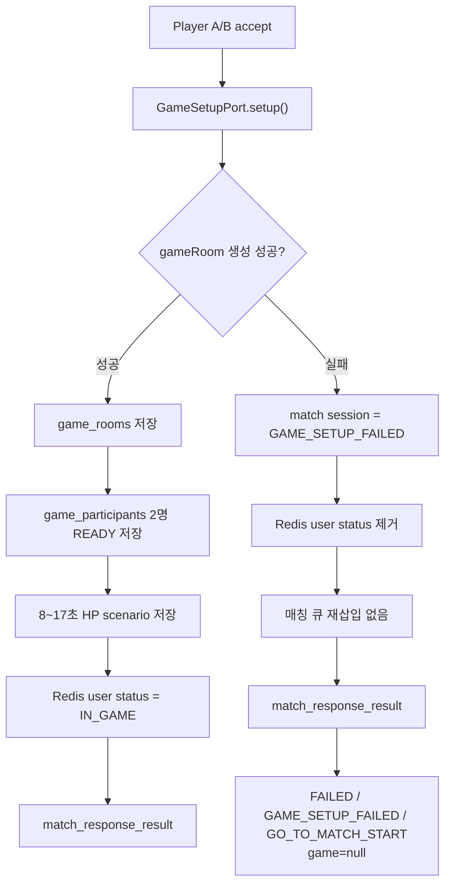
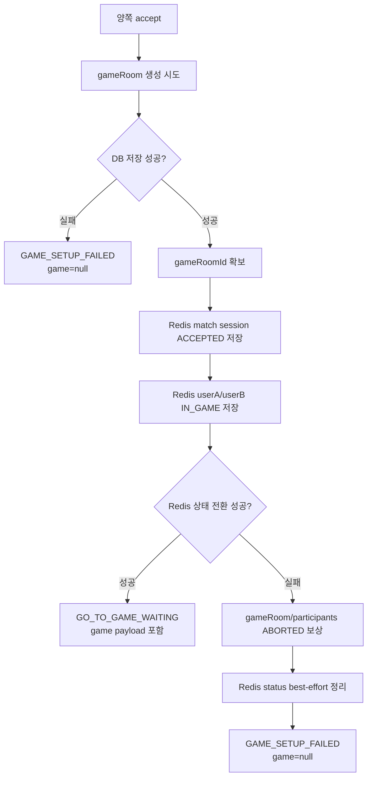

# Issue 36. Create Game Room After Both Accept

## 📌 Feature Description

두 명의 플레이어가 모두 매칭을 수락하면 서버가 먼저 gameRoom을 생성하고, 게임 대기 화면 진입에 필요한 값을 `match_response_result.game` payload로 전달한다.

현재는 양쪽 수락 시 `GO_TO_GAME_WAITING`이 발행되지만 `game=null`이다.
이번 이슈에서는 양쪽 수락 완료 시점과 게임 세션 생성의 연결 지점을 만든다.

정상 흐름:

```text
양쪽 accept
-> gameRoom 생성
-> game_participants 2명 생성
-> HP scenario 생성/저장
-> Redis user status = IN_GAME
-> match_response_result
   outcome=MATCHED
   reason=BOTH_ACCEPTED
   action=GO_TO_GAME_WAITING
```

gameRoom 생성 실패 흐름:

```text
양쪽 accept
-> gameRoom/scenario 생성 실패
-> Redis user status 제거
-> match_response_result
   outcome=FAILED
   reason=GAME_SETUP_FAILED
   action=GO_TO_MATCH_START
   game=null
```

gameRoom 생성 실패는 두 유저를 매칭 큐에 자동 복귀시키지 않는다.
클라이언트는 `reason=GAME_SETUP_FAILED`를 기준으로 안내 메시지를 보여준 뒤 start 버튼 화면으로 돌려보낸다.
gameRoom 생성 이후 Redis 상태 전환이 실패한 경우도 성공 이벤트를 발행하지 않고, 생성된 gameRoom/participant를 `ABORTED`로 보상 처리한 뒤 동일하게 `GAME_SETUP_FAILED`로 정리한다.

이번 이슈에서는 WebSocket 연결, RTT 측정, countdown, `GAME_START`, LIGHTNING 판정, `game_actions`, `game_records` 저장은 구현하지 않는다.

## 📚 Tasks

### 1. 정책/이벤트 모델 정리

- [x] `GAME_SETUP_FAILED` 실패 reason 추가 위치 확인
- [x] gameRoom 생성 실패 시 action을 `GO_TO_MATCH_START`로 결정
- [x] gameRoom 생성 실패 시 두 유저를 큐에 재삽입하지 않는 정책 반영
- [x] 클라이언트는 `GAME_SETUP_FAILED` reason 기준으로 안내 문구를 매핑하기로 결정
- [x] `match_response_result.game` 성공 payload 필드 확정
  - [x] `gameRoomId`
  - [x] `webSocketUrl`

결정 사항:

- `MatchResponseReason.GAME_SETUP_FAILED`를 추가한다.
- gameRoom 생성 실패 이벤트는 `FAILED / GAME_SETUP_FAILED / GO_TO_MATCH_START`로 내려간다.
- gameRoom 생성 실패 이벤트의 `game`은 `null`이다.
- gameRoom 생성 실패 이벤트에 별도 `message` 필드는 추가하지 않는다.
- 클라이언트는 `reason=GAME_SETUP_FAILED`를 보고 "게임 준비 중 문제가 발생했습니다. 다시 매칭을 시도해 주세요." 문구를 표시한다.
- `MatchStatus.GAME_SETUP_FAILED`를 추가해 `DECLINED`, `TIMEOUT`과 구분한다.

### 2. gameRoom 생성 유스케이스 추가

- [x] 양쪽 수락 완료 후 호출할 gameRoom 생성 서비스 정의
- [x] 입력값 정의
  - [x] `firstUserId`
  - [x] `secondUserId`
- [x] 반환값 정의
  - [x] `GameRoom`
- [x] game 도메인 관심사가 아닌 값 제거
  - [x] `matchId`
  - [x] `webSocketUrl`
- [x] 별도 실패 결과 모델 제거

결정 사항:

- 기존 코드 컨벤션에 맞춰 `CreateGameRoomUseCase` 인터페이스 대신 `GameRoomCommandService`를 둔다.
- `league-of-star-core` game 도메인은 `matchId`, SSE payload, URL 조립을 알지 않는다.
- `GameRoomCommandService`는 `GameRoom` 생성, participant 추가, 기본 scenario 생성, 저장까지만 담당한다.
- HP scenario 길이는 gameRoom 생성 시 8초 이상 17초 이하로 랜덤 결정한다.
- HP scenario는 1초 단위 step으로 구성하고, 시작 HP는 10000, 마지막 step HP는 0으로 둔다.
- gameRoom 생성 실패는 별도 result 타입이 아니라 `CoreException` 계열 예외로 전파하고, 호출부에서 `GAME_SETUP_FAILED` 이벤트로 변환한다.
- 잘못된 참가자 입력은 `CoreErrorCode.INVALID_GAME_PARTICIPANTS`로 표현한다.

### 3. gameRoom 저장 구현

- [x] `GameRoom` 생성 로직 연결
- [x] `game_rooms.status=READY`로 저장
- [x] `game_participants` 2명 추가
- [x] `game_participants.status=READY`로 저장
- [x] HP scenario 생성
- [x] `scenario_data` 저장
- [x] game WebSocket URL 반환

결정 사항:

- `GameRoomCommandService`는 DB 저장만 담당한다.
- `GameRoomSetupService`는 `league-of-star-api`의 game service에 둔다.
- game WebSocket URL은 `/ws/game/{gameRoomId}` 형식으로 반환한다.

### 4. 매칭 성공 흐름과 연결

- [x] `MatchResponseResultService` 양쪽 accept 완료 지점 확인
- [x] 기존 양쪽 accept 완료 흐름에 gameRoom 생성 호출 추가
- [x] gameRoom 생성 성공 후 match session을 `ACCEPTED`로 저장
- [x] gameRoom 생성 성공 후 timeout index cleanup 유지
- [x] gameRoom 생성 성공 후 두 유저 Redis status를 `IN_GAME`으로 전환
- [x] gameRoom 생성 성공 후 `match_response_result` 발행

결정 사항:

- `league-of-star-matching`은 `GameSetupPort`만 알고 실제 gameRoom 생성 구현은 모른다.
- `league-of-star-api`의 `GameSetupPortAdapter`가 `GameRoomSetupService`를 호출해 gameRoom을 생성한다.
- 양쪽 accept 완료 시 gameRoom 생성이 먼저 성공해야 match session을 `ACCEPTED`로 저장한다.
- gameRoom 생성 성공 후 두 유저 Redis status는 `IN_GAME`으로 전환한다.
- gameRoom 생성 성공 후 발행되는 `match_response_result` 이벤트에는 game payload를 포함한다.

### 5. `match_response_result.game` payload 채우기

- [x] matching 내부 이벤트에 game payload에 필요한 내부 결과 추가
- [x] notification factory에서 성공 이벤트의 `game`을 `null`이 아니게 생성
- [x] `gameRoomId` 매핑
- [x] `webSocketUrl` 매핑
- [x] 실패 이벤트에서는 `game=null` 유지

### 6. gameRoom 생성 실패 처리

- [x] gameRoom 생성 실패를 잡아 매칭 성공 이벤트와 분리
- [x] 두 유저 Redis status 제거
- [x] 매칭 큐 재삽입 없음
- [x] `GAME_SETUP_FAILED` reason으로 실패 이벤트 발행
- [x] action은 `GO_TO_MATCH_START`
- [x] `game=null`
- [x] 로그/메트릭 기록

결정 사항:

- `GameSetupPort.setup()` 실패는 `MatchResponseResultService`에서 잡아 처리한다.
- 실패 시 match session은 `GAME_SETUP_FAILED`로 저장한다.
- 두 유저의 Redis user status는 제거한다.
- gameRoom 생성 실패는 timeout/reject 실패와 다르게 수락 유저를 큐에 복귀시키지 않는다.
- 실패 이벤트는 기존 `match_response_result` 경로로 발행하고, notification factory에서 `GAME_SETUP_FAILED / GO_TO_MATCH_START / game=null`로 변환한다.
- accept HTTP 요청은 gameRoom 생성 실패 예외를 그대로 전파하지 않고, SSE 실패 이벤트로 최종 화면 전환을 안내한다.

### 7. Redis `IN_GAME` 상태 전환 실패 보상 처리

확정 흐름:

```text
양쪽 accept 확인
-> DB transaction으로 game_rooms 저장
-> 같은 DB transaction에서 game_participants 2명 저장
-> 같은 DB transaction에서 HP scenario 저장
-> Redis match session을 ACCEPTED로 저장
-> Redis userA/userB status를 IN_GAME으로 저장
-> timeout index cleanup
-> match_response_result 성공 이벤트 발행
```

Redis 상태 전환 실패 흐름:

```text
gameRoom 생성 성공
-> Redis match session 또는 user status 업데이트 실패
-> gameRoom ABORTED 보상 처리
-> game_participants ABORTED 보상 처리
-> Redis user status best-effort 제거
-> match session GAME_SETUP_FAILED 저장
-> timeout index cleanup
-> match_response_result 실패 이벤트 발행
```

문제 지점:

- gameRoom 생성 후 Redis `IN_GAME` 업데이트가 실패하면, DB gameRoom은 성공 상태인데 유저 Redis 상태만 일부 또는 전체가 이전 상태로 남을 수 있다.
- userA 업데이트는 성공하고 userB 업데이트만 실패하면 userA는 `IN_GAME`, userB는 이전 상태가 되어 유저별 상태가 서로 달라질 수 있다.
- 이 실패는 현재 `GameSetupPort.setup()` 실패 catch 범위 밖에서 발생하므로 `GAME_SETUP_FAILED` 이벤트로 정리되지 않을 수 있다.
- 이 경우 `GO_TO_GAME_WAITING` 성공 이벤트를 발행하면 안 되며, 큐 재삽입 없이 `GAME_SETUP_FAILED / GO_TO_MATCH_START / game=null`로 정리해야 한다.
- Redis가 비즈니스 최종 진실은 아니지만, 성공 이벤트를 발행하기 전 마지막 상태 동기화 게이트다.

- [x] Redis 상태 전환 실패 보상용 gameRoom command 추가
- [x] `GameRoom`에 `ABORTED` 전이 메서드 추가
- [x] `ParticipantStatus.ABORTED` 추가
- [x] gameRoom 보상 처리 시 `game_rooms.status=ABORTED`로 변경
- [x] gameRoom 보상 처리 시 `game_participants.status=ABORTED`로 변경
- [x] gameRoom 생성 성공 후 Redis match session `ACCEPTED` 저장 실패 케이스 처리
- [x] gameRoom 생성 성공 후 Redis user status `IN_GAME` 전환 실패 케이스 처리
- [x] Redis 상태 전환 실패 시 두 유저 Redis status 제거를 best-effort로 시도
- [x] Redis 상태 전환 실패 시 match session을 `GAME_SETUP_FAILED`로 저장
- [x] Redis 상태 전환 실패 시 매칭 큐 재삽입 없음
- [x] Redis 상태 전환 실패 시 `GO_TO_GAME_WAITING` 발행 금지
- [x] Redis 상태 전환 실패 시 `GAME_SETUP_FAILED / GO_TO_MATCH_START / game=null` 이벤트 발행
- [x] Redis 상태 전환 실패 로그/메트릭 기록
- [x] 성공 이벤트는 match session `ACCEPTED` 저장과 두 유저 `IN_GAME` 전환이 모두 성공한 뒤에만 발행

결정 사항:

- gameRoom 생성은 성공했더라도 Redis `IN_GAME` 전환이 실패하면 클라이언트에는 게임 대기 화면으로 보내지 않는다.
- 이 경우 자동 매칭 큐 복귀는 하지 않고 기존 gameRoom 생성 실패와 동일하게 `GAME_SETUP_FAILED`로 정리한다.
- Redis 상태 전환 실패는 성공 이벤트 발행 전 실패이므로, 이미 생성된 gameRoom과 participant는 `ABORTED`로 보상 처리한다.
- Redis와 DB를 하나의 원자적 transaction으로 묶으려 하지 않고, 현재 단계에서는 보상 transaction으로 정리한다.
- outbox/saga/2PC는 Redis 장애, 이벤트 발행 실패, 서버 중단 복구까지 요구되는 단계에서 후속 이슈로 검토한다.

### 8. 테스트

- [x] 양쪽 accept 시 gameRoom이 생성되는지 테스트
- [x] gameRoom participant가 2명 생성되는지 테스트
- [x] scenario가 저장되는지 테스트
- [x] 성공 후 두 유저 Redis status가 `IN_GAME`인지 테스트
- [x] gameRoom 생성 실패 시 두 유저 Redis status가 제거되는지 테스트
- [x] gameRoom 생성 실패 시 큐에 재삽입하지 않는지 테스트
- [x] gameRoom 생성 실패 이벤트가 `FAILED / GAME_SETUP_FAILED / GO_TO_MATCH_START`인지 테스트
- [x] Redis `IN_GAME` 전환 실패 시 `GAME_SETUP_FAILED` 이벤트를 발행하는지 테스트
- [x] Redis `IN_GAME` 전환 실패 시 큐에 재삽입하지 않는지 테스트
- [x] Redis `IN_GAME` 전환 실패 시 성공 이벤트를 발행하지 않는지 테스트
- [x] 기존 reject/timeout 정산 테스트가 깨지지 않는지 확인

테스트 기준:

- controller 문서는 RestAssured MockMvc 기반 RestDocs로 갱신한다.
- JPA 영속성 계층은 `@DataJpaTest`로 `game_rooms`, `game_participants`, JSON scenario 저장을 확인한다.
- Redis 영속 상태가 필요한 matching store 테스트만 Redis Testcontainer로 검증한다.
- 서비스 계층은 mock 기반 단위 테스트로 성공/실패 분기와 Redis 상태 전이를 검증한다.

### 9. 문서

- [ ] issue-34 `match_response_result` 문서에 `GAME_SETUP_FAILED` reason 추가
- [x] `GO_TO_GAME_WAITING`은 gameRoom 생성 성공 후에만 발행된다고 명시
- [x] gameRoom 생성 실패 시 큐 복귀하지 않고 start 화면으로 복귀한다고 명시
- [x] `match_response_result.game` 성공 payload 예시 추가
- [x] OpenAPI/RestDocs/SSE 문서 갱신

## ✅ 완료 기준

- 양쪽 accept 성공 시 gameRoom이 생성된다.
- `match_response_result.action=GO_TO_GAME_WAITING`은 gameRoom 생성 성공 후에만 발행된다.
- 성공 이벤트의 `game` payload가 `null`이 아니다.
- 성공 후 두 유저 Redis status는 `IN_GAME`이다.
- gameRoom 생성 실패 시 두 유저는 큐에 자동 복귀하지 않는다.
- gameRoom 생성 실패 시 두 유저는 start 버튼 화면으로 돌아갈 수 있는 실패 이벤트를 받는다.
- gameRoom 생성 후 Redis 상태 전환 실패 시 gameRoom/participant는 `ABORTED`로 보상 처리된다.
- gameRoom 생성 후 Redis 상태 전환 실패 시 `GO_TO_GAME_WAITING`은 발행되지 않는다.
- WebSocket/RTT/LIGHTNING/game_records는 이번 이슈에서 구현하지 않는다.

## 변경 이력

| 날짜 | 변경 내용 |
| :--- | :--- |
| 2026-05-13 | Issue 36 작업 문서 생성. 양쪽 accept 후 gameRoom 생성, 성공 payload, 실패 시 `GAME_SETUP_FAILED / GO_TO_MATCH_START` 정책 정리 |
| 2026-05-13 | Redis 상태 전환 실패 시 gameRoom/participant `ABORTED` 보상 처리 흐름과 Task 7 세부 작업 정리 |
| 2026-05-13 | Task 7 구현 완료. Redis `ACCEPTED`/`IN_GAME` 상태 전환 실패 시 gameRoom/participant `ABORTED` 보상 및 `GAME_SETUP_FAILED` 이벤트 처리 반영 |

----
## PR

## 📌 Summary

두 플레이어가 모두 매칭을 수락했을 때 gameRoom을 생성하고, 게임 대기 화면 진입에 필요한 payload를 `match_response_result` SSE로 전달하도록 구현했습니다.



## 📚 Changes

- gameRoom 생성 및 저장 흐름 추가
  - `GameRoomCommandService`에서 READY 상태 gameRoom 생성
  - participant 2명 READY 상태 저장
  - 8~17초 HP scenario 생성 및 `scenario_data` 저장

- 매칭 성공 흐름과 gameRoom 생성 연결
  - 양쪽 accept 완료 시 game setup을 먼저 수행
  - gameRoom 생성과 Redis 상태 전환이 모두 성공한 뒤에만 match session을 `ACCEPTED`, 두 유저 Redis status를 `IN_GAME`으로 확정



- 관심사 분리
  - `league-of-star-core`: gameRoom 저장과 도메인 로직
  - `league-of-star-matching`: 매칭 상태 전이, Redis 상태 정리, 결과 이벤트 발행
  - matching은 `GameSetupPort`만 의존하고 실제 gameRoom 생성 구현은 api adapter에서 연결

- gameRoom 생성 실패 처리
  - 실패 시 `GAME_SETUP_FAILED` 상태로 저장
  - 두 유저 Redis status 제거
  - 매칭 큐 재삽입 없음
  - 실패 이벤트는 `GO_TO_MATCH_START`, `game=null`로 발행
  - 실패 metric 및 로그 추가

- Redis 상태 전환 실패 보상 처리
  - DB 저장 실패는 gameRoomId가 없으므로 abort 없이 `GAME_SETUP_FAILED`로 정리
  - DB 저장 성공 후 Redis `ACCEPTED`/`IN_GAME` 전환이 실패하면 생성된 gameRoom과 participants를 `ABORTED`로 보상
  - `GAME_SETUP_FAILED` 세션 저장이 실패해도 Redis status 제거, timeout cleanup, metric, 실패 이벤트 발행은 best-effort로 계속 시도
  - 성공 SSE는 Redis 상태 전환까지 모두 완료된 뒤에만 발행

- 테스트 및 문서 보강
  - core: gameRoom/participants/scenario 생성 단위 테스트 및 `@DataJpaTest`
  - matching: 양쪽 accept 성공/실패 상태 전이 테스트
  - api: game setup adapter/service, notification payload 매핑 테스트
  - RestAssuredMockMvc 기반 RestDocs에 `GAME_SETUP_FAILED`와 game payload 설명 반영

## 📝 Note

- WebSocket endpoint는 아직 구현하지 않았고, payload에는 `/ws/game/{gameRoomId}` 형식의 URL만 포함합니다.
- `game` payload는 `GO_TO_GAME_WAITING`일 때만 필수이며, 실패 이벤트에서는 `game=null`입니다.
- gameRoom 생성 실패 시 자동 매칭 복귀는 하지 않는 정책을 따릅니다.

## 📌 Related Issue

- Closes #36
