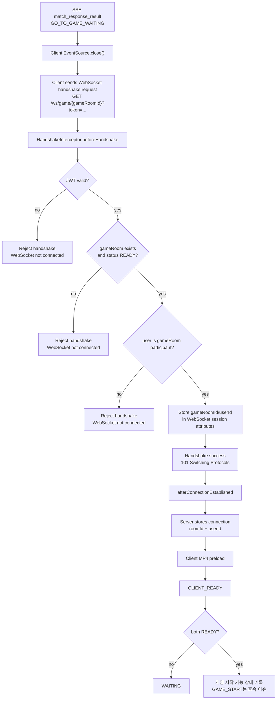

# Issue 40. Game Waiting WebSocket

## 📌 Feature Description

`GO_TO_GAME_WAITING` 이후 gameRoom별 WebSocket 연결을 열고, 참가자 인증 및 연결/READY 상태를 관리한다.

이 이슈는 게임 대기방의 연결/READY 상태 관리까지만 다룬다.
미접속/READY timeout 실행 처리, RTT 측정, countdown, `GAME_START`, scenario 전달, SMITE 판정, `game_actions`, `game_records` 저장은 후속 이슈에서 구현한다.

매칭 SSE는 `match_response_result`까지 담당한다.
클라이언트는 `match_response_result` 수신 후 매칭 SSE `EventSource.close()`를 호출하고, `GO_TO_GAME_WAITING`이면 `game.webSocketUrl`로 gameRoom WebSocket에 연결한다.



정책:

- WebSocket은 native WebSocket으로 구현한다. STOMP/SockJS는 MVP 이후 검토한다.
- 브라우저 native WebSocket은 커스텀 `Authorization` 헤더를 붙이기 어렵기 때문에 handshake에서는 `?token=` query parameter로 JWT를 검증한다.
- `/ws/game/{gameRoomId}` handshake 경로는 Spring Security whitelist에 열고, 실제 인증/인가 처리는 WebSocket handshake interceptor에서 수행한다.
- 인증 성공 후에도 gameRoom participant가 아니면 연결을 거부한다.
- `CLIENT_READY`는 WebSocket 대기 상태이며, DB `game_participants.status=READY`와 구분한다.
- GAME_START 이전 미접속/READY timeout은 후속 이슈에서 `ABORTED`로 처리하고, `game_records`와 LP는 반영하지 않는 정책으로 둔다.

native WebSocket 선택 이유:

| 비교 항목 | native WebSocket | STOMP/SockJS | 현재 판단 |
| :--- | :--- | :--- | :--- |
| 메시지 규모 | `CLIENT_READY`, 입장/이탈, 이후 RTT/SMITE처럼 소수의 명령 중심 | topic/subscribe/send 구조에 적합 | 현재 게임 대기방은 단순 명령형 통신이므로 native WebSocket이 충분함 |
| room 구조 | gameRoom 1개에 플레이어 2명 | 여러 topic, lobby, spectator, broadcast fan-out에 유리 | MVP는 1:1 gameRoom 기준이라 broker 추상화가 과함 |
| 지연/판정 제어 | handler에서 수신 시각, session, 상태를 직접 제어하기 쉬움 | broker/message mapping 계층을 거침 | 이후 RTT/SMITE 판정까지 고려하면 서버 수신 제어가 명확한 native WebSocket이 유리함 |
| 구현 복잡도 | message envelope, session registry를 직접 구현해야 함 | 프레임/구독/라우팅 모델을 제공 | 현재 필요한 기능이 작아서 직접 구현 비용이 낮음 |
| 프론트 연동 | 브라우저 기본 `WebSocket` API 사용 | STOMP client 의존성 필요 | 단순한 프론트 기술 스택 정책과 native WebSocket이 더 잘 맞음 |
| 확장성 | 다중 서버 fan-out, 재구독, 복잡한 topic은 직접 설계 필요 | broker/subscribe 기반 확장에 유리 | 관전, lobby chat, 다중 topic, broker fan-out이 필요해질 때 STOMP를 재검토함 |

## 📚 Tasks

### 1. 현재 구조와 패키지 경계 확정

- [x] `smite-api`에는 현재 `game.adapter`, `game.service`만 있으므로 WebSocket 전용 패키지를 새로 둔다.
- [x] `smite-api`가 WebSocket endpoint, handshake, session registry, message handler를 담당한다.
- [x] `smite-core`가 gameRoom 존재/상태/participant 검증을 담당한다.
- [x] `smite-matching`은 이번 이슈에서 변경하지 않는다.
- [x] `ParticipantStatus.READY`는 DB 게임 참가자 준비 상태, WebSocket `CLIENT_READY`는 대기방 연결 이후 클라이언트 준비 신호로 분리한다.
- [x] API WebSocket 계층에서 `GameRoomRepository`를 직접 호출하지 않는다.

패키지 기준:

```text
smite-api
  com.sang.smite.game.adapter
  com.sang.smite.game.service
  com.sang.smite.game.config
  com.sang.smite.game.websocket
  com.sang.smite.game.websocket.interceptor
  com.sang.smite.game.websocket.resolver
  com.sang.smite.game.websocket.dto
  com.sang.smite.game.websocket.session
  com.sang.smite.auth.infrastructure.jwt
  com.sang.smite.common.path.security

smite-core
  com.sang.smite.domain.game.service
  com.sang.smite.domain.game.repository
  com.sang.smite.domain.game.domain
  com.sang.smite.domain.game.domain.vo
  com.sang.smite.common.exception

smite-matching
  변경 없음
```

### 2. WebSocket 의존성과 endpoint 설정

- [x] `smite-api`에 `spring-boot-starter-websocket` 의존성 추가
- [x] `GameWebSocketConfig`를 `@Configuration`, `@EnableWebSocket`으로 추가
- [x] native WebSocket handler를 `/ws/game/{gameRoomId}`에 등록
- [x] handshake interceptor를 handler 등록에 연결
- [x] 현재 `WebConfig`에는 CORS 정책이 없으므로 allowed origins 정책을 명시적으로 결정
- [x] Spring Security whitelist에 `/ws/game/**` handshake 경로 추가
- [x] `/ws/game/**`는 HTTP 필터 인증을 우회하되, handshake interceptor에서 JWT 인증/인가를 수행한다고 주석 또는 문서로 명시

변경 파일:

```text
backend/smite-api/build.gradle
backend/smite-api/src/main/java/com/sang/smite/game/config/GameWebSocketConfig.java
backend/smite-api/src/main/java/com/sang/smite/game/websocket/GameWaitingWebSocketHandler.java
backend/smite-api/src/main/java/com/sang/smite/game/websocket/interceptor/GameWebSocketHandshakeInterceptor.java
backend/smite-api/src/main/java/com/sang/smite/common/path/security/SecurityPath.java
```

구현 상태:

- `/ws/game/{gameRoomId}` endpoint와 handler/interceptor wiring까지 추가한다.
- Task 3에서 handshake interceptor에 실제 JWT/participant 검증을 연결한다.
- allowed origins는 현재 별도 CORS 정책이 없으므로 MVP 기준 `setAllowedOriginPatterns("*")`로 시작한다.

### 3. WebSocket handshake 인증/인가

- [x] `GameWebSocketHandshakeInterceptor` 추가
- [x] handshake query parameter `token` 추출
- [x] `JwtTokenProvider`로 JWT 검증
- [x] token에서 `userId` 추출
- [x] URI path에서 `gameRoomId` 추출
- [x] core `GameRoomReadService`로 gameRoom READY 상태와 participant 검증
- [x] 인증 실패 시 handshake 거부
- [x] gameRoom 미존재, READY 아님, participant 아님이면 handshake 거부
- [x] 성공 시 WebSocket session attributes에 `gameRoomId`, `userId` 저장
- [x] attributes key는 상수로 분리해서 handler와 공유
- [x] query parameter token 추출은 auth infra `JwtTokenResolver`로 분리
- [x] path에서 gameRoomId 추출은 `GameWebSocketPathResolver`로 분리
- [x] query parameter token 방식은 MVP 정책으로 문서화하고, 운영 보안 강화 시 cookie 또는 최초 메시지 인증 재검토

추가/변경 파일:

```text
backend/smite-api/src/main/java/com/sang/smite/auth/infrastructure/jwt/JwtTokenResolver.java
backend/smite-api/src/main/java/com/sang/smite/game/websocket/interceptor/GameWebSocketHandshakeInterceptor.java
backend/smite-api/src/main/java/com/sang/smite/game/websocket/resolver/GameWebSocketPathResolver.java
backend/smite-api/src/main/java/com/sang/smite/game/websocket/session/GameWebSocketSessionAttribute.java
backend/smite-core/src/main/java/com/sang/smite/domain/game/service/GameRoomReadService.java
backend/smite-core/src/main/java/com/sang/smite/domain/game/domain/GameRoom.java
```

처리 흐름:

```text
beforeHandshake
  -> JwtTokenResolver.resolveWebSocketToken(uri)
  -> JwtTokenProvider.validateToken(token)
  -> JwtTokenProvider.getUserId(token)
  -> GameWebSocketPathResolver.resolveGameRoomId(uri)
  -> GameRoomReadService.validateReadyParticipant(gameRoomId, userId)
  -> attributes.put(GAME_ROOM_ID, gameRoomId)
  -> attributes.put(USER_ID, userId)
  -> true 반환
```

실패 처리:

- token 누락 또는 JWT 검증 실패: handshake 거부, `401 Unauthorized`
- gameRoomId path 형식 오류: handshake 거부, `400 Bad Request`
- gameRoom 미존재, READY 아님, participant 아님: handshake 거부, `403 Forbidden`

### 4. gameRoom participant 검증 유스케이스

- [x] `GameRoomReadService` 추가
- [x] gameRoom 존재 여부 검증
- [x] gameRoom status가 `READY`인지 검증
- [x] 요청 userId가 participant인지 검증
- [x] 실패 시 core 예외로 표현
- [x] `GameRoom` 도메인에 participant 포함 여부 확인 메서드 추가 여부 검토
- [x] 기존 `CoreErrorCode.GAME_ROOM_NOT_FOUND`, `INVALID_GAME_STATE`, `INVALID_GAME_PARTICIPANTS`를 우선 재사용

추가/변경 파일:

```text
backend/smite-core/src/main/java/com/sang/smite/domain/game/service/GameRoomReadService.java
backend/smite-core/src/main/java/com/sang/smite/domain/game/domain/GameRoom.java
```

주의:

- `smite-api` WebSocket 계층은 JPA repository를 직접 호출하지 않는다.
- gameRoom 검증은 core service를 통해 수행한다.

### 5. WebSocket session registry 구현

- [ ] gameRoomId/userId 기준 connection registry 추가
- [ ] WebSocket session id로 roomId/userId 역조회가 가능하도록 관리
- [ ] 동일 유저 중복 연결 시 기존 연결을 닫고 새 연결로 교체하는 정책 적용
- [ ] 연결 성공 시 in-memory 참가자 입장 상태 저장
- [ ] 연결 종료 시 in-memory 참가자 이탈 상태 반영
- [ ] 양쪽 연결 여부 조회 기능 추가
- [ ] `CLIENT_READY` 상태 저장 기능 추가
- [ ] 양쪽 READY 여부 조회 기능 추가
- [ ] registry는 DB 상태를 변경하지 않고 WebSocket 연결 상태만 관리

추가 파일:

```text
backend/smite-api/src/main/java/com/sang/smite/game/websocket/session/GameRoomWebSocketSessionRegistry.java
backend/smite-api/src/main/java/com/sang/smite/game/websocket/session/GameRoomWebSocketSession.java
```

정책:

- WebSocket connection은 서버 인스턴스 로컬 자원이므로 registry는 `smite-api`에 둔다.
- MVP에서는 단일 인스턴스 기준 in-memory registry로 시작한다.
- 다중 인스턴스 fan-out/redis registry는 MVP 이후 검토한다.

### 6. WebSocket message model 정의

- [ ] client message 공통 envelope 정의: `type`, `payload`
- [ ] server message 공통 envelope 정의: `type`, `payload`
- [ ] `CLIENT_READY` message 정의
- [ ] `PLAYER_JOINED`, `PLAYER_READY`, `PLAYER_LEFT`, `ERROR` server message 정의
- [ ] 이번 이슈에서는 `GAME_START` message를 정의하거나 전송하지 않음
- [ ] 잘못된 message type 처리 정책 정의
- [ ] handler는 클라이언트가 보낸 `gameRoomId`, `userId` payload를 신뢰하지 않고 session attributes만 사용

추가 파일:

```text
backend/smite-api/src/main/java/com/sang/smite/game/websocket/dto/GameWebSocketClientMessage.java
backend/smite-api/src/main/java/com/sang/smite/game/websocket/dto/GameWebSocketServerMessage.java
backend/smite-api/src/main/java/com/sang/smite/game/websocket/dto/GameWebSocketMessageType.java
```

### 7. 게임 대기 WebSocket handler 구현

- [ ] `GameWaitingWebSocketHandler` 추가
- [ ] `afterConnectionEstablished`에서 session attributes의 `gameRoomId`, `userId` 조회
- [ ] session attributes가 없으면 연결 종료
- [ ] registry에 roomId/userId/session 등록
- [ ] 연결 성공 시 같은 room 참가자에게 `PLAYER_JOINED` 전송
- [ ] `CLIENT_READY` 수신 시 ready 상태 반영
- [ ] ready 상태 변경 시 `PLAYER_READY` 전송
- [ ] 양쪽 READY여도 이번 이슈에서는 `GAME_START`를 보내지 않음
- [ ] `afterConnectionClosed`에서 registry 제거
- [ ] 같은 room 남은 참가자에게 `PLAYER_LEFT` 전송
- [ ] handler 예외 발생 시 session 정리
- [ ] JSON 파싱 실패 또는 알 수 없는 message type은 `ERROR` 전송 후 연결 유지 여부 결정

추가 파일:

```text
backend/smite-api/src/main/java/com/sang/smite/game/websocket/GameWaitingWebSocketHandler.java
```

### 8. GAME_START 이전 timeout 정책 문서화

- [ ] `GO_TO_GAME_WAITING` 이후 waiting deadline 기준 정의
- [ ] WebSocket 미접속 timeout 후속 이슈 범위로 분리
- [ ] `CLIENT_READY` 미수신 timeout 후속 이슈 범위로 분리
- [ ] GAME_START 이전 timeout은 gameRoom `ABORTED` 정책으로 처리한다고 문서화
- [ ] GAME_START 이전 timeout은 game record/LP 미반영이라고 문서화
- [ ] GAME_START 이후 disconnect 정책과 분리

주의:

- 이번 이슈에서는 timeout scheduler/worker와 abort 실행을 구현하지 않는다.
- timeout 실행 처리는 별도 후속 이슈에서 구현한다.

### 9. 테스트

- [ ] handshake JWT 누락/잘못된 token 실패 테스트
- [ ] participant가 아닌 유저 handshake 실패 테스트
- [ ] READY gameRoom participant handshake 성공 테스트
- [ ] connection registry 등록/제거 단위 테스트
- [ ] 동일 유저 중복 연결 시 기존 session 교체 테스트
- [ ] `CLIENT_READY` 수신 시 ready 상태 반영 테스트
- [ ] 양쪽 READY 전에는 게임 시작 이벤트를 보내지 않는지 테스트
- [ ] core `GameRoomReadService` participant 검증 단위/JPA 테스트
- [ ] session attributes에 저장된 roomId/userId만 사용하고 payload userId를 신뢰하지 않는지 테스트

테스트 기준:

- WebSocket handler/registry는 단위 테스트 중심으로 검증한다.
- core gameRoom 검증은 mock 단위 테스트와 필요 시 `@DataJpaTest`로 확인한다.
- controller RestDocs 대상은 아니므로 RestAssuredMockMvc 문서 테스트는 추가하지 않는다.

### 10. 문서

- [ ] `plan-checkpoint` Step 3 체크 상태 갱신
- [ ] 매칭 SSE와 game WebSocket 책임 경계 재확인
- [ ] `match_response_result` 이후 클라이언트 `EventSource.close()` 책임 명시 유지
- [ ] WebSocket endpoint와 message type 정리
- [ ] GAME_START 이전 timeout 실행 처리는 후속 이슈라고 명시
- [ ] GAME_START 이전 timeout은 record/LP 미반영 정책이라고 명시

## ✅ 완료 기준

- 클라이언트가 `/ws/game/{gameRoomId}`로 WebSocket 연결할 수 있다.
- JWT 인증 실패 또는 gameRoom participant가 아닌 유저는 연결할 수 없다.
- 서버가 gameRoom별 연결 참가자를 식별할 수 있다.
- 클라이언트가 `CLIENT_READY`를 보내면 서버가 ready 상태를 관리한다.
- 양쪽 READY 전에는 게임 시작 단계로 넘어가지 않는다.
- GAME_START 이전 timeout 실행 처리는 후속 이슈 범위로 문서화되어 있다.
- `game_records`와 LP는 이 이슈에서 반영하지 않는다.

## 📝 Note

- 이번 이슈는 게임 대기방 WebSocket 기반만 만든다.
- 미접속/READY timeout 실행 처리는 후속 이슈에서 구현한다.
- RTT 측정, countdown, `GAME_START`, scenario 전달은 후속 이슈에서 구현한다.
- SMITE 입력과 서버 판정은 후속 이슈에서 구현한다.
- MVP에서는 native WebSocket + JSON message를 사용한다.
- STOMP/SockJS, Redis 기반 WebSocket session 공유, 다중 서버 fan-out은 MVP 이후 검토한다.

## 📌 Related Issue

- Closes #40

## 변경 이력

| 날짜 | 변경 내용 |
| :--- | :--- |
| 2026-05-14 | Issue 40 작업 문서 생성. 게임 대기 WebSocket 흐름, 패키지 구조, 인증/인가, READY 상태, timeout 정책 task 정리 |
| 2026-05-14 | Issue 40 범위를 WebSocket 연결/입장/READY 상태 관리로 조정. 미접속/READY timeout 실행 처리는 후속 이슈로 분리 |
| 2026-05-14 | 현재 패키지 구조 기준으로 WebSocket 설정, handshake 인증/인가, core read service, session registry, handler, 테스트 task 구체화 |
| 2026-05-14 | Task 1 완료. 소스 기준 기존 WebSocket 설정 없음, API/game WebSocket adapter와 core gameRoom 검증 책임 경계 확정 |
| 2026-05-14 | Task 2 완료. WebSocket 의존성, `/ws/game/{gameRoomId}` endpoint 설정, fail-closed handshake interceptor, `/ws/game/**` whitelist 추가 |
| 2026-05-15 | Task 3 완료. handshake JWT 인증, gameRoom READY/participant 인가, WebSocket session attributes 저장, 실패 status code 분리 |
| 2026-05-15 | Task 3 의존 작업으로 Task 4 완료. core `GameRoomReadService`와 `GameRoom.hasParticipant` 추가 |
| 2026-05-15 | Task 3 구조 개선. token query 추출을 `JwtTokenResolver`로 분리하고 WebSocket 패키지를 `interceptor`/`session` 기준으로 정리 |
| 2026-05-15 | Task 3 구조 개선. WebSocket path의 gameRoomId 추출을 `GameWebSocketPathResolver`로 분리하고 path separator 상수화 |
