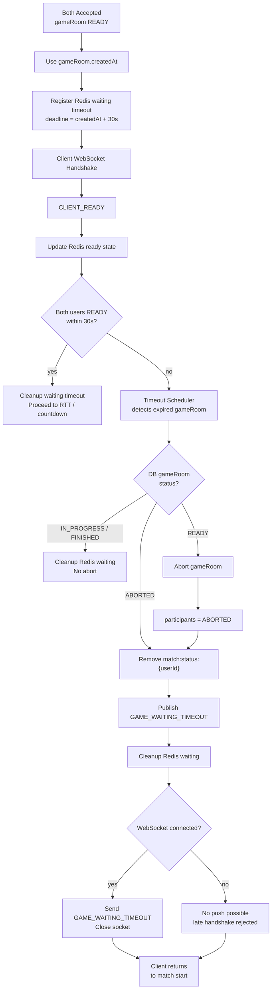
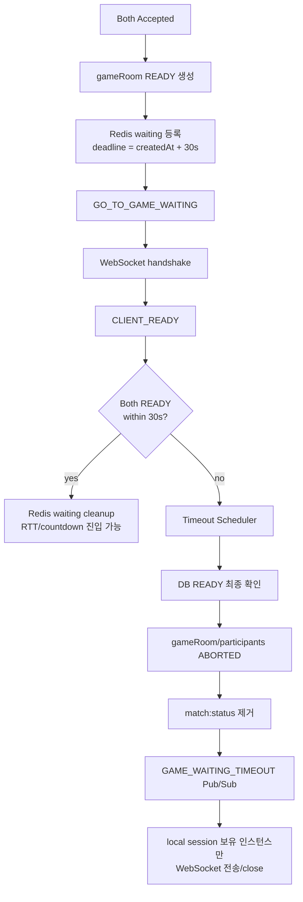
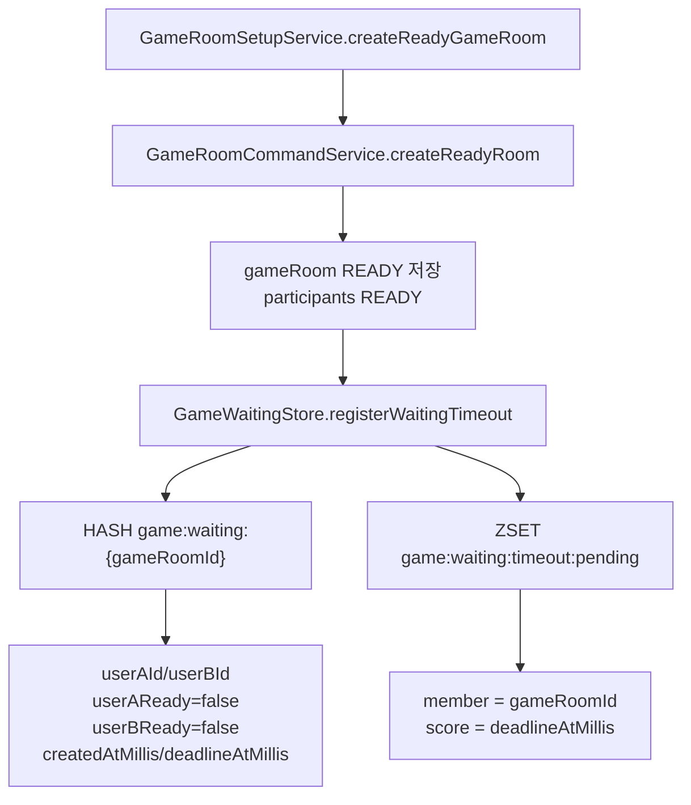
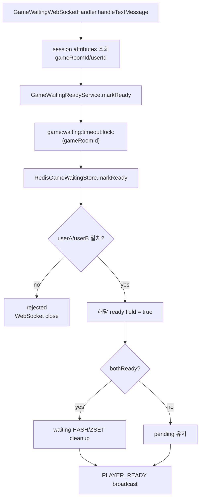
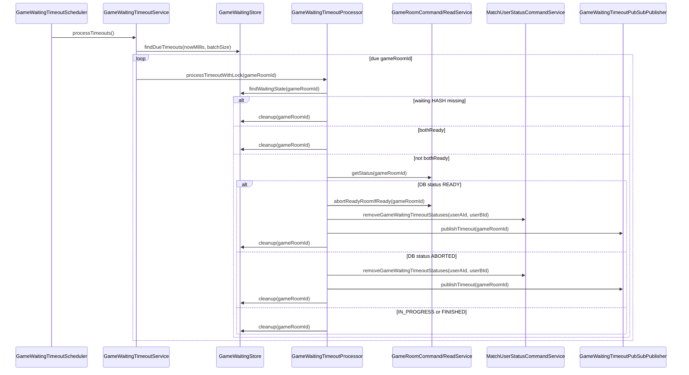
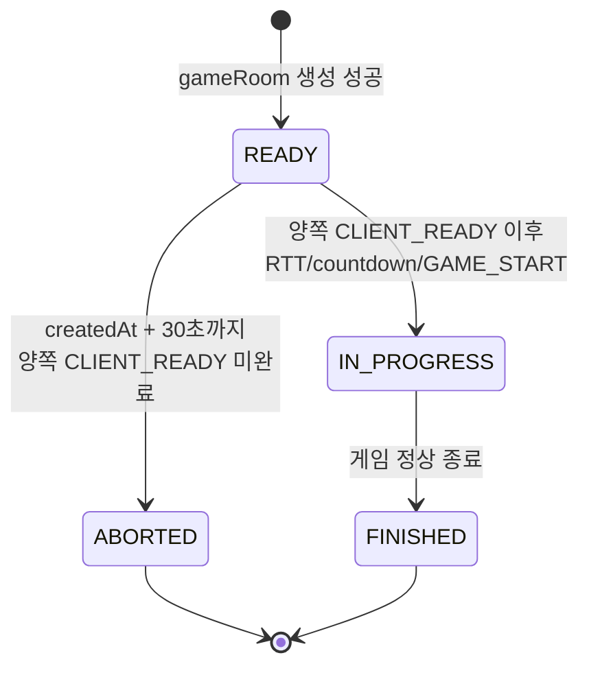
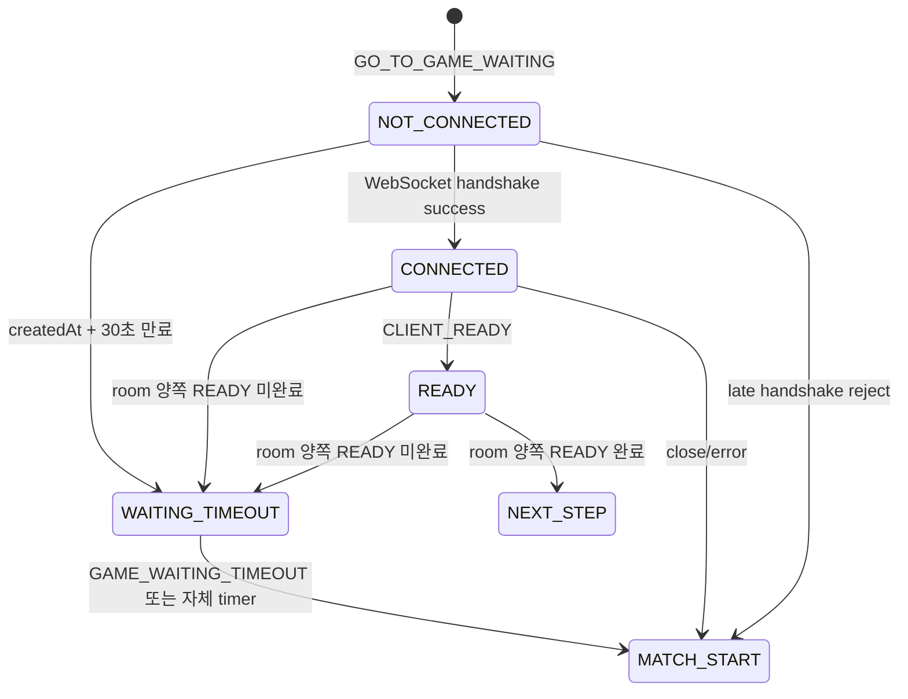
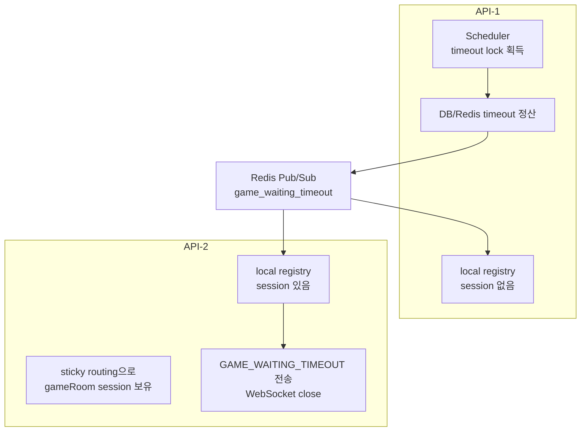
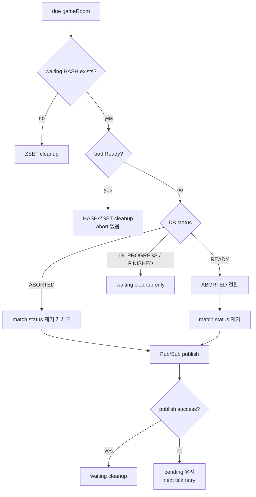

# Issue 42. Game Waiting WebSocket Timeout

## 📌 Feature Description

`GO_TO_GAME_WAITING` 이후 gameRoom이 `READY` 상태로 생성된 뒤, 두 참가자가 제한 시간 안에 게임 대기 WebSocket 연결과 `CLIENT_READY` 전송을 완료하지 못하면 gameRoom을 `ABORTED` 처리한다.

이번 이슈의 timeout 기준은 **gameRoom `createdAt` 기준 30초**다.

```text
gameRoom.createdAt + 30초
```

30초 안에 두 참가자가 모두 WebSocket에 연결하고 `CLIENT_READY`까지 보내야 다음 RTT/countdown 단계로 넘어갈 수 있다.

30초 안에 조건을 만족하지 못하면 `GAME_START` 이전 timeout으로 정리한다. 이 timeout은 아직 유효한 판이 시작되지 않은 실패이므로 `game_records`, LP, 배치/승급전 `RankSeries`에는 반영하지 않는다.

연결된 유저에게만 WebSocket timeout 이벤트를 보낸다. WebSocket에 접속하지 않은 유저는 실시간 이벤트를 받을 수 없으므로 별도 push를 보내지 않는다. 미접속 유저가 늦게 WebSocket handshake를 시도하면 DB gameRoom 상태가 이미 `ABORTED`이므로 handshake가 거절되고, 클라이언트는 start 버튼 화면으로 복귀한다.



정상 대기 timeout 흐름:

```text
gameRoom READY 생성
-> gameRoom.createdAt 기준 deadline = createdAt + 30초
-> Redis waiting timeout index 등록
-> 참가자 WebSocket 연결 대기
-> CLIENT_READY 수신 시 Redis ready 상태 갱신
-> 30초 안에 양쪽 ready 미완료
-> gameRoom ABORTED
-> participants ABORTED
-> Redis match:status:{userId} 제거
-> GAME_WAITING_TIMEOUT Pub/Sub 발행
-> Redis waiting 상태 정리
-> 연결된 WebSocket session에 GAME_WAITING_TIMEOUT 전송 후 close
-> 미접속 유저는 별도 push 없음
```

멀티 인스턴스 전제:

- `/ws/game/{gameRoomId}`는 `gameRoomId` 기반 sticky routing을 사용한다.
- sticky routing은 같은 gameRoom의 WebSocket session이 같은 API 인스턴스 local registry에 모이게 하기 위한 전제다.
- timeout scheduler는 각 API 인스턴스에서 돌 수 있으므로 local registry만 보고 timeout을 판정하지 않는다.
- timeout 판정은 Redis waiting 상태와 DB gameRoom 상태를 기준으로 한다.
- timeout 이벤트 전송은 Redis Pub/Sub으로 모든 API 인스턴스에 알리고, 실제 WebSocket session을 가진 인스턴스만 local registry를 보고 전송한다.

## 📚 Tasks

### 1. 정책과 책임 경계 확정

- [x] 게임 대기 WebSocket timeout duration을 30초 상수로 정의한다.
- [x] timeout 기준 시각은 gameRoom `createdAt`으로 고정한다.
- [x] timeout 조건을 명확히 한다.
  - [x] `gameRoom.status == READY`
  - [x] `now >= gameRoom.createdAt + 30초`
  - [x] Redis waiting 상태 기준 양쪽 참가자가 모두 `CLIENT_READY` 완료 상태가 아님
- [x] `CONNECTED`는 timeout 통과 조건으로 보지 않고, 최종 통과 조건은 양쪽 `CLIENT_READY`로 둔다.
- [x] `GAME_START` 이전 timeout은 gameRoom `ABORTED`로 처리한다.
- [x] `GAME_START` 이전 timeout은 `game_records`, LP, 배치/승급전 `RankSeries`에 반영하지 않는다.
- [x] timeout 이후 두 유저를 매칭 큐에 자동 복귀시키지 않는다.
- [x] timeout 이후 Redis `match:status:{userId}`는 제거해 다음 매칭 시도를 막지 않도록 한다.
- [x] 연결된 유저에게만 WebSocket timeout 이벤트를 보낸다.
- [x] 미접속 유저에게는 실시간 이벤트를 보내지 않고, 늦은 handshake 실패 또는 클라이언트 자체 timer로 start 화면 복귀하도록 둔다.

결정 사항:

- timeout 정책값: 30초
- 기준: gameRoom `createdAt`
- Redis TTL: timeout 정책값이 아니라 cleanup 안전장치로 사용한다.
- WebSocket 이벤트는 연결된 session에만 전송 가능하다.
- API polling은 primary 응답 방식으로 사용하지 않는다.

구현 결과:

- timeout 정책값은 30초로 확정한다.
- timeout 기준은 `GO_TO_GAME_WAITING` 수신 시각이나 SSE 발행 시각이 아니라 DB에 저장된 gameRoom `createdAt`이다.
- timeout 판정의 최종 조건은 `gameRoom.status == READY`와 Redis waiting 상태 기준 양쪽 `CLIENT_READY` 미완료다.
- WebSocket `CONNECTED`는 중간 연결 상태일 뿐 timeout 통과 조건이 아니다.
- timeout 정산은 `GAME_START` 이전 실패로 보며, gameRoom/participants만 `ABORTED` 처리한다.
- timeout 정산은 `game_actions`, `game_records`, LP, 배치/승급전 `RankSeries` 흐름을 호출하지 않는다.
- 큐 자동 복귀는 하지 않는다. 다만 기존 Redis `match:status:{userId}`는 제거해서 유저가 직접 다시 매칭을 시작할 수 있게 한다.
- 미접속 유저는 WebSocket session이 없으므로 서버 push 대상이 아니다.
- 연결된 유저에게만 `GAME_WAITING_TIMEOUT`을 전송하고 WebSocket을 닫는다.
- 미접속 유저가 늦게 WebSocket handshake를 시도하면 gameRoom `ABORTED` 상태 검증에서 거절된다.

책임 경계:

| 영역 | 책임 |
|------|------|
| `smite-core` | gameRoom `READY -> ABORTED` 상태 전이, participants `ABORTED` 처리 |
| `smite-api` WebSocket | handshake/session 관리, `CLIENT_READY` 수신, 연결된 session에 timeout 이벤트 전송 |
| Redis waiting store | gameRoom별 ready 상태와 timeout deadline 저장 |
| timeout scheduler/service | due gameRoom 조회, Redis ready 상태 확인, DB READY 최종 확인, abort orchestration |
| Redis match status store | timeout 후 `match:status:{userId}` 제거 |
| client | `GAME_WAITING_TIMEOUT`, handshake 실패, close/error, 자체 30초 timer 기반 start 화면 복귀 |

### 2. Redis waiting timeout 저장 구조 설계

- [x] Redis key naming을 확정한다.
- [x] gameRoom timeout deadline index를 ZSET으로 둔다.
- [x] gameRoom별 waiting 상태를 HASH로 둔다.
- [x] Redis HASH TTL은 60초로 둔다.
- [x] timeout 완료 또는 양쪽 READY 완료 시 Redis waiting key와 ZSET index를 정리한다.
- [x] scheduler 지연 또는 정리 실패가 있어도 TTL로 eventually cleanup 되도록 한다.
- [x] Redis 저장소는 최소 필드만 가진다.

제안 구조:

```text
ZSET game:waiting:timeout:pending
  member = gameRoomId
  score = deadlineAtMillis

HASH game:waiting:{gameRoomId}
  userAId = 1
  userBId = 2
  userAReady = false
  userBReady = false
  createdAtMillis = 1716000000000
  deadlineAtMillis = 1716000030000
  TTL = 60초

LOCK game:waiting:timeout:lock:{gameRoomId}
  purpose = scheduler 중복 timeout 정산 방지
  lease = 짧은 작업 lease
```

필드 선택 이유:

- `CONNECTED`는 Redis에 저장하지 않는다.
- timeout 통과 조건은 양쪽 `CLIENT_READY` 완료 여부이므로 `userAReady`, `userBReady`만 Redis 판정 필드로 둔다.
- 실제 WebSocket session 객체와 전송 가능 여부는 API local registry가 관리한다.
- `createdAtMillis`, `deadlineAtMillis`는 디버깅과 metric 기록에 사용한다.
- ZSET score는 scheduler가 due gameRoom을 빠르게 찾기 위한 deadline index다.
- `game:waiting:timeout:lock:{gameRoomId}`는 멀티 인스턴스 scheduler가 같은 gameRoom timeout을 동시에 정산하지 않도록 하는 작업 lock이다.
- 이번 이슈의 Redis waiting 상태에는 processing ZSET을 두지 않는다. timeout 정산은 gameRoom `READY -> ABORTED` 전이가 idempotent해야 하며, 작업 실패 시 pending ZSET과 HASH TTL로 재처리/cleanup 여지를 둔다.

구현 결과:

- Redis key는 game 대기 도메인임을 드러내도록 `game:waiting:*` prefix로 통일한다.
- timeout 후보 index는 단일 ZSET `game:waiting:timeout:pending`으로 둔다.
  - member: `gameRoomId`
  - score: `deadlineAtMillis`
- gameRoom별 상태는 HASH `game:waiting:{gameRoomId}`로 둔다.
- HASH field는 최소 6개만 사용한다.
  - `userAId`
  - `userBId`
  - `userAReady`
  - `userBReady`
  - `createdAtMillis`
  - `deadlineAtMillis`
- ready field는 문자열 `"true"` / `"false"`로 저장하는 방향을 우선한다.
- HASH TTL은 60초로 둔다.
  - timeout 정책값 30초와 별도다.
  - timeout 정책값과 TTL을 모두 30초로 맞추면 scheduler가 deadline 직후 실행될 때 HASH가 먼저 만료될 수 있다.
  - HASH가 먼저 사라지면 `양쪽 READY 완료 후 cleanup 일부 실패`와 `아직 READY 미완료인데 TTL 만료`를 구분하기 어렵다.
  - 따라서 TTL은 timeout 판정에 필요한 상태를 deadline 이후에도 잠깐 보존하는 안전장치로 두며, 60초로 확정한다.
- ZSET index는 TTL이 없으므로 양쪽 READY 완료, timeout 완료, HASH 없음 감지 시 명시적으로 제거한다.
- 멀티 인스턴스 scheduler 중복 정산 방지를 위해 `game:waiting:timeout:lock:{gameRoomId}` lock key를 사용한다.
- 실제 WebSocket session 전송 가능 여부는 Redis에 저장하지 않고 API local registry로 판단한다.

패키지/모듈 분리 검토:

| 모듈/패키지 | 배치 대상 | 이유 |
|------|------|------|
| `smite-core` `domain.game` | gameRoom `READY -> ABORTED` 도메인 전이, participant 상태 변경 | core는 JPA/domain만 알고 Redis/WebSocket을 몰라야 함 |
| `smite-api` `game.websocket` | WebSocket handler, DTO, session registry | 기존 Issue 40 구조와 동일하게 API transport 계층 책임 |
| `smite-api` `game.waiting` | waiting timeout service/scheduler, Redis waiting store, timeout Pub/Sub sender/subscriber | gameRoom waiting은 matching 큐가 아니라 game 대기방 orchestration 책임 |
| `smite-matching` `command` | 필요 시 match status 제거용 command facade | `match:status:{userId}`의 소유권은 matching 모듈에 있으므로 직접 store 접근보다 command 경유가 적절 |
| `smite-infra-redis` | 공통 Redisson config/lock만 유지 | 특정 game waiting key 구현을 공통 infra에 섞지 않음 |

컨벤션 확인:

- `smite-core`에는 Spring WebSocket/Redis 의존을 추가하지 않는다.
- API WebSocket handler는 DB repository를 직접 호출하지 않고 service를 통해 처리한다.
- Redis waiting 구현체는 구체 기술이 드러나는 `RedisGameWaitingStore` 같은 이름을 사용한다.
- 저장소 port는 `GameWaitingStore`처럼 `I` 접두사 없이 둔다.
- scheduler는 trigger만 담당하고, 실제 정산 흐름은 service로 분리한다.
- 상수는 magic string으로 흩뿌리지 않고 waiting 전용 constants에 모은다.

확정 Redis 구조:

| Redis key | Type | 필드/값 | TTL | 용도 |
|------|------|------|------|------|
| `game:waiting:timeout:pending` | ZSET | member=`gameRoomId`, score=`deadlineAtMillis` | 없음 | timeout scheduler due gameRoom 조회 |
| `game:waiting:{gameRoomId}` | HASH | `userAId`, `userBId`, `userAReady`, `userBReady`, `createdAtMillis`, `deadlineAtMillis` | 60초 | gameRoom waiting ready 상태 판정 |
| `game:waiting:timeout:lock:{gameRoomId}` | Lock | Redisson lock | 작업 lease | 멀티 인스턴스 중복 timeout 정산 방지 |

cleanup 정책:

| 상황 | cleanup |
|------|------|
| 양쪽 `CLIENT_READY` 완료 | `game:waiting:{gameRoomId}` 삭제, `game:waiting:timeout:pending`에서 gameRoomId 제거 |
| timeout abort, match status 제거, timeout 이벤트 publish 완료 | `game:waiting:{gameRoomId}` 삭제, `game:waiting:timeout:pending`에서 gameRoomId 제거 |
| scheduler가 due gameRoom을 봤지만 HASH 없음 | `game:waiting:timeout:pending`에서 gameRoomId 제거 |
| scheduler가 due gameRoom을 봤지만 DB status가 `ABORTED` | `match:status:{userId}` 제거 후 `game:waiting:{gameRoomId}` 삭제, `game:waiting:timeout:pending`에서 gameRoomId 제거 |
| scheduler가 due gameRoom을 봤지만 DB status가 `IN_PROGRESS` 또는 `FINISHED` | `game:waiting:{gameRoomId}` 삭제, `game:waiting:timeout:pending`에서 gameRoomId 제거 |
| scheduler가 `READY`를 조회했지만 safe abort가 no-op | cleanup하지 않고 pending 유지 후 다음 tick에서 재확인 |

### 3. gameRoom 생성 성공 시 waiting timeout 등록

- [x] 양쪽 accept 후 gameRoom 생성이 성공한 시점을 확인한다.
- [x] gameRoom 저장 후 `createdAt`을 기준으로 `deadlineAtMillis = createdAt + 30초`를 계산한다.
- [x] gameRoom participant 두 명의 userId를 조회한다.
- [x] Redis `game:waiting:{gameRoomId}` HASH를 저장한다.
- [x] Redis `game:waiting:timeout:pending` ZSET에 deadline을 등록한다.
- [x] Redis waiting 등록 실패 시 처리 정책을 결정한다.
  - [x] 성공 이벤트 발행 전 실패라면 `GAME_SETUP_FAILED`로 정리할지 검토
  - [x] 이미 `GO_TO_GAME_WAITING` 발행 이후 실패 가능한 지점이 없도록 호출 순서 정리
- [x] 기존 `match_response_result.game` payload 발행 흐름과 순서를 확인한다.

주의:

- waiting timeout 등록은 `GO_TO_GAME_WAITING` 이후 클라이언트를 게임 대기 화면으로 보낼 수 있는 상태를 만드는 작업이다.
- Redis waiting 등록이 실패했는데 클라이언트를 게임 대기 화면으로 보내면 timeout 정산이 불가능해질 수 있다.
- 따라서 성공 이벤트 발행 전 waiting timeout 등록을 완료하는 방향을 우선 검토한다.

구현 결과:

- `GameRoomSetupService.createReadyGameRoom()`에서 `GameRoomCommandService.createReadyRoom()` 성공 직후 waiting timeout을 등록한다.
- Redis 등록은 `GameWaitingStore.registerWaitingTimeout()` port를 통해 수행한다.
- 구현체는 `RedisGameWaitingStore`이며 `StringRedisTemplate`으로 HASH/ZSET을 저장한다.
- Redis HASH key는 `game:waiting:{gameRoomId}`다.
- Redis ZSET key는 `game:waiting:timeout:pending`이다.
- HASH field는 다음 6개로 저장한다.
  - `userAId`
  - `userBId`
  - `userAReady=false`
  - `userBReady=false`
  - `createdAtMillis`
  - `deadlineAtMillis`
- `deadlineAtMillis`는 `gameRoom.createdAt + 30초` 기준으로 계산한다.
- HASH TTL은 60초로 설정한다.
- Redis waiting 등록 실패 시 `GameRoomSetupService`가 생성된 READY gameRoom을 `abortReadyRoom(gameRoomId)`로 보상 처리하고 예외를 다시 던진다.
- `MatchResponseResultService.completeAcceptedSession()`은 `gameSetupPort.setup()` 실패를 잡아 기존 `GAME_SETUP_FAILED` 흐름으로 정리한다.
- `GO_TO_GAME_WAITING` payload를 포함한 match response result event는 `gameSetupPort.setup()` 성공, match session/user status 저장 성공 이후에만 발행된다.
- 따라서 Redis waiting 등록 실패 상태에서 클라이언트가 게임 대기 화면으로 이동하지 않는다.

추가된 코드:

| 파일 | 역할 |
|------|------|
| `smite-api/game/waiting/common/constant/GameWaitingConstants` | waiting timeout 정책값, Redis key/field 상수 |
| `smite-api/game/waiting/domain/GameWaitingTimeoutRegistration` | timeout 등록 요청 모델 |
| `smite-api/game/waiting/repository/GameWaitingStore` | waiting 상태 저장 port |
| `smite-api/game/waiting/infrastructure/redis/RedisGameWaitingStore` | Redis HASH/ZSET 등록 구현 |
| `smite-api/game/service/GameRoomSetupService` | gameRoom 생성 직후 waiting timeout 등록 및 실패 시 abort 보상 |

### 4. WebSocket handshake/READY와 Redis waiting 상태 연동

- [x] handshake 성공 시 Redis에 `CONNECTED`를 기록하지 않는다.
- [x] `CLIENT_READY` 수신 시 Redis waiting HASH의 해당 유저 ready 값을 `true`로 갱신한다.
- [x] `CLIENT_READY`를 보낸 userId가 gameRoom의 userA/userB 중 누구인지 확인한다.
- [x] 이미 timeout 또는 abort된 gameRoom이면 `CLIENT_READY` 처리를 거부하거나 no-op 처리한다.
- [x] 양쪽 ready가 모두 true가 되면 waiting timeout index를 정리한다.
- [x] 양쪽 ready가 모두 true이면 다음 RTT/countdown 단계로 넘어갈 수 있는 상태로 둔다.
- [x] `PLAYER_READY` broadcast는 기존 local registry 기반 흐름을 유지한다.

처리 흐름:

```text
CLIENT_READY 수신
-> session attributes에서 gameRoomId/userId 확인
-> Redis game:waiting:{gameRoomId} 조회
-> userAId/userBId 중 일치하는 필드의 ready=true
-> 둘 다 ready인지 확인
-> 둘 다 ready이면 timeout ZSET cleanup
-> 기존 PLAYER_READY broadcast
```

주의:

- 클라이언트 payload의 userId/gameRoomId는 신뢰하지 않는다.
- 기존 Issue 40 정책처럼 handshake session attributes만 신뢰한다.

구현 결과:

- handshake 성공 시 Redis에는 아무 상태도 추가하지 않는다.
- WebSocket session local registry에는 기존처럼 연결 session만 등록한다.
- `CLIENT_READY` 수신 시 `GameWaitingReadyService.markReady(gameRoomId, userId)`를 호출한다.
- `GameWaitingReadyService.markReady()`는 `game:waiting:timeout:lock:{gameRoomId}` 기준 Redis lock 안에서 실행한다.
  - timeout scheduler와 READY cleanup이 같은 gameRoom waiting 상태를 동시에 정리하지 않도록 하기 위함이다.
  - matching 응답 timeout의 `match:session:lock:{matchId}`와는 별개 lock이다.
- `RedisGameWaitingStore.markReady()`는 `game:waiting:{gameRoomId}` HASH를 읽고, session attribute의 userId가 `userAId` 또는 `userBId`와 일치하는지 확인한다.
- 일치하는 유저의 ready field만 `true`로 변경한다.
  - `userAId` 일치 시 `userAReady=true`
  - `userBId` 일치 시 `userBReady=true`
- 양쪽 ready가 모두 `true`가 되면 다음 Redis waiting 상태를 정리한다.
  - `game:waiting:{gameRoomId}` 삭제
  - `game:waiting:timeout:pending`에서 gameRoomId 제거
- Redis waiting HASH가 없거나 userId가 참가자와 일치하지 않으면 `CLIENT_READY`를 rejected로 보고 WebSocket session을 close한다.
- `PLAYER_READY` broadcast의 userId는 클라이언트 payload가 아니라 session attribute의 userId를 사용한다.
- `PLAYER_READY.payload.bothReady`는 Redis waiting 상태 갱신 결과를 기준으로 내려준다.

추가/변경 코드:

| 파일 | 역할 |
|------|------|
| `smite-api/game/waiting/domain/GameWaitingReadyResult` | Redis ready 반영 결과 |
| `smite-api/game/waiting/service/GameWaitingReadyService` | `CLIENT_READY` Redis 반영 및 gameRoom 단위 lock 적용 |
| `smite-api/game/waiting/repository/GameWaitingStore` | `markReady`, `cleanup` port 추가 |
| `smite-api/game/waiting/infrastructure/redis/RedisGameWaitingStore` | ready field 갱신, both ready 시 HASH/ZSET cleanup |
| `smite-api/game/websocket/handler/GameWaitingWebSocketHandler` | `CLIENT_READY` 수신 시 Redis waiting 상태 연동 |

### 5. timeout scheduler 구현

- [x] `GameWaitingTimeoutScheduler`를 추가한다.
- [x] scheduler fixed delay를 정의한다.
  - [x] MVP 기준 1초 주기 검토
- [x] Redis `game:waiting:timeout:pending` ZSET에서 due gameRoomId를 조회한다.
- [x] due gameRoomId별 timeout 처리를 시도한다.
- [x] Redis HASH가 없으면 ZSET index를 cleanup한다.
- [x] Redis HASH 기준 양쪽 ready가 모두 true면 ZSET index를 cleanup하고 no-op 처리한다.
- [x] 양쪽 ready가 모두 true가 아니면 DB gameRoom 상태를 최종 확인한다.
- [x] DB gameRoom이 `READY`가 아니면 Redis waiting 상태와 ZSET index를 cleanup한다.
- [x] DB gameRoom이 `READY`면 timeout abort 처리를 수행한다.
- [x] 개별 gameRoom 처리 실패가 batch 전체를 중단하지 않도록 한다.

최종 timeout 판정:

```text
now >= deadlineAtMillis
AND Redis ready 상태가 userAReady && userBReady가 아님
AND DB gameRoom.status == READY
```

DB 최종 확인 이유:

- scheduler가 Redis due 상태를 본 직후 다른 흐름에서 gameRoom이 다음 단계로 넘어갈 수 있다.
- 최종 abort 전에는 반드시 DB의 `READY` 상태를 확인해야 오판을 막을 수 있다.

구현 결과:

- `GameWaitingTimeoutScheduler`를 추가했다.
  - fixed delay: 1초
  - scheduler는 `GameWaitingTimeoutService.processTimeouts()`만 호출한다.
- `GameWaitingTimeoutService`는 현재 시각 기준 due gameRoomId 목록을 조회하고, gameRoomId별 timeout 처리를 순회한다.
- due 조회는 Redis ZSET `game:waiting:timeout:pending`에서 `score <= nowMillis` 기준으로 수행한다.
- batch size는 100으로 둔다.
- 단일 gameRoom 정산은 `GameWaitingTimeoutProcessor.processTimeoutWithLock(gameRoomId)`가 담당한다.
- `GameWaitingTimeoutProcessor.processTimeoutWithLock()`는 `game:waiting:timeout:lock:{gameRoomId}` lock 안에서 실행한다.
- lock 획득 실패 시 해당 gameRoom은 이번 tick에서 skip한다.
  - HASH 삭제하지 않는다.
  - ZSET 삭제하지 않는다.
  - DB abort 하지 않는다.
  - 다음 gameRoom 처리는 계속한다.
- 개별 gameRoom 처리 중 예외가 발생하면 로그만 남기고 다음 gameRoom 처리를 계속한다.
  - 처리 중 예외가 난 gameRoom의 pending ZSET/HASH는 유지해서 다음 scheduler tick에서 재시도한다.
- 명확한 no-op 또는 성공 처리일 때만 cleanup한다.
  - Redis HASH 없음: cleanup
  - Redis 기준 bothReady=true: cleanup
  - DB gameRoom status가 `IN_PROGRESS` 또는 `FINISHED`: cleanup
  - DB gameRoom status가 `ABORTED`: match status 제거와 timeout 이벤트 publish 후 cleanup
  - DB gameRoom status가 `READY`이며 abort, match status 제거, timeout 이벤트 publish 성공: cleanup
- DB gameRoom status 조회는 `GameRoomReadService.getStatus(gameRoomId)`로 수행한다.
- READY gameRoom abort는 scheduler-safe 유스케이스인 `GameRoomCommandService.abortReadyRoomIfReady(gameRoomId)`를 사용한다.

추가/변경 코드:

| 파일 | 역할 |
|------|------|
| `smite-api/game/waiting/scheduler/GameWaitingTimeoutScheduler` | 1초 주기 timeout batch trigger |
| `smite-api/game/waiting/service/GameWaitingTimeoutService` | due gameRoomId 조회 및 batch 순회, lock 실패/예외 격리 |
| `smite-api/game/waiting/service/GameWaitingTimeoutProcessor` | 단일 gameRoom timeout 정산, gameRoom 단위 lock 적용 |
| `smite-api/game/waiting/domain/GameWaitingState` | Redis waiting HASH 상태 모델 |
| `smite-api/game/waiting/repository/GameWaitingStore` | due 조회, waiting state 조회 port 추가 |
| `smite-api/game/waiting/infrastructure/redis/RedisGameWaitingStore` | ZSET due 조회, HASH state 조회 구현 |
| `smite-core/domain/game/service/GameRoomReadService` | gameRoom status 조회 메서드 추가 |

### 6. gameRoom abort 처리 유스케이스 구현

- [x] core `GameRoomCommandService`에 waiting timeout abort 유스케이스를 추가하거나 기존 `abortReadyRoom`을 재사용한다.
- [x] `game_rooms.status = ABORTED`로 변경한다.
- [x] `game_rooms.finishedAt = now`로 기록한다.
- [x] `game_participants.status = ABORTED`로 변경한다.
- [x] 이미 `ABORTED`면 idempotent 하게 no-op 처리한다.
- [x] `READY`가 아닌 상태에서 abort 요청이 들어오면 안전하게 no-op 또는 예외 중 하나로 정책을 확정한다.
- [x] `game_actions`는 생성하지 않는다.
- [x] `game_records`는 생성하지 않는다.
- [x] LP, 배치, 승급전 반영 로직을 호출하지 않는다.

권장 정책:

- scheduler timeout abort는 idempotent 해야 한다.
- `READY` 상태만 `ABORTED`로 전환한다.
- 이미 `ABORTED`, `IN_PROGRESS`, `FINISHED`면 timeout abort는 no-op으로 처리하는 방향을 우선 검토한다.

구현 결과:

- 기존 strict abort 유스케이스 `GameRoomCommandService.abortReadyRoom(gameRoomId)`는 유지한다.
  - gameRoom이 없으면 `GAME_ROOM_NOT_FOUND` 예외를 던진다.
  - gameRoom이 `READY`가 아니면서 `ABORTED`도 아니면 `INVALID_GAME_STATE` 예외를 던진다.
  - game setup 실패 보상처럼 "방금 만든 READY gameRoom을 반드시 중단해야 하는 흐름"에서 사용한다.
- timeout scheduler용 safe abort 유스케이스 `GameRoomCommandService.abortReadyRoomIfReady(gameRoomId)`를 추가했다.
  - gameRoom이 `READY`이면 `ABORTED`로 전환하고 `true`를 반환한다.
  - gameRoom이 `ABORTED`, `IN_PROGRESS`, `FINISHED`이면 상태를 바꾸지 않고 `false`를 반환한다.
  - gameRoom이 없으면 stale Redis timeout 대상으로 보고 `false`를 반환한다.
- 도메인에는 `GameRoom.abortBeforeStartIfReady()`를 추가했다.
  - `READY` 상태만 `ABORTED`로 전환한다.
  - `finishedAt`을 기록한다.
  - participants 상태를 `ABORTED`로 변경한다.
  - `READY`가 아니면 no-op으로 `false`를 반환한다.
- timeout processor는 `abortReadyRoomIfReady(gameRoomId)`를 사용한다.
  - 이미 `IN_PROGRESS` 또는 `FINISHED`인 gameRoom이면 abort하지 않고 Redis waiting 상태만 cleanup한다.
  - abort 처리 중 예외가 발생하면 cleanup하지 않고 pending을 유지해 다음 scheduler tick에서 재시도한다.
- `game_actions`, `game_records`, LP, 배치/승급전 관련 service는 호출하지 않는다.

추가/변경 코드:

| 파일 | 역할 |
|------|------|
| `smite-core/domain/game/domain/GameRoom` | `abortBeforeStartIfReady()` safe transition 추가 |
| `smite-core/domain/game/service/GameRoomCommandService` | `abortReadyRoomIfReady()` timeout-safe abort 유스케이스 추가 |
| `smite-api/game/waiting/service/GameWaitingTimeoutProcessor` | timeout 정산에서 safe abort 유스케이스 사용 |

### 7. Redis match status 정리

- [x] timeout 대상 gameRoom의 두 참가자 userId를 확보한다.
- [x] Redis `match:status:{userAId}`를 제거한다.
- [x] Redis `match:status:{userBId}`를 제거한다.
- [x] 제거 실패는 waiting cleanup 없이 pending을 유지해 다음 scheduler tick에서 재시도한다.
- [x] 큐 자동 복귀는 하지 않는다.

정책:

- 매칭 성공 이후 두 유저의 Redis match status는 `IN_GAME`이다.
- game waiting timeout으로 게임이 시작되지 못하면 두 유저가 다시 매칭을 시도할 수 있어야 한다.
- 따라서 `match:status:{userId}`는 제거한다.
- 제거는 큐 복귀가 아니다. 단지 다음 매칭 시도를 막는 상태 lock을 푸는 작업이다.

구현 결과:

- `match:status:{userId}` 소유권은 matching 모듈에 있으므로 `smite-api`가 Redis store를 직접 호출하지 않는다.
- `smite-matching`에 `MatchUserStatusCommandService.removeGameWaitingTimeoutStatuses(userAId, userBId)`를 추가했다.
- timeout processor는 Redis waiting HASH의 `userAId`, `userBId`를 사용해 두 유저의 match status를 제거한다.
- match status 제거는 현재 값이 `IN_GAME`인 경우에만 수행한다. 재시도 중 유저가 이미 새 매칭을 시작해 `MATCHING` 상태가 된 경우에는 제거하지 않는다.
- DB gameRoom이 `READY`이면 `abortReadyRoomIfReady(gameRoomId)` 성공 후 match status 제거와 timeout 이벤트 publish를 완료하고 Redis waiting 상태를 cleanup한다.
- DB gameRoom이 이미 `ABORTED`이면 이전 tick에서 abort 이후 실패한 케이스로 보고 match status 제거와 timeout 이벤트 publish를 재시도한 뒤 cleanup한다.
- DB gameRoom이 `IN_PROGRESS` 또는 `FINISHED`이면 이미 정상 진행/종료된 방으로 보고 match status 제거 없이 Redis waiting 상태만 cleanup한다.
- `READY` 조회 후 safe abort가 `false`를 반환하면 다른 흐름의 상태 전이를 고려해 match status 제거와 cleanup을 하지 않고 다음 tick에서 재확인한다.
- match status 제거 중 예외가 발생하면 Redis waiting 상태를 cleanup하지 않는다. pending을 유지해서 다음 scheduler tick에서 재시도한다.

추가/변경 코드:

| 파일 | 역할 |
|------|------|
| `smite-matching/matching/command/MatchUserStatusCommandService` | matching 모듈 command facade로 두 유저의 match status 제거 |
| `smite-api/game/waiting/service/GameWaitingTimeoutProcessor` | timeout abort 이후 match status 제거와 waiting cleanup 순서 조정 |

### 8. timeout 이벤트 Pub/Sub 및 WebSocket 전송

- [x] game waiting timeout용 server message type을 추가한다.
  - [x] `GAME_WAITING_TIMEOUT`
- [x] timeout payload를 정의한다.
  - [x] `gameRoomId`
  - [x] `reason = WAITING_TIMEOUT`
  - [x] `action = GO_TO_MATCH_START`
- [x] timeout 확정 후 Redis Pub/Sub 이벤트를 발행한다.
- [x] 모든 API 인스턴스가 timeout Pub/Sub 이벤트를 구독한다.
- [x] 이벤트를 받은 인스턴스는 local registry에서 해당 gameRoom의 열린 WebSocket session을 찾는다.
- [x] 연결된 session에만 `GAME_WAITING_TIMEOUT`을 전송한다.
- [x] timeout 이벤트 전송 후 WebSocket session을 close한다.
- [x] registry에서 해당 gameRoom session을 제거한다.
- [x] session이 없는 인스턴스는 no-op 처리한다.
- [x] 미접속 유저에게는 별도 이벤트를 보내지 않는다.

server message 예시:

```json
{
  "type": "GAME_WAITING_TIMEOUT",
  "payload": {
    "gameRoomId": 123,
    "reason": "WAITING_TIMEOUT",
    "action": "GO_TO_MATCH_START"
  }
}
```

정책:

- 연결된 유저는 timeout 이벤트를 받고 start 버튼 화면으로 복귀한다.
- 미접속 유저는 이벤트를 받을 수 없으므로 아무것도 받지 않는다.
- 미접속 유저가 뒤늦게 WebSocket handshake를 시도하면 gameRoom이 `ABORTED`라 연결이 거절된다.
- 프론트는 handshake 실패, WebSocket close/error, 자체 30초 timer 중 하나로 start 버튼 화면 복귀를 처리한다.
- API polling은 필수로 두지 않는다.

구현 결과:

- WebSocket server message type에 `GAME_WAITING_TIMEOUT`을 추가했다.
- timeout message payload는 `gameRoomId`, `reason`, `action`만 사용한다.
- timeout processor는 DB abort와 match status 제거가 끝난 뒤 `game_waiting_timeout` Redis channel로 이벤트를 publish한다.
- publish 실패 시 Redis waiting 상태를 cleanup하지 않는다. 다음 scheduler tick에서 `ABORTED` 상태 경로로 재시도한다.
- 모든 API 인스턴스는 `game_waiting_timeout` channel을 구독한다.
- subscriber는 Pub/Sub 메시지를 decode한 뒤 현재 인스턴스의 local `GameRoomWebSocketSessionRegistry`에서 해당 gameRoom session을 찾는다.
- local session이 있으면 `GAME_WAITING_TIMEOUT` 전송, registry unregister, WebSocket close를 수행한다.
- local session이 없으면 아무 작업도 하지 않는다.
- timeout으로 닫는 session은 registry를 먼저 정리한 뒤 close해서 `PLAYER_LEFT` broadcast가 추가로 나가지 않게 한다.

추가/변경 코드:

| 파일 | 역할 |
|------|------|
| `smite-api/game/waiting/pubsub/GameWaitingTimeoutPubSubPublisher` | timeout 확정 이벤트 Redis Pub/Sub publish |
| `smite-api/game/waiting/pubsub/GameWaitingTimeoutPubSubSubscriber` | Pub/Sub 메시지 수신 후 WebSocket sender 위임 |
| `smite-api/game/waiting/pubsub/GameWaitingTimeoutPubSubConfig` | `game_waiting_timeout` channel listener 등록 |
| `smite-api/game/waiting/pubsub/dto/GameWaitingTimeoutPubSubMessage` | timeout Pub/Sub payload |
| `smite-api/game/waiting/pubsub/util/GameWaitingTimeoutPubSubMessageCodec` | Pub/Sub payload JSON encode/decode |
| `smite-api/game/websocket/service/GameWaitingTimeoutWebSocketSender` | local session에 timeout 메시지 전송 후 close/registry cleanup |
| `smite-api/game/websocket/dto/GameWebSocketMessageType` | `GAME_WAITING_TIMEOUT` server message type 추가 |
| `smite-api/game/websocket/dto/GameWebSocketServerMessage` | `GAME_WAITING_TIMEOUT` payload factory 추가 |

### 9. 멀티 인스턴스 정합성

- [x] timeout 판정은 local registry를 사용하지 않는다.
- [x] timeout 판정은 Redis waiting ready 상태와 DB gameRoom status를 기준으로 한다.
- [x] WebSocket 이벤트 전송은 local registry를 사용한다.
- [x] sticky routing은 WebSocket room session을 같은 인스턴스에 모으기 위한 전제임을 유지한다.
- [x] scheduler는 어떤 인스턴스가 실행해도 같은 결과가 나오도록 만든다.
- [x] timeout 이벤트 Pub/Sub은 모든 인스턴스에 전파한다.
- [x] 실제 session을 가진 인스턴스만 이벤트 전송/close를 수행한다.

멀티 인스턴스 처리 구조:

```text
API-1: scheduler가 timeout 확정
  -> DB gameRoom ABORTED
  -> Redis match status cleanup
  -> Redis Pub/Sub GAME_WAITING_TIMEOUT 발행
  -> Redis waiting cleanup

API-1: timeout event 수신
  -> local registry에 room session 없으면 no-op

API-2: timeout event 수신
  -> local registry에 room session 있음
  -> 연결된 유저에게 GAME_WAITING_TIMEOUT 전송
  -> WebSocket close
  -> registry cleanup
```

구현 결과:

- `GameWaitingTimeoutService`는 Redis ZSET due 목록만 조회하고, local WebSocket registry를 참조하지 않는다.
- `GameWaitingTimeoutProcessor`는 Redis waiting HASH의 ready 상태와 DB gameRoom status로만 timeout을 확정한다.
- 단일 gameRoom 정산은 `game:waiting:timeout:lock:{gameRoomId}` 기준 Redis lock 안에서 실행되어 여러 API 인스턴스 scheduler가 동시에 같은 gameRoom을 정산하지 않는다.
- lock 획득 실패 시 해당 gameRoom만 skip하고 다음 tick에서 재시도한다.
- timeout 확정 후 `game_waiting_timeout` Redis Pub/Sub channel로 이벤트를 발행한다.
- 모든 API 인스턴스는 `game_waiting_timeout` channel을 구독한다.
- 각 인스턴스는 Pub/Sub 수신 후 자기 local registry에서만 session을 찾는다.
- 실제 session이 있는 인스턴스만 `GAME_WAITING_TIMEOUT` 전송, registry cleanup, WebSocket close를 수행한다.
- session이 없는 인스턴스는 no-op 처리한다.
- sticky routing 자체는 애플리케이션 코드가 아니라 배포/로드밸런서 설정 책임이다. 애플리케이션은 `/ws/game/{gameRoomId}` 연결이 같은 gameRoomId 기준으로 같은 인스턴스에 모인다는 전제에서 local registry를 운영한다.
- timeout 정산은 sticky routing 성공 여부와 무관하게 Redis/DB 기준으로 동작한다. sticky routing은 이벤트 전송 대상 session을 한 인스턴스에 모으기 위한 최적화/전제다.

검증 기준:

- `GameWaitingTimeoutServiceTest`에서 lock 획득 실패와 개별 예외가 batch 전체를 중단하지 않는지 검증한다.
- `GameWaitingTimeoutProcessorTest`에서 READY/ABORTED/IN_PROGRESS 상태별 정산과 Pub/Sub publish 실패 시 pending 유지 재시도를 검증한다.
- `GameWaitingTimeoutPubSubSubscriberTest`에서 Pub/Sub 수신 시 WebSocket sender 위임을 검증한다.
- `GameWaitingTimeoutWebSocketSenderTest`에서 local session이 있으면 timeout 전송/close/registry cleanup, local session이 없으면 no-op임을 검증한다.

### 10. 클라이언트 복구 정책 문서화

- [x] WebSocket 연결된 유저는 `GAME_WAITING_TIMEOUT` 수신 시 start 버튼 화면으로 복귀한다고 문서화한다.
- [x] WebSocket 미접속 유저는 실시간 이벤트를 받을 수 없다고 문서화한다.
- [x] 늦은 handshake 실패 시 start 버튼 화면으로 복귀한다고 문서화한다.
- [x] 클라이언트도 `GO_TO_GAME_WAITING` 진입 시 30초 자체 timer를 둘 수 있다고 문서화한다.
- [x] API polling은 필수 흐름이 아니라고 문서화한다.

권장 클라이언트 처리:

```text
GO_TO_GAME_WAITING 진입
-> 30초 자체 timer 시작
-> WebSocket 연결 시도
-> CLIENT_READY 전송

다음 중 하나면 start 화면 복귀:
  - GAME_WAITING_TIMEOUT 수신
  - WebSocket handshake 실패
  - WebSocket close/error
  - 30초 timer 만료 전 GAME_START/다음 단계 이벤트 미수신
```

구현 결과:

- `docs/project/websocket client.md`에 `GAME_WAITING_TIMEOUT` 수신, handshake 실패, close/error, 자체 30초 timer 만료를 start 버튼 화면 복귀 트리거로 명시했다.
- 미접속 유저는 WebSocket session이 없어 실시간 이벤트를 받을 수 없고, 늦은 handshake는 gameRoom `ABORTED` 상태 때문에 실패한다고 명시했다.
- 클라이언트 자체 30초 timer는 서버 timeout 판정의 대체가 아니라 UI 복구 안전장치라고 명시했다.
- API polling은 필수 흐름으로 두지 않는다고 명시했다.
- 복귀 시 waiting 화면 상태, WebSocket 객체, 자체 timer를 정리하도록 체크리스트에 추가했다.

### 11. 테스트

- [x] gameRoom 생성 후 Redis waiting HASH와 timeout ZSET이 저장되는지 테스트
- [x] Redis waiting HASH TTL이 설정되는지 테스트
- [x] `CLIENT_READY` 수신 시 해당 유저 ready 값이 true로 바뀌는지 테스트
- [x] 양쪽 ready 완료 시 timeout ZSET이 cleanup 되는지 테스트
- [x] 한 명만 ready 상태에서 deadline이 지나면 gameRoom이 `ABORTED` 되는지 테스트
- [x] 둘 다 미접속 상태에서 deadline이 지나면 gameRoom이 `ABORTED` 되는지 테스트
- [x] 둘 다 ready 상태이면 deadline이 지나도 abort하지 않는지 테스트
- [x] DB gameRoom이 이미 `IN_PROGRESS` 또는 `FINISHED`이면 scheduler가 abort하지 않는지 테스트
- [x] timeout 시 participants가 `ABORTED` 되는지 테스트
- [x] timeout 시 `game_records`가 생성되지 않는지 테스트
- [x] timeout 시 LP/RankSeries service가 호출되지 않는지 테스트
- [x] timeout 시 Redis `match:status:{userId}`가 제거되는지 테스트
- [x] timeout 이벤트 Pub/Sub 발행 테스트
- [x] local registry에 session이 있는 인스턴스만 `GAME_WAITING_TIMEOUT`을 보내는지 테스트
- [x] session이 없는 인스턴스는 timeout Pub/Sub 이벤트를 no-op 처리하는지 테스트
- [x] timeout 이벤트 전송 후 WebSocket close와 registry cleanup이 수행되는지 테스트
- [x] 미접속 유저에게 별도 전송 시도를 하지 않는지 테스트
- [x] late handshake 시 gameRoom `ABORTED`라 연결이 거절되는지 테스트

테스트 기준:

- Redis waiting 저장소는 Redis/Testcontainers 통합 테스트로 검증한다.
- scheduler/service는 mock 기반 단위 테스트로 성공/실패/no-op 분기를 검증한다.
- WebSocket 이벤트 전송은 handler/registry 단위 테스트로 검증한다.
- core abort 상태 전이는 도메인 단위 테스트와 JPA 테스트로 검증한다.

구현 결과:

- `GameRoomCommandServiceJpaTest`에 `abortReadyRoomIfReady` 이후 `game_records`, `rank_series`, `user_rank_info`가 생성되지 않는 검증을 추가했다.
- timeout abort 유스케이스는 gameRoom/participants 상태만 `ABORTED`로 바꾸며 record/rank 계층 데이터를 만들지 않는다는 점을 JPA 레벨에서 확인했다.
- `GameRoomReadServiceJpaTest`에 DB에 저장된 `ABORTED` gameRoom은 `validateReadyParticipant`에서 `INVALID_GAME_STATE`로 거절되는 검증을 추가했다.
- `GameWebSocketHandshakeInterceptorTest`에 late handshake 시 gameRoom이 `ABORTED`라 `validateReadyParticipant`가 실패하면 handshake가 거부되는 케이스를 추가했다.
- Step 11 완료 기준으로 관련 모듈 전체 테스트를 실행했다.

### 12. 문서

- [x] `docs/project/policy.md`의 30초 createdAt 기준 정책과 구현 결과를 맞춘다.
- [x] `docs/project/domain status.md`의 gameRoom READY -> ABORTED 전이를 구현 결과와 맞춘다.
- [x] `docs/project/flow status.md`에 timeout 이벤트/cleanup 흐름을 반영한다.
- [x] `docs/project/websocket client.md`에 `GAME_WAITING_TIMEOUT` 메시지와 미접속 유저 처리 정책을 추가한다.
- [x] `docs/DB/DDL.md`의 gameRoom lifecycle 설명과 정합성을 확인한다.
- [x] 필요 시 `docs/antigravity/backend/plan-checkpoint.md` Step 4 상태를 갱신한다.

구현 결과:

- `policy.md`는 gameRoom `createdAt + 30초`, `GAME_WAITING_TIMEOUT`, 미접속 유저 late handshake 거절 정책과 정합함을 확인했다.
- `domain status.md`는 `READY -> ABORTED`, WebSocket 미연결/READY timeout, 미접속 유저 이벤트 수신 불가 상태를 현재 구현과 맞게 유지했다.
- `flow status.md`에 Redis waiting ready 상태, timeout scheduler, match status cleanup, Pub/Sub, local session 보유 인스턴스 전송 흐름을 반영했다.
- `websocket client.md`에 Step 10에서 `GAME_WAITING_TIMEOUT`, 미접속 유저, late handshake, 자체 30초 timer 복구 정책을 반영했다.
- `DDL.md`에 GAME_START 이전 timeout 시 participants `ABORTED` 정책과 Redis waiting/PubSub 구조를 반영했다.
- `plan-checkpoint.md` Step 4를 완료 상태로 갱신하고 waiting deadline 기준을 gameRoom `createdAt + 30초`로 정정했다.

## ✅ 완료 기준

- gameRoom `createdAt` 기준 30초 안에 양쪽 `CLIENT_READY`가 완료되지 않으면 gameRoom이 `ABORTED` 된다.
- timeout 판정은 Redis waiting ready 상태와 DB gameRoom 상태를 기준으로 한다.
- scheduler는 local WebSocket registry만 보고 timeout을 판정하지 않는다.
- timeout 시 participants는 `ABORTED`로 정리된다.
- timeout 시 `game_records`, LP, RankSeries는 반영되지 않는다.
- timeout 시 두 유저의 Redis `match:status:{userId}`가 제거된다.
- 연결된 WebSocket session에는 `GAME_WAITING_TIMEOUT`이 전송되고 close 된다.
- 미접속 유저에게는 별도 실시간 이벤트를 보내지 않는다.
- 늦은 WebSocket handshake는 gameRoom `ABORTED` 상태 때문에 거절된다.
- 양쪽 `CLIENT_READY`가 30초 안에 완료된 gameRoom은 timeout scheduler가 abort하지 않는다.
- 멀티 인스턴스에서 timeout scheduler가 어느 인스턴스에서 실행되어도 DB/Redis 정산이 일관된다.

## 📝 Note

### 왜 미접속 유저에게 이벤트를 보내지 않는가

WebSocket 이벤트는 열린 WebSocket session이 있어야 전송할 수 있다.

미접속 유저는 서버와 연결된 session이 없으므로 `GAME_WAITING_TIMEOUT`을 받을 수 없다.
이 경우 서버는 gameRoom을 `ABORTED`로 확정하고, 유저가 늦게 접속하거나 클라이언트 자체 timer가 만료되는 다음 접점에서 start 버튼 화면으로 복귀하게 한다.

### 왜 API polling을 primary로 쓰지 않는가

이번 timeout은 서버가 gameRoom 상태를 확정하고 연결된 WebSocket에 알려주는 서버 주도 흐름이다.

API polling을 primary로 두면 waiting 화면에서 별도 상태 조회 루프가 필요해지고, WebSocket 이벤트와 중복된 화면 전환 경로가 생긴다.
MVP에서는 다음 조합으로 충분하다.

```text
서버:
  - DB/Redis timeout 확정
  - 연결된 WebSocket에 GAME_WAITING_TIMEOUT 전송

클라이언트:
  - WebSocket 이벤트 수신 시 복귀
  - handshake 실패 시 복귀
  - close/error 시 복귀
  - 자체 30초 timer 만료 시 복귀
```

### 왜 Redis에는 READY만 저장하는가

timeout 통과 조건은 "양쪽이 연결되었는가"가 아니라 "양쪽이 `CLIENT_READY`까지 완료했는가"다.

따라서 Redis 판정 상태는 `userAReady`, `userBReady`면 충분하다.
실제 연결 session 객체와 메시지 전송은 API local registry가 담당한다.

### timeout 값과 Redis TTL의 차이

```text
timeout 정책값 = 30초
Redis TTL = cleanup 누락 방지용 안전장치
```

Redis TTL 60초는 timeout을 60초로 늘린다는 의미가 아니다.
timeout은 항상 gameRoom `createdAt + 30초` 기준으로 판단한다.

----
## PR
## 📌 Summary

게임 대기 화면 진입 후 gameRoom `createdAt + 30초` 안에 두 참가자가 모두 WebSocket 연결과 `CLIENT_READY` 전송을 완료하지 못하면, 서버가 gameRoom을 `ABORTED`로 정산하고 연결된 클라이언트만 `GAME_WAITING_TIMEOUT`으로 start 버튼 화면에 복귀시키는 흐름을 구현했습니다.



핵심 정책은 다음과 같습니다.

| 정책 | 내용 |
| :--- | :--- |
| timeout 기준 | gameRoom `createdAt + 30초` |
| 통과 조건 | 두 참가자 모두 `CLIENT_READY` 완료 |
| timeout 결과 | `game_rooms=ABORTED`, `game_participants=ABORTED` |
| record/rank | `game_records`, LP, RankSeries 반영 없음 |
| 클라이언트 응답 | 연결된 WebSocket session에만 `GAME_WAITING_TIMEOUT` 전송 |
| 미접속 유저 | push 없음. late handshake는 `ABORTED` 상태 때문에 거절 |
| 큐 복귀 | 자동 복귀 없음. `match:status`만 제거해 직접 재시도 가능 |

## 📚 Changes

### 1. Waiting Timeout 저장 구조

gameRoom 생성이 성공한 직후 Redis에 waiting timeout 상태를 등록합니다.



등록 순서는 `DB gameRoom 생성 -> Redis waiting 등록 -> GO_TO_GAME_WAITING 발행`이 되도록 구성했습니다. Redis waiting 등록이 실패하면 timeout 정산이 불가능한 상태로 클라이언트를 waiting 화면에 보내게 되므로, 등록 실패 시 생성된 READY gameRoom을 `ABORTED`로 보상 처리하고 기존 `GAME_SETUP_FAILED` 흐름으로 격리합니다.

### 2. CLIENT_READY 처리 흐름

`CONNECTED`는 timeout 통과 조건으로 보지 않고, Redis waiting HASH의 `userAReady/userBReady`만 최종 판정 상태로 사용했습니다.



ready 갱신과 timeout scheduler가 같은 Redis waiting 상태를 동시에 정리할 수 있으므로, 둘 다 동일한 gameRoom 단위 lock을 사용합니다. 이 lock은 matching 응답 timeout의 `matchId` lock과 별개이며, game waiting 상태의 중복 정산과 cleanup 경쟁을 막기 위한 lock입니다.

### 3. Scheduler/Processor 메서드 흐름

timeout 정산은 batch trigger와 단일 gameRoom processor를 분리했습니다.



이 순서로 작성한 이유는 다음과 같습니다.

| 순서 | 이유 |
| :--- | :--- |
| Redis due 조회 먼저 | scheduler가 DB full scan 없이 timeout 후보만 빠르게 찾기 위해 ZSET score를 사용 |
| gameRoom lock 획득 | 여러 API 인스턴스 scheduler가 같은 gameRoom을 동시에 정산하지 못하게 하기 위함 |
| Redis waiting state 확인 | `CLIENT_READY` 완료 여부는 Redis waiting HASH가 authoritative state |
| DB status 최종 확인 | Redis due 조회 후 다른 흐름에서 `IN_PROGRESS`로 넘어간 gameRoom을 잘못 abort하지 않기 위함 |
| `abortReadyRoomIfReady` 사용 | scheduler/retry 환경에서 READY만 ABORTED로 바꾸고 나머지는 no-op 처리하기 위함 |
| match status 제거 후 Pub/Sub | timeout 확정 이후 유저가 다시 매칭을 직접 시작할 수 있게 하고, 연결된 session에 복귀 이벤트를 전달하기 위함 |
| 마지막 cleanup | match status 제거나 Pub/Sub publish 실패 시 pending을 유지해 다음 tick에서 재시도하기 위함 |

### 4. 상태 전환

gameRoom과 WebSocket session 상태는 저장 위치와 의미가 다릅니다. timeout 판정은 local WebSocket registry가 아니라 Redis waiting ready 상태와 DB gameRoom 상태를 기준으로 합니다.





### 5. Pub/Sub 도입 이유

sticky session은 같은 gameRoom의 WebSocket session을 특정 API 인스턴스 local registry에 모으기 위한 전제입니다. 하지만 timeout scheduler는 모든 API 인스턴스에서 실행될 수 있고, Redis lock을 획득한 인스턴스가 실제 WebSocket session을 가진 인스턴스와 같다는 보장이 없습니다.



Pub/Sub을 사용한 근거는 다음과 같습니다.

| 선택지 | 판단 |
| :--- | :--- |
| local registry만 사용 | scheduler가 session이 없는 인스턴스에서 timeout을 확정하면 WebSocket 전송 불가 |
| API polling | waiting 화면에 별도 polling 루프가 필요하고 WebSocket 이벤트와 복구 경로가 중복됨 |
| Redis Pub/Sub | timeout 확정 이벤트를 모든 API 인스턴스에 전파하고, 실제 session 보유 인스턴스만 전송 가능 |

따라서 timeout 판정은 Redis/DB로 일관되게 처리하고, 이벤트 전달만 Pub/Sub으로 fan-out했습니다. Pub/Sub 메시지는 durable queue가 아니므로 publish 실패 시 waiting cleanup을 하지 않고 pending을 유지해 다음 scheduler tick에서 재시도합니다.

### 6. Redis/DB Cleanup 정책



`match:status:{userId}` 제거는 현재 값이 `IN_GAME`인 경우에만 수행합니다. timeout 정산이 재시도되는 동안 유저가 이미 새 매칭을 시작해 `MATCHING` 상태가 된 경우, 새 상태를 지우지 않기 위한 보강입니다.

### 7. 테스트/문서

- Redis waiting HASH/ZSET 등록, TTL, ready 갱신, bothReady cleanup을 검증했습니다.
- scheduler lock 실패/개별 예외 격리, READY/ABORTED/IN_PROGRESS 분기, Pub/Sub publish 실패 시 pending 유지 재시도를 검증했습니다.
- `abortReadyRoomIfReady` 이후 `game_records`, `rank_series`, `user_rank_info`가 생성되지 않음을 JPA 테스트로 검증했습니다.
- late handshake 시 `ABORTED` gameRoom이 `validateReadyParticipant`에서 거절되는 흐름을 core/API 테스트로 검증했습니다.
- `policy.md`, `domain status.md`, `flow status.md`, `websocket client.md`, `DDL.md`, `plan-checkpoint.md`를 구현 결과와 동기화했습니다.

## 📝 Note

- 이번 PR의 timeout은 `GAME_START` 이전 대기 실패만 다룹니다. `GAME_START` 이후 disconnect와 종료 판정은 별도 game 진행 흐름에서 처리합니다.
- `CONNECTED`는 Redis timeout 통과 조건으로 저장하지 않습니다. 실제 통과 조건은 양쪽 `CLIENT_READY` 완료입니다.
- Redis waiting HASH TTL 60초는 timeout 정책값이 아니라 cleanup 누락 방지용 안전장치입니다. timeout 판정은 항상 gameRoom `createdAt + 30초` 기준입니다.
- sticky routing은 WebSocket session을 같은 인스턴스에 모으기 위한 배포/로드밸런서 전제이고, timeout 판정 자체는 sticky routing에 의존하지 않습니다.

## 📌 Related Issue
- Closes #42

-----

## 변경 이력

| 날짜 | 변경 내용 |
| :--- | :--- |
| 2026-05-18 | Issue 42 작업 문서 생성. gameRoom `createdAt` 기준 30초 waiting timeout, Redis 최소 상태, 멀티 인스턴스 Pub/Sub 전송, 미접속 유저 처리 정책 정리 |
| 2026-05-18 | Task 1 완료. timeout 조건, ABORTED 정리 범위, Redis match status 제거, 연결/미접속 유저 응답 방식, 모듈 책임 경계 확정 |
| 2026-05-18 | Task 2 완료. `game:waiting:*` Redis key, ZSET/HASH 최소 필드, HASH TTL 60초, gameRoom 단위 timeout lock, cleanup 정책 확정 |
| 2026-05-18 | Task 3 완료. gameRoom 생성 성공 직후 Redis waiting HASH/ZSET 등록, 등록 실패 시 gameRoom abort 보상 및 기존 `GAME_SETUP_FAILED` 흐름 연동 구현 |
| 2026-05-18 | Task 4 완료. `CLIENT_READY` 수신 시 Redis ready 상태 갱신, gameRoom 단위 lock 적용, 양쪽 READY 완료 시 waiting HASH/ZSET cleanup 구현 |
| 2026-05-18 | Task 5 완료. 1초 주기 timeout scheduler, due ZSET 조회, gameRoom 단위 lock 정산, lock 실패/예외 시 pending 유지 재시도 정책 구현 |
| 2026-05-18 | Task 6 완료. scheduler용 idempotent safe abort 유스케이스 추가, READY만 ABORTED 전환하고 READY 외 상태는 no-op 처리하도록 구현 |
| 2026-05-18 | Task 7 완료. game waiting timeout abort 이후 두 유저의 Redis match status 제거, 실패 시 waiting pending 유지 재시도 정책 구현 |
| 2026-05-18 | Task 8 완료. Redis Pub/Sub 기반 GAME_WAITING_TIMEOUT 발행/구독, local WebSocket session 전송/close/registry cleanup 구현 |
| 2026-05-18 | Task 9 완료. Redis/DB 기준 timeout 판정, gameRoom 단위 lock, Pub/Sub 전파, local session 보유 인스턴스만 전송하는 멀티 인스턴스 정합성 문서화 |
| 2026-05-18 | Task 10 완료. `websocket client.md`에 timeout 수신, 미접속, late handshake, close/error, 자체 30초 timer 기반 클라이언트 복구 정책 문서화 |
| 2026-05-18 | Task 11 완료. record/rank 미생성, late handshake 거절 테스트 추가 및 core/matching/api 전체 테스트 통과 |
| 2026-05-19 | Task 12 완료. 정책/domain/flow/websocket/DDL/plan-checkpoint 문서를 Issue 42 구현 결과와 동기화 |
