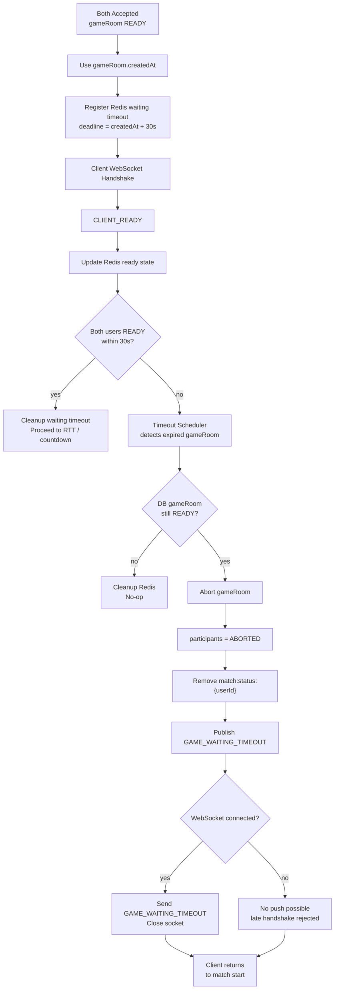

# Issue 42. Game Waiting WebSocket Timeout

## 📌 Feature Description

`GO_TO_GAME_WAITING` 이후 gameRoom이 `READY` 상태로 생성된 뒤, 두 참가자가 제한 시간 안에 게임 대기 WebSocket 연결과 `CLIENT_READY` 전송을 완료하지 못하면 gameRoom을 `ABORTED` 처리한다.

이번 이슈의 timeout 기준은 **gameRoom `createdAt` 기준 30초**다.

```text
gameRoom.createdAt + 30초
```

30초 안에 두 참가자가 모두 WebSocket에 연결하고 `CLIENT_READY`까지 보내야 다음 RTT/countdown 단계로 넘어갈 수 있다.

30초 안에 조건을 만족하지 못하면 `GAME_START` 이전 timeout으로 정리한다. 이 timeout은 아직 유효한 판이 시작되지 않은 실패이므로 `game_records`, LP, 배치/승급전 `RankSeries`에는 반영하지 않는다.

연결된 유저에게만 WebSocket timeout 이벤트를 보낸다. WebSocket에 접속하지 않은 유저는 실시간 이벤트를 받을 수 없으므로 별도 push를 보내지 않는다. 미접속 유저가 늦게 WebSocket handshake를 시도하면 DB gameRoom 상태가 이미 `ABORTED`이므로 handshake가 거절되고, 클라이언트는 start 버튼 화면으로 복귀한다.



정상 대기 timeout 흐름:

```text
gameRoom READY 생성
-> gameRoom.createdAt 기준 deadline = createdAt + 30초
-> Redis waiting timeout index 등록
-> 참가자 WebSocket 연결 대기
-> CLIENT_READY 수신 시 Redis ready 상태 갱신
-> 30초 안에 양쪽 ready 미완료
-> gameRoom ABORTED
-> participants ABORTED
-> Redis waiting 상태 정리
-> Redis match:status:{userId} 제거
-> 연결된 WebSocket session에 GAME_WAITING_TIMEOUT 전송 후 close
-> 미접속 유저는 별도 push 없음
```

멀티 인스턴스 전제:

- `/ws/game/{gameRoomId}`는 `gameRoomId` 기반 sticky routing을 사용한다.
- sticky routing은 같은 gameRoom의 WebSocket session이 같은 API 인스턴스 local registry에 모이게 하기 위한 전제다.
- timeout scheduler는 각 API 인스턴스에서 돌 수 있으므로 local registry만 보고 timeout을 판정하지 않는다.
- timeout 판정은 Redis waiting 상태와 DB gameRoom 상태를 기준으로 한다.
- timeout 이벤트 전송은 Redis Pub/Sub으로 모든 API 인스턴스에 알리고, 실제 WebSocket session을 가진 인스턴스만 local registry를 보고 전송한다.

## 📚 Tasks

### 1. 정책과 책임 경계 확정

- [x] 게임 대기 WebSocket timeout duration을 30초 상수로 정의한다.
- [x] timeout 기준 시각은 gameRoom `createdAt`으로 고정한다.
- [x] timeout 조건을 명확히 한다.
  - [x] `gameRoom.status == READY`
  - [x] `now >= gameRoom.createdAt + 30초`
  - [x] Redis waiting 상태 기준 양쪽 참가자가 모두 `CLIENT_READY` 완료 상태가 아님
- [x] `CONNECTED`는 timeout 통과 조건으로 보지 않고, 최종 통과 조건은 양쪽 `CLIENT_READY`로 둔다.
- [x] `GAME_START` 이전 timeout은 gameRoom `ABORTED`로 처리한다.
- [x] `GAME_START` 이전 timeout은 `game_records`, LP, 배치/승급전 `RankSeries`에 반영하지 않는다.
- [x] timeout 이후 두 유저를 매칭 큐에 자동 복귀시키지 않는다.
- [x] timeout 이후 Redis `match:status:{userId}`는 제거해 다음 매칭 시도를 막지 않도록 한다.
- [x] 연결된 유저에게만 WebSocket timeout 이벤트를 보낸다.
- [x] 미접속 유저에게는 실시간 이벤트를 보내지 않고, 늦은 handshake 실패 또는 클라이언트 자체 timer로 start 화면 복귀하도록 둔다.

결정 사항:

- timeout 정책값: 30초
- 기준: gameRoom `createdAt`
- Redis TTL: timeout 정책값이 아니라 cleanup 안전장치로 사용한다.
- WebSocket 이벤트는 연결된 session에만 전송 가능하다.
- API polling은 primary 응답 방식으로 사용하지 않는다.

구현 결과:

- timeout 정책값은 30초로 확정한다.
- timeout 기준은 `GO_TO_GAME_WAITING` 수신 시각이나 SSE 발행 시각이 아니라 DB에 저장된 gameRoom `createdAt`이다.
- timeout 판정의 최종 조건은 `gameRoom.status == READY`와 Redis waiting 상태 기준 양쪽 `CLIENT_READY` 미완료다.
- WebSocket `CONNECTED`는 중간 연결 상태일 뿐 timeout 통과 조건이 아니다.
- timeout 정산은 `GAME_START` 이전 실패로 보며, gameRoom/participants만 `ABORTED` 처리한다.
- timeout 정산은 `game_actions`, `game_records`, LP, 배치/승급전 `RankSeries` 흐름을 호출하지 않는다.
- 큐 자동 복귀는 하지 않는다. 다만 기존 Redis `match:status:{userId}`는 제거해서 유저가 직접 다시 매칭을 시작할 수 있게 한다.
- 미접속 유저는 WebSocket session이 없으므로 서버 push 대상이 아니다.
- 연결된 유저에게만 `GAME_WAITING_TIMEOUT`을 전송하고 WebSocket을 닫는다.
- 미접속 유저가 늦게 WebSocket handshake를 시도하면 gameRoom `ABORTED` 상태 검증에서 거절된다.

책임 경계:

| 영역 | 책임 |
|------|------|
| `smite-core` | gameRoom `READY -> ABORTED` 상태 전이, participants `ABORTED` 처리 |
| `smite-api` WebSocket | handshake/session 관리, `CLIENT_READY` 수신, 연결된 session에 timeout 이벤트 전송 |
| Redis waiting store | gameRoom별 ready 상태와 timeout deadline 저장 |
| timeout scheduler/service | due gameRoom 조회, Redis ready 상태 확인, DB READY 최종 확인, abort orchestration |
| Redis match status store | timeout 후 `match:status:{userId}` 제거 |
| client | `GAME_WAITING_TIMEOUT`, handshake 실패, close/error, 자체 30초 timer 기반 start 화면 복귀 |

### 2. Redis waiting timeout 저장 구조 설계

- [x] Redis key naming을 확정한다.
- [x] gameRoom timeout deadline index를 ZSET으로 둔다.
- [x] gameRoom별 waiting 상태를 HASH로 둔다.
- [x] Redis HASH TTL은 60초로 둔다.
- [x] timeout 완료 또는 양쪽 READY 완료 시 Redis waiting key와 ZSET index를 정리한다.
- [x] scheduler 지연 또는 정리 실패가 있어도 TTL로 eventually cleanup 되도록 한다.
- [x] Redis 저장소는 최소 필드만 가진다.

제안 구조:

```text
ZSET game:waiting:timeout:pending
  member = gameRoomId
  score = deadlineAtMillis

HASH game:waiting:{gameRoomId}
  userAId = 1
  userBId = 2
  userAReady = false
  userBReady = false
  createdAtMillis = 1716000000000
  deadlineAtMillis = 1716000030000
  TTL = 60초

LOCK game:waiting:timeout:lock:{gameRoomId}
  purpose = scheduler 중복 timeout 정산 방지
  lease = 짧은 작업 lease
```

필드 선택 이유:

- `CONNECTED`는 Redis에 저장하지 않는다.
- timeout 통과 조건은 양쪽 `CLIENT_READY` 완료 여부이므로 `userAReady`, `userBReady`만 Redis 판정 필드로 둔다.
- 실제 WebSocket session 객체와 전송 가능 여부는 API local registry가 관리한다.
- `createdAtMillis`, `deadlineAtMillis`는 디버깅과 metric 기록에 사용한다.
- ZSET score는 scheduler가 due gameRoom을 빠르게 찾기 위한 deadline index다.
- `game:waiting:timeout:lock:{gameRoomId}`는 멀티 인스턴스 scheduler가 같은 gameRoom timeout을 동시에 정산하지 않도록 하는 작업 lock이다.
- 이번 이슈의 Redis waiting 상태에는 processing ZSET을 두지 않는다. timeout 정산은 gameRoom `READY -> ABORTED` 전이가 idempotent해야 하며, 작업 실패 시 pending ZSET과 HASH TTL로 재처리/cleanup 여지를 둔다.

구현 결과:

- Redis key는 game 대기 도메인임을 드러내도록 `game:waiting:*` prefix로 통일한다.
- timeout 후보 index는 단일 ZSET `game:waiting:timeout:pending`으로 둔다.
  - member: `gameRoomId`
  - score: `deadlineAtMillis`
- gameRoom별 상태는 HASH `game:waiting:{gameRoomId}`로 둔다.
- HASH field는 최소 6개만 사용한다.
  - `userAId`
  - `userBId`
  - `userAReady`
  - `userBReady`
  - `createdAtMillis`
  - `deadlineAtMillis`
- ready field는 문자열 `"true"` / `"false"`로 저장하는 방향을 우선한다.
- HASH TTL은 60초로 둔다.
  - timeout 정책값 30초와 별도다.
  - timeout 정책값과 TTL을 모두 30초로 맞추면 scheduler가 deadline 직후 실행될 때 HASH가 먼저 만료될 수 있다.
  - HASH가 먼저 사라지면 `양쪽 READY 완료 후 cleanup 일부 실패`와 `아직 READY 미완료인데 TTL 만료`를 구분하기 어렵다.
  - 따라서 TTL은 timeout 판정에 필요한 상태를 deadline 이후에도 잠깐 보존하는 안전장치로 두며, 60초로 확정한다.
- ZSET index는 TTL이 없으므로 양쪽 READY 완료, timeout 완료, HASH 없음 감지 시 명시적으로 제거한다.
- 멀티 인스턴스 scheduler 중복 정산 방지를 위해 `game:waiting:timeout:lock:{gameRoomId}` lock key를 사용한다.
- 실제 WebSocket session 전송 가능 여부는 Redis에 저장하지 않고 API local registry로 판단한다.

패키지/모듈 분리 검토:

| 모듈/패키지 | 배치 대상 | 이유 |
|------|------|------|
| `smite-core` `domain.game` | gameRoom `READY -> ABORTED` 도메인 전이, participant 상태 변경 | core는 JPA/domain만 알고 Redis/WebSocket을 몰라야 함 |
| `smite-api` `game.websocket` | WebSocket handler, DTO, session registry | 기존 Issue 40 구조와 동일하게 API transport 계층 책임 |
| `smite-api` `game.waiting` | waiting timeout service/scheduler, Redis waiting store, timeout Pub/Sub sender/subscriber | gameRoom waiting은 matching 큐가 아니라 game 대기방 orchestration 책임 |
| `smite-matching` `command` | 필요 시 match status 제거용 command facade | `match:status:{userId}`의 소유권은 matching 모듈에 있으므로 직접 store 접근보다 command 경유가 적절 |
| `smite-infra-redis` | 공통 Redisson config/lock만 유지 | 특정 game waiting key 구현을 공통 infra에 섞지 않음 |

컨벤션 확인:

- `smite-core`에는 Spring WebSocket/Redis 의존을 추가하지 않는다.
- API WebSocket handler는 DB repository를 직접 호출하지 않고 service를 통해 처리한다.
- Redis waiting 구현체는 구체 기술이 드러나는 `RedisGameWaitingStore` 같은 이름을 사용한다.
- 저장소 port는 `GameWaitingStore`처럼 `I` 접두사 없이 둔다.
- scheduler는 trigger만 담당하고, 실제 정산 흐름은 service로 분리한다.
- 상수는 magic string으로 흩뿌리지 않고 waiting 전용 constants에 모은다.

확정 Redis 구조:

| Redis key | Type | 필드/값 | TTL | 용도 |
|------|------|------|------|------|
| `game:waiting:timeout:pending` | ZSET | member=`gameRoomId`, score=`deadlineAtMillis` | 없음 | timeout scheduler due gameRoom 조회 |
| `game:waiting:{gameRoomId}` | HASH | `userAId`, `userBId`, `userAReady`, `userBReady`, `createdAtMillis`, `deadlineAtMillis` | 60초 | gameRoom waiting ready 상태 판정 |
| `game:waiting:timeout:lock:{gameRoomId}` | Lock | Redisson lock | 작업 lease | 멀티 인스턴스 중복 timeout 정산 방지 |

cleanup 정책:

| 상황 | cleanup |
|------|------|
| 양쪽 `CLIENT_READY` 완료 | `game:waiting:{gameRoomId}` 삭제, `game:waiting:timeout:pending`에서 gameRoomId 제거 |
| timeout abort 완료 | `game:waiting:{gameRoomId}` 삭제, `game:waiting:timeout:pending`에서 gameRoomId 제거 |
| scheduler가 due gameRoom을 봤지만 HASH 없음 | `game:waiting:timeout:pending`에서 gameRoomId 제거 |
| scheduler가 due gameRoom을 봤지만 DB status가 `READY` 아님 | `game:waiting:{gameRoomId}` 삭제, `game:waiting:timeout:pending`에서 gameRoomId 제거 |

### 3. gameRoom 생성 성공 시 waiting timeout 등록

- [x] 양쪽 accept 후 gameRoom 생성이 성공한 시점을 확인한다.
- [x] gameRoom 저장 후 `createdAt`을 기준으로 `deadlineAtMillis = createdAt + 30초`를 계산한다.
- [x] gameRoom participant 두 명의 userId를 조회한다.
- [x] Redis `game:waiting:{gameRoomId}` HASH를 저장한다.
- [x] Redis `game:waiting:timeout:pending` ZSET에 deadline을 등록한다.
- [x] Redis waiting 등록 실패 시 처리 정책을 결정한다.
  - [x] 성공 이벤트 발행 전 실패라면 `GAME_SETUP_FAILED`로 정리할지 검토
  - [x] 이미 `GO_TO_GAME_WAITING` 발행 이후 실패 가능한 지점이 없도록 호출 순서 정리
- [x] 기존 `match_response_result.game` payload 발행 흐름과 순서를 확인한다.

주의:

- waiting timeout 등록은 `GO_TO_GAME_WAITING` 이후 클라이언트를 게임 대기 화면으로 보낼 수 있는 상태를 만드는 작업이다.
- Redis waiting 등록이 실패했는데 클라이언트를 게임 대기 화면으로 보내면 timeout 정산이 불가능해질 수 있다.
- 따라서 성공 이벤트 발행 전 waiting timeout 등록을 완료하는 방향을 우선 검토한다.

구현 결과:

- `GameRoomSetupService.createReadyGameRoom()`에서 `GameRoomCommandService.createReadyRoom()` 성공 직후 waiting timeout을 등록한다.
- Redis 등록은 `GameWaitingStore.registerWaitingTimeout()` port를 통해 수행한다.
- 구현체는 `RedisGameWaitingStore`이며 `StringRedisTemplate`으로 HASH/ZSET을 저장한다.
- Redis HASH key는 `game:waiting:{gameRoomId}`다.
- Redis ZSET key는 `game:waiting:timeout:pending`이다.
- HASH field는 다음 6개로 저장한다.
  - `userAId`
  - `userBId`
  - `userAReady=false`
  - `userBReady=false`
  - `createdAtMillis`
  - `deadlineAtMillis`
- `deadlineAtMillis`는 `gameRoom.createdAt + 30초` 기준으로 계산한다.
- HASH TTL은 60초로 설정한다.
- Redis waiting 등록 실패 시 `GameRoomSetupService`가 생성된 READY gameRoom을 `abortReadyRoom(gameRoomId)`로 보상 처리하고 예외를 다시 던진다.
- `MatchResponseResultService.completeAcceptedSession()`은 `gameSetupPort.setup()` 실패를 잡아 기존 `GAME_SETUP_FAILED` 흐름으로 정리한다.
- `GO_TO_GAME_WAITING` payload를 포함한 match response result event는 `gameSetupPort.setup()` 성공, match session/user status 저장 성공 이후에만 발행된다.
- 따라서 Redis waiting 등록 실패 상태에서 클라이언트가 게임 대기 화면으로 이동하지 않는다.

추가된 코드:

| 파일 | 역할 |
|------|------|
| `smite-api/game/waiting/common/constant/GameWaitingConstants` | waiting timeout 정책값, Redis key/field 상수 |
| `smite-api/game/waiting/domain/GameWaitingTimeoutRegistration` | timeout 등록 요청 모델 |
| `smite-api/game/waiting/repository/GameWaitingStore` | waiting 상태 저장 port |
| `smite-api/game/waiting/infrastructure/redis/RedisGameWaitingStore` | Redis HASH/ZSET 등록 구현 |
| `smite-api/game/service/GameRoomSetupService` | gameRoom 생성 직후 waiting timeout 등록 및 실패 시 abort 보상 |

### 4. WebSocket handshake/READY와 Redis waiting 상태 연동

- [x] handshake 성공 시 Redis에 `CONNECTED`를 기록하지 않는다.
- [x] `CLIENT_READY` 수신 시 Redis waiting HASH의 해당 유저 ready 값을 `true`로 갱신한다.
- [x] `CLIENT_READY`를 보낸 userId가 gameRoom의 userA/userB 중 누구인지 확인한다.
- [x] 이미 timeout 또는 abort된 gameRoom이면 `CLIENT_READY` 처리를 거부하거나 no-op 처리한다.
- [x] 양쪽 ready가 모두 true가 되면 waiting timeout index를 정리한다.
- [x] 양쪽 ready가 모두 true이면 다음 RTT/countdown 단계로 넘어갈 수 있는 상태로 둔다.
- [x] `PLAYER_READY` broadcast는 기존 local registry 기반 흐름을 유지한다.

처리 흐름:

```text
CLIENT_READY 수신
-> session attributes에서 gameRoomId/userId 확인
-> Redis game:waiting:{gameRoomId} 조회
-> userAId/userBId 중 일치하는 필드의 ready=true
-> 둘 다 ready인지 확인
-> 둘 다 ready이면 timeout ZSET cleanup
-> 기존 PLAYER_READY broadcast
```

주의:

- 클라이언트 payload의 userId/gameRoomId는 신뢰하지 않는다.
- 기존 Issue 40 정책처럼 handshake session attributes만 신뢰한다.

구현 결과:

- handshake 성공 시 Redis에는 아무 상태도 추가하지 않는다.
- WebSocket session local registry에는 기존처럼 연결 session만 등록한다.
- `CLIENT_READY` 수신 시 `GameWaitingReadyService.markReady(gameRoomId, userId)`를 호출한다.
- `GameWaitingReadyService.markReady()`는 `game:waiting:timeout:lock:{gameRoomId}` 기준 Redis lock 안에서 실행한다.
  - timeout scheduler와 READY cleanup이 같은 gameRoom waiting 상태를 동시에 정리하지 않도록 하기 위함이다.
  - matching 응답 timeout의 `match:session:lock:{matchId}`와는 별개 lock이다.
- `RedisGameWaitingStore.markReady()`는 `game:waiting:{gameRoomId}` HASH를 읽고, session attribute의 userId가 `userAId` 또는 `userBId`와 일치하는지 확인한다.
- 일치하는 유저의 ready field만 `true`로 변경한다.
  - `userAId` 일치 시 `userAReady=true`
  - `userBId` 일치 시 `userBReady=true`
- 양쪽 ready가 모두 `true`가 되면 다음 Redis waiting 상태를 정리한다.
  - `game:waiting:{gameRoomId}` 삭제
  - `game:waiting:timeout:pending`에서 gameRoomId 제거
- Redis waiting HASH가 없거나 userId가 참가자와 일치하지 않으면 `CLIENT_READY`를 rejected로 보고 WebSocket session을 close한다.
- `PLAYER_READY` broadcast의 userId는 클라이언트 payload가 아니라 session attribute의 userId를 사용한다.
- `PLAYER_READY.payload.bothReady`는 Redis waiting 상태 갱신 결과를 기준으로 내려준다.

추가/변경 코드:

| 파일 | 역할 |
|------|------|
| `smite-api/game/waiting/domain/GameWaitingReadyResult` | Redis ready 반영 결과 |
| `smite-api/game/waiting/service/GameWaitingReadyService` | `CLIENT_READY` Redis 반영 및 gameRoom 단위 lock 적용 |
| `smite-api/game/waiting/repository/GameWaitingStore` | `markReady`, `cleanup` port 추가 |
| `smite-api/game/waiting/infrastructure/redis/RedisGameWaitingStore` | ready field 갱신, both ready 시 HASH/ZSET cleanup |
| `smite-api/game/websocket/handler/GameWaitingWebSocketHandler` | `CLIENT_READY` 수신 시 Redis waiting 상태 연동 |

### 5. timeout scheduler 구현

- [x] `GameWaitingTimeoutScheduler`를 추가한다.
- [x] scheduler fixed delay를 정의한다.
  - [x] MVP 기준 1초 주기 검토
- [x] Redis `game:waiting:timeout:pending` ZSET에서 due gameRoomId를 조회한다.
- [x] due gameRoomId별 timeout 처리를 시도한다.
- [x] Redis HASH가 없으면 ZSET index를 cleanup한다.
- [x] Redis HASH 기준 양쪽 ready가 모두 true면 ZSET index를 cleanup하고 no-op 처리한다.
- [x] 양쪽 ready가 모두 true가 아니면 DB gameRoom 상태를 최종 확인한다.
- [x] DB gameRoom이 `READY`가 아니면 Redis waiting 상태와 ZSET index를 cleanup한다.
- [x] DB gameRoom이 `READY`면 timeout abort 처리를 수행한다.
- [x] 개별 gameRoom 처리 실패가 batch 전체를 중단하지 않도록 한다.

최종 timeout 판정:

```text
now >= deadlineAtMillis
AND Redis ready 상태가 userAReady && userBReady가 아님
AND DB gameRoom.status == READY
```

DB 최종 확인 이유:

- scheduler가 Redis due 상태를 본 직후 다른 흐름에서 gameRoom이 다음 단계로 넘어갈 수 있다.
- 최종 abort 전에는 반드시 DB의 `READY` 상태를 확인해야 오판을 막을 수 있다.

구현 결과:

- `GameWaitingTimeoutScheduler`를 추가했다.
  - fixed delay: 1초
  - scheduler는 `GameWaitingTimeoutService.processTimeouts()`만 호출한다.
- `GameWaitingTimeoutService`는 현재 시각 기준 due gameRoomId 목록을 조회하고, gameRoomId별 timeout 처리를 순회한다.
- due 조회는 Redis ZSET `game:waiting:timeout:pending`에서 `score <= nowMillis` 기준으로 수행한다.
- batch size는 100으로 둔다.
- 단일 gameRoom 정산은 `GameWaitingTimeoutProcessor.processTimeoutWithLock(gameRoomId)`가 담당한다.
- `GameWaitingTimeoutProcessor.processTimeoutWithLock()`는 `game:waiting:timeout:lock:{gameRoomId}` lock 안에서 실행한다.
- lock 획득 실패 시 해당 gameRoom은 이번 tick에서 skip한다.
  - HASH 삭제하지 않는다.
  - ZSET 삭제하지 않는다.
  - DB abort 하지 않는다.
  - 다음 gameRoom 처리는 계속한다.
- 개별 gameRoom 처리 중 예외가 발생하면 로그만 남기고 다음 gameRoom 처리를 계속한다.
  - 처리 중 예외가 난 gameRoom의 pending ZSET/HASH는 유지해서 다음 scheduler tick에서 재시도한다.
- 명확한 no-op 또는 성공 처리일 때만 cleanup한다.
  - Redis HASH 없음: cleanup
  - Redis 기준 bothReady=true: cleanup
  - DB gameRoom status != READY: cleanup
  - DB gameRoom status == READY이며 abort 성공: cleanup
- DB gameRoom status 조회는 `GameRoomReadService.getStatus(gameRoomId)`로 수행한다.
- READY gameRoom abort는 기존 `GameRoomCommandService.abortReadyRoom(gameRoomId)`를 사용한다.

추가/변경 코드:

| 파일 | 역할 |
|------|------|
| `smite-api/game/waiting/scheduler/GameWaitingTimeoutScheduler` | 1초 주기 timeout batch trigger |
| `smite-api/game/waiting/service/GameWaitingTimeoutService` | due gameRoomId 조회 및 batch 순회, lock 실패/예외 격리 |
| `smite-api/game/waiting/service/GameWaitingTimeoutProcessor` | 단일 gameRoom timeout 정산, gameRoom 단위 lock 적용 |
| `smite-api/game/waiting/domain/GameWaitingState` | Redis waiting HASH 상태 모델 |
| `smite-api/game/waiting/repository/GameWaitingStore` | due 조회, waiting state 조회 port 추가 |
| `smite-api/game/waiting/infrastructure/redis/RedisGameWaitingStore` | ZSET due 조회, HASH state 조회 구현 |
| `smite-core/domain/game/service/GameRoomReadService` | gameRoom status 조회 메서드 추가 |

### 6. gameRoom abort 처리 유스케이스 구현

- [ ] core `GameRoomCommandService`에 waiting timeout abort 유스케이스를 추가하거나 기존 `abortReadyRoom`을 재사용한다.
- [ ] `game_rooms.status = ABORTED`로 변경한다.
- [ ] `game_rooms.finishedAt = now`로 기록한다.
- [ ] `game_participants.status = ABORTED`로 변경한다.
- [ ] 이미 `ABORTED`면 idempotent 하게 no-op 처리한다.
- [ ] `READY`가 아닌 상태에서 abort 요청이 들어오면 안전하게 no-op 또는 예외 중 하나로 정책을 확정한다.
- [ ] `game_actions`는 생성하지 않는다.
- [ ] `game_records`는 생성하지 않는다.
- [ ] LP, 배치, 승급전 반영 로직을 호출하지 않는다.

권장 정책:

- scheduler timeout abort는 idempotent 해야 한다.
- `READY` 상태만 `ABORTED`로 전환한다.
- 이미 `ABORTED`, `IN_PROGRESS`, `FINISHED`면 timeout abort는 no-op으로 처리하는 방향을 우선 검토한다.

### 7. Redis match status 정리

- [ ] timeout 대상 gameRoom의 두 참가자 userId를 확보한다.
- [ ] Redis `match:status:{userAId}`를 제거한다.
- [ ] Redis `match:status:{userBId}`를 제거한다.
- [ ] 제거 실패는 로그로 남기고 나머지 정리를 계속할지 정책화한다.
- [ ] 큐 자동 복귀는 하지 않는다.

정책:

- 매칭 성공 이후 두 유저의 Redis match status는 `IN_GAME`이다.
- game waiting timeout으로 게임이 시작되지 못하면 두 유저가 다시 매칭을 시도할 수 있어야 한다.
- 따라서 `match:status:{userId}`는 제거한다.
- 제거는 큐 복귀가 아니다. 단지 다음 매칭 시도를 막는 상태 lock을 푸는 작업이다.

### 8. timeout 이벤트 Pub/Sub 및 WebSocket 전송

- [ ] game waiting timeout용 server message type을 추가한다.
  - [ ] `GAME_WAITING_TIMEOUT`
- [ ] timeout payload를 정의한다.
  - [ ] `gameRoomId`
  - [ ] `reason = WAITING_TIMEOUT`
  - [ ] `action = GO_TO_MATCH_START`
- [ ] timeout 확정 후 Redis Pub/Sub 이벤트를 발행한다.
- [ ] 모든 API 인스턴스가 timeout Pub/Sub 이벤트를 구독한다.
- [ ] 이벤트를 받은 인스턴스는 local registry에서 해당 gameRoom의 열린 WebSocket session을 찾는다.
- [ ] 연결된 session에만 `GAME_WAITING_TIMEOUT`을 전송한다.
- [ ] timeout 이벤트 전송 후 WebSocket session을 close한다.
- [ ] registry에서 해당 gameRoom session을 제거한다.
- [ ] session이 없는 인스턴스는 no-op 처리한다.
- [ ] 미접속 유저에게는 별도 이벤트를 보내지 않는다.

server message 예시:

```json
{
  "type": "GAME_WAITING_TIMEOUT",
  "payload": {
    "gameRoomId": 123,
    "reason": "WAITING_TIMEOUT",
    "action": "GO_TO_MATCH_START"
  }
}
```

정책:

- 연결된 유저는 timeout 이벤트를 받고 start 버튼 화면으로 복귀한다.
- 미접속 유저는 이벤트를 받을 수 없으므로 아무것도 받지 않는다.
- 미접속 유저가 뒤늦게 WebSocket handshake를 시도하면 gameRoom이 `ABORTED`라 연결이 거절된다.
- 프론트는 handshake 실패, WebSocket close/error, 자체 30초 timer 중 하나로 start 버튼 화면 복귀를 처리한다.
- API polling은 필수로 두지 않는다.

### 9. 멀티 인스턴스 정합성

- [ ] timeout 판정은 local registry를 사용하지 않는다.
- [ ] timeout 판정은 Redis waiting ready 상태와 DB gameRoom status를 기준으로 한다.
- [ ] WebSocket 이벤트 전송은 local registry를 사용한다.
- [ ] sticky routing은 WebSocket room session을 같은 인스턴스에 모으기 위한 전제임을 유지한다.
- [ ] scheduler는 어떤 인스턴스가 실행해도 같은 결과가 나오도록 만든다.
- [ ] timeout 이벤트 Pub/Sub은 모든 인스턴스에 전파한다.
- [ ] 실제 session을 가진 인스턴스만 이벤트 전송/close를 수행한다.

멀티 인스턴스 처리 구조:

```text
API-1: scheduler가 timeout 확정
  -> DB gameRoom ABORTED
  -> Redis waiting/match status cleanup
  -> Redis Pub/Sub GAME_WAITING_TIMEOUT 발행

API-1: timeout event 수신
  -> local registry에 room session 없으면 no-op

API-2: timeout event 수신
  -> local registry에 room session 있음
  -> 연결된 유저에게 GAME_WAITING_TIMEOUT 전송
  -> WebSocket close
  -> registry cleanup
```

### 10. 클라이언트 복구 정책 문서화

- [ ] WebSocket 연결된 유저는 `GAME_WAITING_TIMEOUT` 수신 시 start 버튼 화면으로 복귀한다고 문서화한다.
- [ ] WebSocket 미접속 유저는 실시간 이벤트를 받을 수 없다고 문서화한다.
- [ ] 늦은 handshake 실패 시 start 버튼 화면으로 복귀한다고 문서화한다.
- [ ] 클라이언트도 `GO_TO_GAME_WAITING` 진입 시 30초 자체 timer를 둘 수 있다고 문서화한다.
- [ ] API polling은 필수 흐름이 아니라고 문서화한다.

권장 클라이언트 처리:

```text
GO_TO_GAME_WAITING 진입
-> 30초 자체 timer 시작
-> WebSocket 연결 시도
-> CLIENT_READY 전송

다음 중 하나면 start 화면 복귀:
  - GAME_WAITING_TIMEOUT 수신
  - WebSocket handshake 실패
  - WebSocket close/error
  - 30초 timer 만료 전 GAME_START/다음 단계 이벤트 미수신
```

### 11. 테스트

- [x] gameRoom 생성 후 Redis waiting HASH와 timeout ZSET이 저장되는지 테스트
- [x] Redis waiting HASH TTL이 설정되는지 테스트
- [x] `CLIENT_READY` 수신 시 해당 유저 ready 값이 true로 바뀌는지 테스트
- [x] 양쪽 ready 완료 시 timeout ZSET이 cleanup 되는지 테스트
- [x] 한 명만 ready 상태에서 deadline이 지나면 gameRoom이 `ABORTED` 되는지 테스트
- [x] 둘 다 미접속 상태에서 deadline이 지나면 gameRoom이 `ABORTED` 되는지 테스트
- [x] 둘 다 ready 상태이면 deadline이 지나도 abort하지 않는지 테스트
- [x] DB gameRoom이 이미 `IN_PROGRESS` 또는 `FINISHED`이면 scheduler가 abort하지 않는지 테스트
- [ ] timeout 시 participants가 `ABORTED` 되는지 테스트
- [ ] timeout 시 `game_records`가 생성되지 않는지 테스트
- [ ] timeout 시 LP/RankSeries service가 호출되지 않는지 테스트
- [ ] timeout 시 Redis `match:status:{userId}`가 제거되는지 테스트
- [ ] timeout 이벤트 Pub/Sub 발행 테스트
- [ ] local registry에 session이 있는 인스턴스만 `GAME_WAITING_TIMEOUT`을 보내는지 테스트
- [ ] session이 없는 인스턴스는 timeout Pub/Sub 이벤트를 no-op 처리하는지 테스트
- [ ] timeout 이벤트 전송 후 WebSocket close와 registry cleanup이 수행되는지 테스트
- [ ] 미접속 유저에게 별도 전송 시도를 하지 않는지 테스트
- [ ] late handshake 시 gameRoom `ABORTED`라 연결이 거절되는지 테스트

테스트 기준:

- Redis waiting 저장소는 Redis/Testcontainers 통합 테스트로 검증한다.
- scheduler/service는 mock 기반 단위 테스트로 성공/실패/no-op 분기를 검증한다.
- WebSocket 이벤트 전송은 handler/registry 단위 테스트로 검증한다.
- core abort 상태 전이는 도메인 단위 테스트와 JPA 테스트로 검증한다.

### 12. 문서

- [ ] `docs/project/policy.md`의 30초 createdAt 기준 정책과 구현 결과를 맞춘다.
- [ ] `docs/project/domain status.md`의 gameRoom READY -> ABORTED 전이를 구현 결과와 맞춘다.
- [ ] `docs/project/flow status.md`에 timeout 이벤트/cleanup 흐름을 반영한다.
- [ ] `docs/project/websocket client.md`에 `GAME_WAITING_TIMEOUT` 메시지와 미접속 유저 처리 정책을 추가한다.
- [ ] `docs/DB/DDL.md`의 gameRoom lifecycle 설명과 정합성을 확인한다.
- [ ] 필요 시 `docs/antigravity/backend/plan-checkpoint.md` Step 4 상태를 갱신한다.

## ✅ 완료 기준

- gameRoom `createdAt` 기준 30초 안에 양쪽 `CLIENT_READY`가 완료되지 않으면 gameRoom이 `ABORTED` 된다.
- timeout 판정은 Redis waiting ready 상태와 DB gameRoom 상태를 기준으로 한다.
- scheduler는 local WebSocket registry만 보고 timeout을 판정하지 않는다.
- timeout 시 participants는 `ABORTED`로 정리된다.
- timeout 시 `game_records`, LP, RankSeries는 반영되지 않는다.
- timeout 시 두 유저의 Redis `match:status:{userId}`가 제거된다.
- 연결된 WebSocket session에는 `GAME_WAITING_TIMEOUT`이 전송되고 close 된다.
- 미접속 유저에게는 별도 실시간 이벤트를 보내지 않는다.
- 늦은 WebSocket handshake는 gameRoom `ABORTED` 상태 때문에 거절된다.
- 양쪽 `CLIENT_READY`가 30초 안에 완료된 gameRoom은 timeout scheduler가 abort하지 않는다.
- 멀티 인스턴스에서 timeout scheduler가 어느 인스턴스에서 실행되어도 DB/Redis 정산이 일관된다.

## 📝 Note

### 왜 미접속 유저에게 이벤트를 보내지 않는가

WebSocket 이벤트는 열린 WebSocket session이 있어야 전송할 수 있다.

미접속 유저는 서버와 연결된 session이 없으므로 `GAME_WAITING_TIMEOUT`을 받을 수 없다.
이 경우 서버는 gameRoom을 `ABORTED`로 확정하고, 유저가 늦게 접속하거나 클라이언트 자체 timer가 만료되는 다음 접점에서 start 버튼 화면으로 복귀하게 한다.

### 왜 API polling을 primary로 쓰지 않는가

이번 timeout은 서버가 gameRoom 상태를 확정하고 연결된 WebSocket에 알려주는 서버 주도 흐름이다.

API polling을 primary로 두면 waiting 화면에서 별도 상태 조회 루프가 필요해지고, WebSocket 이벤트와 중복된 화면 전환 경로가 생긴다.
MVP에서는 다음 조합으로 충분하다.

```text
서버:
  - DB/Redis timeout 확정
  - 연결된 WebSocket에 GAME_WAITING_TIMEOUT 전송

클라이언트:
  - WebSocket 이벤트 수신 시 복귀
  - handshake 실패 시 복귀
  - close/error 시 복귀
  - 자체 30초 timer 만료 시 복귀
```

### 왜 Redis에는 READY만 저장하는가

timeout 통과 조건은 "양쪽이 연결되었는가"가 아니라 "양쪽이 `CLIENT_READY`까지 완료했는가"다.

따라서 Redis 판정 상태는 `userAReady`, `userBReady`면 충분하다.
실제 연결 session 객체와 메시지 전송은 API local registry가 담당한다.

### timeout 값과 Redis TTL의 차이

```text
timeout 정책값 = 30초
Redis TTL = cleanup 누락 방지용 안전장치
```

Redis TTL 60초는 timeout을 60초로 늘린다는 의미가 아니다.
timeout은 항상 gameRoom `createdAt + 30초` 기준으로 판단한다.

## 📌 Related Issue

- Closes #42

## 변경 이력

| 날짜 | 변경 내용 |
| :--- | :--- |
| 2026-05-18 | Issue 42 작업 문서 생성. gameRoom `createdAt` 기준 30초 waiting timeout, Redis 최소 상태, 멀티 인스턴스 Pub/Sub 전송, 미접속 유저 처리 정책 정리 |
| 2026-05-18 | Task 1 완료. timeout 조건, ABORTED 정리 범위, Redis match status 제거, 연결/미접속 유저 응답 방식, 모듈 책임 경계 확정 |
| 2026-05-18 | Task 2 완료. `game:waiting:*` Redis key, ZSET/HASH 최소 필드, HASH TTL 60초, gameRoom 단위 timeout lock, cleanup 정책 확정 |
| 2026-05-18 | Task 3 완료. gameRoom 생성 성공 직후 Redis waiting HASH/ZSET 등록, 등록 실패 시 gameRoom abort 보상 및 기존 `GAME_SETUP_FAILED` 흐름 연동 구현 |
| 2026-05-18 | Task 4 완료. `CLIENT_READY` 수신 시 Redis ready 상태 갱신, gameRoom 단위 lock 적용, 양쪽 READY 완료 시 waiting HASH/ZSET cleanup 구현 |
| 2026-05-18 | Task 5 완료. 1초 주기 timeout scheduler, due ZSET 조회, gameRoom 단위 lock 정산, lock 실패/예외 시 pending 유지 재시도 정책 구현 |
