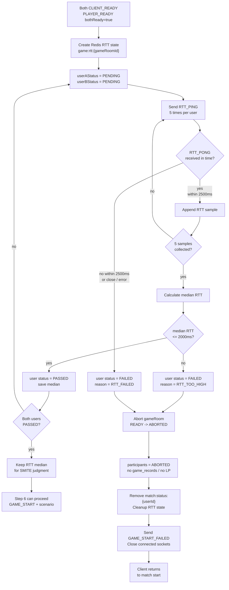

# Issue 44. Game RTT Measurement

## 📌 Feature Description



양쪽 참가자가 게임 대기 WebSocket에서 `CLIENT_READY`를 완료한 뒤, 실제 `GAME_START` 전에 WebSocket ping-pong 기반 RTT를 측정한다.

각 유저별 RTT를 5회 측정하고 median RTT를 저장한다. median RTT가 2000ms를 초과하거나 RTT 응답 누락, WebSocket close/error, 측정 중 예외가 발생하면 게임 시작을 차단한다.

RTT 측정은 무한 대기하지 않는다. 각 `RTT_PING`은 2500ms 안에 `RTT_PONG`을 받아야 하며, gameRoom 전체 RTT 측정은 최대 15초 안에 끝나야 한다. WebSocket close/error는 별도 `PEER_LEFT` 상태를 만들지 않고 `RTT_FAILED`로 단순 처리한다.

RTT 실패는 아직 `GAME_START` 이전 실패이므로 gameRoom을 `ABORTED`로 정리하고, `game_records`, LP, 배치/승급전에는 반영하지 않는다. 연결된 WebSocket session에는 `GAME_START_FAILED`를 전송한 뒤 close하고, 클라이언트는 start 버튼 화면으로 복귀한다.

RTT가 성공한 경우 Redis RTT 상태는 즉시 삭제하지 않는다. 저장된 median RTT는 이후 `SMITE` 판정 보정값으로 사용되므로 게임 판정 완료 전까지 유지하고, 게임 종료 후 cleanup한다.

이번 이슈에서는 `startAt` 결정, `COUNTDOWN`, HP scenario 전달, gameRoom `IN_PROGRESS` 전환은 구현하지 않는다. 이 작업들은 다음 `GAME_START와 HP 시나리오 전달` 단계에서 처리한다.

## 📚 Tasks

### 1. RTT 정책 확정

- [x] 각 유저별 RTT 측정 횟수를 5회로 정의한다.
- [x] RTT 판정값은 평균이 아니라 median으로 정의한다.
- [x] median RTT 허용 기준을 2000ms 이하로 정의한다.
- [x] 각 `RTT_PING` 응답 제한 시간은 2500ms로 정의한다.
- [x] gameRoom 전체 RTT 측정 제한 시간은 15초로 정의한다.
- [x] `RTT_PONG` 응답 누락, WebSocket close/error, 측정 중 예외는 `RTT_FAILED`로 단순 처리한다.
- [x] median RTT 2000ms 초과는 `RTT_TOO_HIGH`로 처리한다.
- [x] RTT 실패/초과는 `GAME_START` 이전 실패로 보고 gameRoom `ABORTED` 처리한다고 명시한다.

### 2. Redis RTT 저장 구조 설계

- [x] Redis key는 `game:rtt:{gameRoomId}` HASH 하나로 단순하게 설계한다.
- [x] 저장 field를 정의한다.
  - [x] `userAId`
  - [x] `userBId`
  - [x] `userASamples`
  - [x] `userBSamples`
  - [x] `userAMedianRttMs`
  - [x] `userBMedianRttMs`
  - [x] `userAStatus`
  - [x] `userBStatus`
- [x] RTT status는 `PENDING`, `PASSED`, `FAILED`만 사용한다.
- [x] `userASamples`, `userBSamples`는 5개 고정 샘플 문자열로 저장한다.
- [x] Redis RTT HASH TTL은 게임 진행/판정 시간보다 충분히 긴 300초로 정의한다.

저장 구조:

```text
HASH game:rtt:{gameRoomId}

userAId = 1
userBId = 2
userASamples = "34,36,35,38,41"
userBSamples = "45,44,49,46,48"
userAMedianRttMs = 36
userBMedianRttMs = 46
userAStatus = PASSED
userBStatus = PASSED
```

초기 상태:

```text
userAId = 1
userBId = 2
userASamples = ""
userBSamples = ""
userAStatus = PENDING
userBStatus = PENDING
```

`userAMedianRttMs`, `userBMedianRttMs`는 해당 유저의 5회 측정이 완료된 뒤 저장한다.

TTL/cleanup 정책:

- TTL은 300초로 둔다. RTT 측정, Step 6 시작 처리, SMITE 판정 시간을 충분히 감싸는 cleanup 누락 방지용 안전장치다.
- RTT 성공 시 `game:rtt:{gameRoomId}`는 즉시 삭제하지 않는다. median RTT가 SMITE 판정 보정에 필요하기 때문이다.
- RTT 실패/초과 시 gameRoom을 `ABORTED` 처리한 뒤 `game:rtt:{gameRoomId}`를 cleanup한다.
- 게임이 정상 종료되면 `game:rtt:{gameRoomId}`를 cleanup한다.
- `RTT_FAILED`, `RTT_TOO_HIGH` reason은 이벤트/로그 용도이며 Redis RTT HASH에는 별도 reason field를 두지 않는다.

### 3. RTT WebSocket 메시지 정의

- [x] 서버 메시지 `RTT_PING`을 정의한다.
- [x] 클라이언트 메시지 `RTT_PONG`을 정의한다.
- [x] `RTT_PING` / `RTT_PONG` payload에 `seq`를 포함한다.
- [x] 클라이언트 payload의 userId/gameRoomId는 신뢰하지 않고 WebSocket session attributes 기준으로 처리한다.
- [x] 기존 `CLIENT_READY`, `PLAYER_READY`, `GAME_WAITING_TIMEOUT` 흐름과 충돌하지 않게 message type을 분리한다.

구현 결과:

- `GameWebSocketMessageType`에 client message `RTT_PONG`과 server message `RTT_PING`을 추가했다.
- `GameWebSocketServerMessage.rttPing(seq)` factory와 `RttPingPayload(seq)`를 추가했다.
- `GameWebSocketClientMessage`에 `isRttPong()`, `rttSeq()` helper를 추가했다.
- `RTT_PONG` payload에 `userId`, `gameRoomId`가 포함되어도 서버는 이를 신뢰하지 않고, 실제 처리 단계에서는 WebSocket session attributes의 gameRoomId/userId를 기준으로 삼는다.
- 이번 단계는 메시지 정의만 담당한다. `RTT_PING` 전송 시작과 `RTT_PONG` 처리 흐름은 Step 4~5에서 연결한다.

### 4. RTT 측정 시작 흐름 구현

- [ ] `PLAYER_READY`의 `bothReady=true` 이후 RTT 측정을 시작한다.
- [ ] RTT 상태가 없으면 `game:rtt:{gameRoomId}`를 생성하고 양쪽 status를 `PENDING`으로 저장한다.
- [ ] 각 유저에게 5회 `RTT_PING`을 순차 전송한다.
- [ ] ping 전송 시각은 Redis가 아니라 local session memory에 보관한다.
- [ ] sticky session 전제에서 같은 gameRoom의 RTT 측정이 같은 API 인스턴스에서 진행되도록 한다.

### 5. RTT_PONG 처리와 median 저장

- [ ] `RTT_PONG` 수신 시 session attributes 기준으로 gameRoomId/userId를 식별한다.
- [ ] `seq`에 해당하는 ping 전송 시각을 조회해 RTT millis를 계산한다.
- [ ] 계산한 RTT sample을 Redis HASH의 해당 유저 samples에 append한다.
- [ ] 5개 sample이 모이면 정렬 후 가운데 값을 median으로 저장한다.
- [ ] median RTT가 2000ms 이하이면 해당 유저 status를 `PASSED`로 저장한다.
- [ ] median RTT가 2000ms 초과이면 해당 유저 status를 `FAILED`로 저장하고 게임 시작 실패 처리로 이어간다.

### 6. RTT 실패 처리

- [ ] `RTT_PONG` 2500ms 응답 제한 시간 초과 시 `FAILED` 처리한다.
- [ ] RTT 측정 중 WebSocket close/error 발생 시 `RTT_FAILED`로 처리한다.
- [ ] RTT 측정 중 예외가 발생하면 `RTT_FAILED`로 처리한다.
- [ ] 실패 reason은 최소로 유지한다.
  - [ ] `RTT_FAILED`: 응답 누락, close/error, 측정 중 예외
  - [ ] `RTT_TOO_HIGH`: median RTT 2000ms 초과

### 7. GAME_START 이전 abort 처리

- [ ] RTT 실패/초과 시 gameRoom 상태를 `ABORTED`로 전환한다.
- [ ] RTT 실패/초과 시 game_participants 상태를 `ABORTED`로 전환한다.
- [ ] RTT 실패/초과 시 `game_records`를 생성하지 않는다.
- [ ] RTT 실패/초과 시 LP/배치/승급전 결과를 반영하지 않는다.
- [ ] RTT 실패/초과 시 Redis `match:status:{userId}`를 제거한다.
- [ ] RTT 실패/초과 시 Redis RTT 상태를 cleanup한다.
- [ ] RTT 성공 시 Redis RTT 상태는 game 판정 완료 전까지 유지한다.
- [ ] 게임 종료 후 Redis RTT 상태를 cleanup한다.

### 8. 실패 이벤트 전송

- [ ] 서버 메시지 `GAME_START_FAILED`를 정의한다.
- [ ] payload는 `gameRoomId`, `reason`, `action`만 포함해 단순하게 유지한다.
- [ ] `action`은 `GO_TO_MATCH_START`로 정의한다.
- [ ] 연결된 WebSocket session에만 `GAME_START_FAILED`를 전송한다.
- [ ] 실패 이벤트 전송 후 연결된 WebSocket session을 close한다.
- [ ] 미접속 유저에게는 별도 push를 보내지 않는다.

### 9. Step 6 연동 지점 정의

- [ ] 양쪽 `userAStatus`, `userBStatus`가 모두 `PASSED`이면 Step 6과 SMITE 판정에서 조회 가능한 상태로 둔다.
- [ ] Step 6은 Redis RTT 상태의 양쪽 `PASSED` 여부를 확인한 뒤 `startAt`, scenario, `IN_PROGRESS` 전환을 처리한다.
- [ ] 이번 이슈에서는 `COUNTDOWN`, `GAME_START`, scenario 전달을 구현하지 않는다.

### 10. 테스트

- [ ] RTT samples 5개 수집 후 median 계산을 검증한다.
- [ ] median RTT 2000ms 이하이면 `PASSED`로 저장되는지 검증한다.
- [ ] median RTT 2000ms 초과이면 `FAILED` 및 abort 흐름으로 이어지는지 검증한다.
- [ ] `RTT_PONG` timeout 시 `RTT_FAILED` 처리되는지 검증한다.
- [ ] WebSocket close/error가 RTT 측정 중이면 `RTT_FAILED` 처리되는지 검증한다.
- [ ] RTT 실패 시 gameRoom/participants `ABORTED`, record/LP 미반영을 검증한다.
- [ ] 양쪽 `PASSED` 시 Step 6과 SMITE 판정에서 조회 가능한 Redis 상태가 남는지 검증한다.
- [ ] RTT 실패/초과 시 Redis RTT 상태가 cleanup되는지 검증한다.

### 11. 문서

- [x] `policy.md`에 RTT 실패/초과 정책을 반영한다.
- [x] `domain status.md`에 READY 상태에서 RTT 실패 시 `ABORTED` 전이를 반영한다.
- [x] `flow status.md`에 `CLIENT_READY -> RTT 측정 -> Step 6` 흐름을 반영한다.
- [x] `websocket client.md`에 `RTT_PING`, `RTT_PONG`, `GAME_START_FAILED` 클라이언트 처리 정책을 반영한다.
- [x] `DDL.md`에 Redis `game:rtt:{gameRoomId}` 저장 구조를 반영한다.
- [x] `plan-checkpoint.md` Step 5 상태를 구현 결과와 맞춘다.

## ✅ 완료 기준

- 양쪽 `CLIENT_READY` 완료 이후 RTT 측정이 시작된다.
- 각 유저별 RTT 5회 측정값으로 median RTT를 계산한다.
- 각 `RTT_PING`은 2500ms 안에 `RTT_PONG` 응답을 받아야 한다.
- gameRoom 전체 RTT 측정은 15초 안에 완료되거나 실패 처리된다.
- 양쪽 median RTT가 2000ms 이하이면 Redis RTT 상태가 `PASSED`로 저장된다.
- RTT 응답 누락, close/error, 측정 중 예외는 `RTT_FAILED`로 처리된다.
- median RTT 2000ms 초과는 `RTT_TOO_HIGH`로 처리된다.
- RTT 실패/초과 시 gameRoom과 participants는 `ABORTED`가 된다.
- RTT 실패/초과 시 `game_records`, LP, 배치/승급전은 반영되지 않는다.
- RTT 실패/초과 시 연결된 WebSocket에는 `GAME_START_FAILED`가 전송되고 close 된다.
- 양쪽 RTT가 `PASSED`이면 다음 Step 6에서 `GAME_START` 준비를 진행할 수 있고, 이후 SMITE 판정에서 median RTT를 조회할 수 있다.
- RTT 성공 상태는 게임 종료 전까지 유지되고, 게임 종료 후 cleanup 대상이다.

## 📝 Note

- `PENDING`, `PASSED`, `FAILED`는 Redis RTT 측정 상태이며 DB gameRoom status가 아니다.
- RTT 성공 시 median RTT는 `smiteTimeMs = (serverReceiveTime - gameStartTime) - rttMedian / 2` 보정에 사용하므로 즉시 삭제하지 않는다.
- `GAME_START_FAILED`의 reason은 클라이언트 분기보다 운영/디버깅 목적이 크다.
- 클라이언트는 `GAME_START_FAILED` reason과 관계없이 start 버튼 화면으로 복귀한다.
- `COUNTDOWN`은 이번 이슈가 아니라 Step 6에서 `startAt`, scenario, `IN_PROGRESS` 전환과 함께 처리한다.
