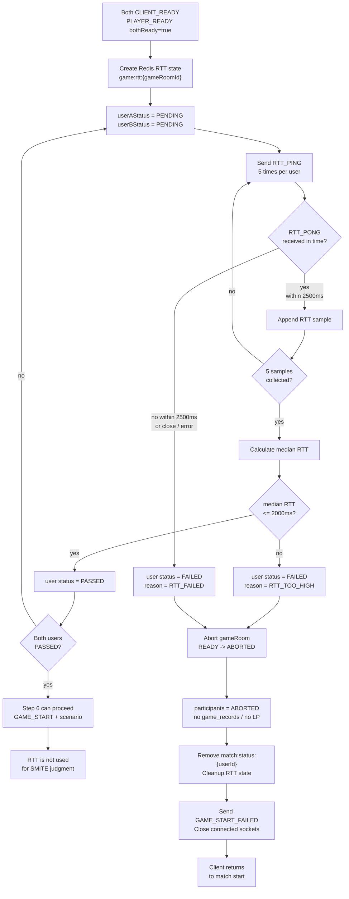
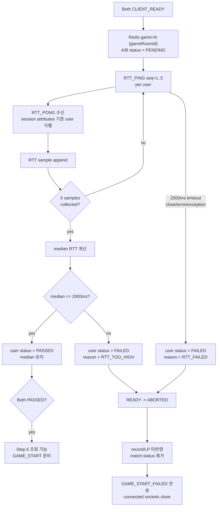
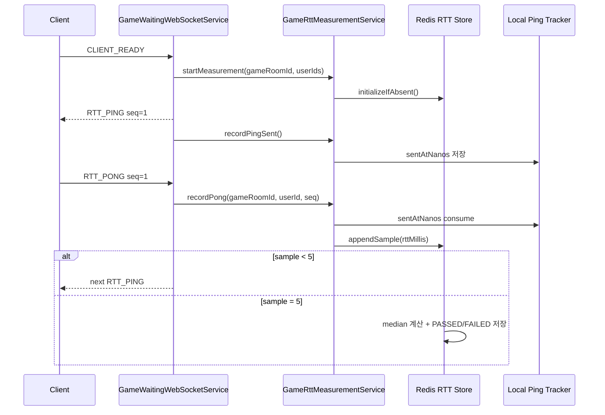
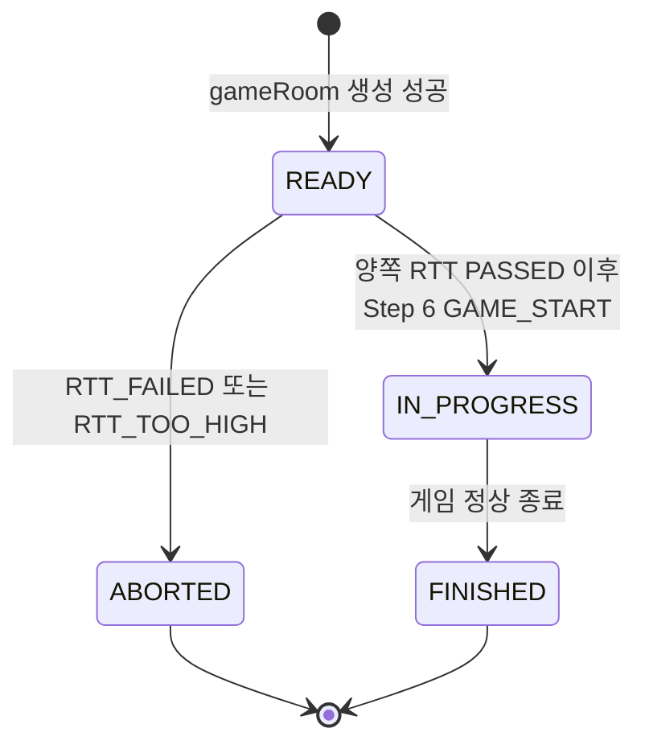
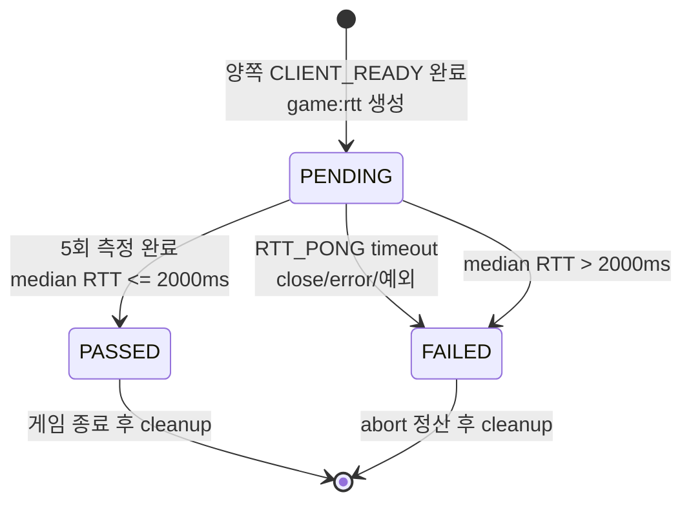
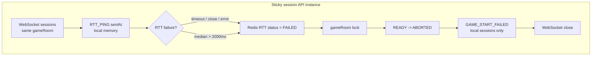
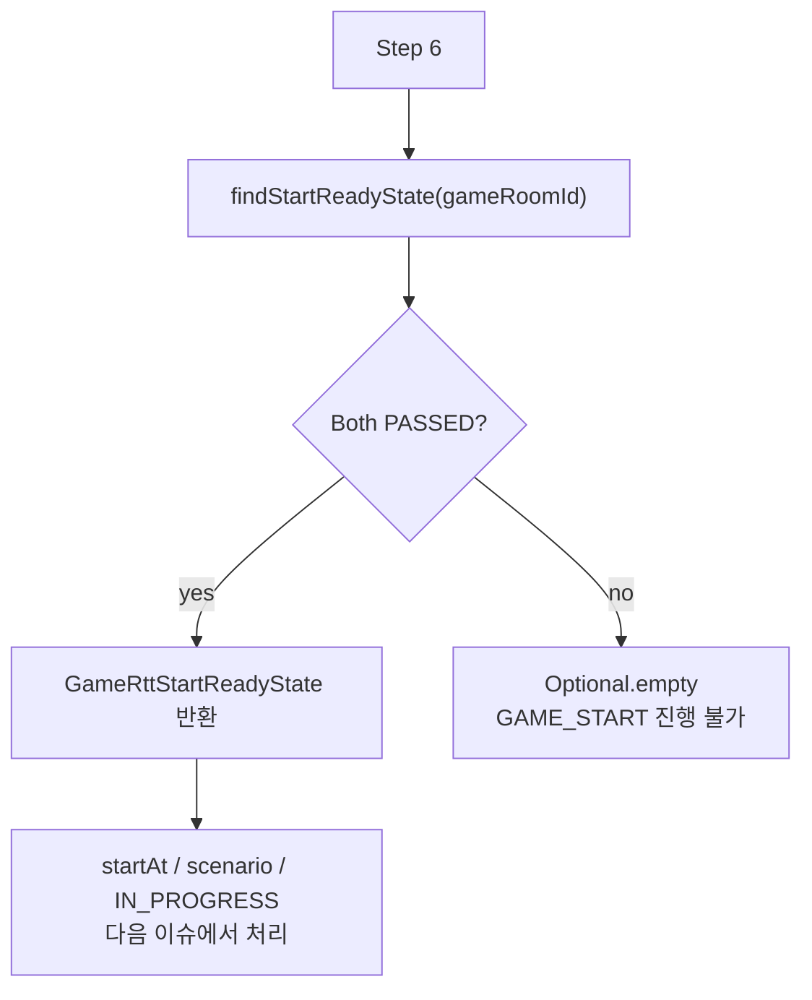

# Issue 44. Game RTT Measurement

## 📌 Feature Description



양쪽 참가자가 게임 대기 WebSocket에서 `CLIENT_READY`를 완료한 뒤, 실제 `GAME_START` 전에 WebSocket ping-pong 기반 RTT를 측정한다.

각 유저별 RTT를 5회 측정하고 median RTT로 게임 시작 가능 여부를 판단한다. median RTT가 2000ms를 초과하거나 RTT 응답 누락, WebSocket close/error, 측정 중 예외가 발생하면 게임 시작을 차단한다.

RTT 측정은 무한 대기하지 않는다. 각 `RTT_PING`은 2500ms 안에 `RTT_PONG`을 받아야 하며, 5회 측정 구조상 gameRoom 전체 RTT 측정은 최대 15초 안에 끝나야 한다. WebSocket close/error는 별도 `PEER_LEFT` 상태를 만들지 않고 `RTT_FAILED`로 단순 처리한다.

RTT 실패는 아직 `GAME_START` 이전 실패이므로 gameRoom을 `ABORTED`로 정리하고, `game_records`, LP, 배치/승급전에는 반영하지 않는다. 연결된 WebSocket session에는 `GAME_START_FAILED`를 전송한 뒤 close하고, 클라이언트는 start 버튼 화면으로 복귀한다.

RTT가 성공한 경우 Redis RTT 상태는 `GAME_START` 진입 조건 확인에만 사용한다. RTT median은 `SMITE` 판정 보정값으로 사용하지 않는다.

이번 이슈에서는 `startAt` 결정, `COUNTDOWN`, HP scenario 전달, gameRoom `IN_PROGRESS` 전환은 구현하지 않는다. 이 작업들은 다음 `GAME_START와 HP 시나리오 전달` 단계에서 처리한다.

## 📚 Tasks

### 1. RTT 정책 확정

- [x] 각 유저별 RTT 측정 횟수를 5회로 정의한다.
- [x] RTT 판정값은 평균이 아니라 median으로 정의한다.
- [x] median RTT 허용 기준을 2000ms 이하로 정의한다.
- [x] 각 `RTT_PING` 응답 제한 시간은 2500ms로 정의한다.
- [x] gameRoom 전체 RTT 측정 제한 시간은 5회 측정과 per-ping 2500ms timeout 기준 최대 15초로 정의한다.
- [x] `RTT_PONG` 응답 누락, WebSocket close/error, 측정 중 예외는 `RTT_FAILED`로 단순 처리한다.
- [x] median RTT 2000ms 초과는 `RTT_TOO_HIGH`로 처리한다.
- [x] RTT 실패/초과는 `GAME_START` 이전 실패로 보고 gameRoom `ABORTED` 처리한다고 명시한다.

### 2. Redis RTT 저장 구조 설계

- [x] Redis key는 `game:rtt:{gameRoomId}` HASH 하나로 단순하게 설계한다.
- [x] 저장 field를 정의한다.
  - [x] `userAId`
  - [x] `userBId`
  - [x] `userASamples`
  - [x] `userBSamples`
  - [x] `userAStatus`
  - [x] `userBStatus`
- [x] RTT status는 `PENDING`, `PASSED`, `FAILED`만 사용한다.
- [x] `userASamples`, `userBSamples`는 5개 고정 샘플 문자열로 저장한다.
- [x] Redis RTT HASH TTL은 게임 진행/판정 시간보다 충분히 긴 300초로 정의한다.

저장 구조:

```text
HASH game:rtt:{gameRoomId}

userAId = 1
userBId = 2
userASamples = "34,36,35,38,41"
userBSamples = "45,44,49,46,48"
userAStatus = PASSED
userBStatus = PASSED
```

초기 상태:

```text
userAId = 1
userBId = 2
userASamples = ""
userBSamples = ""
userAStatus = PENDING
userBStatus = PENDING
```

median RTT는 해당 유저의 5회 측정이 완료된 시점에 `PASSED`/`FAILED` 판단에만 사용하고, 외부 시작 조건 DTO나 LIGHTNING 판정으로 노출하지 않는다.

TTL/cleanup 정책:

- TTL은 300초로 둔다. RTT 측정과 Step 6 시작 처리를 충분히 감싸는 cleanup 누락 방지용 안전장치다.
- RTT 성공 시 `game:rtt:{gameRoomId}`는 Step 6 GAME_START 조건 확인에 사용한다. RTT 측정값은 LIGHTNING 판정 보정에는 사용하지 않는다.
- RTT 실패/초과 시 gameRoom을 `ABORTED` 처리한 뒤 `game:rtt:{gameRoomId}`를 cleanup한다.
- 게임이 정상 종료되면 `game:rtt:{gameRoomId}`를 cleanup한다.
- `RTT_FAILED`, `RTT_TOO_HIGH` reason은 이벤트/로그 용도이며 Redis RTT HASH에는 별도 reason field를 두지 않는다.

### 3. RTT WebSocket 메시지 정의

- [x] 서버 메시지 `RTT_PING`을 정의한다.
- [x] 클라이언트 메시지 `RTT_PONG`을 정의한다.
- [x] `RTT_PING` / `RTT_PONG` payload에 `seq`를 포함한다.
- [x] 클라이언트 payload의 userId/gameRoomId는 신뢰하지 않고 WebSocket session attributes 기준으로 처리한다.
- [x] 기존 `CLIENT_READY`, `PLAYER_READY`, `GAME_WAITING_TIMEOUT` 흐름과 충돌하지 않게 message type을 분리한다.

구현 결과:

- `GameWebSocketMessageType`에 client message `RTT_PONG`과 server message `RTT_PING`을 추가했다.
- `GameWebSocketServerMessage.rttPing(seq)` factory와 `RttPingPayload(seq)`를 추가했다.
- `GameWebSocketClientMessage`에 `isRttPong()`, `rttSeq()` helper를 추가했다.
- `RTT_PONG` payload에 `userId`, `gameRoomId`가 포함되어도 서버는 이를 신뢰하지 않고, 실제 처리 단계에서는 WebSocket session attributes의 gameRoomId/userId를 기준으로 삼는다.
- 이번 단계는 메시지 정의만 담당한다. `RTT_PING` 전송 시작과 `RTT_PONG` 처리 흐름은 Step 4~5에서 연결한다.

### 4. RTT 측정 시작 흐름 구현

- [x] `PLAYER_READY`의 `bothReady=true` 이후 RTT 측정을 시작한다.
- [x] RTT 상태가 없으면 `game:rtt:{gameRoomId}`를 생성하고 양쪽 status를 `PENDING`으로 저장한다.
- [x] 각 유저에게 첫 `RTT_PING seq=1`을 전송한다.
- [x] ping 전송 시각은 Redis가 아니라 local session memory에 보관한다.
- [x] sticky session 전제에서 같은 gameRoom의 RTT 측정이 같은 API 인스턴스에서 진행되도록 한다.
- [x] `RTT_PONG` 수신 후 다음 `RTT_PING`을 이어 보내는 5회 반복은 Step 5에서 처리한다.

구현 결과:

- `GameRttMeasurementService`가 local WebSocket session의 두 userId를 정렬해 `userAId`, `userBId`를 안정적으로 정하고 Redis RTT 상태를 초기화한다.
- `RedisGameRttMeasurementStore`가 `game:rtt:{gameRoomId}` HASH를 없을 때만 생성하고 TTL 300초를 설정한다.
- `GameRttPingTracker`가 `gameRoomId/userId/seq` 기준 ping 전송 시각을 API 인스턴스 local memory에 기록한다.
- `GameWaitingWebSocketHandler`는 `CLIENT_READY` 처리 후 Redis waiting 기준 `bothReady=true`이고 local registry 기준 두 세션이 모두 READY일 때 첫 `RTT_PING seq=1`을 양쪽에 전송한다.
- `RTT_PONG`은 session attributes 기준으로 처리하고, 완료 전이면 다음 `RTT_PING`을 이어 보낸다.

local memory / 동시성 기준:

- sticky session 전제에서는 같은 gameRoom의 두 WebSocket 연결이 같은 API 인스턴스로 붙는다. 그래서 `RTT_PING` 전송 시각처럼 짧게 필요한 값은 Redis가 아니라 local memory에 저장한다.
- `synchronized`는 sticky session 자체를 위한 장치가 아니라, 같은 JVM 안에서 유저 A/B의 `RTT_PONG`, close/error, 다음 ping 처리가 서로 다른 WebSocket thread로 동시에 들어올 때 local memory Map이 깨지지 않게 보호하기 위한 장치다.
- 정리하면 sticky session은 local memory 사용 근거이고, `synchronized`는 local memory의 thread-safe 접근 근거다.

### 5. RTT_PONG 처리와 median 저장

- [x] `RTT_PONG` 수신 시 session attributes 기준으로 gameRoomId/userId를 식별한다.
- [x] `seq`에 해당하는 ping 전송 시각을 조회해 RTT millis를 계산한다.
- [x] 계산한 RTT sample을 Redis HASH의 해당 유저 samples에 append한다.
- [x] 5개 sample이 모이면 정렬 후 가운데 값을 median으로 저장한다.
- [x] median RTT가 2000ms 이하이면 해당 유저 status를 `PASSED`로 저장한다.
- [x] median RTT가 2000ms 초과이면 해당 유저 status를 `FAILED`로 저장한다.
- [x] 5개 sample 수집 전이면 같은 유저에게 다음 `RTT_PING seq`를 이어서 전송한다.

구현 결과:

- `GameWaitingWebSocketService`는 `RTT_PONG` payload의 `seq`만 사용하고, gameRoomId/userId는 WebSocket session attributes 기준으로 처리한다.
- `GameRttMeasurementService`는 local memory의 `gameRoomId/userId/seq` sentAt을 consume한 뒤 RTT millis를 계산한다.
- sentAt은 한 번만 consume되므로 같은 `RTT_PONG`이 중복 도착해도 Redis sample에 중복 append되지 않는다.
- `RedisGameRttMeasurementStore`는 해당 유저의 samples field에 RTT 값을 append한다.
- sample이 5개 미만이면 `GameWaitingWebSocketService`가 다음 `RTT_PING seq`를 같은 유저에게 전송한다.
- sample이 5개가 되면 정렬 후 가운데 값을 median으로 저장하고, 2000ms 이하이면 `PASSED`, 초과이면 `FAILED`로 저장한다.
- median 초과로 `FAILED`가 된 이후의 gameRoom abort, match status 제거, 실패 이벤트 전송은 Step 6~8의 실패 처리 흐름에서 연결한다.

### 6. RTT 실패 처리

- [x] `RTT_PONG` 2500ms 응답 제한 시간 초과 시 `FAILED` 처리한다.
- [x] RTT 측정 중 WebSocket close/error 발생 시 `RTT_FAILED`로 처리한다.
- [x] RTT 측정 중 예외가 발생하면 `RTT_FAILED`로 처리한다.
- [x] 실패 reason은 최소로 유지한다.
  - [x] `RTT_FAILED`: 응답 누락, close/error, 측정 중 예외
  - [x] `RTT_TOO_HIGH`: median RTT 2000ms 초과

구현 결과:

- `GameRttPingTracker`가 local memory의 pending ping 전송 시각을 timeout 기준으로 consume한다.
- `GameRttTimeoutScheduler`는 500ms 주기로 timeout된 pending ping을 조회하고 해당 유저의 Redis RTT status를 `FAILED`로 전환한다.
- WebSocket close/error가 발생하면 session의 gameRoomId/userId 기준으로 Redis RTT status를 `FAILED`로 전환한다. RTT 상태가 없거나 이미 완료된 경우 no-op 처리한다.
- `RTT_PONG` 처리 중 예외가 발생하면 해당 유저 Redis RTT status를 `FAILED`로 전환하고 로그를 남긴다.
- Redis RTT HASH에는 reason field를 두지 않는다. `RTT_FAILED`, `RTT_TOO_HIGH`는 이후 실패 이벤트/로그 구분용 정책 값이다.
- RTT status가 `FAILED`로 확정되면 Step 7의 GAME_START 이전 abort 정산으로 이어진다. `GAME_START_FAILED` 전송은 Step 8에서 연결한다.

### 7. GAME_START 이전 abort 처리

- [x] RTT 실패/초과 시 gameRoom 상태를 `ABORTED`로 전환한다.
- [x] RTT 실패/초과 시 game_participants 상태를 `ABORTED`로 전환한다.
- [x] RTT 실패/초과 시 `game_records`를 생성하지 않는다.
- [x] RTT 실패/초과 시 LP/배치/승급전 결과를 반영하지 않는다.
- [x] RTT 실패/초과 시 Redis `match:status:{userId}`를 제거한다.
- [x] RTT 실패/초과 시 Redis RTT 상태를 cleanup한다.
- [x] RTT 성공 시 Redis RTT 상태는 game 판정 완료 전까지 유지한다.
- [ ] 게임 종료 후 Redis RTT 상태를 cleanup한다.

구현 결과:

- `GameRttFailureProcessor`가 Redis RTT 상태에 `FAILED` 유저가 있는 gameRoom만 실패 정산한다.
- gameRoom이 `READY`이면 `abortReadyRoomIfReady`로 safe abort를 수행한다. 이때 core domain의 `abortBeforeStartIfReady`가 gameRoom을 `ABORTED`로 바꾸고 participants도 `ABORTED`로 전환한다.
- gameRoom이 이미 `ABORTED`이면 abort는 다시 하지 않고 match status 제거와 RTT cleanup만 재시도한다.
- gameRoom이 이미 `IN_PROGRESS` 등 READY 이후 상태이면 잘못 abort하지 않고 RTT local memory / Redis 상태만 정리한다.
- match status 제거는 `removeGameStartFailureStatuses`를 사용한다. 현재 값이 `IN_GAME`인 유저만 제거하므로, 실패 정산 재시도 중 유저가 새 매칭을 시작한 경우 새 `MATCHING` 상태를 지우지 않는다.
- RTT 실패/초과는 아직 `GAME_START` 이전이므로 game record, LP, 배치/승급전 흐름을 호출하지 않는다.
- 실패 정산은 gameRoomId 기준 Redis lock으로 감싸 중복 abort/cleanup을 방지한다.
- 실패 reason은 Redis RTT HASH에 저장하지 않고, timeout/close/error/예외는 `RTT_FAILED`, median 초과는 `RTT_TOO_HIGH`로 실패 정산 processor에 전달한다. 이 값은 Step 8의 `GAME_START_FAILED` 이벤트 전송에 사용한다.
- `GAME_START_FAILED` WebSocket 이벤트 전송과 session close는 Step 8에서 연결한다.

### 8. 실패 이벤트 전송

- [x] 서버 메시지 `GAME_START_FAILED`를 정의한다.
- [x] payload는 `gameRoomId`, `reason`, `action`만 포함해 단순하게 유지한다.
- [x] `action`은 `GO_TO_MATCH_START`로 정의한다.
- [x] 연결된 WebSocket session에만 `GAME_START_FAILED`를 전송한다.
- [x] 실패 이벤트 전송 후 연결된 WebSocket session을 close한다.
- [x] 미접속 유저에게는 별도 push를 보내지 않는다.

구현 결과:

- `GameWebSocketMessageType`에 server message `GAME_START_FAILED`를 추가했다.
- `GameWebSocketServerMessage.gameStartFailed(gameRoomId, reason, action)` factory를 추가했다.
- `GameStartFailedWebSocketSender`가 현재 API 인스턴스의 local session registry에서 gameRoom session만 조회해 `GAME_START_FAILED`를 전송한다.
- 실패 이벤트 payload는 `gameRoomId`, `reason`, `action`만 포함한다.
  - `reason`: `RTT_FAILED` 또는 `RTT_TOO_HIGH`
  - `action`: `GO_TO_MATCH_START`
- 이벤트 전송 후 해당 WebSocket session은 registry에서 제거하고 close한다.
- sticky session 전제상 RTT 실패 정산은 해당 gameRoom WebSocket session을 가진 인스턴스에서 발생하므로 별도 Pub/Sub 없이 local session에만 전송한다.
- 미접속 유저에게는 별도 push를 보내지 않는다.

### 9. Step 6 연동 지점 정의

- [x] 양쪽 `userAStatus`, `userBStatus`가 모두 `PASSED`이면 Step 6과 LIGHTNING 판정에서 조회 가능한 상태로 둔다.
- [x] Step 6에서 Redis RTT 상태의 양쪽 `PASSED` 여부를 확인한 뒤 `startAt`, scenario, `IN_PROGRESS` 전환을 처리하도록 연동 계약을 정의한다.
- [x] 이번 이슈에서는 `COUNTDOWN`, `GAME_START`, scenario 전달을 구현하지 않는다.

구현 결과:

- Step 6이 Redis field를 직접 알 필요 없도록 `GameRttMeasurementService.findStartReadyState(gameRoomId)` 조회 지점을 추가했다.
- 조회 결과는 `Optional<GameRttStartReadyState>`로 반환한다.
- `GameRttStartReadyState`는 `gameRoomId`, `userAId`, `userBId`를 포함한다.
- 양쪽 status가 모두 `PASSED`인 경우에만 값을 반환한다.
- RTT 상태가 없거나, 한 명이라도 `PENDING`/`FAILED`이면 `Optional.empty()`를 반환한다.
- 이 조회는 read-only이며 Redis RTT 상태를 cleanup하지 않는다. 성공한 RTT 상태는 Step 6의 시작 조건 확인에만 사용하고 LIGHTNING 판정에는 사용하지 않는다.
- Step 6은 이 값이 있을 때만 `startAt`, scenario, `IN_PROGRESS` 전환을 진행하고, `COUNTDOWN`/`GAME_START` 전송은 다음 단계에서 구현한다.

### 10. 테스트

- [x] RTT samples 5개 수집 후 median 계산을 검증한다.
- [x] median RTT 2000ms 이하이면 `PASSED`로 저장되는지 검증한다.
- [x] median RTT 2000ms 초과이면 `FAILED`로 저장되는지 검증한다.
- [x] `RTT_PONG` timeout 시 `RTT_FAILED` 처리되는지 검증한다.
- [x] WebSocket close/error가 RTT 측정 중이면 `RTT_FAILED` 처리되는지 검증한다.
- [x] RTT 실패 시 gameRoom/participants `ABORTED`, record/LP 미반영을 검증한다.
- [x] 양쪽 `PASSED` 시 Step 6과 LIGHTNING 판정에서 조회 가능한 Redis 상태가 남는지 검증한다.
- [x] RTT 실패/초과 시 Redis RTT 상태가 cleanup되는지 검증한다.
- [x] RTT 실패/초과 시 연결된 WebSocket session에 `GAME_START_FAILED`가 전송되고 close 되는지 검증한다.

### 11. 문서

- [x] `policy.md`에 RTT 실패/초과 정책을 반영한다.
- [x] `domain status.md`에 READY 상태에서 RTT 실패 시 `ABORTED` 전이를 반영한다.
- [x] `flow status.md`에 `CLIENT_READY -> RTT 측정 -> Step 6` 흐름을 반영한다.
- [x] `websocket client.md`에 `RTT_PING`, `RTT_PONG`, `GAME_START_FAILED` 클라이언트 처리 정책을 반영한다.
- [x] `DDL.md`에 Redis `game:rtt:{gameRoomId}` 저장 구조를 반영한다.
- [x] `plan-checkpoint.md` Step 5 상태를 구현 결과와 맞춘다.

## ✅ 완료 기준

- 양쪽 `CLIENT_READY` 완료 이후 RTT 측정이 시작된다.
- 각 유저별 RTT 5회 측정값으로 median RTT를 계산한다.
- 각 `RTT_PING`은 2500ms 안에 `RTT_PONG` 응답을 받아야 한다.
- gameRoom 전체 RTT 측정은 5회 측정과 per-ping 2500ms timeout 기준 최대 15초 안에 완료되거나 실패 처리된다.
- 양쪽 median RTT가 2000ms 이하이면 Redis RTT 상태가 `PASSED`로 저장된다.
- RTT 응답 누락, close/error, 측정 중 예외는 `RTT_FAILED`로 처리된다.
- median RTT 2000ms 초과는 `RTT_TOO_HIGH`로 처리된다.
- RTT 실패/초과 시 gameRoom과 participants는 `ABORTED`가 된다.
- RTT 실패/초과 시 `game_records`, LP, 배치/승급전은 반영되지 않는다.
- RTT 실패/초과 시 연결된 WebSocket에는 `GAME_START_FAILED`가 전송되고 close 된다.
- 양쪽 RTT가 `PASSED`이면 다음 Step 6에서 `GAME_START` 준비를 진행할 수 있다. 이후 LIGHTNING 판정은 RTT 값 조회 없이 서버 수신 시각 기준으로 처리한다.
- RTT 성공 상태는 게임 종료 전까지 유지되고, 게임 종료 후 cleanup 대상이다.

## 📝 Note

- `PENDING`, `PASSED`, `FAILED`는 Redis RTT 측정 상태이며 DB gameRoom status가 아니다.
- RTT 성공 상태는 Step 6 GAME_START 조건 확인에 사용한다. LIGHTNING 판정은 `smiteTimeMs = serverReceiveTime - gameStartTime`으로 계산한다.
- `GAME_START_FAILED`의 reason은 클라이언트 분기보다 운영/디버깅 목적이 크다.
- 클라이언트는 `GAME_START_FAILED` reason과 관계없이 start 버튼 화면으로 복귀한다.
- `COUNTDOWN`은 이번 이슈가 아니라 Step 6에서 `startAt`, scenario, `IN_PROGRESS` 전환과 함께 처리한다.

---
## PR

## 📌 Summary

양쪽 참가자가 게임 대기 WebSocket에서 `CLIENT_READY`를 완료한 뒤, `GAME_START` 전에 서버 주도 RTT 측정을 수행하는 흐름을 구현했습니다.

각 유저별로 `RTT_PING` / `RTT_PONG`을 5회 측정하고 median RTT를 Redis에 저장합니다. 양쪽 median RTT가 모두 2000ms 이하이면 다음 Step 6에서 `GAME_START` 준비를 진행할 수 있고, RTT 응답 누락/연결 종료/측정 예외/median 초과가 발생하면 아직 게임 시작 전 실패로 보고 gameRoom과 participants를 `ABORTED` 처리합니다.



핵심 정책은 다음과 같습니다.

| 정책 | 내용 |
| :--- | :--- |
| 측정 시점 | 양쪽 `CLIENT_READY` 완료 이후, `GAME_START` 이전 |
| 측정 방식 | 유저별 WebSocket ping-pong 5회 |
| 판정값 | 평균이 아니라 median RTT |
| 성공 기준 | 양쪽 median RTT 모두 2000ms 이하 |
| 응답 제한 | 각 `RTT_PING`은 2500ms 안에 `RTT_PONG` 필요 |
| 전체 제한 | 5회 측정과 per-ping timeout 기준 최대 15초 |
| 실패 reason | 응답 누락/close/error/예외는 `RTT_FAILED`, median 초과는 `RTT_TOO_HIGH` |
| 실패 결과 | `game_rooms=ABORTED`, participants `ABORTED`, record/LP/배치/승급전 미반영 |
| 클라이언트 복귀 | 연결된 WebSocket에만 `GAME_START_FAILED` 전송 후 close |
| 성공 상태 | 양쪽 `PASSED` 상태는 GAME_START 조건 확인에 사용하며, LIGHTNING 판정 보정에는 사용하지 않음 |

## 📚 Changes

### 1. RTT 측정 상태를 Redis HASH 하나로 단순화

RTT 측정 결과는 gameRoom 단위 Redis HASH 하나에 저장합니다.

```text
game:rtt:{gameRoomId}
  userAId = 1
  userBId = 2
  userASamples = "34,36,35,38,41"
  userBSamples = "45,44,49,46,48"
  userAStatus = PASSED
  userBStatus = PASSED
```

이 구조를 선택한 이유는 Step 6 시작 조건 확인에 필요한 정보가 `참가자`, `샘플`, `상태`로 고정되어 있기 때문입니다. 별도 key를 유저별로 쪼개면 개별 갱신은 단순해지지만, “양쪽이 모두 통과했는가?”를 판단할 때 key 조회가 늘고 cleanup 대상도 늘어납니다. 반대로 gameRoom 단위 HASH는 한 번의 상태 조회로 양쪽 상태를 판단할 수 있어 이번 흐름에 더 적합합니다.

| 선택지 | 장점 | 단점 | 결정 |
| :--- | :--- | :--- | :--- |
| gameRoom 단위 HASH | 양쪽 상태를 한 번에 조회, cleanup 단순 | 한 HASH에 field가 모임 | 채택 |
| user 단위 key | 유저별 갱신 범위가 작음 | 양쪽 판정/cleanup 시 key 관리 증가 | 미채택 |
| DB 저장 | 영속성 강함 | GAME_START 전 임시 측정값이라 write 비용과 정리 부담 증가 | 미채택 |

### 2. median RTT 기준으로 시작 가능 여부 판정

RTT는 순간적인 네트워크 튐이 생길 수 있으므로 평균이 아니라 median을 사용했습니다. 평균은 1회 큰 지연값에 크게 흔들릴 수 있지만, median은 5회 샘플 중 중앙값을 사용하므로 일시적인 outlier 영향을 줄입니다.

정책상 median RTT가 2000ms를 초과하면 게임을 시작하지 않습니다. 이 실패는 게임 중 패배나 탈주가 아니라 아직 `GAME_START` 이전의 진입 실패이므로 record, LP, 배치/승급전에는 반영하지 않습니다.

### 3. RTT 측정과 WebSocket session 책임 분리

WebSocket handler는 메시지 라우팅과 session attributes 검증만 담당하고, RTT 측정은 `GameRttMeasurementService`가 처리하도록 분리했습니다.



`RTT_PONG` payload의 `userId`나 `gameRoomId`는 신뢰하지 않고 WebSocket session attributes의 값을 사용합니다. 클라이언트가 보낸 payload를 그대로 믿으면 다른 유저나 다른 gameRoom의 RTT 상태를 오염시킬 수 있기 때문입니다.

### 4. local memory 사용 범위와 sticky session 전제

RTT ping 전송 시각은 Redis가 아니라 API 인스턴스 local memory에 저장합니다.

이 값은 다음 특성을 가집니다.

| 특성 | 판단 |
| :--- | :--- |
| 수명 | `RTT_PING` 전송 후 `RTT_PONG` 수신 또는 timeout까지 아주 짧음 |
| 용도 | RTT millis 계산용 임시 값 |
| 영속 필요성 | 없음 |
| 분산 조회 필요성 | sticky session 전제에서는 낮음 |

sticky session으로 같은 gameRoom의 WebSocket 연결이 같은 API 인스턴스에 붙는다는 전제에서는 local memory가 가장 단순합니다. Redis에 sentAt까지 저장하면 멀티 인스턴스 내구성은 조금 좋아지지만, 매 ping마다 Redis write/read가 추가되고 RTT 측정 자체의 지연도 늘어날 수 있습니다.

`synchronized`는 sticky session을 보장하기 위한 장치가 아닙니다. 같은 JVM 안에서 유저 A/B의 `RTT_PONG`, close/error, timeout scheduler가 동시에 local Map에 접근할 수 있으므로 local memory의 thread-safe 접근을 보장하기 위한 장치입니다.

### 5. 실패 정산은 GAME_START 이전 safe abort로 제한

RTT 실패/초과가 발생하면 gameRoom이 아직 `READY`인 경우에만 `ABORTED`로 전환합니다. 이미 `IN_PROGRESS` 등 READY 이후 상태라면 늦은 실패 이벤트로 정상 진행 중인 게임을 잘못 abort하지 않고 RTT 상태만 정리합니다.

상태 전환은 DB gameRoom status와 Redis RTT status를 분리해서 봐야 합니다.

DB gameRoom 상태 전환:



Redis RTT 상태 전환:



이 전환에서 중요한 점은 `PENDING`, `PASSED`, `FAILED`가 DB gameRoom status가 아니라 Redis RTT 측정 상태라는 점입니다. DB gameRoom은 `READY -> ABORTED` 또는 이후 Step 6에서 `READY -> IN_PROGRESS`로만 전환됩니다.

### 6. 실패 이벤트는 Pub/Sub 없이 local session에만 전송

game waiting timeout은 scheduler가 어느 인스턴스에서 실행될지 모르기 때문에 Pub/Sub이 필요했습니다. 반면 RTT 실패는 WebSocket session이 붙어 있는 인스턴스에서 `RTT_PONG`, close/error, local ping timeout을 처리하는 흐름입니다. sticky session 전제상 실패 이벤트를 전송해야 하는 session도 같은 인스턴스 local registry에 있습니다.



그래서 이번 실패 이벤트에는 Pub/Sub을 추가하지 않았습니다. Pub/Sub을 넣으면 이벤트 전파 범위는 넓어지지만, 현재 RTT 실패 흐름에서는 실제 이득이 작고 구독/발행/중복 전송 방지 로직만 늘어납니다.

| 선택지 | 장점 | 단점 | 결정 |
| :--- | :--- | :--- | :--- |
| local session 전송 | 코드 단순, sticky session 정책과 일치, 중복 전송 위험 낮음 | sticky session 전제에 의존 | 채택 |
| Redis Pub/Sub | session 보유 인스턴스와 정산 인스턴스가 달라도 전송 가능 | 현재 RTT 흐름에서는 과한 fan-out, 중복 처리 고려 필요 | 미채택 |

미접속 유저에게는 별도 push를 보내지 않습니다. 연결된 유저에게만 `GAME_START_FAILED`를 전송하고, 클라이언트는 reason과 관계없이 start 버튼 화면으로 복귀합니다.

### 7. Step 6 연동 계약만 정의

이번 이슈에서는 `COUNTDOWN`, `GAME_START`, HP scenario 전달, gameRoom `IN_PROGRESS` 전환을 구현하지 않습니다. 대신 Step 6이 사용할 조회 계약만 열었습니다.



`GameRttStartReadyState`는 Redis field를 외부로 노출하지 않고 `gameRoomId`, `userAId`, `userBId`만 제공합니다. Step 6은 이 값이 있을 때만 게임 시작 준비를 진행하면 됩니다.

### 8. 테스트와 문서 정합성

테스트는 정책 단위로 검증했습니다.

| 검증 대상 | 내용 |
| :--- | :--- |
| RTT 저장 | 5회 sample 수집, median 계산, `PASSED`/`FAILED` 저장 |
| timeout | `RTT_PONG` 2500ms 초과 시 `RTT_FAILED` 처리 |
| WebSocket close/error | RTT 측정 중 close/error를 `RTT_FAILED`로 처리 |
| abort 정산 | READY gameRoom만 `ABORTED`, 이미 `IN_PROGRESS`면 abort하지 않음 |
| cleanup | 실패/초과 시 Redis RTT와 local ping 상태 cleanup |
| 실패 이벤트 | 연결된 session에 `GAME_START_FAILED` 전송 후 close |
| Step 6 계약 | 양쪽 `PASSED`와 median 존재 시에만 start ready state 반환 |

문서는 `policy.md`, `domain status.md`, `flow status.md`, `websocket client.md`, `DDL.md`, `plan-checkpoint.md`에 RTT 정책과 Redis 구조를 반영했습니다. 특히 15초 제한은 별도 global timer가 아니라 5회 측정과 per-ping 2500ms timeout 기준이라는 점을 명시했습니다.

## 📝 Note

- RTT 성공 상태는 Step 6 GAME_START 조건 확인에 사용합니다. 이후 LIGHTNING 판정은 RTT 보정 없이 `smiteTimeMs = serverReceiveTime - gameStartTime`으로 계산합니다.
- RTT 실패 reason은 Redis HASH에 저장하지 않습니다. reason은 이벤트/로그 구분용이고, 저장 상태는 `PENDING`, `PASSED`, `FAILED`만 유지해 단순화했습니다.
- 게임 종료 후 `game:rtt:{gameRoomId}` cleanup은 후속 게임 종료 흐름에서 처리합니다.
- `COUNTDOWN`, `GAME_START`, HP scenario 전달, `IN_PROGRESS` 전환은 다음 Step 6 범위입니다.

## 📌 Related Issue
- Closes #44
