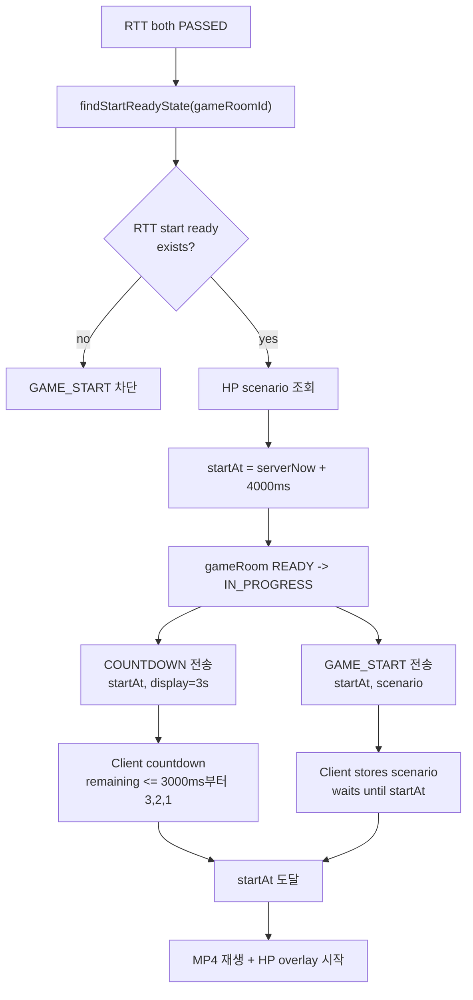

# Issue 46. GAME_START와 HP 시나리오 전달

## 📌 Feature Description

RTT 측정을 통과한 gameRoom을 실제 게임 시작 상태로 전환하고, 양쪽 클라이언트가 같은 서버 기준 시작 시각에 MP4 재생과 HP bar overlay를 시작할 수 있게 한다.

서버는 양쪽 RTT가 모두 `PASSED`인 경우에만 `startAt`을 확정한다. `startAt`은 `serverNow + 4000ms`로 넉넉하게 잡고, 클라이언트는 남은 시간이 3000ms 이하가 되면 `3, 2, 1` countdown을 렌더링한다.

`GAME_START`는 countdown이 끝난 뒤 보내지 않는다. 서버는 `COUNTDOWN`과 `GAME_START`를 미리 전송하고, 클라이언트가 `startAt`까지 기다렸다가 실제 게임을 시작한다.

## 📚 Tasks

### 1. GAME_START 정책 확정

- [x] Step 6은 양쪽 RTT가 모두 `PASSED`이고 median RTT가 저장된 경우에만 진행한다.
- [x] `findStartReadyState(gameRoomId)`가 empty이면 `GAME_START`를 진행하지 않는다.
- [x] 서버 시작 여유 시간은 `startAt = serverNow + 4000ms`로 정의한다.
- [x] 프론트 countdown 표시는 남은 시간이 3000ms 이하일 때 `3, 2, 1`을 렌더링하는 정책으로 정의한다.
- [x] 서버는 `COUNTDOWN`과 `GAME_START`를 countdown 종료 후가 아니라 `startAt` 전에 미리 전송한다.
- [x] MP4 preload 완료 여부는 `CLIENT_READY` 전제로 보고 Step 6에서 다시 검증하지 않는다.

정책 확정 결과:

- `COUNTDOWN`은 시작 예고 메시지다. `startAt`, `serverTime`, `countdownDisplaySeconds=3`을 전달해 클라이언트가 남은 시간 기준으로 카운트다운을 렌더링한다.
- `GAME_START`는 실제 게임 데이터 메시지다. `startAt`과 HP scenario를 전달하지만, 클라이언트는 수신 즉시 시작하지 않고 `startAt`까지 대기한다.
- `COUNTDOWN`과 `GAME_START`는 반드시 같은 `startAt`을 사용한다.
- `startAt`은 서버 기준 현재 시각에서 4000ms 뒤로 잡는다. 일반적인 네트워크 지연이 있어도 프론트가 3초 countdown을 렌더링할 여유를 주기 위한 정책이다.
- 클라이언트가 메시지를 늦게 받으면 `3`이 아니라 `2` 또는 `1`부터 볼 수 있다. 이 경우에도 실제 시작 기준은 `startAt`으로 유지한다.

### 2. 시작 조건 확인

- [x] Redis RTT 상태에서 양쪽 `PASSED`와 median RTT 존재 여부를 조회한다.
- [x] gameRoom 현재 상태가 `READY`인지 확인한다.
- [x] 이미 `IN_PROGRESS`, `ABORTED`, `FINISHED`인 gameRoom은 중복 시작하지 않는다.
- [x] WebSocket local session이 양쪽 모두 존재하는지 확인한다.

구현 결과:

- `GameStartConditionService.checkStartReady(gameRoomId)`로 Step 6 진입 조건을 한 곳에서 확인한다.
- RTT 조건은 `GameRttMeasurementService.findStartReadyState(gameRoomId)` 결과를 기준으로 한다.
- RTT 상태가 없거나 양쪽 `PASSED`와 median RTT가 모두 준비되지 않았으면 `RTT_NOT_READY`로 차단한다.
- DB gameRoom이 `READY`가 아니면 `GAME_ROOM_NOT_READY`로 차단한다. 따라서 이미 `IN_PROGRESS`, `ABORTED`, `FINISHED`인 gameRoom은 중복 시작되지 않는다.
- sticky session 전제에서 local WebSocket registry에 RTT 통과 유저 A/B session이 모두 있어야 시작 가능하다. 둘 중 하나라도 없으면 `WEB_SOCKET_SESSION_NOT_READY`로 차단한다.
- 이 단계는 조건 확인만 담당한다. `READY -> IN_PROGRESS`, `COUNTDOWN`, `GAME_START` 전송은 이후 task에서 처리한다.

### 3. HP scenario payload 확정

- [ ] 기존 gameRoom scenario 저장 구조를 확인한다.
- [ ] `GAME_START` payload에 포함할 HP scenario 구조를 정의한다.
- [ ] 클라이언트가 `startAt` 기준으로 HP bar overlay를 계산할 수 있게 필요한 값만 전달한다.
- [ ] MP4는 배경으로만 사용하고, HP 변화는 scenario와 `startAt` 기준으로 계산한다.

### 4. startAt 결정과 상태 전환

- [ ] 서버 기준 `serverTime`과 `startAt`을 millisecond timestamp로 확정한다.
- [ ] gameRoom을 `READY -> IN_PROGRESS`로 전환한다.
- [ ] 상태 전환 성공 이후에만 `COUNTDOWN` / `GAME_START`를 전송한다.
- [ ] 상태 전환 실패 시 WebSocket 시작 이벤트를 보내지 않는다.

### 5. WebSocket 메시지 정의 및 전송

- [ ] server message `COUNTDOWN`을 정의한다.
- [ ] `COUNTDOWN` payload에 `gameRoomId`, `serverTime`, `startAt`, `countdownDisplaySeconds=3`을 포함한다.
- [ ] server message `GAME_START`를 정의한다.
- [ ] `GAME_START` payload에 `gameRoomId`, `serverTime`, `startAt`, `scenario`를 포함한다.
- [ ] 두 메시지는 같은 `startAt`을 사용한다.
- [ ] 클라이언트는 `GAME_START`를 받더라도 즉시 시작하지 않고 `startAt`까지 대기한다.

### 6. game end timer/scheduler 등록 지점 정의

- [ ] `GAME_START` 확정 시 서버 기준 game end deadline을 등록한다.
- [ ] SMITE 미입력, 정상 종료, timeout 종료 흐름에서 재사용할 수 있게 등록 지점을 분리한다.

### 7. 실패/예외 처리

- [ ] RTT start ready 상태가 없으면 시작 차단한다.
- [ ] scenario 조회 실패 시 시작 차단한다.
- [ ] gameRoom 상태 전환 실패 시 시작 차단한다.
- [ ] WebSocket 전송 실패 시 정책을 정의한다.
- [ ] 시작 실패가 GAME_START 이전 실패인지, 이미 IN_PROGRESS 이후 실패인지 구분한다.

### 8. 테스트

- [ ] 양쪽 RTT `PASSED`이면 `startAt`이 `serverNow + 4000ms` 기준으로 생성되는지 검증한다.
- [ ] RTT 상태가 없거나 한쪽이라도 `PASSED`가 아니면 시작하지 않는지 검증한다.
- [ ] gameRoom `READY -> IN_PROGRESS` 전환을 검증한다.
- [ ] `COUNTDOWN`과 `GAME_START`가 같은 `startAt`을 사용하는지 검증한다.
- [ ] `GAME_START` payload에 HP scenario가 포함되는지 검증한다.
- [ ] 이미 시작된 gameRoom의 중복 시작을 방지하는지 검증한다.

### 9. 문서

- [x] Step 1 정책 확정 내용(`startAt = serverNow + 4000ms`, 프론트 3초 countdown, `COUNTDOWN`/`GAME_START` 사전 전송)을 관련 문서에 선반영한다.
- [ ] 구현 완료 후 `policy.md`를 실제 구현 결과와 맞춘다.
- [ ] 구현 완료 후 `domain status.md`의 `READY -> IN_PROGRESS` 전이를 실제 구현 결과와 맞춘다.
- [ ] 구현 완료 후 `flow status.md`의 RTT 통과 후 `COUNTDOWN` / `GAME_START` 흐름을 실제 구현 결과와 맞춘다.
- [ ] 구현 완료 후 `websocket client.md`의 메시지 payload와 클라이언트 처리 정책을 실제 구현 결과와 맞춘다.
- [ ] 구현 완료 후 `plan-checkpoint.md` Step 6 상태를 구현 결과와 맞춘다.

## ✅ 완료 기준

- RTT 양쪽 `PASSED`인 gameRoom만 `GAME_START`로 진입할 수 있다.
- 서버가 `startAt = serverNow + 4000ms`로 같은 시작 시각을 확정한다.
- 클라이언트는 남은 시간이 3000ms 이하일 때 `3, 2, 1` countdown을 렌더링한다.
- 서버는 `COUNTDOWN`과 `GAME_START`를 `startAt` 전에 미리 전송한다.
- gameRoom은 `READY -> IN_PROGRESS`로 전환된다.
- `GAME_START` payload로 HP scenario가 전달된다.
- 클라이언트는 `startAt` 기준으로 MP4 재생과 HP overlay를 시작할 수 있다.

## 📝 Note

- `COUNTDOWN`은 시작 예고 메시지이고, `GAME_START`는 실제 게임 데이터 전달 메시지다.
- `GAME_START`를 countdown 종료 후 보내면 네트워크 지연 때문에 실제 시작이 늦어질 수 있으므로 미리 전송한다.
- `COUNTDOWN`과 `GAME_START`는 반드시 같은 `startAt`을 사용한다.
- Step 6에서 MP4 preload 여부는 다시 확인하지 않는다. `CLIENT_READY`가 preload 완료 전제다.

---

## PR

## 📌 Summary

## 📚 Changes

## 📝 Note

## 📌 Related Issue
- Closes #46
