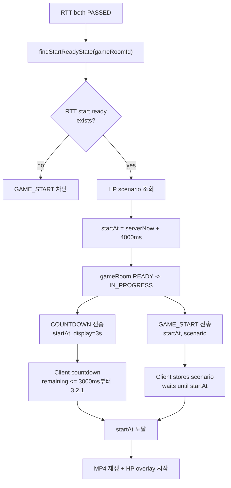

# Issue 46. GAME_START와 HP 시나리오 전달

## 📌 Feature Description

RTT 측정을 통과한 gameRoom을 실제 게임 시작 상태로 전환하고, 양쪽 클라이언트가 같은 서버 기준 시작 시각에 MP4 재생과 HP bar overlay를 시작할 수 있게 한다.

서버는 양쪽 RTT가 모두 `PASSED`인 경우에만 `startAt`을 확정한다. `startAt`은 `serverNow + 4000ms`로 넉넉하게 잡고, 클라이언트는 남은 시간이 3000ms 이하가 되면 `3, 2, 1` countdown을 렌더링한다.

`GAME_START`는 countdown이 끝난 뒤 보내지 않는다. 서버는 `COUNTDOWN`과 `GAME_START`를 미리 전송하고, 클라이언트가 `startAt`까지 기다렸다가 실제 게임을 시작한다.

## 📚 Tasks

### 1. GAME_START 정책 확정

- [x] Step 6은 양쪽 RTT가 모두 `PASSED`이고 median RTT가 저장된 경우에만 진행한다.
- [x] `findStartReadyState(gameRoomId)`가 empty이면 `GAME_START`를 진행하지 않는다.
- [x] 서버 시작 여유 시간은 `startAt = serverNow + 4000ms`로 정의한다.
- [x] 프론트 countdown 표시는 남은 시간이 3000ms 이하일 때 `3, 2, 1`을 렌더링하는 정책으로 정의한다.
- [x] 서버는 `COUNTDOWN`과 `GAME_START`를 countdown 종료 후가 아니라 `startAt` 전에 미리 전송한다.
- [x] MP4 preload 완료 여부는 `CLIENT_READY` 전제로 보고 Step 6에서 다시 검증하지 않는다.

정책 확정 결과:

- `COUNTDOWN`은 시작 예고 메시지다. `startAt`, `serverTime`, `countdownDisplaySeconds=3`을 전달해 클라이언트가 남은 시간 기준으로 카운트다운을 렌더링한다.
- `GAME_START`는 실제 게임 데이터 메시지다. `startAt`과 HP scenario를 전달하지만, 클라이언트는 수신 즉시 시작하지 않고 `startAt`까지 대기한다.
- `COUNTDOWN`과 `GAME_START`는 반드시 같은 `startAt`을 사용한다.
- `startAt`은 서버 기준 현재 시각에서 4000ms 뒤로 잡는다. 일반적인 네트워크 지연이 있어도 프론트가 3초 countdown을 렌더링할 여유를 주기 위한 정책이다.
- 클라이언트가 메시지를 늦게 받으면 `3`이 아니라 `2` 또는 `1`부터 볼 수 있다. 이 경우에도 실제 시작 기준은 `startAt`으로 유지한다.

### 2. 시작 조건 확인

- [x] Redis RTT 상태에서 양쪽 `PASSED`와 median RTT 존재 여부를 조회한다.
- [x] gameRoom 현재 상태가 `READY`인지 확인한다.
- [x] 이미 `IN_PROGRESS`, `ABORTED`, `FINISHED`인 gameRoom은 중복 시작하지 않는다.
- [x] WebSocket local session이 양쪽 모두 존재하는지 확인한다.

구현 결과:

- `GameStartConditionService.checkStartReady(gameRoomId)`로 Step 6 진입 조건을 한 곳에서 확인한다.
- RTT 조건은 `GameRttMeasurementService.findStartReadyState(gameRoomId)` 결과를 기준으로 한다.
- RTT 상태가 없거나 양쪽 `PASSED`와 median RTT가 모두 준비되지 않았으면 `RTT_NOT_READY`로 차단한다.
- DB gameRoom이 `READY`가 아니면 `GAME_ROOM_NOT_READY`로 차단한다. 따라서 이미 `IN_PROGRESS`, `ABORTED`, `FINISHED`인 gameRoom은 중복 시작되지 않는다.
- sticky session 전제에서 local WebSocket registry에 RTT 통과 유저 A/B session이 모두 있어야 시작 가능하다. 둘 중 하나라도 없으면 `WEB_SOCKET_SESSION_NOT_READY`로 차단한다.
- 이 단계는 조건 확인만 담당한다. `READY -> IN_PROGRESS`, `COUNTDOWN`, `GAME_START` 전송은 이후 task에서 처리한다.

### 3. HP scenario payload 확정

- [x] 기존 gameRoom scenario 저장 구조를 확인한다.
- [x] `GAME_START` payload에 포함할 HP scenario 구조를 정의한다.
- [x] 클라이언트가 `startAt` 기준으로 HP bar overlay를 계산할 수 있게 필요한 값만 전달한다.
- [x] MP4는 배경으로만 사용하고, HP 변화는 scenario와 `startAt` 기준으로 계산한다.

구현 결과:

- HP scenario 원본은 gameRoom 생성 시 저장되는 `GameRoom.scenarioData`를 사용한다.
- Core에는 저장된 scenario를 읽기 위한 `GameRoomReadService.getScenarioData(gameRoomId)`만 추가했다.
- API 계층에서는 `GameStartScenarioPayload`로 WebSocket payload에 실을 형태를 확정했다.
- Payload는 `dragonMaxHp`, `durationMs`, `hpTimeline`만 포함한다.
- `hpTimeline`의 각 step은 `timeMs`, `hp`로 구성한다.
- 클라이언트는 이후 `GAME_START.startAt`을 기준으로 `elapsedMs = now - startAt`을 계산하고, `hpTimeline`에서 현재 HP를 렌더링한다.
- MP4 preload 여부는 이 단계에서 다시 확인하지 않는다. MP4는 배경 재생이고, HP bar overlay는 scenario payload와 `startAt` 기준으로 계산한다.

### 4. startAt 결정과 상태 전환

- [x] 서버 기준 `serverTime`과 `startAt`을 millisecond timestamp로 확정한다.
- [x] gameRoom을 `READY -> IN_PROGRESS`로 전환한다.
- [x] 상태 전환 성공 이후에만 `COUNTDOWN` / `GAME_START`를 전송한다.
- [x] 상태 전환 실패 시 WebSocket 시작 이벤트를 보내지 않는다.
- [x] 같은 gameRoom의 중복 시작 시도에 대비해 `READY -> IN_PROGRESS` 전환은 DB row lock 기반으로 한 번만 성공하게 보강한다.

구현 결과:

- `GameStartTransitionService.transitionToInProgress(gameRoomId)`에서 시작 조건 확인, `serverTime/startAt` 확정, DB 상태 전환을 순서대로 처리한다.
- 시작 조건은 Step 2의 `GameStartConditionService.checkStartReady(gameRoomId)` 결과를 사용한다.
- `serverTime`은 서버 `Clock` 기준 현재 millisecond timestamp다.
- `startAt`은 `serverTime + 4000ms`로 확정한다.
- DB에는 같은 `startAt`을 `gameRoom.gameStartTime`으로 저장하고, gameRoom은 `READY -> IN_PROGRESS`, participants는 `READY -> PLAYING`으로 전환한다.
- DB 상태 전환은 `GameRoomCommandService.startReadyRoomIfReady(gameRoomId, startTime)`로 처리한다.
- 시작 조건 미충족 또는 DB 상태 전환 실패 시 `started=false`를 반환한다. 이 경우 이후 WebSocket `COUNTDOWN` / `GAME_START` 전송 단계로 진행하지 않는다.
- 이 단계는 상태 전환까지만 담당한다. 실제 `COUNTDOWN` / `GAME_START` 메시지 정의와 전송은 Step 5에서 처리한다.

동시성 보강 결정:

대상 로직은 `gameRoom READY -> IN_PROGRESS` 전환이다. 이 전환은 단순 상태 변경이 아니라, 성공 직후 `COUNTDOWN` / `GAME_START` 전송으로 이어지는 게임 시작 트리거다. 따라서 같은 `gameRoomId`에서 성공 결과는 반드시 한 번만 나와야 한다.

검토한 선택지는 3개다.

| 선택지 | 장점 | 단점 | 판단 |
|---|---|---|---|
| RTT 성공 경로에서 마지막 통과자만 호출 | 불필요한 DB lock 없음. 정상 흐름에서 호출 1회로 깔끔함 | Redis RTT 저장/완료 판별을 원자화해야 함. 현재 `appendSample()`은 lock/Lua 없이 HASH read-modify-write 구조라 추가 변경 범위가 큼. 이후 retry/scheduler 등 다른 시작 트리거가 생기면 다시 방어 필요 | 단독 방어로는 부족 |
| 조건부 update `UPDATE ... WHERE status=READY` | DB 레벨 원자성 강함. 성능 가볍고 명확함 | `GameRoom.start()` 도메인 메서드를 우회함. `game_rooms`와 `game_participants`를 각각 update해야 해서 상태 전이 규칙이 repository query로 분산됨 | 가능하지만 현재 도메인 구조와 덜 맞음 |
| 비관락 `SELECT ... FOR UPDATE` 후 `GameRoom.start()` | `GameRoom.start()` 도메인 규칙 유지. participants `PLAYING` 전환도 한 곳에서 처리. 같은 room 동시 시작 시 한 트랜잭션만 `READY`를 보고 성공. 변경 범위 작음 | 같은 gameRoom에 동시 요청이 있으면 후행 요청이 짧게 대기. DB lock 비용 있음 | 현재 구조에 가장 적합 |

비관락을 선택하는 이유:

- 현재 시작 규칙은 `GameRoom.start(startTime)`에 모여 있다.
  - gameRoom이 `READY`인지 검증
  - participant가 2명인지 검증
  - participants가 모두 `READY`인지 검증
  - gameRoom을 `IN_PROGRESS`로 변경
  - participants를 `PLAYING`으로 변경
- 조건부 update를 쓰면 이 규칙 일부가 JPQL update로 흩어진다.
- 특히 `game_participants` 상태 전환까지 별도 update가 필요해지고, 도메인 메서드가 가진 검증 흐름을 우회한다.
- 반면 비관락은 조회만 잠그고, 실제 상태 변경은 기존 도메인 메서드에 맡긴다.
- 따라서 코드베이스의 "상태 변경은 도메인 메서드를 통해 수행" 컨벤션과 가장 잘 맞는다.

lock 비용 판단:

- lock 대상은 전체 매칭 큐나 유저 단위가 아니라 단일 `game_rooms` row다.
- lock 안에서는 상태 확인과 엔티티 필드 변경만 수행한다.
- 외부 API 호출, WebSocket 전송, Redis Pub/Sub 전송은 lock 안에서 하지 않는다.
- 일반적인 게임 플로우에서는 gameRoom당 시작 전환은 한 번이므로 경합 빈도도 낮다.

구현 방향:

- `GameRoomRepository.findByIdForUpdate(gameRoomId)`를 추가했다.
- `@Lock(LockModeType.PESSIMISTIC_WRITE)` 방식으로 gameRoom row를 잠근다.
- `GameRoomCommandService.startReadyRoomIfReady(gameRoomId, startTime)`는 locked 조회 후 기존 `GameRoom.start(startTime)`을 호출한다.
- Step 5 전송 단계는 `transitionResult.started() == true`일 때만 `COUNTDOWN` / `GAME_START`를 전송한다.

### 5. WebSocket 메시지 정의 및 전송

- [x] server message `COUNTDOWN`을 정의한다.
- [x] `COUNTDOWN` payload에 `gameRoomId`, `serverTime`, `startAt`, `countdownDisplaySeconds=3`을 포함한다.
- [x] server message `GAME_START`를 정의한다.
- [x] `GAME_START` payload에 `gameRoomId`, `serverTime`, `startAt`, `scenario`를 포함한다.
- [x] 두 메시지는 같은 `startAt`을 사용한다.
- [x] 클라이언트는 `GAME_START`를 받더라도 즉시 시작하지 않고 `startAt`까지 대기한다.

구현 결과:

- `GameWebSocketMessageType`에 server message `COUNTDOWN`, `GAME_START`를 추가했다.
- `GameWebSocketServerMessage.countdown(...)` factory를 추가했다.
  - payload: `gameRoomId`, `serverTime`, `startAt`, `countdownDisplaySeconds`
- `GameWebSocketServerMessage.gameStart(...)` factory를 추가했다.
  - payload: `gameRoomId`, `serverTime`, `startAt`, `scenario`
- `GameStartConstants.COUNTDOWN_DISPLAY_SECONDS = 3`으로 countdown 표시 시간을 상수화했다.
- `GameStartWebSocketSender.sendStart(...)`에서 같은 `serverTime`과 `startAt`으로 `COUNTDOWN`을 먼저 broadcast하고, 이어서 `GAME_START`를 broadcast한다.
- `GameWaitingWebSocketService.handleRttPong(...)`는 RTT sample 저장이 완료되고 해당 유저가 `PASSED`인 경우에만 game start 시도를 수행한다.
- game start 시도는 다음 순서로 진행한다.
  1. `GameStartScenarioService.getScenarioPayload(gameRoomId)`로 HP scenario payload를 조회한다.
  2. `GameStartTransitionService.transitionToInProgress(gameRoomId)`로 Step 4 시작 전환을 수행한다.
  3. `transitionResult.started() == true`인 경우에만 `COUNTDOWN` / `GAME_START`를 전송한다.
  4. 시작 조건 미충족, DB 상태 전환 실패, scenario 조회 실패 시 시작 메시지를 보내지 않는다.
- `GAME_START` payload의 `startAt`은 실제 게임 시작 기준 시각이다. 클라이언트는 이 메시지를 수신해도 즉시 시작하지 않고 `startAt`까지 대기한다.

### 6. game end timer/scheduler 등록 지점 정의

- [ ] `GAME_START` 확정 시 서버 기준 game end deadline을 등록한다.
- [ ] SMITE 미입력, 정상 종료, timeout 종료 흐름에서 재사용할 수 있게 등록 지점을 분리한다.

### 7. 실패/예외 처리

- [ ] RTT start ready 상태가 없으면 시작 차단한다.
- [ ] scenario 조회 실패 시 시작 차단한다.
- [ ] gameRoom 상태 전환 실패 시 시작 차단한다.
- [ ] WebSocket 전송 실패 시 정책을 정의한다.
- [ ] 시작 실패가 GAME_START 이전 실패인지, 이미 IN_PROGRESS 이후 실패인지 구분한다.

### 8. 테스트

- [ ] 양쪽 RTT `PASSED`이면 `startAt`이 `serverNow + 4000ms` 기준으로 생성되는지 검증한다.
- [ ] RTT 상태가 없거나 한쪽이라도 `PASSED`가 아니면 시작하지 않는지 검증한다.
- [ ] gameRoom `READY -> IN_PROGRESS` 전환을 검증한다.
- [ ] `COUNTDOWN`과 `GAME_START`가 같은 `startAt`을 사용하는지 검증한다.
- [ ] `GAME_START` payload에 HP scenario가 포함되는지 검증한다.
- [ ] 이미 시작된 gameRoom의 중복 시작을 방지하는지 검증한다.

### 9. 문서

- [x] Step 1 정책 확정 내용(`startAt = serverNow + 4000ms`, 프론트 3초 countdown, `COUNTDOWN`/`GAME_START` 사전 전송)을 관련 문서에 선반영한다.
- [ ] 구현 완료 후 `policy.md`를 실제 구현 결과와 맞춘다.
- [ ] 구현 완료 후 `domain status.md`의 `READY -> IN_PROGRESS` 전이를 실제 구현 결과와 맞춘다.
- [ ] 구현 완료 후 `flow status.md`의 RTT 통과 후 `COUNTDOWN` / `GAME_START` 흐름을 실제 구현 결과와 맞춘다.
- [ ] 구현 완료 후 `websocket client.md`의 메시지 payload와 클라이언트 처리 정책을 실제 구현 결과와 맞춘다.
- [ ] 구현 완료 후 `plan-checkpoint.md` Step 6 상태를 구현 결과와 맞춘다.

## ✅ 완료 기준

- RTT 양쪽 `PASSED`인 gameRoom만 `GAME_START`로 진입할 수 있다.
- 서버가 `startAt = serverNow + 4000ms`로 같은 시작 시각을 확정한다.
- 클라이언트는 남은 시간이 3000ms 이하일 때 `3, 2, 1` countdown을 렌더링한다.
- 서버는 `COUNTDOWN`과 `GAME_START`를 `startAt` 전에 미리 전송한다.
- gameRoom은 `READY -> IN_PROGRESS`로 전환된다.
- `GAME_START` payload로 HP scenario가 전달된다.
- 클라이언트는 `startAt` 기준으로 MP4 재생과 HP overlay를 시작할 수 있다.

## 📝 Note

- `COUNTDOWN`은 시작 예고 메시지이고, `GAME_START`는 실제 게임 데이터 전달 메시지다.
- `GAME_START`를 countdown 종료 후 보내면 네트워크 지연 때문에 실제 시작이 늦어질 수 있으므로 미리 전송한다.
- `COUNTDOWN`과 `GAME_START`는 반드시 같은 `startAt`을 사용한다.
- Step 6에서 MP4 preload 여부는 다시 확인하지 않는다. `CLIENT_READY`가 preload 완료 전제다.

---

## PR

## 📌 Summary

## 📚 Changes

## 📝 Note

## 📌 Related Issue
- Closes #46
