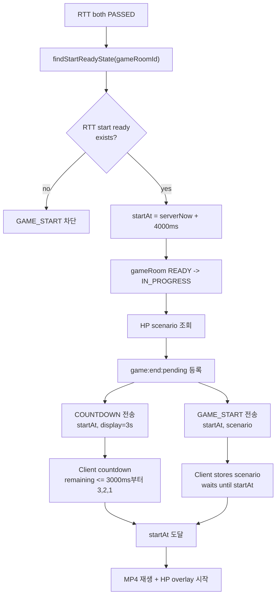
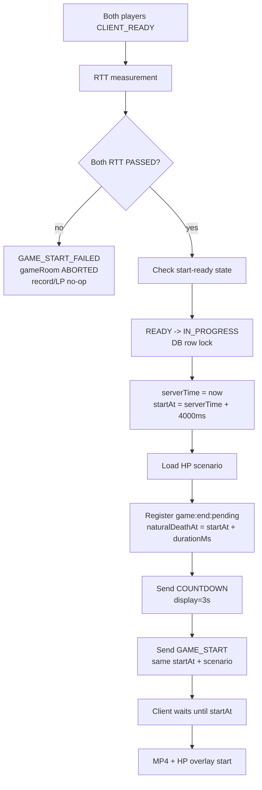
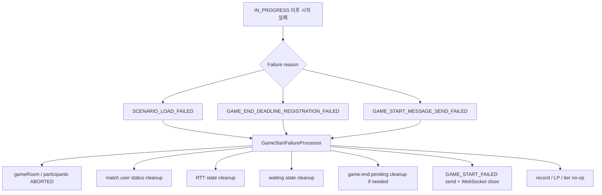

# Issue 46. GAME_START와 HP 시나리오 전달

## 📌 Feature Description

RTT 측정을 통과한 gameRoom을 실제 게임 시작 상태로 전환하고, 양쪽 클라이언트가 같은 서버 기준 시작 시각에 MP4 재생과 HP bar overlay를 시작할 수 있게 한다.

서버는 양쪽 RTT가 모두 `PASSED`인 경우에만 `startAt`을 확정한다. `startAt`은 `serverNow + 4000ms`로 넉넉하게 잡고, 클라이언트는 남은 시간이 3000ms 이하가 되면 `3, 2, 1` countdown을 렌더링한다.

`GAME_START`는 countdown이 끝난 뒤 보내지 않는다. 서버는 `COUNTDOWN`과 `GAME_START`를 미리 전송하고, 클라이언트가 `startAt`까지 기다렸다가 실제 게임을 시작한다.



## 📚 Tasks

### 1. GAME_START 정책 확정

- [x] Step 6은 양쪽 RTT가 모두 `PASSED`이고 median RTT가 저장된 경우에만 진행한다.
- [x] `findStartReadyState(gameRoomId)`가 empty이면 `GAME_START`를 진행하지 않는다.
- [x] 서버 시작 여유 시간은 `startAt = serverNow + 4000ms`로 정의한다.
- [x] 프론트 countdown 표시는 남은 시간이 3000ms 이하일 때 `3, 2, 1`을 렌더링하는 정책으로 정의한다.
- [x] 서버는 `COUNTDOWN`과 `GAME_START`를 countdown 종료 후가 아니라 `startAt` 전에 미리 전송한다.
- [x] MP4 preload 완료 여부는 `CLIENT_READY` 전제로 보고 Step 6에서 다시 검증하지 않는다.

정책 확정 결과:

- `COUNTDOWN`은 시작 예고 메시지다. `startAt`, `serverTime`, `countdownDisplaySeconds=3`을 전달해 클라이언트가 남은 시간 기준으로 카운트다운을 렌더링한다.
- `GAME_START`는 실제 게임 데이터 메시지다. `startAt`과 HP scenario를 전달하지만, 클라이언트는 수신 즉시 시작하지 않고 `startAt`까지 대기한다.
- `COUNTDOWN`과 `GAME_START`는 반드시 같은 `startAt`을 사용한다.
- `startAt`은 서버 기준 현재 시각에서 4000ms 뒤로 잡는다. 일반적인 네트워크 지연이 있어도 프론트가 3초 countdown을 렌더링할 여유를 주기 위한 정책이다.
- 클라이언트가 메시지를 늦게 받으면 `3`이 아니라 `2` 또는 `1`부터 볼 수 있다. 이 경우에도 실제 시작 기준은 `startAt`으로 유지한다.

### 2. 시작 조건 확인

- [x] Redis RTT 상태에서 양쪽 `PASSED`와 median RTT 존재 여부를 조회한다.
- [x] gameRoom 현재 상태가 `READY`인지 확인한다.
- [x] 이미 `IN_PROGRESS`, `ABORTED`, `FINISHED`인 gameRoom은 중복 시작하지 않는다.
- [x] WebSocket local session이 양쪽 모두 존재하는지 확인한다.

구현 결과:

- `GameStartConditionService.checkStartReady(gameRoomId)`로 Step 6 진입 조건을 한 곳에서 확인한다.
- RTT 조건은 `GameRttMeasurementService.findStartReadyState(gameRoomId)` 결과를 기준으로 한다.
- RTT 상태가 없거나 양쪽 `PASSED`와 median RTT가 모두 준비되지 않았으면 `RTT_NOT_READY`로 차단한다.
- DB gameRoom이 `READY`가 아니면 `GAME_ROOM_NOT_READY`로 차단한다. 따라서 이미 `IN_PROGRESS`, `ABORTED`, `FINISHED`인 gameRoom은 중복 시작되지 않는다.
- sticky session 전제에서 local WebSocket registry에 RTT 통과 유저 A/B session이 모두 있어야 시작 가능하다. 둘 중 하나라도 없으면 `WEB_SOCKET_SESSION_NOT_READY`로 차단한다.
- 이 단계는 조건 확인만 담당한다. `READY -> IN_PROGRESS`, `COUNTDOWN`, `GAME_START` 전송은 이후 task에서 처리한다.

### 3. HP scenario payload 확정

- [x] 기존 gameRoom scenario 저장 구조를 확인한다.
- [x] `GAME_START` payload에 포함할 HP scenario 구조를 정의한다.
- [x] 클라이언트가 `startAt` 기준으로 HP bar overlay를 계산할 수 있게 필요한 값만 전달한다.
- [x] MP4는 배경으로만 사용하고, HP 변화는 scenario와 `startAt` 기준으로 계산한다.

구현 결과:

- HP scenario 원본은 gameRoom 생성 시 저장되는 `GameRoom.scenarioData`를 사용한다.
- Core에는 저장된 scenario를 읽기 위한 `GameRoomReadService.getScenarioData(gameRoomId)`만 추가했다.
- API 계층에서는 `GameStartScenarioPayload`로 WebSocket payload에 실을 형태를 확정했다.
- Payload는 `dragonMaxHp`, `durationMs`, `hpTimeline`만 포함한다.
- `hpTimeline`의 각 step은 `timeMs`, `hp`로 구성한다.
- 클라이언트는 이후 `GAME_START.startAt`을 기준으로 `elapsedMs = now - startAt`을 계산하고, `hpTimeline`에서 현재 HP를 렌더링한다.
- MP4 preload 여부는 이 단계에서 다시 확인하지 않는다. MP4는 배경 재생이고, HP bar overlay는 scenario payload와 `startAt` 기준으로 계산한다.

### 4. startAt 결정과 상태 전환

- [x] 서버 기준 `serverTime`과 `startAt`을 millisecond timestamp로 확정한다.
- [x] gameRoom을 `READY -> IN_PROGRESS`로 전환한다.
- [x] 상태 전환 성공 이후에만 `COUNTDOWN` / `GAME_START`를 전송한다.
- [x] 상태 전환 실패 시 WebSocket 시작 이벤트를 보내지 않는다.
- [x] 같은 gameRoom의 중복 시작 시도에 대비해 `READY -> IN_PROGRESS` 전환은 DB row lock 기반으로 한 번만 성공하게 보강한다.

구현 결과:

- `GameStartTransitionService.transitionToInProgress(gameRoomId)`에서 시작 조건 확인, `serverTime/startAt` 확정, DB 상태 전환을 순서대로 처리한다.
- 시작 조건은 Step 2의 `GameStartConditionService.checkStartReady(gameRoomId)` 결과를 사용한다.
- `serverTime`은 서버 `Clock` 기준 현재 millisecond timestamp다.
- `startAt`은 `serverTime + 4000ms`로 확정한다.
- DB에는 같은 `startAt`을 `gameRoom.gameStartTime`으로 저장하고, gameRoom은 `READY -> IN_PROGRESS`, participants는 `READY -> PLAYING`으로 전환한다.
- DB 상태 전환은 `GameRoomCommandService.startReadyRoomIfReady(gameRoomId, startTime)`로 처리한다.
- 시작 조건 미충족 또는 DB 상태 전환 실패 시 `started=false`를 반환한다. 이 경우 이후 WebSocket `COUNTDOWN` / `GAME_START` 전송 단계로 진행하지 않는다.
- 이 단계는 상태 전환까지만 담당한다. 실제 `COUNTDOWN` / `GAME_START` 메시지 정의와 전송은 Step 5에서 처리한다.

동시성 보강 결정:

대상 로직은 `gameRoom READY -> IN_PROGRESS` 전환이다. 이 전환은 단순 상태 변경이 아니라, 성공 직후 `COUNTDOWN` / `GAME_START` 전송으로 이어지는 게임 시작 트리거다. 따라서 같은 `gameRoomId`에서 성공 결과는 반드시 한 번만 나와야 한다.

검토한 선택지는 3개다.

| 선택지 | 장점 | 단점 | 판단 |
|---|---|---|---|
| RTT 성공 경로에서 마지막 통과자만 호출 | 불필요한 DB lock 없음. 정상 흐름에서 호출 1회로 깔끔함 | Redis RTT 저장/완료 판별을 원자화해야 함. 현재 `appendSample()`은 lock/Lua 없이 HASH read-modify-write 구조라 추가 변경 범위가 큼. 이후 retry/scheduler 등 다른 시작 트리거가 생기면 다시 방어 필요 | 단독 방어로는 부족 |
| 조건부 update `UPDATE ... WHERE status=READY` | DB 레벨 원자성 강함. 성능 가볍고 명확함 | `GameRoom.start()` 도메인 메서드를 우회함. `game_rooms`와 `game_participants`를 각각 update해야 해서 상태 전이 규칙이 repository query로 분산됨 | 가능하지만 현재 도메인 구조와 덜 맞음 |
| 비관락 `SELECT ... FOR UPDATE` 후 `GameRoom.start()` | `GameRoom.start()` 도메인 규칙 유지. participants `PLAYING` 전환도 한 곳에서 처리. 같은 room 동시 시작 시 한 트랜잭션만 `READY`를 보고 성공. 변경 범위 작음 | 같은 gameRoom에 동시 요청이 있으면 후행 요청이 짧게 대기. DB lock 비용 있음 | 현재 구조에 가장 적합 |

비관락을 선택하는 이유:

- 현재 시작 규칙은 `GameRoom.start(startTime)`에 모여 있다.
  - gameRoom이 `READY`인지 검증
  - participant가 2명인지 검증
  - participants가 모두 `READY`인지 검증
  - gameRoom을 `IN_PROGRESS`로 변경
  - participants를 `PLAYING`으로 변경
- 조건부 update를 쓰면 이 규칙 일부가 JPQL update로 흩어진다.
- 특히 `game_participants` 상태 전환까지 별도 update가 필요해지고, 도메인 메서드가 가진 검증 흐름을 우회한다.
- 반면 비관락은 조회만 잠그고, 실제 상태 변경은 기존 도메인 메서드에 맡긴다.
- 따라서 코드베이스의 "상태 변경은 도메인 메서드를 통해 수행" 컨벤션과 가장 잘 맞는다.

lock 비용 판단:

- lock 대상은 전체 매칭 큐나 유저 단위가 아니라 단일 `game_rooms` row다.
- lock 안에서는 상태 확인과 엔티티 필드 변경만 수행한다.
- 외부 API 호출, WebSocket 전송, Redis Pub/Sub 전송은 lock 안에서 하지 않는다.
- 일반적인 게임 플로우에서는 gameRoom당 시작 전환은 한 번이므로 경합 빈도도 낮다.

구현 방향:

- `GameRoomRepository.findByIdForUpdate(gameRoomId)`를 추가했다.
- `@Lock(LockModeType.PESSIMISTIC_WRITE)` 방식으로 gameRoom row를 잠근다.
- `GameRoomCommandService.startReadyRoomIfReady(gameRoomId, startTime)`는 locked 조회 후 기존 `GameRoom.start(startTime)`을 호출한다.
- Step 5 전송 단계는 `transitionResult.started() == true`일 때만 `COUNTDOWN` / `GAME_START`를 전송한다.

### 5. WebSocket 메시지 정의 및 전송

- [x] server message `COUNTDOWN`을 정의한다.
- [x] `COUNTDOWN` payload에 `gameRoomId`, `serverTime`, `startAt`, `countdownDisplaySeconds=3`을 포함한다.
- [x] server message `GAME_START`를 정의한다.
- [x] `GAME_START` payload에 `gameRoomId`, `serverTime`, `startAt`, `scenario`를 포함한다.
- [x] 두 메시지는 같은 `startAt`을 사용한다.
- [x] 클라이언트는 `GAME_START`를 받더라도 즉시 시작하지 않고 `startAt`까지 대기한다.

구현 결과:

- `GameWebSocketMessageType`에 server message `COUNTDOWN`, `GAME_START`를 추가했다.
- `GameWebSocketServerMessage.countdown(...)` factory를 추가했다.
  - payload: `gameRoomId`, `serverTime`, `startAt`, `countdownDisplaySeconds`
- `GameWebSocketServerMessage.gameStart(...)` factory를 추가했다.
  - payload: `gameRoomId`, `serverTime`, `startAt`, `scenario`
- `GameStartConstants.COUNTDOWN_DISPLAY_SECONDS = 3`으로 countdown 표시 시간을 상수화했다.
- `GameStartWebSocketSender.sendStart(...)`에서 같은 `serverTime`과 `startAt`으로 `COUNTDOWN`을 먼저 broadcast하고, 이어서 `GAME_START`를 broadcast한다.
- `GameWaitingWebSocketService.handleRttPong(...)`는 RTT sample 저장이 완료되고 해당 유저가 `PASSED`인 경우에만 game start 시도를 수행한다.
- game start 시도는 다음 순서로 진행한다.
  1. `GameStartTransitionService.transitionToInProgress(gameRoomId)`로 Step 4 시작 전환을 수행한다.
  2. `transitionResult.started() == true`인 경우에만 HP scenario payload를 조회한다.
  3. `GameEndScheduleService.registerEndDeadline(...)`로 종료 정산 deadline을 등록한다.
  4. `GameStartWebSocketSender.sendStart(...)`로 `COUNTDOWN` / `GAME_START`를 전송한다.
  5. 시작 조건 미충족 또는 DB 상태 전환 실패는 아직 유효 게임 시작 전 no-op으로 차단한다.
  6. `IN_PROGRESS` 전환 이후 scenario 조회, deadline 등록, 시작 메시지 전송 실패는 `GameStartFailureProcessor`에 위임한다.
- `GAME_START` payload의 `startAt`은 실제 게임 시작 기준 시각이다. 클라이언트는 이 메시지를 수신해도 즉시 시작하지 않고 `startAt`까지 대기한다.

### 6. game end timer/scheduler 등록 지점 정의

- [x] `GAME_START` 확정 시 서버 기준 game end deadline을 등록한다.
- [x] SMITE 미입력, 정상 종료, timeout 종료 흐름에서 재사용할 수 있게 등록 지점을 분리한다.

정책:

- 최초 자연사 deadline은 `naturalDeathAt = startAt + scenario.durationMs`로 계산한다.
- 정산 대상 조회 시작 시각은 `naturalDeathAt`으로 등록한다.
- 한 명만 LIGHTNING을 사용했고 처치하지 못한 경우 effective HP 기준으로 더 빠른 `naturalDeathAt`을 계산해 score를 앞당길 수 있다.
- LIGHTNING 판정 시각은 RTT 보정 없이 `serverReceiveTime - gameStartTime`을 사용한다.
- 고정 25초 같은 값은 실제 정산 deadline으로 쓰지 않는다. 필요하면 cleanup TTL 같은 안전장치에서 별도로 검토한다.

구현 결과:

- `GameEndScheduleService.registerEndDeadline(gameRoomId, startAtMillis, durationMs)`에서 `naturalDeathAtMillis`를 계산한다.
- `GameEndScheduleStore` port를 추가해 종료 정산 등록 책임을 분리했다.
- `RedisGameEndScheduleStore`는 `game:end:pending` ZSET에 `member=gameRoomId`, `score=naturalDeathAtMillis`로 등록한다.
- `RedisGameEndScheduleStore.cleanupEndDeadline(gameRoomId)`로 deadline 등록 실패 또는 시작 메시지 전송 실패 시 남아 있을 수 있는 deadline을 제거한다.
- `GameWaitingWebSocketService`는 `transitionResult.started() == true` 이후, `COUNTDOWN` / `GAME_START` 전송 전에 종료 deadline을 등록한다.
- deadline 등록이 실패하면 이미 `IN_PROGRESS`로 전환된 gameRoom을 `ABORTED`로 보상 전환하고 시작 메시지를 보내지 않으며 `game:end:pending` cleanup을 시도한다.
- 이 abort는 서버가 game end scheduler 기반 종료를 보장할 수 없는 인프라 실패로 보며, game record와 LP/티어 변동은 반영하지 않는다.

### 7. 실패/예외 처리

- [x] RTT start ready 상태가 없으면 시작 차단한다.
- [x] scenario 조회 실패 시 시작된 gameRoom을 `ABORTED` 처리하고 상태 저장소를 정리한다.
- [x] gameRoom 상태 전환 실패 시 아직 시작 전 실패로 보고 시작 메시지를 보내지 않는다.
- [x] WebSocket 전송 실패 시 `ABORTED` 처리하고 이미 등록된 game end deadline을 제거한다.
- [x] game end deadline 등록 실패는 `IN_PROGRESS` 이후 실패지만 서버 종료 보장 불가 상태이므로 `ABORTED` 처리하고 record/LP를 반영하지 않는다.
- [x] 시작 실패가 GAME_START 이전 실패인지, 이미 IN_PROGRESS 이후 실패인지 구분한다.

구현 결과:

- `GameStartFailureReason`으로 시작 실패 사유를 분리했다.
- `GameStartFailureProcessor`가 `IN_PROGRESS -> ABORTED` 보상, match user status 제거, RTT 상태 cleanup, waiting 상태 cleanup, `GAME_START_FAILED` 전송/close를 담당한다.
- `GAME_END_DEADLINE_REGISTRATION_FAILED`와 `GAME_START_MESSAGE_SEND_FAILED`는 모두 `game:end:pending`에서도 gameRoom 제거를 시도한다.
- RTT 상태 조회가 실패해도 DB abort와 실패 이벤트 전송을 먼저 보장한다.
- 실패 상태 저장소 cleanup은 개별 best-effort로 수행하고 실패 시 로그를 남긴다.

### 8. 테스트

- [x] 양쪽 RTT `PASSED`이면 `startAt`이 `serverNow + 4000ms` 기준으로 생성되는지 검증한다.
- [x] RTT 상태가 없거나 한쪽이라도 `PASSED`가 아니면 시작하지 않는지 검증한다.
- [x] gameRoom `READY -> IN_PROGRESS` 전환을 검증한다.
- [x] `COUNTDOWN`과 `GAME_START`가 같은 `startAt`을 사용하는지 검증한다.
- [x] `GAME_START` payload에 HP scenario가 포함되는지 검증한다.
- [x] 이미 시작된 gameRoom의 중복 시작을 방지하는지 검증한다.
- [x] scenario 조회 실패, deadline 등록 실패, 시작 메시지 전송 실패가 `GameStartFailureProcessor`로 위임되는지 검증한다.
- [x] 시작 실패 보상 처리에서 gameRoom abort, match status 제거, RTT/waiting cleanup, 실패 이벤트 전송, deadline cleanup을 검증한다.

### 9. 문서

- [x] Step 1 정책 확정 내용(`startAt = serverNow + 4000ms`, 프론트 3초 countdown, `COUNTDOWN`/`GAME_START` 사전 전송)을 관련 문서에 선반영한다.
- [x] 구현 완료 후 `policy.md`를 실제 구현 결과와 맞춘다.
- [x] 구현 완료 후 `domain status.md`의 `READY -> IN_PROGRESS` 전이를 실제 구현 결과와 맞춘다.
- [x] 구현 완료 후 `flow status.md`의 RTT 통과 후 `COUNTDOWN` / `GAME_START` 흐름을 실제 구현 결과와 맞춘다.
- [x] 구현 완료 후 `websocket client.md`의 메시지 payload와 클라이언트 처리 정책을 실제 구현 결과와 맞춘다.
- [x] 구현 완료 후 `plan-checkpoint.md` Step 6 상태를 구현 결과와 맞춘다.

## ✅ 완료 기준

- RTT 양쪽 `PASSED`인 gameRoom만 `GAME_START`로 진입할 수 있다.
- 서버가 `startAt = serverNow + 4000ms`로 같은 시작 시각을 확정한다.
- 클라이언트는 남은 시간이 3000ms 이하일 때 `3, 2, 1` countdown을 렌더링한다.
- 서버는 `COUNTDOWN`과 `GAME_START`를 `startAt` 전에 미리 전송한다.
- gameRoom은 `READY -> IN_PROGRESS`로 전환된다.
- `GAME_START` payload로 HP scenario가 전달된다.
- 클라이언트는 `startAt` 기준으로 MP4 재생과 HP overlay를 시작할 수 있다.

## 📝 Note

- `COUNTDOWN`은 시작 예고 메시지이고, `GAME_START`는 실제 게임 데이터 전달 메시지다.
- `GAME_START`를 countdown 종료 후 보내면 네트워크 지연 때문에 실제 시작이 늦어질 수 있으므로 미리 전송한다.
- `COUNTDOWN`과 `GAME_START`는 반드시 같은 `startAt`을 사용한다.
- Step 6에서 MP4 preload 여부는 다시 확인하지 않는다. `CLIENT_READY`가 preload 완료 전제다.

---

## PR

## 📌 Summary

RTT 측정을 통과한 gameRoom을 서버 기준 동일한 `startAt`으로 시작시키기 위해 GAME_START 진입 흐름을 연결했습니다.

핵심 흐름은 `READY -> IN_PROGRESS` 전환, HP scenario 조회, game end deadline 등록, `COUNTDOWN`/`GAME_START` 사전 전송입니다. 시작 확정 중 실패가 발생하면 유효한 게임으로 방치하지 않고 `ABORTED` 보상 처리하며, record/LP/tier는 반영하지 않습니다.



## 📚 Changes

- `GameStartConditionService`에서 GAME_START 진입 조건을 한 곳에서 확인하도록 분리했습니다.
  - RTT 양쪽 `PASSED`
  - gameRoom `READY`
  - 양쪽 WebSocket session connected
- `GameStartTransitionService`에서 `startAt = serverNow + 4000ms`를 확정하고 `READY -> IN_PROGRESS` 전환을 수행했습니다.
- `READY -> IN_PROGRESS` 전환은 DB row lock 기반으로 한 번만 성공하게 했습니다.
  - 양쪽 RTT가 거의 동시에 완료되면 서로 다른 WebSocket 처리 스레드가 같은 gameRoom에 대해 시작을 시도할 수 있습니다.
  - 이때 `findByIdForUpdate(gameRoomId)`로 gameRoom row를 잠그고, lock을 획득한 트랜잭션만 `READY` 여부를 확인한 뒤 `IN_PROGRESS`로 전환합니다.
  - 뒤늦게 lock을 얻은 요청은 이미 `READY`가 아니므로 `started=false`로 종료되고, `COUNTDOWN`/`GAME_START`/deadline 등록까지 이어지지 않습니다.
- `COUNTDOWN`, `GAME_START` WebSocket server message를 정의했습니다.
- `COUNTDOWN`과 `GAME_START`는 countdown 종료 후가 아니라 `startAt` 전에 미리 전송하며, 반드시 같은 `startAt`을 사용합니다.
- `GAME_START` payload에 HP scenario를 포함했습니다.
- `GAME_START` 확정 시 game end deadline을 Redis ZSET에 등록합니다.

```text
naturalDeathAt = startAt + scenario.durationMs
ZADD game:end:pending naturalDeathAtMillis gameRoomId
```

- `GameStartFailureProcessor`를 추가해 `IN_PROGRESS` 이후 시작 실패 보상 처리를 분리했습니다.
  - gameRoom/participants `ABORTED`
  - match user status cleanup
  - RTT state cleanup
  - waiting state cleanup
  - 필요 시 `game:end:pending` cleanup
  - `GAME_START_FAILED` 전송 후 WebSocket close



## 📝 Note

- `startAt`은 클라이언트 로컬 시간이 아니라 서버 시간이 기준입니다. 메시지 수신 시각이 달라도 양쪽 클라이언트가 같은 기준 시각에 시작해야 하기 때문입니다.
- `COUNTDOWN`과 `GAME_START`를 미리 보내는 이유는 countdown 종료 후 전송하면 네트워크 지연 때문에 실제 시작이 늦어질 수 있기 때문입니다.
- `READY -> IN_PROGRESS`는 단순 상태 변경이 아니라 이후 메시지 전송과 deadline 등록으로 이어지는 시작 트리거입니다. 따라서 같은 gameRoom에서 성공 결과가 한 번만 나와야 하며, DB row lock을 선택했습니다.
  - Redis RTT 결과만 보고 “마지막 PONG을 처리한 요청이 시작까지 처리한다”로 둘 수도 있습니다. 하지만 그렇게 하면 RTT 저장 로직이 게임 시작까지 결정하게 되고, DB gameRoom 상태는 뒤늦게 따라가는 구조가 됩니다. 이번 흐름에서는 게임 시작 여부를 DB gameRoom 상태로 판단하는 편이 더 명확합니다.
  - 애플리케이션 메모리 lock은 구현은 쉽지만, API 서버가 2대 이상이면 각 서버가 자기 메모리 lock만 보기 때문에 같은 gameRoom 시작을 동시에 처리할 수 있습니다.
  - 조건부 update(`where status = READY`)도 가능하지만, update 결과만으로는 엔티티의 `start()` 도메인 메서드 흐름이 약해지고, 이후 `startAt`, participant 상태, 메시지 전송, deadline 등록을 다시 조합해야 합니다.
  - DB row lock은 같은 gameRoom row 하나만 짧게 잠급니다. 먼저 lock을 잡은 요청만 `READY -> IN_PROGRESS`를 성공시키고, 나중 요청은 이미 `READY`가 아니므로 바로 중단됩니다. 그래서 시작 메시지와 deadline 등록도 한 번만 이어집니다.
  - lock 범위는 `READY -> IN_PROGRESS` 전환까지만 잡습니다. scenario 조회, Redis deadline 등록, WebSocket 전송까지 lock 안에 넣으면 외부 I/O 동안 DB row를 오래 잠그게 됩니다. 대신 전환 이후 실패는 `GameStartFailureProcessor`가 `ABORTED`로 보상합니다.
- game end deadline은 고정 25초가 아니라 scenario duration 기준으로 계산합니다. 실제 스타 코어 자연사 시각은 scenario가 표현하므로, 고정값은 정산 deadline이 아니라 cleanup TTL 같은 안전장치에서 다루는 편이 맞습니다.
- `naturalDeathAt`은 정산 완료 시각이 아니라 scheduler가 해당 gameRoom을 정산 대상으로 집기 시작할 수 있는 시각입니다. scheduler는 이 시각 이후 gameRoom을 다시 조회하고, 이미 `IN_PROGRESS`가 아니면 no-op 처리해야 합니다.
- 클라이언트 MP4 재생 지연, 브라우저 pause, 렌더링 지연은 서버의 종료 기준을 바꾸지 않습니다. 서버는 `startAt + scenario.durationMs`를 논리적 종료 시각으로 사용하고, 클라이언트 화면은 서버가 내려준 `startAt`과 scenario를 따라가는 표시 계층으로 봅니다.
- deadline 등록 실패도 `game:end:pending` cleanup을 시도합니다. Redis write가 일부 반영된 뒤 예외가 발생할 수 있고, ZSET remove는 대상이 없어도 no-op이라 방어적으로 처리하는 편이 안전합니다.
- `IN_PROGRESS` 이후 시작 실패는 이미 유효 게임에 가까운 상태이므로 단순 return 하지 않고 `ABORTED`로 보상 처리합니다. 다만 이 경우 record/LP/tier는 반영하지 않습니다.

| 실패 지점 | 상태 | 정책 |
|---|---|---|
| RTT not ready | GAME_START 이전 | 시작 차단, 메시지 미전송 |
| gameRoom not READY | GAME_START 이전 | 시작 차단, 메시지 미전송 |
| scenario 조회 실패 | IN_PROGRESS 이후 | ABORTED, 상태 저장소 cleanup, GAME_START_FAILED |
| game:end:pending 등록 실패 | IN_PROGRESS 이후 | ABORTED, deadline cleanup 시도, 상태 저장소 cleanup, GAME_START_FAILED |
| COUNTDOWN 성공 후 GAME_START 전송 실패 | deadline 등록 이후 | ABORTED, deadline cleanup, 상태 저장소 cleanup, GAME_START_FAILED |
| cleanup 일부 실패 | 시작 실패 보상 중 | 다음 cleanup 계속 진행, 단계별 warn log 기록 |

## 📌 Related Issue
- Closes #46
