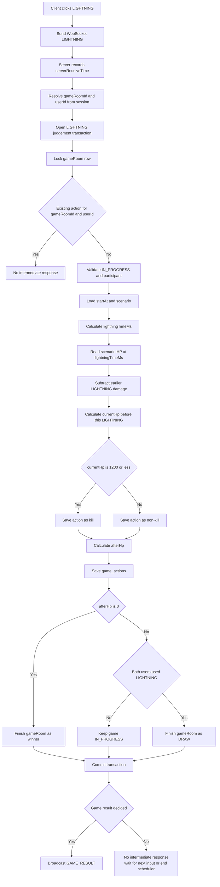
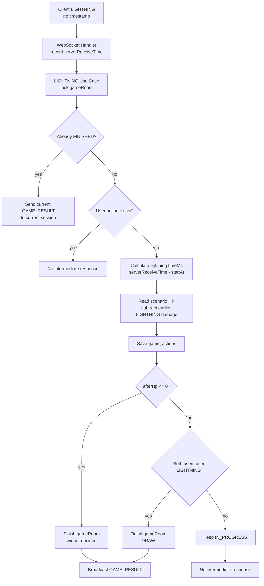
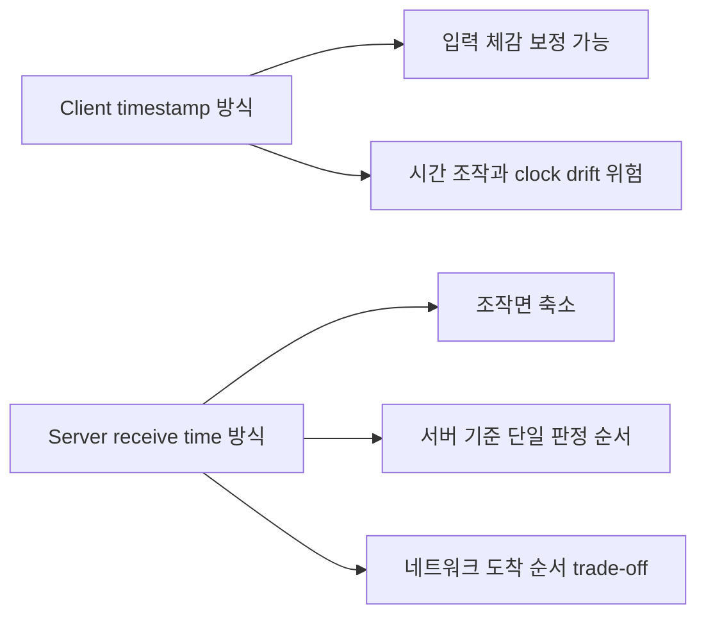
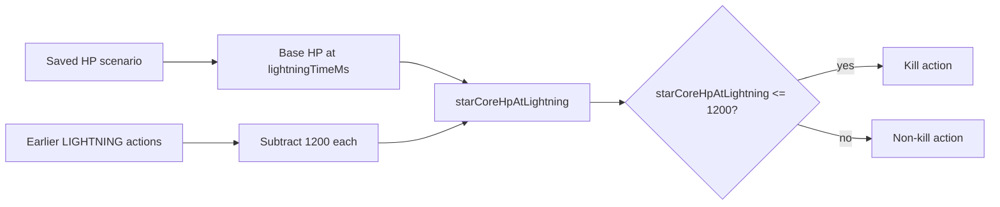
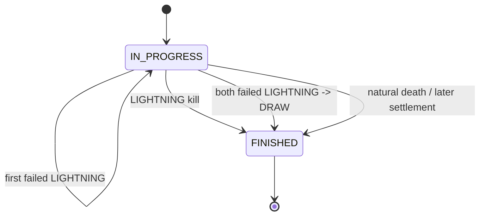

# Issue 48. LIGHTNING 입력과 서버 판정

## 📌 Feature Description

`GAME_START` 이후 클라이언트가 보낸 `LIGHTNING` WebSocket 메시지를 서버가 수신하고, 서버 기준 수신 시각으로 입력 시각을 계산해 `game_actions`에 저장한다.

클라이언트는 시간 정보를 보내지 않는다. 서버는 WebSocket 메시지를 받은 순간의 `serverReceiveTime`만 신뢰하고, `lightningTimeMs = serverReceiveTime - startAt`으로 게임 시작 기준 입력 시각을 계산한다. RTT 측정은 `GAME_START` 전 연결 품질 검사에만 사용하고, LIGHTNING 판정 보정에는 사용하지 않는다.

LIGHTNING 정책값은 고정이다.

| 정책 | 값 |
|---|---|
| 스타 코어 초기 HP | `10,000` |
| LIGHTNING 데미지 | `1,200` |
| 킬 성공 조건 | LIGHTNING 적용 전 현재 HP가 `1,200` 이하 |
| 사용 횟수 | 유저당 게임당 1회 |
| 입력 채널 | gameRoom WebSocket |

HP 판정은 단순히 scenario HP만 보지 않는다. 같은 gameRoom에서 이미 더 이른 시점에 반영된 LIGHTNING이 있으면, 그 LIGHTNING이 킬 실패였더라도 `1,200` 데미지를 현재 HP에서 차감한다.

LIGHTNING 적용 후 HP가 `0` 이하가 되면 해당 action은 스타 코어 처치 action이다. 서버는 같은 DB transaction 안에서 action 저장과 gameRoom 결과 확정을 끝내고, commit 이후 최종 `GAME_RESULT`만 WebSocket으로 반환한다. 같은 순간 두 사용자가 LIGHTNING을 누르는 경합은 서버 수신 시각 기준으로 처리하고, 동률은 `id` 순서로 결정한다.

두 유저가 모두 LIGHTNING을 사용했고 어느 action도 처치하지 못했다면 더 들어올 LIGHTNING 입력은 없다. 이 경우 남은 HP 재생을 끝까지 기다리지 않고 같은 transaction에서 `DRAW`로 확정한다. 클라이언트는 `GAME_RESULT` 수신 즉시 게임 UI를 종료한다.

시나리오는 gameRoom 생성 시 서버가 먼저 만든다. 정책 기준으로 스타 코어는 `8~17초` 중 서버가 고른 duration 안에서 자연사해야 하며, HP는 1초 단위 선형 감소가 아니라 랜덤하게 스타 코어가 공격받는 것처럼 burst 구간을 포함해 감소해야 한다. LIGHTNING 판정은 새 시나리오를 만들지 않고 이미 저장된 `gameRoom.scenarioData`와 `startAt`을 기준으로 계산한다.

### Feature Flow

이번 이슈는 LIGHTNING 입력을 서버 판정 가능한 액션으로 저장하고, 최종 결과가 확정된 경우에만 WebSocket으로 `GAME_RESULT`를 응답하는 범위까지 다룬다. LIGHTNING으로 스타 코어 HP가 `0` 이하가 되면 즉시 `game_rooms.status=FINISHED`와 승패 결과를 확정하고 `GAME_RESULT`를 전송한다. 두 유저가 모두 LIGHTNING을 사용하고도 처치하지 못하면 즉시 `DRAW`로 확정한다. record/LP 반영은 이후 game end settlement 또는 record 처리 흐름에서 처리한다.

## 📚 Tasks

### 1. LIGHTNING 정책과 저장 의미 확정

- [x] `STAR_CORE_INITIAL_HP = 10000`, `LIGHTNING_DAMAGE = 1200` 정책을 코드 상수와 문서 기준으로 맞춘다.
- [x] `star_core_hp_at_lightning`는 scenario 원본 HP가 아니라, 이전 LIGHTNING 데미지를 반영한 LIGHTNING 적용 전 현재 HP로 정의한다.
- [x] 킬 실패한 LIGHTNING도 이후 판정 HP에서 `1200` 데미지로 반영한다.
- [x] `is_kill=true`는 LIGHTNING 적용 전 현재 HP가 `1200` 이하였다는 의미로 정의한다.
- [x] `afterHp = max(0, starCoreHpAtLightning - 1200)`은 응답 payload에서 계산해 전달하고 DB에는 저장하지 않는다.
- [x] LIGHTNING 판정은 RTT 보정 없이 서버 수신 시각 기준으로 처리한다.
- [x] LIGHTNING으로 스타 코어 HP가 `0` 이하가 되면 gameRoom 승패 결과를 즉시 확정한다.
- [x] record/LP 반영은 이번 이슈에서 하지 않고 game end settlement 또는 record 처리 흐름에서 처리한다.

### 2. WebSocket 메시지 정의

- [x] client message `LIGHTNING`를 `GameWebSocketMessageType`에 추가한다.
- [x] `LIGHTNING` payload 계약에는 클라이언트 timestamp를 포함하지 않는다.
- [x] LIGHTNING 중간 응답 message는 두지 않고 최종 결과는 `GAME_RESULT`로만 전달한다.
- [x] server message `GAME_RESULT`를 정의한다.
- [x] `GAME_RESULT` payload에는 `gameRoomId`, `result`, `winnerUserId`, `reason`, `finishedAt`, `actions` 요약을 포함한다.
- [x] LIGHTNING으로 스타 코어 HP가 `0` 이하가 되면 양쪽 클라이언트에 `GAME_RESULT`를 브로드캐스트한다.
- [x] 두 유저가 모두 LIGHTNING을 사용하고 처치하지 못하면 즉시 `DRAW GAME_RESULT`를 양쪽 클라이언트에 브로드캐스트한다.
- [x] 잘못된 payload, 게임 상태 불일치, 참가자 아님 등은 기존 `ERROR` 메시지 구조로 응답한다.

### 3. WebSocket handler 연결

- [x] `GameWebSocketClientMessage`에 `isLightning()` 판별 메서드를 추가한다.
- [x] `GameWaitingWebSocketHandler.handleTextMessage(...)`에서 `LIGHTNING` 메시지를 `GameWaitingWebSocketService`로 위임한다.
- [x] 서버는 `LIGHTNING` 메시지 수신 직후 `Clock` 기준 `serverReceiveTime`을 기록한다.
- [x] `LIGHTNING`는 기존 gameRoom WebSocket 경로에서 수신한다.
- [x] `GAME_START` 이후 상태 검증은 LIGHTNING 판정 service 구현에서 처리한다.

### 4. 패키지 책임 분리

- [x] `league-of-star-api/game/lightning` 패키지를 추가해 LIGHTNING 입력 use-case를 분리한다.
  - `common/constant`: API 레벨 LIGHTNING 상수
  - `domain`: LIGHTNING 처리 결과, 실패 사유, 결과 확정 여부 등 use-case 값 객체
  - `dto`: WebSocket 응답 payload
  - `service`: `GameLightningService`, `GameLightningWebSocketSender`
- [x] `league-of-star-api/game/websocket`은 메시지 수신/전송 경로만 담당하고, 판정 로직은 `game/lightning/service`로 위임한다.
- [x] `league-of-star-core/domain/game`에는 DB 상태와 도메인 규칙을 둔다.
  - `GameAction` 생성/조회
  - `GameActionRepository` 조회 메서드
  - `GameActionCommandService`, `GameActionReadService` 추가 여부 검토
- [x] gameRoom `FINISHED` 전환은 core의 `GameRoom` 도메인 메서드와 command service를 통해 수행한다.
- [x] LIGHTNING 패키지는 `game:end:pending` Redis ZSET을 직접 다루지 않는다.
- [x] record/LP 반영은 LIGHTNING 패키지가 담당하지 않는다.
- [x] RTT 측정 결과는 LIGHTNING 판정에서 조회하지 않는다. RTT는 `GAME_START` 전 품질 검사에만 사용한다.

### 5. RTT 로직 단순화

- [x] RTT 측정은 `GAME_START` 전 품질 gate로만 유지한다.
  - `RTT_PING` / `RTT_PONG`
  - 5회 sample 수집
  - median 계산으로 `RTT_LIMIT_MILLIS` 초과 여부 판단
  - 양쪽 `PASSED`일 때만 `GAME_START` 진행
- [x] RTT median을 LIGHTNING 판정용 값으로 노출하지 않는다.
- [x] `GameRttStartReadyState`에서 `userAMedianRttMs`, `userBMedianRttMs`, `medianRttMillis(userId)`를 제거한다.
- [x] `findStartReadyState(...)`는 양쪽 `PASSED` 여부와 참가자 userId만 반환하도록 단순화한다.
- [x] Redis `game:rtt:{gameRoomId}`에 median 값을 저장하지 않거나, 저장하더라도 로그/진단용으로만 취급하고 service contract에서 제거한다.
- [x] `GameAction.rttMs`와 `game_actions.rtt_ms` 컬럼은 제거한다.
- [x] `GAME_RESULT` payload에 RTT 값을 포함하지 않는다.
- [x] `GameLightningService`는 `GameRttMeasurementService` / `GameRttMeasurementStore`에 의존하지 않는다.
- [x] RTT cleanup은 기존처럼 `GAME_START_FAILED`, `GAME_START` 이후 시작 처리 완료, abort/finish cleanup 경로에서 수행한다.

### 6. 멱등성과 중복 입력 보장

- [x] `game_actions`의 `UNIQUE(game_room_id, user_id)` 제약을 최종 방어선으로 사용한다.
- [x] 서비스 진입 시 `gameRoomId + userId`로 기존 LIGHTNING action을 먼저 조회한다.
- [x] 기존 action이 있으면 새로 판정하지 않고 중간 응답 없이 처리한다.
- [x] 동시에 같은 유저의 LIGHTNING이 두 번 들어와 unique 충돌이 발생하면 기존 action을 다시 조회해 멱등 처리하되 중간 응답은 보내지 않는다.
- [x] 클라이언트는 버튼 클릭 즉시 LIGHTNING 버튼을 비활성화하는 정책을 문서에 반영한다.

### 7. 동시성 제어와 판정 순서

- [x] 같은 gameRoom의 LIGHTNING 판정은 `game_rooms` row lock 안에서 처리한다.
- [x] lock 안에서 gameRoom 상태 검증과 기존 action 조회를 수행한다.
- [x] lock 안에서 HP 계산과 action 저장을 수행한다.
- [x] WebSocket 전송은 DB transaction 이후 수행한다.
- [x] 서로 다른 유저가 동시에 LIGHTNING을 보내도 이전 LIGHTNING 데미지 반영 순서가 깨지지 않게 한다.
- [x] LIGHTNING action 정렬 기준은 `serverReceiveTimeMs ASC`, 그래도 같으면 `id ASC`로 정의하고 조회 메서드를 준비한다.
- [x] `lightningTimeMs`는 `serverReceiveTimeMs - startAtMillis`로 계산되므로 winner 정렬과 같은 서버 수신 기준을 따른다.
- [x] 두 유저가 거의 동시에 LIGHTNING을 누른 경우도 서버 수신 기준으로 winner를 결정한다.
- [x] 처치 action 발생 시 일반 end scheduler의 `naturalDeathAt`까지 기다리지 않는다.
- [x] 처치 action 발생 시 같은 transaction 흐름에서 즉시 결과 확정을 시도한다.
- [x] 결과 확정은 gameRoom row lock 안에서 한 번만 성공하게 한다.

### 8. 랜덤 버스트 HP 시나리오 생성

- [x] 현재 `GameRoomCommandService.createDefaultScenario(...)`의 1초 단위 선형 감소 로직을 제거한다.
- [x] gameRoom 생성 시 `8~17초` 범위에서 duration을 먼저 정하고, 해당 duration 안에서 HP가 `10000 -> 0`에 도달하는 scenario를 생성한다.
- [x] HP timeline은 랜덤 burst 패턴으로 생성한다.
  - 스타 코어가 공격받지 않는 짧은 정체 구간을 허용한다.
  - 한 번에 크게 깎이는 burst 구간을 허용한다.
  - 전체적으로 HP는 증가하지 않고 감소 또는 유지되어야 한다.
  - 마지막 step은 반드시 `timeMs = durationSeconds * 1000`, `hp = 0`이어야 한다.
- [x] scenario step 간격은 클라이언트 표시와 서버 판정이 같이 사용할 수 있도록 충분히 촘촘하게 정의한다.
  - `200ms` 단위 step으로 확정했다.
- [x] 랜덤 생성 결과가 정책을 깨지 않도록 보정한다.
  - 첫 step은 `timeMs = 0`, `hp = 10000`
  - 모든 step의 `timeMs`는 오름차순
  - 모든 step의 `hp`는 `0~10000`
  - HP는 이전 step보다 커질 수 없음
  - 마지막 step에서 `hp=0`에 도달하도록 누적 damage weight를 보정한다.
- [x] 시나리오 생성 책임은 `league-of-star-core/domain/game/service/GameScenarioGenerator`로 분리한다.
  - `GameRoomCommandService`는 generator를 호출해 gameRoom 생성 흐름만 조립한다.
  - WebSocket/API 계층에서는 scenario 생성 로직을 갖지 않는다.

### 9. HP 계산과 LIGHTNING 판정 구현

- [x] `lightningTimeMs = serverReceiveTimeMs - startAtMillis`로 계산한다.
- [x] `serverReceiveTimeMs`와 `startAtMillis`는 로컬 타임존 시간이 아니라 UTC `Instant` 기반 epoch milliseconds로 맞춘다.
- [x] RTT median은 LIGHTNING 판정 계산에 사용하지 않는다.
- [x] `lightningTimeMs`가 scenario 범위를 벗어나는 경우의 처리 정책을 정의한다.
  - 시작 전 입력 또는 `lightningTimeMs < 100` 입력은 무효 처리
  - 자연사 이후 입력은 저장하지 않고 후속 종료 정산 흐름에서 현재 gameRoom 결과 기준으로 처리
- [x] scenario에서 `lightningTimeMs` 시점의 base HP를 계산한다.
  - HP timeline step 사이 입력은 인접 step 사이를 선형 보간한다.
- [x] scenario는 gameRoom 생성 시 저장된 `scenarioData`를 사용하고, LIGHTNING 입력 시 새로 생성하지 않는다.
- [x] 현재 action보다 앞선 LIGHTNING action 개수만큼 `1200` 데미지를 차감한다.
- [x] `currentHp <= 0`이면 이미 처치된 상태로 보고 킬 실패/무효 처리한다.
- [x] `currentHp <= 1200`이면 `isKill=true`, 아니면 `isKill=false`로 저장한다.
- [x] 킬 실패여도 `afterHp = max(0, currentHp - 1200)`로 계산하고 이후 action 판정에 반영한다.
- [x] `afterHp <= 0`이면 스타 코어 처치 action으로 보고 결과 확정 흐름을 호출한다.

### 10. LIGHTNING 처치 결과 즉시 반환

- [x] LIGHTNING으로 스타 코어 HP가 `0` 이하가 되면 gameRoom row lock 안에서 즉시 `FINISHED` 전환을 시도한다.
- [x] 확정된 결과는 `GameRoom.finish(result, winnerUserId)`를 사용해 저장한다.
- [x] 이미 먼저 처리된 LIGHTNING으로 게임이 `FINISHED`가 되었다면 뒤늦은 LIGHTNING은 저장하지 않고 현재 결과를 반환한다.
- [x] 이미 `FINISHED`인 gameRoom에 늦게 도착한 LIGHTNING은 새 action으로 저장하지 않고 현재 `GAME_RESULT`를 재응답한다.
- [x] `GAME_RESULT` 전송은 transaction commit 이후 수행한다.
- [x] record/LP 반영은 `GAME_RESULT` 전송과 분리하고, 기존 record 처리 정책과 이어지게 둔다.

### 11. 두 유저 LIGHTNING 소모 후 즉시 DRAW 확정

- [x] 두 유저가 모두 LIGHTNING을 사용했고 어느 action도 처치하지 못했다면 더 이상 입력이 들어올 수 없다고 본다.
- [x] 두 번째 실패 LIGHTNING 저장 transaction 안에서 gameRoom을 `DRAW`로 `FINISHED` 처리한다.
- [x] 이 경우 `game:end:pending` score를 변경하거나 별도 scheduler를 추가하지 않는다.
- [ ] 후속 end scheduler 구현 시 기존 `game:end:pending` member가 남아 있어도 이미 `FINISHED`인 gameRoom은 no-op 처리한다.
- [x] 두 유저 LIGHTNING 소모 후 즉시 `DRAW GAME_RESULT`를 브로드캐스트한다.

### 12. GameAction 저장/조회 보강

- [x] `GameActionRepository`에 `findByGameRoomIdAndUserId(...)`를 추가한다.
- [x] `GameActionRepository`에 gameRoom 단위 action 정렬 조회 메서드를 추가한다.
  - 정렬 기준: `serverReceiveTimeMs ASC`, `id ASC`
- [x] `GameAction.lightning(...)` 정적 팩토리로 LIGHTNING action 생성 의미와 `isKill` 계산 기준을 명확히 한다.
- [x] DDL 문서에서 `star_core_hp_at_lightning` 의미를 “이전 LIGHTNING 데미지 반영 후, 이번 LIGHTNING 적용 전 HP”로 명확히 한다.
- [x] DDL 문서에서 `rtt_ms` 컬럼을 제거하고 `lightning_time_ms` 의미를 “서버 수신 시각 기준 게임 시작 후 경과 ms”로 수정한다.
- [x] `game_actions`는 유저당 1회 입력 기록으로 유지하고, record/LP 결과 저장은 `game_records`에서 처리한다.

### 13. 실패/예외 응답

- [x] gameRoom이 `IN_PROGRESS`가 아니고 `FINISHED`도 아니면 LIGHTNING을 거절한다.
- [x] gameRoom이 이미 `FINISHED`이면 현재 gameRoom 결과를 `GAME_RESULT`로 재응답한다.
- [x] userId가 gameRoom participant가 아니면 LIGHTNING을 거절한다.
- [x] scenario 또는 `startAt`이 없으면 LIGHTNING을 거절한다.
- [x] unique 충돌은 중복 입력 실패가 아니라 기존 결과 재응답으로 처리한다.
- [x] 저장 중 복구 불가능한 DB 예외는 `ERROR` 응답으로 내리고 WebSocket 연결은 유지한다.

### 14. 테스트

- [x] gameRoom 생성 시 scenario duration이 항상 `8~17초` 범위인지 검증한다.
- [x] 랜덤 burst scenario가 `10000 -> 0`으로 끝나고 HP가 증가하지 않는지 검증한다.
- [x] 랜덤 burst scenario가 1초 단위 선형 감소로 고정되지 않는지 검증한다.
- [x] `LIGHTNING` client message type과 `GAME_RESULT` server message type 직렬화를 검증한다.
- [x] `LIGHTNING` 수신 시 `serverReceiveTime`을 서버에서 기록하는지 검증한다.
- [x] `lightningTimeMs`가 RTT 보정 없이 `serverReceiveTimeMs - startAtMillis`로 계산되는지 검증한다.
- [x] LIGHTNING 판정 서비스가 RTT service/store에 의존하지 않는지 검증한다.
- [x] RTT start-ready 결과가 median 값 없이 양쪽 `PASSED`만으로 GAME_START 진행 조건을 판단하는지 검증한다.
- [x] scenario HP에서 이전 LIGHTNING 데미지를 차감해 current HP를 계산하는지 검증한다.
- [x] HP `1200` 이하이면 킬 성공, 초과이면 킬 실패로 저장하는지 검증한다.
- [x] 킬 실패한 LIGHTNING도 이후 action의 HP 계산에 `1200` 데미지로 반영되는지 검증한다.
- [x] 같은 유저 중복 LIGHTNING은 기존 결과를 재응답하는지 검증한다.
- [x] 같은 유저 동시 LIGHTNING unique 충돌도 멱등 응답으로 처리되는지 검증한다.
- [x] 서로 다른 두 유저 LIGHTNING 처리 흐름이 gameRoom row lock 이후 기존 action 조회, 판정, 저장 순서로 진행되는지 검증한다.
- [x] 두 유저가 같은 `serverReceiveTimeMs`로 LIGHTNING을 보냈을 때 `serverReceiveTimeMs`, `id` 정렬 기준으로 조회되고 앞선 action 데미지가 후속 판정에 반영되는지 검증한다.
- [x] LIGHTNING 적용 후 `afterHp <= 0`이면 gameRoom이 즉시 `FINISHED`로 전환되고 `GAME_RESULT`가 브로드캐스트되는지 검증한다.
- [x] 두 유저가 모두 LIGHTNING을 사용하고 처치하지 못한 경우 즉시 `DRAW GAME_RESULT`가 반환되는지 검증한다.
- [x] 두 유저가 모두 LIGHTNING을 사용한 실패 판은 scheduler 자연사 deadline을 기다리지 않는지 검증한다.
- [x] 이미 `FINISHED`된 gameRoom에 늦게 도착한 LIGHTNING은 action 저장 없이 `GAME_RESULT`를 재응답하는지 검증한다.
- [x] `IN_PROGRESS`가 아닌 gameRoom, participant 아님, scenario 없음 실패 케이스를 검증한다.

### 15. 문서

- [x] `docs/project/policy.md`의 HP 감소 패턴과 실제 scenario 생성 규칙을 맞춘다.
- [x] `docs/project/policy.md`에 킬 실패 LIGHTNING도 `1200` 데미지를 반영한다는 정책을 추가한다.
- [x] `docs/project/policy.md`에 LIGHTNING은 RTT 보정 없이 서버 수신 시각 기준으로 판정한다는 정책을 추가한다.
- [x] `docs/project/policy.md`에 동시 LIGHTNING 정렬 기준과 처치 시 `GAME_RESULT` 반환 정책을 추가한다.
- [x] `docs/project/policy.md`에 두 유저 LIGHTNING 소모 후 처치하지 못하면 즉시 `DRAW`로 확정한다는 정책을 추가한다.
- [x] `docs/project/policy.md`에 LIGHTNING으로 먼저 `FINISHED`된 gameRoom의 `game:end:pending` member는 필수 cleanup하지 않고 scheduler no-op으로 처리한다는 정책을 추가한다.
- [x] `docs/project/overallplan.md`의 판정 프로세스에 이전 LIGHTNING 데미지 차감 규칙을 반영한다.
- [x] `docs/project/websocket client.md`에 `LIGHTNING`, `GAME_RESULT` 메시지와 클라이언트 버튼 1회 사용 정책을 추가한다.
- [x] `docs/project/domain status.md`에 `IN_PROGRESS` 중 LIGHTNING action 저장 흐름을 반영한다.
- [x] `docs/DB/DDL.md`의 `game_actions` 컬럼 설명, Redis RTT 구조, `game:end:pending` no-op 정책을 실제 판정 의미와 맞춘다.

## ✅ 완료 기준

- 클라이언트는 `GAME_START` 이후 WebSocket으로 `LIGHTNING`를 보낼 수 있다.
- gameRoom 생성 시 `8~17초` 안에 자연사하는 랜덤 burst HP scenario가 저장된다.
- 서버는 클라이언트 timestamp 없이 서버 수신 시각만으로 `lightningTimeMs`를 계산한다.
- 유저당 gameRoom당 LIGHTNING은 한 번만 저장된다.
- 중복 LIGHTNING 요청은 기존 결과를 재응답한다.
- 이전 LIGHTNING이 킬 실패였더라도 이후 HP 계산에서 `1200` 데미지로 반영된다.
- `game_actions`에는 LIGHTNING 판정에 필요한 값이 저장된다.
- LIGHTNING으로 스타 코어 HP가 `0` 이하가 되면 gameRoom 결과를 확정하고 `GAME_RESULT`를 WebSocket으로 반환한다.
- 두 유저가 모두 LIGHTNING을 사용하고 처치하지 못하면 즉시 `DRAW GAME_RESULT`를 반환한다.
- 한 명만 사용/둘 다 미사용 자연사, record/LP 반영은 이후 game end settlement 또는 record 처리 흐름으로 남긴다.

## 📝 Note

- 이번 이슈의 핵심은 “입력 수신”이 아니라 “서버가 판정 가능한 action을 일관되게 저장”하는 것이다.
- REST API가 아니라 기존 gameRoom WebSocket에서 처리한다.
- 클라이언트 버튼 비활성화는 UX 방어이고, 실제 1회 보장은 서버 멱등 처리와 DB unique 제약이 담당한다.
- LIGHTNING 판정 transaction 안에서 WebSocket 전송을 하지 않는다.
- LIGHTNING action 저장 결과는 중간 응답으로 보내지 않고, 클라이언트에는 최종 `GAME_RESULT`만 전달한다.
- RTT 측정은 `GAME_START` 전 품질 검사이며, LIGHTNING 판정 보정에는 사용하지 않는다.

---

## PR

## 📌 Summary

`GAME_START` 이후 클라이언트의 `LIGHTNING` 입력을 서버 수신 시각 기준으로 판정하고, `game_actions`에 서버 판정 가능한 action으로 저장하는 흐름을 구현함.
RTT는 게임 시작 전 네트워크 품질 검사로만 유지하고, LIGHTNING 승패 판정에는 사용하지 않도록 정책과 구현 경계를 분리함.

클라이언트에는 LIGHTNING 중간 결과를 보내지 않고, 승/패/무승부가 확정된 최종 `GAME_RESULT`만 전달함.

## 📚 Changes

### 서버 중심 LIGHTNING 판정으로 책임을 고정

LIGHTNING 판정 기준을 클라이언트 시간이 아니라 서버가 WebSocket 메시지를 받은 시각으로 고정함.
클라이언트는 `LIGHTNING`라는 입력 의도만 보내고, 서버는 `serverReceiveTimeMs - startAtMillis`로 `lightningTimeMs`를 계산함.

이렇게 구현한 이유는 LIGHTNING이 짧은 입력 차이로 승패가 갈릴 수 있는 액션이기 때문임.
클라이언트 timestamp를 받으면 입력 체감은 보정할 수 있지만, 로컬 clock 조작, 브라우저 pause, 지연 보정 악용 가능성이 생김.
반대로 서버 수신 시각 기준은 네트워크 도착 순서에 의존하는 trade-off가 있지만, 모든 참가자에게 동일한 판정 기준을 적용할 수 있고 조작 가능성을 줄일 수 있음.

### RTT는 품질 gate로만 유지하고 판정 경로에서 제거

RTT 측정은 `GAME_START` 이전 네트워크 품질 검사로만 남기고, LIGHTNING 판정 계산에서는 조회하지 않도록 분리함.
기존처럼 `RTT/2`를 판정에 섞으면 느린 네트워크를 일부 보정할 수 있다는 장점은 있지만, 동시 입력 경합에서 실제 서버 도착 순서와 다른 결과를 만들 수 있고 RTT 측정값이 판정 도메인에 섞임.

따라서 `RTT_PING`/`RTT_PONG`은 게임 시작 가능 여부를 판단하는 네트워크 검사 용도로만 사용함.
LIGHTNING use-case는 RTT store, RTT median, RTT payload에 의존하지 않기 때문에 판정 로직이 단순해지고, “LIGHTNING 판정에 RTT 보정 사용 안 함” 정책과 일치함.

### HP scenario와 action 판정 스냅샷을 분리

gameRoom 생성 시 서버가 `8~17초` duration과 `200ms` 단위 랜덤 burst HP scenario를 먼저 저장함.
LIGHTNING 입력 시에는 새 scenario를 만들지 않고 저장된 scenario만 읽어, 같은 판 안의 모든 사용자가 동일한 HP timeline을 기준으로 판정되도록 함.

`game_actions.starCoreHpAtLightning`는 원본 scenario HP가 아니라, 이전 LIGHTNING 데미지까지 반영한 “이번 LIGHTNING 적용 전 현재 HP”로 정의함.
이렇게 저장하면 action 자체가 판정 당시의 HP 스냅샷이 되고, 이후 최종 `GAME_RESULT.actions`에서도 같은 의미로 해석할 수 있음.

### 1회 입력 보장은 UX가 아니라 서버 멱등성으로 처리

클라이언트는 LIGHTNING 버튼을 즉시 비활성화하지만, 실제 1회 입력 보장은 서버가 담당함.
서비스 진입 시 기존 action을 먼저 조회하고, DB unique 제약으로 `gameRoomId + userId` 중복 저장을 최종 차단함.
동시 중복 입력으로 unique 충돌이 나도 실패 응답으로 끝내지 않고 기존 action을 다시 조회해 멱등 처리함.

중복 LIGHTNING은 새 action을 만들지 않고, 결과가 아직 확정되지 않았다면 중간 응답도 보내지 않음.
이미 결과가 확정된 gameRoom이면 현재 session에 최종 `GAME_RESULT`만 재응답함.
단순히 중복 요청을 `ERROR`로 막는 방식보다 구현은 조금 복잡하지만, 네트워크 재시도나 더블 클릭이 있어도 판정 결과가 흔들리지 않음.

### 결과 확정과 action 저장을 같은 트랜잭션 경계에 배치

LIGHTNING으로 HP가 `0` 이하가 되면 action 저장과 gameRoom `FINISHED` 전환을 같은 처리 흐름에서 수행함.
두 유저가 모두 LIGHTNING을 사용했고 둘 다 처치하지 못한 경우에도 더 이상 유효 입력이 남지 않으므로 자연사 deadline을 기다리지 않고 즉시 `DRAW`로 확정함.

트랜잭션 안에서는 action 저장과 gameRoom 상태 확정만 수행하고, WebSocket 전송은 트랜잭션 밖의 응답 흐름에서 처리함.
DB commit과 외부 I/O를 섞지 않아 실패 지점을 줄이는 대신, 메시지 전송 실패나 재응답은 WebSocket 계층과 클라이언트 복구 흐름에서 다루도록 분리함.

### action과 record/LP 책임을 분리

이번 범위는 `game_actions`에 LIGHTNING 판정 가능한 입력 스냅샷을 저장하고, 확정된 최종 `GAME_RESULT`만 전달하는 데 집중함.
전적, LP, 배치, 승급전 반영은 `game_records`와 후속 game end settlement 흐름의 책임으로 남김.

한 요청에서 판정, 전적, 랭크 변경까지 모두 처리하면 즉시 일관성은 강해지지만 LIGHTNING 입력 경로가 너무 무거워짐.
이번 구현은 LIGHTNING use-case의 책임을 “action 저장과 gameRoom 결과 확정”으로 좁혀, 랭크 정책 변경이 LIGHTNING 판정 경로에 영향을 덜 주도록 함.

### 문서와 정책 정합성 보강

정책 문서, 전체 계획, WebSocket 클라이언트 계약, domain status, DDL을 현재 구현 방향에 맞춤.
특히 기존 문서에 남아 있던 RTT 보정 표현과 LIGHTNING 중간 응답 계약을 제거하고, 클라이언트가 최종 `GAME_RESULT`만 처리하도록 정리함.

## 📝 Note

- 결과가 확정되지 않은 LIGHTNING에는 중간 응답을 보내지 않음
- `GAME_RESULT`는 gameRoom 승패 또는 무승부 확정 응답임
- LIGHTNING으로 먼저 `FINISHED`된 gameRoom의 `game:end:pending` member는 필수 cleanup 대상이 아님. DB 상태가 최종 기준이며, 후속 scheduler는 이미 `FINISHED`인 gameRoom을 no-op 처리해야 함
- record/LP 반영은 이번 PR의 직접 책임이 아니며, game end settlement 또는 record 처리 흐름에서 이어짐
- `lightningTimeMs < 100` 입력은 비정상적으로 빠른 입력으로 보고 action을 저장하지 않음

## 📌 Related Issue

- Closes #48
