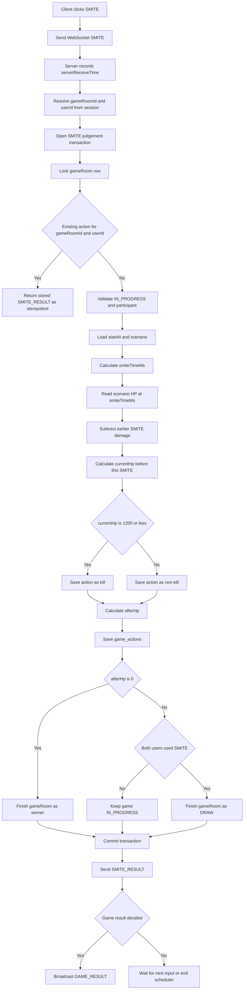

# Issue 48. SMITE 입력과 서버 판정

## 📌 Feature Description

`GAME_START` 이후 클라이언트가 보낸 `SMITE` WebSocket 메시지를 서버가 수신하고, 서버 기준 수신 시각으로 입력 시각을 계산해 `game_actions`에 저장한다.

클라이언트는 시간 정보를 보내지 않는다. 서버는 WebSocket 메시지를 받은 순간의 `serverReceiveTime`만 신뢰하고, `smiteTimeMs = serverReceiveTime - startAt`으로 게임 시작 기준 입력 시각을 계산한다. RTT 측정은 `GAME_START` 전 연결 품질 검사에만 사용하고, SMITE 판정 보정에는 사용하지 않는다.

SMITE 정책값은 고정이다.

| 정책 | 값 |
|---|---|
| 드래곤 초기 HP | `10,000` |
| SMITE 데미지 | `1,200` |
| 킬 성공 조건 | SMITE 적용 전 현재 HP가 `1,200` 이하 |
| 사용 횟수 | 유저당 게임당 1회 |
| 입력 채널 | gameRoom WebSocket |

HP 판정은 단순히 scenario HP만 보지 않는다. 같은 gameRoom에서 이미 더 이른 시점에 반영된 SMITE가 있으면, 그 SMITE가 킬 실패였더라도 `1,200` 데미지를 현재 HP에서 차감한다.

SMITE 적용 후 HP가 `0` 이하가 되면 해당 action은 드래곤 처치 action이다. 서버는 같은 DB transaction 안에서 action 저장과 gameRoom 결과 확정을 끝내고, commit 이후 `SMITE_RESULT`와 `GAME_RESULT`를 WebSocket으로 반환한다. 같은 순간 두 사용자가 SMITE를 누르는 경합은 서버 수신 시각 기준으로 처리하고, 동률은 `id` 순서로 결정한다.

두 유저가 모두 SMITE를 사용했고 어느 action도 처치하지 못했다면 더 들어올 SMITE 입력은 없다. 이 경우 남은 HP 재생을 끝까지 기다리지 않고 같은 transaction에서 `DRAW`로 확정한다. 클라이언트는 `GAME_RESULT` 수신 즉시 게임 UI를 종료한다.

시나리오는 gameRoom 생성 시 서버가 먼저 만든다. 정책 기준으로 드래곤은 `8~17초` 중 서버가 고른 duration 안에서 자연사해야 하며, HP는 1초 단위 선형 감소가 아니라 랜덤하게 드래곤이 공격받는 것처럼 burst 구간을 포함해 감소해야 한다. SMITE 판정은 새 시나리오를 만들지 않고 이미 저장된 `gameRoom.scenarioData`와 `startAt`을 기준으로 계산한다.

### Feature Flow

이번 이슈는 SMITE 입력을 서버 판정 가능한 액션으로 저장하고, 액션 단위 결과를 WebSocket으로 응답하는 범위까지 다룬다. SMITE로 드래곤 HP가 `0` 이하가 되면 즉시 `game_rooms.status=FINISHED`와 승패 결과를 확정하고 `GAME_RESULT`를 전송한다. 두 유저가 모두 SMITE를 사용하고도 처치하지 못하면 즉시 `DRAW`로 확정한다. record/LP 반영은 이후 game end settlement 또는 record 처리 흐름에서 처리한다.

## 📚 Tasks

### 1. SMITE 정책과 저장 의미 확정

- [x] `DRAGON_INITIAL_HP = 10000`, `SMITE_DAMAGE = 1200` 정책을 코드 상수와 문서 기준으로 맞춘다.
- [x] `dragon_hp_at_smite`는 scenario 원본 HP가 아니라, 이전 SMITE 데미지를 반영한 SMITE 적용 전 현재 HP로 정의한다.
- [x] 킬 실패한 SMITE도 이후 판정 HP에서 `1200` 데미지로 반영한다.
- [x] `is_kill=true`는 SMITE 적용 전 현재 HP가 `1200` 이하였다는 의미로 정의한다.
- [x] `afterHp = max(0, dragonHpAtSmite - 1200)`은 응답 payload에서 계산해 전달하고 DB에는 저장하지 않는다.
- [x] SMITE 판정은 RTT 보정 없이 서버 수신 시각 기준으로 처리한다.
- [x] SMITE로 드래곤 HP가 `0` 이하가 되면 gameRoom 승패 결과를 즉시 확정한다.
- [x] record/LP 반영은 이번 이슈에서 하지 않고 game end settlement 또는 record 처리 흐름에서 처리한다.

### 2. WebSocket 메시지 정의

- [x] client message `SMITE`를 `GameWebSocketMessageType`에 추가한다.
- [x] `SMITE` payload 계약에는 클라이언트 timestamp를 포함하지 않는다.
- [x] server message `SMITE_RESULT`를 정의한다.
- [x] `SMITE_RESULT` payload에는 `gameRoomId`, `userId`, `serverReceiveTime`, `smiteTimeMs`, `dragonHpAtSmite`, `damage`, `afterHp`, `isKill`, `idempotent`를 포함한다.
- [x] server message `GAME_RESULT`를 정의한다.
- [x] `GAME_RESULT` payload에는 `gameRoomId`, `result`, `winnerUserId`, `reason`, `finishedAt`, `actions` 요약을 포함한다.
- [ ] SMITE로 드래곤 HP가 `0` 이하가 되면 양쪽 클라이언트에 `GAME_RESULT`를 브로드캐스트한다.
- [ ] 두 유저가 모두 SMITE를 사용하고 처치하지 못하면 즉시 `DRAW GAME_RESULT`를 양쪽 클라이언트에 브로드캐스트한다.
- [ ] 잘못된 payload, 게임 상태 불일치, 참가자 아님 등은 기존 `ERROR` 메시지 구조로 응답한다.

### 3. WebSocket handler 연결

- [x] `GameWebSocketClientMessage`에 `isSmite()` 판별 메서드를 추가한다.
- [x] `GameWaitingWebSocketHandler.handleTextMessage(...)`에서 `SMITE` 메시지를 `GameWaitingWebSocketService`로 위임한다.
- [x] 서버는 `SMITE` 메시지 수신 직후 `Clock` 기준 `serverReceiveTime`을 기록한다.
- [x] `SMITE`는 기존 gameRoom WebSocket 경로에서 수신한다.
- [ ] `GAME_START` 이후 상태 검증은 SMITE 판정 service 구현에서 처리한다.

### 4. 패키지 책임 분리

- [x] `smite-api/game/smite` 패키지를 추가해 SMITE 입력 use-case를 분리한다.
  - `common/constant`: API 레벨 SMITE 상수
  - `domain`: SMITE 처리 결과, 실패 사유, 결과 확정 여부 등 use-case 값 객체
  - `dto`: WebSocket 응답 payload
  - `service`: `GameSmiteService`, `GameSmiteWebSocketSender`
- [x] `smite-api/game/websocket`은 메시지 수신/전송 경로만 담당하고, 판정 로직은 `game/smite/service`로 위임한다.
- [ ] `smite-core/domain/game`에는 DB 상태와 도메인 규칙을 둔다.
  - `GameAction` 생성/조회
  - `GameActionRepository` 조회 메서드
  - `GameActionCommandService`, `GameActionReadService` 추가 여부 검토
- [ ] gameRoom `FINISHED` 전환은 core의 `GameRoom` 도메인 메서드와 command service를 통해 수행한다.
- [x] SMITE 패키지는 `game:end:pending` Redis ZSET을 직접 다루지 않는다.
- [x] record/LP 반영은 SMITE 패키지가 담당하지 않는다.
- [x] RTT 측정 결과는 SMITE 판정에서 조회하지 않는다. RTT는 `GAME_START` 전 품질 검사에만 사용한다.

### 5. RTT 로직 단순화

- [ ] RTT 측정은 `GAME_START` 전 품질 gate로만 유지한다.
  - `RTT_PING` / `RTT_PONG`
  - 5회 sample 수집
  - median 계산으로 `RTT_LIMIT_MILLIS` 초과 여부 판단
  - 양쪽 `PASSED`일 때만 `GAME_START` 진행
- [ ] RTT median을 SMITE 판정용 값으로 노출하지 않는다.
- [ ] `GameRttStartReadyState`에서 `userAMedianRttMs`, `userBMedianRttMs`, `medianRttMillis(userId)`를 제거한다.
- [ ] `findStartReadyState(...)`는 양쪽 `PASSED` 여부와 참가자 userId만 반환하도록 단순화한다.
- [ ] Redis `game:rtt:{gameRoomId}`에 median 값을 저장하지 않거나, 저장하더라도 로그/진단용으로만 취급하고 service contract에서 제거한다.
- [ ] `GameAction.rttMs`와 `game_actions.rtt_ms` 컬럼은 제거한다.
- [ ] `SMITE_RESULT`와 `GAME_RESULT` payload에 RTT 값을 포함하지 않는다.
- [ ] `GameSmiteService`는 `GameRttMeasurementService` / `GameRttMeasurementStore`에 의존하지 않는다.
- [ ] RTT cleanup은 기존처럼 `GAME_START_FAILED`, `GAME_START` 이후 시작 처리 완료, abort/finish cleanup 경로에서 수행한다.

### 6. 멱등성과 중복 입력 보장

- [ ] `game_actions`의 `UNIQUE(game_room_id, user_id)` 제약을 최종 방어선으로 사용한다.
- [ ] 서비스 진입 시 `gameRoomId + userId`로 기존 SMITE action을 먼저 조회한다.
- [ ] 기존 action이 있으면 새로 판정하지 않고 기존 결과를 `idempotent=true`로 재응답한다.
- [ ] 동시에 같은 유저의 SMITE가 두 번 들어와 unique 충돌이 발생하면 기존 action을 다시 조회해 같은 결과로 응답한다.
- [ ] 클라이언트는 버튼 클릭 즉시 SMITE 버튼을 비활성화하는 정책을 문서에 반영한다.

### 7. 동시성 제어와 판정 순서

- [ ] 같은 gameRoom의 SMITE 판정은 `game_rooms` row lock 안에서 처리한다.
- [ ] lock 안에서는 gameRoom 상태 검증, 기존 action 조회, HP 계산, action 저장만 수행한다.
- [ ] WebSocket 전송은 DB transaction 이후 수행한다.
- [ ] 서로 다른 유저가 동시에 SMITE를 보내도 이전 SMITE 데미지 반영 순서가 깨지지 않게 한다.
- [ ] SMITE action 정렬 기준은 `serverReceiveTimeMs ASC`, 그래도 같으면 `id ASC`로 둔다.
- [ ] `smiteTimeMs`는 `serverReceiveTimeMs - startAtMillis`로 계산되므로 winner 정렬과 같은 서버 수신 기준을 따른다.
- [ ] 두 유저가 거의 동시에 SMITE를 누른 경우도 서버 수신 기준으로 winner를 결정한다.
- [ ] 처치 action 발생 시 일반 end scheduler의 `settlementDueAt`까지 기다리지 않는다.
- [ ] 처치 action 발생 시 같은 transaction 흐름에서 즉시 결과 확정을 시도한다.
- [ ] 결과 확정은 gameRoom row lock 안에서 한 번만 성공하게 한다.

### 8. 랜덤 버스트 HP 시나리오 생성

- [ ] 현재 `GameRoomCommandService.createDefaultScenario(...)`의 1초 단위 선형 감소 로직을 제거한다.
- [ ] gameRoom 생성 시 `8~17초` 범위에서 duration을 먼저 정하고, 해당 duration 안에서 HP가 `10000 -> 0`에 도달하는 scenario를 생성한다.
- [ ] HP timeline은 랜덤 burst 패턴으로 생성한다.
  - 드래곤이 공격받지 않는 짧은 정체 구간을 허용한다.
  - 한 번에 크게 깎이는 burst 구간을 허용한다.
  - 전체적으로 HP는 증가하지 않고 감소 또는 유지되어야 한다.
  - 마지막 step은 반드시 `timeMs = durationSeconds * 1000`, `hp = 0`이어야 한다.
- [ ] scenario step 간격은 클라이언트 표시와 서버 판정이 같이 사용할 수 있도록 충분히 촘촘하게 정의한다.
  - 기존 1초 단위만으로는 burst 타이밍과 SMITE 판정 시점이 거칠 수 있으므로 `100ms~250ms` 단위 후보를 검토한다.
- [ ] 랜덤 생성 결과가 정책을 깨지 않도록 보정한다.
  - 첫 step은 `timeMs = 0`, `hp = 10000`
  - 모든 step의 `timeMs`는 오름차순
  - 모든 step의 `hp`는 `0~10000`
  - HP는 이전 step보다 커질 수 없음
  - 마지막 step 이전에 HP가 0이 되면 이후 step은 만들지 않거나 0 유지 정책을 명확히 한다.
- [ ] 시나리오 생성 책임은 `smite-core/domain/game/service/GameScenarioGenerator`로 분리한다.
  - `GameRoomCommandService`는 generator를 호출해 gameRoom 생성 흐름만 조립한다.
  - WebSocket/API 계층에서는 scenario 생성 로직을 갖지 않는다.

### 9. HP 계산과 SMITE 판정 구현

- [ ] `smiteTimeMs = serverReceiveTimeMs - startAtMillis`로 계산한다.
- [ ] `serverReceiveTimeMs`와 `startAtMillis`는 로컬 타임존 시간이 아니라 UTC `Instant` 기반 epoch milliseconds로 맞춘다.
- [ ] RTT median은 SMITE 판정 계산에 사용하지 않는다.
- [ ] `smiteTimeMs`가 scenario 범위를 벗어나는 경우의 처리 정책을 정의한다.
  - 시작 전 입력 또는 비정상적으로 빠른 입력은 무효 처리
  - 자연사 이후 입력은 저장하지 않고 종료된 판으로 응답
- [ ] scenario에서 `smiteTimeMs` 시점의 base HP를 계산한다.
- [ ] scenario는 gameRoom 생성 시 저장된 `scenarioData`를 사용하고, SMITE 입력 시 새로 생성하지 않는다.
- [ ] 현재 action보다 앞선 SMITE action 개수만큼 `1200` 데미지를 차감한다.
- [ ] `currentHp <= 0`이면 이미 처치된 상태로 보고 킬 실패/무효 처리한다.
- [ ] `currentHp <= 1200`이면 `isKill=true`, 아니면 `isKill=false`로 저장한다.
- [ ] 킬 실패여도 `afterHp = max(0, currentHp - 1200)`로 계산하고 이후 action 판정에 반영한다.
- [ ] `afterHp <= 0`이면 드래곤 처치 action으로 보고 결과 확정 흐름을 호출한다.

### 10. SMITE 처치 결과 즉시 반환

- [ ] SMITE로 드래곤 HP가 `0` 이하가 되면 gameRoom row lock 안에서 즉시 `FINISHED` 전환을 시도한다.
- [ ] 확정된 결과는 `GameRoom.finish(result, winnerUserId)`를 사용해 저장한다.
- [ ] 이미 먼저 처리된 SMITE로 게임이 `FINISHED`가 되었다면 뒤늦은 SMITE는 저장하지 않고 현재 결과를 반환한다.
- [ ] 이미 `FINISHED`인 gameRoom에 늦게 도착한 SMITE는 새 action으로 저장하지 않고 현재 `GAME_RESULT`를 재응답한다.
- [ ] `GAME_RESULT` 전송은 transaction commit 이후 수행한다.
- [ ] record/LP 반영은 `GAME_RESULT` 전송과 분리하고, 기존 record 처리 정책과 이어지게 둔다.

### 11. 두 유저 SMITE 소모 후 즉시 DRAW 확정

- [ ] 두 유저가 모두 SMITE를 사용했고 어느 action도 처치하지 못했다면 더 이상 입력이 들어올 수 없다고 본다.
- [ ] 두 번째 실패 SMITE 저장 transaction 안에서 gameRoom을 `DRAW`로 `FINISHED` 처리한다.
- [ ] 이 경우 `game:end:pending` score를 변경하거나 별도 scheduler를 추가하지 않는다.
- [ ] 기존 `game:end:pending` member는 남아 있어도 후속 end scheduler가 이미 `FINISHED`인 gameRoom을 no-op 처리한다.
- [ ] 두 유저 SMITE 소모 후 즉시 `DRAW GAME_RESULT`를 브로드캐스트한다.

### 12. GameAction 저장/조회 보강

- [ ] `GameActionRepository`에 `findByGameRoomIdAndUserId(...)`를 추가한다.
- [ ] `GameActionRepository`에 gameRoom 단위 action 정렬 조회 메서드를 추가한다.
  - 정렬 기준: `serverReceiveTimeMs ASC`, `id ASC`
- [ ] 필요한 경우 `GameAction` 생성 정적 팩토리 또는 도메인 메서드를 추가해 필드 의미를 명확히 한다.
- [ ] DDL 문서에서 `dragon_hp_at_smite` 의미를 “이전 SMITE 데미지 반영 후, 이번 SMITE 적용 전 HP”로 명확히 한다.
- [ ] DDL 문서에서 `rtt_ms` 컬럼을 제거하고 `smite_time_ms` 의미를 “서버 수신 시각 기준 게임 시작 후 경과 ms”로 수정한다.
- [ ] `game_actions`는 유저당 1회 입력 기록으로 유지하고, record/LP 결과 저장은 `game_records`에서 처리한다.

### 13. 실패/예외 응답

- [ ] gameRoom이 `IN_PROGRESS`가 아니면 SMITE를 거절한다.
- [ ] gameRoom이 이미 `FINISHED`이면 현재 gameRoom 결과를 `GAME_RESULT`로 재응답한다.
- [ ] userId가 gameRoom participant가 아니면 SMITE를 거절한다.
- [ ] scenario 또는 `startAt`이 없으면 SMITE를 거절한다.
- [ ] unique 충돌은 중복 입력 실패가 아니라 기존 결과 재응답으로 처리한다.
- [ ] 저장 중 복구 불가능한 DB 예외는 `ERROR` 응답으로 내리고 WebSocket 연결은 유지한다.

### 14. 테스트

- [ ] gameRoom 생성 시 scenario duration이 항상 `8~17초` 범위인지 검증한다.
- [ ] 랜덤 burst scenario가 `10000 -> 0`으로 끝나고 HP가 증가하지 않는지 검증한다.
- [ ] 랜덤 burst scenario가 1초 단위 선형 감소로 고정되지 않는지 검증한다.
- [ ] `SMITE` client message type과 `SMITE_RESULT` server message type 직렬화를 검증한다.
- [ ] `SMITE` 수신 시 `serverReceiveTime`을 서버에서 기록하는지 검증한다.
- [ ] `smiteTimeMs`가 RTT 보정 없이 `serverReceiveTimeMs - startAtMillis`로 계산되는지 검증한다.
- [ ] SMITE 판정 서비스가 RTT service/store에 의존하지 않는지 검증한다.
- [ ] RTT start-ready 결과가 median 값 없이 양쪽 `PASSED`만으로 GAME_START 진행 조건을 판단하는지 검증한다.
- [ ] scenario HP에서 이전 SMITE 데미지를 차감해 current HP를 계산하는지 검증한다.
- [ ] HP `1200` 이하이면 킬 성공, 초과이면 킬 실패로 저장하는지 검증한다.
- [ ] 킬 실패한 SMITE도 이후 action의 HP 계산에 `1200` 데미지로 반영되는지 검증한다.
- [ ] 같은 유저 중복 SMITE는 기존 결과를 재응답하는지 검증한다.
- [ ] 같은 유저 동시 SMITE unique 충돌도 멱등 응답으로 처리되는지 검증한다.
- [ ] 서로 다른 두 유저 동시 SMITE가 gameRoom row lock 기준으로 일관되게 저장되는지 검증한다.
- [ ] 두 유저가 동시에 SMITE를 보냈을 때 `serverReceiveTimeMs`, `id` 정렬 기준으로 winner가 결정되는지 검증한다.
- [ ] SMITE 적용 후 `afterHp <= 0`이면 gameRoom이 즉시 `FINISHED`로 전환되고 `GAME_RESULT`가 브로드캐스트되는지 검증한다.
- [ ] 두 유저가 모두 SMITE를 사용하고 처치하지 못한 경우 즉시 `DRAW GAME_RESULT`가 반환되는지 검증한다.
- [ ] 두 유저가 모두 SMITE를 사용한 실패 판은 `gameEndAt`/`inputGraceMs`를 기다리지 않는지 검증한다.
- [ ] 이미 `FINISHED`된 gameRoom에 늦게 도착한 SMITE는 action 저장 없이 `GAME_RESULT`를 재응답하는지 검증한다.
- [ ] `IN_PROGRESS`가 아닌 gameRoom, participant 아님, scenario 없음 실패 케이스를 검증한다.

### 15. 문서

- [ ] `docs/project/policy.md`의 HP 감소 패턴과 실제 scenario 생성 규칙을 맞춘다.
- [ ] `docs/project/policy.md`에 킬 실패 SMITE도 `1200` 데미지를 반영한다는 정책을 추가한다.
- [ ] `docs/project/policy.md`에 SMITE는 RTT 보정 없이 서버 수신 시각 기준으로 판정한다는 정책을 추가한다.
- [ ] `docs/project/policy.md`에 동시 SMITE 정렬 기준과 처치 시 `GAME_RESULT` 반환 정책을 추가한다.
- [ ] `docs/project/policy.md`에 두 유저 SMITE 소모 후 처치하지 못하면 즉시 `DRAW`로 확정한다는 정책을 추가한다.
- [ ] `docs/project/policy.md`에 SMITE로 먼저 `FINISHED`된 gameRoom의 `game:end:pending` member는 필수 cleanup하지 않고 scheduler no-op으로 처리한다는 정책을 추가한다.
- [ ] `docs/project/overallplan.md`의 판정 프로세스에 이전 SMITE 데미지 차감 규칙을 반영한다.
- [ ] `docs/project/websocket client.md`에 `SMITE`, `SMITE_RESULT` 메시지와 클라이언트 버튼 1회 사용 정책을 추가한다.
- [ ] `docs/project/domain status.md`에 `IN_PROGRESS` 중 SMITE action 저장 흐름을 반영한다.
- [ ] `docs/DB/DDL.md`의 `game_actions` 컬럼 설명, Redis RTT 구조, `game:end:pending` no-op 정책을 실제 판정 의미와 맞춘다.

## ✅ 완료 기준

- 클라이언트는 `GAME_START` 이후 WebSocket으로 `SMITE`를 보낼 수 있다.
- gameRoom 생성 시 `8~17초` 안에 자연사하는 랜덤 burst HP scenario가 저장된다.
- 서버는 클라이언트 timestamp 없이 서버 수신 시각만으로 `smiteTimeMs`를 계산한다.
- 유저당 gameRoom당 SMITE는 한 번만 저장된다.
- 중복 SMITE 요청은 기존 결과를 재응답한다.
- 이전 SMITE가 킬 실패였더라도 이후 HP 계산에서 `1200` 데미지로 반영된다.
- `game_actions`에는 SMITE 판정에 필요한 값이 저장된다.
- SMITE로 드래곤 HP가 `0` 이하가 되면 gameRoom 결과를 확정하고 `GAME_RESULT`를 WebSocket으로 반환한다.
- 두 유저가 모두 SMITE를 사용하고 처치하지 못하면 즉시 `DRAW GAME_RESULT`를 반환한다.
- 한 명만 사용/둘 다 미사용 자연사, record/LP 반영은 이후 game end settlement 또는 record 처리 흐름으로 남긴다.

## 📝 Note

- 이번 이슈의 핵심은 “입력 수신”이 아니라 “서버가 판정 가능한 action을 일관되게 저장”하는 것이다.
- REST API가 아니라 기존 gameRoom WebSocket에서 처리한다.
- 클라이언트 버튼 비활성화는 UX 방어이고, 실제 1회 보장은 서버 멱등 처리와 DB unique 제약이 담당한다.
- SMITE 판정 transaction 안에서 WebSocket 전송을 하지 않는다.
- `SMITE_RESULT`는 action 저장 결과이고, `GAME_RESULT`는 gameRoom 승패 확정 결과다.
- RTT 측정은 `GAME_START` 전 품질 검사이며, SMITE 판정 보정에는 사용하지 않는다.

---

## PR
