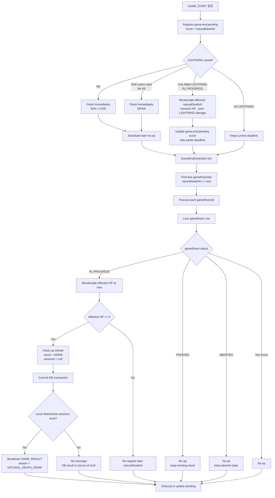
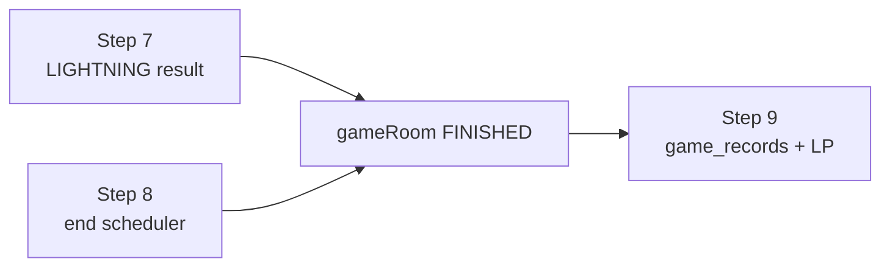
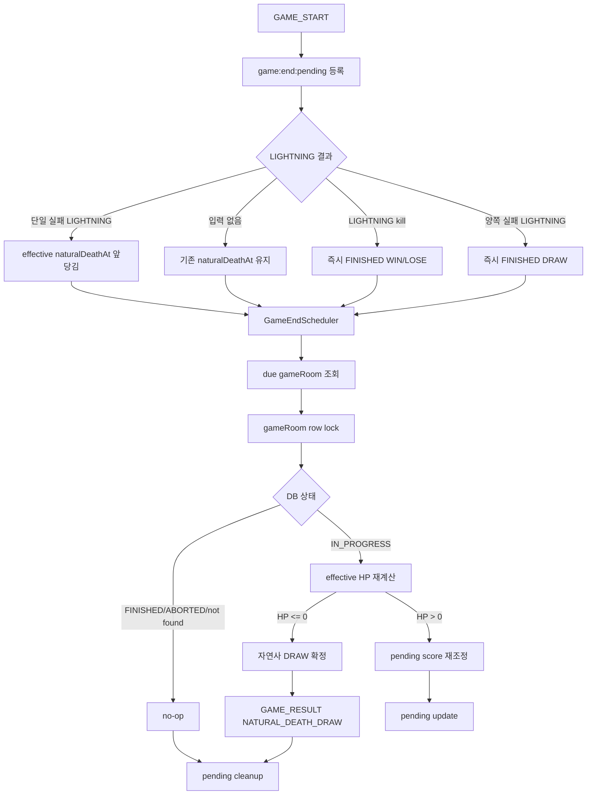
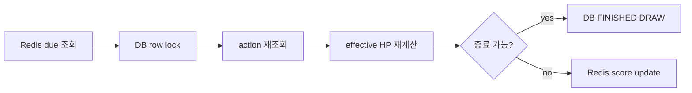
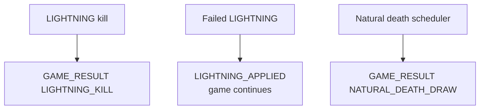

# Issue 50. 서버 스케줄러 기반 게임 종료 보장

## 📌 Feature Description

`GAME_START` 이후 등록된 `game:end:pending`을 서버 scheduler가 조회하고, WebSocket 연결 유무와 무관하게 gameRoom 종료를 보장한다.

스타 코어 HP scenario는 원본 자연 HP timeline으로 유지한다. 실제 판정 HP는 원본 scenario HP에서 이전 LIGHTNING 데미지를 차감한 effective HP다. 따라서 LIGHTNING 실패 action이 저장되면 스타 코어 자연사 시각도 앞당겨질 수 있다.

자연사 deadline은 `effective HP가 0이 되는 최초 시각`이다. LIGHTNING이 없는 경우에는 scenario 마지막 시점인 `startAt + durationMs`가 deadline이고, LIGHTNING 실패로 누적 데미지가 생기면 effective HP 기준으로 deadline을 다시 계산해 `game:end:pending` score를 앞당긴다.

LIGHTNING으로 이미 `FINISHED`된 gameRoom은 결과를 바꾸지 않고 no-op 처리한다. 아직 `IN_PROGRESS`인 gameRoom은 자연사 기준 `DRAW`로 확정한다. `ABORTED` 상태도 no-op 처리한다.

이번 이슈는 gameRoom 종료 보장, 자연사 `DRAW` 확정, `game:end:pending` cleanup, 중복 scheduler 실행에 대한 멱등성까지 다룬다. `game_records` 생성과 LP/배치/승급전 반영은 Step 9 범위로 분리한다.

### Policy Priority

1. LIGHTNING 적용 후 effective HP가 `0` 이하이면 즉시 승패를 확정한다.
2. 두 유저가 모두 LIGHTNING을 사용했고 kill이 없으면 즉시 `DRAW`로 확정한다.
3. 한 명만 LIGHTNING을 실패했고 게임이 아직 `IN_PROGRESS`이면 effective naturalDeathAt을 앞당긴다.
4. 이후 추가 LIGHTNING으로 끝나지 않으면 scheduler가 effective naturalDeathAt에 자연사 `DRAW`를 확정한다.

### Feature Flow



### Scope Boundary



Step 7은 LIGHTNING 처치 또는 양쪽 LIGHTNING 실패로 즉시 종료되는 경우를 처리한다. Step 8은 아무 추가 입력 없이 시간이 끝난 gameRoom을 서버가 닫는 경우를 처리한다. Step 9는 이미 확정된 결과를 기록과 랭크 시스템에 반영한다.

## 📚 Tasks

### 1. 종료 pending 조회 확장

- [x] `GameEndScheduleStore`에 `naturalDeathAt`이 지난 gameRoom 조회 메서드를 추가한다.
- [x] Redis `game:end:pending` ZSET을 `rangeByScore(..., nowMillis)` 기준으로 조회한다.
- [x] 최초 `game:end:pending` score는 `startAtMillis + durationMs`로 등록하고, 자연사 종료에는 추가 입력 유예 시간을 더하지 않는다.
- [x] LIGHTNING 실패 action 이후 effective HP 기준으로 더 빠른 자연사 시각이 나오면 `game:end:pending` score를 앞당길 수 있도록 store/service API를 추가한다.
- [x] scheduler batch size 정책을 상수로 둔다.
- [x] 조회 결과는 `Long gameRoomId` 목록으로 변환한다.
- [x] 잘못된 member 값은 scheduler 전체를 실패시키지 않도록 무시 또는 cleanup 처리한다.

> 실제 LIGHTNING 실패 action 저장 후 effective naturalDeathAt을 계산하고 `advanceEndDeadlineIfEarlier`를 호출하는 연결은 `4. effective naturalDeathAt 계산`에서 처리한다.

### 2. 서버 scheduler 추가

- [x] `game/end/scheduler` 패키지에 `GameEndScheduler`를 추가한다.
- [x] `@Scheduled(fixedDelayString = ...)`로 주기적으로 game end 정산 service를 호출한다.
- [x] scheduler fixed delay는 자연사 결과 체감 지연이 크지 않도록 짧게 둔다.
- [x] scheduler 예외가 다음 tick을 막지 않도록 warn log를 남기고 종료한다.
- [x] scheduler는 직접 DB 상태를 변경하지 않고 end settlement service로 위임한다.

> `GameEndScheduler`는 scheduler wiring과 예외 격리만 담당한다. due 조회/row lock/자연사 `DRAW` 확정은 Step 3의 `GameEndSettlementService`와 core `GameNaturalDeathSettlementService`에서 처리한다.

### 3. 자연사 종료 정산 service 구현

- [x] `game/end/service` 패키지에 `GameEndSettlementService` 정산 진입점을 추가한다.
- [x] due gameRoomId를 조회하고 gameRoom별 정산을 수행한다.
- [x] 정산 시점에 gameRoom row lock 안에서 action 목록을 다시 조회해 effective HP를 재계산한다.
- [x] due로 조회됐더라도 effective HP가 아직 `0`보다 크면 더 늦은 naturalDeathAt으로 pending score를 갱신하고 종료하지 않는다.
- [x] 정산 완료 또는 no-op 이후 `game:end:pending`을 cleanup한다.
- [x] cleanup은 DB 상태 처리 이후 best-effort로 수행한다.
- [x] 같은 gameRoomId가 중복 조회되거나 scheduler가 중복 실행돼도 최종 결과가 바뀌지 않도록 멱등 처리한다.

> `GameEndSettlementService`는 Redis due 목록/cleanup/update만 담당하고, row lock + action 재조회 + 자연사 `DRAW` 판정은 core의 `GameNaturalDeathSettlementService`가 담당한다. 자연사 `DRAW`에 대한 WebSocket `GAME_RESULT` broadcast는 Step 6 범위로 남긴다.

### 4. effective naturalDeathAt 계산

- [x] 원본 scenario는 수정하지 않고 자연 HP timeline으로 유지한다.
- [x] effective HP는 `scenarioHpAt(timeMs) - priorLightningDamageSum`으로 계산한다.
- [x] LIGHTNING 실패 action 저장 후 누적 LIGHTNING 데미지를 반영해 effective HP가 최초로 `0` 이하가 되는 시각을 계산한다.
- [x] scenario step 사이에 deadline이 생기면 선형 보간 기준으로 최초 `0` 도달 시각을 계산한다.
- [x] 계산된 naturalDeathAt이 현재 pending score보다 빠른 경우에만 score를 앞당긴다.
- [x] 이미 LIGHTNING kill 또는 양쪽 LIGHTNING 실패 DRAW로 `FINISHED`된 경우에는 naturalDeathAt을 갱신하지 않는다.
- [x] 계산 책임은 API WebSocket handler가 아니라 game end 또는 core 도메인 service로 분리한다.

> effective HP와 effective naturalDeathAt 계산은 core `GameEffectiveNaturalDeathService`가 담당한다. LIGHTNING 실패 단일 케이스에서만 API `GameEndDeadlineAdvanceService`가 `advanceEndDeadlineIfEarlier`를 호출하며, LIGHTNING kill 또는 양쪽 실패 DRAW에서는 deadline을 갱신하지 않는다.

### 5. core gameRoom 종료 primitive 보강

- [x] `GameRoomCommandService`에 자연사 `DRAW` 종료 메서드를 추가한다.
- [x] gameRoom row lock을 잡고 DB 상태를 최종 기준으로 판정한다.
- [x] `IN_PROGRESS`이면 `GameResult.DRAW`, `winnerId = null`로 `FINISHED` 전환한다.
- [x] participants는 `FINISHED`로 전환한다.
- [x] 이미 `FINISHED`이면 기존 결과를 유지하고 no-op 처리한다.
- [x] `ABORTED`이면 상태를 바꾸지 않고 no-op 처리한다.
- [x] 없는 gameRoom은 no-op 처리한다.

> 자연사 `DRAW` 종료는 core `GameRoomCommandService.finishInProgressRoomByNaturalDeathDraw`가 담당한다. `GameNaturalDeathSettlementService`는 due 시점의 effective HP를 판정한 뒤, 종료 확정 시 이 primitive를 호출한다.

### 6. GAME_RESULT 공용화와 자연사 결과 응답

- [x] 최종 결과 payload와 sender가 LIGHTNING 전용 패키지에 묶여 있는 구조를 공용 result 패키지로 정리한다.
- [x] `GAME_RESULT` reason에 `NATURAL_DEATH_DRAW`를 추가한다.
- [x] 자연사 `DRAW`로 새로 `FINISHED`된 경우 연결된 local WebSocket session에만 `GAME_RESULT`를 broadcast한다.
- [x] 연결된 session이 없으면 메시지 전송 없이 DB 결과를 최종 기준으로 둔다.
- [x] `GAME_RESULT` 전송 실패가 `game:end:pending` cleanup을 막지 않도록 전송과 cleanup 실패 지점을 분리한다.
- [x] 이미 `FINISHED` 또는 `ABORTED`인 no-op 케이스에서는 새 `GAME_RESULT`를 보내지 않는다.

> `GameResultPayload`, `GameResultPayloadFactory`, `GameResultWebSocketSender`, `GameResultReason`은 API `game/result` 패키지의 공용 결과 영역으로 분리한다. 자연사 `DRAW`로 새로 종료된 경우에만 `GameEndSettlementService`가 `NATURAL_DEATH_DRAW` payload를 만들어 local WebSocket session에 broadcast하고, 전송 실패와 pending cleanup은 분리한다.

### 7. 테스트

- [x] Redis store가 `naturalDeathAt <= now`인 gameRoom만 조회하는지 검증한다.
- [x] 자연사 deadline이 `startAtMillis + durationMs`로 등록되고 추가 grace가 붙지 않는지 검증한다.
- [x] LIGHTNING 실패 action 저장 후 effective naturalDeathAt이 앞당겨지는지 검증한다.
- [x] LIGHTNING 실패 action이 여러 개일 때 누적 데미지 기준으로 naturalDeathAt이 계산되는지 검증한다.
- [x] effective naturalDeathAt이 scenario step 사이에 있을 때 선형 보간으로 계산되는지 검증한다.
- [x] due 조회된 gameRoom의 effective HP가 아직 `0`보다 크면 종료하지 않고 pending score를 갱신하는지 검증한다.
- [x] `IN_PROGRESS` gameRoom이 자연사 `DRAW`로 `FINISHED` 되는지 검증한다.
- [x] 자연사 `DRAW` 시 participants가 `FINISHED` 되는지 검증한다.
- [x] 이미 `FINISHED`인 gameRoom은 결과가 바뀌지 않는지 검증한다.
- [x] `ABORTED` gameRoom은 결과가 생기지 않고 상태가 유지되는지 검증한다.
- [x] 정산 완료 또는 no-op 이후 `game:end:pending` cleanup이 수행되는지 검증한다.
- [x] 같은 gameRoom을 두 번 정산해도 결과가 바뀌지 않는지 검증한다.
- [x] 자연사 `DRAW`로 새로 종료된 경우에만 `GAME_RESULT` broadcast가 호출되는지 검증한다.
- [x] `GAME_RESULT` broadcast가 실패해도 정산 결과가 rollback 되지 않고 pending cleanup이 시도되는지 검증한다.
- [x] WebSocket session이 없어도 DB 정산은 성공하는지 검증한다.

> Step 7은 Redis store/service, effective naturalDeathAt 계산, core 자연사 정산, API scheduler 정산, 공용 GAME_RESULT sender 테스트로 분산 검증한다. 같은 gameRoom 중복 정산, ABORTED no-op, 다중 LIGHTNING 누적 데미지, WebSocket session 없는 broadcast 경로를 추가로 보강했다.

### 8. 문서 정합성

- [x] `docs/project/policy.md`에 자연사 종료와 scheduler 책임을 반영한다.
- [x] `docs/project/domain status.md`에 `game:end:pending` 정산 흐름을 반영한다.
- [x] `docs/project/websocket client.md`에 자연사 `GAME_RESULT` reason을 반영한다.
- [x] `docs/DB/DDL.md`와 실제 entity 변경 여부를 비교한다.
- [x] Step 9의 `game_records`/LP 반영이 이번 이슈 범위가 아님을 문서에 명시한다.

> Issue 50 Step 8 기준 DB entity 변경은 없다. 종료 보장 흐름은 기존 gameRoom/action 스키마와 Redis `game:end:pending`을 사용하며, `game_records`/LP/시리즈 반영은 Step 9 범위로 문서에 분리했다.

## 📝 Note

- DB 상태가 최종 기준이다. Redis `game:end:pending`은 scheduler 후보 목록일 뿐 결과의 source of truth가 아니다.
- 자연사 종료는 effective HP 기준으로 즉시 대상이 된다. 서버 수신 시각이 effective naturalDeathAt을 지난 LIGHTNING은 저장하지 않고 자연사 정산 결과를 따른다.
- scenario는 원본 timeline으로 보존한다. LIGHTNING 데미지는 action으로만 저장하고, 현재 HP와 자연사 deadline은 scenario와 action을 합성해 계산한다.
- LIGHTNING 즉시 종료와 scheduler 자연사 종료가 경합해도 gameRoom row lock과 상태 조건으로 한쪽만 결과를 확정해야 한다.
- 자연사 종료는 `DRAW` 정책으로 처리한다. 이 정책은 현재 2인 게임과 반복 LIGHTNING cooldown 정책을 전제로 하며, LIGHTNING 실패 action으로 앞당겨진 effective HP 기준 deadline도 scheduler 정산 대상이 된다.
- `GAME_RESULT` 전송은 사용자 경험 보조 경로다. 연결이 없거나 전송에 실패해도 DB 결과 확정은 되돌리지 않는다.
- `game_records` 생성, LP 반영, 배치/승급전 처리는 Step 9에서 처리한다.

---
## PR

## 📌 Summary

`GAME_START` 이후 WebSocket 연결 유무와 관계없이 gameRoom 종료를 보장하는 서버 scheduler 기반 자연사 정산 흐름을 구현함.



핵심 정책은 다음과 같음.

- DB `game_rooms.status/result/winnerId`가 최종 source of truth임
- Redis `game:end:pending`은 종료 후보 목록일 뿐 결과 저장소가 아님
- 원본 HP scenario는 수정하지 않고, 저장된 LIGHTNING action을 합성해 effective HP와 effective naturalDeathAt을 계산함
- LIGHTNING kill과 양쪽 실패 DRAW는 즉시 종료하고, scheduler는 이후 no-op으로 정리함
- 자연사 종료는 `DRAW`로 확정하며, 연결된 local WebSocket session이 있으면 `GAME_RESULT(reason=NATURAL_DEATH_DRAW)`를 전송함
- `game_records`, LP, 배치/승급전 반영은 이번 범위에서 제외하고 Step 9로 분리함

## 📚 Changes

### 종료 기준을 Redis 시간이 아니라 DB 재판정으로 둠



`game:end:pending` score가 due가 되었다고 바로 종료하지 않음. scheduler는 due 후보만 가져오고, 실제 종료 여부는 row lock 안에서 gameRoom 상태와 최신 action 목록을 기준으로 다시 판정함.

Trade-off:

- Redis만 믿고 종료하면 빠르지만, LIGHTNING 저장/즉시 종료와 경합할 때 결과를 덮어쓸 위험이 있음
- DB row lock 재판정은 비용이 더 있지만, 최종 결과 멱등성과 race safety가 더 중요하다고 판단함

### Redis Lua script를 의도별로 분리함

`game:end:pending` 갱신은 두 가지 계약을 분리함.

- `advanceEndDeadlineIfEarlier`: 실패 LIGHTNING 직후 호출함. member가 없으면 등록할 수 있고, 기존 score보다 빠른 경우에만 앞당김
- `updateEndDeadlineIfDue`: scheduler 재판정 후 호출함. 이미 due 상태인 기존 member만 재계산된 시각으로 이동함

Trade-off:

- 하나의 범용 script로 합치면 mode 인자와 조건 분기가 늘어남
- 호출자가 "앞당김"과 "due 재조정" 중 무엇을 원하는지 script 이름만으로 드러나지 않음
- script를 나누면 파일은 2개가 되지만, 각 Redis 원자 연산의 실패/성공 의미가 명확해짐

### 원본 scenario 보존 + effective HP 합성

자연 HP timeline은 그대로 유지하고, 실패 LIGHTNING 데미지를 action으로만 누적 반영함.

```text
effectiveHpAt(t) = scenarioHpAt(t) - savedLightningCount * 1200
```

Trade-off:

- scenario를 직접 수정하면 조회는 단순해지지만, "원본 자연 HP"와 "실제 판정 HP"의 의미가 섞임
- action 합성 방식은 계산이 필요하지만, 원본 시나리오 보존, 재계산 가능성, 테스트 가능성이 더 좋음

### 자연사 종료 primitive를 core로 분리함

자연사 `DRAW` 종료는 core `GameRoomCommandService`의 primitive로 처리함. API scheduler는 종료를 직접 만들지 않고, due 조회와 정산 orchestration만 담당함.

Trade-off:

- API에서 바로 `gameRoom.finish(DRAW)`를 호출하면 구현은 짧음
- 하지만 종료 상태 전환 규칙이 API에 퍼지므로, LIGHTNING 종료/자연사 종료/abort 흐름이 장기적으로 불안정해짐
- 상태 변경은 core command service에 두고, API는 Redis/WebSocket/scheduling 책임만 갖도록 분리함

### GAME_RESULT를 LIGHTNING 전용에서 공용 result로 분리함

`GAME_RESULT`는 이제 LIGHTNING만의 응답이 아니라 게임 종료 공용 이벤트임.



Trade-off:

- 기존 LIGHTNING 패키지 안에 두면 변경 범위는 작음
- 하지만 자연사 종료까지 LIGHTNING 패키지에 의존하게 되어 패키지 의미가 깨짐
- 공용 `game/result` 패키지로 분리해 종료 사유가 늘어나도 같은 payload/sender/factory를 재사용할 수 있게 함

### WebSocket 전송은 보조 경로로 둠

자연사 DRAW로 새로 종료된 경우에만 `NATURAL_DEATH_DRAW`를 broadcast함. 연결된 session이 없거나 전송에 실패해도 DB 결과 확정과 pending cleanup은 계속 진행함.

Trade-off:

- 전송 실패를 rollback하면 클라이언트 경험은 재시도 가능해 보이지만, 이미 DB 종료가 확정된 상태와 충돌함
- 게임 결과의 source of truth는 DB이므로, WebSocket은 UX 보조 경로로 격리함
- pending cleanup은 "결과 전송 성공"의 의미가 아니라 "DB 기준 정산 완료 후보 제거"의 의미임. cleanup을 멈추면 이미 종료된 gameRoom이 scheduler tick마다 반복 조회됨

### 테스트와 문서 정합성 보강함

테스트는 Redis store, effective naturalDeathAt 계산, core 정산, API 정산, WebSocket result sender 계층으로 분산함.

검증한 정책:

- due 조회는 `naturalDeathAt <= now`
- 자연사 deadline은 `startAt + durationMs`
- 실패 LIGHTNING 누적 데미지 반영
- step 사이 자연사 시각 선형 보간
- HP 하락이 없는 구간, 정확한 threshold, 과도한 누적 데미지, action 순서 독립성
- due지만 effective HP가 남은 경우 pending score update
- 자연사 DRAW 종료와 participants FINISHED
- FINISHED/ABORTED/no-op 멱등성
- 중복 scheduler 정산 시 기존 결과 유지
- 자연사 DRAW broadcast와 전송 실패 시 cleanup 지속
- WebSocket session이 없어도 DB 정산 성공

## 📝 Note

- `game:end:pending` member가 LIGHTNING 즉시 종료 이후 남아 있어도 정상임. scheduler가 DB 상태를 다시 보고 no-op cleanup함
- `finishedAt`은 현재 도메인 primitive의 종료 시각을 사용하고, `GAME_RESULT.finishedAt`은 scheduler 처리 시점 기준 payload 시간임. 엄밀한 단일 종료 시각 필드가 필요하면 후속으로 도메인에서 clock 주입을 검토할 수 있음
- 현재 `NATURAL_DEATH_DRAW` 판별은 별도 DB reason 컬럼 없이 결과와 action 목록으로 재구성함. DRAW 사유가 더 늘어나면 `finishReason` 영속 필드를 두는 편이 더 명확함
- 이번 PR은 gameRoom 종료 보장과 결과 전송까지임. `game_records` 생성, LP 반영, 배치/승급전 처리는 의도적으로 Step 9로 분리함
- 검증: `./gradlew test`

## 📌 Related Issue

- Closes #50
