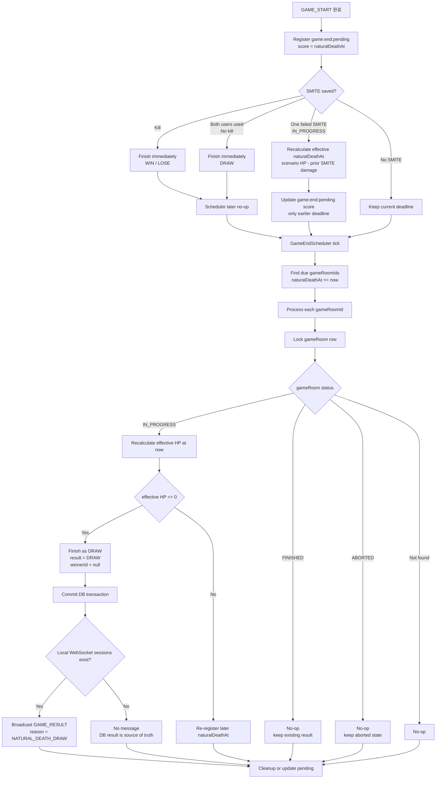
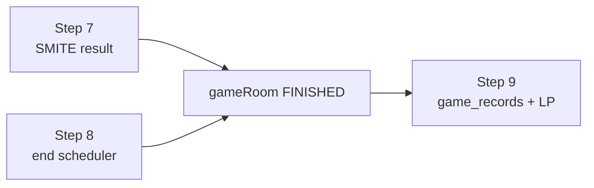

# Issue 50. 서버 스케줄러 기반 게임 종료 보장

## 📌 Feature Description

`GAME_START` 이후 등록된 `game:end:pending`을 서버 scheduler가 조회하고, WebSocket 연결 유무와 무관하게 gameRoom 종료를 보장한다.

드래곤 HP scenario는 원본 자연 HP timeline으로 유지한다. 실제 판정 HP는 원본 scenario HP에서 이전 SMITE 데미지를 차감한 effective HP다. 따라서 SMITE 실패 action이 저장되면 드래곤 자연사 시각도 앞당겨질 수 있다.

자연사 deadline은 `effective HP가 0이 되는 최초 시각`이다. SMITE가 없는 경우에는 scenario 마지막 시점인 `startAt + durationMs`가 deadline이고, SMITE 실패로 누적 데미지가 생기면 effective HP 기준으로 deadline을 다시 계산해 `game:end:pending` score를 앞당긴다.

SMITE로 이미 `FINISHED`된 gameRoom은 결과를 바꾸지 않고 no-op 처리한다. 아직 `IN_PROGRESS`인 gameRoom은 자연사 기준 `DRAW`로 확정한다. `ABORTED` 상태도 no-op 처리한다.

이번 이슈는 gameRoom 종료 보장, 자연사 `DRAW` 확정, `game:end:pending` cleanup, 중복 scheduler 실행에 대한 멱등성까지 다룬다. `game_records` 생성과 LP/배치/승급전 반영은 Step 9 범위로 분리한다.

### Policy Priority

1. SMITE 적용 후 effective HP가 `0` 이하이면 즉시 승패를 확정한다.
2. 두 유저가 모두 SMITE를 사용했고 kill이 없으면 즉시 `DRAW`로 확정한다.
3. 한 명만 SMITE를 실패했고 게임이 아직 `IN_PROGRESS`이면 effective naturalDeathAt을 앞당긴다.
4. 이후 추가 SMITE로 끝나지 않으면 scheduler가 effective naturalDeathAt에 자연사 `DRAW`를 확정한다.

### Feature Flow

### Scope Boundary

Step 7은 SMITE 처치 또는 양쪽 SMITE 실패로 즉시 종료되는 경우를 처리한다. Step 8은 아무 추가 입력 없이 시간이 끝난 gameRoom을 서버가 닫는 경우를 처리한다. Step 9는 이미 확정된 결과를 기록과 랭크 시스템에 반영한다.

## 📚 Tasks

### 1. 종료 pending 조회 확장

- [x] `GameEndScheduleStore`에 `naturalDeathAt`이 지난 gameRoom 조회 메서드를 추가한다.
- [x] Redis `game:end:pending` ZSET을 `rangeByScore(..., nowMillis)` 기준으로 조회한다.
- [x] 최초 `game:end:pending` score는 `startAtMillis + durationMs`로 등록하고, 자연사 종료에는 추가 입력 유예 시간을 더하지 않는다.
- [x] SMITE 실패 action 이후 effective HP 기준으로 더 빠른 자연사 시각이 나오면 `game:end:pending` score를 앞당길 수 있도록 store/service API를 추가한다.
- [x] scheduler batch size 정책을 상수로 둔다.
- [x] 조회 결과는 `Long gameRoomId` 목록으로 변환한다.
- [x] 잘못된 member 값은 scheduler 전체를 실패시키지 않도록 무시 또는 cleanup 처리한다.

> 실제 SMITE 실패 action 저장 후 effective naturalDeathAt을 계산하고 `advanceEndDeadlineIfEarlier`를 호출하는 연결은 `4. effective naturalDeathAt 계산`에서 처리한다.

### 2. 서버 scheduler 추가

- [x] `game/end/scheduler` 패키지에 `GameEndScheduler`를 추가한다.
- [x] `@Scheduled(fixedDelayString = ...)`로 주기적으로 game end 정산 service를 호출한다.
- [x] scheduler fixed delay는 자연사 결과 체감 지연이 크지 않도록 짧게 둔다.
- [x] scheduler 예외가 다음 tick을 막지 않도록 warn log를 남기고 종료한다.
- [x] scheduler는 직접 DB 상태를 변경하지 않고 end settlement service로 위임한다.

> `GameEndScheduler`는 scheduler wiring과 예외 격리만 담당한다. due 조회/row lock/자연사 `DRAW` 확정은 Step 3의 `GameEndSettlementService`와 core `GameNaturalDeathSettlementService`에서 처리한다.

### 3. 자연사 종료 정산 service 구현

- [x] `game/end/service` 패키지에 `GameEndSettlementService` 정산 진입점을 추가한다.
- [x] due gameRoomId를 조회하고 gameRoom별 정산을 수행한다.
- [x] 정산 시점에 gameRoom row lock 안에서 action 목록을 다시 조회해 effective HP를 재계산한다.
- [x] due로 조회됐더라도 effective HP가 아직 `0`보다 크면 더 늦은 naturalDeathAt으로 pending score를 갱신하고 종료하지 않는다.
- [x] 정산 완료 또는 no-op 이후 `game:end:pending`을 cleanup한다.
- [x] cleanup은 DB 상태 처리 이후 best-effort로 수행한다.
- [x] 같은 gameRoomId가 중복 조회되거나 scheduler가 중복 실행돼도 최종 결과가 바뀌지 않도록 멱등 처리한다.

> `GameEndSettlementService`는 Redis due 목록/cleanup/update만 담당하고, row lock + action 재조회 + 자연사 `DRAW` 판정은 core의 `GameNaturalDeathSettlementService`가 담당한다. 자연사 `DRAW`에 대한 WebSocket `GAME_RESULT` broadcast는 Step 6 범위로 남긴다.

### 4. effective naturalDeathAt 계산

- [ ] 원본 scenario는 수정하지 않고 자연 HP timeline으로 유지한다.
- [ ] effective HP는 `scenarioHpAt(timeMs) - priorSmiteDamageSum`으로 계산한다.
- [ ] SMITE 실패 action 저장 후 누적 SMITE 데미지를 반영해 effective HP가 최초로 `0` 이하가 되는 시각을 계산한다.
- [ ] scenario step 사이에 deadline이 생기면 선형 보간 기준으로 최초 `0` 도달 시각을 계산한다.
- [ ] 계산된 naturalDeathAt이 현재 pending score보다 빠른 경우에만 score를 앞당긴다.
- [ ] 이미 SMITE kill 또는 양쪽 SMITE 실패 DRAW로 `FINISHED`된 경우에는 naturalDeathAt을 갱신하지 않는다.
- [ ] 계산 책임은 API WebSocket handler가 아니라 game end 또는 core 도메인 service로 분리한다.

### 5. core gameRoom 종료 primitive 보강

- [ ] `GameRoomCommandService`에 자연사 `DRAW` 종료 메서드를 추가한다.
- [ ] gameRoom row lock을 잡고 DB 상태를 최종 기준으로 판정한다.
- [ ] `IN_PROGRESS`이면 `GameResult.DRAW`, `winnerId = null`로 `FINISHED` 전환한다.
- [ ] participants는 `FINISHED`로 전환한다.
- [ ] 이미 `FINISHED`이면 기존 결과를 유지하고 no-op 처리한다.
- [ ] `ABORTED`이면 상태를 바꾸지 않고 no-op 처리한다.
- [ ] 없는 gameRoom은 no-op 처리한다.

### 6. GAME_RESULT 공용화와 자연사 결과 응답

- [ ] 최종 결과 payload와 sender가 SMITE 전용 패키지에 묶여 있는 구조를 공용 result 패키지로 정리한다.
- [ ] `GAME_RESULT` reason에 `NATURAL_DEATH_DRAW`를 추가한다.
- [ ] 자연사 `DRAW`로 새로 `FINISHED`된 경우 연결된 local WebSocket session에만 `GAME_RESULT`를 broadcast한다.
- [ ] 연결된 session이 없으면 메시지 전송 없이 DB 결과를 최종 기준으로 둔다.
- [ ] `GAME_RESULT` 전송 실패가 `game:end:pending` cleanup을 막지 않도록 전송과 cleanup 실패 지점을 분리한다.
- [ ] 이미 `FINISHED` 또는 `ABORTED`인 no-op 케이스에서는 새 `GAME_RESULT`를 보내지 않는다.

### 7. 테스트

- [ ] Redis store가 `naturalDeathAt <= now`인 gameRoom만 조회하는지 검증한다.
- [ ] 자연사 deadline이 `startAtMillis + durationMs`로 등록되고 추가 grace가 붙지 않는지 검증한다.
- [ ] SMITE 실패 action 저장 후 effective naturalDeathAt이 앞당겨지는지 검증한다.
- [ ] SMITE 실패 action이 여러 개일 때 누적 데미지 기준으로 naturalDeathAt이 계산되는지 검증한다.
- [ ] effective naturalDeathAt이 scenario step 사이에 있을 때 선형 보간으로 계산되는지 검증한다.
- [ ] due 조회된 gameRoom의 effective HP가 아직 `0`보다 크면 종료하지 않고 pending score를 갱신하는지 검증한다.
- [ ] `IN_PROGRESS` gameRoom이 자연사 `DRAW`로 `FINISHED` 되는지 검증한다.
- [ ] 자연사 `DRAW` 시 participants가 `FINISHED` 되는지 검증한다.
- [ ] 이미 `FINISHED`인 gameRoom은 결과가 바뀌지 않는지 검증한다.
- [ ] `ABORTED` gameRoom은 결과가 생기지 않고 상태가 유지되는지 검증한다.
- [ ] 정산 완료 또는 no-op 이후 `game:end:pending` cleanup이 수행되는지 검증한다.
- [ ] 같은 gameRoom을 두 번 정산해도 결과가 바뀌지 않는지 검증한다.
- [ ] 자연사 `DRAW`로 새로 종료된 경우에만 `GAME_RESULT` broadcast가 호출되는지 검증한다.
- [ ] `GAME_RESULT` broadcast가 실패해도 정산 결과가 rollback 되지 않고 pending cleanup이 시도되는지 검증한다.
- [ ] WebSocket session이 없어도 DB 정산은 성공하는지 검증한다.

### 8. 문서 정합성

- [ ] `docs/project/policy.md`에 자연사 종료와 scheduler 책임을 반영한다.
- [ ] `docs/project/domain status.md`에 `game:end:pending` 정산 흐름을 반영한다.
- [ ] `docs/project/websocket client.md`에 자연사 `GAME_RESULT` reason을 반영한다.
- [ ] `docs/DB/DDL.md`와 실제 entity 변경 여부를 비교한다.
- [ ] Step 9의 `game_records`/LP 반영이 이번 이슈 범위가 아님을 문서에 명시한다.

## 📝 Note

- DB 상태가 최종 기준이다. Redis `game:end:pending`은 scheduler 후보 목록일 뿐 결과의 source of truth가 아니다.
- 자연사 종료는 effective HP 기준으로 즉시 대상이 된다. 서버 수신 시각이 effective naturalDeathAt을 지난 SMITE는 저장하지 않고 자연사 정산 결과를 따른다.
- scenario는 원본 timeline으로 보존한다. SMITE 데미지는 action으로만 저장하고, 현재 HP와 자연사 deadline은 scenario와 action을 합성해 계산한다.
- SMITE 즉시 종료와 scheduler 자연사 종료가 경합해도 gameRoom row lock과 상태 조건으로 한쪽만 결과를 확정해야 한다.
- 자연사 종료는 `DRAW` 정책으로 처리한다. 이 정책은 현재 2인 게임과 유저당 SMITE 1회 정책을 전제로 한다.
- `GAME_RESULT` 전송은 사용자 경험 보조 경로다. 연결이 없거나 전송에 실패해도 DB 결과 확정은 되돌리지 않는다.
- `game_records` 생성, LP 반영, 배치/승급전 처리는 Step 9에서 처리한다.
