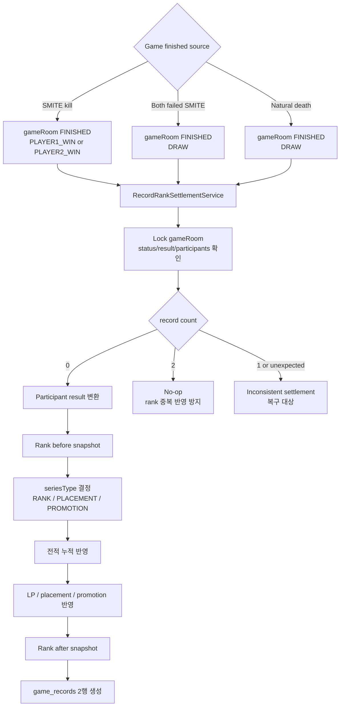
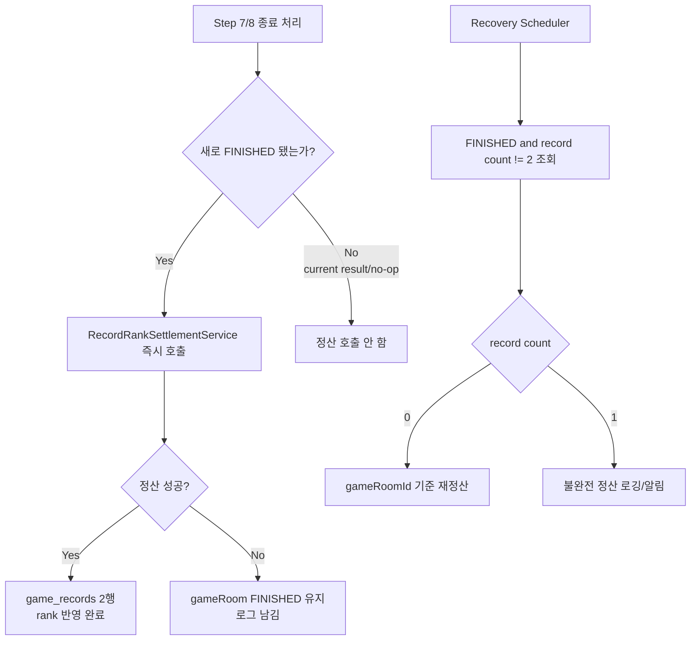
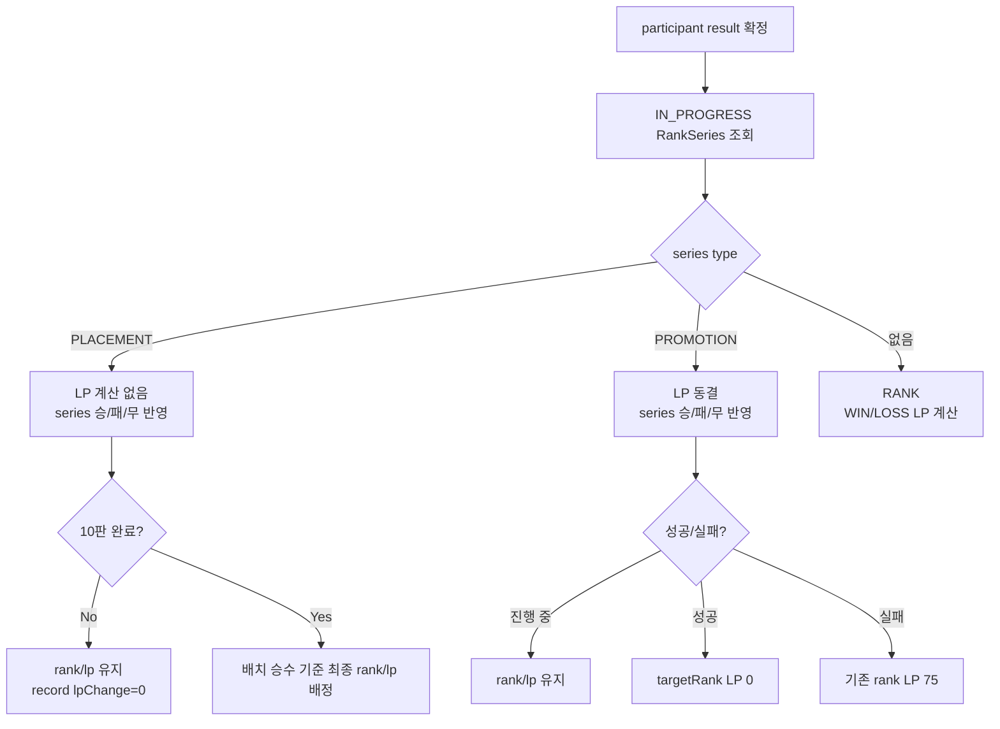
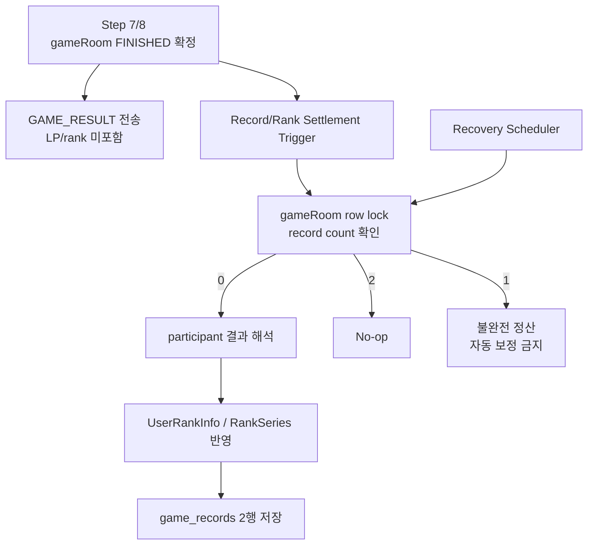

# Issue 52. 게임 종료와 record/rank 연결

## 📌 Feature Description

이미 `FINISHED`로 확정된 gameRoom 결과를 기준으로 참가자별 `game_records`를 생성하고, 승패/무승부 결과를 랭크 시스템에 반영한다.

Step 7/8은 gameRoom 종료 확정까지만 담당한다. Step 9는 종료된 gameRoom을 후처리하여 record, LP, 배치/승급전 진행 상태를 일관되게 반영한다.



핵심 정책은 다음과 같다.

- `game_rooms.status/result/winnerId`가 게임 결과의 source of truth다.
- `game_records`는 gameRoom 결과가 확정된 뒤 참가자 관점으로 저장한다.
- 하나의 gameRoom에는 유저별 record가 한 번만 생성되어야 한다.
- gameRoom 종료 확정 transaction과 record/rank 정산 transaction은 분리한다.
- record/rank 정산 내부에서는 record 생성, 누적 전적, LP, 배치/승급전 반영을 같은 transaction 안에서 처리한다.
- 멀티 인스턴스 환경에서 record/rank 정산은 local memory에 의존하지 않고 DB row lock, record count, unique constraint를 기준으로 멱등하게 처리한다.
- WebSocket `GAME_RESULT` 전송 성공 여부와 record/rank 정산은 분리한다.
- `ABORTED` gameRoom은 record를 만들지 않고 LP/배치/승급전도 반영하지 않는다.
- `DRAW`는 record를 저장하지만 LP는 변동하지 않는다.
- `game_records`의 시리즈 구분은 `RANK`, `PLACEMENT`, `PROMOTION`으로 명시한다.

### Record series 표현 정책

`game_records`는 일반 랭크 게임, 배치 게임, 승급전 게임을 모두 표현해야 한다. 기존 `promotionSeriesId`, `isPromotionGame` 구조는 승급전만 표현하는 이름이므로 Step 9에서는 다음 구조를 사용한다.

```java
public enum GameRecordSeriesType {
    RANK,
    PLACEMENT,
    PROMOTION
}
```

| seriesType | rankSeriesId | 의미 | LP 처리 | series 처리 |
|------------|--------------|------|---------|-------------|
| `RANK` | 없음 | 일반 랭크 게임 | WIN/LOSS 기준 LP 반영, DRAW는 0 | 일반 LP 결과에 따라 승급전 진입 가능 |
| `PLACEMENT` | 있음 | 배치 진행 중 게임 | 배치 중 LP 변동 없음 | RankSeries 승/패/무 반영, 10판 완료 시 최종 rank 배정 |
| `PROMOTION` | 있음 | 승급전 진행 중 게임 | 승급전 중 LP 동결 | RankSeries 승/패/무 반영, 성공/실패 시 rank/LP 확정 |

- `promotionSeriesId`는 `rankSeriesId`로 변경한다.
- `isPromotionGame`은 제거하고 `seriesType`으로 대체한다.
- `seriesType`은 nullable로 두지 않고 기본값 `RANK`를 사용한다.
- `RANK` record는 연결할 RankSeries가 없으므로 `rankSeriesId`를 비워둔다.
- `PLACEMENT`와 `PROMOTION` record는 진행 중인 RankSeries id를 `rankSeriesId`에 저장한다.
- DDL과 entity는 `promotion_series_id -> rank_series_id`, `is_promotion_game 제거`, `series_type not null default 'RANK'` 방향으로 맞춘다.

### 누적 전적 반영 정책

`FINISHED` gameRoom으로 생성되는 record는 `UserRankInfo` 누적 전적에도 반영한다.

| participant result | UserRankInfo 반영 |
|--------------------|-------------------|
| `WIN` | `totalWins + 1` |
| `LOSS` | `totalLosses + 1` |
| `DRAW` | `totalDraws + 1` |

- `RANK`, `PLACEMENT`, `PROMOTION` 모두 누적 전적 반영 대상이다.
- `ABORTED`, `READY`, `IN_PROGRESS` gameRoom은 record와 누적 전적 모두 반영하지 않는다.
- 누적 전적 반영은 `UserRankInfo` 도메인 primitive로 캡슐화한다.
- 정산 service는 `UserRankInfo.applyRecordResult(GameRecordResult result)` 같은 primitive를 호출하고 필드 증가 로직을 직접 들고 있지 않는다.

### Transaction 경계 정책

gameRoom 종료 확정과 record/rank 정산은 서로 다른 transaction으로 분리한다.

```mermaid
sequenceDiagram
    participant End as Step 7/8 종료 처리
    participant Room as game_rooms
    participant Result as GAME_RESULT
    participant Settle as RecordRankSettlementService
    participant Record as game_records/rank
    participant Retry as Recovery Scheduler

    End->>Room: FINISHED/result/winnerId 확정
    Room-->>End: commit
    End->>Result: GAME_RESULT broadcast
    End->>Settle: 새로 FINISHED 된 gameRoom 즉시 정산 요청
    Settle->>Room: FINISHED gameRoom row lock
    Settle->>Record: record/rank/stat/series 같은 transaction 반영
    Record-->>Settle: commit or rollback
    Retry->>Settle: FINISHED but record count != 2 대상 조회
```

- gameRoom `FINISHED`는 Step 7/8 transaction에서 먼저 확정한다.
- record/rank 정산은 `FINISHED` gameRoom을 source of truth로 삼아 별도 transaction에서 수행한다.
- record/rank 정산 실패는 gameRoom `FINISHED` 상태와 `GAME_RESULT` 전송을 rollback하지 않는다.
- record/rank 정산 내부에서는 `game_records` 생성, `UserRankInfo` 누적 전적/LP, `RankSeries` 반영을 하나의 transaction으로 묶는다.
- 정산 실패 시 gameRoom은 `FINISHED`로 남아야 하며, `gameRoomId` 기준으로 재시도할 수 있어야 한다.
- API 인스턴스 local WebSocket session registry는 `GAME_RESULT` 전송에만 사용하고, record/rank 정산의 완료 판단이나 재시도 판단에는 사용하지 않는다.

### 정산 호출 정책

record/rank 정산은 즉시 호출과 복구 scheduler를 함께 사용한다.



- Step 7/8에서 새로 `FINISHED` 된 gameRoom에 대해서만 record/rank 정산을 즉시 호출한다.
- 이미 `FINISHED`였던 current result 재응답, scheduler no-op, abort 흐름에서는 정산을 호출하지 않는다.
- 즉시 정산 실패는 `GAME_RESULT` 전송 흐름과 gameRoom 종료 확정을 막지 않는다.
- 즉시 정산 실패 로그에는 `gameRoomId`, `result`, `winnerId`, record count를 포함한다.
- 복구 scheduler는 `FINISHED` 상태인데 `game_records`가 2행이 아닌 gameRoom을 주기적으로 조회한다.
- `record count == 0`은 재정산 대상이다.
- `record count == 1`은 불완전 정산 상태로 로깅/알림하고 자동 보정하지 않는다.
- DB outbox/event 기반 비동기 정산은 MVP 범위에서 제외하고, 필요 시 후속 이슈로 분리한다.

### 결과 응답/API 정책

`GAME_RESULT`는 Step 7/8의 게임 종료 확정 이벤트로 유지하고, record/rank 정산 결과 payload를 섞지 않는다.

| 경로 | 책임 | 포함 정보 |
|------|------|-----------|
| WebSocket `GAME_RESULT` | 즉시 게임 종료 알림 | `gameRoomId`, `result`, `winnerUserId`, `reason`, `finishedAt`, `actions` |
| record/rank summary 조회 API | 최종 결과 화면의 랭크/전적 정보 | 후속 Issue 60에서 설계 |

- `GAME_RESULT`에는 LP delta, rank delta, series 진행 상태를 포함하지 않는다.
- 클라이언트가 최종 결과 화면에서 랭크 정보를 보여줘야 하면 후속 Issue 60의 별도 조회 API로 record/rank summary를 조회한다.
- 이번 Issue 52는 record/rank 저장과 정산 멱등성까지 담당하고, 조회 API 구현은 포함하지 않는다.

### 멱등성 완료 판단 정책

정상 정산 완료 상태는 gameRoom 참가자 2명에 대응하는 `game_records` 2행이다.

| countByGameRoomId | 처리 |
|-------------------|------|
| `0` | 정산 수행 |
| `2` | 정산 완료로 보고 no-op |
| `1` | 불완전 정산 상태로 보고 예외/복구 대상 처리 |
| 그 외 | 참가자 수 또는 데이터 정합성 오류로 처리 |

- `existsByGameRoomId`는 완료 판단 기준으로 사용하지 않는다.
- 주 판단 기준은 gameRoom row lock과 `countByGameRoomId`다.
- `uk_game_records_room_user` unique constraint는 동시성 마지막 방어선으로만 사용한다.
- `count == 1` 상태에서는 rank 중복 반영 가능성이 있으므로 자동으로 나머지 1행만 채우지 않는다.

### Placement/PROMOTION LP 처리 순서

LP 계산보다 진행 중 RankSeries 확인이 먼저다.



- `PLACEMENT` 중에는 WIN/LOSS여도 일반 LP 계산을 하지 않는다.
- `PLACEMENT` 중 `lpChange=0`, `lpBefore=lpAfter`로 저장한다.
- 배치 완료 게임의 `rankAfter`/`lpAfter`는 최종 배정 rank/LP를 저장한다.
- 배치 중 내부 rank snapshot은 현재 `UserRankInfo.rank`를 저장한다.
- 클라이언트 표시는 `seriesType=PLACEMENT`이면 내부 rank snapshot과 별개로 `Unranked`로 해석한다.
- `PROMOTION` 중에는 일반 LP 계산을 하지 않고 LP를 동결한다.
- 승급전 성공 시 `targetRank`와 LP 0을 반영한다.
- 승급전 실패 시 기존 rank와 LP 75를 반영한다.
- `RANK`는 일반 랭크 게임으로 WIN/LOSS LP 계산, DRAW LP 0, 승급전 진입/강등 정책을 적용한다.

## 📚 Tasks

### 1. 종료 결과 정산 책임 경계 확정

- [x] Step 7 SMITE kill 종료, 양쪽 실패 SMITE DRAW 종료, Step 8 자연사 DRAW 종료 이후 record/rank 정산을 호출할 지점 확정
- [x] gameRoom 종료 확정 transaction과 record/rank 정산 transaction을 분리
- [x] record/rank 정산 실패가 WebSocket 결과 전송과 gameRoom `FINISHED` 확정을 rollback하지 않도록 구성
- [x] DB outbox/event 기반 비동기 정산은 MVP 범위에서 제외하고 후속 이슈로 분리
- [x] 이번 이슈에서는 WebSocket `GAME_RESULT` payload를 확장하지 않고 LP/rank/series 정보는 후속 Issue 60 조회 API로 분리
- [x] `game_records`/rank 반영은 API WebSocket handler가 아니라 별도 application/core service로 위임

### 2. core gameRoom 결과 해석 primitive 추가

- [x] `smite-core` game domain/service 영역에 FINISHED gameRoom 결과를 참가자 관점 result로 변환하는 로직 추가
- [x] `GameResult.PLAYER1_WIN`이면 첫 participant는 `WIN`, 두 번째 participant는 `LOSS`로 변환
- [x] `GameResult.PLAYER2_WIN`이면 첫 participant는 `LOSS`, 두 번째 participant는 `WIN`으로 변환
- [x] `GameResult.DRAW`이면 두 participant 모두 `DRAW`로 변환
- [x] participant 순서가 `PLAYER1_WIN`/`PLAYER2_WIN` 의미와 일치하는지 테스트로 고정
- [x] winnerId와 participants 불일치 시 예외 또는 no-op 정책 정의

### 3. GameRecord 생성 service 구현

- [x] `smite-core` `domain/record/service` 패키지를 추가하고 record 생성 책임을 둔다.
- [x] `GameRecordRepository`에 `countByGameRoomId`, `findByGameRoomId` 추가
- [x] `game_records`의 `uk_game_records_room_user` unique 제약을 멱등성 보조 장치로 사용
- [x] record 생성 전 gameRoom이 `FINISHED`인지 검증
- [x] `ABORTED`, `READY`, `IN_PROGRESS` gameRoom은 record 생성 대상에서 제외
- [x] 참가자 2명이 아니면 record 생성 실패 처리
- [x] 각 participant에 대해 opponentId, result, lpBefore, lpAfter, lpChange, rankBefore, rankAfter 저장
- [x] `promotionSeriesId`/`isPromotionGame`을 `rankSeriesId`/`seriesType`으로 전환
- [x] `GameRecordSeriesType`은 `RANK`, `PLACEMENT`, `PROMOTION`을 표현
- [x] 중복 호출 시 기존 record/rank 결과를 유지하고 no-op 처리

### 4. rank 반영 service 보강

- [x] 기존 `RankCommandService`는 초기 랭크 생성만 담당하므로 게임 결과 반영 유스케이스 추가
- [x] `UserRankInfoRepository`에 userId 기반 lock 조회가 필요한지 검토하고, 동시 정산 중복 반영 방지
- [x] `UserRankInfo`에 `applyRecordResult(GameRecordResult result)` primitive를 추가해 totalWins/totalLosses/totalDraws를 캡슐화
- [x] `RANK`, `PLACEMENT`, `PROMOTION` 모두 FINISHED record 생성 시 누적 전적을 반영
- [x] WIN/LOSS는 `Rank.calculateWinLp`, `Rank.calculateLossLp` 정책을 사용해 LP 변경량 계산
- [x] DRAW는 `lpChange=0`, `lpBefore=lpAfter`, `rankBefore=rankAfter`로 처리
- [x] LP 변경 후 일반 티어 승급전 진입/강등 정책을 현재 rank 도메인 정책과 맞게 정리
- [x] Apex 자동 승급/강등은 후속 Issue 59 범위로 분리하고 이번 이슈에서는 처리하지 않음
- [x] rank 변경 전후 snapshot을 record에 저장할 수 있도록 결과 객체 반환
- [x] rank 반영 실패 시 record 생성도 rollback되도록 transaction 구성

### 5. 배치/승급전 시리즈 반영

- [x] `RankSeriesRepository.findByUserIdAndStatus(userId, IN_PROGRESS)`를 이용해 진행 중 시리즈 조회
- [x] LP 계산보다 진행 중 RankSeries 조회와 `seriesType` 결정을 먼저 수행
- [x] 진행 중 placement가 있으면 LP를 계산하지 않고 WIN/LOSS/DRAW를 series에 반영
- [x] placement 미완료 시 `lpChange=0`, `lpBefore=lpAfter`, 내부 rank snapshot 유지
- [x] placement 완료 시 정책 승수표에 따라 최종 rank/LP를 배정하고 마지막 배치 record의 `rankAfter`/`lpAfter`에 반영
- [x] 진행 중 promotion이 있으면 일반 LP를 계산하지 않고 WIN/LOSS/DRAW를 series에 반영
- [x] promotion 성공 시 `targetRank`와 LP 0을 반영
- [x] promotion 실패 시 기존 rank와 LP 75를 반영
- [x] record의 `rankSeriesId`, `seriesType` 필드에 series 정보를 저장
- [x] `seriesType=PLACEMENT` record는 클라이언트에서 Unranked 표시로 해석하도록 문서화

### 6. API 종료 흐름 연결

- [x] `smite-api` 게임 종료 orchestration 영역에서 record/rank 정산 service를 호출
- [x] SMITE kill로 새로 `FINISHED` 된 경우에만 정산 호출
- [x] 양쪽 실패 SMITE DRAW로 새로 `FINISHED` 된 경우에만 정산 호출
- [x] 자연사 DRAW로 새로 `FINISHED` 된 경우에만 정산 호출
- [x] 이미 `FINISHED`인 gameRoom에 늦게 도착한 SMITE current result 재응답에서는 정산을 다시 호출하지 않음
- [x] scheduler no-op 케이스에서는 정산 호출하지 않음
- [x] abort 흐름에서는 record/rank 정산을 호출하지 않음
- [x] 정산 실패 로그에 gameRoomId, result, winnerId, record count를 포함

### 7. 멱등성과 실패 복구

- [x] record/rank 정산 진입점은 gameRoomId 기준 멱등하게 동작
- [x] `countByGameRoomId == 0`이면 정산 수행
- [x] `countByGameRoomId == 2`이면 rank를 다시 반영하지 않고 no-op
- [x] `countByGameRoomId == 1`이면 불완전 정산 상태로 보고 예외/복구 대상 처리
- [x] unique constraint 충돌은 완료 판단 기준이 아니라 동시성 보조 방어선으로 처리
- [x] FINISHED인데 record count가 2가 아닌 gameRoom을 조회하는 복구 scheduler 추가
- [x] 복구 scheduler는 `count == 0`만 재정산하고 `count == 1`은 로깅/알림 대상으로 분리
- [x] SMITE 종료와 scheduler 종료가 경합해도 하나의 gameRoom 결과만 record로 남는지 검증
- [x] rank 반영 중 예외 발생 시 record insert가 rollback되는지 검증

### 8. 조회/API 후속 분리

- [x] `GAME_RESULT` payload에는 LP/rank/series 정보를 추가하지 않고 기존 종료 결과 정보만 유지
- [x] 클라이언트 최종 결과 화면용 gameRoomId 기준 record/rank summary 조회 endpoint는 후속 Issue 60으로 분리
- [x] Issue 52에서는 조회 API 구현 없이 record/rank 정산 저장 완료 상태까지만 보장

### 9. 테스트

- [x] `PLAYER1_WIN` 결과가 두 participant record의 `WIN/LOSS`로 변환되는지 검증
- [x] `PLAYER2_WIN` 결과가 두 participant record의 `LOSS/WIN`으로 변환되는지 검증
- [x] `DRAW` 결과가 두 participant record의 `DRAW/DRAW`, `lpChange=0`으로 저장되는지 검증
- [x] FINISHED가 아닌 gameRoom은 record/rank 정산 대상이 아닌지 검증
- [x] 같은 gameRoom을 두 번 정산해도 record/rank가 중복 반영되지 않는지 검증
- [x] `countByGameRoomId == 1` 불완전 정산 상태에서 예외/복구 대상으로 처리되는지 검증
- [x] `RANK`, `PLACEMENT`, `PROMOTION` seriesType과 rankSeriesId 저장 정책을 검증
- [x] FINISHED record 생성 시 totalWins/totalLosses/totalDraws가 반영되는지 검증
- [x] record 생성과 rank 반영이 같은 transaction으로 rollback되는지 검증
- [x] placement series 진행 중인 유저의 결과가 LP 변동 없이 series에 반영되는지 검증
- [x] placement 완료 게임의 `rankAfter`/`lpAfter`가 최종 배정 결과로 저장되는지 검증
- [x] promotion series 진행 중인 유저의 결과가 일반 LP 계산 없이 series에 반영되는지 검증
- [x] promotion 성공/실패 게임의 `rankAfter`/`lpAfter`가 최종 결과로 저장되는지 검증
- [x] SMITE kill, both smite draw, natural death draw 경로에서 정산 호출이 연결되는지 API service test로 검증
- [x] 이미 FINISHED인 current result 재응답과 scheduler no-op에서는 정산을 호출하지 않는지 검증
- [x] 복구 scheduler가 FINISHED + record count 0 gameRoom을 재정산하는지 검증
- [x] 복구 scheduler가 record count 1 gameRoom을 자동 보정하지 않는지 검증

### 10. 문서 정합성

- [x] `docs/project/policy.md`에 gameRoom 종료 후 record/rank 정산 책임과 멱등성 정책 반영
- [x] `docs/project/domain status.md`에 `FINISHED -> RECORDED` 흐름과 record/rank 상태 반영
- [x] `docs/project/websocket client.md`에 `GAME_RESULT` payload 미확장과 별도 record/rank summary 조회 API 후속 분리 정책 반영
- [x] `docs/DB/DDL.md`의 `game_records` unique 제약, `rank_series_id`, `series_type` entity 정합성 재확인
- [x] `plan-checkpoint.md` Step 9 / Issue 52 체크 상태를 구현 완료 후 갱신

## 📝 Note

- `GameRecord` entity와 `game_records` unique 제약은 Step 9 정산의 멱등성 보조 장치로 사용한다.
- `GameRecord`는 `rankSeriesId`, `seriesType`으로 일반 랭크/배치/승급전을 표현하며, `promotionSeriesId`, `isPromotionGame` 구조는 사용하지 않는다.
- `RankCommandService`는 초기 rank 생성뿐 아니라 FINISHED gameRoom 결과의 누적 전적, LP, RankSeries 반영 유스케이스를 담당한다.
- `RankSeries`는 placement/promotion 진행도와 완료 상태 primitive를 갖고, Step 9 정산에서 결과를 반영한다.
- `UserRankInfo`의 totalWins/totalLosses/totalDraws는 Step 9 정산에서 record 생성과 같은 transaction으로 반영한다.
- 이번 이슈는 Step 7/8의 종료 결과를 바꾸지 않고, 확정된 결과를 record/rank로 반영하는 후처리다.
- Step 9 정산은 즉시 호출과 복구 scheduler 조합으로 처리하고, DB outbox/event는 후속 범위로 둔다.
- Redis `IN_GAME` cleanup은 후속 Issue 58, record/rank summary 조회 API는 후속 Issue 60, Apex 자동 승급/강등은 후속 Issue 59로 분리한다.
- Apex/배치 매칭 정책 정합성은 후속 Issue 53/54로 분리한다.


-----
## PR

## 📌 Summary



게임 종료 확정 이후 `game_rooms.status/result/winnerId`를 source of truth로 삼아 `game_records` 생성, 누적 전적, LP, 배치/승급전 진행도를 정산하는 흐름을 구현함.

핵심 정책은 gameRoom 종료 transaction과 record/rank 정산 transaction을 분리하고, `GAME_RESULT`는 즉시 종료 알림으로 유지하며, 최종 LP/rank/series 정보는 후속 summary API로 분리하는 것임.

## 📚 Changes

### 1. 종료 확정과 record/rank 정산 transaction 분리

- Step 7/8은 gameRoom 결과 확정과 `GAME_RESULT` 전송까지만 책임지도록 유지함.
- record/rank 정산은 `TransactionSynchronization.afterCommit()` 이후 별도 trigger로 호출함.
- 종료 transaction 안에서 record/rank까지 같이 처리하면 한 transaction 안에서 사용자에게 보내야 할 종료 결과와 랭크 정산 실패가 강하게 묶임.
- 이 PR은 `DB gameRoom FINISHED = 게임 결과 확정`을 먼저 보장하고, record/rank는 확정된 결과를 따라가는 후처리로 분리함.
- 트레이드오프: 즉시 결과 화면에서 LP/rank를 바로 받을 수는 없지만, 게임 결과 확정 안정성, WebSocket 전송 독립성, 정산 재시도 가능성을 우선함.

### 2. DB 기준 멱등성 설계

- 정산 진입점은 `gameRoomId` 하나로 고정하고, 먼저 `game_rooms` row lock을 획득함.
- lock 이후 `countByGameRoomId`로 정산 상태를 다시 판단함.
  - `0`: 아직 어떤 record/rank도 반영되지 않은 상태로 보고 정산 수행
  - `2`: 참가자 2명분 정산 완료로 보고 no-op
  - `1`: record/rank 반영이 일부만 완료됐을 수 있는 불완전 정산으로 보고 예외/복구 대상 처리
- `uk_game_records_room_user` unique constraint는 정산 완료 판단 기준이 아니라 동시성 마지막 방어선으로 둠.
- 이 구조는 SMITE 즉시 종료, 자연사 scheduler, recovery scheduler가 같은 gameRoom을 동시에 보더라도 lock 안에서 같은 완료 판단을 하도록 만든 선택임.
- 트레이드오프: unique constraint 충돌만으로 멱등성을 처리하면 rank 누적 전적/LP가 이미 반영된 뒤 record insert에서 실패하는 중간 상태를 설명하기 어렵기 때문에, DB row lock + record count를 1차 정책으로 둠. 대신 lock 구간이 생기지만 gameRoom 단위 정산이라 contention 범위를 작게 제한함.
- `count == 1`을 자동 보정하지 않는 이유는 남은 1행만 채우는 순간 이미 반영됐을 수 있는 rank 변화와 record snapshot의 정합성을 복구하기 어렵기 때문임. 따라서 자동 수정보다 운영 탐지/로그를 선택함.

### 3. RankSeries 우선 판정

- LP 계산보다 진행 중 `RankSeries`를 먼저 lock 조회함.
- `PLACEMENT`는 LP 계산 없이 series 승/패/무를 반영하고 10판 완료 시 승수표 기준 rank/LP를 배정함.
- `PROMOTION`은 LP를 동결하고 성공 시 `targetRank + LP 0`, 실패 시 기존 rank `LP 75`를 반영함.
- Rank snapshot은 record 생성 전에 rank service에서 before/after를 확정해 반환하고, record는 그 결과만 저장함.
- 트레이드오프: 일반 RANK 계산과 시리즈 계산이 분기되지만, 배치/승급전 정책이 일반 LP 공식과 섞이지 않아 정책 해석이 명확해짐. 또한 `RankSeries`를 먼저 판단하지 않으면 배치/승급전 게임에 일반 LP 공식이 잘못 적용될 수 있어, 조회 순서를 정책으로 고정함.

### 4. rank 반영의 lock 경계와 rollback 경계

- `UserRankInfo`는 userId 기준 pessimistic lock으로 조회하고, 참가자/상대 유저 id를 정렬해 lock 순서를 고정함.
- 진행 중 `RankSeries`도 정산 transaction 안에서 조회해 series 진행도와 rank snapshot이 같은 transaction 안에서 결정되도록 함.
- `game_records` 저장은 rank 반영 결과를 받은 뒤 수행하므로, rank 반영 중 예외가 발생하면 record insert도 수행되지 않음.
- 트레이드오프: lock 범위가 늘어나지만 record, 누적 전적, LP, RankSeries, record snapshot이 서로 다른 시점의 값을 담는 문제를 막기 위해 하나의 정산 transaction으로 묶음. 특히 양 참가자의 before snapshot은 반영 전 상태를 기준으로 계산해야 하므로, lock 순서와 snapshot 시점을 명시적으로 고정함.

### 5. API와 core 관심사 분리

- API 모듈은 종료 흐름 orchestration, trigger, recovery scheduler만 담당함.
- `game_records`, `RankSeries`, `UserRankInfo` 조회/변경은 core service 내부에서 처리함.
- API에서 core repository를 직접 참조하지 않도록 정리해 `API -> core service -> repository/domain` 경계를 유지함.
- 트레이드오프: API에서 repository를 직접 호출하면 코드량은 줄지만, 정산 완료 판단과 record count 정책이 API orchestration에 새어 나감. 이 PR에서는 정책 판단을 core에 모아 후속 API/스케줄러가 같은 정산 규칙을 재사용하게 함.

### 6. Recovery scheduler 추가

- 즉시 정산 trigger가 실패하거나 API 인스턴스가 중간에 죽을 수 있으므로, `FINISHED`인데 `game_records`가 2행이 아닌 gameRoom을 주기적으로 조회함.
- recovery scheduler도 정산 service를 직접 재사용하고, 후보별 record count를 다시 확인함.
  - `0`: 자동 재정산
  - `1`: 자동 보정 금지, 불완전 정산 로그
  - `2`: 이미 다른 흐름에서 회복된 상태로 no-op
- 트레이드오프: DB outbox/event 기반 정산은 이벤트 유실과 처리 상태를 더 명확히 모델링할 수 있지만 이번 범위에서는 새 테이블과 운영 복잡도가 커짐. 그래서 MVP에서는 조회 기반 scheduler를 선택하고, 불완전 정산을 자동 수정하지 않는 보수적 복구 정책으로 안정성을 확보함.

### 7. `GAME_RESULT` payload 미확장

- `GAME_RESULT`는 종료 확정 이벤트로 유지하고, record/rank 정산 결과를 payload에 섞지 않음.
- LP/rank/series 정보는 후속 record/rank summary API에서 DB 정산 완료 상태를 기준으로 조회하도록 분리함.
- 트레이드오프: 클라이언트가 최종 결과 화면에서 추가 조회를 해야 하지만, WebSocket 종료 알림이 record/rank 정산 성공 여부에 종속되지 않음. 또한 정산이 지연되거나 recovery scheduler로 복구되는 경우에도 `GAME_RESULT` 계약이 흔들리지 않음.

## 📝 Note

- `GAME_RESULT` payload에는 LP/rank/series delta를 추가하지 않음.
- record/rank summary 조회 API, Redis `IN_GAME` cleanup, Apex 자동 승급/강등은 후속 이슈로 분리함.
- 테스트는 결과 변환, 멱등성, RankSeries 반영, API trigger, recovery scheduler, payload 미확장을 기준으로 보강함.

## 📌 Related Issue
- Closes #52
