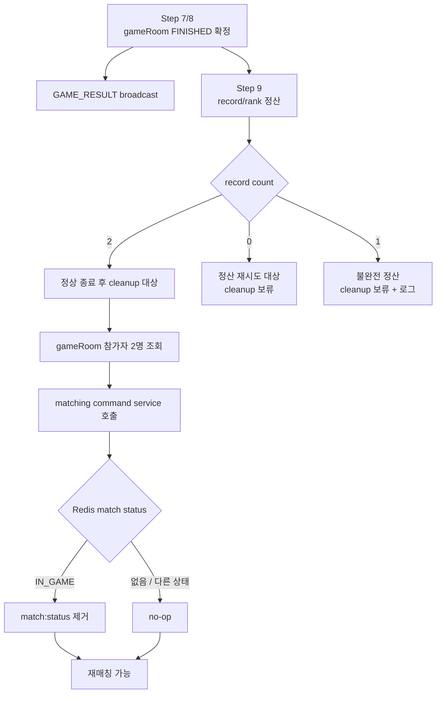
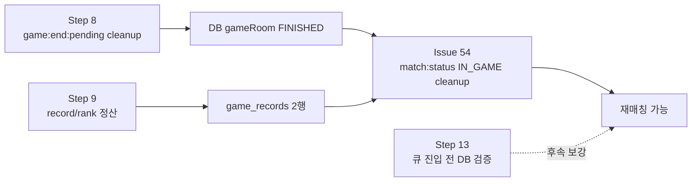

# Issue 54. 정상 종료 후 매칭 점유 상태 cleanup

## 📌 Feature Description

정상 종료된 gameRoom의 참가자들이 다시 매칭 큐에 진입할 수 있도록 Redis `match:status:{userId}=IN_GAME` 점유 상태를 해제한다.

게임 결과의 source of truth는 DB `game_rooms.status/result/winnerId`와 `game_records`이며, Redis `match:status`는 매칭 중복 진입을 막기 위한 점유 상태다. 따라서 정상 종료 후 cleanup은 게임 결과를 바꾸는 작업이 아니라, 이미 종료된 게임 참가자의 매칭 재진입을 허용하는 후처리다.

핵심 정책은 다음과 같다.

- 정상 종료 cleanup 대상은 `FINISHED` gameRoom 참가자의 Redis `match:status:{userId}=IN_GAME` 상태다.
- Redis 전체 삭제가 아니라 매칭 점유 상태만 해제한다.
- `matching:queue:*`, `match:session:*`, `match:response:timeout:*`, `game:end:pending`, `game:waiting:*`, `game:rtt:*`는 이번 이슈의 직접 cleanup 대상이 아니다.
- `game:end:pending`은 Step 8 종료 scheduler가 정리한다.
- `game:waiting:*`과 waiting timeout index는 waiting ready/timeout 흐름에서 정리한다.
- `match:response:timeout:*`은 양쪽 accept 완료 또는 timeout 정산 흐름에서 정리한다.
- `match:session:{matchId}`는 매칭 응답 최종 세션 기록으로 TTL 유지한다.
- `game:rtt:{gameRoomId}`는 정상 시작 이후 cleanup 정책을 별도 검토한다. 이번 이슈에서 종료 cleanup에 섞지 않는다.
- cleanup 실패는 gameRoom `FINISHED`, `GAME_RESULT`, record/rank 정산을 rollback하지 않는다.
- cleanup은 여러 번 호출되어도 같은 결과가 나와야 한다.
- record/rank 정산이 완료되지 않은 gameRoom은 cleanup 대상에서 제외한다.
- cleanup 단독 실패만 찾기 위한 별도 scheduler는 이번 이슈에서 추가하지 않는다.
- 즉시 cleanup 실패는 로그로 남기고, 기존 record/rank recovery 흐름이 정산 완료를 확인할 때 cleanup을 다시 시도한다.
- Redis `match:status` TTL 30분은 cleanup 재시도까지 모두 실패한 경우의 최후 안전장치로 둔다.
- 큐 진입 전 DB 기준 진행 중 gameRoom 검증은 후속 Step 13에서 별도로 보강한다.

### Scope Boundary

Issue 54는 정상 종료 후 Redis 점유 해제를 담당한다. 큐 진입의 최종 안전장치인 DB 기준 active gameRoom 검증은 후속 Step 13에서 구현한다.

### Package Boundary

| 영역 | 패키지 | 책임 |
|------|--------|------|
| game 종료 orchestration | `smite-api` `game/record` 하위 service | cleanup 호출 시점 결정, 실패 격리, 기존 record/rank recovery와 연결 |
| matching 상태 변경 | `smite-matching` `matching/command` | `IN_GAME` 상태일 때만 `match:status` 제거 |
| Redis 저장소 | `smite-matching` `matching/infrastructure/redis` | 기존 `MatchUserStatusStore` 구현 재사용 |
| gameRoom/record 조회 | `smite-core` `domain/game`, `domain/record` service | FINISHED 여부, 참가자, record count 정책 제공 |

- API 모듈에서 `RedisMatchUserStatusStore`나 matching repository를 직접 import하지 않는다.
- API는 `MatchUserStatusCommandService` 같은 matching command service만 호출한다.
- `smite-core`는 Redis/matching 구현을 알지 않는다.
- cleanup 완료 여부를 DB gameRoom 결과 상태로 표현하지 않는다.

### Redis Cleanup 대상 정책

| Redis key | 이번 이슈 처리 | 이유 |
|-----------|----------------|------|
| `match:status:{userId}` | `IN_GAME`이면 제거 | 재매칭 차단 점유 상태이므로 정상 종료 후 해제 필요 |
| `matching:queue:{tierScore}` | 처리하지 않음 | 다른 대기 유저 큐이며 종료 gameRoom과 직접 관계 없음 |
| `match:session:{matchId}` | 처리하지 않음 | 매칭 응답 최종 세션 기록으로 TTL 유지 |
| `match:response:timeout:pending` | 처리하지 않음 | 양쪽 accept 완료 시 이미 cleanup |
| `match:response:timeout:processing` | 처리하지 않음 | timeout worker lease/index이며 게임 종료 책임 아님 |
| `game:end:pending` | 처리하지 않음 | Step 8 종료 scheduler가 cleanup |
| `game:waiting:{gameRoomId}` | 처리하지 않음 | ready/timeout 흐름의 책임 |
| `game:waiting:timeout:pending` | 처리하지 않음 | ready/timeout 흐름의 책임 |
| `game:rtt:{gameRoomId}` | 처리하지 않음 | 정상 시작 후 cleanup 정책은 별도 검토 |

## 📚 Tasks

### 1. 정상 종료 cleanup 책임 경계 확정

- [x] cleanup 대상은 Redis `match:status:{userId}=IN_GAME`으로 한정한다.
- [x] Redis 전체 key 삭제, 큐 삭제, session 삭제를 이번 이슈 범위에서 제외한다.
- [x] `FINISHED` gameRoom만 cleanup 대상으로 삼는다.
- [x] `ABORTED` gameRoom의 match status 제거는 기존 waiting/start failure cleanup 흐름에 맡긴다.
- [x] record/rank 정산 완료 전에는 정상 종료 cleanup을 수행하지 않는다.
- [x] `game_records` 2행을 정상 정산 완료 기준으로 사용한다.
- [x] `count == 0`은 record/rank 복구 대상이므로 cleanup 보류한다.
- [x] `count == 1`은 불완전 정산 상태이므로 cleanup 보류하고 로그/알림 대상으로 둔다.

### 2. matching command service 보강

- [x] `smite-matching` `MatchUserStatusCommandService`에 정상 종료용 메서드를 추가한다.
- [x] 메서드명은 게임 시작 실패와 구분되도록 `removeFinishedGameStatuses` 또는 `cleanupFinishedGameStatuses` 계열로 둔다.
- [x] 내부 구현은 기존 `MatchUserStatusStore.getStatus` 후 `IN_GAME`일 때만 `removeStatus`를 호출한다.
- [x] status가 없으면 no-op 처리한다.
- [x] status가 `MATCHING`, `FOUND`, `ACCEPTED` 등 `IN_GAME`이 아니면 제거하지 않는다.
- [x] 두 참가자 cleanup 중 한 명이 이미 제거되어 있어도 나머지 참가자를 처리할 수 있게 한다.
- [x] Redis repository 구현체를 API 모듈에서 직접 참조하지 않도록 public command service만 노출한다.

### 3. 종료 후 cleanup application service 추가

- [ ] `smite-api`에 정상 종료 후 cleanup 전용 service를 추가한다.
- [ ] service는 gameRoomId 기준으로 참가자 2명을 조회한다.
- [ ] service는 record count를 조회해 `2`일 때만 matching cleanup을 호출한다.
- [ ] `FINISHED`가 아닌 gameRoom이면 no-op 또는 warn log로 처리한다.
- [ ] 참가자 수가 2명이 아니면 cleanup하지 않고 정합성 오류 로그를 남긴다.
- [ ] cleanup 실패는 catch 후 warn log로 격리한다.
- [ ] 로그에는 `gameRoomId`, participant userIds, record count, 실패 지점을 포함한다.
- [ ] cleanup service는 gameRoom/result/record/rank DB 값을 변경하지 않는다.

### 4. Step 9 정산 성공 이후 cleanup 연결

- [ ] record/rank 정산 성공 후 정상 종료 cleanup을 호출한다.
- [ ] 이미 정산 완료로 no-op 된 `record count == 2` 케이스에서도 cleanup 재시도가 가능해야 한다.
- [ ] cleanup 호출은 record/rank 정산 transaction 성공 이후 수행한다.
- [ ] cleanup 실패가 record/rank 정산 transaction을 rollback하지 않도록 경계를 분리한다.
- [ ] SMITE kill, both failed SMITE DRAW, natural death DRAW 모두 같은 cleanup 경로를 타게 한다.
- [ ] 이미 FINISHED인 current result 재응답에서는 즉시 cleanup을 중복 호출하지 않는다.

### 5. 기존 record/rank recovery 기반 재시도 연결

- [ ] 별도 cleanup 전용 scheduler는 이번 이슈에서 추가하지 않는다.
- [ ] 기존 `GameRecordRankSettlementRecoveryService`가 record/rank 정산 성공 후 cleanup service를 호출하게 한다.
- [ ] recovery 후보가 재조회 시점에 이미 `record count == 2`라면 정산은 no-op으로 두고 cleanup은 재시도할 수 있게 한다.
- [ ] `record count == 0`은 record/rank 재정산을 먼저 수행하고, 성공 후 cleanup을 호출한다.
- [ ] `record count == 1`은 불완전 정산 상태이므로 cleanup하지 않고 기존 로그/알림 정책을 따른다.
- [ ] cleanup 실패는 recovery 후보 처리를 중단하지 않도록 warn log로 격리한다.
- [ ] cleanup은 Redis 상태 제거라 중복 실행 가능하도록 멱등성을 유지한다.
- [ ] Redis `match:status` TTL 30분은 즉시 cleanup과 recovery cleanup이 모두 실패한 경우의 최후 안전장치로 문서화한다.

### 6. 큐 재진입 정책 정합성

- [ ] cleanup 완료 후 유저가 다시 `joinQueue`를 호출할 수 있어야 한다.
- [ ] cleanup은 유저를 자동으로 `matching:queue:*`에 넣지 않는다.
- [ ] 게임 종료 후 재매칭은 사용자의 명시적 큐 진입 요청으로만 시작한다.
- [ ] Redis status cleanup만으로 모든 중복 게임 문제를 해결하려 하지 않는다.
- [ ] 후속 Step 13에서 `joinQueue` 전 DB 기준 READY/IN_PROGRESS gameRoom 검증을 추가할 수 있도록 문서 경계를 유지한다.

### 7. 테스트

- [ ] 정상 종료 + record 2행 완료 후 참가자 2명의 `IN_GAME` status가 제거되는지 검증한다.
- [ ] status가 이미 없는 참가자에 대한 cleanup이 no-op인지 검증한다.
- [ ] status가 `IN_GAME`이 아닌 경우 제거하지 않는지 검증한다.
- [ ] record count `0`이면 cleanup하지 않는지 검증한다.
- [ ] record count `1`이면 cleanup하지 않고 로그/예외 정책을 따르는지 검증한다.
- [ ] cleanup 실패가 gameRoom `FINISHED`와 record/rank 정산 결과를 rollback하지 않는지 검증한다.
- [ ] SMITE kill, both failed SMITE DRAW, natural death DRAW 경로에서 cleanup service 연결을 검증한다.
- [ ] recovery 흐름에서 cleanup이 재시도 가능한지 검증한다.
- [ ] cleanup 단독 실패를 찾기 위한 별도 scheduler가 추가되지 않았고, 기존 recovery 흐름을 재사용하는지 확인한다.
- [ ] API 모듈이 matching Redis repository를 직접 import하지 않는지 확인한다.

### 8. 문서 정합성

- [ ] `plan-checkpoint.md` Step 10 체크리스트를 구현 결과에 맞게 갱신한다.
- [ ] `docs/project/policy.md`에 정상 종료 후 Redis `IN_GAME` cleanup 정책을 반영한다.
- [ ] `docs/project/domain status.md`에 정상 종료 후 `match:status` 해제와 DB source of truth 경계를 반영한다.
- [ ] Redis key별 cleanup 책임을 문서에 분리해 `Redis 전체 정리`로 오해하지 않게 한다.
- [ ] Issue 52 문서의 후속 이슈 표기와 Issue 54 번호가 충돌하지 않도록 정리한다.
- [ ] PR 섹션에는 cleanup 시점, 멱등성, record/rank 정산 완료 후 처리하는 이유, 별도 scheduler를 두지 않는 트레이드오프를 중심으로 작성한다.

## 📝 Note

- 이번 이슈는 게임 종료 결과를 변경하지 않는다.
- 이번 이슈는 record/rank 정산 결과를 생성하지 않는다.
- 이번 이슈는 매칭 큐에 유저를 자동 복귀시키지 않는다.
- 이번 이슈는 정상 종료 후 남아 있는 `IN_GAME` 점유 상태를 제거해 사용자가 새 매칭을 시작할 수 있게 하는 후처리다.
- cleanup은 Redis 장애나 일시 실패가 발생해도 재시도 가능한 멱등 작업이어야 한다.
- 별도 cleanup scheduler는 이번 범위에서 제외한다. 즉시 cleanup과 기존 record/rank recovery 재시도, Redis TTL을 조합해 MVP 범위를 유지한다.
- `game:rtt:{gameRoomId}` 정상 시작 후 cleanup은 별도 후속 논의 대상으로 남긴다.

-----
## PR

## 📌 Summary

## 📚 Changes

## 📝 Note

## 📌 Related Issue
- Closes #54
