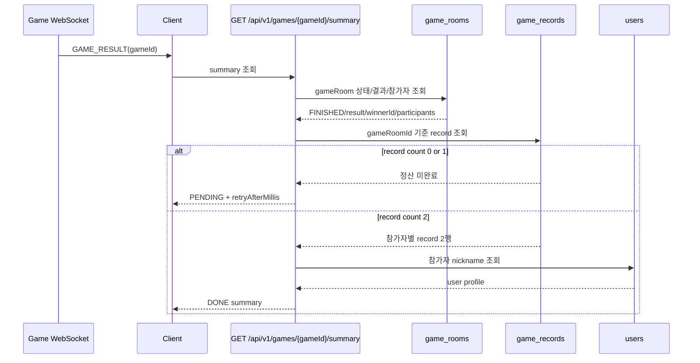

# Issue 56. record/rank summary 조회 API

## 📌 Feature Description

게임 종료 WebSocket `GAME_RESULT`는 종료 신호만 담당하고, 최종 결과 화면에 필요한 승패/LP/rank/series 정보는 별도 조회 API에서 제공한다.

Step 9에서 이미 생성된 `game_records`와 `game_rooms` 결과를 source of truth로 사용한다. 이 API는 정산을 새로 수행하지 않고, 정산 완료 여부를 읽어서 `PENDING` 또는 `DONE` summary를 반환한다.



핵심 정책은 다음과 같다.

- 최종 결과 화면 데이터의 source of truth는 summary API다.
- WebSocket `GAME_RESULT`는 결과 화면 진입/조회 시작을 알리는 실시간 신호로 유지한다.
- summary API는 record/rank 정산을 수행하지 않고 이미 저장된 결과만 조회한다.
- API path는 기존 버전 prefix를 따라 `GET /api/v1/games/{gameId}/summary`를 사용한다.
- path의 `gameId`는 현재 도메인 구현상 `game_rooms.id`를 의미한다.
- 로그인 유저만 조회할 수 있다.
- 해당 gameRoom 참가자가 아니면 `403`으로 차단한다.
- gameRoom이 없으면 `404`를 반환한다.
- gameRoom이 아직 `FINISHED`가 아니면 종료 후 summary 조회가 아니므로 `409 CONFLICT`로 처리한다.
- `FINISHED + game_records 0행`은 `200 PENDING`으로 반환한다.
- `FINISHED + game_records 1행`은 불완전 정산 상태로 보고 외부 응답은 `200 PENDING`, 서버 로그는 `warn`으로 남긴다.
- `FINISHED + game_records 2행`만 `200 DONE`으로 반환한다.
- `PENDING` 응답에는 정산 세부 데이터를 섞지 않는다.
- 클라이언트는 `PENDING`이면 `retryAfterMillis` 기준으로 짧게 polling한다.
- `DONE` 응답에는 top-level 게임 결과와 `me`, `opponent` summary를 함께 반환한다.
- `winnerUserId`는 승자가 있으면 userId, 무승부면 `null`이다.
- `rankBefore`, `rankAfter`는 `"GOLD_IV"`, `"MASTER"` 같은 enum 문자열만 반환한다.
- `lpChange`는 Step 9 정산 때 `game_records.lp_change`에 저장된 서버 계산값을 반환한다.
- `gameRecordId`는 결과 화면에 필요하지 않으므로 노출하지 않는다.
- 상대방도 내 정보와 같은 schema로 반환한다.
- 전체 전적 공개 API는 이번 이슈에 포함하지 않고 후속 전적 조회 API로 분리한다.

### Response Contract

#### PENDING

```json
{
  "summaryStatus": "PENDING",
  "gameId": 123,
  "retryAfterMillis": 1000
}
```

#### DONE

```json
{
  "summaryStatus": "DONE",
  "gameId": 123,
  "gameResult": "PLAYER1_WIN",
  "winnerUserId": 1,
  "finishedAt": "2026-05-27T12:34:56",
  "me": {
    "userId": 1,
    "nickname": "moon",
    "result": "WIN",
    "lpBefore": 40,
    "lpAfter": 56,
    "lpChange": 16,
    "rankBefore": "GOLD_IV",
    "rankAfter": "GOLD_III",
    "seriesType": "RANK",
    "rankSeriesId": null
  },
  "opponent": {
    "userId": 2,
    "nickname": "other",
    "result": "LOSS",
    "lpBefore": 61,
    "lpAfter": 45,
    "lpChange": -16,
    "rankBefore": "GOLD_IV",
    "rankAfter": "GOLD_IV",
    "seriesType": "RANK",
    "rankSeriesId": null
  }
}
```

- `finishedAt`은 `game_rooms.finishedAt`을 그대로 사용한다.
- `summaryStatus`는 `PENDING`, `DONE`만 사용한다.
- `gameResult`는 `GameResult` enum 문자열을 그대로 반환한다.
- `result`는 `GameRecordResult` enum 문자열을 그대로 반환한다.
- `seriesType`은 `GameRecordSeriesType` enum 문자열을 그대로 반환한다.
- `rankSeriesId`는 일반 랭크 게임이면 `null`, 배치/승급전이면 연결된 series id다.
- rank 문자열은 `tier + "_" + division` 형식을 사용하고, division이 없는 Apex rank는 tier만 사용한다.

### Package Boundary

| 영역 | 패키지 | 책임 |
|------|--------|------|
| HTTP endpoint | `smite-api` `game/summary/controller` | 인증 유저 주입, path variable 처리, HTTP 응답 반환 |
| API DTO | `smite-api` `game/summary/dto` | `PENDING`/`DONE` 응답, player summary, summary status 표현 |
| 조회 orchestration | `smite-api` `game/summary/service` | 권한 확인, record count 분기, user nickname 조합, DTO 변환 |
| gameRoom 조회 | `smite-core` `domain/game/service` | gameRoom 상태/result/winnerId/finishedAt/참가자 조회 제공 |
| record 조회 | `smite-core` `domain/record/service` | gameRoomId 기준 record count와 record 2행 조회 제공 |
| user 조회 | `smite-core` `domain/user/service` | 참가자 nickname 조회 제공 |

- API 모듈은 `GameRecordRepository`, `GameRoomRepository`, `UserRepository`를 직접 import하지 않는다.
- API 모듈은 core read service만 조합한다.
- core read service는 조회에 필요한 도메인 값만 반환하고 HTTP 응답 DTO를 알지 않는다.
- core read service가 외부 모듈에 넘기는 read model과 service 결과 모델은 `domain/game/service/dto` 같은 service DTO 패키지에 둔다.
- summary API는 rank command service, record/rank settlement service를 호출하지 않는다.
- `smite-matching` Redis 상태는 이번 조회 API와 무관하므로 참조하지 않는다.

### Status Policy

| gameRoom 상태 | record count | HTTP | summaryStatus | 처리 |
|---------------|--------------|------|---------------|------|
| 없음 | - | `404` | - | gameRoom 없음 |
| `READY` / `IN_PROGRESS` / `ABORTED` | - | `409` | - | 종료 후 summary 조회 대상 아님 |
| `FINISHED` | `0` | `200` | `PENDING` | 정산 대기 또는 복구 진행 중 |
| `FINISHED` | `1` | `200` | `PENDING` | 불완전 정산, warn log |
| `FINISHED` | `2` | `200` | `DONE` | 최종 결과 반환 |
| `FINISHED` | 그 외 | `409` | - | 참가자/record 정합성 오류 |

### Responsibility Boundary

이번 조회 API의 책임 경계는 다음과 같이 확정한다.

- `GAME_RESULT` WebSocket은 게임 종료 사실과 `gameId`를 전달하는 실시간 신호까지만 담당한다.
- 최종 결과 화면의 승패/LP/rank/series/nickname 데이터는 `GET /api/v1/games/{gameId}/summary`가 담당한다.
- summary API는 Step 9에서 이미 끝난 record/rank 정산 결과를 읽기만 하며, 정산을 새로 실행하거나 복구하지 않는다.
- summary API는 `game_rooms`의 종료 상태와 `game_records`의 생성 완료 상태를 조합해 `PENDING` 또는 `DONE`을 결정한다.
- `PENDING`은 실패가 아니라 정산 결과가 아직 조회 가능한 상태가 아니라는 의미다.
- Redis matching status, record/rank settlement, public profile/record history 조회는 summary API 책임에서 제외한다.
- API 모듈은 repository를 직접 참조하지 않고 core read service만 조합한다.
- `gameId`는 외부 API 이름으로 유지하되, 현재 구현에서는 `game_rooms.id`와 동일한 값으로 해석한다.

## 📚 Tasks

### 1. summary 조회 책임 경계 확정

- [x] `GAME_RESULT`는 종료 신호로 유지하고 LP/rank/series 정보를 추가하지 않는다.
- [x] 최종 결과 화면의 source of truth를 `GET /api/v1/games/{gameId}/summary`로 확정한다.
- [x] summary API는 record/rank 정산을 수행하지 않고 read-only 조회만 담당한다.
- [x] `gameId` path variable은 현재 구현의 `gameRoomId`와 동일하게 해석한다.
- [x] 전체 전적 공개 API, record 상세 API, profile API는 이번 이슈 범위에서 제외한다.
- [x] polling 정책은 `PENDING.retryAfterMillis` 기준으로 문서화한다.

### 2. core read service 보강

- [x] `GameRoomReadService`에 summary 조회에 필요한 gameRoom read model을 제공한다.
- [x] read model에는 `gameRoomId`, `status`, `result`, `winnerId`, `finishedAt`, participant userIds를 포함한다.
- [x] gameRoom이 없으면 기존 `GAME_ROOM_NOT_FOUND`로 처리한다.
- [x] `GameRecordReadService`를 추가해 `countByGameRoomId`, `findByGameRoomId`를 제공한다.
- [x] `GameRecordReadService`는 record repository를 감싸고 API 모듈이 repository를 직접 참조하지 않게 한다.
- [x] `UserReadService`에 참가자 nickname 조회에 필요한 메서드를 추가한다.
- [x] user 조회 결과가 누락되면 summary application service에서 `USER_NOT_FOUND` 또는 정합성 오류로 처리한다.

### 3. summary API DTO 설계

- [x] `SummaryStatus` enum을 `PENDING`, `DONE`으로 정의한다.
- [x] pending 응답 DTO는 `summaryStatus`, `gameId`, `retryAfterMillis`만 포함한다.
- [x] done 응답 DTO는 `summaryStatus`, `gameId`, `gameResult`, `winnerUserId`, `finishedAt`, `me`, `opponent`를 포함한다.
- [x] player summary DTO는 `userId`, `nickname`, `result`, `lpBefore`, `lpAfter`, `lpChange`, `rankBefore`, `rankAfter`, `seriesType`, `rankSeriesId`를 포함한다.
- [x] `gameRecordId`는 응답에서 제외한다.
- [x] rank 응답 필드는 문자열로 설계해 service에서 `Rank` value object를 변환하도록 계약을 고정한다.
- [x] 일반 rank는 `TIER_DIVISION`, Apex rank는 `TIER` 형식으로 반환하도록 DTO 계약을 고정한다.
- [x] enum 값은 별도 한글 label 없이 문자열 그대로 반환한다.

### 4. summary application service 구현

- [ ] `smite-api` `game/summary/service`에 조회 application service를 추가한다.
- [ ] service는 `gameId`, `requestUserId`를 입력받는다.
- [ ] gameRoom 참가자 목록에 `requestUserId`가 없으면 `403`으로 차단한다.
- [ ] 미참가자 `403`은 core의 `INVALID_GAME_PARTICIPANTS(400)`를 그대로 쓰지 않고 API 계층에서 `ApiErrorCode.AUTH_FORBIDDEN`으로 표현한다.
- [ ] gameRoom status가 `FINISHED`가 아니면 `409 CONFLICT`로 처리한다.
- [ ] record count가 `0`이면 pending 응답을 반환한다.
- [ ] record count가 `1`이면 warn log를 남기고 pending 응답을 반환한다.
- [ ] record count가 `2`이면 record 2행을 조회한다.
- [ ] record 2행 중 request user record를 `me`, 나머지 record를 `opponent`로 매핑한다.
- [ ] participant userIds와 record userIds가 일치하지 않으면 정합성 오류로 처리한다.
- [ ] record count가 `2`를 초과하면 1v1 게임 record 정합성 오류로 보고 `409 CONFLICT`로 처리한다.
- [ ] `winnerUserId`는 gameRoom result가 `DRAW`이면 `null`, 승패 결과이면 `winnerId`를 반환한다.
- [ ] 정산 조회 중 예외를 삼키지 않고 전역 예외 응답으로 전달한다.

### 5. HTTP endpoint 연결

- [ ] `GamePath` 같은 경로 상수를 추가해 `/api/v1/games` base path와 `/{gameId}/summary`를 정의한다.
- [ ] `GameSummaryController`를 추가한다.
- [ ] controller는 `@AuthUser Long userId`와 `@PathVariable Long gameId`를 받아 service에 위임한다.
- [ ] 성공 응답은 `200 OK`와 summary DTO를 반환한다.
- [ ] 미참가자 `403`, gameRoom 없음 `404`, 종료 전 gameRoom `409` 응답을 기존 전역 예외 형식과 맞춘다.
- [ ] `SecurityPath.AUTH_WHITELIST`에는 추가하지 않고 인증 필수 API로 둔다.

### 6. 문서/API 계약 테스트

- [ ] `GameSummaryControllerRestDocsTest`를 추가한다.
- [ ] `DONE` 응답 필드를 RestDocs에 문서화한다.
- [ ] `PENDING` 응답 필드를 RestDocs에 문서화한다.
- [ ] `403`, `404`, `409` 주요 실패 응답 정책을 문서화한다.
- [ ] 생성된 OpenAPI/RestDocs snippet이 기존 문서 구조와 충돌하지 않는지 확인한다.

### 7. service 테스트

- [ ] `FINISHED + record 2행`이면 `DONE` summary가 반환되는지 검증한다.
- [ ] 요청 유저 기준 `me`와 `opponent`가 올바르게 나뉘는지 검증한다.
- [ ] `PLAYER1_WIN`, `PLAYER2_WIN`, `DRAW` 각각의 `gameResult`, `winnerUserId`, player result를 검증한다.
- [ ] `record count == 0`이면 `PENDING`을 반환하는지 검증한다.
- [ ] `record count == 1`이면 `PENDING`과 warn log 정책을 검증한다.
- [ ] `READY` 또는 `IN_PROGRESS` gameRoom 조회 시 `409`가 발생하는지 검증한다.
- [ ] `ABORTED` gameRoom 조회 시 `409`가 발생하는지 검증한다.
- [ ] 미참가자 조회 시 `403`이 발생하는지 검증한다.
- [ ] rank 문자열 변환에서 일반 rank와 Apex rank를 모두 검증한다.
- [ ] API 모듈이 repository 구현체를 직접 import하지 않는지 확인한다.

### 8. 문서 정합성

- [ ] `plan-checkpoint.md` Step 11을 Issue 56 기준으로 정리한다.
- [ ] `docs/project/policy.md`에 Step 11 summary 조회 정책을 반영한다.
- [ ] `docs/project/domain status.md`에 `GAME_RESULT -> summary polling -> DONE` 흐름을 반영한다.
- [ ] Issue 52의 후속 조회 API 표기를 Issue 56으로 맞춘다.
- [ ] PR 섹션에는 WebSocket과 summary API 책임 분리, polling 선택, pending 처리, participant-only 접근 정책, repository 직접 참조를 피한 패키지 경계를 중심으로 작성한다.

## 📝 Note

- 이번 이슈는 record/rank 정산 로직을 변경하지 않는다.
- 이번 이슈는 Redis matching status cleanup을 변경하지 않는다.
- 이번 이슈는 게임 종료 WebSocket payload를 확장하지 않는다.
- 이번 이슈는 최종 결과 화면에 필요한 read API만 추가한다.
- `PENDING`이 오래 지속되는 원인은 Step 9 record/rank recovery와 운영 로그에서 추적한다.

## 📌 Related Issue
- Closes #56

-----
## PR
