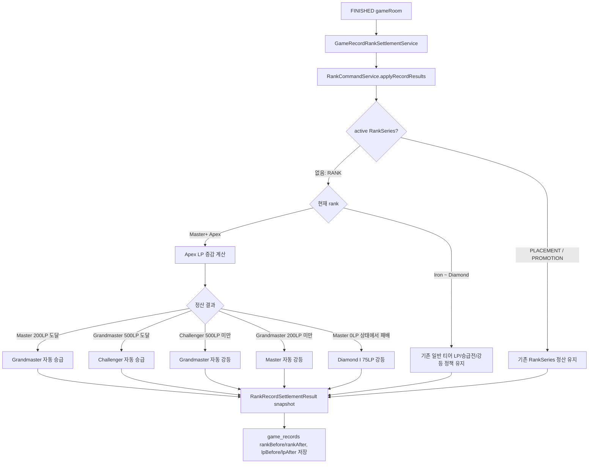

# Issue 58. Apex rank 자동 승급/강등 정산

## 📌 Feature Description

게임 결과 record/rank 정산 시 Master 이상 Apex 티어는 일반 승급전 없이 LP 기준으로 자동 승급/강등되도록 처리함.

현재 Step 9 record/rank 정산은 `GameRecordRankSettlementService`가 FINISHED gameRoom 결과를 참가자별 `RankRecordSettlementCommand`로 변환하고, `RankCommandService`가 누적 전적, LP, RankSeries를 반영한 뒤 `RankRecordSettlementResult` snapshot을 반환하는 구조임. 이번 이슈는 이 중 일반 `RANK` 정산 경로에서 Apex 티어의 LP band 정책만 보강함.

핵심 정책은 다음과 같음.

- Apex 유저의 WIN/LOSS LP 증감량은 기존 `Rank.calculateWinLp`, `Rank.calculateLossLp` 공식을 그대로 재사용함.
- Diamond I → Master는 기존 승급전 3판 2승 정책을 유지함.
- Master → Grandmaster는 Master가 200LP에 도달한 경우 자동 승급함.
- Grandmaster → Challenger는 Grandmaster가 500LP에 도달한 경우 자동 승급함.
- Challenger → Grandmaster는 Challenger가 500LP 미만으로 하락한 경우 자동 강등함.
- Grandmaster → Master는 Grandmaster가 200LP 미만으로 하락한 경우 자동 강등함.
- Master → Diamond I는 Master 0LP 상태에서 패배한 경우에만 Diamond I 75LP로 강등함.
- Master 10LP에서 패배해 0LP가 된 경우는 Master 0LP로 유지하고, 다음 0LP 패배 때 Diamond I로 강등함.
- 정상 정책상 Master 490LP, Challenger 185LP 같은 상태는 발생하지 않는 전제로 처리함.
- 이번 이슈는 Apex 매칭 정책, Apex queue scan 범위, LP 근접도 매칭을 구현하지 않음.
- 이번 이슈는 DB DDL을 변경하지 않음.

### Current Implementation Analysis

현재 구현 상태는 다음과 같음.

- `GameRecordRankSettlementService.settleFinishedGameRoom`은 `game_rooms.status/result/winnerId`를 source of truth로 record/rank 정산을 시작함.
- `GameRoomResultResolver`가 참가자별 WIN/LOSS/DRAW 결과를 만들고, `RankCommandService.applyRecordResults`가 참가자별 랭크 상태를 반영함.
- `RankCommandService.applyRecordResult`는 active `RankSeries`가 없으면 일반 `RANK` 정산, 있으면 `PLACEMENT` 또는 `PROMOTION` 정산을 수행함.
- 일반 `RANK` 승리 정산은 `applyRankWin`에서 승리 LP를 계산하고, Master 미만 rank가 승급전 진입 조건을 만족하면 `RankSeries.createPromotion`을 저장함.
- 일반 `RANK` 패배 정산은 `applyRankLoss`에서 패배 전 LP가 0이면 `previousRank` LP 75로 강등하고, 아니면 LP만 차감함.
- `previousRank`는 division이 없는 Apex rank를 입력받으면 현재 rank를 그대로 반환하므로, 현재 코드만으로는 Apex 강등이 발생하지 않음.
- `Rank.getTierScore`는 Apex rank도 division null 기준으로 Master 29, Grandmaster 33, Challenger 37로 계산함.
- `GameRecord.create`는 `lpAfter - lpBefore`를 `lpChange`로 저장하므로, `RankCommandService`가 올바른 after snapshot만 반환하면 record 저장 구조는 그대로 재사용 가능함.

### Package Boundary

| 영역 | 패키지 | 책임 |
|------|--------|------|
| record/rank 정산 orchestration | `smite-core` `domain/record/service` | FINISHED gameRoom 기준 record/rank 정산 호출, record 생성 |
| rank 정책 반영 | `smite-core` `domain/rank/service` | 일반 RANK / RankSeries / Apex LP 정책 반영 |
| rank 상태 Entity | `smite-core` `domain/rank/domain` | `UserRankInfo` rank/lp/누적 전적 상태 변경 |
| rank value object | `smite-core` `domain/rank/domain/vo` | `Rank`, `Tier`, `Division`, LP 계산 공식 |
| record snapshot | `smite-core` `domain/record/domain` | `rankBefore/rankAfter`, `lpBefore/lpAfter`, `lpChange` 저장 |

- Apex 자동 승급/강등 정책은 `smite-core` 내부 랭크 정책으로 처리함.
- `smite-api`, `smite-matching`, `smite-infra-redis`는 이번 이슈에서 변경 대상이 아님.
- API 응답 DTO나 WebSocket `GAME_RESULT` payload는 변경하지 않음.
- summary API는 이미 저장된 `game_records` snapshot을 읽기만 하므로 이번 이슈의 쓰기 로직에 의존하지 않음.

### Apex Settlement Policy

| 현재 rank | 결과 | 조건 | 정산 후 rank/lp |
|-----------|------|------|----------------|
| `MASTER` | WIN | `before.lp + winLp >= 200` | `GRANDMASTER`, 계산된 LP |
| `MASTER` | WIN | `before.lp + winLp < 200` | `MASTER`, 계산된 LP |
| `MASTER` | LOSS | `before.lp == 0` | `DIAMOND I`, 75 LP |
| `MASTER` | LOSS | `before.lp > 0` | `MASTER`, 차감 후 LP. 최소 0 |
| `GRANDMASTER` | WIN | `before.lp + winLp >= 500` | `CHALLENGER`, 계산된 LP |
| `GRANDMASTER` | WIN | `before.lp + winLp < 500` | `GRANDMASTER`, 계산된 LP |
| `GRANDMASTER` | LOSS | `afterLp < 200` | `MASTER`, 차감 후 LP |
| `GRANDMASTER` | LOSS | `afterLp >= 200` | `GRANDMASTER`, 차감 후 LP |
| `CHALLENGER` | WIN | 항상 | `CHALLENGER`, 계산된 LP |
| `CHALLENGER` | LOSS | `afterLp < 500` | `GRANDMASTER`, 차감 후 LP |
| `CHALLENGER` | LOSS | `afterLp >= 500` | `CHALLENGER`, 차감 후 LP |
| Apex 전체 | DRAW | 항상 | rank/lp 변경 없음 |

### Scope Boundary

이번 이슈에 포함함.

- Apex rank 자동 승급/강등 정책 구현
- Apex rank/lp snapshot 테스트
- 기존 일반 티어 승급전/강등 정책 회귀 테스트
- 기존 배치/승급전 RankSeries 정산 경로와 Apex 정책 충돌 방지
- 구현 결과를 issue 문서와 checkpoint 문서에 반영

이번 이슈에서 제외함.

- Apex 매칭 정책 정합성
- `matching:queue:{tierScore}` scan 범위 확장
- Apex LP 근접도 기반 후보 탐색
- 배치 유저 Silver IV ~ Gold IV 매칭 보정
- summary API 응답 schema 변경
- DDL 변경

## 📚 Tasks

### 1. 정책과 현재 정산 경계 확정

- [x] `docs/project/policy.md`의 Apex LP 처리 기준을 구현 기준으로 재확인함.
- [x] Diamond I → Master는 기존 `RankSeries` 승급전 성공 경로를 유지하는 것으로 확정함.
- [x] Master 이상 Apex는 `RankSeries.createPromotion`을 생성하지 않는 것으로 확정함.
- [x] Master 10LP 패배 후 0LP 도달은 Master 0LP 유지, Master 0LP 상태 패배만 Diamond I 75LP 강등으로 확정함.
- [x] Master 490LP, Challenger 185LP 같은 비정상 상태 보정은 이번 이슈의 핵심 범위에서 제외하고 정상 정책 전제를 문서화함.

확정 내용은 다음과 같음.

- Apex LP band는 `MASTER: 0~199`, `GRANDMASTER: 200~499`, `CHALLENGER: 500+`로 처리함.
- Diamond I → Master는 자동 승급 대상이 아니며, 기존 Promotion `RankSeries` 성공 시 `MASTER 0LP`로 확정함.
- Master → Grandmaster, Grandmaster → Challenger는 `RankSeries` 없이 일반 `RANK` 정산 안에서 자동 처리함.
- Grandmaster → Master, Challenger → Grandmaster도 일반 `RANK` 패배 정산 안에서 자동 처리함.
- Master → Diamond I 강등은 패배 전 `MASTER 0LP`였던 경우에만 적용함.

### 2. `RankCommandService` Apex 분기 추가

- [x] `RankCommandService`에 Apex LP threshold 상수를 추가함.
- [x] `Tier.MASTER`, `Tier.GRANDMASTER`, `Tier.CHALLENGER`를 Apex rank로 판별하는 private helper를 추가함.
- [x] 일반 `applyRankWin`에서 Apex rank면 승급전 진입 판단을 건너뛰고 Apex 전용 승리 정산으로 분기함.
- [x] 일반 `applyRankLoss`에서 Apex rank면 기존 `previousRank` 기반 강등을 사용하지 않고 Apex 전용 패배 정산으로 분기함.
- [x] DRAW는 기존처럼 누적 무승부만 반영하고 LP/rank를 변경하지 않음.

### 3. Apex 승리 정산 구현

- [ ] Master 승리 시 `before.lp + before.rank().calculateWinLp(opponentBefore.rank())`로 next LP를 계산함.
- [ ] Master next LP가 200 이상이면 `Rank.of(Tier.GRANDMASTER, null)`과 next LP로 갱신함.
- [ ] Master next LP가 200 미만이면 `MASTER`와 next LP로 유지함.
- [ ] Grandmaster 승리 시 next LP가 500 이상이면 `Rank.of(Tier.CHALLENGER, null)`과 next LP로 갱신함.
- [ ] Grandmaster next LP가 500 미만이면 `GRANDMASTER`와 next LP로 유지함.
- [ ] Challenger 승리 시 `CHALLENGER`와 next LP로 유지함.
- [ ] Apex 승리 정산에서는 `rankSeriesRepository.save(RankSeries.createPromotion(...))`를 호출하지 않음.

### 4. Apex 패배 정산 구현

- [ ] Master 패배 시 `before.lp == 0`이면 `Rank.of(Tier.DIAMOND, Division.I)`와 75 LP로 강등함.
- [ ] Master 패배 시 `before.lp > 0`이면 기존 loss LP 공식으로 차감하고, LP 최소값은 0으로 유지함.
- [ ] Master가 패배로 0LP가 된 경우에도 rank는 `MASTER`로 유지함.
- [ ] Grandmaster 패배 시 loss LP를 차감한 after LP가 200 미만이면 `MASTER`로 강등함.
- [ ] Grandmaster 패배 시 after LP가 200 이상이면 `GRANDMASTER`로 유지함.
- [ ] Challenger 패배 시 loss LP를 차감한 after LP가 500 미만이면 `GRANDMASTER`로 강등함.
- [ ] Challenger 패배 시 after LP가 500 이상이면 `CHALLENGER`로 유지함.
- [ ] 모든 Apex 패배 정산에서 LP는 음수가 되지 않도록 기존 `UserRankInfo` clamp 정책과 일관되게 처리함.

### 5. record snapshot 정합성 유지

- [ ] `RankRecordSettlementResult.rankBefore`는 정산 전 rank를 그대로 반환하는지 검증함.
- [ ] `RankRecordSettlementResult.rankAfter`는 Apex 자동 승급/강등 후 rank를 반환하는지 검증함.
- [ ] `RankRecordSettlementResult.lpBefore`는 정산 전 LP를 그대로 반환하는지 검증함.
- [ ] `RankRecordSettlementResult.lpAfter`는 Apex 자동 승급/강등 후 LP를 반환하는지 검증함.
- [ ] `GameRecord.create`의 `lpChange = lpAfter - lpBefore` 계산을 그대로 재사용함.
- [ ] summary API의 `rankBefore/rankAfter` 문자열 변환은 기존 Apex tier-only 반환 정책을 그대로 유지함.

### 6. 기존 정책 회귀 방지

- [ ] Iron ~ Diamond 일반 티어 승리 시 기존 승급전 진입 정책이 유지되는지 확인함.
- [ ] Diamond I → Master는 자동 승급이 아니라 기존 승급전 성공 후 Master 0LP가 되는지 검증함.
- [ ] 일반 티어 LP 0 패배 시 이전 rank LP 75 강등 정책이 유지되는지 확인함.
- [ ] 진행 중 `PLACEMENT` RankSeries가 있으면 Apex LP 자동정산이 개입하지 않는지 확인함.
- [ ] 진행 중 `PROMOTION` RankSeries가 있으면 Apex LP 자동정산이 개입하지 않는지 확인함.
- [ ] Apex 정산 추가 후 `RankCommandService.applyRecordResults`가 기존 before snapshot 기준으로 양 참가자의 LP를 계산하는 구조를 유지함.

### 7. 단위 테스트 추가

- [ ] `RankCommandServiceTest`에 Master 190LP 승리 후 Grandmaster 승급 케이스를 추가함.
- [ ] `RankCommandServiceTest`에 Master 10LP 패배 후 Master 0LP 유지 케이스를 추가함.
- [ ] `RankCommandServiceTest`에 Master 0LP 패배 후 Diamond I 75LP 강등 케이스를 추가함.
- [ ] `RankCommandServiceTest`에 Grandmaster 490LP 승리 후 Challenger 승급 케이스를 추가함.
- [ ] `RankCommandServiceTest`에 Grandmaster 200LP 패배 후 Master 강등 케이스를 추가함.
- [ ] `RankCommandServiceTest`에 Challenger 500LP 패배 후 Grandmaster 강등 케이스를 추가함.
- [ ] `RankCommandServiceTest`에 Apex 승리 정산에서 `rankSeriesRepository.save`가 호출되지 않는지 검증함.
- [ ] 각 테스트에서 `rankBefore/rankAfter`, `lpBefore/lpAfter`, `seriesType=RANK`, `rankSeriesId=null`을 함께 검증함.

### 8. 문서 정합성

- [ ] `plan-checkpoint.md` Step 12 체크리스트를 구현 결과에 맞게 갱신함.
- [ ] `docs/project/policy.md` 변경 이력에 Apex 자동 승급/강등 정산 구현 완료를 기록함.
- [ ] Issue 문서에는 최종 PR 설명에 사용할 정책 결정, 패키지 경계, 테스트 범위를 정리함.
- [ ] 후속 범위인 Apex 매칭 정책은 Step 14 또는 별도 이슈로 남겨 이번 정산 작업과 섞지 않음.

## 📝 Note

- 이번 이슈는 record/rank 정산의 쓰기 정책만 변경함.
- 이번 이슈는 `GAME_RESULT` WebSocket payload를 확장하지 않음.
- 이번 이슈는 summary API response schema를 변경하지 않음.
- 이번 이슈는 Redis matching status cleanup 정책을 변경하지 않음.
- 이번 이슈는 Apex 매칭 큐/후보 탐색 정책을 변경하지 않음.
- Apex LP 계산은 일반 rank와 동일한 `Rank.calculateWinLp`, `Rank.calculateLossLp`를 사용함.

## 📌 Related Issue

- Closes #58
