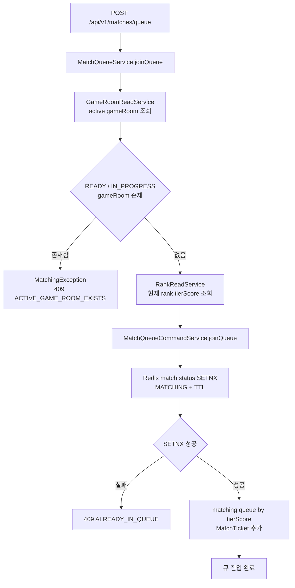

# Issue 60. 큐 진입 전 진행 중 gameRoom DB 검증

## 📌 Feature Description

매칭 큐 진입 시 Redis `match:status:{userId}`만 확인하지 않고, DB의 `game_rooms` / `game_participants` 기준으로 유저가 참여 중인 active gameRoom이 있는지 먼저 검증함.

Redis TTL 만료, cleanup 실패, 서버 재시작, 비정상 종료 등으로 Redis 유저 점유 상태가 사라져도 DB에 `READY` 또는 `IN_PROGRESS` gameRoom이 남아 있으면 새 매칭 큐 진입을 차단함. 게임 진행 상태의 source of truth는 DB이고, Redis는 매칭 큐와 유저 점유 상태를 빠르게 처리하기 위한 보조 상태로 유지함.

핵심 정책은 다음과 같음.

- 큐 진입 조건은 로그인 상태와 진행 중인 게임 없음임.
- 진행 중인 게임 없음은 DB 기준 `READY`, `IN_PROGRESS` gameRoom에 참여 중이지 않다는 뜻으로 검증함.
- `READY` gameRoom은 게임 대기 화면 또는 WebSocket 준비 단계이므로 새 큐 진입을 차단함.
- `IN_PROGRESS` gameRoom은 이미 게임이 시작된 상태이므로 새 큐 진입을 차단함.
- `FINISHED`, `ABORTED` gameRoom은 종료되었거나 실패 정산된 상태이므로 큐 진입을 차단하지 않음.
- Redis `match:status:{userId}` 검증은 기존처럼 `smite-matching`의 `SETNX` 기반 중복 큐 진입 방지로 유지함.
- DB active gameRoom 검증은 Redis 검증보다 먼저 수행해 이미 게임에 묶인 유저가 Redis 상태 유실로 큐에 들어가는 것을 막음.
- 이번 이슈는 큐 진입 전 검증만 다루며, gameRoom cleanup, record/rank 정산, Apex 매칭 정책은 변경하지 않음.

### Current Implementation Analysis

현재 구현 상태는 다음과 같음.

- `MatchController`는 인증 유저의 queue join 요청을 `smite-api`의 `MatchQueueService.joinQueue(userId)`로 위임함.
- `MatchQueueService`는 `RankReadService`로 유저의 현재 rank를 조회하고, `tierScore`를 계산한 뒤 `MatchQueueCommandService.joinQueue(userId, tierScore)`로 위임함.
- `MatchQueueService` 주석에는 JPA 기반 `smite-core`와 Redis 도메인 로직 `smite-matching`의 경계를 이 클래스가 맡는다고 명시되어 있음.
- `MatchQueueCommandService.joinQueue`는 Redis `match:status:{userId}`에 `MATCHING` 상태를 `SETNX` 방식으로 저장하고, 성공 시 `matching:queue:{tierScore}`에 `MatchTicket`을 추가함.
- Redis 상태 설정에 실패하면 기존 `ALREADY_IN_QUEUE`로 큐 중복 진입을 차단함.
- 큐 추가 중 예외가 발생하면 Redis user status를 제거해 롤백함.
- `GameRoomReadService`는 현재 gameRoom 단건 상태, scenario, participant 목록, summary read model 조회를 제공하지만, 특정 유저가 active gameRoom에 참여 중인지 조회하는 메서드는 없음.
- `GameRoomRepository`는 gameRoom 단건 lock 조회와 record 정산 복구용 조회만 제공하며, participant userId와 gameRoom status를 조합한 exists query는 없음.
- `GameRoom`은 `participants`를 `@OneToMany`로 보유하고, `GameParticipant.userId`로 참여 유저를 식별함.
- `GameStatus`는 `READY`, `IN_PROGRESS`, `FINISHED`, `ABORTED`를 제공함.
- 정책 문서의 큐 진입 조건은 "로그인 상태 + 진행 중인 게임 없음"으로 정의되어 있으나, 현재 큐 진입 구현은 Redis 상태만 먼저 검증하므로 DB active gameRoom이 남은 경우를 방어하지 못함.

### Package Boundary

| 영역 | 패키지 | 책임 |
|------|--------|------|
| HTTP endpoint | `smite-api` `match/controller` | 인증 유저 주입, queue join/leave HTTP 요청 처리 |
| queue orchestration | `smite-api` `match/service` | core 조회와 matching command 조합, 큐 진입 전 정책 검증 |
| gameRoom 조회 | `smite-core` `domain/game/service` | DB 기준 active gameRoom 존재 여부 제공 |
| gameRoom repository | `smite-core` `domain/game/repository` | participant userId + status 조건 exists query 수행 |
| rank 조회 | `smite-core` `domain/rank/service` | 큐 key 계산에 필요한 현재 rank/tierScore 제공 |
| Redis queue command | `smite-matching` `matching/command` | Redis user status SETNX, queue add/remove, Redis rollback |
| Redis store | `smite-matching`, `smite-infra-redis` | match status, matching queue 저장소 처리 |

- `smite-matching`은 DB repository나 core gameRoom service를 직접 의존하지 않음.
- DB active gameRoom 검증은 `smite-api`의 application service에서 `GameRoomReadService`를 조합해 수행함.
- `smite-core`는 HTTP 응답 DTO나 matching queue command를 알지 않음.
- `smite-api`는 repository를 직접 import하지 않고 core read service만 사용함.
- Redis `ALREADY_IN_QUEUE`와 DB active gameRoom 차단은 의미가 다르므로 별도 에러 코드로 구분함.

### Queue Join Policy

| 상태 기준 | 조건 | 큐 진입 처리 |
|-----------|------|--------------|
| DB gameRoom | 유저가 `READY` gameRoom participant임 | 차단 |
| DB gameRoom | 유저가 `IN_PROGRESS` gameRoom participant임 | 차단 |
| DB gameRoom | 유저가 `FINISHED` gameRoom participant임 | 허용 |
| DB gameRoom | 유저가 `ABORTED` gameRoom participant임 | 허용 |
| DB gameRoom | active gameRoom 없음 | Redis 검증으로 진행 |
| Redis status | `match:status:{userId}`가 이미 존재함 | 기존 `ALREADY_IN_QUEUE` 차단 |
| Redis status | `match:status:{userId}` 없음 | `MATCHING` 저장 후 queue add |

### Error Policy

| 상황 | 에러 코드 | HTTP | 메시지 의미 |
|------|-----------|------|-------------|
| DB에 active gameRoom 존재 | `ACTIVE_GAME_ROOM_EXISTS` | `409` | 이미 대기 중이거나 진행 중인 게임이 있어 큐 진입 불가 |
| Redis match status 이미 존재 | `ALREADY_IN_QUEUE` | `409` | 이미 매칭 큐 또는 매칭 플로우에 점유된 상태 |
| Redis queue add 실패 | `MATCH_QUEUE_ADD_ERROR` | `500` | 큐 추가 실패 및 Redis status rollback 대상 |

- DB active gameRoom 검증 실패는 Redis 상태를 변경하지 않음.
- DB active gameRoom 검증이 통과한 뒤에는 기존 Redis `SETNX`가 중복 요청과 매칭 플로우 점유 상태를 원자적으로 방어함.
- 에러 이름은 구현 시 기존 `MatchingErrorCode` 네이밍과 맞춰 확정함.

### Scope Boundary

이번 이슈에 포함함.

- 큐 진입 전 DB 기준 active gameRoom 존재 여부 조회 추가
- `READY`, `IN_PROGRESS` gameRoom participant의 queue join 차단
- `FINISHED`, `ABORTED` gameRoom participant의 queue join 허용 기준 문서화
- Redis `match:status` 검증과 DB gameRoom 검증의 책임 경계 정리
- active gameRoom 차단용 매칭 에러 코드 추가
- application service 단위 테스트 및 repository/read service 쿼리 검증

이번 이슈에서 제외함.

- queue leave 정책 변경
- match response accept/reject 정산 변경
- gameRoom waiting timeout cleanup 변경
- FINISHED/ABORTED cleanup scheduler 추가
- record/rank 정산 변경
- Apex 매칭 큐 scan 범위 및 LP 근접도 매칭 변경
- 배치 유저 매칭 정책 변경
- DB DDL 변경

## 📚 Tasks

### 1. 정책과 현재 큐 진입 경계 확정

- [x] `docs/project/policy.md`의 큐 진입 조건인 "로그인 상태 + 진행 중인 게임 없음"을 구현 기준으로 재확인함.
- [x] 진행 중인 게임 없음의 DB 기준을 `READY`, `IN_PROGRESS` gameRoom 미참여로 확정함.
- [x] `FINISHED`, `ABORTED` gameRoom은 과거 gameRoom으로 보고 queue join 차단 대상에서 제외함.
- [x] DB active gameRoom 검증을 Redis `match:status` 검증보다 먼저 수행하는 것으로 확정함.
- [x] Redis 상태 유실, TTL 만료, cleanup 실패 상황을 이번 이슈의 방어 대상 시나리오로 문서화함.
- [x] queue leave, gameRoom cleanup, record/rank 정산은 이번 이슈 범위에서 제외함.

확정 내용은 다음과 같음.

- 정책 문서의 큐 진입 조건인 "진행 중인 게임 없음"은 DB `game_rooms.status` 기준으로 해석함.
- queue join 차단 대상 active gameRoom은 유저가 participant로 포함된 `READY`, `IN_PROGRESS` gameRoom임.
- `READY`는 아직 게임 시작 전이어도 이미 gameRoom이 생성되고 게임 대기/준비 플로우에 묶인 상태이므로 큐 진입을 막음.
- `IN_PROGRESS`는 실제 게임 진행 중 상태이므로 큐 진입을 막음.
- `FINISHED`, `ABORTED`는 종료 또는 실패 정산된 과거 gameRoom으로 보고 큐 진입을 막지 않음.
- 현재 `MatchQueueService.joinQueue`는 rank 조회 후 `MatchQueueCommandService.joinQueue`로 바로 위임하므로, DB active gameRoom 검증을 이 메서드의 첫 단계에 추가함.
- DB 검증이 실패하면 rank 조회와 Redis `SETNX`, queue add를 모두 수행하지 않음.
- DB 검증이 통과한 뒤에는 기존 Redis `SETNX` 기반 `ALREADY_IN_QUEUE` 정책을 그대로 사용함.
- `smite-matching`은 Redis queue command 책임만 유지하고, DB gameRoom 조회 의존성을 추가하지 않음.
- queue leave는 매칭 큐 이탈 명령이므로 active gameRoom DB 검증을 추가하지 않음.
- 이번 범위는 queue join 사전 검증이며, gameRoom cleanup, record/rank 정산, Apex/배치 매칭 정책은 변경하지 않음.

### 2. core gameRoom 조회 로직 추가

- [x] `GameRoomRepository`에 participant userId와 status 목록으로 active gameRoom 존재 여부를 조회하는 exists query를 추가함.
- [x] query는 `GameRoom.participants`를 join하고 `GameParticipant.userId`와 `GameRoom.status in (:statuses)`를 조건으로 사용함.
- [x] `GameRoomReadService`에 `existsActiveGameRoomByUserId(Long userId)` read method를 추가함.
- [x] active status 목록은 `GameStatus.READY`, `GameStatus.IN_PROGRESS`만 사용함.
- [x] core read service는 boolean만 반환하고 matching Redis command를 알지 않게 유지함.
- [x] API 모듈이 `GameRoomRepository`를 직접 import하지 않도록 core read service 경계를 유지함.

구현 내용은 다음과 같음.

- `GameRoomRepository.existsByParticipantUserIdAndStatusIn`을 추가해 participant userId와 status 목록 기준으로 active gameRoom 존재 여부를 조회함.
- `GameRoomReadService.existsActiveGameRoomByUserId`는 `READY`, `IN_PROGRESS`만 active status로 넘김.
- `GameRoomReadService`는 Redis matching 상태나 HTTP 에러 코드를 알지 않고 boolean 조회 결과만 제공함.
- `GameRoomReadServiceTest`에서 active status 목록을 사용해 repository를 호출하는지 검증함.
- `GameRoomReadServiceJpaTest`에서 `READY`, `IN_PROGRESS`는 true, `FINISHED`, `ABORTED`, unknown user는 false로 검증함.

### 3. `MatchQueueService` queue join 분기 추가

- [x] `smite-api`의 `MatchQueueService`에 `GameRoomReadService` 의존성을 추가함.
- [x] `joinQueue(Long userId)` 시작 지점에서 active gameRoom 존재 여부를 먼저 확인함.
- [x] active gameRoom이 있으면 rank 조회와 Redis queue command 호출을 수행하지 않음.
- [x] active gameRoom이 없으면 기존처럼 `RankReadService`로 `tierScore`를 조회하고 `MatchQueueCommandService.joinQueue`로 위임함.
- [x] `leaveQueue(Long userId)`는 기존 Redis queue 이탈 책임만 유지하고 DB active gameRoom 검증을 추가하지 않음.
- [x] 기존 `MatchQueueService` 주석을 DB gameRoom 검증, rank 조회, Redis command 조합 책임에 맞게 갱신함.

구현 내용은 다음과 같음.

- `MatchQueueService.joinQueue`가 `GameRoomReadService.existsActiveGameRoomByUserId(userId)`를 먼저 호출함.
- active gameRoom이 있으면 `MatchingException(ACTIVE_GAME_ROOM_EXISTS)`를 던지고 rank 조회와 Redis queue command를 호출하지 않음.
- active gameRoom이 없으면 기존처럼 `RankReadService.getUserRankInfo(userId)`로 tierScore를 얻고 `MatchQueueCommandService.joinQueue(userId, tierScore)`로 위임함.
- `leaveQueue`는 기존처럼 rank 조회 후 `MatchQueueCommandService.leaveQueue`로 위임하며 DB active gameRoom 검증을 수행하지 않음.
- `MatchQueueService`는 core read service와 matching command를 조합하는 API layer orchestration 책임을 유지함.

### 4. active gameRoom 에러 코드 추가

- [x] `MatchingErrorCode`에 active gameRoom 차단용 409 에러를 추가함.
- [x] 에러 메시지는 "진행 중인 게임이 있어 매칭 큐에 진입할 수 없습니다."와 같이 사용자 행동 원인을 명확히 표현함.
- [x] 기존 `ALREADY_IN_QUEUE`는 Redis `match:status` 중복 상태 의미로 유지함.
- [x] `MatchQueueService`는 active gameRoom 존재 시 새 `MatchingException`을 던지도록 처리함.
- [x] 에러 코드 번호는 기존 `MATCH_012` 이후 순서를 유지해 충돌 없이 추가함.

### 5. Redis 큐 진입 기존 정책 회귀 방지

- [ ] DB active gameRoom 검증 통과 후 Redis `SETNX` 기반 중복 큐 방지 흐름이 그대로 동작하는지 확인함.
- [ ] Redis `setStatusIfAbsent` 실패 시 기존 `ALREADY_IN_QUEUE`가 유지되는지 확인함.
- [ ] Redis queue add 실패 시 `userStatusStore.removeStatus(userId)` rollback 흐름이 유지되는지 확인함.
- [ ] rank 조회 실패 시 Redis 상태가 생성되지 않는 기존 순서를 유지함.
- [ ] DB 검증 실패 시 Redis `match:status`와 `matching:queue`에 어떤 값도 쓰지 않는지 검증함.

### 6. 단위 테스트 추가

- [ ] `MatchQueueServiceTest`에서 active gameRoom 존재 시 `MatchingException`이 발생하는지 검증함.
- [ ] active gameRoom 존재 시 `RankReadService.getUserRankInfo`가 호출되지 않는지 검증함.
- [ ] active gameRoom 존재 시 `MatchQueueCommandService.joinQueue`가 호출되지 않는지 검증함.
- [ ] active gameRoom이 없으면 기존처럼 rank 조회 후 matching command가 호출되는지 검증함.
- [ ] `leaveQueue`는 active gameRoom 검증 없이 기존 rank 조회와 matching command 이탈 흐름을 유지하는지 검증함.
- [ ] `GameRoomRepositoryTest` 또는 `GameRoomReadServiceJpaTest`에서 `READY`, `IN_PROGRESS`는 active gameRoom으로 조회되는지 검증함.
- [ ] `GameRoomRepositoryTest` 또는 `GameRoomReadServiceJpaTest`에서 `FINISHED`, `ABORTED`는 active gameRoom으로 조회되지 않는지 검증함.

### 7. 문서 정합성

- [ ] `plan-checkpoint.md` Step 13 체크리스트를 구현 결과에 맞게 갱신함.
- [ ] `docs/project/policy.md`에 큐 진입 전 DB active gameRoom 검증 기준을 반영함.
- [ ] Issue 문서에 최종 구현 결과, 패키지 경계, 테스트 범위를 갱신함.
- [ ] Redis 상태와 DB gameRoom 상태의 source of truth 경계를 문서에 명확히 유지함.
- [ ] 후속 범위인 Apex 매칭 정책, 배치 유저 매칭 정책은 Step 14/15로 남겨 이번 작업과 섞지 않음.

## 📝 Note

- 이번 이슈는 queue join의 사전 검증을 보강하는 작업임.
- DB `game_rooms.status`는 실제 게임 생명주기의 source of truth임.
- Redis `match:status:{userId}`는 빠른 중복 큐 진입 방지와 매칭 플로우 점유 상태를 위한 보조 상태임.
- DB 검증은 stale Redis 또는 Redis cleanup 누락을 방어하고, Redis `SETNX`는 동시 queue join 요청을 방어함.
- DB와 Redis를 하나의 transaction으로 묶지 않으며, 이번 범위에서는 queue join 시작 전에 DB를 읽는 방식으로 보강함.
- 큐 진입 전 DB read가 1회 추가되지만, 게임 중복 진입을 막는 정책 안정성을 우선함.
