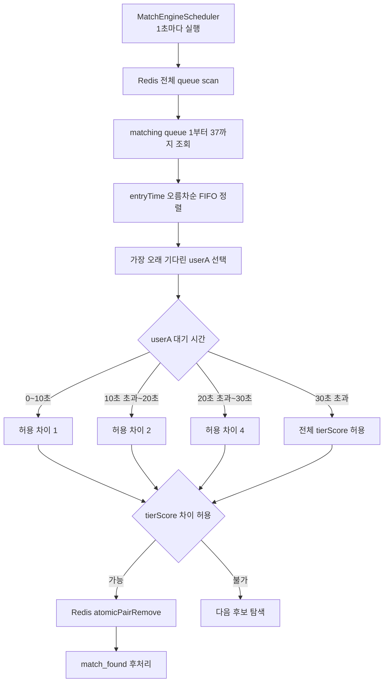
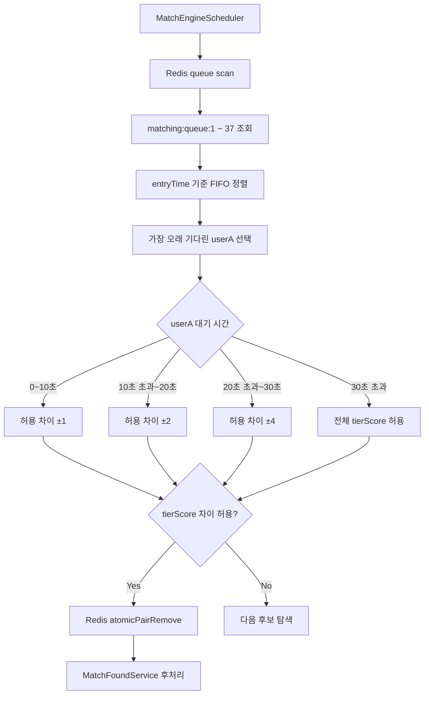

# Issue 62. Apex 큐 스캔 포함 및 30초 이후 전체 티어 매칭 허용

## 📌 Feature Description

매칭 엔진이 Apex 티어 큐를 스캔 대상에 포함하고, 사용자 수가 적은 MVP 환경에서 장기 대기와 매칭 실패를 줄이기 위해 30초 초과 대기 시 전체 tierScore 범위에서 매칭되도록 보정함.

현재 매칭 엔진은 Redis queue를 `matching:queue:1`부터 `matching:queue:28`까지만 스캔함. 하지만 `Rank.getTierScore()` 기준 Apex 티어는 Master 29, Grandmaster 33, Challenger 37이므로 Master 이상 유저가 큐에 들어가도 매칭 엔진 후보 목록에 올라오지 않을 수 있음. 이번 이슈는 이 누락을 먼저 해결하고, 30초 초과 대기 시 모든 tierScore와 매칭될 수 있게 해 매칭 확률을 높임.

핵심 정책은 다음과 같음.

- 매칭 큐 스캔 범위를 기존 `1~28`에서 `1~37`로 확장함.
- `37`은 현재 `Rank.getTierScore()` 기준 Challenger tierScore임.
- 같은 tierScore끼리는 기존 diff 0 기준으로 즉시 매칭 가능하게 유지함.
- Master vs Master, Grandmaster vs Grandmaster, Challenger vs Challenger는 30초 이전에도 바로 매칭될 수 있어야 함.
- 30초 이전 매칭 범위는 기존 정책을 유지함.
  - `0~10초`: `±1`
  - `10초 초과~20초`: `±2`
  - `20초 초과~30초`: `±4`
- 30초 초과부터는 전체 tierScore 범위 매칭을 허용함.
- 30초 정확히 도달한 시점은 기존 코드 흐름을 유지해 `<= 30초`로 보고 `±4`를 적용함.
- 30초 초과 시에는 Iron IV 1부터 Challenger 37까지 매칭 가능함.
- 이번 이슈는 Apex LP 근접도 기반 정교 매칭을 구현하지 않음.
- 이번 이슈는 사용자 수가 적은 MVP 환경에서 Apex 누락과 장기 대기를 줄이는 보정 작업임.

### Issue Start Implementation Analysis

이슈 시작 시점의 구현 상태는 다음과 같음.

- `MatchQueueService.joinQueue`는 `UserRankInfo.getTierScore()`를 계산해 `MatchQueueCommandService.joinQueue(userId, tierScore)`로 위임함.
- `MatchQueueCommandService.joinQueue`는 `MatchTicket(userId, tierScore, entryTime)`을 생성해 Redis queue에 저장함.
- `RedisMatchQueueStore.add`는 `matching:queue:{tierScore}` ZSET에 userId를 score `entryTime`으로 저장함.
- `RedisMatchQueueStore.findAll`은 `MatchingConstants.TIER_SCORE_MIN`부터 `TIER_SCORE_MAX`까지 모든 queue를 batch 조회함.
- 현재 `MatchingConstants.TIER_SCORE_MIN = 1`, `TIER_SCORE_MAX = 28`임.
- `Rank.getTierScore()` 기준 일반 Diamond I까지는 28이고, Apex는 Master 29, Grandmaster 33, Challenger 37임.
- 따라서 현재 scan range는 Apex queue인 `matching:queue:29`, `matching:queue:33`, `matching:queue:37`을 조회하지 않음.
- `MatchPairingService.processMatching`은 조회된 전체 ticket을 `entryTime` 기준으로 정렬하고, 가장 오래 기다린 유저부터 후보를 찾음.
- `MatchPairingService.isMatchable`은 userA의 대기 시간으로 허용 tierScore 차이를 계산하고 `abs(userA.tierScore - userB.tierScore) <= allowedTierDiff`이면 매칭 가능하다고 판단함.
- 현재 `calculateAllowedTierDiff`는 `0~10초 ±1`, `10~20초 ±2`, `20~30초 ±4`, `30초 초과 ±8`을 반환함.
- 현재 30초 초과도 `±8`만 허용하므로 전체 tierScore 매칭이 아님.
- `MatchPairingService`의 범위 계산은 userA 대기 시간 기준이며, userB 대기 시간은 매칭 범위 계산에 직접 사용하지 않음.
- 매칭 성사 시 `atomicPairRemove`로 Redis queue에서 두 유저를 원자 제거하고 `MatchFoundService.process`로 후처리함.

### Package Boundary

| 영역 | 패키지 | 책임 |
|------|--------|------|
| 매칭 큐 key 범위 | `league-of-star-matching` `common/constant` | Redis queue scan tierScore min/max 상수 관리 |
| Redis queue store | `league-of-star-matching` `infrastructure/redis` | `matching:queue:{tierScore}` 저장, 전체 queue batch scan, 원자 제거 |
| 매칭 후보 판정 | `league-of-star-matching` `domain/service` | FIFO 정렬, 대기 시간별 허용 tierScore 차이 계산, candidate pairing |
| MatchTicket value object | `league-of-star-core` `domain/match/domain` | userId, tierScore, entryTime 전달 |
| rank tierScore 계산 | `league-of-star-core` `domain/rank/domain` | Rank 기준 tierScore 산출 |
| API queue join | `league-of-star-api` `match/service` | rank 조회 후 matching command 위임 |

- 이번 변경은 `league-of-star-matching`의 scan range와 pairing policy 중심으로 처리함.
- `league-of-star-core`의 `Rank.getTierScore()`와 `MatchTicket` schema는 변경하지 않음.
- `league-of-star-api`의 queue join 흐름은 변경하지 않음.
- Redis key 구조는 `matching:queue:{tierScore}`를 그대로 유지함.
- match_found, accept/reject, gameRoom 생성, record/rank 정산 흐름은 변경하지 않음.

### Matching Policy

| userA 대기 시간 | 허용 tierScore 차이 | 비고 |
|----------------|--------------------|------|
| `0초 ~ 10초` | `±1` | 기존 정책 유지 |
| `10초 초과 ~ 20초` | `±2` | 기존 정책 유지 |
| `20초 초과 ~ 30초` | `±4` | 기존 정책 유지 |
| `30초 초과` | 전체 허용 | `TIER_SCORE_MAX - TIER_SCORE_MIN` 기준 |

### Apex Queue Policy

| 티어 | 현재 tierScore | 처리 |
|------|----------------|------|
| Master | `29` | scan 대상에 포함 |
| Grandmaster | `33` | scan 대상에 포함 |
| Challenger | `37` | scan 대상에 포함 |

- 같은 Apex tierScore끼리는 diff 0이므로 즉시 매칭 가능함.
- 서로 다른 Apex 티어는 30초 이전에는 기존 tierScore diff 정책을 따름.
- 30초 초과 시에는 Apex와 일반 티어를 포함한 전체 tierScore 매칭이 가능함.
- 이번 이슈는 Apex LP 근접도 기반 후보 정렬/필터링을 구현하지 않음.

### Scope Boundary

이번 이슈에 포함함.

- Redis queue scan range를 Challenger tierScore까지 확장
- Master, Grandmaster, Challenger queue가 `findAll` scan 대상에 포함되는지 검증
- 같은 Apex tierScore끼리 30초 이전에도 매칭되는지 검증
- 30초 초과 시 전체 tierScore 매칭 허용
- 30초 이전 기존 `±1 / ±2 / ±4` 정책 회귀 방지
- Redis atomic remove와 match_found 후처리 구조 유지 검증
- 정책 문서와 checkpoint 문서 갱신

이번 이슈에서 제외함.

- Apex LP 근접도 기반 정교 매칭
- Apex 전용 queue key 분리
- queue ticket에 LP 저장
- Redis Lua atomic remove 구조 변경
- match_found 후처리 복구 정책 변경
- accept/reject/timeout 정책 변경
- gameRoom 생성 또는 record/rank 정산 변경
- DB DDL 변경

## 📚 Tasks

### 1. 정책과 현재 매칭 엔진 경계 확정

- [x] 현재 `TIER_SCORE_MAX = 28`로 인해 Apex queue가 scan 대상에서 빠지는 문제를 문서화함.
- [x] `Rank.getTierScore()` 기준 Master 29, Grandmaster 33, Challenger 37을 scan 대상에 포함하는 것으로 확정함.
- [x] 30초 기준은 기존 코드 비교 흐름을 유지해 `30초 초과`부터 전체 tierScore 허용으로 확정함.
- [x] `30초 정확히`는 기존처럼 `<= 30초` 구간으로 보고 `±4`를 유지함.
- [x] 이번 이슈는 Apex LP 근접도 정교화가 아니라 Apex 큐 누락 방지와 30초 이후 전체 매칭 허용 보정으로 확정함.
- [x] 사용자 수가 적은 MVP 환경에서는 30초 이후 매칭 확률을 정책 정밀도보다 우선하는 것으로 문서화함.

확정 내용은 다음과 같음.

- 현재 매칭 엔진의 Redis scan range는 `MatchingConstants.TIER_SCORE_MIN = 1`, `TIER_SCORE_MAX = 28`임.
- 현재 `Rank.getTierScore()` 기준 Diamond I는 28, Master는 29, Grandmaster는 33, Challenger는 37임.
- 따라서 현재 상태에서는 Apex queue가 `RedisMatchQueueStore.findAll` scan 대상에서 빠질 수 있음.
- scan range는 Challenger tierScore인 37까지 확장함.
- 같은 tierScore끼리는 기존 `tierDiff = 0` 구조로 즉시 매칭 가능하게 유지함.
- 30초 이전 확장 정책은 기존 `±1`, `±2`, `±4`를 유지함.
- 30초 정확히는 기존 코드의 `waitTimeSec <= 30` 조건을 유지해 `±4` 구간으로 처리함.
- 30초 초과부터는 `TIER_SCORE_MAX - TIER_SCORE_MIN` 기준 전체 tierScore 차이를 허용함.
- 이번 작업은 Apex LP 근접도 기반 정교 매칭이 아니라 Apex 큐 누락 방지와 사용자 부족 환경의 장기 대기 완화 목적임.
- `docs/project/policy.md`, `plan-checkpoint.md` 전체 문서 갱신은 구현 완료 후 Step 8에서 진행함.

### 2. Apex queue scan range 확장

- [x] `MatchingConstants.TIER_SCORE_MAX`를 Challenger tierScore까지 포함하도록 변경함.
- [x] 상수값은 현재 tierScore 정책 기준 `37`로 설정함.
- [x] `RedisMatchQueueStore.findAll`의 batch scan range가 `matching:queue:1`부터 `matching:queue:37`까지 포함되도록 확인함.
- [x] `MatchQueueSizeGauge`가 queue size metric을 Apex tierScore까지 등록하는지 확인함.
- [x] queue key 구조는 기존 `matching:queue:{tierScore}`를 유지함.
- [x] `TIER_SCORE_MIN`은 기존 `1`을 유지함.

구현 내용은 다음과 같음.

- `MatchingConstants.TIER_SCORE_MAX`를 `28`에서 `37`로 변경함.
- `RedisMatchQueueStore.findAll`은 `TIER_SCORE_MIN`부터 `TIER_SCORE_MAX`까지 scan하므로 Apex queue도 batch scan 대상에 포함됨.
- `MatchQueueSizeGauge`도 동일 상수 범위를 사용하므로 queue size metric 등록 범위가 `1~37`로 확장됨.
- `RedisMatchQueueStoreTest`에 Master 29, Grandmaster 33, Challenger 37 ticket이 `findAll`로 조회되는지 검증하는 테스트를 추가함.
- `RedisMatchQueueStoreTest`에 Apex tierScore별 `countByTierScore` 검증을 추가함.

### 3. 30초 초과 전체 tierScore 매칭 허용

- [x] `MatchPairingService.calculateAllowedTierDiff`의 마지막 구간을 `±8`이 아니라 전체 tierScore 차이 허용으로 변경함.
- [x] 전체 허용값은 `MatchingConstants.TIER_SCORE_MAX - MatchingConstants.TIER_SCORE_MIN` 기준으로 계산함.
- [x] `0~10초`, `10초 초과~20초`, `20초 초과~30초` 구간은 기존 `±1`, `±2`, `±4`를 유지함.
- [x] `isMatchable`의 `abs(userA.tierScore - userB.tierScore) <= allowedTierDiff` 구조는 유지함.
- [x] userA 대기 시간 기준으로 매칭 범위를 계산하는 기존 구조를 유지함.

구현 내용은 다음과 같음.

- `MatchPairingService`의 30초 초과 허용값을 고정값 `8`에서 `MatchingConstants.TIER_SCORE_MAX - MatchingConstants.TIER_SCORE_MIN`으로 변경함.
- 현재 상수 기준 `TIER_SCORE_MIN = 1`, `TIER_SCORE_MAX = 37`이므로 30초 초과 시 최대 tierScore 차이 `36`까지 매칭 가능함.
- `0~10초 ±1`, `10초 초과~20초 ±2`, `20초 초과~30초 ±4` 분기는 변경하지 않음.
- `isMatchable`은 기존처럼 userA 대기 시간으로 허용 차이를 계산하고, 두 유저의 tierScore 절대 차이를 비교함.
- 30초 정확히 대기한 경우 `<= 30초` 분기에 남아 `±4`까지만 허용되도록 테스트로 고정함.
- 30초 초과 대기한 경우 tierScore `1`과 `37`도 매칭되는지 테스트로 고정함.

### 4. Apex 즉시 매칭 동작 검증

- [x] Master vs Master는 0~10초 구간에도 diff 0으로 매칭되는지 테스트함.
- [x] Grandmaster vs Grandmaster는 0~10초 구간에도 diff 0으로 매칭되는지 테스트함.
- [x] Challenger vs Challenger는 0~10초 구간에도 diff 0으로 매칭되는지 테스트함.
- [x] Apex ticket도 `atomicPairRemove`에 원래 tierScore로 전달되는지 검증함.
- [x] Apex 매칭 성공 시 기존 `MatchFoundService.process(userA, userB)` 후처리 호출 구조가 유지되는지 검증함.

구현 내용은 다음과 같음.

- `MatchPairingServiceTest`에 Master 29, Grandmaster 33, Challenger 37 동일 tierScore 즉시 매칭 parameterized test를 추가함.
- 각 Apex 케이스는 userA 대기 시간을 5초로 설정해 `0~10초 ±1` 구간에서도 diff 0으로 매칭되는지 검증함.
- `atomicPairRemove` 호출 시 Apex ticket의 원래 tierScore `29`, `33`, `37`이 그대로 전달되는지 검증함.
- 매칭 성공 후 기존 후처리인 `MatchFoundService.process(userA, userB)`가 호출되는지 검증함.
- pairing 정책 코드와 Redis queue key 구조는 변경하지 않고 테스트로 기존 흐름을 고정함.

### 5. 30초 이전 기존 정책 회귀 방지

- [x] 0~10초 구간에서 tierScore 차이 2는 매칭되지 않는지 검증함.
- [x] 10초 초과~20초 구간에서 tierScore 차이 2는 매칭되는지 검증함.
- [x] 10초 초과~20초 구간에서 tierScore 차이 3은 매칭되지 않는지 검증함.
- [x] 20초 초과~30초 구간에서 tierScore 차이 4는 매칭되는지 검증함.
- [x] 20초 초과~30초 구간에서 tierScore 차이 5는 매칭되지 않는지 검증함.
- [x] 30초 정확히 대기한 유저는 `±4`까지만 매칭되는지 검증함.

구현 내용은 다음과 같음.

- 기존 `MatchPairingServiceTest`의 0~10초, 10초 초과~20초, 20초 초과~30초, 30초 정확히 경계 테스트를 회귀 방지 기준으로 정리함.
- 0~10초 구간은 5초 대기 userA 기준 tierScore 차이 2 후보가 `atomicPairRemove` 대상이 되지 않고, 차이 1 후보만 매칭되는지 검증함.
- 10초 초과~20초 구간은 15초 대기 userA 기준 tierScore 차이 3 후보가 제외되고, 차이 2 후보만 매칭되는지 검증함.
- 20초 초과~30초 구간은 25초 대기 userA 기준 tierScore 차이 5 후보가 제외되고, 차이 4 후보만 매칭되는지 검증함.
- 30초 정확히 대기한 경우에는 Step 3 테스트와 동일하게 `<= 30초` 분기에 남아 차이 5 후보가 제외되고, 차이 4 후보만 매칭되는지 검증함.
- 시간 계산은 고정 `Clock` 기준으로 정리해 테스트 실행 시각에 흔들리지 않도록 함.

### 6. 30초 초과 전체 매칭 테스트 추가

- [x] userA가 30초 초과 대기하면 tierScore 1과 37도 매칭되는지 검증함.
- [x] 30초 초과 대기 시 일반 티어와 Apex 티어가 매칭될 수 있음을 테스트로 고정함.
- [x] 30초 초과 대기 시 기존 `±8` 제한으로 인해 누락되던 후보가 매칭되는지 검증함.
- [x] 전체 허용이 userA 대기 시간 기준으로만 적용되는지 확인함.
- [x] matching command, match_found, Redis atomic remove 흐름은 변경되지 않는지 기존 테스트로 회귀 확인함.

구현 내용은 다음과 같음.

- `MatchPairingServiceTest`의 30초 초과 전체 범위 테스트에서 userA tierScore `1`, userB tierScore `37`이 매칭되는지 검증함.
- 해당 케이스는 일반 티어와 Apex 티어가 30초 초과 후 매칭될 수 있음을 고정함.
- userA는 31초 대기, userB는 4초 대기로 두어 전체 허용이 기존 구조처럼 userA 대기 시간 기준으로 적용되는지 검증함.
- 기존 `±8` 제한이면 매칭되지 않던 tierScore `10`과 `19` 차이 9 케이스가 30초 초과 후 매칭되는지 테스트를 추가함.
- 두 테스트 모두 기존 `atomicPairRemove`와 `MatchFoundService.process(userA, userB)` 흐름을 그대로 검증함.

### 7. Redis queue store 테스트 보강

- [x] `RedisMatchQueueStoreTest`에서 Apex tierScore 29, 33, 37 ticket을 추가하고 `findAll`로 조회되는지 검증함.
- [x] `countByTierScore(29)`, `countByTierScore(33)`, `countByTierScore(37)`가 정상 동작하는지 검증함.
- [x] `atomicPairRemove`가 Apex tierScore key에서도 정상 동작하는지 검증함.
- [x] 일반 tierScore queue 조회와 제거 동작은 기존 테스트를 유지함.

구현 내용은 다음과 같음.

- `RedisMatchQueueStoreTest`에서 Master 29, Grandmaster 33, Challenger 37 ticket이 `findAll` 조회 대상에 포함되는지 검증함.
- `countByTierScore(29)`, `countByTierScore(33)`, `countByTierScore(37)`가 각각 Apex queue 대기 인원을 반환하는지 검증함.
- `atomicPairRemove`가 Master 29와 Challenger 37 queue key에서도 두 유저를 원자적으로 제거하는지 테스트를 추가함.
- Apex atomic remove 성공 후 `findAll`이 비어 있고, 각 Apex queue count가 0으로 내려가는지 검증함.
- 일반 tierScore의 add, findAll, count, atomic remove, 실패 시 롤백성 테스트는 기존 테스트로 유지함.

### 8. 문서 정합성

- [x] `docs/project/policy.md`의 매칭 범위를 30초 초과 전체 tierScore 허용 기준으로 갱신함.
- [x] `docs/project/policy.md`에 Apex queue scan 누락 방지와 MVP 보정임을 명시함.
- [x] `docs/antigravity/backend/plan-checkpoint.md` Step 14 체크리스트를 구현 결과에 맞게 갱신함.
- [x] Issue 문서에 구현 결과, 테스트 범위, 제외 범위를 반영함.
- [x] Apex LP 근접도 기반 정교화는 후속 고도화 범위로 문서에 남김.

구현 내용은 다음과 같음.

- `docs/project/policy.md`의 매칭 범위를 기존 `30초 이후 ±8 디비전`에서 `30초 초과 전체 tierScore 범위 허용`으로 갱신함.
- 정책 문서에 `30초 정확히`는 `<= 30초` 구간으로 보고 `±4 tierScore`를 유지한다고 명시함.
- 정책 문서에 Redis scan range가 `tierScore 1~37`이며 Master 29, Grandmaster 33, Challenger 37 queue를 포함한다고 명시함.
- 정책 문서에 이번 변경이 사용자 수가 적은 MVP 환경에서 Apex 큐 누락과 장기 대기 실패를 줄이기 위한 보정임을 명시함.
- `plan-checkpoint.md` Step 14를 구현 결과 기준으로 갱신하고, Apex LP 근접도 기반 후보 정렬/필터링은 후속 고도화 범위로 남김.
- Issue 문서의 구현 전 분석 섹션을 `Issue Start Implementation Analysis`로 명확히 해 최종 구현 결과와 혼동되지 않도록 정리함.

## 📝 Note

- 이번 이슈는 Apex 유저가 매칭 엔진에서 누락되는 문제를 먼저 해결하는 작업임.
- 이번 이슈는 사용자 수가 적은 MVP 환경에서 30초 초과 장기 대기 시 매칭 확률을 높이는 보정임.
- 30초 초과 시 전체 tierScore를 허용하므로 실력 차이가 큰 매칭이 발생할 수 있음.
- 이 트레이드오프는 매칭 실패와 과도한 대기 시간을 줄이기 위해 의도적으로 수용함.
- 유저 수가 늘면 Apex LP 근접도 기반 후보 정렬/필터링을 별도 이슈로 고도화할 수 있음.
- queue key, MatchTicket schema, Redis Lua atomic remove, match_found 후처리는 이번 이슈에서 변경하지 않음.

## 📌 Summary

Apex 티어가 매칭 엔진 scan 대상에서 누락되지 않도록 Redis queue scan 범위를 `tierScore 1~37`로 확장함.
또한 사용자 수가 적은 MVP 환경에서 장기 대기 매칭 실패를 줄이기 위해 `30초 초과` 대기 시 전체 tierScore 범위 매칭을 허용함.

현재 `Rank.getTierScore()` 기준 tierScore는 다음과 같음.

| 구간 | tierScore |
|------|-----------|
| Iron IV ~ Diamond I | `1 ~ 28` |
| Master | `29` |
| Grandmaster | `33` |
| Challenger | `37` |

기존 scan 범위는 `1~28`이라 Diamond I까지만 조회했고, Master 이상 queue인 `matching:queue:29`, `matching:queue:33`, `matching:queue:37`은 매칭 엔진 후보 목록에서 빠질 수 있었음.
그래서 Challenger 기준 tierScore인 `37`까지 scan 범위를 확장함.

## 📚 Changes

- `MatchingConstants.TIER_SCORE_MAX`를 `28`에서 `37`로 확장함.
  - Master `29`, Grandmaster `33`, Challenger `37` queue가 scan 대상에 포함됨.
  - 기존 `matching:queue:{tierScore}` key 구조는 유지함.

- `MatchPairingService`의 30초 초과 허용 범위를 변경함.
  - 기존: 30초 초과 `±8`
  - 변경: `TIER_SCORE_MAX - TIER_SCORE_MIN` 기준 전체 tierScore 허용
  - `0~10초 ±1`, `10초 초과~20초 ±2`, `20초 초과~30초 ±4`는 유지함.
  - `30초 정확히`는 기존 `<= 30초` 분기로 남겨 `±4` 유지함.

- Apex 즉시 매칭 동작을 테스트로 고정함.
  - Master vs Master
  - Grandmaster vs Grandmaster
  - Challenger vs Challenger
  - 동일 tierScore diff `0`이면 30초 이전에도 즉시 매칭 가능함.

- Redis queue store 테스트를 보강함.
  - Apex `29/33/37`이 `findAll` scan 대상에 포함되는지 검증함.
  - `countByTierScore(29/33/37)` 검증함.
  - Apex tierScore key에서도 `atomicPairRemove`가 정상 동작하는지 검증함.

- 문서 정합성을 갱신함.
  - `docs/project/policy.md`
  - `docs/antigravity/backend/plan-checkpoint.md`
  - `docs/antigravity/backend/issue-62-apex-queue-scan-and-full-tier-match-after-30s.md`

## 📝 Note

- Apex LP 근접도 기반 정교 매칭은 구현하지 않음.
  - 현재는 사용자 수가 적은 MVP 환경이므로 매칭 성사율과 Apex queue 누락 방지를 우선함.
  - LP 근접도 후보 정렬/필터링은 후속 고도화 범위로 둠.

- Apex 전용 queue를 분리하지 않음.
  - 기존 `matching:queue:{tierScore}` 구조를 유지해 Redis schema 변경을 피함.
  - Master/Grandmaster/Challenger도 tierScore 기반 queue로 동일하게 처리함.

- 30초 초과부터는 실력 차이가 큰 매칭이 가능함.
  - 30초 이전에는 기존 품질 정책을 유지함.
  - 30초 초과 이후에는 장기 대기와 매칭 실패를 줄이는 쪽을 선택함.

- `MatchTicket` schema는 변경하지 않음.
- Redis Lua atomic remove 구조는 변경하지 않음.
- `match_found`, accept/reject/timeout, gameRoom 생성, record/rank 정산 흐름은 변경하지 않음.
- Apex LP 근접도 기반 매칭은 후속 이슈에서 고도화 가능함.

검증:

- `./gradlew :league-of-star-matching:test --tests com.sang.leagueofstar.matching.domain.service.MatchPairingServiceTest`
- `./gradlew :league-of-star-matching:test --tests com.sang.leagueofstar.matching.infrastructure.redis.RedisMatchQueueStoreTest`
- `./gradlew :league-of-star-matching:test`
- `git diff --check`

## 📌 Related Issue

- Closes #62
