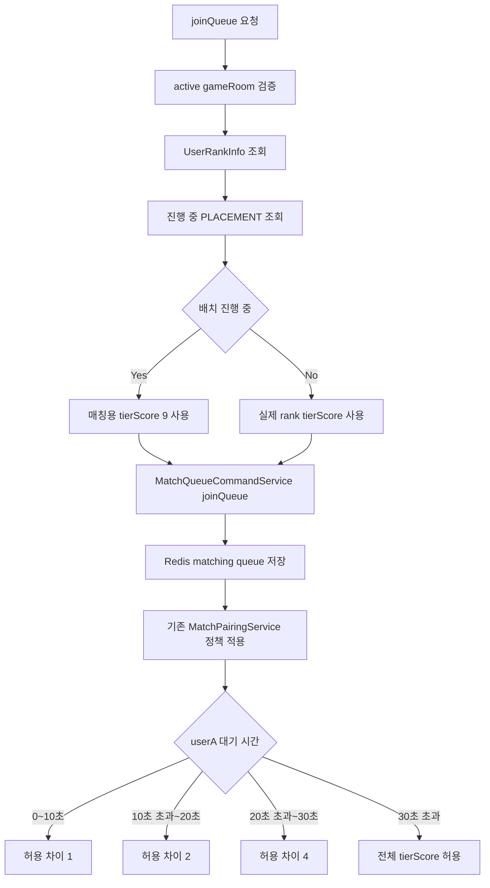
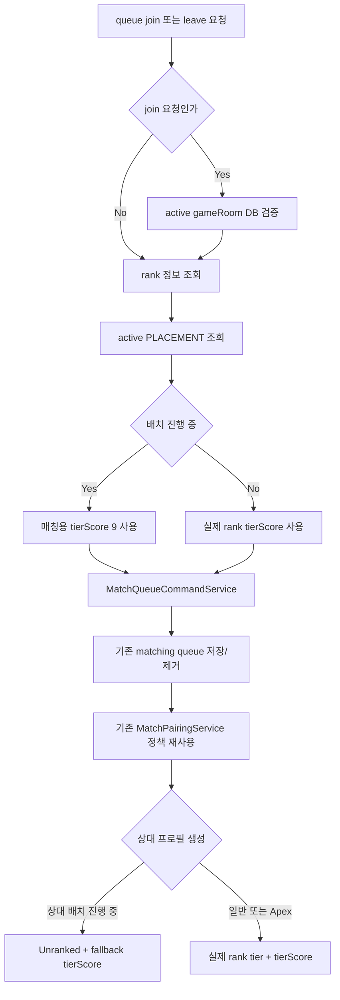

# Issue 64. 배치 유저 매칭 정책 정합성

## 📌 Feature Description

배치 진행 중인 유저가 실제 `UserRankInfo.rank` 기준으로 큐에 들어가던 흐름을 보정하고, 사용자 수가 적은 MVP 환경에서도 배치 유저가 매칭될 수 있도록 매칭용 tierScore를 Silver IV 기준 `9`에서 시작하게 함.

배치 유저는 큐 진입 시 `RankSeries.type=PLACEMENT`, `status=IN_PROGRESS` 여부로 식별함. 배치 중이면 실제 rank tierScore 대신 매칭용 tierScore `9`를 사용하고, 기존 `MatchPairingService`의 대기 시간별 확장 정책을 그대로 적용함. 따라서 배치 유저는 낮은 구간부터 매칭을 시작하고, 30초 초과 시에는 기존 Step 14 정책과 동일하게 전체 tierScore 범위에서 매칭될 수 있음.

또한 배치 완료 전 티어 미표시 정책에 맞춰 match 응답 상대 프로필에서 배치 유저는 `Unranked`로 표시함.

핵심 정책은 다음과 같음.

- 배치 진행 중 유저는 매칭용 tierScore를 `9`로 사용함.
- `9`는 현재 `Rank.getTierScore()` 기준 Silver IV tierScore임.
- 배치 유저끼리는 둘 다 tierScore `9`로 큐에 들어가므로 diff `0` 기준으로 즉시 매칭 가능함.
- 배치 유저도 기존 대기 시간별 확장 정책을 그대로 따름.
  - `0~10초`: `±1`
  - `10초 초과~20초`: `±2`
  - `20초 초과~30초`: `±4`
  - `30초 초과`: 전체 tierScore 허용
- 배치 유저의 실제 rank/LP 정산 정책은 변경하지 않음.
- `MatchTicket`, Redis queue key, Redis Lua atomic remove, `MatchSession` schema는 변경하지 않음.
- match 응답 상대 프로필에서 배치 유저는 `Unranked`로 표시함.

### Implementation Result

구현 완료 상태는 다음과 같음.

- `MatchQueueService.joinQueue`는 active gameRoom 여부를 가장 먼저 확인하고, `resolveQueueTierScore`로 매칭용 tierScore를 결정함.
- `MatchQueueService.leaveQueue`도 `resolveQueueTierScore`를 사용해 join/leave Redis queue key 불일치를 방지함.
- `resolveQueueTierScore`는 `UserRankInfo` 조회 후 `RankReadService.isPlacementInProgress`가 true면 tierScore `9`, 아니면 실제 `UserRankInfo.getTierScore()`를 반환함.
- `RankReadService.isPlacementInProgress`는 `RankSeries.type=PLACEMENT`, `status=IN_PROGRESS` 조건으로 active placement 여부를 조회함.
- `RankSeriesRepository.existsByUserIdAndStatusAndType`를 추가해 완료된 placement와 promotion series를 배치 진행 중으로 보지 않도록 함.
- `MatchTicket`은 기존처럼 `userId`, `tierScore`, `entryTime`만 보유함.
- `MatchQueueCommandService`와 `RedisMatchQueueStore`는 전달받은 tierScore를 그대로 `matching:queue:{tierScore}` key에 저장/제거함.
- `MatchPairingService`는 배치 여부를 직접 알지 않고, ticket의 tierScore 차이와 userA 대기 시간 기준으로 기존 매칭 정책을 재사용함.
- 30초 초과 전체 매칭 정책은 기존 `TIER_SCORE_MAX - TIER_SCORE_MIN` 기준 구현을 그대로 사용함.
- `MatchResponseResultService`는 실패 정산 시 기존처럼 `MatchSession`에 저장된 tierScore와 entryTime으로 수락 유저를 재큐잉함.
- `MatchOpponentProfileProvider`는 상대가 active placement면 tierName을 `Unranked`, tierScore를 match session/event fallback tierScore로 응답함.
- 일반/Apex 상대 프로필은 기존처럼 실제 `UserRankInfo.rank`와 `UserRankInfo.getTierScore()`를 응답함.

### Package Boundary

| 영역 | 패키지 | 책임 |
|------|--------|------|
| 배치 진행 여부 조회 | `smite-core` `domain/rank` | active `RankSeries` 중 `PLACEMENT` 여부 조회 |
| queue join/leave orchestration | `smite-api` `match/service` | active gameRoom 검증, rank/placement 조회, 매칭용 tierScore 결정 |
| 상대 프로필 표시 | `smite-api` `notification/match` | 배치 진행 중 유저를 `Unranked`로 표시 |
| 매칭 큐 저장 | `smite-matching` `command`, `infrastructure/redis` | 전달받은 tierScore로 기존 Redis queue 저장/제거 |
| 매칭 후보 판정 | `smite-matching` `domain/service` | 기존 대기 시간별 tierScore diff 정책 유지 |
| MatchTicket value object | `smite-core` `domain/match/domain` | 기존 userId, tierScore, entryTime 구조 유지 |

- DB 조회 책임은 `smite-core`와 이를 조율하는 `smite-api`에 둠.
- `smite-matching`은 배치 여부를 직접 조회하지 않고, 전달받은 tierScore만 처리함.
- Redis key 구조는 기존 `matching:queue:{tierScore}`를 유지함.
- `MatchTicket` schema와 `MatchSession` schema는 변경하지 않음.
- accept/reject/timeout, gameRoom 생성, record/rank 정산 흐름은 변경하지 않음.

### Placement Matching Policy

| 구분 | 처리 |
|------|------|
| 배치 진행 여부 | `RankSeries.type=PLACEMENT`, `status=IN_PROGRESS` |
| 배치 매칭용 tierScore | `9` |
| 기준 rank | Silver IV |
| 배치 유저끼리 매칭 | 즉시 가능, diff `0` |
| 30초 이전 확장 | 기존 `±1 / ±2 / ±4` 정책 재사용 |
| 30초 정확히 | 기존 `<= 30초` 기준으로 `±4` |
| 30초 초과 | 전체 tierScore 범위 허용 |
| 상대 프로필 표시 | `Unranked` |

배치 유저 매칭 예시는 다음과 같음.

| 배치 userA 대기 시간 | 기준 tierScore | 매칭 가능 범위 |
|--------------------|----------------|----------------|
| `0초 ~ 10초` | `9` | `8 ~ 10` |
| `10초 초과 ~ 20초` | `9` | `7 ~ 11` |
| `20초 초과 ~ 30초` | `9` | `5 ~ 13` |
| `30초 초과` | `9` | 전체 tierScore |

### Scope Boundary

이번 이슈에 포함함.

- 진행 중 `PLACEMENT` RankSeries 조회
- queue join 시 배치 유저 매칭용 tierScore `9` 적용
- queue leave 시 배치 유저 매칭용 tierScore `9` 적용
- 배치 유저끼리 즉시 매칭 가능 검증
- 배치 유저가 30초 초과 시 전체 tierScore 매칭 정책을 따르는지 검증
- match 응답 상대 프로필에서 배치 유저 `Unranked` 표시
- 일반 유저와 Apex 유저 매칭 정책 회귀 방지
- 정책 문서와 checkpoint 문서 갱신

이번 이슈에서 제외함.

- 배치 완료 시 최종 rank/LP 배정 정책 변경
- `RankSeries` 정산 로직 변경
- `game_records.seriesType=PLACEMENT` 정산 흐름 변경
- Redis queue key 분리
- `MatchTicket` schema 확장
- `MatchSession` schema 확장
- 배치 전용 matchmaking engine 분리
- 클라이언트 UI 레이아웃 변경

## 📚 Tasks

### 1. 정책과 현재 배치 매칭 경계 확정

- [x] 현재 `joinQueue/leaveQueue`가 실제 rank tierScore만 사용하는 흐름을 문서화함.
- [x] 배치 진행 중 유저의 매칭용 tierScore를 Silver IV 기준 `9`로 확정함.
- [x] 배치 유저끼리는 diff `0` 기준으로 즉시 매칭 가능하게 확정함.
- [x] 배치 유저도 기존 `±1 / ±2 / ±4 / 30초 초과 전체` 정책을 재사용하는 것으로 확정함.
- [x] `30초 정확히`는 기존처럼 `<= 30초` 구간으로 보고 `±4`를 유지함.
- [x] match 응답 상대 프로필에서 배치 유저는 `Unranked`로 표시하는 것으로 확정함.
- [x] `MatchTicket`, Redis queue key, Redis Lua atomic remove, `MatchSession` schema는 변경하지 않는 것으로 확정함.

Step 1 확정 결과는 다음과 같음.

- 현재 `MatchQueueService.joinQueue`는 active gameRoom 검증 후 `UserRankInfo.getTierScore()`를 그대로 `MatchQueueCommandService.joinQueue`에 전달함.
- 현재 `MatchQueueService.leaveQueue`도 `UserRankInfo.getTierScore()` 기준으로 Redis queue 제거를 위임함.
- 현재 `RankReadService`는 `UserRankInfo` 조회만 제공하고, active placement 여부 조회는 제공하지 않음.
- 현재 `RankSeriesRepository`는 `findByUserIdAndStatus`만 제공하므로 `type=PLACEMENT` 조건 조회가 필요함.
- 현재 `MatchOpponentProfileProvider`는 상대의 실제 rank를 tierName으로 응답하므로 active placement면 `Unranked`로 보정해야 함.
- 이번 이슈의 구현 경계는 api orchestration에서 배치 여부를 확인해 matching module에는 보정된 tierScore만 전달하는 방식으로 확정함.

### 2. core placement 조회 로직 추가

- [x] `RankSeriesRepository`에 userId, status, type 기준 조회 메서드를 추가함.
- [x] `RankReadService` 또는 적절한 read service에 active placement 여부 조회 메서드를 추가함.
- [x] `status=IN_PROGRESS`, `type=PLACEMENT`인 RankSeries만 배치 진행 중으로 판단함.
- [x] `SUCCESS`, `FAILED` 등 완료된 placement는 배치 진행 중으로 보지 않음.
- [x] promotion series는 배치 진행 중으로 보지 않음.

Step 2 구현 결과는 다음과 같음.

- `RankSeriesRepository.existsByUserIdAndStatusAndType`를 추가해 active placement 여부를 DB 조건으로 판단함.
- `RankReadService.isPlacementInProgress`를 추가해 api 계층이 repository를 직접 참조하지 않도록 함.
- 조회 조건은 `SeriesStatus.IN_PROGRESS`, `SeriesType.PLACEMENT`로 고정해 완료된 placement와 promotion을 제외함.
- 정산용 `findByUserIdAndStatus` pessimistic lock 조회는 변경하지 않음.

### 3. `MatchQueueService` queue join tierScore 보정

- [x] `joinQueue`에서 active gameRoom 검증 순서를 유지함.
- [x] `joinQueue`에서 `UserRankInfo`와 active placement 여부를 조회함.
- [x] 배치 진행 중이면 실제 rank tierScore 대신 `9`를 `MatchQueueCommandService.joinQueue`에 전달함.
- [x] 배치 진행 중이 아니면 기존처럼 `UserRankInfo.getTierScore()`를 전달함.
- [x] Redis 중복 큐 진입 방지 정책은 기존 순서를 유지함.

Step 3 구현 결과는 다음과 같음.

- `MatchQueueService.joinQueue`에서 active gameRoom 검증을 가장 먼저 수행하는 흐름을 유지함.
- rank 정보가 없으면 기존처럼 `CoreException(RANK_NOT_FOUND)`가 먼저 발생하고 placement 조회는 수행하지 않음.
- active placement면 `PLACEMENT_MATCHING_TIER_SCORE=9`를 matching module에 전달함.
- active placement가 아니면 기존 실제 rank tierScore를 matching module에 전달함.
- Redis status 기반 중복 큐 진입 차단은 기존처럼 `MatchQueueCommandService.joinQueue` 내부 정책을 그대로 사용함.

### 4. `MatchQueueService` queue leave tierScore 보정

- [x] `leaveQueue`에서도 active placement 여부를 조회함.
- [x] 배치 진행 중이면 `9`로 `MatchQueueCommandService.leaveQueue`를 호출함.
- [x] 배치 진행 중이 아니면 기존처럼 실제 rank tierScore로 제거함.
- [x] join과 leave의 tierScore 결정 기준을 같은 helper로 통일함.
- [x] 배치 유저가 queue에 들어간 뒤 취소할 때 Redis queue key 불일치가 발생하지 않도록 검증함.

Step 4 구현 결과는 다음과 같음.

- `MatchQueueService`의 tierScore 결정 helper를 `resolveQueueTierScore`로 통일함.
- `joinQueue`와 `leaveQueue`가 모두 같은 helper를 사용하므로 배치 유저는 진입/취소 모두 tierScore `9`를 사용함.
- 비배치 유저는 기존처럼 실제 `UserRankInfo.getTierScore()`를 사용함.
- `leaveQueue`는 기존처럼 active gameRoom 검증을 수행하지 않고 queue 취소만 위임함.
- Redis queue key `matching:queue:{tierScore}` 기준 join/leave 불일치를 방지함.

### 5. 기존 `MatchPairingService` 정책 재사용 검증

- [x] 배치 유저끼리 `tierScore 9` diff `0`으로 즉시 매칭되는지 테스트함.
- [x] 배치 유저가 0~10초 구간에서 `9 ± 1` 정책을 따르는지 검증함.
- [x] 배치 유저가 10초 초과~20초 구간에서 `9 ± 2` 정책을 따르는지 검증함.
- [x] 배치 유저가 20초 초과~30초 구간에서 `9 ± 4` 정책을 따르는지 검증함.
- [x] 배치 유저가 30초 초과 시 전체 tierScore 매칭 정책을 따르는지 기존 테스트로 회귀 확인함.
- [x] `MatchTicket`, Redis key, Lua atomic remove 구조가 변경되지 않는지 확인함.

Step 5 검증 결과는 다음과 같음.

- `MatchPairingService`는 배치 여부를 직접 조회하지 않고 `MatchTicket.tierScore()`만 기준으로 후보를 판정함.
- 배치 유저는 API 계층에서 tierScore `9`로 보정되므로 matching 엔진에서는 기존 일반 티어와 동일한 diff 계산 경로를 사용함.
- 배치 유저끼리 `9 ↔ 9`는 0~10초 구간에도 diff `0`으로 즉시 매칭됨.
- 배치 유저 기준 `0~10초`, `10초 초과~20초`, `20초 초과~30초`, `30초 초과` 구간을 모두 테스트로 고정함.
- `MatchTicket`, Redis queue key, Lua atomic remove 구조는 변경하지 않았음.

### 6. match 응답 상대 프로필 `Unranked` 표시

- [x] `MatchOpponentProfileProvider`에서 상대 유저의 active placement 여부를 조회함.
- [x] 상대가 배치 진행 중이면 tierName을 `Unranked`로 응답함.
- [x] 배치 유저의 opponent tierScore 표시값을 정책에 맞게 정리함.
- [x] 일반 유저와 Apex 유저의 rank 표시 정책은 기존대로 유지함.
- [x] rank 조회 실패 fallback `UNKNOWN` 정책과 `Unranked` 정책이 충돌하지 않도록 분리함.

Step 6 구현 결과는 다음과 같음.

- `MatchOpponentProfileProvider`가 상대의 `UserRankInfo` 조회 후 active placement 여부를 확인함.
- 상대가 배치 진행 중이면 실제 rank tierName 대신 `Unranked`를 응답함.
- 배치 진행 중 상대의 `tierScore`는 실제 rank tierScore가 아니라 match session/event에 저장된 fallback tierScore를 사용함.
- 일반/Apex 상대는 기존처럼 실제 rank tierName과 `UserRankInfo.getTierScore()`를 응답함.
- rank/profile 조회 실패 fallback `UNKNOWN` 경로는 기존대로 유지함.

### 7. 단위 테스트 추가

- [x] 배치 유저 `joinQueue`가 tierScore `9`로 matching module에 위임되는지 테스트함.
- [x] 배치 유저 `leaveQueue`가 tierScore `9`로 matching module에 위임되는지 테스트함.
- [x] 비배치 유저는 실제 rank tierScore로 join/leave 되는지 테스트함.
- [x] active placement 조회 조건이 `IN_PROGRESS + PLACEMENT`만 true인지 테스트함.
- [x] promotion 또는 완료된 placement는 배치 매칭용 tierScore를 적용하지 않는지 테스트함.
- [x] opponent profile에서 배치 유저가 `Unranked`로 표시되는지 테스트함.

Step 7 구현 결과는 다음과 같음.

- `MatchQueueServiceTest`에서 배치 join/leave는 tierScore `9`, 비배치 join/leave는 실제 rank tierScore를 사용하는지 검증함.
- `RankReadServiceTest`에서 active placement 조회가 `IN_PROGRESS + PLACEMENT` 조건으로 위임되는지 검증함.
- `RankSeriesRepositoryTest`를 추가해 완료된 placement와 진행 중 promotion은 active placement로 조회되지 않는지 JPA 파생 쿼리 기준으로 검증함.
- `MatchPairingServiceTest`에서 배치 tierScore `9`가 기존 대기 시간별 매칭 정책을 재사용하는지 검증함.
- `MatchResponseResultNotificationFactoryTest`에서 opponent profile의 `Unranked` 표시와 fallback tierScore 사용을 검증함.

### 8. 기존 정책 회귀 방지

- [x] 일반 유저 queue join/leave 기존 동작이 유지되는지 검증함.
- [x] Apex `29/33/37` scan 및 30초 초과 전체 매칭 정책이 유지되는지 검증함.
- [x] accept/reject/timeout 재큐잉 흐름에서 기존 ticket tierScore 기준이 유지되는지 확인함.
- [x] active gameRoom DB 검증이 placement 조회 추가 이후에도 joinQueue 가장 앞단에서 유지되는지 확인함.
- [x] Redis status 기반 중복 큐 진입 차단 정책이 유지되는지 확인함.

Step 8 검증 결과는 다음과 같음.

- 일반 유저 queue join/leave는 `MatchQueueServiceTest`의 기존 성공 케이스에서 실제 rank tierScore로 matching module에 위임되는지 검증함.
- active gameRoom DB 검증은 `MatchQueueServiceTest.joinQueue_activeGameRoom_exists`에서 rank/placement 조회와 matching module 호출 전에 차단되는지 검증함.
- Apex `29/33/37` scan은 `RedisMatchQueueStoreTest`의 Apex findAll/count/atomicPairRemove 테스트로 유지됨.
- 30초 초과 전체 tierScore 매칭은 `MatchPairingServiceTest.testSlidingWindow_FullRangeAfterThirtySeconds`로 유지됨.
- accept/reject/timeout 재큐잉은 `MatchResponseResultServiceTest`에서 `MatchSession`에 저장된 기존 tierScore와 entryTime으로 ticket을 재삽입하는지 검증함.
- Redis status 기반 중복 큐 진입 차단은 `MatchQueueCommandServiceTest.joinQueue_already_matching`에서 유지됨.
- 이번 단계에서 production code, `MatchTicket`, Redis key, Lua script, `MatchSession` schema는 변경하지 않음.

### 9. 문서 정합성

- [x] `docs/project/policy.md`의 배치 매칭 정책을 tierScore `9` 시작 기준으로 갱신함.
- [x] `docs/project/policy.md`의 배치 매칭 표현을 tierScore `9` 시작과 기존 대기 확장 재사용 정책에 맞춤.
- [x] `docs/antigravity/backend/plan-checkpoint.md` Step 15 체크리스트를 구현 결과에 맞게 갱신함.
- [x] Issue 문서에 구현 결과, 테스트 범위, 제외 범위를 반영함.
- [x] 배치 완료/정산 정책은 이번 이슈 범위가 아님을 문서에 명시함.

Step 9 문서 정합성 결과는 다음과 같음.

- `docs/project/policy.md`는 배치 진행 중 유저를 `RankSeries.type=PLACEMENT`, `status=IN_PROGRESS`로 식별하고, 매칭용 tierScore `9`를 사용하는 정책으로 정리됨.
- `docs/project/policy.md`의 오래된 고정 구간 매칭 표현은 제거됨.
- `docs/antigravity/backend/plan-checkpoint.md` Step 15는 구현 완료 항목과 회귀 검증 결과를 반영함.
- Issue 문서는 구현 전 분석 표현을 최종 구현 결과 기준으로 갱신함.
- 배치 완료 시 최종 rank/LP 배정, `RankSeries` 정산, `game_records.seriesType=PLACEMENT` 정산 흐름은 이번 이슈 범위가 아님을 유지함.

## 📝 Note

- 이번 이슈는 배치 유저가 매칭에 참여할 수 있도록 매칭용 tierScore를 보정하는 작업임.
- 배치 유저의 실제 rank/LP 정산은 기존 RankSeries 정책을 유지함.
- 배치 유저는 낮은 구간인 Silver IV tierScore `9`에서 시작해 기존 대기 시간 확장 정책을 그대로 사용함.
- 30초 초과 시에는 Step 14와 동일하게 전체 tierScore 범위 매칭을 허용함.
- 배치 유저끼리는 diff `0`으로 즉시 매칭될 수 있음.
- 배치 중 상대 프로필은 `Unranked`로 표시함.
- 사용자 수가 늘면 배치 전용 후보 범위나 MMR 기반 매칭을 별도 이슈로 고도화할 수 있음.

## 📌 Summary

배치 진행 중 유저를 `RankSeries.type=PLACEMENT`, `status=IN_PROGRESS` 기준으로 식별하고, queue join/leave에서 실제 rank tierScore 대신 Silver IV 기준 매칭용 tierScore `9`를 사용하도록 보정함.
matching module은 배치 여부를 직접 알지 않고 기존 `MatchTicket.tierScore()` 기반 대기 시간별 매칭 정책을 그대로 재사용함.

match 응답 상대 프로필에서는 배치 완료 전 티어 미표시 정책에 맞춰 active placement 유저를 `Unranked`로 표시하고, tierScore는 match session/event에 저장된 fallback tierScore를 사용함.

## 📚 Changes

- core read 경계에 active placement 조회를 추가함.
  - `RankSeriesRepository.existsByUserIdAndStatusAndType`를 추가함.
  - `RankReadService.isPlacementInProgress`에서 `IN_PROGRESS + PLACEMENT` 조건을 고정함.
  - 정산용 pessimistic lock 조회인 `findByUserIdAndStatus`는 변경하지 않음.

- `MatchQueueService`에서 queue join/leave tierScore 결정을 통일함.
  - 기존: join/leave 모두 실제 `UserRankInfo.getTierScore()` 사용
  - 변경: active placement면 tierScore `9`, 아니면 실제 rank tierScore 사용
  - join과 leave가 같은 `resolveQueueTierScore` helper를 사용해 Redis key 불일치를 방지함.
  - active gameRoom DB 검증은 기존처럼 join 흐름 가장 앞단에서 유지함.

- matching engine은 변경하지 않고 기존 정책을 재사용함.
  - 배치 전용 queue나 배치 전용 matchmaking engine을 만들지 않음.
  - 기존 `matching:queue:{tierScore}`, `MatchTicket`, Redis Lua atomic remove, `MatchSession` schema를 유지함.
  - 이 선택으로 schema 변경 없이 배치 유저 매칭 성사율을 높였지만, 배치 전용 MMR 정교화는 후속 고도화 범위로 남김.

- match 응답 상대 프로필 표시 정책을 보정함.
  - active placement 상대는 `Unranked`로 표시함.
  - active placement 상대의 tierScore는 실제 rank tierScore가 아니라 match session/event fallback tierScore를 사용함.
  - 일반/Apex 상대는 기존처럼 실제 rank tier와 tierScore를 표시함.
  - rank 조회 실패 fallback `UNKNOWN` 경로는 유지함.

- 단위 테스트와 회귀 테스트를 보강함.
  - 배치 join/leave tierScore `9` 위임 검증
  - active placement 조회 조건 검증
  - 배치 tierScore `9`의 기존 대기 시간별 매칭 정책 재사용 검증
  - opponent profile `Unranked` 표시 검증
  - 일반/Apex/재큐잉/active gameRoom/Redis 중복 큐 정책 회귀 확인

- 문서 정합성을 갱신함.
  - `docs/project/policy.md`
  - `docs/antigravity/backend/plan-checkpoint.md`
  - `docs/antigravity/backend/issue-64-placement-user-match-policy-consistency.md`

## 📝 Note

- 배치 완료 시 최종 rank/LP 배정 정책은 변경하지 않음.
- `RankSeries` 정산 로직과 `game_records.seriesType=PLACEMENT` 흐름은 변경하지 않음.
- 배치 유저는 MVP 환경에서 낮은 구간인 tierScore `9`에서 시작하고, 기존 `±1 / ±2 / ±4 / 30초 초과 전체` 확장 정책을 그대로 따름.
- queue 대기 중 placement가 외부 정산으로 완료되는 경합까지 완전히 막으려면 ticket에 저장된 tierScore 기준 제거 구조가 더 강하지만, 현재 정책과 정상 흐름에서는 join/leave가 같은 helper를 사용하므로 key 불일치를 방지함.

검증:

- `./gradlew :smite-core:test --tests com.sang.smite.domain.rank.repository.RankSeriesRepositoryTest --rerun-tasks`
- `./gradlew :smite-api:test --tests com.sang.smite.match.service.MatchQueueServiceTest --tests com.sang.smite.notification.match.factory.MatchResponseResultNotificationFactoryTest`
- `./gradlew :smite-matching:test --tests com.sang.smite.matching.domain.service.MatchPairingServiceTest --tests com.sang.smite.matching.infrastructure.redis.RedisMatchQueueStoreTest --tests com.sang.smite.matching.command.MatchServiceTest --tests com.sang.smite.matching.domain.service.MatchResponseResultServiceTest`
- `./gradlew :smite-core:test :smite-api:test :smite-matching:test`
- `git diff --check`

## 📌 Related Issue

- Closes #64
