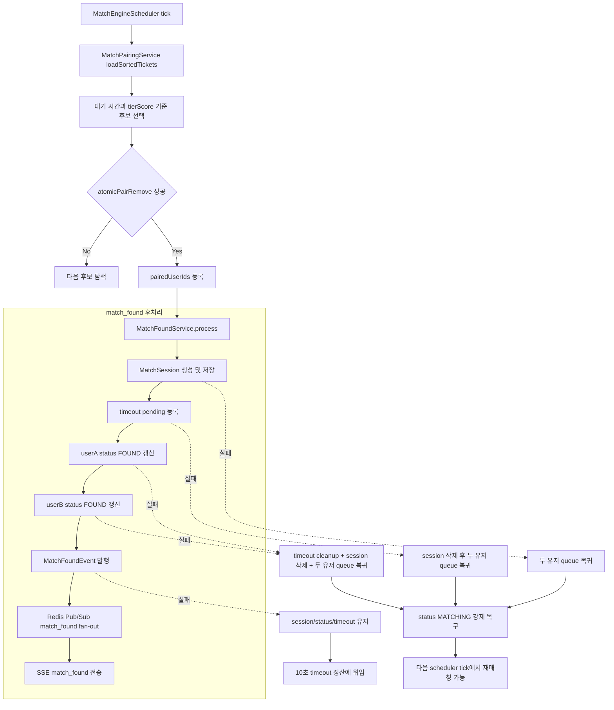

# Issue 66. Match Found Post-processing Recovery

## 📌 Feature Description

Match found post-processing should recover matched users safely when session, timeout, status, or event steps fail after Redis queue removal.

매칭 엔진은 `atomicPairRemove`로 두 유저를 Redis queue에서 원자 제거한 뒤 `MatchFoundService.process`를 호출한다. 이슈 시작 시점의 `MatchFoundService`는 user status를 `FOUND`로 먼저 갱신하고, `MatchSession` 저장, timeout pending 등록, `MatchFoundEvent` 발행을 순서대로 수행했다. 이 중간 단계에서 예외가 발생하면 큐에서 제거된 유저가 session 없이 `FOUND`에 갇히거나, timeout 정산 경로 없이 queue에서도 사라진 상태가 될 수 있다.

이번 이슈는 `atomicPairRemove` 성공 이후의 match found 후처리를 보상 가능한 흐름으로 정리한다. 외부에 `FOUND` 상태를 노출하기 전에 응답 가능한 `MatchSession`과 timeout 정산 경로를 먼저 만들고, session을 만들 수 없는 실패는 두 유저를 기존 `MatchTicket.entryTime`과 `tierScore`로 queue에 복귀시킨다.

핵심 정책은 다음과 같음.

- `FOUND` 상태를 유저에게 노출하기 전에 `MatchSession`과 timeout pending을 먼저 만든다.
- `MatchSession` 또는 timeout pending을 만들 수 없으면 해당 match found는 성립하지 않은 것으로 보고 두 유저를 queue에 복귀시킨다.
- queue 복귀 시 두 유저의 기존 `MatchTicket.entryTime`과 `tierScore`를 유지한다.
- queue 복귀가 확정된 보상 흐름에서는 `match:status:{userId}`를 `MATCHING`으로 강제 복구한다.
- userA 또는 userB 중 한 명의 `FOUND` 갱신만 성공한 경우에도 session을 폐기하고 두 유저 모두 queue에 복귀시킨다.
- `MatchFoundEvent` 발행 실패는 session, timeout, `FOUND` status를 유지하고 즉시 queue 복귀하지 않는다.
- 이벤트 발행 실패 후 응답이 없으면 기존 10초 timeout scheduler가 `PENDING + PENDING` 또는 실제 응답 조합을 최종 정산한다.
- `atomicPairRemove` 성공 후 paired 처리된 유저는 같은 scan cycle에서 다시 매칭하지 않고 다음 scheduler tick에서 다시 후보가 된다.
- 복구 작업은 Redis best-effort 보상으로 처리하고, outbox/saga 기반 보장형 복구는 이번 이슈 범위에 포함하지 않는다.
- 이번 이슈에서는 metric, Grafana dashboard를 추가하지 않는다.

### Current Implementation Analysis

이슈 시작 시점의 구현 상태는 다음과 같음.

- `MatchPairingService.processMatching`은 Redis queue snapshot을 읽고 `entryTime` 오름차순으로 정렬함.
- `MatchPairingService.confirmPair`는 후보 두 유저를 `MatchQueueStore.atomicPairRemove`로 queue에서 원자 제거함.
- `atomicPairRemove`가 성공하면 `completeMatchedPair`가 두 유저를 `pairedUserIds`에 등록하고 `MatchFoundService.process`를 호출함.
- `MatchPairingService.handleMatchedPair`는 `MatchFoundService.process` 예외를 catch하고 error log만 남긴 뒤 다음 후보 처리를 계속함.
- 이슈 시작 시점의 `MatchFoundService.process`는 user status `FOUND` 갱신을 session/timeout 생성보다 먼저 수행함.
- 이슈 시작 시점의 `MatchFoundService.process`는 session 저장 실패, timeout pending 등록 실패, `FOUND` status 일부 갱신 실패에 대한 queue 복귀 보상을 하지 않음.
- `MatchResponseResultService.timeoutWithLock`은 `MatchSession`이 있고 timeout pending job이 등록된 경우에만 deadline 정산을 수행할 수 있음.
- `MatchResponseResultService.returnAcceptedUserToQueue`는 실패 정산에서 수락 유저를 기존 `entryTime`과 `tierScore`로 queue에 복귀시키는 정책을 이미 사용함.
- `MatchFoundEvent` 이후 API 알림 계층은 Redis Pub/Sub과 SSE로 fan-out하며, Pub/Sub publish 실패는 알림 계층에서 로그로 격리하는 구조임.

### Package Boundary

| 영역 | 패키지 | 책임 |
|------|--------|------|
| 매칭 후보 탐색과 queue 원자 제거 | `smite-matching` `domain/service` | FIFO 정렬, 후보 선택, `atomicPairRemove`, 후처리 호출 |
| match found 후처리 | `smite-matching` `domain/service` | session 저장, timeout 등록, user status 전환, event 발행, 실패 보상 |
| Redis queue 저장소 | `smite-matching` `repository`, `infrastructure/redis` | `MatchTicket` add/remove/findAll/atomicPairRemove |
| Redis user status 저장소 | `smite-matching` `repository`, `infrastructure/redis` | `MATCHING`, `FOUND`, `ACCEPTED`, `IN_GAME` 등 점유 상태 저장 |
| Redis match session 저장소 | `smite-matching` `repository`, `infrastructure/redis` | `match:session:{matchId}` 저장/조회/삭제 |
| Redis timeout index | `smite-matching` `repository`, `infrastructure/redis` | response timeout pending/processing ZSET 관리 |
| timeout 정산 | `smite-matching` `domain/service`, `scheduler` | 10초 deadline 이후 실패 조합 정산 |
| match_found 알림 fan-out | `smite-api` `notification/match` | Spring event 수신, Redis Pub/Sub publish/subscribe, SSE 전송 |
| MatchTicket / MatchSession | `smite-core` `domain/match/domain` | 매칭 ticket/session value object |

- 이번 이슈의 주 구현 위치는 `smite-matching`의 `MatchFoundService`임.
- `MatchPairingService`의 paired 처리 시점과 scheduler 구조는 유지함.
- `smite-api` notification 계층의 Pub/Sub/SSE 구조는 변경하지 않음.
- `MatchTicket` schema와 Redis queue key 구조는 변경하지 않음.
- `MatchSession` schema와 timeout scheduler 구조는 변경하지 않음.

### Recovery Policy

| 실패 지점 | 처리 |
|----------|------|
| session 저장 실패 | 두 유저를 기존 ticket으로 queue에 복귀시키고 status를 `MATCHING`으로 강제 복구 |
| timeout pending 등록 실패 | session 삭제 후 두 유저를 queue에 복귀시키고 status를 `MATCHING`으로 강제 복구 |
| userA `FOUND` 갱신 실패 | timeout cleanup, session 삭제, 두 유저 queue 복귀, status `MATCHING` 강제 복구 |
| userB `FOUND` 갱신 실패 | timeout cleanup, session 삭제, 두 유저 queue 복귀, status `MATCHING` 강제 복구 |
| event 발행 실패 | session/timeout/status 유지, queue 복귀 없음, 10초 timeout 정산에 위임 |
| 보상 작업 일부 실패 | 나머지 보상은 계속 시도하고 새 로그/metric 추가는 이번 이슈에서 보류 |

보상 정책 세부 기준은 다음과 같음.

- queue 복귀는 `matchQueueStore.add(originalTicket)`로 처리한다.
- queue 복귀 후 user status는 `userStatusStore.updateStatus(userId, MATCHING, STATUS_TTL_SECONDS)`로 강제 복구한다.
- `setStatusIfAbsent`는 사용하지 않는다. 일부 `FOUND`가 남은 경우 queue에 있는데 status가 `FOUND`인 불일치가 생길 수 있기 때문이다.
- event 발행 실패는 queue 복귀 보상 대상이 아니다. 일부 클라이언트가 이미 알림을 받았을 수 있으므로 세션을 유지한다.
- event 발행 실패 후 유저 응답이 없으면 기존 timeout 정산이 `PENDING + PENDING`으로 두 유저를 timeout 이탈 처리한다.
- session/timeout/status 생성 실패로 queue 복귀한 유저는 같은 scan cycle에서는 다시 매칭되지 않고 다음 tick에서 재매칭 대상이 된다.

### Scope Boundary

이번 이슈에 포함함.

- `MatchFoundService` 후처리 순서를 session 저장, timeout 등록, user status `FOUND`, event 발행 순서로 변경
- session 저장 실패 시 두 유저 queue 복귀
- timeout pending 등록 실패 시 session 삭제와 두 유저 queue 복귀
- user status `FOUND` 갱신 실패 시 timeout cleanup, session 삭제, 두 유저 queue 복귀
- queue 복귀 시 기존 `entryTime`과 `tierScore` 유지
- queue 복귀 유저의 status를 `MATCHING`으로 강제 복구
- event 발행 실패는 session/timeout/status 유지 후 timeout 정산에 위임
- 보상 작업을 best-effort로 분리해 하나 실패해도 나머지 보상을 계속 시도
- `MatchFoundServiceTest` 후처리 실패/복구 테스트 추가
- 정책 문서와 checkpoint 문서 갱신

이번 이슈에서 제외함.

- 동일 IP 셀프 매칭 방지
- client IP 추출 및 proxy/load balancer header 신뢰 정책
- `MatchTicket` IP/hash 필드 추가
- Redis queue key 또는 Lua atomic remove 구조 변경
- `MatchSession` schema 변경
- timeout scheduler 구조 변경
- Redis Pub/Sub 보장형 delivery 구현
- DB outbox/saga 기반 복구
- metric 추가
- Grafana dashboard 수정
- accept/reject/timeout 정책 변경
- gameRoom 생성, WebSocket, record/rank 정산 변경

## 📚 Tasks

### 1. 정책과 현재 match_found 후처리 경계 확정

- [x] `atomicPairRemove` 이후 후처리 실패가 발생할 수 있는 지점을 session 저장, timeout 등록, user status 갱신, event 발행으로 구분함.
- [x] `FOUND` status 노출 전에 session과 timeout pending이 먼저 존재해야 한다는 정책을 확정함.
- [x] session 또는 timeout 생성 실패는 match found 미성립으로 보고 두 유저 모두 queue 복귀하는 것으로 확정함.
- [x] event 발행 실패는 match found session을 유지하고 timeout 정산에 위임하는 것으로 확정함.
- [x] queue 복귀 시 기존 `entryTime`과 `tierScore`를 유지하는 것으로 확정함.
- [x] queue 복귀 보상 시 status는 `MATCHING`으로 강제 복구하는 것으로 확정함.
- [x] 같은 scan cycle에서 재매칭하지 않고 다음 scheduler tick에서 재매칭하는 것으로 확정함.
- [x] metric/Grafana와 동일 IP 셀프 매칭 방지는 이번 이슈 범위에서 제외함.

확정한 구현 경계는 다음과 같음.

- `MatchFoundService`는 session/timeout/status/event 후처리와 실패 보상을 담당함.
- `MatchPairingService`는 기존처럼 queue 원자 제거와 paired set 관리를 담당함.
- `MatchResponseTimeoutService`와 `MatchResponseResultService.timeoutWithLock`는 기존 timeout 정산 흐름을 유지함.
- notification Pub/Sub/SSE 계층은 event 발행 이후의 fan-out만 담당하고, 이번 이슈에서는 변경하지 않음.
- `atomicPairRemove` 성공 후 session/timeout/status 생성 단계에서 실패하면 `MatchFoundService`가 두 유저 queue 복귀와 `MATCHING` status 복구를 best-effort로 수행함.
- `MatchFoundEvent` 발행 실패는 일부 클라이언트 수신 가능성을 고려해 복귀 보상을 수행하지 않고 기존 timeout 정산에 맡김.
- 동일 IP 셀프 매칭 방지와 운영 metric은 Issue 66 구현 완료 후 별도 이슈에서 다룸.

### 2. `MatchFoundService` 처리 순서 재구성

- [x] `MatchFoundService.process`에서 `matchId`와 `MatchSession`을 먼저 생성하도록 정리함.
- [x] `sessionStore.save(session, MATCH_SESSION_TTL_SECONDS)`를 user status 갱신보다 먼저 수행함.
- [x] `timeoutStore.addPending(matchId, deadlineMillis)`를 user status 갱신보다 먼저 수행함.
- [x] `userStatusStore.updateStatus(userA, FOUND, STATUS_TTL_SECONDS)`를 session/timeout 준비 후 수행함.
- [x] `userStatusStore.updateStatus(userB, FOUND, STATUS_TTL_SECONDS)`를 userA 갱신 다음에 수행함.
- [x] `eventPublisher.publishEvent(new MatchFoundEvent(...))`를 마지막 단계로 유지함.
- [x] 정상 흐름에서 기존 `match_found` payload와 accept timeout seconds가 변경되지 않도록 유지함.

구현 시 주의할 점은 다음과 같음.

- `clock.millis()` 기준 timeout deadline 계산 정책은 유지함.
- `UUID.randomUUID().toString()` 기반 matchId 생성 정책은 유지함.
- `MatchSession.create`에 전달하는 userId, tierScore, entryTime은 기존 ticket 값을 그대로 사용함.
- `MatchFoundEvent`의 userA/userB와 accept timeout seconds는 기존 이벤트 계약을 유지함.

### 3. session 저장 실패 보상 구현

- [x] `sessionStore.save` 실패를 `MatchFoundService` 내부에서 감지함.
- [x] session 저장 실패 시 timeout cleanup이나 session delete를 시도하지 않음.
- [x] session 저장 실패 시 userA/userB를 원래 `MatchTicket`으로 queue에 복귀시킴.
- [x] queue 복귀 후 userA/userB status를 `MATCHING`으로 강제 복구함.
- [x] userA queue 복귀 실패와 userB queue 복귀 실패를 각각 격리해 나머지 보상을 계속 시도함.
- [x] userA status 복구 실패와 userB status 복구 실패를 각각 격리해 나머지 보상을 계속 시도함.
- [x] session 저장 실패 시 `MatchFoundEvent`를 발행하지 않음.

완료 기준은 다음과 같음.

- session 저장 실패 후 두 유저 모두 `matchQueueStore.add(originalTicket)` 대상이 됨.
- session 저장 실패 후 두 유저 모두 `MATCHING` status 복구 대상이 됨.
- session 저장 실패 후 `timeoutStore.addPending`과 `eventPublisher.publishEvent`는 호출되지 않음.

### 4. timeout pending 등록 실패 보상 구현

- [ ] `timeoutStore.addPending` 실패를 `MatchFoundService` 내부에서 감지함.
- [ ] timeout 등록 실패 시 저장된 `MatchSession`을 삭제함.
- [ ] timeout 등록 실패 시 userA/userB를 원래 `MatchTicket`으로 queue에 복귀시킴.
- [ ] queue 복귀 후 userA/userB status를 `MATCHING`으로 강제 복구함.
- [ ] session 삭제 실패가 발생해도 queue 복귀와 status 복구를 계속 시도함.
- [ ] timeout 등록 실패 시 user status `FOUND` 갱신을 수행하지 않음.
- [ ] timeout 등록 실패 시 `MatchFoundEvent`를 발행하지 않음.

완료 기준은 다음과 같음.

- timeout 등록 실패 후 `sessionStore.delete(matchId)`가 호출됨.
- timeout 등록 실패 후 두 유저 모두 기존 ticket으로 queue 복귀 대상이 됨.
- timeout 등록 실패 후 두 유저 모두 `MATCHING` status 복구 대상이 됨.
- timeout 등록 실패 후 `eventPublisher.publishEvent`는 호출되지 않음.

### 5. user status `FOUND` 갱신 실패 보상 구현

- [ ] userA `FOUND` 갱신 실패를 감지함.
- [ ] userB `FOUND` 갱신 실패를 감지함.
- [ ] userA 또는 userB 중 한 명이라도 `FOUND` 갱신에 실패하면 해당 match found session을 폐기함.
- [ ] `FOUND` 갱신 실패 시 timeout pending cleanup을 시도함.
- [ ] `FOUND` 갱신 실패 시 `MatchSession` 삭제를 시도함.
- [ ] `FOUND` 갱신 실패 시 userA/userB를 원래 `MatchTicket`으로 queue에 복귀시킴.
- [ ] queue 복귀 후 userA/userB status를 `MATCHING`으로 강제 복구함.
- [ ] userA `FOUND`는 성공하고 userB `FOUND`가 실패한 경우에도 두 유저 모두 queue 복귀와 `MATCHING` 복구 대상이 됨.
- [ ] timeout cleanup 실패 또는 session 삭제 실패가 발생해도 queue 복귀와 status 복구를 계속 시도함.
- [ ] `FOUND` 갱신 실패 시 `MatchFoundEvent`를 발행하지 않음.

완료 기준은 다음과 같음.

- 일부 `FOUND`만 성공한 불완전 match found session은 유지되지 않음.
- `FOUND` 갱신 실패 후 timeout pending과 session 삭제가 best-effort로 시도됨.
- `FOUND` 갱신 실패 후 두 유저 모두 기존 ticket으로 queue 복귀 대상이 됨.
- `FOUND` 갱신 실패 후 두 유저 모두 `MATCHING` status 복구 대상이 됨.

### 6. event 발행 실패 격리 구현

- [ ] `eventPublisher.publishEvent` 실패를 session/status/timeout 복구 대상과 분리함.
- [ ] event 발행 실패 시 session을 삭제하지 않음.
- [ ] event 발행 실패 시 timeout pending을 cleanup하지 않음.
- [ ] event 발행 실패 시 user status `FOUND`를 유지함.
- [ ] event 발행 실패 시 userA/userB를 queue에 복귀시키지 않음.
- [ ] event 발행 실패 시 session/status/timeout 결과를 되돌리지 않고 새 로그/metric은 추가하지 않음.
- [ ] event 발행 실패 후 응답이 없으면 기존 timeout scheduler가 정산한다는 정책을 문서화함.

완료 기준은 다음과 같음.

- event 발행 실패는 `MatchFoundService.process`의 session/timeout/status 결과를 되돌리지 않음.
- event 발행 실패 후 timeout pending이 남아 있어 10초 deadline 정산이 가능함.
- event 발행 실패 후 `matchQueueStore.add`가 호출되지 않음.

### 7. best-effort 보상 helper 정리

- [ ] queue 복귀 helper를 추가해 `matchQueueStore.add(originalTicket)` 호출을 한 곳에서 처리함.
- [ ] status 복구 helper를 추가해 `userStatusStore.updateStatus(userId, MATCHING, STATUS_TTL_SECONDS)` 호출을 한 곳에서 처리함.
- [ ] session 삭제 helper를 추가해 `sessionStore.delete(matchId)` 실패를 격리함.
- [ ] timeout cleanup helper를 추가해 `timeoutStore.cleanup(matchId)` 실패를 격리함.
- [ ] 한 보상 작업 실패가 다른 보상 작업을 중단하지 않도록 각 보상 단위를 별도 try-catch로 분리함.
- [ ] 새 helper는 `MatchFoundService` 내부 private method로 유지하고 외부 API로 노출하지 않음.
- [ ] 불필요한 추상화나 새 service 분리는 하지 않고 현재 `smite-matching` 패키지 경계를 유지함.

구현 기준은 다음과 같음.

- session/timeout/status 생성 단계의 실패 처리만 보상 helper를 사용함.
- event 발행 실패는 보상 helper를 호출하지 않음.
- 이번 이슈에서는 새 로그 문구와 metric 호출을 추가하지 않음.

### 8. `MatchFoundServiceTest` 정상/실패 케이스 추가

- [ ] 정상 흐름에서 session 저장, timeout 등록, userA/userB `FOUND` 갱신, event 발행 순서를 검증함.
- [ ] session 저장 실패 시 queue 복귀와 `MATCHING` status 복구를 검증함.
- [ ] session 저장 실패 시 timeout 등록과 event 발행이 호출되지 않는지 검증함.
- [ ] timeout pending 등록 실패 시 session 삭제, queue 복귀, `MATCHING` status 복구를 검증함.
- [ ] timeout pending 등록 실패 시 user status `FOUND` 갱신과 event 발행이 호출되지 않는지 검증함.
- [ ] userA `FOUND` 갱신 실패 시 timeout cleanup, session 삭제, queue 복귀, `MATCHING` status 복구를 검증함.
- [ ] userB `FOUND` 갱신 실패 시 userA까지 포함해 두 유저 모두 queue 복귀와 `MATCHING` status 복구 대상인지 검증함.
- [ ] event 발행 실패 시 session/timeout/status를 유지하고 queue 복귀가 호출되지 않는지 검증함.
- [ ] 보상 작업 일부가 실패해도 나머지 보상 작업을 계속 시도하는지 검증함.

테스트 기준은 다음과 같음.

- `ArgumentCaptor<MatchSession>`으로 저장된 session의 userId, tierScore, entryTime, status, response status를 검증함.
- `ArgumentCaptor<MatchTicket>`으로 queue 복귀 ticket이 원래 `entryTime`과 `tierScore`를 유지하는지 검증함.
- Mockito `InOrder`를 사용해 정상 흐름의 session, timeout, status, event 순서를 검증함.
- event 발행 실패 테스트는 `RuntimeException`을 던지게 하고 보상 호출이 없는지 검증함.
- metric 검증은 추가하지 않음.

### 9. `MatchPairingService` 회귀 확인

- [ ] `atomicPairRemove` 성공 즉시 paired 처리하는 기존 흐름을 유지함.
- [ ] 후처리 실패로 queue 복귀한 유저가 같은 scan cycle에서 재매칭되지 않고 다음 scheduler tick에서 처리되는 정책을 문서화함.
- [ ] `MatchPairingService`에서 후처리 실패 예외를 catch하고 다음 후보 처리를 계속하는 기존 흐름을 유지함.
- [ ] `MatchPairingServiceTest` 기존 paired 중복 방지 테스트가 깨지지 않는지 확인함.
- [ ] 필요 시 후처리 실패 발생 시에도 scan loop가 중단되지 않는 회귀 테스트를 보강함.

완료 기준은 다음과 같음.

- `MatchPairingService`의 queue scan, 후보 선택, paired set 관리 책임은 변경되지 않음.
- 후처리 실패 보상은 `MatchFoundService` 내부 책임으로 유지됨.
- 기존 매칭 범위, Apex, 배치, atomicPairRemove 회귀 테스트가 통과함.

### 10. 문서와 checkpoint 갱신

- [ ] `docs/antigravity/backend/plan-checkpoint.md` Step 16 체크리스트를 이번 이슈 정책에 맞게 갱신함.
- [ ] Step 16 완료 후 구현 결과를 이 문서의 task 체크 상태와 Implementation Result 섹션에 반영함.
- [ ] 동일 IP 셀프 매칭 방지는 Step 17 또는 별도 이슈로 분리되어 있음을 checkpoint에 유지함.
- [ ] metric/Grafana 제외 정책을 문서에 남김.
- [ ] outbox/saga 기반 보장형 복구는 후속 이슈 범위로 남김.

### 11. 검증

- [ ] `./gradlew :smite-matching:test`를 실행함.
- [ ] `./gradlew test`를 실행함.
- [ ] 신규 `MatchFoundServiceTest`가 정상/실패/보상 경로를 모두 통과하는지 확인함.
- [ ] 기존 `MatchPairingServiceTest`, `MatchResponseResultServiceTest`, timeout scheduler 테스트가 통과하는지 확인함.
- [ ] 테스트 결과를 이 문서 Implementation Result에 기록함.

## 변경 이력

| 날짜 | 변경 내용 |
| :--- | :--- |
| 2026-05-29 | Issue 66 match_found 후처리 실패 복구 정책, 구현 흐름, task 초안 작성 |
