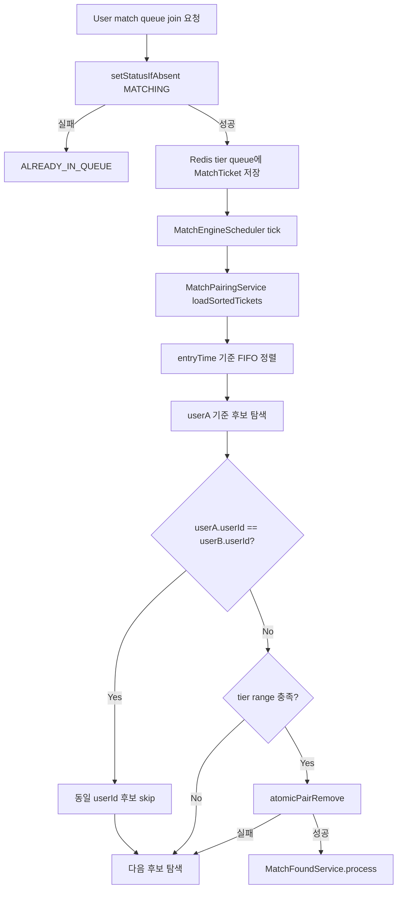
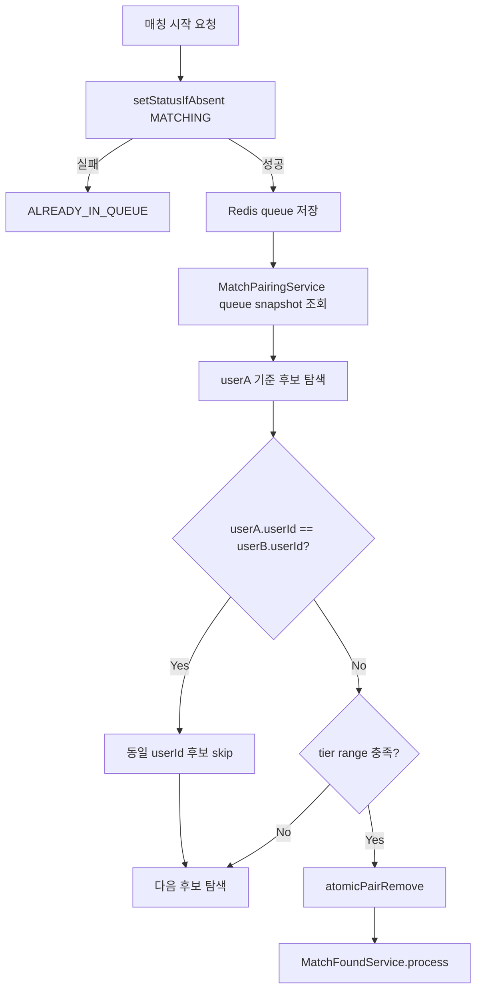
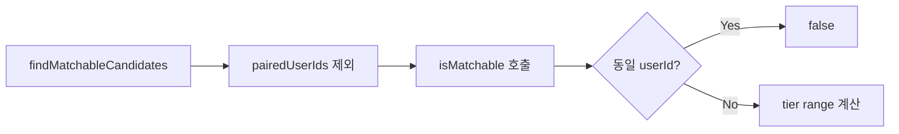
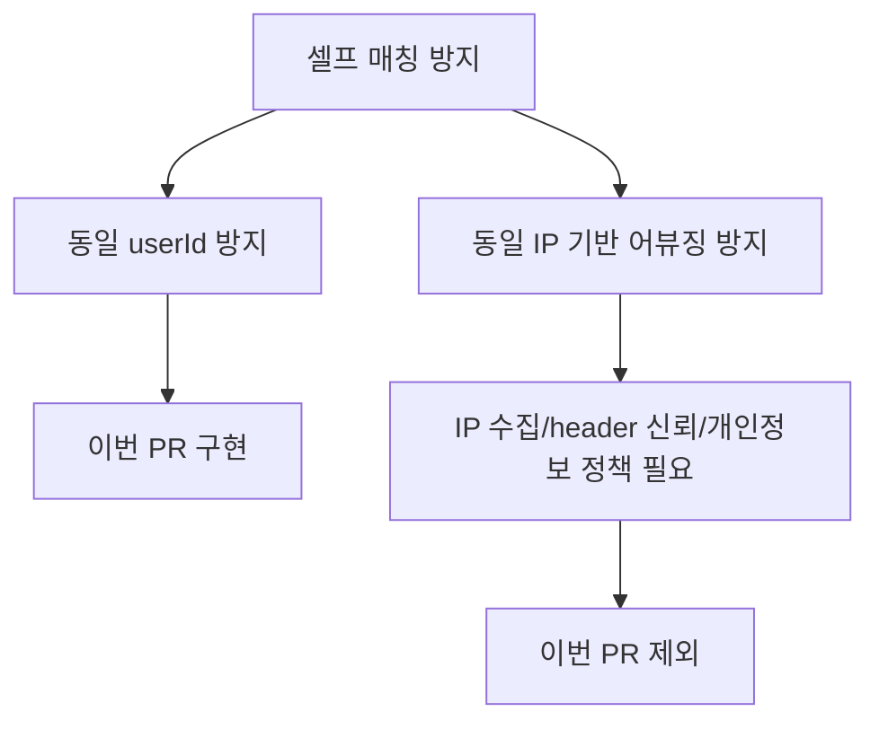
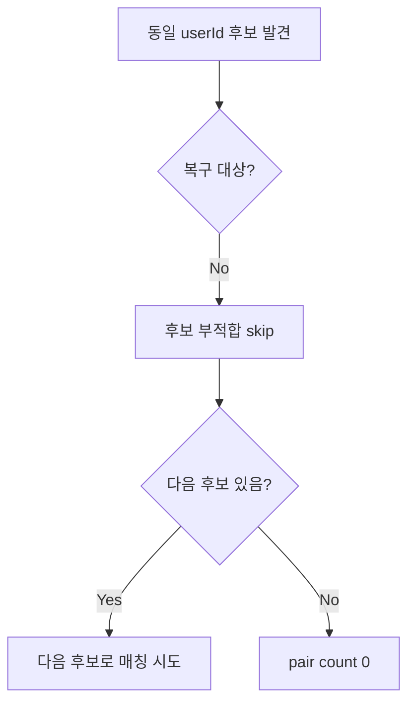

# Issue 68. 셀프 매칭 방지 기능 구현

## 📌 Feature Description

매칭 queue 정상 진입 흐름에서는 `MatchQueueCommandService.joinQueue`가 `userStatusStore.setStatusIfAbsent(userId, MATCHING, STATUS_TTL_SECONDS)`를 먼저 호출해 동일 userId 중복 진입을 막는다. Redis queue도 tier별 ZSET member를 `userId`로 저장하므로 같은 tier queue 안에서는 동일 userId가 중복으로 쌓이기 어렵다.

다만 Redis queue snapshot 오염, 복구 과정, tier queue 불일치처럼 비정상 상태가 생기면 같은 userId의 `MatchTicket`이 서로 다른 tier queue에서 동시에 조회될 수 있다. 이슈 시작 시점의 `MatchPairingService.isMatchable`은 tier 차이만 판단했으므로, 이런 비정상 snapshot에서는 동일 userId끼리 `atomicPairRemove`와 `MatchFoundService.process`까지 진행될 수 있었다.

이번 이슈는 정상 queue 진입 정책은 유지하면서, pairing 단계에 동일 userId 후보 제외 방어선을 추가한다. 동일 userId 후보는 장애나 복구 대상이 아니라 후보 부적합으로 처리하고, 가능한 경우 다음 후보 탐색을 계속한다.



핵심 정책은 다음과 같음.

- 정상 queue 진입의 동일 userId 중복 방지는 기존 `setStatusIfAbsent` 정책을 유지한다.
- pairing 단계에서도 동일 userId 후보는 matchable 후보로 보지 않는다.
- 동일 userId 후보 제외는 실패나 예외가 아니라 후보 부적합 skip으로 처리한다.
- 동일 userId 후보를 제외해도 scan loop와 다음 후보 탐색은 계속한다.
- 서로 다른 userId의 기존 FIFO, tier range, `atomicPairRemove`, match found 후처리 흐름은 변경하지 않는다.
- 동일 IP 기반 어뷰징 방지, client IP 수집, proxy/load balancer header 신뢰 정책은 이번 이슈 범위에 포함하지 않는다.
- 이번 이슈에서는 새 로그, metric, Grafana dashboard를 추가하지 않는다.

### Current Implementation Analysis

이슈 시작 시점의 구현 상태는 다음과 같음.

- `MatchQueueCommandService.joinQueue`는 queue 추가 전에 `userStatusStore.setStatusIfAbsent(userId, MATCHING, STATUS_TTL_SECONDS)`를 호출한다.
- `setStatusIfAbsent`가 실패하면 `MatchingErrorCode.ALREADY_IN_QUEUE`로 queue 진입을 거절한다.
- `RedisMatchQueueStore.add`는 tier별 ZSET에 `entryTime`을 score, `userId`를 member로 저장한다.
- `RedisMatchQueueStore.findAll`은 모든 tier queue를 조회한 뒤 `MatchTicket(userId, tierScore, entryTime)` 목록으로 변환한다.
- `MatchPairingService.loadSortedTickets`는 queue snapshot을 `entryTime` 오름차순으로 정렬한다.
- `MatchPairingService.findMatchableCandidates`는 이미 paired 처리된 userId와 `isMatchable` 실패 후보만 제외한다.
- `MatchPairingService.isMatchable`은 당시 userA 대기 시간 기반 tier 허용 범위와 userB tier 차이만 판단했다.
- `MatchPairingService.confirmPair`는 후보 두 유저를 `MatchQueueStore.atomicPairRemove`로 queue에서 원자 제거하고, 성공하면 `MatchFoundService.process`를 호출한다.

### Package Boundary

| 영역 | 패키지 | 책임 |
|------|--------|------|
| queue 진입 중복 방지 | `smite-matching` `command` | `setStatusIfAbsent`로 동일 userId 정상 중복 진입 차단 |
| 매칭 후보 탐색 | `smite-matching` `domain/service` | FIFO 정렬, 후보 선택, matchable 판정 |
| Redis queue 저장소 | `smite-matching` `repository`, `infrastructure/redis` | `MatchTicket` add/remove/findAll/atomicPairRemove |
| match found 후처리 | `smite-matching` `domain/service` | session 저장, timeout 등록, user status 전환, event 발행 |
| MatchTicket | `smite-core` `domain/match/domain` | userId, tierScore, entryTime value object |

- 이번 이슈의 주 구현 위치는 `smite-matching`의 `MatchPairingService`임.
- `MatchQueueCommandService`의 queue 진입 정책은 변경하지 않음.
- `MatchTicket` schema와 Redis queue key 구조는 변경하지 않음.
- Lua `atomic_pair_remove` 구조는 변경하지 않음.
- `MatchFoundService` 후처리와 Issue 66 복구 정책은 변경하지 않음.

### Matching Policy

| 상황 | 처리 |
|------|------|
| 정상 queue 진입에서 동일 userId가 이미 `MATCHING` | `ALREADY_IN_QUEUE`로 진입 거절 |
| 같은 tier queue에 동일 userId add | ZSET member 갱신 성격으로 중복 row처럼 쌓이지 않음 |
| queue snapshot에 동일 userId 티켓 2개가 존재 | pairing 후보에서 제외 |
| 동일 userId 후보 뒤에 다른 matchable 후보가 존재 | 동일 userId 후보는 skip하고 다음 후보와 매칭 시도 |
| 동일 userId 후보밖에 없음 | 이번 scheduler tick에서 매칭 성사 없음 |

정책 세부 기준은 다음과 같음.

- 동일 userId 판단은 `userA.userId().equals(userB.userId())`로 처리한다.
- 동일 userId 후보는 `atomicPairRemove` 호출 전 단계에서 제외한다.
- 동일 userId 후보 제외 시 queue 삭제, status 변경, session 생성, event 발행을 하지 않는다.
- 동일 userId 후보 제외는 복구 흐름이 아니므로 `MatchFoundService` 보상 helper를 호출하지 않는다.
- 동일 userId 후보가 skip되어도 userA는 같은 scan cycle 안에서 다음 후보를 계속 탐색한다.

### Scope Boundary

이번 이슈에 포함함.

- queue 진입 단계의 동일 userId 중복 방지 정책 확인
- Redis queue snapshot에 동일 userId 티켓이 중복 포함될 수 있는 비정상 경로 정리
- `MatchPairingService` 후보 판정에서 동일 userId 후보 제외
- 동일 userId 후보 제외 후 다음 후보 탐색 유지
- 동일 userId 후보만 존재할 때 매칭 미발생 검증
- `MatchPairingServiceTest` 회귀 테스트 추가
- 정책 문서와 checkpoint 문서 갱신

이번 이슈에서 제외함.

- 동일 IP 기반 어뷰징 방지 정책
- client IP 추출 및 proxy/load balancer header 신뢰 정책
- `MatchTicket` IP/hash 필드 추가
- Redis queue key 또는 Lua atomic remove 구조 변경
- queue 진입 API 계약 변경
- `MatchFoundService` 후처리 복구 정책 변경
- metric 추가
- Grafana dashboard 수정

## 📚 Tasks

### 1. 현재 queue 진입 중복 방지 정책 확인

- [x] `MatchQueueCommandService.joinQueue`의 `setStatusIfAbsent` 기반 동일 userId 중복 진입 차단 흐름 확인
- [x] `setStatusIfAbsent` 실패 시 `ALREADY_IN_QUEUE`로 queue add가 수행되지 않는지 확인
- [x] `RedisMatchQueueStore.add`가 tier별 ZSET member를 `userId`로 저장하는 구조 확인
- [x] 정상 API 흐름에서는 동일 userId가 중복 queue 진입하기 어렵다는 경계를 문서화

완료 기준은 다음과 같음.

- 정상 queue 진입 단계와 pairing 단계의 책임 경계가 분리되어 설명됨.
- 이번 이슈가 정상 진입 정책 변경이 아니라 pairing 단계 방어선 추가임이 문서화됨.

확인 결과는 다음과 같음.

- `MatchQueueCommandService.joinQueue`는 queue 추가 전에 `userStatusStore.setStatusIfAbsent(userId, MATCHING, STATUS_TTL_SECONDS)`를 호출함.
- `setStatusIfAbsent`가 `false`를 반환하면 `MatchingErrorCode.ALREADY_IN_QUEUE`를 던지고 `matchStore.add`를 호출하지 않음.
- `MatchQueueCommandServiceTest.joinQueue_already_matching`은 이미 매칭 중인 유저의 queue add 미호출을 검증함.
- `RedisMatchUserStatusStoreTest.setIfAbsent_alreadyExists`는 기존 status가 있으면 새 status 저장이 무시되고 `false`가 반환되는 것을 검증함.
- `RedisMatchQueueStore.add`는 tier별 ZSET에 `entryTime`을 score, `userId`를 member로 저장하므로 같은 tier queue 안에서는 동일 userId가 중복 row처럼 쌓이지 않음.
- 따라서 이번 이슈는 정상 queue 진입 정책 변경이 아니라, 비정상 queue snapshot이 pairing 단계까지 들어왔을 때 동일 userId 후보를 제외하는 방어선 추가임.

### 2. 동일 userId 중복 snapshot 비정상 경로 정리

- [x] 서로 다른 tier queue에 같은 userId ticket이 남을 수 있는 비정상 상황을 정리
- [x] queue 복구, tier 변경, Redis 데이터 불일치 같은 방어 대상 상황을 문서화
- [x] 동일 userId 중복 snapshot을 장애로 즉시 복구하지 않고 pairing 후보 부적합으로 처리하는 정책 확정

완료 기준은 다음과 같음.

- 동일 userId 후보 제외가 사용자 실패 응답이나 보상 로직이 아니라 scan 후보 판단임이 명확함.
- 동일 IP 기반 어뷰징 방지와 이번 이슈 범위가 분리됨.

확인 결과는 다음과 같음.

- queue add 경로는 정상 queue 진입, match found 후처리 실패 보상 복귀, 실패한 match response에서 수락 유저 재큐잉 흐름으로 제한됨.
- `MatchFoundService.restoreUserToQueue`는 `atomicPairRemove` 이후 후처리 실패 시 기존 `MatchTicket`을 그대로 queue에 복귀시킴.
- `MatchResponseResultService.returnAcceptedUserToQueue`는 한 명만 수락한 실패 세션에서 수락 유저를 기존 `entryTime`과 `tierScore`로 queue에 복귀시킴.
- 정상 정책상 동일 userId는 하나의 점유 status를 가지므로 중복 snapshot이 기대 흐름은 아님.
- 다만 Redis tier queue 데이터가 수동 수정되거나, 과거 tier ticket이 남은 상태에서 다른 tier ticket이 추가되거나, 복구/재큐잉 과정과 외부 데이터 불일치가 겹치면 `findAll` snapshot에 동일 userId가 서로 다른 tierScore로 포함될 수 있음.
- 이 경우 pairing 단계가 Redis 데이터를 즉시 정리하거나 사용자 실패 응답을 만들지는 않음. 동일 userId 후보를 matchable 후보에서 제외하고 다음 후보 탐색을 계속하는 방어 정책으로 처리함.
- 동일 IP 기반 어뷰징 방지는 IP 수집, header 신뢰, 개인정보 보관 정책이 필요하므로 이번 이슈 범위에서 제외함.

### 3. `MatchPairingService` 후보 판정 경계 확정

- [x] 동일 userId 제외 조건을 `isMatchable`에 둘지 `findMatchableCandidates`에 둘지 결정
- [x] 기존 tier range 판단과 동일 userId 판단의 순서를 정리
- [x] 동일 userId 후보가 `atomicPairRemove`로 넘어가지 않아야 한다는 정책 확정

완료 기준은 다음과 같음.

- 후보 부적합 조건이 한 곳에서 읽히도록 구현 위치가 정리됨.
- 기존 FIFO 정렬과 tier range 계산 정책은 변경되지 않음.

확정한 경계는 다음과 같음.

- 동일 userId 제외 조건은 `MatchPairingService.isMatchable`의 첫 번째 조건으로 둔다.
- `findMatchableCandidates`는 기존처럼 후보 순회, `pairedUserIds` 제외, `isMatchable` 호출 흐름만 유지한다.
- `isMatchable`은 동일 userId 여부를 먼저 확인하고, 서로 다른 userId인 경우에만 기존 대기 시간 기반 tier range 계산을 수행한다.
- 동일 userId 후보는 `findMatchableCandidates`에서 candidates 목록에 추가되지 않으므로 `confirmPair`와 `atomicPairRemove`로 넘어가지 않는다.
- 이 결정은 후보 판정 경계만 확정한 것이며, 실제 코드 변경과 회귀 테스트는 다음 task에서 진행한다.

### 4. 동일 userId 후보 제외 구현

- [x] `MatchPairingService.isMatchable`에서 동일 userId면 `false`를 반환하도록 구현
- [x] 동일 userId 후보 제외 후 기존 tier range 계산은 서로 다른 userId 후보에만 적용되도록 유지
- [x] 동일 userId 후보 제외 시 새 로그/metric을 추가하지 않음
- [x] `MatchQueueStore.atomicPairRemove` 호출 계약은 변경하지 않음

완료 기준은 다음과 같음.

- 동일 userId 후보는 `atomicPairRemove` 전에 제외됨.
- 서로 다른 userId 후보의 기존 매칭 흐름은 변경되지 않음.

구현 결과는 다음과 같음.

- `MatchPairingService.isMatchable` 시작 지점에 `userA.userId().equals(userB.userId())` 조건을 추가함.
- 동일 userId 후보는 `false`를 반환하므로 `findMatchableCandidates`의 candidates 목록에 추가되지 않음.
- 동일 userId가 아닌 후보만 기존 `getWaitTimeSeconds`, `calculateAllowedTierDiff`, `tierDiff` 계산을 수행함.
- 새 로그, metric, store method, Lua script 변경 없이 후보 판정만 변경함.

### 5. 동일 userId 후보 skip 후 다음 후보 탐색 테스트 추가

- [x] 동일 userId 후보가 먼저 있어도 다음 matchable 후보를 탐색하는 테스트 추가
- [x] 동일 userId 후보에 대해 `atomicPairRemove`가 호출되지 않는지 검증
- [x] 다음 후보에 대해 `atomicPairRemove`와 `MatchFoundService.process`가 호출되는지 검증

완료 기준은 다음과 같음.

- 동일 userId 후보 제외가 scan 중단으로 이어지지 않음.
- 가능한 다음 후보와 기존처럼 매칭이 성사됨.

구현 결과는 다음과 같음.

- `MatchPairingServiceTest.sameUserIdCandidateSkippedAndNextCandidateMatched`를 추가함.
- queue snapshot에 `userA(userId=1)`, `sameUser(userId=1)`, `userB(userId=2)`를 배치함.
- 동일 userId 후보인 `sameUser`에 대해서는 `atomicPairRemove(1, 10, 1, 11)`와 `MatchFoundService.process(userA, sameUser)`가 호출되지 않음을 검증함.
- 다음 후보인 `userB`에 대해서는 `atomicPairRemove(1, 10, 2, 10)`와 `MatchFoundService.process(userA, userB)`가 호출됨을 검증함.

### 6. 동일 userId 후보만 있을 때 매칭 미발생 테스트 추가

- [x] queue snapshot에 동일 userId 후보만 존재하는 테스트 추가
- [x] `MatchQueueStore.atomicPairRemove`가 호출되지 않는지 검증
- [x] `MatchFoundService.process`가 호출되지 않는지 검증
- [x] scan 결과 pair count가 `0`으로 기록되는지 검증

완료 기준은 다음과 같음.

- 동일 userId끼리는 match session으로 묶이지 않음.
- 후보가 없으면 해당 scheduler tick에서 매칭 성사 없이 종료됨.

구현 결과는 다음과 같음.

- `MatchPairingServiceTest.sameUserIdOnlyCandidatesDoNotMatch`를 추가함.
- queue snapshot에 `userA(userId=1)`와 `sameUser(userId=1)`만 배치함.
- 동일 userId 후보만 있을 때 `MatchQueueStore.atomicPairRemove`와 `MatchFoundService.process`가 호출되지 않음을 검증함.
- 매칭 성사가 없으므로 `recordPairsPerScan(0)`이 기록되는지 검증함.

### 7. 기존 매칭 정책 회귀 확인

- [x] FIFO 정렬 후 오래 기다린 유저부터 후보를 탐색하는 기존 테스트 통과 확인
- [x] tier range 단계별 테스트 통과 확인
- [x] Apex/placement 매칭 정책 테스트 통과 확인
- [x] `atomicPairRemove` 실패 시 다음 후보 탐색 테스트 통과 확인
- [x] Issue 66 후처리 실패 scan loop 회귀 테스트 통과 확인

완료 기준은 다음과 같음.

- 동일 userId 방어 조건 추가 후에도 기존 매칭 정책이 유지됨.
- match found 후처리 복구 정책과 충돌하지 않음.

검증 결과는 다음과 같음.

- `./gradlew :smite-matching:cleanTest :smite-matching:test --tests '*MatchPairingServiceTest'` 통과.
- `testFifoOrdering`으로 FIFO 정렬 후 오래 기다린 유저 우선 탐색 정책을 확인함.
- `testSlidingWindow_*`, `matchPlacementUserWith*`, `matchApexSameTierScoreImmediately`로 tier range, placement, Apex 매칭 정책을 확인함.
- `testAtomicRemoveFailContinues`로 `atomicPairRemove` 실패 시 후처리 없이 다음 후보 탐색이 유지되는지 확인함.
- `postProcessFailureDoesNotStopScan`으로 Issue 66 후처리 실패가 scan loop를 중단하지 않는지 확인함.

### 8. 문서와 checkpoint 갱신

- [x] `docs/antigravity/backend/plan-checkpoint.md` Step 17과 Issue 68 항목을 구현 결과에 맞게 갱신
- [x] 이 문서의 task 체크 상태와 구현 결과를 반영
- [x] 동일 IP 기반 어뷰징 방지는 이번 이슈 범위에서 제외함을 유지

완료 기준은 다음과 같음.

- issue 문서와 checkpoint 문서의 제목, 범위, task가 일치함.
- Issue 66 문서의 후속 범위 설명과 충돌하지 않음.

갱신 결과는 다음과 같음.

- `Issue 68. 셀프 매칭 방지 기능 구현` 제목과 `Step 17. 셀프 매칭 방지 기능 구현` 제목을 일치시킴.
- Issue 68 문서의 Step 1~8 task 상태와 구현 결과를 현재 진행 상태에 맞게 반영함.
- `plan-checkpoint.md`의 Step 17 task 상태와 Issue 68 목표/범위/완료 기준이 동일 userId 후보 제외 정책을 가리키도록 유지함.
- Issue 66 문서의 후속 범위는 동일 userId 셀프 매칭 방지를 Issue 68 범위로 분리하고, 동일 IP 기반 어뷰징 방지는 별도 제외 정책으로 유지함.

### 9. 검증

- [x] `./gradlew :smite-matching:test --tests '*MatchPairingServiceTest'` 실행
- [x] `./gradlew :smite-matching:test` 실행
- [x] 필요 시 전체 `./gradlew test` 실행
- [x] 신규 self matching 방지 테스트가 통과하는지 확인
- [x] 기존 pairing, match found 후처리 회귀 테스트가 통과하는지 확인

완료 기준은 다음과 같음.

- 신규 테스트와 기존 smite-matching 테스트가 통과함.
- 문서 변경은 `git diff --check`를 통과함.

검증 결과는 다음과 같음.

- `./gradlew :smite-matching:cleanTest :smite-matching:test --tests '*MatchPairingServiceTest'` 통과.
- `./gradlew :smite-matching:test` 통과.
- `./gradlew test` 통과.
- `./gradlew build` 통과.
- `git diff --check` 통과.
- `./gradlew build` 중 생성된 `openapi3.yaml` 변경은 이번 이슈와 무관한 생성물이라 원복함.

## Implementation Result

- `MatchPairingService.isMatchable`은 동일 userId 후보를 먼저 제외하고, 서로 다른 userId 후보에 대해서만 기존 대기 시간 기반 tier range 계산을 수행함.
- 동일 userId 후보는 `findMatchableCandidates`의 candidates 목록에 추가되지 않아 `atomicPairRemove`와 `MatchFoundService.process`로 넘어가지 않음.
- 동일 userId 후보 뒤에 다른 matchable 후보가 있으면 scan을 중단하지 않고 다음 후보와 매칭을 시도함.
- 동일 userId 후보만 있으면 해당 scheduler tick에서 매칭 성사 없이 종료하고 `recordPairsPerScan(0)`을 기록함.
- 정상 queue 진입 중복 방지 정책, Redis queue key 구조, Lua `atomic_pair_remove`, Issue 66 match found 후처리 복구 정책은 변경하지 않음.
- 동일 IP 기반 어뷰징 방지, client IP 수집, proxy/load balancer header 신뢰 정책, metric/Grafana 추가는 이번 이슈에서 제외함.
- 검증 결과 신규 `MatchPairingServiceTest.sameUserIdCandidateSkippedAndNextCandidateMatched`, `sameUserIdOnlyCandidatesDoNotMatch`, 기존 `MatchPairingServiceTest`, `:smite-matching:test`, 전체 `./gradlew test`, `./gradlew build`가 통과함.

## 변경 이력

| 날짜 | 변경 내용 |
|------|-----------|
| 2026-05-29 | Issue 68 셀프 매칭 방지 정책, 구현 흐름, task 초안 작성 |
| 2026-05-30 | 동일 userId 후보 제외 구현 결과, 회귀 테스트, 문서/checkpoint 정합성 반영 |

## PR Message

````md
## 📌 Summary

동일 `userId` 티켓이 비정상적으로 queue snapshot에 중복 포함되더라도 자기 자신과 매칭되지 않도록 pairing 단계 방어선 추가.

정상 queue 진입은 기존처럼 `setStatusIfAbsent`로 중복 진입 차단.
이번 PR은 그 다음 단계인 `MatchPairingService`에서 동일 `userId` 후보를 matchable 후보로 보지 않도록 처리.



핵심 정책.

- 정상 queue 진입 중복 방지는 기존 `setStatusIfAbsent` 유지
- 비정상 queue snapshot 방어는 `MatchPairingService`에서 처리
- 동일 `userId` 후보는 실패가 아니라 후보 부적합으로 skip
- 동일 `userId` 후보 뒤에 다른 후보가 있으면 다음 후보 탐색 유지
- 동일 `userId` 후보만 있으면 해당 scheduler tick에서 매칭 미성사

## 📚 Changes

### 1. 동일 userId 후보 제외 위치를 `isMatchable()`로 결정

후보 탐색 흐름은 기존 구조 유지.



선택 이유.

- `findMatchableCandidates`: 후보 순회와 paired user 제외 책임 유지
- `isMatchable`: 두 티켓이 서로 매칭 가능한지 판단하는 책임 유지
- 동일 `userId`도 matchable 여부에 속하므로 `isMatchable()` 첫 조건으로 배치
- `atomicPairRemove` 전에 제외되어 Redis queue 제거, session 생성, event 발행까지 진행되지 않음

대안 비교.

| 선택지 | 장점 | 단점 | 결론 |
|--------|------|------|------|
| `findMatchableCandidates`에서 직접 제외 | 조건이 루프에서 바로 보임 | 후보 부적합 조건이 루프와 helper로 분산 | 미선택 |
| `isMatchable()`에서 제외 | matchable 판단을 한 곳에 유지 | helper 내부를 봐야 조건 확인 가능 | 선택 |

### 2. 동일 IP가 아니라 동일 userId만 처리

동일 IP 기반 차단은 이번 범위에서 제외.



선택 이유.

- 동일 `userId`끼리 매칭되는 것은 명확한 오류
- 동일 IP는 가족, 회사, 학교, PC방 등 실제 다른 유저 가능성 존재
- 동일 IP 처리는 client IP 추출, proxy/load balancer header 신뢰, 개인정보 보관 정책 필요
- 현재 이슈 목적은 queue snapshot 오염에 대한 최소 방어선 추가

### 3. 실패/보상이 아니라 후보 skip으로 처리

동일 `userId` 후보는 시스템 실패로 보지 않음.



선택 이유.

- queue에서 제거되기 전 단계라 보상할 상태가 없음
- `MatchFoundService` 후처리 복구 정책과 분리 가능
- 로그/metric 없이 기존 scan loop 흐름 유지
- 후보 하나가 부적합해도 scheduler 전체를 중단하지 않음

### 4. 회귀 테스트 추가

추가 테스트.

- `sameUserIdCandidateSkippedAndNextCandidateMatched`
- `sameUserIdOnlyCandidatesDoNotMatch`

검증한 흐름.

- 동일 `userId` 후보에 대해 `atomicPairRemove` 미호출
- 동일 `userId` 후보에 대해 `MatchFoundService.process` 미호출
- 다음 후보가 있으면 정상 매칭 진행
- 동일 `userId` 후보만 있으면 `recordPairsPerScan(0)` 기록

기존 정책 회귀 확인.

- FIFO 정렬 후 오래 기다린 유저 우선 탐색 유지
- tier range/sliding window 정책 유지
- placement/Apex 매칭 정책 유지
- `atomicPairRemove` 실패 시 다음 후보 탐색 유지
- Issue 66 후처리 실패 scan loop 유지

## 📝 Note

미포함.

- 동일 IP 기반 어뷰징 방지
- client IP 추출
- proxy/load balancer header 신뢰 정책
- `MatchTicket` IP/hash 필드 추가
- Redis queue key 변경
- Lua `atomic_pair_remove` 변경
- `MatchFoundService` 후처리 복구 정책 변경
- 로그/metric/Grafana 추가

검증.

- `./gradlew :smite-matching:cleanTest :smite-matching:test --tests '*MatchPairingServiceTest'`
- `./gradlew :smite-matching:test`
- `./gradlew test`
- `./gradlew build`
- `git diff --check`

`./gradlew build` 중 생성된 `openapi3.yaml` 변경은 이번 이슈와 무관한 생성물이라 원복.

## 📌 Related Issue

- Closes #68
````
